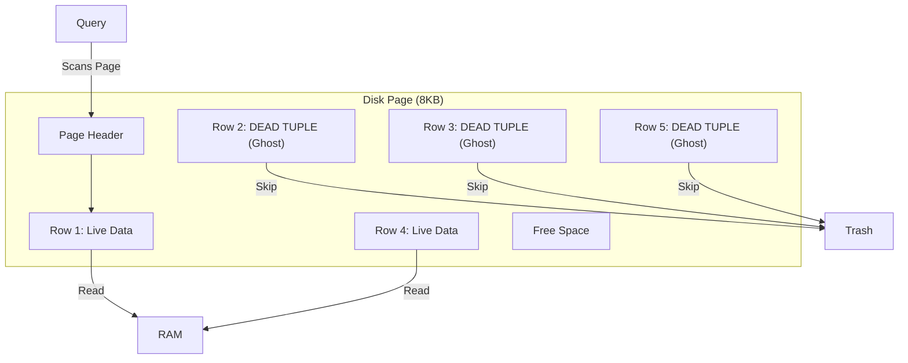
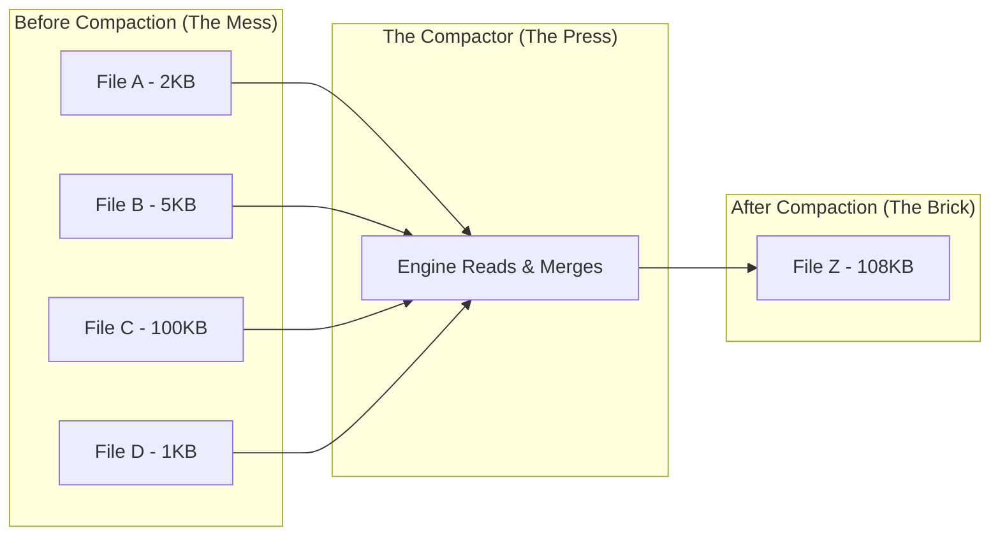

You've built a high-performance engine. You've tuned the indexes (the transmission), optimized the joins (the intake manifold), and ensured ACID compliance (the safety cage).

But there is one inevitable reality of mechanics: **things get dirty**.

Engines generate exhaust. Friction creates metal shavings. Oil breaks down into sludge. If you never change the oil or clean the filters, your Ferrari will eventually run like a riding lawnmower.

In the database world, we don't have literal sludge, but we have something just as dangerous: **Dead Tuples**.

## 10.1 Dead Tuples and Vacuuming
Here is a comforting lie that SQL tells you: When you execute `DELETE FROM users WHERE id = 10;`, the database erases that record. The bits are wiped from the disk, the file gets smaller, and the space is instantly free.

**The Reality**: The database didn't delete anything. It just put a "Do Not Disturb" sign on the row and walked away.

### The Illusion of Deletion
To understand why databases are such hoarders, we have to look at the physics of the hard drive and the logic of **MVCC**.

Imagine your database table is a physical notebook. If you want to "delete" a lien on page 5, you have two options:

1. **The Hard Way (Physical Delete)**: You get an eraser, rub out the line, and then physically shift every subsequent line up one spot to close the gap. This is incredibly slow and risky.
2. **The Easy Way (Soft Delete / Marking)**: You just draw a line through the sentence. The text is still there, but you know to ignore it.

Relational databases almost exclusively choose option 2.

When you run a `DELETE`, the database engine simply flags a bit in the row's header (often called `xmax` in Postgres jargon) effectively saying, "This row is dead to any transaction that starts after exactly precisely… NOW."

!!! note "The Mechanic's Secret"

    `UPDATE` is a lie too.

    From the engine's perspective, an `UPDATE` is just a `DELETE` followed immediately by an `INSERT`.

    If you change a user's email from `bob@aol.com` to `bob@gmail.com`:

    1. The engine marks the `bob@aol.com` row as **Dead** (Ghost).
    2. The engine creates a brand new row for `bob@gmail.com` at the end of the file.

    You now have two copies of Bob on your disk.

### Why Do We Keep Ghosts?
Why not just delete the data instantly? Because of **Time Travel** (Isolation).

Remember module 8 on ACID? While you are deleting that row, another user might be running a report that started *before* you hit delete. To maintain **Snapshot Isolation**, the user must still see the old version of the row. The database cannot overwrite the physical bits until it is 100% sure that no active transaction needs to see the "ghost" version.

### The Consequences: Table Bloat
This mechanism creates a specific performance pathology known as **bloat**.

If you have a table with 1 million rows and you update every single row, you now have a table with 2 million physical rows on the disk. 1 million are "live," and 1 million are "dead" tuples.

This runs your sleek sports car into a heavy freight train.

!!! warning "The I/O Penalty"

    The disk is blind. It reads in **pages**. It cannot selectively read only the live rows.

    If a disk page contains 1 live row and 99 dead rows, the engine must still read the entire 8 KB page from the disk into RAM just to retrieve that one piece of valid data.

    **Result:** Your queries get slower because you are wasting I/O bandwidth reading "garbage" that the CPU will just filter out anyway.

### Visualizing the Page Layout
Let's look at what a "Bloated" page looks like on the disk.



In the diagram above, the disk head has to read the entire block. The I/O cost is paid for 5 rows, but the user only gets 2 rows of value. This is low **Page Density**.

### The Solution: The Vacuum (Garbage Collection)
Since the database creates garbage, it needs a garbage collector. In Postgres, this is literally called `VACUUM`. In MySQL (InnoDB), it's handled by the "Purge Thread."

The Vacuum process does not usually shrink the file size of the table (that requires a full rewrite). Instead, it acts like a landlord inspecting an apartment after a tenant moves out.

1. **Scan**: The vacuum process scans the pages looking for dead tuples that are no longer visible to *any* active transaction.
2. **Mark**: It scrubs the data and updates the **Free Space Map (FSM)**.
3. **Reuses**: It tells the engine, "Hey, next time you need to INSERT a row, you don't need to grow the file. You can put the new data right here in slot #2."

!!! tip "Standard Vacuum vs. Vacuum FULL"

    There is a massive difference between cleaning a room and renovating it.

    - **Standard Vacuum:** Goes into the pages, marks dead rows as "reusable space." It is non-blocking. The table size on disk stays the same, but it stops growing.
    - **Vacuum FULL (or Optimize Table)**: This creates a brand new copy of the table, packs the live rows tightly together, and deletes the old file. This reclaims disk space but **locks the table exclusively**. You cannot write to the table while this is happening.

### How to Detect Bloat
You are the mechanic. You need to know if your engine is clogged with carbon deposits. You don't guess; you look at the metrics.

In a system like Postgres, you can query the internal statistics to see how many ghosts are haunting your table.

```sql
-- A look inside the engine's diagnostic port
SELECT 
    relname AS table_name, 
    n_live_tup AS live_rows, 
    n_dead_tup AS dead_rows,
    (n_dead_tup / (n_live_tup + n_dead_tup)::float) * 100 AS bloat_percentage
FROM pg_stat_user_tables
WHERE n_dead_tup > 0;
```

**Output**:

| table_name | live_rows | dead_rows | bloat_percentage |
|:---|:---|:---|:---|
| `orders` | 50,000 | 200 | 0.4% |
| `session_logs` | 100,000 | 900,000 | 90.0% |

If you see a table with 90% bloat (like `session_logs` above), your database is doing 10x more work than it needs to. Every time you scan that table, you are reading 90% garbage.

### The Mechanic's Checklist
1. **Tune Autovacuum**: Most modern databases have a background daemon that runs vacuum automatically. If you have a high-write table, the default settings are often too passive. You need to tell the janitor to come by more often.
2. **Watch out for Long Transactions**: Remember, a dead tuple cannot be vacuumed if an old transaction is still open and *might* need to see it.
    - If a developer leaves a transaction open (`BEGIN; SELECT....`) and goes to lunch for 4 hours, **Vacuum cannot clean anything deleted after that transaction started**.
3. **Avoid "Update-Heavy" patterns on Column Stores**: We discussed row vs. column stores in module 2. Column stores hate updates even more than row stores. An update in a column store often requires rewriting entire massive blocks of data.

## 10.2 Compaction (The Small Files Problem)
If "Dead Tuples" are the sludge inside the engine, **Small Files** are the clutter in the garage.

Imagine you need to read the complete works of Shakespeare.

- **Scenario A**: You are handed a single, bound book. You open it and read from start to finish.
- **Scenario B**: You are handed 5,000 sticky notes, each containing one paragraph. They are scattered all over the floor.

In Scenario B, you spend 1% of your time reading and 99% of your time picking up paper, checking the page number, and moving to the next one. This is exactly what happens to your query engine when you ignore **compaction**.

### The Physics of "Open"
Why is reading 1,000 files of 1 MB each slower than reading 1 file of 1 GB? The total data is the same.

The answer lies in the **overhead of initiation**.

In the world of physical disks, the disk head has to physically move (seek) to the start of a file.

In the world of Cloud (S3/Azure blob), "opening a file" means a network handshake.

1. **The Request**: "Hey S3, give me file `part-001.parquet`." (Latency: ~50-100 ms).
2. **The Stream**: The data starts flowing. (Bandwidth: Fast).
3. **The Stop**: The file ends.
4. **Repeat**: You do this 1,000 times.

If your files are tiny (e.g., streaming ingestion often creates a new file every few seconds), your expensive Spark cluster isn't processing data; it's just waiting on HTTP handshakes.

### The Metadata Trap (HDFS and S3)
It's not just about read speed. It's about the memory of the "Librarian."

- **HDFS (Hadoop)**: The NameNode keeps the file system tree in RAM. If you have millions of 1 KB files, you will crash the NameNode, bringing down the entire cluster.
- **S3/Object Store**: When you run a query like `SELECT * FROM logs WHERE date = '2023-01-01'`, the engine must first *list* the files in that bucket. Listing 1 million files takes a long time before the query can even begin reading data.

### The Cause: Streaming and Partitioning
How did we get here? Usually, it's **Streaming**.

If you have a Kafka stream writing to a Data Lake and you configure it to flush to disk every 10 seconds to keep data "fresh," you are creating 6 files per minute, per partition. Over a day, that's thousands of tiny fragments.

### The Solution: Compaction (Bin Packing)
Compaction is the process of taking those scattered sticky notes and binding them into a **book**.

In a database engine (like Cassandra or RocksDB) or a Table Format (like Delta Lake or Apache Iceberg), this is a background maintenance task. It reads the small files into memory, sorts them, and writes them out as one large, optimized block (usually targeting 128 MB to 1 GB).

!!! info "The Sweet Spot: 128 MB - 1 GB"

    Why do data engineers obsess over file sizes between 128 MB and 1 GB?

    - **Too Small (<10 MB)**: You suffer from "Seek" latency and poor compression (compression algorithms need a good chunk of data to find patterns).
    - **Too Big (>5 GB)**: You lose parallelism. If a file is huge, it's harder to split the work across multiple worker nodes (unless the format supports splittable blocks, which Parquet does, but huge files are still unwieldy).

### Visualizing Compaction
Let's look at how an engine like Delta Lake performs an `OPTIMIZE` command (Compaction).



### The Hidden Benefit: Sortedness & Min/Max
Compaction isn't just about gluing files together; it's a second chance to organize them.

When the compactor reads those random files, it can sort them before writing the new large file. If you sort by `customer_id`, you cluster all the data for Customer A into the beginning of the file.

Remember **Zone Maps** (module 5)? Now that the data is sorted and packed into a large file, the header metadata (min/max) becomes incredibly accurate. The engine can look at the new large file and say, "This file only contains Customers A through F. The query wants Customer Z. I can skip this entire 1 GB file."

### The Mechanic's Checklist
1. **Check your File Counts**: If your table is 1 GB but consists of 10,000 files, you have a problem.
2. **Batch your Ingestion**: If you are writing from a stream, don't write every event. Buffer them in memory or on a temporary drive and write them in chunks (e.g., every 15 minutes).
3. **Run Maintenance**:
    - **Delta Lakes**: Run `OPTIMIZE table_name` regularly.
    - **Snowflake**: Automatic clustering usually handles this, but it costs credits.
    - **Postgres**: This is less about files and more about pages, handled by `VACUUM` (see previous section).

!!! failure "The Copy-on-Write Cost"

    Compaction is not free. To merge 10 small files, you have to read them and rewrite the data. This burns CPU and Disk I/O.

    Do not run compaction every 5 minutes. You will spend more resources cleaning the garage than you spend parking the car. Schedule it for low-traffic periods (nights/weekends). 

## Quiz

<quiz>
In a database using Multi-Version Concurrency Control (MVCC), what physically happens when you execute a `DELETE` command?
- [ ] The row is physically removed from the disk page, and the file shrinks.
- [ ] The data is immediately overwritten with zeros to ensure security.
- [x] The row is marked as dead (soft deleted) but remains on the disk.
- [ ] The row is moved to a separate 'recycle bin' table immediately.

</quiz>

<quiz>
From the perspective of the database engine, how is an `UPDATE` operation typically executed?
- [ ] It locks the entire table, rewrites the file, and then unlocks it.
- [ ] It modifies the existing data in place without changing the row location.
- [ ] It writes the changes to a separate 'diff' file that is applied during read time.
- [x] It performs a `DELETE` of the old version followed by an `INSERT` of the new version.

</quiz>

<quiz>
Why do databases purposely keep 'Ghost Records' (Dead Tuples) instead of deleting them immediately?
- [x] To maintain Snapshot Isolation for concurrent transactions.
- [ ] To speed up write operations by avoiding disk seek time.
- [ ] To allow for an 'Undo' feature if the user makes a mistake.
- [ ] To fill up disk space so the operating system doesn't fragment the file.

</quiz>

<quiz>
What is the primary performance penalty caused by 'Table Bloat' (a low ratio of live rows to dead rows)?
- [x] I/O bandwidth is wasted reading pages full of garbage to find a few live rows.
- [ ] The database runs out of Transaction IDs and crashes.
- [ ] The Optimizer stops using indexes and switches to table scans.
- [ ] The CPU overheats calculating checksums for dead rows.

</quiz>

<quiz>
What is the critical difference between a standard `VACUUM` and a `VACUUM FULL` (or `OPTIMIZE TABLE`)?
- [x] Standard Vacuum marks space as reusable; Vacuum Full rewrites the file to reclaim disk space but locks the table.
- [ ] Standard Vacuum deletes data; Vacuum Full backs it up.
- [ ] Standard Vacuum runs on RAM; Vacuum Full runs on disk.
- [ ] Standard Vacuum locks the table, preventing writes; Vacuum Full allows concurrent writes.

</quiz>

<quiz>
Why is reading 1,000 files of 1 MB each significantly slower than reading a single 1 GB file, even if the total data size is identical?
- [x] The overhead of initiating network requests or disk seeks dominates the processing time.
- [ ] Large files are cached in RAM automatically, while small files are not.
- [ ] Small files cannot be compressed.
- [ ] The CPU clock speed drops when processing small files.

</quiz>

<quiz>
What is the generally accepted 'Sweet Spot' for file size in a Big Data system (like Parquet or S3)?
- [ ] 10 GB - 50 GB.
- [ ] 1 KB - 10 KB.
- [x] 128 MB - 1 GB.
- [ ] 1 TB+.

</quiz>

<quiz>
Which architecture pattern is the most common cause of the 'Small Files Problem'?
- [ ] Batch processing once a day.
- [x] Real-time streaming ingestion (e.g., Kafka to S3).
- [ ] Performing frequent `SELECT` queries.
- [ ] Using a Row Store instead of a Column Store.

</quiz>

<quiz>
Beyond just merging files, how does Compaction (specifically with sorting/clustering) improve query performance?
- [ ] It deletes all indexes to save space.
- [x] It improves the accuracy of Min/Max statistics (Zone Maps), allowing the engine to skip entire files.
- [ ] It moves the data from HDD to SSD automatically.
- [ ] It converts the data into JSON format for faster parsing.

</quiz>

<quiz>
What is a major downside or 'cost' of running compaction?
- [ ] It corrupts the transaction logs.
- [ ] It requires the database to be offline for several hours.
- [ ] It increases the amount of disk space used permanently.
- [x] It causes significant Write Amplification (Copy-on-Write).

</quiz>

<!-- mkdocs-quiz results -->

## Lab
Please complete module 10's lab in the companion GitHub repository.