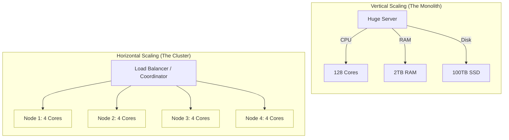
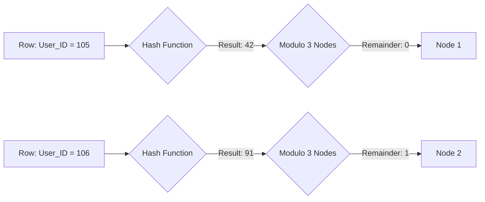
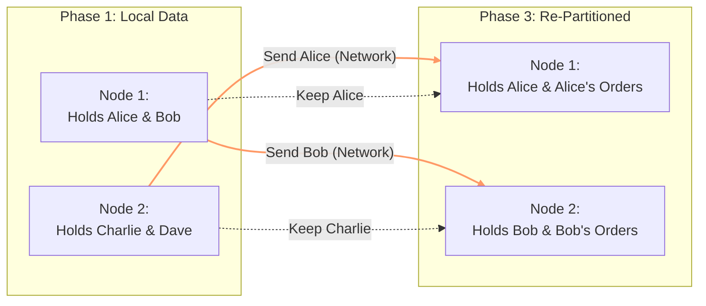
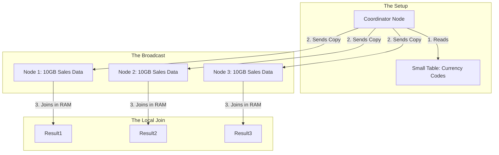

For the last ten modules, we have been obsessed with a single vehicle. We tuned the carburetor (the **Optimizer**), we organized the glovebox (the **B-Tree**), and we learned how to drive safely in traffic (**transactions**). We have squeezed every ounce of horsepower out of that engine.

But there is a law of physics we haven't hit yet: **the ceiling**.

Eventually, you will reach a point where your database server is the largest, most expensive machine money can buy. It has 128 cores. It has 4 TB of RAM. It costs more than a house. And yet, your users are still complaining that the dashboard is slow.

When you can't make the engine any bigger, you have to change the strategy. You stop building a race car, and you start building a fleet.

## 11.1 Vertical vs. Horizontal Scaling
In the architectural meetings you sit in, this is often called "Scaling Up" vs. "Scaling Out." In the mechanic's shop, we call it "Getting a Bigger Block" vs. "Buying more Trucks."

### The Vertical Climb (Scaling Up)
**Vertical Scaling** is the default instinct for most engineers. If your Postgres query is running out of memory, what do you do? You migrate the database to an AWS EC2 instance with *more* memory.

Think of this like replacing the engine in your Honda Civic with a V8, then a V12, and *finally* a jet turbine.

!!! success "The Good News: Simplicity"

    The beauty of vertical scaling is that nothing changes for the application. Your connection string points to the same IP address. Your SQL queries look exactly the same. `JOIN`s still work perfectly because all the data lives on the same hard drive. You solve the problem by writing a check to your cloud provider.

However, physics is cruel.

1. **The Cost Curve**: Hardware prices do not scale linearly. A server with 64 cores costs significantly more than *two* servers with 32 cores. You are paying a premium for the density.
2. **The Physical Limit**: Eventually, you hit the wall. You cannot buy a server with 10,000 cores. Intel and AMD physically cannot fit that many transistors on a die without it melting through the chassis.
3. **Single Point of Failure**: If you have one massive "God Server" running your entire business, and that server throws a road (or the motherboard fries), your business is closed until it's fixed.

### The Horizontal Spread (Scaling Out)
**Horizontal Scaling** is the "Postal Service" approach. When the post office gets too much mail for one truck, they don't build a truck the size of a skyscraper. They buy a second truck. Then a third.

In database terms, this means instead of one giant machine, you have a cluster of 10, 50, or 100 smaller, commodity machines (often called **Nodes**).



!!! warning "The Bad News: Complexity"

    Horizontal scaling introduces a massive headache: **Network Latency**.

    In the vertical world, if CPU Core 1 needs data from RAM, it takes nanoseconds. In the horizontal world, if Node 1 needs data that lives on Node 2, it has to send a packet across the network cables. Compared to a memory bus, the network is agonizingly slow. 

    Furthermore, who decides which truck carries which package? You now need a **Coordinator**—a traffic cop that knows where data lives.

### The Trade-Off: Shared Nothing Architecture
Most modern distributed databases (Snowflake, BigQuery, Cassandra, MongoDB) use what we call a **Shared Nothing** architecture.

- **Shared Memory**: (Vertical) All CPUs see the same RAM.
- **Shared Disk**: (Oracle RAC) Multiple computers share one giant storage array.
- **Shared Nothing**: (Horizontal) Each node has its own CPU, its own RAM, and its own Disk.

In a Shared Nothing system, the database engine isn't just a librarian anymore; it's a **Logistics Manager**. It has to break your query into pieces, ship those pieces to the specific nodes holding the relevant data, and then reassemble the results.

This solves the physics problem—you can theoretically scale to infinity by just adding more nodes—but it creates a new math problem: **How do we split the data?**

If you split the data randomly, every query has to ask every node ("Do you have this row?"). This defeats the purpose. You need a system. You need a **Sharding Strategy**, which brings us to the most dangerous decision a data engineer can make: picking the key.

## 11.2 Sharding Keys: The Art of Distribution
So you've decided to buy a fleet of 100 small servers instead of one giant mainframe. Congratulations, you have "scaled out." But now you have a logistical nightmare on your hands.

You have a table with 10 billion rows. You have 100 nodes. How do you decide which rows go to which node?

If you just deal them out like a deck of cards (Round Robin), you solve the storage problem, but you create a retrieval disaster. When you run `SELECT * FROM orders WHERE orderID = 542`, you have no idea where order 542 lives. You have to knock on 100 doors to find it. That is a **Scatter-Gather** operation, and it is the enemy of low latency.

You need a map. You need a rule that tells the database exactly where a row lives before it even looks for it. This rule is the **Sharding Key** (or Partition Key), and choosing it is the single most irreversible decision you will make.

### The Strategy: How to Slice the Cake
There are two primary ways databases split data across physical hardware.

#### 1. Range Partitioning (The Encyclopedia Method)
This is how libraries work. Volume 1 is "A-C," Volume 2 is "D-F," etc. In a database, you might share by `created_at`.

- Node 1: January data.
- Node 2: February data.
- **The Pro**: It's intuitive. Range queries are fast (`SELECT * FROM Orders WHERE date BETWEEN Jan AND Feb`, only hits Node 1 and Node 2).
- **The Con**: The "Black Friday" problem. If your business has a seasonal spike, or if everyone inserts data with `NOW()`, all the write traffic hits the last node (the "Tail"). Node 12 is melting down while Node 1-11 are idling.

#### 2. Hash Partitioning (The Blender Method)
This is the standard for distributed systems like Cassandra, DynamoDB, and often the default for data warehouses (Redshift/BigQuery).

The database takes a value (like `customer_id`), runs it through a hash function, and uses the result to assign a "bucket."

$$
\text{Bucket } = \text{ Hash(Key) } (\text{mod N_Nodes })
$$



- **The Pro**: Uniform distribution. Because hash functions are chaotic, sequential IDs like 101, 102, and 103 get scattered randomly across the cluster. No single node gets overwhelmed by write traffic.
- **The Con**: You lose range efficiency. If you want `WHERE User_ID > 100`, the data is everywhere. You have to query all nodes.

### The Disaster: Hot Spots (Data Skew)
The goal of sharding is **perfect parallelism**. If you have 10 nodes, you want your query to run 10x faster. This only works if every node has exactly 10% of the work.

**Skew** is what happens when the distribution is uneven. It is the silent killer of distributed performance.

### The "Justin Bieber" Problem
Imagine you shard a Twitter-like database by `user_id`.

- Most users have ~100 followers.
- Justin Bieber has ~100 million followers.

When you join the `Users` table to the `Followers` table, the node holding Justin Bieber's data has to process 100 million records. Meanwhile, the node holding my data processes 15 records.

The query is not finished until the **slowest** node finishes. You are paying for 100 servers, but your speed is determined by the one overworked server struggling with the Bieber partition.

!!! danger "The Null Trap"

    The most common cause of skew in data engineering isn't celebrities; it's `NULL`.

    If you choose a sharding key that is nullable (e.g., `category_id`), and 40% of your records have a `NULL` category, the hash function will send **all** 40% of those records to the exact same node (because `Hash(NULL)` always yields the same result).

    That one node will crash while the others sit empty. **Never shard on a nullable column.**

### Choosing Your Weapon
How do you pick the right key? You are looking for **High Cardinality** and **Even Distribution**.

| Candidate Key | Cardinality | Distribution | Verdict |
|:---|:---|:---|:---|
| Gender | Low (2-3 values) | Terrible | F-. You can only have 2 or 3 active nodes. |
| Zip Code | Medium | Uneven | C. NY and CA zip codes will create hot spots. |
| Timestamp | High | Sequential | D for writes (hot tail), A for time-range reads. |
| UUID / ID | Very High | Random (Perfect) | A+ for distribution, but bad for range queries. |

When you shard, you are making a deal with physics. You are trading the ability to scan ranges (Sequential I/O) for the ability to write in parallel (Throughput). If you pick the wrong key, you don't get a cluster; you get one sweating server and 99 expensive spectators.

But what happens when you need to join data that lives on Node 1 with data that lives on Node 50? They can't just share memory. They have to talk.

### Storage Skew vs. Execution Skew
While on the topic of skew. It is vital to distinguish between data being stored unevenly and data being processed unevenly.

#### 1. Storage Skew (Data at Rest)
This is the Justin Bieber situation. When your initial partitioning strategy is flawed.

- **Example**: You partition your data lake by `country`.
- **The Physics**: You have 100 partitions. The `US` partition is 500 TB. The `Liechtenstein` partition is 5 KB.
- **The Result**: When you read this data, the reader assigned to the `US` folder has to read 500 TB, while the others finish instantly.

#### 2. Execution Skew (Data in Motion)
This is sneakier. Your data might be stored perfectly evenly (e.g., in 128MB Parquet blocks). But then you run a transformation—a `JOIN` or a `GROUP BY`—that triggers a Shuffle.

You will learn next that a Shuffle reorganizes data based on a key. The engine uses a hash function (`hash(key) % num_reducers`) to decide where data goes. For now, understand the bullet points below:

- If that key has low cardinality or high dominance, the laws of probability break down.
- **The Null Trap**: You LEFT JOIN two tables on user_id. But 40% of your log entries have a NULL user_id.
- **The Mechanics**: The engine hashes NULL. Every single row with NULL is sent to the exact same partition ID (e.g., Partition 42).
- **The Crash**: Partition 42 receives 40% of the entire dataset. It runs out of RAM and spills to disk (see Chapter 7.4), effectively grinding to a halt.

## 11.3 The Shuffle
You have sharded your data perfectly. You have pruned away the files you don't need. You are feeling good.

Then you write a query like this:

```sql
SELECT
    u.Region,
    SUM(o.Amount)
FROM Users u
JOIN Orders o ON u.UserID = o.UserID
GROUP BY u.Region;
```

And suddenly, the cluster grinds to a halt. The fans spin up to maximum volume. The progress bar freezes at 99%.

You have just triggered a **shuffle**.

In a distributed system, operations like `JOIN` or `GROUP BY` require data that shares a key to be physically located on the same machine. But your data is scattered. User `Alice` might be on Node 1, but her `Orders` might be on Node 5.

To answer the query, the database cannot just read; it has to move. It has to reorganize the entire dataset on the fly.

### The Great Exchange
Think of a shuffle like a chaotic card game. You have 100 players (Nodes) sitting in a circle. Each player holds a stack of mixed cards. The goal is to get all the "Hearts" to Player 1, all the "Spades" to Player 2, and so on.

At the exact same moment, every player stands up and starts throwing cards across the table to the correct destination.

1. **The Hash**: Each node reads its local data. For every row, it calculates which node *should* own that row based on the Join Key (`UserID`).
2. **The Send**: The node packs those rows into buffers and blasts them over the network.
3. **The Receiver**: Simultaneously, every node is receiving buffers from every *other* node.



This is an **All-to-All** communication pattern. If you have 100 nodes, you theoretically have 10,000 network connections opening at once.

### Why It Hurts (The Physics)
In the hierarchy of speed, the Network is the snail.

- **Ram**: ~20 GB/sec
- **Disk (NVMe)**: ~3 GB/sec
- **Network (10 GbE)**: ~1 GB/sec

When you shuffle, you are forcing your data through the thinnest pipe in the infrastructure. But the speed isn't the only cost.

#### 1. Serialization (The Packing Cost)
You cannot just shoot a Java object or a C++ struct over a wire. You have to serialize it into raw bytes (Protobuf, Avro, etc.). Then, the receiving node has to deserialize it back into memory. This burns CPU cycles just to pack and unpack the boxes.

#### 2. The Spill (The RAM Killer)
This is the most common reason for a crash. Node 1 is receiving data from 99 other nodes. It has to store that incoming data in RAM to sort it for the join. If the incoming data is larger than the available RAM, the node panics. It has to start writing that temporary data to its local disk (**Spilling**).

Now you have taken a slow network operation and added a slow disk operation on top of it. This is the "Death Spiral" of distributed queries.

!!! abstract "Reading the Plan"

    In a query plan (like Spark UI or Snowflake Profile), a shuffle is often labeled as:

    - **Exchange** (Postgres/SQL Server)
    - **ShuffleExchange** (Spark)
    - **Redistribute** (Legacy Data Warehouses)

    If you see thick arrows or high costs associated with an `Exchange` node, this is your bottleneck.

The shuffle is the price we pay for distributed computing. It is unavoidable in many cases, but it is expensive. Your goal as an engineer is to delay it, minimize it, or—if you are clever—eliminate it entirely.

How do you eliminate it? Broadcast Joins are one such way, and we learn that next.

## 11.4 Broadcast Joins: Cheating Physics
In the previous section, we established that the shuffle is the heavy toll booth on the highway of distributed computing. If you join two 1 TB tables, you simply have to pay the toll. There is no way around moving that mass.

But what if you are joining a 1 TB table (like `Sales`) to a 10 KB table (like `CurrencyCodes`)?

If you follow the standard shuffle rules, the database will dutifully hash the 1 TB table and the 10 KB table and send them both over the network. It's like renting a fleet of semi-trucks to transport a single envelope. It is a waste of fuel, time, and money.

There is a loophole. It is called the **Broadcast Join** (or "Map-Side join" in the Hadoop era).

### The Strategy: The Backpack
Instead of moving the mountain (the large table) to  meet the climber (the small table), we clone the climber.

The coordinator node takes the small table, wraps it up into a compact binary package (a "Broadcast variable"), and sends a copy to **every single worker node**.

Now, every node has the *entire* `CurrencyCodes` table sitting in its local RAM.



**The Payoff**: The 1 TB `Sales` table never moves. It stays right where it is on the disk. The join happened locally, in memory, at lightning speed. You have eliminated 99.9% of the network traffic.

### The Math: When to Broadcast
The Optimizer (the brain we discussed in module 6) has to make a calculated bet. It compares the cost of moving the big table vs. the cost of replicating the small one. If you have 100 nodes, broadcasting a table effectively multiplies its network size by 100.

- **Small Table (1 MB)**: 1 MB $\times$ 100 = 100 MB. This is cheap. **DO IT**.
- **Medium Table (1 GB)**: 1 GB $\times$ 100 = 100 GB. This is expensive. The Optimizer will likely choose to shuffle instead.

### The Danger Zone: Exploding the Cluster
Broadcast joins rely on one critical assumption: **The small table fits in RAM**.

When you broadcast a table, you are forcing every single node to load that entire table into its memory.

!!! danger "The OOM Killer"

    If you force a Broadcast Join on a table that is too big (e.g., you think it's small, but it's actually 5 GB), you will crash every node in your cluster simultaneously.

    They will all receive the package, try to unzip it into RAM, run out of space, and throw an `OutOfMemoryError`. This is a spectacular way to bring down production.

    - **Spark:** Controlled by `spark.sql.autoBroadcastJoinThreshold` (default is usually 10 MB).
    - **Warehouses (Snowflake/BigQuery):** Usually handle this automatically but can still spill to disk if the "small" table is deceptively large.

## Quiz

<quiz>
According to the text, what is the primary limitation or 'law of physics' that eventually forces a shift from Vertical to Horizontal scaling?
- [ ] The inability of software to utilize more than 64 cores.
- [ ] The network latency introduced by having too much RAM in a single machine.
- [x] The physical limit of hardware capacity and the non-linear cost of high-end components.
- [ ] The database engine's inability to manage transactions on a single server.

</quiz>

<quiz>
What is the specific architecture trade-off introduced when moving from vertical scaling to horizontal scaling?
- [ ] You eliminate the need for a Coordinator node but increase hardware costs.
- [x] You gain theoretically infinite scale but introduce network latency and complexity.
- [ ] You lose the ability to use SQL.
- [ ] You gain simplicity but lose storage capacity.

</quiz>

<quiz>
Most modern distributed databases use a 'Shared Nothing' architecture. What characterizes this approach?
- [ ] Nodes share nothing except the network cables and the power supply.
- [ ] Multiple nodes share a single giant storage array (SAN) but have their own CPUs.
- [ ] All nodes share the same RAM pool to allow for fast memory access.
- [x] Each node acts independently with its own private CPU, RAM, and Disk.

</quiz>

<quiz>
You choose to shard your database using Range Partitioning based on a `created_at` timestamp. What is the major downside of this strategy described as the 'Black Friday' problem?
- [ ] Data is scattered randomly, making retrieval difficult.
- [ ] Queries for a specific date range will be extremely slow.
- [ ] It requires a hash function that consumes excessive CPU cycles.
- [x] All new write traffic hits the single node responsible for the current time period, creating a hot spot.

</quiz>

<quiz>
Which Sharding Key strategy is described as 'The Blender Method' and provides uniform distribution at the cost of range query efficiency?
- [x] Hash partitioning.
- [ ] Directory-based partitioning.
- [ ] Range partitioning.
- [ ] Round Robin partitioning.

</quiz>

<quiz>
The text warns of a 'Null Trap' that causes massive data skew. Why does sharding on a nullable column often lead to a node crash?
- [ ] It forces the system to switch from Hash Partitioning to Range Partitioning automatically.
- [ ] The database simply deletes rows with NULL keys, resulting in data loss.
- [ ] NULL values cause the hash function to throw an error and stop the query.
- [x] The hash function sends every row with a NULL key to the exact same partition.

</quiz>

<quiz>
What physically happens during a 'Shuffle' operation triggered by a `JOIN` or `GROUP BY`?
- [ ] The database deletes temporary tables to free up RAM for the operation.
- [ ] Data is compressed and stored locally on each node to save bandwidth.
- [ ] The Coordinator node reads all data, sorts it, and sends it back to the workers.
- [x] Every node calculates which node should own each row and simultaneously sends that data across the network.

</quiz>

<quiz>
Why is the 'Shuffle' considered the 'Death Spiral' of distributed queries when memory is exhausted?
- [ ] It creates a deadlock where no node can send data until it receives data.
- [ ] It causes the bandwidth cables to overheat and throttle bandwidth.
- [x] It forces the system to spill data to the local disk, adding slow disk I/O on top of slow network I/O.
- [ ] It triggers a Broadcast Join which multiplies network traffic by the number of nodes.

</quiz>

<quiz>
How does a Broadcast Join (or Map-Side Join) 'cheat physics' to avoid a shuffle?
- [ ] It sends the large table to the node holding the small table.
- [x] It copies the small table to every single worker node, allowing the join to happen locally in RAM.
- [ ] It uses a specialized hardware bus to bypass the network entirely.
- [ ] It compresses the data so tightly that it fits into the CPU cache.

</quiz>

<quiz>
What is the primary risk of forcing a Broadcast Join on a table that is larger than you think?
- [ ] It will corrupt the data because of consistency errors during replication.
- [ ] The query will revert to a shuffle and take longer to plan.
- [ ] The data will be skewed, causing one node to work harder than the others.
- [x] It will cause an OutOfMemoryError (OOM) and crash every node in the cluster simultaneously.

</quiz>

<!-- mkdocs-quiz results -->

## Lab
Please complete module 10's lab in the companion GitHub repository.