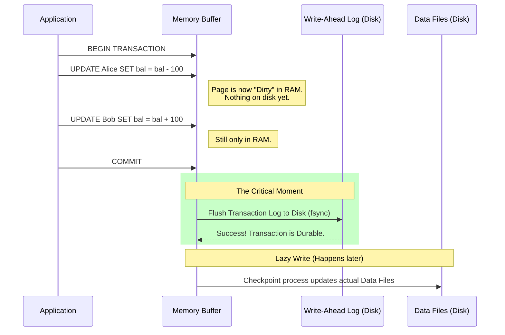

Welcome to the safety features of the engine. Until now, we've been obsessed with speed—how to rip through terabytes of data like a sports car tearing down the autobahn. But speed without brakes is just a crash waiting to happen.

In the database world, a "crash" isn't just an error message. It's corruption. It's money leaving one bank account but never arriving in the other. It's a flight booking that sold the last seat to two different people.

To prevent this chaos, we rely on **ACID**. It's the seatbelt, the airbag, and the crumple zone all rolled into one. And it starts with the most fundamental rule of existence: **Atomicity**.

## 8.1 The All-or-Nothing Rule (Atomicity)
In physics, an "atom" was originally theorized as the smallest unit of matter that could not be divided (Greek atomos, "uncuttable"). In database engineering, **Atomicity** means the exact same thing.

A transaction is a collection of operations that the database treats as a single unit of work. It is indivisible. Either **all** of the changes happen, or **none** of them  happen. There is no middle ground. There is no "I updated the first row, but then the server caught fire before I could update the second row."

If the server catches fire halfway through, the database must wake up, look at the mess, and act like the first update never happened.

### The Illusion of "Saving"
To understand how this works, you have to unlearn how you think computers save data. When you edit a Word document and hit "Save," you imagine the computer overwriting the file on the hard drive.

If databases worked like that, they would be incredibly fragile.

Imagine a simple money transfer:

1. Subtract $100 from Alice.
2. Add $100 to Bob.

If the power plug is pulled after step 1 but before step 2, Alice is $100 poorer, Bob is no richer, and the money has vanished into the ether. The database state is now **inconsistent**.

### The Mechanic's Solution: The Write-Ahead Log (WAL)
To solve this, database engineers invented the **Write-Ahead Log (WAL)**.

!!! info "The Golden Rule of Reliability"

    **Log first. Data later."

    Before the database engine is allowed to touch the actual data files (the "Heap" or the B-Trees we discussed earlier), it **must** write a record of what it *intends* to do to a sequential log file on the disk.

The WAL is the "Black Box" flight recorder of the database. It is a strictly append-only file. It doesn't care about rows or columns; it cares about history.

Here is what actually happens physically when you run the transfer transaction:



Notice the trick? When you hit `COMMIT`, the database **did** not update the main data files (the `.mdf` or `.ibd` files). It only ensured the **Log** was safely written to the physical spinning disk (using a system call `fsync` to bypass the OS cache).

Writing to the log is fast because it is **Sequential I/O**. The head of the disk drive doesn't need to jump around; it just writes to the end of the file.

### COMMIT: The Point of No Return
The `COMMIT` command is the trigger. Until you send this command, your changes exist only in a temporary memory workspace (often called a rollback segment or undo buffer). Other users cannot see them.

When you issue `COMMIT`:

1. The database gathers **all** the log records for your transaction.
2. It flushes them to the WAL on the disk.
3. **Only after the disk confirms the write** does the database report "Success" to your client.

If the power fails *before* the WAL write finishes? The database restarts, sees an unfinished entry in the log, and ignores it. It's as if you never typed a thing.

If the power fails *after* the WAL write finishes but *before* the data files are updated? The database restarts, reads the WAL, sees that you committed, and **replays** the changes into the data files. This is called **Crash Recovery**.

### ROLLBACK: The "Undo" Button
What if you make a mistake? You subtracted money from Alice, but then realized Bob's account number doesn't exist.  You issue a `ROLLBACK`.

`ROLLBACK` is the engine's way of scrubbing the memory clean.

- **In Memory**: The database marks the pages you modified as "invalid" or reverts them to their previous state using an "Undo Log" (a separate structure designed specifically for reversing changes).
- **On Disk**: It writes a record to the WAL saying "TransactioN X aborted."

!!! warning "The Cost of a Rollback"

    You might think `ROLLBACK` is free because "nothing happened." Physically, it can be expensive! The database had to do work to maintain the undo logs and lock the rows you were touching. Rolling back a massive transaction (e.g., deleting 1 million rows and then changing  your mind) can take a long time because the engine has to physically reverse the changes in memory and release all the locks.

### Debugging with `EXPLAIN` and Logs
While `EXPLAIN` usually shows query cost, understanding transactions requires looking at your database's lock monitor or active transaction list.

If a query seems to hang forever, it's often not "slow"—it's **blocked**.

```sql
-- Hypothetical view of an open transaction blocking others
SELECT 
    pid, 
    usename, 
    state, 
    query, 
    age(clock_timestamp(), query_start) as duration
FROM pg_stat_activity 
WHERE state = 'idle in transaction';
```

A status of `idle in transaction` is the mechanic's nightmare. It means someone opened a hood (started a transaction), took apart the engine (acquired locks), and then went to lunch without putting it back together (`COMMIT`).

## 8.2 Isolation Levels
If you were the only person using the database, Atomicity would be enough. But you aren't.

In a production environment, hundreds of connections pound the engine simultaneously. The "I" in ACID stands for **Isolation**. It defines the rules of engagement when multiple transactions try to read and write the same data at the same time.

Think of isolation as the **suspension system** of your car.

- **Low Isolation**: A stiff racing suspension. You feel every bump (change) on the road immediately. It's fast, but **jarring**.
- **High Isolation**: A luxury sedan. You are insulated from the outside world. The road could be crumbling (data changing wildly), but inside your cabin, everything looks smooth and static.

The database engine offers you a knob to adjust the suspension. It is a direct trade-off between **Consistency** (Accuracy) and **Concurrency** (Speed).

### The Spectrum of Truth
Most engineers assume the database always shows "the truth." But in a high-concurrency system, "truth" is relative to *when* you ask.

There are four standard levels of isolation defined by the SQL standard. As we move down the list, safety increases, but performance (throughput) decreases.

| Isolation Level | The Analogy | Dirty Reads? | Non-Repeatable Reads? | Phantom Reads? |
|:---|:---|:---|:---|:---|
| Read Uncommitted | The Wild West | Yes | Yes | Yes |
| Read Committed | The Morning Newspaper | No | Yes | Yes |
| Repeatable Read | The Photograph | No | No | Yes |
| Serializable | The Single-File Line | No | No | No |

#### 1. Read Uncommitted (The "Dirty" Level)
This is the lowest level of isolation. Here, the database engine takes the "Locks? What locks?" approach.

If Transaction A is updating a row but hasn't committed yet (the data is dirty), Transaction B can still read it.

- **The Scenario**: You run a query to calculate total sales. Halfway through your scan, another user inserts a huge order but hasn't hit `COMMIT` yet.
- **The Result**: Your report includes that huge order.
- **The Risk**: The other user hits `ROLLBACK`. The order never actually happened. Your report is now a lie.

**Why Use It?** It is blazing fast because readers rarely block writers. It's useful for rough estimates (e.g., "Give me row count; I don't care if it's off by 1%").

#### 2. Read Committed (The Industry Standard)
This is the default setting for **PostgreSQL**, **SQL Server**, **Oracle**, and most modern engines.

The rule is simple. **You can only see data that has been physically committed**.

- **The Scenario**: You query a row. Another user is currently updating that row.
- **The Mechanism**: The database will not let you see the new version until the other user types `COMMIT`. Depending on the database, your query will either wait (Locking) or read the previous version of the row (MVCC).
- **The Catch (Non-Repeatable Read)**: If you run `SELECT * FROM Others` at 12:00:00, you see 10 orders. If you run the exact same query at 12:00:01, you might see 11 orders, because someone committed a transaction in that one second. The data changed *under your feet*.

#### 3. Repeatable Read (The Snapshot)
This is the default for **MySQL (InnoDB)**.

This level guarantees that if you read a row once, you will see the exact same data if you read it again, *even* if someone else changes it and commits in the meantime.

- **The Mechanism**: When you start a transaction, the database takes a metaphorical "photo" of the data. For the duration of your transaction, you are looking at that photo, not the live data.
- **The Physics**: The engine must keep old versions of rows around just for you (we will cover this in "MVCC" later).
- **The Catch**: You are living in the past. The "truth" on the disk might have drifted away from the "truth" in your snapshot.

#### 4. Serializable (The Strict order)
This is the nuclear option. It emulates a world where transactions happen one at a time, in a single-file line (Serial), rather than in parallel.

- **The Mechanism**: To achieve this, the database has to be paranoid. It doesn't just lock the rows you read; it locks the *gaps* between the rows (Predicate Locking) to ensure nobody inserts new data that matches your query.
- **The Cost**: If two transactions touch even remotely related data, one will likely be blocked or killed with a "Serialization Failure" error.
- **The Reality**: Almost no one runs at this level in production because it crushes throughput (Concurrency). It turns your multi-lane highway into a one-lane dirt road.

### Visualizing the Trade-off
The "No Magic" reality is that **Isolation is expensive**.

- **CPU Cost**: Managing versions of rows takes cycles.
- **Memory Cost**: Keeping old data in RAM for "Repeatable Reads" eats buffer space.
- **Locking Cost**: "Serializable" leads to massive blocking, where threads sit idle waiting for others to finish.

!!! tip "Know Your Defaults"

    Don't assume the database is safe.

    - **Postgres** defaults to `Read Committed`. You *can* see data change between two queries in the same transaction.
    - **MySQL** defaults to `Repeatable Read`. You generally won't see changes.
    - **Snowflake/BigQuery** (OLAP) often only supports `Read Committed` (Snapshot Isolation) because they are designed for massive reads, not concurrent updates.

### Setting the Level
You don't have to restart the database to change this. You can usually set it per session or per transaction.

```sql
-- Standard SQL syntax
SET TRANSACTION ISOLATION LEVEL SERIALIZABLE;

BEGIN;
-- Now operating in paranoid mode
SELECT SUM(salary) FROM employees;

COMMIT;
```

If you execute the above, be prepared for the database to throw an error: `ERROR: could not serialize access due to concurrent update`. This is the engine telling you, "I couldn't maintain the illusion of a single-file line, so I kicked you out of the line."

## 8.3 Dirty Reads and Phantom Rows
In the previous section, we talked about isolation levels as abstract settings—knobs on a dashboard. Now, let's look at what happens when you turn those knobs the wrong way.

These aren't just "errors." They are **Concurrency Phenomena**. They are logical glitches in the matrix that occur because multiple threads are fighting over the same physical bytes on the disk or in memory.

If you are a data engineer building ETL pipelines, these bugs are the reason your numbers don't add up, even though your SQL logic is "perfect."

### The Dirty Read (Reading the "Maybe")
A **Dirty Read** occurs when you read data that hasn't been committed yet.

- **The Physical Reality**: When a transaction updates a row, it modifies the page in the Buffer Pool (RAM). That page is now marked "Dirty." In the same world (Read Committed), the database engine forces you to ignore the dirty page and look at the "clean" version (either via locks or undo logs).
    - But if you are running at `READ UNCOMMITTED`, the engine removes the safety guards. It lets your query scan the buffer pool and grab whatever bits are currently there, regardless of the transaction state.
- **The Glitch**:
    1. **Transaction A** begins transferring $1,000,000 to an account. It updates the balance in memory.
    2. **Transaction B** (your ETL job) wakes up, scans the table, sees the extra million, and writes it to your data warehouse.
    3. **Transaction A** crashes or hits `ROLLBACK`. The million dollars never existed.
    4. **Result**: Your data warehouse reports revenue that never happened. You have ingested a ghost.

### The Non-Repeatable Read (The Shapeshifter)
This is subtle. It happens when you read a **specific row** twice in the same transaction but get different values.

- **The Scenario**: You are running a validation script.
    1. `SELECT status FROM jobs WHERE id = 100;` --> Returns `RUNNING`.
    2. You do some Python logic (sleep 5 seconds).
    3. `SELECT status FROM jobs WHERE id = 100;` --> Returns `FAILED`.
- **The Physics**: Between your two reads, another transaction accessed the B-Tree page containing ID 100, updated the bits, and committed. Because your isolation level was only `READ COMMITTED` (the default in Postgres/SQL Server), the database didn't promise to freeze time for you. It only promised to show you committed data. The data was committed; it just changed while you were blinking.

### The Phantom Read (The Ninja)
This is the one that confuses everyone. It sounds like a Non-Repeatable Read, but there is a critical distinction. **Non-Repeatable Reads affect *existing* rows. Phantom Reads affect the *set* of rows**.

Phantoms occur when you run a **Range Query** twice and get different *counts of rows*.

- **The Scenario**:
    1. **Transaction A (You)**: `SELECT * FROM employees WHERE salary > 100k;` (Result: 5 people).
    2. **Transaction B (HR)**: `INSERT INTO employees (name, salary) VALUES ('New Guy', 120k);` COMMIT.
    3. **Transaction A (You)**: `SELECT * FROM employees WHERE salary > 100k;` (Result: 6 people).
- **The Physics of the Flaw**: Why couldn't the database stop this? You locked the rows you found!
    - When you ran the first query, the database locked the 5 specific index entries it found. **It did not lock the empty space**.
    - In a B-Tree, the "space" between keys is open territory. Transaction B slipped into the "gap" between existing records and inserted a new leaf node. Your locks were on the physical rows, not the **logical** concept of `salary > 100k`.

!!! failure "Why Data Engineers Hate Phantoms"

    Imagine you are reading a table to copy it to S3. You read page 1, then page 2. While you are reading, an `INSERT` adds a row to page 1 (which you've already finished) or shifts rows around due to a page split. You might miss the row entirely or read it twice. Phantoms are why "consistent snapshots" (Repeatable Read or higher) are mandatory for reliable backups and replication.

### The "No Magic" Solution
How do we fix Phantoms without stopping the world with `SERIALIZABLE`?

Modern databases (Postgres, Oracle, InnoDB) use **MVCC (Multi-Version Concurrency Control)**, which we will dissect in the next module. Instead of locking the gaps, they let you view an old "Snapshot" of the database. Even if a new kid walks into the class, your snapshot still shows the empty chair.

## Quiz

<quiz>
In the context of database transactions (ACID), what does 'Atomicity' guarantee?
- [ ] Transactions happen in a specific order, one after another.
- [x] All operations in a transaction either complete successfully or none of them apply.
- [ ] Multiple users can read the same data without blocking each other.
- [ ] Data is permanently saved to disk immediately upon entry.

</quiz>

<quiz>
Why do databases write to a Write-Ahead Log (WAL) before updating the actual data files?
- [ ] It allows the database to skip the `COMMIT` phase entirely.
- [x] Writing sequentially to a log is significantly faster than random access writes to data files.
- [ ] The WAL is encrypted, whereas data files are not.
- [ ] The WAL compresses data better than standard tables.

</quiz>

<quiz>
A 'Dirty Read' occurs when a transaction reads data that:
- [x] Has been modified by another transaction but not yet committed.
- [ ] Has been committed but not yet backed up.
- [ ] Is older than the current version in memory.
- [ ] Contains NULL values.

</quiz>

<quiz>
Which isolation level is the lowest (least restrictive) and allows Dirty Reads?
- [ ] Read Committed.
- [x] Read Uncommitted.
- [ ] Serializable.
- [ ] Repeatable Reads.

</quiz>

<quiz>
What distinguishes a 'Phantom Read' from a 'Non-Repeatable Read'?
- [ ] Phantom Reads occur when reading NULL values.
- [x] Non-Repeatable Reads involve updates to existing rows; Phantoms involve the insertion or deletion of rows affecting a range.
- [ ] Non-Repeatable Reads cause database crashes, while Phantoms do not.
- [ ] Phantom Reads only happen in NoSQL databases.

</quiz>

<quiz>
If you are using the 'Read Committed' isolation level (default in Postgres), what happens if you run the exact same `SELECT` query twice in one transaction?
- [ ] The database will throw an error.
- [ ] The second query will read from the Write-Ahead Log.
- [x] You might see different data if another user committed changes between your two queries.
- [ ] The database guarantees the results will be identical.

</quiz>

<quiz>
Physically, what does executing a `ROLLBACK` command entail for the database engine?
- [ ] It deletes the entire table and restores it from yesterday's backup.
- [ ] It deletes the Write-Ahead Log file.
- [ ] It does nothing because the data was never saved.
- [x] It uses Undo Logs to reverse changes in memory and releases locks.

</quiz>

<quiz>
Which isolation level emulates single-threaded execution, ensuring no concurrency anomalies occur?
- [ ] Read Committed.
- [ ] Repeatable Read.
- [ ] Snapshot Isolation.
- [x] Serializable.

</quiz>

<quiz>
What is the primary performance drawback of the 'Serializable' isolation level?
- [ ] It allows Dirty Reads, which confuses users.
- [x] It dramatically reduces concurrency due to blocking and serialization failures.
- [ ] It uses too much hard drive space.
- [ ] It disables the Write-Ahead Log.

</quiz>

<quiz>
Why do modern databases use MVCC (Multi-Version Concurrency Controls) instead of simple locking?
- [ ] To eliminate the need for a Write-Ahead Log.
- [x] To allow readers to not block writers and writers to not block readers.
- [ ] To save disk space.
- [ ] To ensure all queries run in $O(1)$ time.

</quiz>

<!-- mkdocs-quiz results -->

## Lab
Please complete module 8's lab in the companion GitHub repository.