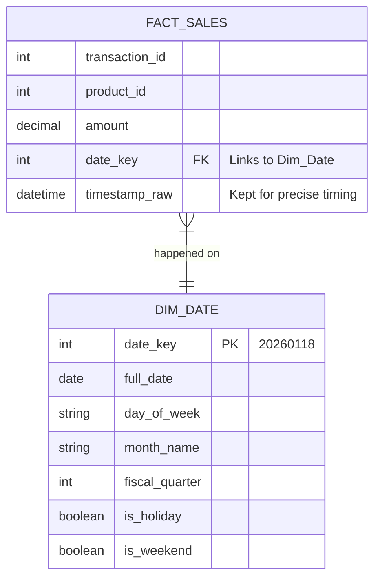

If you ask the CEO, "What is our most valuable asset?" they might point to the darker-roast beans imported from Sumatra or perhaps the $20,000 espresso machine in the flagship store.

But if you ask the data engineer the same question, the answer is boring, precise, and universally true across every industry: **time**.

Every single dashboard, report, and executive summary is filtered by time. "How many lattes did we sell *last week*?" "How does Q3 compare to *last year's* Q3?" "Do we sell more cold brew on *holidays*?"

In the previous modules, we talked about dimensions as the "nouns" of our world (Customers, Products, Stores). Time is unique. It is the canvas upon which all other events are painted.

## 10.1 The Most Important Dimension
Novice data engineers often look at the raw transaction data coming from the Point of Sale system, see a timestamp column, and think, "Great, I have a date. I'm done."

**You are not done**. In fact, relying on raw timestamps is one of the most common mistakes in warehouse design. To build a robust warehouse, you need to treat time not as a value but as a distinct **dimension table**.

### The Timestamp Trap
Let's look at a raw transaction from the Omni-Coffee POS system. When a barista rings up a 'Caramel Macchiato,' the application database records it like this:

**Raw Transaction (OLTP)**:

| transaction_id | product_id | amount | timestamp_utc |
|:---|:---|:---|:---|
| 99821 | 402 | 5.50 | 2026-01-18 09:29:51 |

This is efficient for the application. It captures the exact moment the sale happened. But now, imagine the VP of Sales asks you a question:

> "Show me total revenue for **all weekends in Fiscal Quarter 1**, excluding **federal holidays**."

If you only have that `timestamp_utc` column, you have a problem. To answer this query, your database has to perform complex calculus on the fly for every single row of data:

1. Extract the day of the week from the timestamp.
2. Check if the day is Saturday or Sunday.
3. Calculate if the date falls between Jan 1 and March 31 (Fiscal Q1).
4. **The Hard Part**: Check if that specific date is a Federal Holiday.

SQL—and computers in general—are excellent at math. They are terrible about knowing that the third Monday in January is Martin Luther King Jr. Day. SQL doesn't know about Christmas, Thanksgiving, or the fact that your company's fiscal year starts in February, not January.

If you force the database to calculate this logic every time someone runs a report, you are choosing **Maintenance Pain** and **Slow Queries**.

### The Solution: `Dim_Date`
The solution is to pre-calculate all the logic once, store it in a table, and never think about it again. This is the **date dimension** (often called `Dim_Date`).

Instead of asking the database to *calculate*, "Is this a holiday?", we simply *look up* the answer.

We create a table where **one row equals one day**. We populate this table for the next 10 or 20 years. Even if we go out 50 years, that's only about 18,000 rows. In the world of Big Data, a table with 18,000 rows is microscopic. It is effectively "free" storage.

Here is what the **Omni-Coffee Date Dimension** looks like:

**Table: `Dim_Date`**

| Date_Key | Full_Date | Day_Name | Month_Name | Quarter | is_Weekend | is_Holiday | Season |
|:---|:---|:---|:---|:----|:---|:---|:---|
|20260116|2026-01-16|Friday|January|Q1|false|false|Winter|
|20260117|2026-01-17|Saturday|January|Q1|true|false|Winter|
|20260118|2026-01-18|Sunday|January|Q1|true|false|Winter|
|20260119|2026-01-19|Monday|January|Q1|false|true|Winter|

!!! tip "The Smart Key"

    Notice the `Date_key` (20260118). This is an **integer**, not a date type. In most cases, I advocate for meaningless surrogate keys (1, 2, 3, … ), but the Date dimension is the one exception where a "Smart Key" is acceptable and actually preferred by many architects. An integer formatted as `YYYYMMDD` is human-readable and sorts naturally.

### Connecting the Wires
Now, we modify our fact table. Instead of just a raw timestamp, we add a Foreign Key pointing to our new dimension.



Now, when the VP of Sales asks that complicated question about "Weekend Sales in Fiscal Q1 excluding Holidays," the query becomes incredibly simple. We just filter the `Dim_Date` table where:

- `is_Weekend = true`
- `Fiscal_Quarter = 1`
- `is_Holiday = false`

We then join the small list of dates to the fact table. The database doesn't have to do any math. It just matches integers. It is blazingly fast.

### Why This is "The Most Important" Dimension
You might be thinking, "Can't I just use a fancy SQL function to get the Fiscal Quarter?"

You can. But you shouldn't. Here is the trade-off analysis:

#### 1. The Single Source of Truth
If you let analysts calculate "Fiscal Quarter" in their SQL queries, someone will eventually mess it up.

- Analyst Alice writes, `CASE WHEN month >= 1 ...`.
- Analyst Bob writes, `CASE WHEN month > 1 ...`.

Suddenly, your reports don't match. By putting this logic in `Dim_Date`, you define the business rules **once**. If the company decides to change the definition of the Fiscal Year, you update the table, and every dashboard updates automatically.

#### 2. Filtering on the Impossible
SQL functions cannot handle arbitrary business concepts.

- **"The Holiday Season"**: This might be defined as "The day after Thanksgiving up to Christmas Eve." There is no SQL function for that. You have to flag those specific rows in your table.
- **"Semesters"**: If you are modeling university data, "Spring Semester" dates change every year. You can't calculate this; you have to record it.

#### 3. Performance (Integers vs. Dates)
Computers love integers. Joining two tables on the number `20260118` is computationally cheaper than parsing a Date object, extracting a month, and grouping by a string. In massive fact tables (billions of rows), this micro-optimization adds up to minutes of saved query time.

!!! warning "Don't Delete the Timestamp"

    Just because we have a `Date_key` doesn't mean we delete the original `timestamp_utc` from the fact table. We often keep both. The `Date_Key` is for grouping and filtering (analysis). The timestamp is for precise event ordering or calculating duration (e.g., "Time between order and delivery").

### The Verdict
In Set Theory, we learned that a Set is a collection of distinct objects. The `Dim_Date` table is simply the **Set of All Days** relevant to your business.

By materializing time into a physical table, we transform a complex calculation problem into a simple storage solution. We make our queries readable, our definitions consistent, and our database fast.

## 10.2 Enriching Time
We have established that a date is not just a timestamp—it is an object. In Set Theory terms, a date is an element in a set. But in dimensional modeling, an element is useless if we don't know anything about it.

If your `Dim_Date` table only contains a list of dates like `2026-01-01`, `2026-01-2`, and so on, you have essentially built a costly calendar that tells you nothing you couldn't find on your phone.

The true power of the date dimension comes from **enrichment**. We are going to take that single date and attach every conceivable attribute the business might use to slice, dice, or group their data. We will make this table **wide**.

### The Fiscal Reality
Let's go back to Omni-Coffee. It's January 2nd. The New Year has just begun. The confetti is still on the floor. You, the data engineer, are feeling fresh.

But the CFO walks in looking stressed. "I need the Q4 reports," he says.

"Q4?" you ask. "But it's January. Q4 ended in December."

He shakes his head. "No. Omni-Coffee runs on a retail fiscal calendar (4-5-4). Our fiscal year doesn't end until January 31st to capture the post-holiday returns and gift card usage. We are still in fiscal month 12."

If you were relying on SQL's built-in `MONTH()` function, you would report this sales data as January (Month 1). The CFO would fire you.

To the database, January 2nd is just `2026-01-02`. To the business, it is Fiscal Year 2025, Period 12, Week 4.

This is why we enrich the table. We decouple "Calendar Time" (what the sun and moon do) from "Business Time" (what the accountants do).

### The Standard vs. Fiscal View

| Date_Key | Full_Date | Cal_Year | Cal_Month | Fiscal_Year | Fiscal_Quarter | Fiscal_Period |
|:---|:---|:---|:---|:---|:---|:---|
| 20260102 | 2026-01-02 | 2026 | January | 2025 | Q4 | P12 |
| 20260201 | 2026-02-01 | 2026 | February | 2026 | Q1 | P01 |

By storing these columns physically, we ensure that every single report across the entire company uses the same definition of "Q4."

### The "Human" Attributes
Computers operate on logic; humans operate on culture. A significant portion of your job as a data engineer is translating culture into logic.

Consider the "morning rush" at Omni-Coffee. It's not just about time; it's about *behavior*. Or consider holidays. A holiday isn't just a day off; in data terms, it's an **outlier**.

If you are analyzing sales trends, you need to know if a spike in sales was due to a brilliant marketing campaign or just because it was Mother's Day.

We should enrich `Dim_Date` with:

1. **Day Names**: Not just `1` or `2`, but `Monday`, `Tuesday`. Analysts love strings.
2. **Holiday Flags**: A boolean `is_Holiday` (True/False) is vital for filtering.
3. **Holiday Names**: A string column `holiday_name` (e.g., "Labor Day," "Thanksgiving").
4. **Workday Logic**: `is_weekday` vs. `is_weekend`. This sounds redundant if you have day names, but it makes queries much cleaner.
    - *Bad Query*: `WHERE day_name IN ('Saturday', 'Sunday')`
    - *Good Query*: `WHERE is_weekend = True`

### Omni-Coffee Specifics: The "Season"
Every business has its own internal rhythm that defies the standard calendar.

At Omni-Coffee, the marketing team isn't concerned about "Summer" or "Winter" (the astronomical seasons). They care about "**Pumpkin Spice Season**" and "**Cold Brew Season**."

These are distinct periods with specific start and end dates that might shift slightly every year based on when the supply chain delivers the syrup.

If we hard-code these seasons into our `Dim_Date` table, the marketing team can write the simplest query in the world:

```sql
SELECT sum(revenue)
FROM fact_sales
JOIN dim_date
    ON fact_sales.date_key = dim_date.date_key
WHERE dim_date.marketing_season = 'Pumpkin Spice'
```

They don't need to know that in 2024 it started on August 28th, but in 2025 it started on September 1st. The dimension handles the complexity.

### How to Populate It
Since we are avoiding SQL syntax for now, I will describe the *strategy* for filling this table.

Unlike fact tables, which grow every second as customers buy coffee, the `Dim_Date` table is static. You populate it once.

Most data engineers have a favorite script (Python or SQL) that they carry from job to job. This script:

1. Iterates from a `start_date` to an `end_date`.
2. Calculates the standard stuff (Day, Month).
3. Applies the "weird" logic (Fiscal calendars, Holidays).
4. Inserts the rows into the warehouse.

You usually run this script once when setting up the warehouse. Then, once a year (perhaps on New Years Eve, while sipping an Omni-Coffee), you run it again to extend the timeline for another year or two.

## Quiz

<quiz>
In the context of Dimensional Modeling, why is relying solely on a raw `timestamp` column in a fact table considered a 'trap'?
- [ ] Databases cannot index timestamp columns effectively.
- [ ] Timestamps are not precise enough for high-frequency trading data.
- [x] SQL functions cannot inherently calculate business-specific concepts like 'Fiscal Quarters' or 'Holidays.'
- [ ] It consumes too much storage space compared to an integer key.

</quiz>

<quiz>
What is the recommended format for the primary key in a `Dim_Date` table?
- [ ] The raw date object itself (e.g., '2026-01-18').
- [ ] A standard auto-incrementing integer (e.g., 1, 2, 3).
- [ ] A composite key of Year + Month + Day.
- [x] A 'Smart Key' integer formatted as YYYYMMDD (e.g., 20260118).

</quiz>

<quiz>
How does a `Dim_Date` table solve the problem of 'Fiscal' vs. 'Calendar' misalignment (e.g., January belonging to Fiscal Q4 of the previous year)?
- [ ] By using a SQL view to subtract one year from the current date.
- [ ] By ignoring fiscal dates in the warehouse and letting finance  handle it in Excel.
- [ ] By forcing the business to change their fiscal year to match the calendar year.
- [x] By storing explicit columns for `Fiscal_Year` and `Fiscal_Quarter` that differ from the calendar columns.

</quiz>

<quiz>
Why is it acceptable to store redundant data (like `Month_Name`, `Month_Number`, `Quarter`) in the `Dim_Date` table?
- [ ] Because storage space is expensive, but compute is cheap.
- [x] Because the table is tiny relative to the fact table, the storage cost is negligible.
- [ ] It is not acceptable; the table should be normalized to 3rd Normal Form.
- [ ] Because SQL cannot perform joins on normalized tables.

</quiz>

<quiz>
Which of the following is a primary benefit of the 'Single source of truth' provided by `Dim_Date`?
- [x] It ensures that every analyst defines business concepts like 'Holiday' or 'Fiscal Q1' the same way.
- [ ] It allows the database to delete old transaction logs automatically.
- [ ] It prevents the database from accepting transactions with future dates.
- [ ] It speeds up data ingestion from the point of sale system.

</quiz>

<quiz>
In the Omni-Coffee example, how would we handle a custom marketing period like 'Pumpkin Spice Season' that changes start dates every year?
- [ ] Store the season name in the fact table for every transaction.
- [ ] Create a separate `Dim_Season` table and join it to the fact table.
- [x] Add a `Marketing_Season` column to `Dim_Date` and populate it with the specific season name for the relevant rows.
- [ ] Write a complex `CASE WHEN` statement in every report to check the specific dates for each year.

</quiz>

<quiz>
What happens to the original `timestamp_utc` column in the fact table after we add the `date_key`?
- [ ] It is converted to a string and stored in the dimension.
- [ ] It must be deleted to save space.
- [x] It is kept in the fact table for precise calculations (e.g., duration), while the key is used for grouping.
- [ ] It is moved to the `Dim_Date` table.

</quiz>

<quiz>
From a performance perspective, why is joining on `date_key` (integer) better than using date functions?
- [ ] It isn't faster; it's just a stylistic preference.
- [ ] Date functions are not supported in modern cloud data warehouses.
- [x] Joining two integers is computationally cheaper than parsing date objects and extracting parts (like Month) on the fly.
- [ ] Integers take up more memory, so the database caches them longer.

</quiz>

<quiz>
How is the `Dim_Date` table typically populated?
- [ ] It is downloaded from a public government API daily.
- [ ] It is left empty and filled only as days pass.
- [x] It is generated once (or annually) via a script that loops through dates and applies business logic.
- [ ] It is updated automatically every time a transaction occurs.

</quiz>

<quiz>
Which of the following columns would generally NOT belong in a `Dim_Date` table?
- [ ] `Fiscal_Quarter` (String).
- [ ] `Day_Of_Week` (String).
- [ ] `is_Holiday` (Boolean).
- [x] `Total_Sales_For_Day` (Decimal).

</quiz>

<!-- mkdocs-quiz results -->