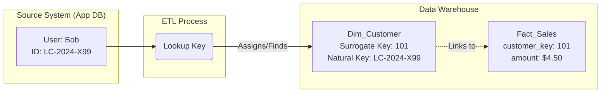
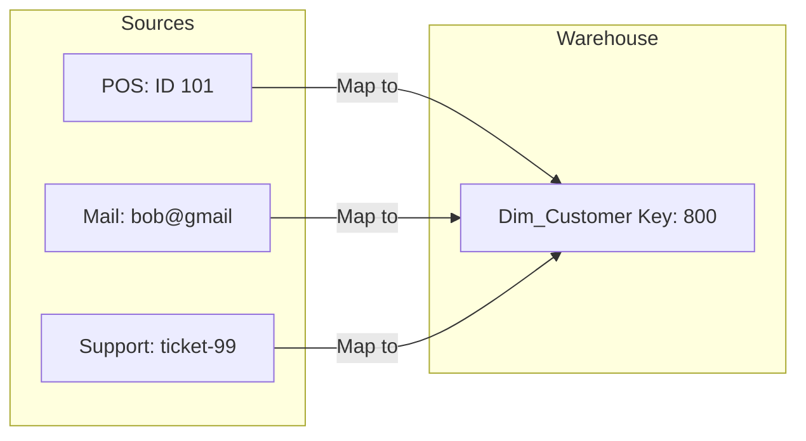

We've spent the last module obsessing over time—building Calendar dimensions and debating the nuances of fiscal quarters. Now, we need to talk about *identity*.

In Set Theory, we learned that a set must contain distinct elements. In a database, we enforce this distinctness with a **key**.

If you walk  over to the application developers—the folks building the point of sale system that runs our registers—and ask them how they identify a customer, they will point to a field in their database: `customer_id`.

"See?" they'll say, pointing to a record. "That's Bob. His ID is `CUST-8921`. That never changes."

In the world of data engineering, we call this a **natural key**.

## 11.1 Natural Keys
A **natural key** is an identifier that exists in the real world or in the business system *before* the data ever reaches our warehouse. It is "natural" to the domain.

Examples of natural keys include:

- **Application IDs**: The `id` column in the production SQL database.
- **Government IDs**: Social Security Numbers (SSN), Passport numbers.
- **Standard Codes**: ISBNs for books, UPCs for grocery items (like our coffee beans).
- **Email Addresses**: Often used as a unique identifier for user logins.

### The Omni-Coffee Example
Let's look at the raw CSV dump we get from the Omni-Coffee mobile application database every night. This table tracks our loyal customers.

**Source System: `app_users.csv`**

| username | email | loyalty_card_code | join_date |
|:---|:---|:---|:---|
| coffee_fan_99 | bob@example.com | LC-2024-X99 | 2024-01-15 |
| latte_lisa | lisa@company.net | LC-2023-A01 | 2023-11-20 |

In this source system, what is the key?

It looks like `loyalty_card_code` is a strong candidate. It identifies the plastic card Lisa scans to get her points. However, `username` is also unique. And `email` *should* be unique (unless Bob forgot his password and made a new account).

When we pull this into our data warehouse to build the `Dim_Customer` dimensions, we might be tempted to just use the `loyalty_card_code` as our primary key. It's unique; it's already there, and we don't have to invent anything.

!!! question "The Architect's Dilemma"

    If `LC-2024-x99` uniquely identifies Bob in the app, why shouldn't we use it as the primary key in our data warehouse? Why do we need to complicate things?

### The Problem with Nature
The problem with natural keys is that we (the data engineers) don't control them. The application developers control them. Or the government controls them. Or the International Standard Book Number agency controls them.

And because we don't control them, they can break our model in three specific ways:

#### 1. The Re-Use Trap
Imagine the Omni-Coffee marketing team decides to "recycle" loyalty card numbers to save money on printing. Bob cancels his membership. Two years later, a new customer, "Dave," walks in. The clerk hands Dave a card. It just happens to be `LC-2024-X99`, pulled from the inactive pile.

If our warehouse blindly trusts `LC-2024-X99` to always mean "Bob," next month's sales report will show that Bob—who hasn't visited in two years—suddenly bought 500 muffins. We have corrupted our history.

#### 2. The String Performance Test
Natural keys are often strings (text).

- `CUST-8921`
- `bob@example.com`
- `055-123-4567`

Computers are incredibly fast, but they are *faster* at comparing integers (numbers) than strings. Joining a fact table to a dimension table using a 12-character string takes significantly more CPU cycles than joining on the simple integer like `42`. When you are joining billions of rows, those milliseconds add up to hours of wait time.

#### 3. The "Business Change" Nightmare
This is the big one. The Application team decides `loyalty_card_code` is too restrictive. They migrate to a new system where users just use their phone numbers. They drop the `loyalty_card_code` column from the database entirely.

If your `Fact_Sales` table links to your `Dim_Customer` table using `loyalty_card_code`, your entire warehouse just broke. You have millions of historical sales records pointing to a key that no longer exists in the new data feed.

### The Role of Natural Keys
Does this mean we throw natural keys away? **Absolutely not**.

We store them, but we treat them as *attributes*, not *infrastructure*. We keep `loyalty_card_code` in our `Dim_Customer` table because business users need to search by it ("Show me the history for card X99"). But we do *not* use it as the glue that holds our Star Schema together.

We need a key that we control. A key that is insulated from the chaos of the outside world.

We need a **surrogate**.

## 11.2 Surrogate Keys
If the natural key is the chaos of the real world, the **surrogate key** is the order of the warehouse.

In the previous section, we established that relying on `loyalty_card_code` or `email` is dangerous because we don't own those values. The Application team owns them.

To regain control, we introduce a new rule: **Every dimension table we build must have its own Primary key**.

This key is an integer. It starts at 1 and counts up. It has absolutely no meaning outside of the data warehouse. The CEO doesn't know it, the App Developers don't know it, and the customers certainly don't know it.

This is the **surrogate key**.

### The Anatomy of a Surrogate
Let's revisit our Omni-Coffee customer dimension. We are going to add a new column at the very front of the table.

**Table: `Dim_Customer`**

| customer_key (PK) | loyalty_id (Natural) | first_name | email |
|:---|:---|;---|;---|
| 101 | LC-2024-X99 | Bob | bob@example.com |
| 102 | LC-2023-A01 | Lisa | lisa@company.net |
| 103 | APP-8821-ZZ | Dave | dave@gmail.com |

101 is Bob. Why is he 101? Because he happened to be the 101st row loaded into this table. That is the only reason.

If we drop the table and reload it tomorrow, Bob might become 54. It doesn't matter, as long as the fact table (Sales) knows that `54` is Bob.

### Why We "Fake" the IDs
You might look at the table above and think, "This looks redundant. Why store `101` when I already have `LC-2024-X99`?"

Here is why we trade storage space for these integers:

#### 1. Performance (Join tax)
Data warehouses live and die by the join. When you run a query to count latte sales by city, the database has to glue the `Fact_Sales` table (millions of rows) to the `Dim_Customer` table.

- **String Comparison**: Comparing `LC-2024-X99` to `LC-2024-X99` requires the CPU to check character by character. It becomes heavy.
- **Integer Comparison**: Comparing `101` to `101` is a single CPU instruction. It is blazing fast.

In a Star Schema, your fact table will only contain surrogate keys as foreign keys. It will be a table of numbers, which compresses beautifully and scans instantly.

#### 2. Handling the "Unknown"
In the messy reality of data engineering, sometimes a sale happens, but we don't know who bought it. Maybe the customer paid cash and didn't scan a card.

If you use natural keys, what do you put in the `customer_id` column of your fact table? `NULL`? SQL hates `NULL`s. They cause havoc with joins and `COUNT()` functions.

With surrogate keys, we can engineer a solution. We reserve the very first row (Key `-1` or `0`) for a specific purpose:

**Table: `Dim_Customer` (The "Dummy" Row)**

| customer_key | loyalty_id | first_name | email |
|:---|:---|:---|:---|
| -1 | N/A | Unknown / Cash | N/A |
| 101 | LC-2024-X99 | Bob | bob@example.com |

Now, if a cash sale comes in, we link it to key `-1`. Our joins never fail, and our reports explicitly say "Unknown customer" instead of just vanishing or crashing.

#### 3. Breaking the Chain
This is the most critical architectural benefit.

Let's go back to the scenario where the App team decides to change their IDs from "LC-Codes" to "Phone Numbers".

- **Without Surrogates**: You have to update every single row in your massive history of sales to swap the old ID for the  new one. This is a nightmare maintenance task.
- **With Surrogates**: You update *one* row in the `Dim_Customer` table. You simply update Bob's row (Key 101) to reflect his new natural key. The billions of rows in the fact table still point to `101`. They don't even know the natural key changed. The history remains intact.

### The Architect's View
We can visualize the flow of keys as a translation layer. The ETL (Extract, Transform, Load) process acts as a border control agent.

!!! tip "The Surrogate Rule"

    **Never** let a natural key leak into a fact table as a foreign key. The fact table should only speak the language of surrogate keys.

## 11.3 Why We Decouple
In software engineering, 'coupling' is a dirty word. If changing a line of code in Module A forces you to rewrite Module B, those modules are *tightly coupled*. It makes your systems brittle and developers miserable.

In data engineering, if changing the operational database (the App) breaks the analytical database (the warehouse), you have the same problem.

We decouple—using surrogate keys—because the data warehouse has a fundamentally different mission than the operational database.

- **The App's Mission**: Handle the *now*. Process this transaction. Log the users in.
- **The Warehouse's Mission**: Preserve the *forever*. Compare this year to last year. Track the lifetime value of a customer.

### The "Shield" Architecture
Think of your surrogate key system as a shield. It protects your historical reporting from the chaotic whims of upstream software changes.

Let's look at a nightmare scenario for Omni-Coffee to see this shield in action.

### The Scenario: The Merger
Omni-Coffee is growing. We just acquired a rival chain, "Java-Hut."

Java-Hut has its own database. It's older, messier, and uses an entirely different logic for Customer IDs.

- **Omni-Coffee**: Uses alphanumeric strings (`CUST-A100`).
- **Java-Hut**: Uses simple integers (`4502`).

**The Problem**: Java-Hut has a customer with ID `4502`. Omni-Coffee also has a customer with ID `4502` (a legacy ID from 2015).

If you are using natural keys in your warehouse, you just hit a **key collision**. Two different people are trying to  occupy the same `customer_id` slot. You cannot merge these databases without rewriting one of them.

**The Solution (Decoupling)**: Because we use surrogate keys, we don't care what the source ID is. We just keep counting.

**Table: `Dim_Customer` (Integrated)**

| customer_key (Surrogate) | source_system | source_id (Natural) | customer_name |
|:---|:---|:---|:---|
| 500 | Omni-App | 4502 | Bob (Omni regular) |
| 501 | Java-Hut-DB | 4502 | Alice (Java-Hut regular) |

By adding a `source_system` column and generating new surrogate keys (`500` and `501`), we have successfully ingested data from two entirely different worlds into a single, unified table without a single collision.

### Protecting Against "The Rewrite"
Software engineers love to rewrite things. It is a universal truth. Eventually, the team building the Omni-Coffee app will switch from a SQL database to a NoSQL database.

In NoSQL, IDs look like this: `507f1f77bcf86cd799439011`.

If your warehouse reports rely on the old integer IDs, your reports die the day the new app goes live.

But if you have decoupled:

1. **Yesterday**: The ETL pipeline mapped Old-ID `100` $\to$ Surrogate `65`.
2. **Today**: You update the ETL pipeline to map new-ID `507f...` $\to$ Surrogate `65` (assuming you link the users).

The fact table, the dashboards, and the CEO's reports **never change**. They still see Customer `65`. You handled the turbulence in the loading dock (ETL), so the customers in the dining room (dashboard users) didn't spill their coffee.

### The "Golden" Record
Decoupling also allows us to solve the hardest problem in data: **entity resolution**.

Occasionally, Bob exists in three systems:

1. **POS System**: `ID: 101` (Bought a coffee).
2. **Marketing Email Tool**: `ID: bob@gmail.com` (Clicked a newsletter).
3. **Support Desk**: `ID: ticket-99` (Complained about a cold muffin).

If we use natural keys, these are three different people. We can't join 'Marketing Clicks' to 'Muffin Complaints.'

With surrogate keys, we can map all three of these source IDs to a single surrogate key: `customer_key: 800`.

This creates the **golden record**—a single, 360-degree view of Bob. This is the holy grail of analytics, and it is mathematically impossible without decoupling your warehouse keys from your source keys.

!!! success "The Architect's Rule"

    **Own your keys**. If you rely on keys generated by someone else, you are renting your data architecture. If you generate your keys (surrogates), you own it.

## Quiz

<quiz>
In the context of data engineering, what is a 'natural key'?
- [ ] A primary key that is always an auto-incrementing integer.
- [x] An identifier that exists in the real world or source system (e.g., email, SSN).
- [ ] A key that connects two fact tables directly.
- [ ] A unique identifier generated by the data warehouse ETL process.

</quiz>

<quiz>
What is the 'Re-Use Trap' associated with relying on natural keys?
- [ ] Developers re-use code, which introduces bugs into the ETL pipeline.
- [ ] The database re-uses the same query plan, slowing down performance.
- [ ] Natural keys take up too much storage space when reused.
- [x] A source system  might recycle an ID (like a loyalty card) for a new user, corrupting historical data.

</quiz>

<quiz>
Why are integer-based surrogate keys generally preferred over string-based natural keys for joins?
- [x] CPUs compare integers significantly faster than strings, reducing the 'join tax.'
- [ ] Integers are easier for business users to remember.
- [ ] SQL databases generally do not support joining on string columns.
- [ ] String keys cannot be indexed.

</quiz>

<quiz>
What is the primary characteristic of a surrogate key?
- [ ] It changes every time a record is updated.
- [ ] It is a composite of the user's name and birthdate.
- [ ] It is imported directly from the source system's primary key.
- [x] It is a meaningless integer assigned sequentially by the data warehouse.

</quiz>

<quiz>
How do surrogate keys help handle 'unknown' data (e.g., a cash sale with no customer)?
- [x] By assigning a specific "dummy" row (e.g., `-1`) to represent unknown states.
- [ ] By deleting the transaction entirely since it is incomplete.
- [ ] By leaving the foreign key column NULL.
- [ ] By guessing the customer based on the time of day.

</quiz>

<quiz>
What is the "Golden Record" scenario mentioned in entity resolution?
- [x] Mapping multiple source IDs (e.g., email, POS ID, Support Ticket) to a single surrogate key.
- [ ] A record that has never been modified since its creation.
- [ ] The backup copy of the database is stored in a secure vault.
- [ ] The single row in the fact table that contains the highest profit margin.

</quiz>

<quiz>
In the "Merger" scenario where Omni-Coffee requires Java-Hut, what problem do natural keys cause?
- [ ] The database cannot handle the increased volume of data.
- [ ] Java-Hut uses integers while Omni-Coffee uses strings, which is impossible to store.
- [x] Key Collision: Both companies might use the same ID (e.g., 4502) for different people.
- [ ] Java-Hut's data is in a different language.

</quiz>

<quiz>
Why is 'Decoupling' considered a defensive architecture?
- [ ] It allows the warehouse to disconnect from the internet for security.
- [ ] It allows us to delete data faster.
- [x] It prevents changes in the App/Source System (like ID format changes) from breaking the warehouse history.
- [ ] It ensures that the marketing team cannot see financial data.

</quiz>

<quiz>
Which team "owns" the surrogate key?
- [ ] The end user.
- [ ] The application development team.
- [ ] The legal department.
- [x] The data warehouse / ETL team.

</quiz>

<quiz>
If an application team changes their User ID from an integer to a GUID (String), what must happen in a warehouse using surrogate keys?
- [ ] We must delete the old users and create new ones.
- [x] The ETL process is updated to map the new GUID to the existing surrogate keys.
- [ ] The entire fact table history must be rewritten to use the new GUIDs.
- [ ] The warehouse must also switch to a NoSQL database.

</quiz>

<!-- mkdocs-quiz results -->