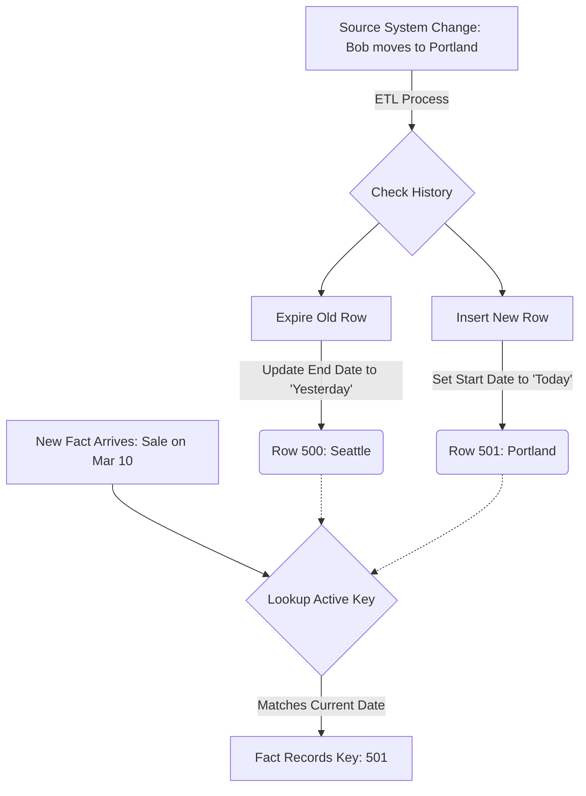

Until now, we've been operating under a comforting, simplified assumption: **Entities are static**. In our diagram, a "Product" is a Product, a "Store" is a Store, and a "Customer" is a Customer. Once defined, they sit in their dimension tables like statues in a museum—immutable and timeless.

But the universe, unfortunately for us engineers, refuses to sit still.

People get married and change their names. Products get rebranded. Cities get annexed. And, most critically for the Omni-Coffee bottom line, customers move to new neighborhoods.

## 12.1 The Mutability Problem
In the world of application development (OLTP), handling this is easy: you just change the data. In the world of data warehousing (OLAP), however, "just changing the data" can unknowingly rewrite history, turning your pristine financial reports into a pack of lies.

This is the **mutability problem**, and it is one of the trickiest dragons you will have to slay.

### The Application View: "Now" is All That Matters
To understand why this is a problem, we have to look at how our friends in the software engineering department handle it.

Let's look at one of our best customers, Bob. Bob lives in Seattle. He loves our "Rainy Day Roast." In our `dim_customer` table (which we likely ingested directly from the application's database), his record looks like this:

| customer_id | name | city | state | favorite_blend | 
|:---|:---|:---|:---|:---|
| 101 | Bob | Seattle | WA | Rainy Day Roast |

In January, Bob walks into our Seattle flagship store and buys a coffee. We record this in our fact table (`fact_sales`):

| sale_id | date_key | customer_id | amount |
|:---|:---|:---|:---|
| 5001 | 20240115 | 101 | 5.00 |

If we run a report right now for **January Sales by City**, the logic is simple. The database joins `fact_sales` to `dim_customer` on `customer_id`. It sees Bob is in Seattle.

### The Change Event
Now, let's fast forward to February. Bob gets a new job and  moves to Portland, Oregon. He opens the Omni-Coffee mobile app and updates his profile.

The application engineer, optimizing for the 'current state,' issues a command to update Bob's row. The table now looks like this:

| customer_id | name | city | state | favorite_blend |
|:---|:---|:---|:---|:---|
| 101 | Bob | Portland | OR | Rainy Day Roast |

In **March**, Bob walks into our Portland branch and buys another coffee. We record that sale:

| sale_id | date_key | customer_id | amount |
|:---|:---|:---|:---|
| 5001 | 20240115 | 101 | 5.00 |
| 7002 | 20240310 | 101 | 5.00 |

### The Warehouse View: The "Time Travel" Disaster
Here is where the trap snaps shut.

It is now April, and the CEO asks you for the Q1 Performance Review. Specifically, they want to compare sales in Seattle vs. Portland for January.

You run your query. You join `fact_sales` to `dim_customer`.

1. The query looks at the January sale (`5001`).
2. It looks up `customer_id = 101`.
3. It finds the current record for Bob.
4. The record says Bob lives in Portland.

!!! failure "The Corruption of History"

    Because you overwrote the attribute, your report now claims that Bob bought his coffee in **Portland** back in January

    But we know that didn't happen. Bob was in Seattle in January. By updating the dimension in place, you have retroactively moved all of Bob's historical records to his new location. You haven't just updated the present; you've rewritten the past.

This is a **destructive update**. In a warehouse, where our primary mandate is to preserve **business history**, this is catastrophic. If we use this naive approach, we can never accurately report on regional performance over time because our regions (as defined by the customers living in them) are constantly shifting under our feet.

### The Engineering Tension
You might be thinking, "Okay, obviously we shouldn't overwrite it. Why don't we just store the City inside the fact table (the transaction) instead of looking it up in the dimension?"

That is a valid instinct! If we stored "Seattle" on the receipt (the fact row), we would preserve history.

However, consider the trade-offs we discussed in module 3.

1. **Storage**: Storing `customer_name`, `customer_city`, `customer_state` and `customer_segment` on every single coffee sale (millions of rows) is massive data redundancy.
2. **Maintenance**: What if we realize we spelled "Seattle" wrong? We'd have to update millions of fact rows.
3. **Dimension attributes change too**: It's not just City. What if Bob changes his "Customer Segment" from student to professional? Do we store that on the fact table too?

We want the efficiency of the Star Schema, but we also need the accuracy of a history log.

### Enter: Slowly Changing Dimensions (SCDs)
We call attributes like `City` or `Marital Status` **slowly changing dimensions (SCD)**. They don't change as fast as the fact table (which grows every second), but they aren't static. They drift.

How we handle this drift depends entirely on the business requirements. Do we *care* that Bob used to live in Seattle?

- **Scenario A**: The marketing team would like to send a coupon to Bob's *current* house. They don't care where he lived in January.
- **Scenario B**: The strategy team would like to know if our Seattle market is shrinking. They care *deeply* where Bob lived in January.

In the following sections, we will look at the three standard engineering patterns—Types 1, 2, and 3—to solve this. Each one represents a different trade-off between complexity and historical truth.

## 11.2 SCD Type 1 (Overwrite)
In the world of data modeling, the simplest solution is often the most dangerous.

**SCD Type 1** is the technical term for "doing exactly what the application database does." When a dimension attribute changes, we simply overwrite the old value with the new one. We don't keep the old version. We don't track when the change happened. We just erase the post.

It is brutal, efficient, and irreversible.

### The Mechanism
Let's go back to Bob at Omni-Coffee.

**Original State (January): Bob lives in Seattle.**

| customer_id | name | city | state |
|:---|:---|:---|:---|
| 101 | Bob | Seattle | WA |

**The Change (February)**: Bob moves to Portland. The ETL process detects a difference between the source system and the warehouse.

**The Action (Type 1)**: The database performs an `UPDATE` operation. The old data ("Seattle") is physically deleted from the hard drive and replaced.

| customer_id | name | city | state |
|:---|:---|:---|:---|
| 101 | Bob | Portland | OR |

### The "Truth" vs. The Trade-off
Why would we ever do this if it breaks historical reporting? As we saw in the previous section, if we run a report for "January sales," Bob will incorrectly appear as a Portland customer.

However, as a pragmatic architect, you have to weigh the costs.

#### 1. Simplicity vs. Complexity
Implementing Type 1 is incredibly easy. You don't need special columns for start/end dates. You don't need complex logic to "expire" old rows. Your SQL queries remain simple joins: `FROM fact_sales JOIN dim_customer ON sales.customer_id = customer.customer_id`.

#### 2. Storage Space
Type 1 consumes the least amount of disk space. Bob always takes up exactly one row in the database, no matter how many times he moves.

### When To Use Type 1
Despite its destructive nature, SCD Type 1 is actually the correct choice for two specific scenarios:

#### Scenario A: Correcting Mistakes
History should reflect reality. If a data entry clerk originally typed Bob's name as "Bobb" (with two b's), and we fix it to "Bob," we want to overwrite the old value. We don't need to preserve a historical record stating that "From Jan 1 to Jan 15, his name was spelled wrong." We want all historical reports to look clean and professional, using the correct spelling.

#### Scenario B: Irrelevant History
Occasionally, the business genuinely isn't concerned about the history of a specific attribute.

Consider the column `original_source` (how the customer found us).

- In January, the data says "Unknown."
- In February, Bob fills out a survey and says "Instagram."

We can safely overwrite "Unknown" with "Instagram." If we look back at his January sales, we *want* to attribute them to Instagram because that was the true source **all** along; we just didn't know it yet.

!!! warning "The Cardinal Rule of Type 1"

    **Never** use SCD Type 1 for attributes that are geographically or structurally significant (City, State, Sales Territory, Department). If an attribute is used to group numbers on a dashboard, changing it via Type 1 will cause those numbers to "jump" from one group to another retroactively.

## 12.3 SCD Type 2 (Add Row)
If Type 1 is the "Amnesiac," **SCD Type 2** is the "Historian." It is the gold standard for dimensional modeling because it allows us to answer the question that Type 1 cannot: *"What did the world look like back then?"*

### The Mechanism
In SCD Type 2, we treat a change not as a correction but as a **new event**. When Bob moves from Seattle to Portland, we do not touch the Seattle row. We leave it there, frozen in time. Instead, we issue an `INSERT` statement and create a brand new row for "Portland Bob."

Now we have a problem: We have two "Bob's" in our `dim_customer` table.

| customer_id | name | city | state |
|:---|:---|:---|:---|
| 101 | Bob | Seattle | WA |
| 101 | Bob | Portland | OR | 

This breaks the uniqueness of our primary key (`customer_id`). If we try to join this table to our fact table on `customer_id`, every sale Bob ever made will duplicate—once for the Seattle row, once for the Portland row. Our revenue will double instantly. This is the definition of a bad day at the office. 

### The Solution: Keys and Dates
To manage this multiplicity, Type 2 introduces three critical columns to the dimension table.

1. **Surrogate Key**: A new,  unique primary key for the table (often just an auto-incrementing integer). We can no longer rely on `customer_id` (the "natural key") to identify a row.
2. **Effective Date (Start Date)**: When did the specific version of Bob become true?
3. **Expiration Date (End Date)**: When did this specific version of Bob stop being true?

Let's look at the `dim_customer` table row:

| customer_key (PK) | customer_id | city | start_date | end_date | is_current |
|:---|:---|:---|:---|:---|:---|
| 500 | 101 | Seattle | 2024-01-01 | 2024-02-01 | False |
| 501 | 101 | Portland | 2024-02-01 | 9999-12-31 | True |

Notice the elegance here:

- **Row 500**: Represents Bob's life in Seattle. It was true from Jan 1st until Feb 1st.
- **Row 501**: Represents Bob's life in Portland. It started on Feb 1st and is valid until the end of time (represented by the placeholder `9999-12-31` or `NULL`).

### Linking to the Facts
This is where the magic happens. When we record a sale in our fact table, we no longer join on `customer_id`. We join on the specific **surrogate key** that was active *at the moment the sale occurred*.

- **Sale on Jan 15th**: The ETL looks up Bob (101). It asks, "Which row was active on Jan 15th?" The answer is row 500 (Seattle). The fact table records `customer_key: 500`.
- **Sale on Mar 10th**: The ETL looks up Bob (101). It asks, "Which row was active on Mar 10th?" The answer is row 501 (Portland). The fact table records `customer_key: 501`.

**The Fact Table**:

| sale_id | date_key | customer_key (FK) | amount |
|:---|:---|:---|:---|
| 5001 | 20240115 | 500 | 5.00 |
| 7002 | 20240310 | 501 | 5.00 |

### The Payoff
Now, let's re-run that report: **Sales by City**.

1. **Query**: Join `fact_sales` to `dim_customer` on `customer_key`.
2. **Row 1**: Sale 5001 points to key 500. Key 500 is **Seattle**. Result: +5.00 for Seattle.
3. **Row 2**: Sale 7002 points to key 501. Key 501 is **Portland**. Result: +5.00 for Portland.

**Success**. We have accurately partitioned history. Bob's January money stays in Seattle; his March money goes to Portland. The mutability problem is solved.

### Visualizing the Lifecycle
Here is how the flow works in practice:

### The Trade-offs
SCD Type 2 is powerful, but it is not free.

1. **Exploding Table Size**: If Bob updates his profile 10 times a year, he takes up 10 rows in your dimension table. For millions of customers, this can turn a "small dimension" into a monster.
2. **ETL Complexity**: Your data pipeline logic just got harder. You have to handle overlapping dates, ensure only one row is active at a time, and handle "Late Arriving Data" (What if we receive the address change *after* we recorded the sale?).

!!! tip "The 99% Rule"

    In most data warehouses, **SCD Type 2 is the default** for any important entity (Customers, Employees, Products). The storage cost is usually trivial compared to the value of accurate historical reporting.

## 12.4 SCD Type 3 and Beyond
If Type 1 is "Amnesia" and Type 2 is "Total Recall," **SCD Type 3** is "Short-Term Memory."

While Type 2 is the standard for general history, it has a flaw: it makes side-by-side comparisons difficult. If you want to ask, "Show me Bob's sales this year grouped by his **current** territory versus his **previous** territory," Type 2 makes you work for it. You have to join facts to different versions of the dimensions row and perform complex window functions.

Type 3 solves this by keeping the history inside the row itself.

### SCD Type 3: The "Previous Value" Column
Instead of creating a new row (and a new surrogate key) when Bob moves, we simply expand the table. We add a column to track the 'Previous' state of the attributes we care about.

**The Setup**: We have `city` and `previous_city`.

**January (Bob is in Seattle)**:

| customer_id | name | city | previous_city |
|:---|:---|:---|:---|
| 101 | Bob | Seattle | NULL |

**February (Bob moves to Portland)**: We update the row in place. We move "Seattle" to the `previous_city` slot and write "Portland" into `city`.

| customer_id | name | city | previous_city |
|:---|:---|:---|:---|
| 101 | Bob | Portland | Seattle |

#### The Trade-off
The utility here is specific: **realignment**. Imagine Omni-Coffee redraws its sales regions. A store was in the "West" region, but now it's in the "Pacific" region.

- Using the `city` column, we can report all historical sales as if they *always* belonged to the new "Pacific" region (The "As-Is" view).
- Using the `previous_city` column, we can see where those sales *used* to fall (the "Was-Is" view).

The downside is obvious: **history is finite**. If Bob moves a third time—to Austin—"Seattle" is evicted from the `previous_city` column and lost forever. Type 3 can only remember the immediate past (or however many "previous" columns you bother to add).

### SCD Type 4: The "Mini-Dimension" (Performance)
There is a scenario where SCD Type 2 explodes your database: **rapidly changing attributes**.

Let's say Omni-Coffee tracks a "Customer Loyalty Score" (0-100) that fluctuates every time a user buys a coffee or opens the app.

- **Bob**: Jan 1 (Score: 50) $\to$ Jan 2 (Score: 52) $\to$ Jan 3 (Score: 51).

If we use SCD Type 2, we are creating a new row for Bob *every single day*. If we have 1 million customers, we are adding 365 million rows a year to our customer dimension just to track a score. This is bloat.

**The Solution**: We split the dimension in half.

1. **The Base Dimension**: Holds the slow stuff (Name, Date of Birth).
2. **The Mini-Dimension**: Holds the fast stuff (Loyalty Score, Income Band, Age Group).

We detach the unstable attributes into a separate, smaller table (the Mini-Dimension). The fact table then holds **two** foreign keys: one for Bob (the human) and one for Bob's profile (his current stats).

**Fact Table**:

| sale_id | customer_key (Who) | profile_key (Stats) | amount |
|:---|:---|:---|:---|
| 5001 | 500 (Bob) | 10 (Score: 50-60) | 5.00 |

We stop tracking the exact score and track the "Band" or "Group." This dramatically reduces row churn.

### SCD Type 6: The "Hybrid"
Just so you recognize this term in a job interview: **Type 6** is (1 + 2 + 3).

It combines all the approaches. You have a row for every change (Type 2), but that row also contains a column for the "Current value" (Type 1) so you can easily group history by the present state without joining.

- **Row 1 (Historic)**: `city: Seattle`, `current_city: Portland`.
- **Row 2 (Current)**: `city: Portland`, `current_city: Portland`.

It is complex, expensive to maintain, and powerful. Use only in case of emergency.

## Quiz

<quiz>
What is the primary consequence of using SCD Type 1 (Overwrite) when a customer moves from Seattle to Portland?
- [ ] It automatically creates a 'Previous City' column to store 'Seattle.'
- [ ] It deletes all historical sales records associated with that customer.
- [x] It retroactively attributes all past sales to Portland, rewriting history.
- [ ] It creates a duplicate row for the customer, preserving both locations.

</quiz>

<quiz>
In which scenario is SCD Type 1 (Overwrite) the recommended engineering choice?
- [ ] When a customer changes their home address.
- [ ] When a sales territory is realigned.
- [x] When fixing a spelling error in a name (e.g., changing 'Bobb' to 'Bob').
- [ ] When tracking changes in a customer's loyalty tier.

</quiz>

<quiz>
SCD Type 2 handles changes by adding a new row. What critical mechanism is required to distinguish these rows from one another?
- [ ] A link to a mini-dimension.
- [x] A surrogate key and date ranges (Start/End date).
- [ ] A 'Previous Value' column.
- [ ] A recursive foreign key pointing to the parent.

</quiz>

<quiz>
If you implement SCD Type 2, how does the fact table (e.g., Sales) link to the dimension table?
- [ ] It links via the users name.
- [ ] It links via the natural key (e.g., customer_id).
- [ ] It links to all versions of the customers simultaneously.
- [x] It links via the surrogate key active at the time of the sale.

</quiz>

<quiz>
What is the primary limitation of SCD Type 3 (Add Column)?
- [ ] It requires complex joins to view current data.
- [x] History is finite; it can only track a limited number of past changes.
- [ ] It consumes the most storage space of all types.
- [ ] It cannot handle numeric data.

</quiz>

<quiz>
Which architectural pattern is best suited for attributes that change rapidly, such as a 'Credit Score' or 'Loyalty Points'?
- [x] SCD Type 4 (Mini-dimension)
- [ ] Snowflake Schema
- [ ] SCD Type 2 (Add Row)
- [ ] SCD Type 1 (Overwrite)

</quiz>

<quiz>
In an SCD Type 2 table, what indicates that a row is the 'Current' active record?
- [ ] The `customer_id` is the highest number.
- [ ] The `previous_value` column is empty.
- [ ] The `start_date` is today.
- [x] The `end_date` is NULL or a placeholder like '9999-12-31.'

</quiz>

<quiz>
What is the main benefit of SCD Type 3 (keeping a 'previous' column) over Type 2?
- [ ] It preserves the entire history of the entity forever.
- [ ] It is the default standard for all data warehouses.
- [ ] It eliminates the need for surrogate keys.
- [x] It allows for easy side-by-side comparison of 'Current' vs. 'Previous' state without complex joins.

</quiz>

<quiz>
What is a 'Natural Key' in the context of SCDs?
- [ ] The primary key of the fact table.
- [ ] The auto-incrementing integer created by the data warehouse.
- [x] The ID assigned by the source software (e.g., `user_id: bob123`).
- [ ] The date the record was created.

</quiz>

<quiz>
Why is it dangerous to use SCD Type 1 for attributes used in 'WHERE' or 'GROUP BY' clauses (like Region or Department)?
- [x] It causes historical numbers to 'jump' across groups, changing past reports.
- [ ] It increases the size of the database on disk.
- [ ] It breaks the foreign key relationship.
- [ ] It makes the query run slower.

</quiz>

<!-- mkdocs-quiz results -->