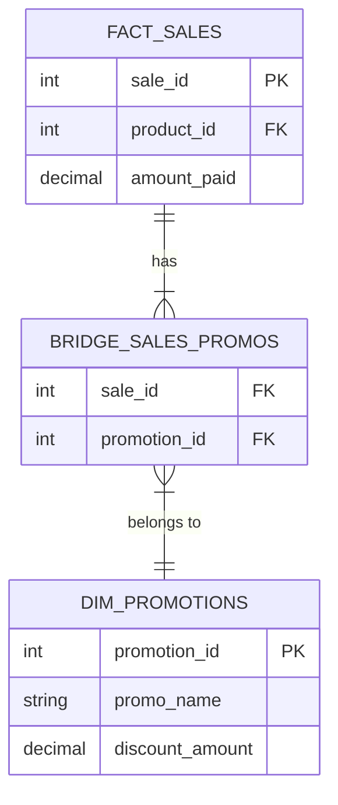

If you have been following along, you should feel pretty comfortable with the **Star Schema**. It's a beautiful, tidy shape. You have our central Fact table (the verbs) surrounded by DImension tables (the nouns). The gravity that holds this solar system together is the **One-to-Many (1:N)** relationship.

- **One** customer places **many** orders.
- **One** store sells **many** products.
- **One** data sees **many** transactions.

In Set Theory terms, this is a clean function mapping. Every element in the Orders set points to exactly one element in the Customers set. It is deterministic. It is simple.

But the real world is rarely simple. Eventually, you will encounter a business requirement that refuses to fit into this "One Parent, Many Children" structure. You will run into the "Many Parents, Many Children" problem, formally known as the **Many-to-Many (M:N)** relationship.

Welcome to the  bridge.

## 14.1 The Set Theory Problem
Before we look at how this breaks our coffee shop, let's look at the classic textbook example: **Authors and  Books**.

Imagine you are building a database for a library.

- **Set A (Books)**: Contains "Good Omens".
- **Set B (Authors)**: Contains "Neil Gaiman" and "Terry Pratchett".

Here is the Set Theory conflict:

1. **Neil Gaiman** wrote **many** books (Sandman, American Gods, Good Omens).
2. **Good Omens** was written by **many** authors (Neil Gaiman AND Terry Pratchett).

If you try to draw a line from "Good Omens" to its author, you don't get a single line; you get a fork. This destroys the fundamental rule of our Star Schema: **granularity**.

### The Omni-Coffee Scenario: "Double Dip"
Let's bring this back to **Omni-Coffee**.

Our CEO has decided that our marketing is too simple. We are moving beyond simple price cuts. We are now allowing  **stackable promotions**.

A customer walks in and buys a *Large Caramel Latte*.

1. It is 7:00 AM, so they trigger the "**Early Bird Special**" (10% off).
2. They also have a coupon for the "**Summer Heat Wave**" event ($1.00 off).

We need to record this transaction in our `fact_sales` table. We need to know exactly which promotions were applied so the financial team can calculate how much money we "lost" to discounts.

### The Architecture Failure
In a standard Star Schema, our Fact table (`fact_sales`) has a foreign key pointing to the Dimensions (`dim_promotions`).

Let's look at the data. We have a sale ID `5501` for that latte.

| sale_id | product_id | promotion_id | amount_paid |
|:---|:---|:---|:---|
| 55701 | 77 (Latte) | 20231005 | ??? | 4.50 |

We have a single slot—a single cell—allocated for the `promotion_id`. But we have two promotions (IDs `101` and `102`) that claim this sale.

How do we fit two pages into one hole?

!!! failure "The Anti-Pattern: The Comma-Separated String"

    Beginners often panic and try to shove both IDs into the text field like this: `"101,102"`.

    **Do not do this**.

    In Set Theory, this violates the atomic nature of a tuple. In engineering terms, this is a disaster. If you want to ask, "How much money did the Summer Heat Wave lose us?", your SQL query has to perform slow, ugly string parsing. You lose the ability to join cleanly to the `dim_promotions` table. You have effectively broken your database.

### Attempt 2: The Multi-Column Hack
So, you decide to be clever. You alter the table schema to add more columns.

| sale_id | product_id | promotion_1_id | promotion_2_id | promotion_3_id |
|:---|:---|:---|:---|:---|
| 5501 | 77 | 101 | 102 | NULL |

This looks normalized-ish, but it's brittle.

1. **Hard Limits**: What happens when a customer triggers four promotions? You have to alter the database structure again.
2. **Query Pain**: To find all sales involving the "Early Bird" promo, you have to write: `WHERE promotion_1_id = 101 OR promotion_2_id = 101 OR promotion_3_id = 101`. The database engine cannot optimize this efficiently.
3. **Null Wastage**: Most sales have zero or one promotion, leaving the other columns empty (sparse data).

### The Mathematical Reality
The issue here is that the relationship between **Sales** and **Promotions** is not hierarchical.

In a hierarchy (Time $\to$ Day $\to$ Month), items nest neatly inside each other. In a Many-to-Many relationship, the sets overlap in unpredictable clusters.

We cannot solve this by changing the fact table or the dimensions table. We need a third object. In Set Theory, we solved this by defining a **relation**—a specific set of pairs.

In dimensional modeling, we call this the **bridge table**.

## 14.2 The Bridge Table
In the last section, we hit a wall. We realized that `fact_sales` can't hold  multiple `promotion_id`s in a single cell without violating the laws of physics (or at least, the laws of good database design).

To solve this, we need to stop thinking about the relationship as a direct link. Instead, we need a **connector**. In the physical world, if you have a wall outlet (fact) and five devices (dimensions) you want to plug in, you don't jam five plugs into the socket. You buy a **power strip**.

In dimensional modeling, that power strip is called a **bridge table**.

### The Engineering Solution
A bridge table is a specialized table whose only job is to sit between two other tables and resolve a Many-to-Many conflict. It is the "Associative Entity" you learned about in Set Theory, brought to life.

Instead of putting the `promotion_id` inside the fact table, we take it out. In fact, we remove the direct relationship entirely.

We create a new table: `bridge_sales_promotions`.

### The Virtual Structure
The architecture changes from a simple star to something slightly more complex.

Notice the relationships:

1. **Fact $\to$ Bridge**: One Sale can appear **many** times in the bridge (once for every promotion applied).
2. **Bridge $\to$ Dimension**: Each row in the bridge points to **one** specific promotion.

### The Data Flow
Let's look at the raw data for our "Double Dip" latte scenario (Sale #5501).

- **The Fact Table (`fact_sales`)**: It stays clean. It represents the event of the  sale. It doesn't know—or care—about the specific promotion yet.

| sale_id | product_id | date_id | amount_paid |
|:---|:---|:---|:---|
| 5501 | 77 | 20231005 | 4.50 |

- **The Bridge Table (`bridge_sales_promotions`)**: This is the workhorse. It maps the sale ID to the promotion IDs. Since sale #5501 used two promotions, it gets **two rows**.

| sale_id | promotion_id |
|:--|:--|
| 5501 | 101 |
| 5501 | 102 |

- **The Dimension Table (`dim_promotions`)**: This holds the context (the "noun").

| promotion_id | promo_name | type |
|:---|:---|:---|
| 101 | Early Bird Special | Percentage |
| 102 | Summer Heat Wave | Fixed Amount |

### The "Join" Mechanism
When the data analyst wants to see "Sales by promotion," the database engine traverses this bridge.

1. **Start** at `dim_promotions` (Pick "early bird").
2. **Join** to the `bridge` (Find all `sale_id`s connected to Promo 101).
3. **Join** to the `fact_sales` (Retrieve the revenue for those sales).

This is elegant because it is flexible. If a customer uses 50 coupons, we don't change the schema; we just add 50 rows to the **bridge table**. Vertical growth is cheap; horizontal growth (adding columns) is expensive.

### The "Explosion" Risk
I must warn you: The Bridge Table is powerful, but it is dangerous. It introduces a phenomenon known as **row explosion**.

In a standard Star Schema, if you select one row from the fact table and join it to a dimension, you still have one row. The granularity is preserved.

**With a bridge, that changes**.

If you query `fact_sales` for sale #5501, you have **1 row**. If you join that to the bridge table, you suddenly have **2 rows** in your result set (one for the Early Bird, one for the Summer Wave).

!!! danger "The Summation Trap"

    If an analyst blindly runs a `SUM(amount_paid)` query after joining through a bridge, they will double-count the revenue for sale #5501.

    - Row 1 (Early Bird): Sale ##5501 shows $4.50.
    - Row 2 (Summer Wave): Sale ##5501 shows $4.50.
    - **Total reported**: $9.00

    This is a **catastrophic data error**. You have reported revenue that does not exist.

This brings us to the most critical trade-off of the bridge table: **correctness vs. complexity**. You have successfully modeled the relationship, but you have made the math harder. You have shifted the burden of logic from the database architect (you) to the data analyst (your user).

To fix the math, we need one final component to our table design.

## 14.3 Weighted Factors
We left the last section in a dangerous place. Our database design is theoretically sound—we successfully mapped multiple promotions to a single sale—but our analytics are broken.

If a data analyst calculates the sum of revenue for that single $4.50 Latte involved in two promotions, the database returns $9.00.

If you deliver this to the CFO, you won't just look incompetent; you will look dangerous. You have effectively printed fake money in your report.

The solution to the "Double Dip" problem is the **weighting factor**.

### The Theory of Allocation
When a single event (sale #5501) is claimed by multiple parents, we have to decide how much credit—or blame—each parent gets. We cannot give 100% of the sale to *both* of them, because that defies the laws of mathematics.

We must split the atom.

We add a column to our bridge table, usually called `weighting_factor` (or `allocation_amount`). This is a decimal number between 0 and 1.

**The Golden Rule of Bridges:**

> The sum of the weighting factors for any single unique fact ID must exactly equal 1.0.

#### Scenario A: The "Event Split" (The Lazy Way)
Let's say the Omni-Coffee marketing team just wants to see which promotions are "associated" with sales. They don't care about the specific accounting impact of the discount; they just want to divide the revenue credit equally.

Since sale #5501 has 2 promotions, we divide 1 by 2. Each row gets a factor of 0.5.

**Table: `bridge_sales_promotions`**

| sale_id | promotion_id | weighting_factor |
|:---|:---|:---|
| 5501 | 101 (early Bird) | 0.5 |
| 5501 | 102 (Heat Wave) | 0.5 |

Now, when the analyst writes their query, they change their math from `SUM(amount_paid)` to `SUM(amount_paid * weighting_factor)`.

**The math**:

1. **Row 1**: $\$4.50 \times 0.5 = \$2.25$ attributed to Early Bird.
2. **Row 2**: $\$4.50 \times 0.5 = \$2.25$ attributed to Heat Wave.
3. **Total**: $\$2.25 + \$2.25 = \$4.50$.

The total revenue is correct. The CFO is happy.

#### Scenario B: The "Impact Split" (The Accurate Way)
Usually, finance isn't happy with an even split. They want to attribute revenue based on how much the discount *actually* cost the company.

- **Early Bird (10% off $5.00)**: $0.50 discount.
- **Heat Wave ($1.00 off)**: $1.00 discount.
- **Total Discount**: $1.50.

We calculate the weight based on the proportion of the discount:

- **Early Bird Share**: $0.50 / $1.50 = 0.33.
- **Heat Wave Share**: $1.00 / $1.50 = 0.67.

**Table: `bridge_sale_promotions` (Impact Based)**

| sale_id | promotion_id | weighting_factor |
|:---|:---|:---|
| 5501 | 101 (Early Bird) | 0.33 |
| 5501 | 102 (Heat Wave) | 0.67 |

Now, when we run the weighted sum, the "Heat Wave" gets credit for generating more of the sale because it did more of the heavy lifting.

### The Maintenance Headache
This is where the "Trade-off" theme of this course comes back to bite you.

In the Star Schema (modules 4-7), we prioritized **read speed**. In the bridge pattern, we are sacrificing **write complexity** to save the schema.

Calculating these weighting factors is **not** the job of the database. It is the job of your ETL pipeline (the Silver $\to$ Gold step).

1. Your pipeline reads the raw sales.
2. It detects multiple promotions.
3. It applies the business logic (even split vs. impact split).
4. It calculates the floats.
5. It inserts the rows into the bridge table.

If the business rule changes (e.g., "Always attribute 100% to the primary coupon and 0% to the secondary"), you have to rewrite your pipeline and update every row in this bridge table.

## Quiz

<quiz>
What is the primary architectural purpose of a Bridge Table in dimensional modeling?
- [ ] To store historical changes for slowly changing dimensions (SCDs).
- [ ] To improve write speeds by reducing the total number of indexes.
- [ ] To normalize the fact table to 3rd normal form.
- [x] To resolve Many-to-Many (M:N) relationships between a fact and a dimension.

</quiz>

<quiz>
In the 'Omni-Coffee' scenario, why is storing promotion IDs as a comma-separated string considered an anti-pattern?
- [ ] It consumes too much storage space on disk.
- [ ] It forces the database to automatically delete old partitions.
- [ ] It is incompatible with the UTF-8 character encoding.
- [x] It prevents the use of foreign keys and requires slow, complex parsing.

</quiz>

<quiz>
Which of the following describes the 'Multi-Column Hack' and its primary weakness?
- [ ] Duplicating the fact table; it doubles the storage cost.
- [ ] Using a JSON column; it is not supported by legacy databases.
- [x] Adding a column like `promo_1`, `promo_2`; it imposes a hard limit on the number of associations.
- [ ] Creating distinct tables for every promotion; it makes the schema too wide.

</quiz>

<quiz>
What is 'Row Explosion' in the context of Bridge Tables?
- [ ] The rapid growth of the dimension table over time.
- [ ] The process of deleting rows from the Bridge Table.
- [ ] The database crashing due to too many concurrent users.
- [x] The increase in result rows when joining a single Fact row to multiple Bridge rows.

</quiz>

<quiz>
If you perform a `SUM(amount_paid)` on a query involving a Bridge Table without using weighting factors, what is the likely error?
- [ ] The database will return the average instead of the sum.
- [ ] The query will return zero.
- [ ] The query return a syntax error.
- [x] You will double-count (or triple-count) the revenue.

</quiz>

<quiz>
What is the 'Golden Rule' regarding the `weighting_factor` column in a Bridge Table?
- [ ] The weighting factor must be an integer.
- [x] The sum of weights for a unique fact ID must exactly equal 1.0.
- [ ] The weight must always be 0.5.
- [ ] The sum of weights for a unique promotion ID must equal 1.0.

</quiz>

<quiz>
In an 'Impact Split' allocation strategy, how are weights calculated?
- [x] Based on the proportional monetary value of the discount provided by each promotion.
- [ ] Randomly assigning values that sum to 1.
- [ ] Dividing 1 by the total number of promotions (e.g., 1/2 = 0.5).
- [ ] Assigning 1.0 to the first promotion and 0.0 to the rest.

</quiz>

<quiz>
Where does the complexity primarily reside when using the Bridge Table pattern?
- [ ] In the storage hardware (disk space).
- [ ] In the database backup process.
- [ ] In the dimension table structure.
- [x] In the ETL pipeline and the analyst's queries.

</quiz>

<quiz>
Structurally, what are the relationships involved in a Bridge Table pattern?
- [ ] Fact-to-Bridge is 1:1; Bridge-to-Dimension is 1:1.
- [x] Fact-to-Bridge is 1:Many; Bridge-to-Dimension is Many:1.
- [ ] Fact-to-Bridge is Many:1; Bridge-to-Dimension is 1:Many.
- [ ] Fact-to-Bridge is M:M; Bridge-to-Dimension is M:M.

</quiz>

<quiz>
Before implementing a Bridge Table, what is a key question you should ask?
- [ ] Is the dimension table in 3rd normal form?
- [ ] Do we have enough colors for the diagrams?
- [ ] Can we switch to a NoSQL database?
- [x] Can we just use a Primary Promotion and ignore the others?

</quiz>

<!-- mkdocs-quiz results -->