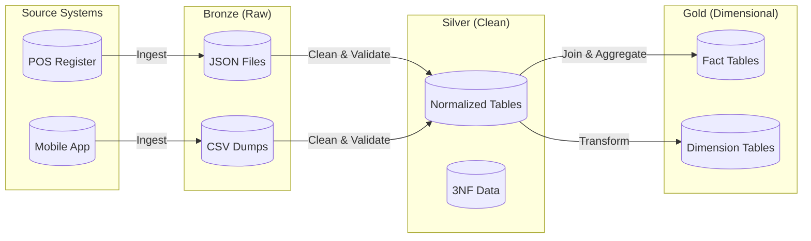

Previously, we established that the database running the Omni-Coffee cash register (OLTP) is fundamentally different from the database running the CEO's dashboard (OLAP). One is optimized for **writing** individual latte sales; the other is optimized for **reading** global sales trends.

But data doesn't just teleport from the cash register to the dashboard. It has to be moved,  unpacked, cleaned, and reshaped. It has to survive the journey.

In data engineering, we don't build teleporters. We build **pipelines**.

## 2.1 The Data Journey
Welcome to the factory floor. If Set Theory was our theoretical math class, this is the noisy industrial plant where the work actually gets  done.

The central problem of data engineering is that the data generated by applications is messy, hostile, and utterly unsuited for human analysis. The "data journey" is the process of taking that raw, volatile input and refining it until it becomes a trusted business asset.

### The Starting Point: Raw Chaos
Let's look at what actually happens when a barista at Omni-Coffee taps 'Purchase.' The point of sales system generates a log. It doesn't care about your analytics report; it cares about speed.

It might spit out a JSON blob that looks  like this:

```json
{
  "t_stamp": "2023-10-27T08:30:00Z",
  "u_id": "a1-99-z",
  "items": [
    {"sku": "LATT-GR", "mod": ["soy", "xtra_hot"], "cost": 550}
  ],
  "pay_stat": "ok",
  "loc": 4
}
```

!!! failure "The Analytics Nightmare"

    Look at that data.

    1.  **Cryptic Keys:** What is `u_id`? User ID? Transaction ID?
    2.  **Nested Structures:** The `items` are trapped inside a list. You can't sum a list.
    3.  **Weird Units:** `cost: 550`. Is that dollars? Cents? Yen?
    4.  **Codes:** `loc: 4`. Where is location 4? The warehouse? The downtown shop?

If you tried to build a report directly on this, you would spend hours writing code just to extract the price of a latte. And if the app developers changed "pay_stat" to "payment_status" next week, your report would crash.

### The Destination: Business Ready
Now, imagine what the Omni-Coffee regional manager wants to see. They don't want JSON brackets. They want a **set**—a clean relation that looks like a spreadsheet.

**The Sales Report Table**

| Date | Store | Product | Milk Modifier | Price |
|:---|:---|:---|:---|:---|
| 2023-10-27 | Downtown | Grande Latte | Soy Milk | 5.50 |

This is readable. It uses domain language ("Downtown", not "4"). It uses standard units (5.50). It is **business ready**.

### Crossing the Chasm
The goal of the pipeline is to bridge the gap between that JSON blob and that clean table. We can't do it in one step. If we try to clean, join, aggregate, and format the data all in one massive operation, we create a "Black Box" system. When it breaks (and it will), we won't know where the error occurred.

Instead, we break the journey into stages.

1. **Ingestion (Extract)**: We pull the raw file from the POS system and dump it into our analytics environment. We don't change it. We just secure it.
2. **Transformation**: We parse the JSON. We convert "550" to "5.50". We look up "Location 4" and swap it for "Downtown."
3. **Serving (Load)**: We present the data in the final structure (Star Schema) that the dashboard tool expects.

### The "Immutable" Law
There is one critical rule you must learn about this journey.

!!! warning "The Golden Rule of Engineering" 

    Never destroy the source.

    When you move data from the Raw stage to the Clean stage, you do not *edit* the file. You read the Raw file and *create* a new Clean file.

Why? Because you will make mistakes. You will accidentally convert the price to 55.0 instead of 5.50. You will misunderstand a timezone. If you have overwritten the source data, you are doomed. If you still have the raw copy, you just fix your code and run the pipeline again.

### Trade-offs: Latency vs. Accuracy
In Set Theory, a set simply "is." In System Design, a set "becomes." This process takes time.

- **Real-Time Pipelines**: As soon as the coffee is sold, the dashboard updates.
    - *Cost*: Extremely complex to build. High computational cost.
    - *Benefit*: Immediate insight.
- **Batch Pipelines**: We collect all the sales files at midnight and process them in one go.
    - *Cost*: The dashboard is always one day behind.
    - *Benefit*: Much cheaper, easier to fix, and usually more accurate because we can verify the totals.

For the purpose of this book (and for 90% of the industry), we focus on **Batch Processing**. It allows us to carefully architect our data models without the hair-on-fire stress of real-time streaming.

### Why Structure Matters
You might ask, "Why can't I just write a script to turn the JSON into the Report immediately?"

You can. That's how everyone starts. But then the Omni-Coffee CEO asks, "Can I see sales by barista?" Then, "Can I see sales by weather conditions?" Then, "What about inventory?"

If you build a custom script for every single question, you will end up with a tangled mess of "Spaghetti Code."

We need a standard architecture. A universal way to organize data at different stages of refinement. We need a system that acknowledges that data evolves.

We need the **Medallion Architecture**.

## 2.2 Bronze, Silver, Gold
In software engineering, we have "Separation of Concerns." You don't put your database connection code inside your user interface button.

In data engineering, we apply this same principle using the **Medallion Architecture**. We separate the data based on how "refined" it is. We label these stages **Bronze**, **Silver**, and **Gold**.

This isn't just about tidiness; it's about **reproducibility**. If we mess up a calculation in the Gold layer, we can delete it and rebuild it from Silver without having to go back to the source system.

### The Bronze Layer: The "Bag"
*Also known as: Raw Zone, Landing Zone, Data Lake.*

This is the loading dock. The Bronze layer is a direct dump of the data from the source systems.

- **Structure**: Whatever the source gave us (JSON, CSV, XML, unstructured text).
- **Set Theory Concept**: This is a **Bag** (Multiset). There are duplicates. There is no guaranteed order. There are no constraints.
- **The Rule: Immutable**. You are allowed to *append* new files here, but you never, ever modify an existing file. This is your legal record of what the system told you.

**Omni-Coffee Example**: We receive a batch of files every night from the cash registers. `sales_dump_2023_10_27.json`.

```json
{"id": 101, "item": "Latte", "cost": 500}
{"id": 101, "item": "Latte", "cost": 500}  <-- Duplicate! The register glitched.
{"id": 102, "item": "Muffin", "cost": null} <-- Dirty Data! Missing price.
```

In the Bronze layer, we keep that duplicate. We keep that null. We accept the chaos.

### The Silver Layer: The "Truth"
*Also known as: Staging, Cleansed, 3rd Normal Form (3NF).*

This is the prep kitchen. Here, we fix the data. We enforce the rules of Set Theory we learned in the previous module.

- **Structure**: Tables with defined columns and types.
- **Set Theory Concept**: Relation. Unique primary keys. Defined domains (types).
- **The Goal**: Data Integrity.

In Silver, we perform **Sanitization**:

1. **Deduplication**: We remove the accidental double-scan of the Latte.
2. **Type Enforcement**: We convert the string "`2023-10-27"` into a Date Object.
3. **Normalization**: We might split data into separate tables to reduce redundancy (The 3NF approach discussed in Chapter 1).

**Omni-Coffee Example**: We process the JSON into a clean table structure.

**Table: `silver_sales`**

| transaction_id (PK) | item_name | cost_cents |
|:---|:---|:---|
| 101 | Latte | 500 |
| 102 | Muffin | 0 |

!!! info "The Pivot Point"

    The Silver layer is for **Engineers**. It is optimized for storage efficiency and data quality. It is often hard to query because it is highly normalized (broken into many small tables).

### The Gold Layer: The "Product"
*Also known as: Presentation Layer, Dimensional Model, Data Mart.*

This is the showroom. This is the menu presented to the customer.

- **Structure**: Star Schemas (Facts and Dimensions).
- **The Goal**: **Usability and Performance**.

In the Gold layer, we stop caring about storage efficiency. We care about **cognitive load**. We want the data to be so simple that a business user with basic SQL skills (or a drag-and-drop tool like Tableau/PowerBI) can understand it instantly.

1. **Denormalization**: We smash tables back together.
2. **Business Logic**: We calculate "Net Profit" here so the analyst doesn't have to.
3. **Renaming**: We rename `c_id` to `customer_name` because "`c_id`" is scary.

**Omni-Coffee Example**: We join the sales data with the store data and the product data to create a readable report.

**Table: `gold_daily_sales_fact`**

| Date | Store_Region | Product_Category | Total_Revenue | 
| :--- | :--- | :--- | :--- | 
| 2023-10-27 | Midwest | Beverages | $5.00 | 
| 2023-10-27 | Midwest | Food | $0.00 |

### Visualizing the Architecture
Here is how the data flows through our Omni-Coffee infrastructure



## The Scope of The Remainder of this Module
This is a critical distinction to make before we move forward.

- **Set Theory (Module 1)** taught you how to build the **Silver Layer**. It taught you about atomic values, normalization, and avoiding anomalies.
- **Dimensional Modeling (this module)** is entirely about building the **Gold Layer**.

We are going to learn how to take that perfectly clean, normalized Silver data and "break it" intentionally—adding redundancy and complexity to the write process—to make the read process effortless for our users.

## Quiz

<quiz>
What is the 'Immutable Law' regarding the data in the Bronze (Raw) layer?
- [x] Never modify or destroy the source data.
- [ ] Always normalize the data before storing it.
- [ ] Convert all timestamps to UTC immediately upon arrival.
- [ ] Delete data older than 30 days to save space.

</quiz>

<quiz>
In Set Theory terms, which concept best describes the data in the Bronze Layer?
- [ ] Singleton
- [ ] A Relation
- [ ] A Function
- [x] A Bag (Multiset)

</quiz>

<quiz>
What is the primary responsibility of the Silver Layer?
- [ ] Creating Star Schemas
- [ ] Visualizing data for the CEO
- [x] Data Cleaning, Validation, and Normalization (3NF)
- [ ] Ingesting raw JSON files

</quiz>

<quiz>
Why do we intentionally 'break' the rules of normalization in the Gold Layer?
- [ ] To make writing data faster.
- [x] To reduce cognitive load and improve read performance for analysts.
- [ ] Because the database software requires it.
- [ ] To save disk space.

</quiz>

<quiz>
Which of the following is a characteristic of Batch Processing (as opposed to Real-Time)?
- [x] Higher latency (data is slightly outdated)
- [ ] Higher computational cost
- [ ] Instant data availability
- [ ] Lower accuracy

</quiz>

<quiz>
In the Omni-Coffee example, where would you find a table that lists 'Sales by Region' tailored for a dashboard?
- [ ] The Silver Layer
- [ ] The POS Logs
- [ ] The Bronze Layer
- [x] The Gold Layer

</quiz>

<quiz>
Why shouldn't you run heavy analytical reports directly on the Point of Sale (OLTP) database?
- [ ] The data in the POS is always incorrect.
- [ ] The POS database cannot perform math.
- [ ] SQL does not work on OLTP databases.
- [x] It risks slowing down or crashing the system used to serve customers.

</quiz>

<quiz>

What happens to a duplicate record (e.g., a double-scanned item) when moving from Bronze to Silver?
- [ ] It is highlighted in red.
- [x] It is deduplicated to ensure the dataset represents reality.
- [ ] It is moved to the Gold layer for analysis.
- [ ] It is preserved to maintain history.

</quiz>

<quiz>
What is the 'Separation of Concerns' in the Medallion Architecture?
- [x] Separating Raw Ingestion, Cleaning/Normalization, and Business Aggregation.
- [ ] Separating paying customers from non-paying visitors.
- [ ] Separating the Database Administrator from the Data Analyst.
- [ ] Separating data by file size.

</quiz>

<quiz>
If the Bronze layer is a 'Bag,' what is the Silver layer best described as?
- [ ] A Linked List
- [x] A Set (Relation)
- [ ] A Graph
- [ ] A Queue

</quiz>

<!-- mkdocs-quiz results -->