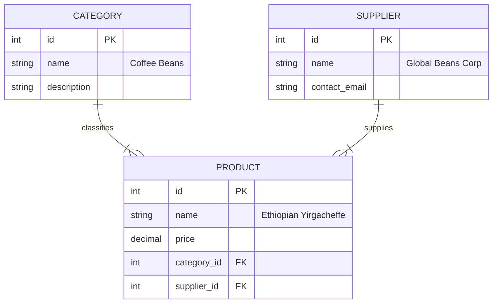
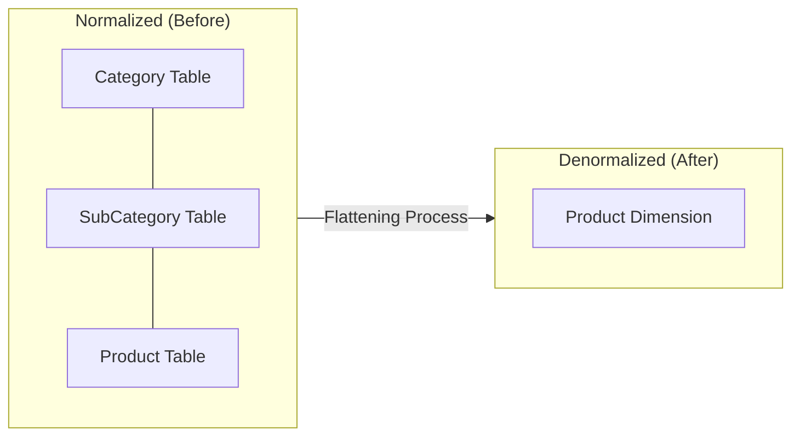

From the first day of Computer Science 101, you are taught the Golden Rule of Code: **DRY (Don't Repeat Yourself)**. You are taught that duplication is the root of all evil. If a piece of logic appears twice, you refactor it into a function. If a piece of data appears twice, you refactor it into a separate table.

In the OLTP world, this is excellent advice. It keeps the system lean and consistent.

In the data engineering world, however, strict adherence to DRY is a performance death sentence. To build a warehouse that answers questions fast, we have to embrace a new, uncomfortable philosophy: **WET (Write Everything Twice)**. Or thrice, or a million times.

We call this **denormalization**.

## 3.1 Redundancy is Good (Sometimes)
Let's turn to the Omni-Coffee Shop. We need to model our product catalog. We sell various beans, pastries, and merchandise.

In the application database (OLTP), the developers have normalized the catalog to perfection. They noticed that many products share the same category (e.g., "Coffee Beans") and the same supplier (e.g., "Global Beans Corp"). To save space and ensure consistency, they split these into three separate tables.

This is beautiful **3rd Normal Form**.

- **Pros**: If "Global Beans Corp" changes their email address, we update exactly one row in the `SUPPLIER` table.
- **Cons**: To find out who supplies the "Ethiopian Yirgacheffe," the database engine must physically look at the `PRODUCT` table, grab the ID `20`, jump to the `SUPPLIER` table, find ID `20`, and read the name.

### The Analytics Burden
Now, imagine the CEO asks a simple question: "**How much revenue did we generate from 'Global Beans Corp' products last year?**"

If we keep the data normalized in our warehouse, the query engine has to perform a "Triple jump":

1. Scan the `SALES` table (100 million rows).
2. For every sale, `JOIN` to `PRODUCT`.
3. From `PRODUCT`, `JOIN` to `SUPPLIER`.
4. Filter where `Supplier Name = 'Global Beans Corp'`.

That is two joins for every single line of revenue. If you are analyzing five years of data, your query might time out before it finishes.

### The Denormalized Solution
In dimensional modeling, we look at those three tables and see unnecessary complexity. We aren't concerned about saving disk space—disk space is the cheapest resource in computing. We care about **saving CPU cycles**—because CPU time is what makes queries fast (and what cloud providers charge you for).

So, we smash them together.

We take the attribute from `CATEGORY` and `SUPPLIER` and we paste them directly onto the `PRODUCT` table.

**Table: dim_product (Denormalized)**

| Product_Key | Product_Name | Category_Name | Supplier_Name | Supplier_Email |
|:---|:---|:---|:---|:---|
| 101 | Ethiopian Yirgacheffe | Coffee Beans | Global Beans Corp | contact@global.com |
| 102 | Colombian Supremo | Coffee Beans | Global Beans Corp | contact@global.com |
| 103 | Omni-Mug (Red) | Merchandise | Local Ceramics LLC | sales@local.com |
| 104 | Kenya AA | Coffee Beans | Global Beans Corp | contact@global.com |

Look at the **redundancy**.

We have written "Coffee Beans" three times. We have written "Global Beans Corp" three times. If we had a million coffee products, we would repeat those strings a million times.

To an OLTP engineer, this looks wasteful. To an OLAP engineer, this looks like **speed**.

Now, when the CEO asks about "Global Beans Corp," we don't need to join anything. We just scan the `dim_Product` table, find the column `Supplier_Name`, and filter. We have turned a complex web of relations into a simple, flat list.

### The Trade-Off: Maintenance Pain
Nothing comes for free. By duplicating data, we have introduced a new problem: **update anomalies**.

!!! warning "The Synchronization Problem"

    What happens if "Global Beans Corp" rebrands to "Galactic Beans"?

    - **In the normalized app**: We update 1 row. Done.
    - **In the denormalized warehouse**: We must find *every single product* linked to that supplier—potentially thousands of rows—and update them all.

This is the trade-off. We are making **writes** (updates) harder and slower so that **reads** (queries) can be faster.

Since a data warehouse is a system where we write data once a night (during the batch load) but reads it thousands of times a day (analysts running queries), this is a trade we happily make. We accept the burden of a heavier update process to give our users the speed of instant answers.

## 3.2 Trading Space for Time
To truly be comfortable with denormalization, you need to shed the scarcity mindset of the 1980s.

When Relational Database theory was being written, hard drive space was incredibly expensive. We're talking about thousands of dollars for a few megabytes. In that era, storing the string "Global Beans Corp" twice was a financial sin. Normalization wasn't just about data integrity; it was about survival. You normalized to save physical space on the spinning rust platter.

Today, the economics of computing have inverted.

1. **Storage is effectively free**. (You can store a Gigabyte on cloud storage for about $0.02 per month).
2. **Compute is expensive**. (Burning CPU cycles to join tables costs significantly more, both in dollars and in user patience).

This section is about the math being that trade-off.

### The Cost of Redundancy
Let's do a "back-of-the-napkin" calculation for the Omni-Coffee shop.

Suppose we have **10 million** rows in our `Sales` history. In a normalized world, we store a tiny integer `Supplier_ID` (4 bytes) in each row. In our denormalized world, we store the full string `Supplier_Name` ("Global Beans Corp"—let's say 20 bytes) in every single row.

We are "wasting" 16 bytes per row.

$$
10,000,000 \text{ rows } \times 16 \text{ bytes } \approx 160 \text{ Megabytes }
$$

In the grand scheme of a data warehouse, 160 MB is a rounding error. It costs fractions of a penny to store.

### The Cost of the Join
Now, look at the other side of the equation.

If we don't denormalize, every time an analyst runs a report by Supplier, the database engine has to perform a join on those 10 million rows.

A join is not a free operation. To join two tables, the database usually has to:

1. Load the keys from Table A into memory.
2. Build a hash map of those keys.
3. Stream Table B and probe that hash map for every single row.

This burns CPU cycles. It generates heat. It takes time.

If 50 analysts run 10 queries a day, that is 500 massive joins happening daily. You are effectively paying the CPU to reconstruct data that you could have just written down plainly in the first place.

!!! info "The Engineering Principle"

    **We buy speed with pennies**.

    We spend a tiny amount of money on extra disk space (the pennies) to save a massive amount of CPU time (the speed). In data engineering, this is almost always the correct bet.

### The Spectrum of Denormalization
This doesn't mean you should flatten your entire database into one single file (well, mostly—we'll discuss "One Big Table" later). It is a spectrum.

- **Fully Normalized (3NF)**: Zero redundancy. Maximum Joins. (Great for Apps).
- **Star Schema (Dimensional)**: Controlled redundancy. One layer of joins. (Great for warehouses).
- **One Big Table (OBT)**: Maximum redundancy. Zero joins. (Great for specific use cases).

In this module, we aim for the middle ground: the **Star Schema**. We denormalize the small stuff (Cities into States, Suppliers into Products) but we keep the massive transaction tables separate from the descriptive reference tables.

We do this because while storage is cheap, it isn't infinite, and managing a single table with 500 columns is its own kind of maintenance hell.

### Visualizing the Efficiency
Think of it physically.

**Normalized Query**: The database engine is like a shopper running all over a grocery store. "Get Milk (Aisle 1). Now get eggs (Aisle 12). Now get bread (Aisle 4)." Most of the time is spent traveling (joining) rather than picking (reading).

**Denormalized Query**: The database engine is a shopper standing in front of a pre-packed meal kit. "Get the breakfast kit." Everything is already there, side-by-side. The shopper just grabs it.

By accepting redundancy, we are pre-packing the meal kits for our analysts. We do the hard work of combining the data once during the night (when we load the warehouse) so that they don't have to do it every single time they run a query.

## 3.3 Flattening the Sets
You just finished a module on Set Theory, so let's speak that language for a moment.

In the world of pure logic, a join is essentially an operation on two sets. When you join `Orders` and `Customers`, you are looking for the intersection where the keys match, effectively calculating a subset of the Cartesian Product.

$$
Result = \{(o, c) \mid o \in \text{ Orders }, c \in \text{ Customers }, o.customer\_id = c.id\}
$$

In the normalized world (OLTP), these sets are kept physically separate. They live on different islands. To answer a question, the database engine has to build a bridge (compute the relationship) between three islands on the fly.

**Denormalization is the process of permanently merging these sets**.

We take the attributes of the smaller sets (the lookup table) and absorb them into the larger set. We "flatten" the hierarchy.

### The Collapse
Let's visualize the "Snowflake" again—that spiderweb of tables we saw in module 1. It has depth. It had branches.

- `Products` $\to$ `SubCategory` $\to$ `Category`

This is a **hierarchy**. It represents a chain of dependencies.

In dimensional modeling, we look at the chain and say, "I don't want a chain. I want a panel."

We take that entire branch of the tree and collapse it into a single, flat structure. We perform the joins once, during our data loading process (ETL), so that the database never has to do it again.

### Pre-Computing the Relationships
Think of this as "pre-joining."

When we build our **dimension tables** (which we will define in the next module), we are essentially pre-calculating the answers to future questions.

- **Question**: "What is the category of this product?"
- **Normalized Way**: "Hold on, let me go look up the SubCategory ID, then take that ID to the Category table..."
- **Denormalized Way**: "It's right here. Column 5."

We are taking the logical distance between two pieces of information (product name and category name) and reducing it to zero. They now live in the same row, in the same block of memory on the hard drive.

### The Limits of Flattening
"Okay." you say,"if flattening is so good, why don't we flatten everything? Why don't we just have one table for the entire company?"

That is the extreme end of the spectrum (One Big Table), and while valid for some modern systems, it has a major flaw for beginners: **chaos**.

If you flatten everything, you lose the definitions of things. You lose the clear distinction between a "Customer" and a "Sales Transaction."

This brings us to the **dimension modeling** compromise. We don't flatten the world into one sheet. Instead, we organize the world into two distinct types of sets:

1. **The Context (Dimensions)**: The descriptive nouns. (Customers, Products, Stores). We flatten these heavily.
2. **The Measurement (Facts)**: The numerical verbs. (Orders, Clicks, Payments). We keep these distinct.

We are about to leave the theoretical world of "Normalization vs. Denormalization" and start building. We are going to construct a specific architectural shape known as the **Star Schema**.

## Quiz

<quiz>
In the context of data engineering and warehousing, what does the acronym "WET" stand for, and why do we embrace it?
- [ ] Wait Every Time: Queries are naturally slow, so we must be patient.
- [ ] Write Every Transaction: We must log every single user action for security.
- [x] Write Everything Twice: We intentionally duplicate data to avoid joins and speed up reads.
- [ ] Waste Energy Today: It is a critique of how inefficient modern databases are.

</quiz>

<quiz>
When we denormalize the "Omni-Coffee" catalog by combining the supplier table into the product table, what specific 'pain' do we accept in exchange for read speed?
- [ ] Network Latency: Moving data becomes slower.
- [x] Update Anomalies: Changing the supplier's name requires updating thousands of rows instead of just one.
- [ ] Data Loss: We lose the original supplier information.
- [ ] Query Complexity: Queries become much harder to write.

</quiz>

<quiz>
According to the 'Economics of Computing' discussed in the module, why is storing the string 'Global Beans Corp' millions of times considered acceptable today?
- [ ] It isn't acceptable; this is a bad practice. and we should avoid it at all costs.
- [ ] Because modern hard drives automatically compress text so it takes zero space.
- [ ] Because database engines cannot handle integers efficiently anymore.
- [x] Because storage (Disk) is effectively free, while compute (CPU/Joins) are expensive.

</quiz>

<quiz>
What is the 'Triple Jump' problem described in the context of a normalized warehouse?
- [x] The requirement for the database to perform multiple joins to connect a fact to a distant attribute.
- [ ] An Olympic event that data engineers participate in.
- [ ] The process of copying data to three different backup locations.
- [ ] A security protocol requiring three passwords to access data.

</quiz>

<quiz>
In the 'Meal Kit' analogy, when does the 'hard work' of combining data happen in a dimensional model?
- [ ] Never: We leave the data raw.
- [ ] At Application Time: When the customer buys the coffee.
- [x] At Load Time (ETL): When the data is written into the warehouse.
- [ ] At Query Time: When the analyst runs the report.

</quiz>

<quiz>
What is the primary technical reason that joins are considered 'expensive' in an analytical database?
- [ ] They use up too much internet bandwidth.
- [ ] They require expensive software licenses.
- [ ] They confuse the SQL compiler.
- [x] They consume significant CPU cycles to build hash maps and probe rows.

</quiz>

<quiz>
When we "flatten" a hierarchy like Product $\to$ SubCategory $\to$ Category, what is the resulting structure?
- [ ] Three separate JSON files stored in a bucket.
- [x] A wide, shallow table containing attributes from all levels of the hierarchy.
- [ ] A deep, narrow table with many foreign keys.
- [ ] A recursive tree structure.

</quiz>

<quiz>
Why don't we simply flatten the entire database into 'One Big Table' (OBT) for every use case?
- [ ] Computers cannot handle tables with more than 10 columns.
- [ ] It makes the data look ugly in Excel.
- [x] It creates chaos by losing the distinction between entities (Context vs. Measurement) and is difficult to manage.
- [ ] It is illegal under the Geneva Convention.

</quiz>

<quiz>
What is the 'Golden Rule' of software engineering that we are actively breaking in this chapter?
- [ ] KISS (Keep It Simple, Stupid)
- [x] DRY (Don't Repeat Yourself)
- [ ] YAGNI (You Aren't Gonna Need It)
- [ ] SOLID Principles

</quiz>

<quiz>
Visually, what does a 'Star Schema' look like?
- [x] A central fact table surrounded by denormalized dimensional tables.
- [ ] A single spreadsheet with no links.
- [ ] A random spiderweb of interconnected tables.
- [ ] A long chain of tables linked one after another.

</quiz>

<!-- mkdocs-quiz results -->