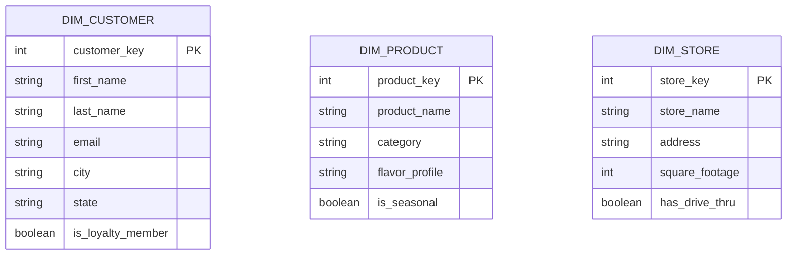
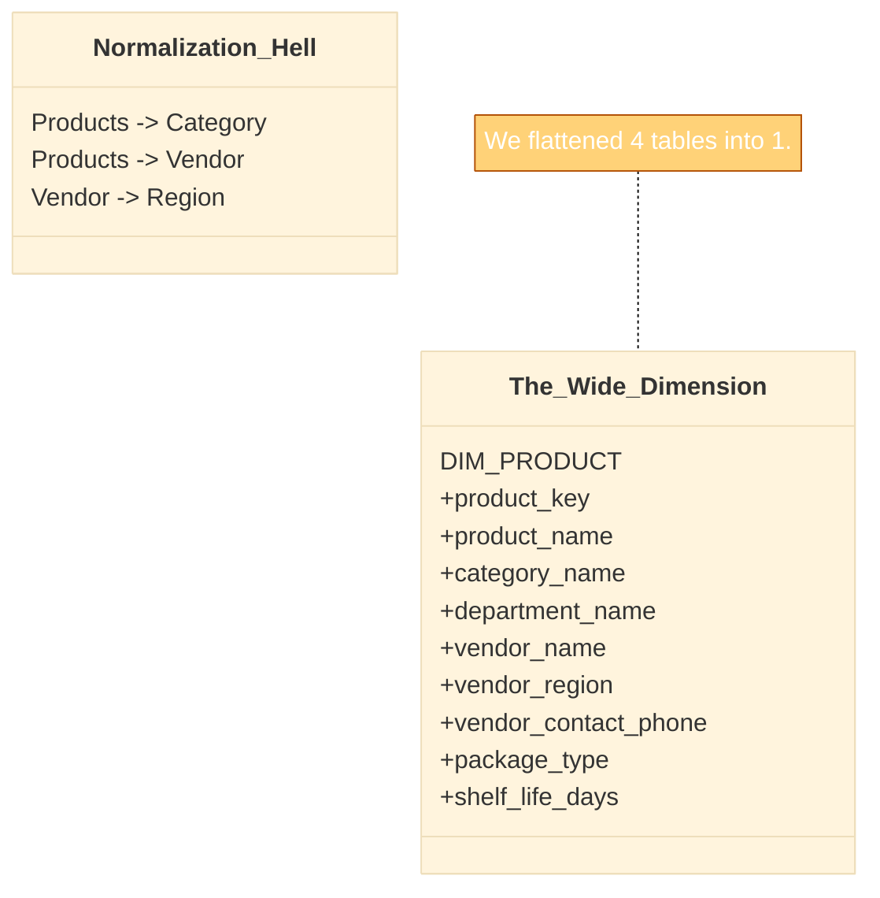
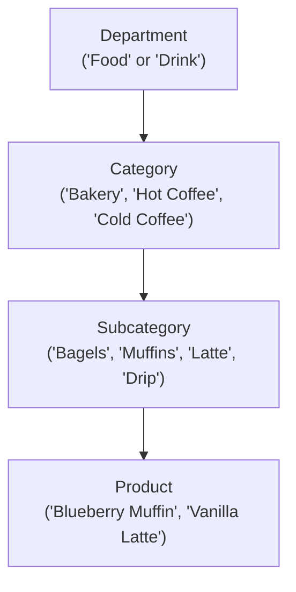

In the previous course, we looked at the world through the lens of **Set Theory**. We treated data as abstract collections of things—tuples inside relations. We were concerned with logical truth.

Now, we have to actually *build* something.

In the engineering world of data warehousing, we stop calling them "relations." We split that concept into two distinct architectural components: **Dimensions** and **Facts**.

If you look at a raw database, these two look identical. They are both tables. They both have columns and rows. But functionally? They are opposites. They represent the two sides of the human brain: the descriptive, storytelling side (Dimensions) and the mathematical, counting side (Facts).

We are going to start with the storytellers.

## 4.1 The "Noun" Tables
Imagine the manager of the 'Omni-Coffee' shop bursts into your office. They are frantic. They scream, *"we sold 500!"* and then run out.

You are left staring at the wall. 500 what? 500 coffees? 500 bagels? Did we sell them today? Last year? DId we sell them here or at the branch across town? Did we sell them to regular customers or tourists?

The number "500" is a **fact**. By itself, it is useless. It has no context.

To make the number useful, we need to surround it with **dimensions**. Dimensions provide the "Who, What, When, Where, and Why" of a business event. They are the **nouns** of your data sentence.

If the business event is a sentence like:

> "**Bob** bought a **Latte** at the **Downtown Store** on **Monday**."

Then your dimension tables are:

1. **Who**: Bob (`dim_customer`).
2. **What**: Latte (`dim_product`).
3. **Where**: Downtown Store (`dim_store`).
4. **When**: Monday (`dim_date`).

*(Notice the `dim_` prefix on the tables? This is an industry standard to denote which tables are dimension tables `dim_` and which are fact tables `fact_`).*

### The Container of Content
A dimension table is a container for descriptive text. It holds the attributes that business users want to "slice and dice" by.

When a stakeholder asks, "Show me sales **by product category**," or "Filter for customers **living in Indiana**," they are asking you to query a dimension table.

Let's look at what `dim_product` might look like for the 'Omni-Coffee Shop.'

!!! example "The Product Dimension"

    Notice that we aren't writing SQL. `CREATE TABLE` statements yet. We are designing the *schema*—the blueprint.

    | Column Name | Data Type | Example Data |
    |:---|:---|:---|
    | **product_key** | Integer | `101` |
    | **product_name** | String | `Caramel Macchiato` |
    | **category** | String | `Espresso Bar` |
    | **is_caffeinated** | Boolean | `True` |
    | **cup_size** | String | `Grande` |
    | **price_tier** | String | `Premium` |

### The "Texture" of Data
In Set Theory, we discussed sets defining a domain. In dimensional modeling, we discuss the dimensions defining the **texture** of the business.

The more columns (attributes) you add to a dimension, the richer the texture becomes. If your `dim_customer` table only has a `customer_id`, you know nothing about your customers. But if you add `zip_code`, `age_bracket`, `favorite_drink`, and `membership_level`, suddenly you can paint a picture.

### Visualizing the Schema
We represent these tables in our design documents using diagrams. Below is a mermaid JS representation of our "Noun" tables for the coffee shop. Note that they stand alone right now; we haven't connected them to anything yet.

### The Axis Analogy
Why do we call them "dimensions"? Think back to high school geometry or physics. To plot a point in 3D space, you need an X, Y, and Z axis.

- The **X-Axis** might be `Time`.
- The **Y-Axis** might be `Product`.
- The **Z-Axis** might be `Location`.

The data point (the sale) floats somewhere in the middle, defined entirely by its coordinates on these axes. If you remove the X-axis, the point loses its place in time. If you remove the Y-axis, you don't know what the point represents.

!!! tip "The Filtering Rule"

    If a user wants to **Filter**, **Group**, or **Label** data, that data belongs in a **dimension**.

    If a user wants to **Sum**, **Average**, or **Count** data, that belongs in a **Fact**.

## 4.2 Wide and Shallow
If you could physically hold a database table in your hands, a dimension table and a fact table would feel entirely different.

A fact table is a receipt tape. It is miles long, encompassing billions of transactions, but it is very narrow—just a few numbers and IDs.

A **dimension table**, on the other hand, is like an index card or a dossier. It is **wide** and **shallow**.

### The "Wide" Perspective
When we say a table is "wide," we mean it has a high column count.

In a traditional application database (OLTP), developers try to keep tables lean. They despise redundancy. If a product has a "Category," they split "Category" into its own table and link it with an ID. If the Category has a "Department," they split that too. This is the **3rd Normal Form (3NF)** we discussed in module 1.

In data engineering, we do the opposite. We embrace **denormalization**. We intentionally collapse those hierarchies back into a single, wide table.

Let's look at the **Omni-Coffee Shop**. In the application database, the Product information is scattered across four normalized tables to save space.

- `Products` table.
- `Product_Categories` table.
- `Vendors` table.
- `Vendor_Regions` table.

If an analyst wants to know *"Sales of coffee beans from Ethiopian vendors,"* the database engine has to perform a four-way sprint—joining all those tables together—just to find the products.

In our data warehouse, we fix this by creating one massive, wide `dim_product` table. We steal the columns from those four tables and stuff them all into one row.

!!! success "The Rule of Thumb"

    A good dimension table often has 50 to 100 columns. Do not be afraid of width. If a descriptive attribute exists anywhere in your ecosystem that relates to a Product, it belongs in `dim_product`.

### The "Shallow" Perspective
When we say a table is "Shallow," we mean it has a relatively low row count.

Think about the **Omni-Coffee Shop** again.

- We might sell 100,000 cups of coffee a day (facts).
- But we only have 50 items on the menu (dimensions).

Even if we act like a global corporation:

- Walmart has billions of sales (fact rows).
- But they only have a few hundred thousand products (dimension rows).

In the grand scheme of "Big Data," a table with 500,000 rows is tiny. You can load it into memory on a laptop. This allows the database engine to cache the entire dimension table in RAM, making filtering instantaneous.

### The "Centipede" Table
While we encourage width, there is a distinct shape you should aim for. We want meaningful width, not "junk" width.

A common anti-pattern is the **Centipede Table**. This happens when you have a dimension with too many 1-to-many relationships that don't belong there.

- **Good Width**: Attributes that describe the specific row perfectly (e.g., A specific bag of coffee has one flavor profile, one roast type, one vendor).
- **Bad Width**: Trying to stuff a list into a row. (e.g., a customer has many phone numbers. Do not create columns `phone_1`, `phone_2`, `phone_3`… that looks like a centipede).

## 4.3 Descriptive Attributes
If the dimension table is the "User interface" of your data warehouse, then **descriptive attributes** are the buttons and knobs.

When a business analyst opens a tool like PowerBI or Tableau, they are presented with a list of columns. They drag these columns into the "Filters" box (the `WHERE` clause) or the "Row/Columns" box (the `GROUP BY` clause).

Your job as a data engineer is to ensure that what they drag onto the canvas makes sense.

In the operation world (OLTP), developers love codes. They are terse and precise. In the analytical world (OLAP), we hate codes. We love words.

### The "No Decoding" Rule
Imagine an analyst wants to find out how many coffees were sold at the drive-thru. They look at your `dim_store` table.

**The Bad Design (The Operational Copy-Paste)**: They find a column called `store_type_id`. The values are `1`, `2`, and `3`. To write this query, the analyst has to go find a wiki page, look up what "2" means, and then write: `WHERE store_type_id = 2`.

**The Good Design (The Dimensional Model)**: They find a column called `store_format_description`. The values are `"Dine-In"`, `"Drive-Thru Only"`, and `"Kiosk"`. The analyst simply selects `"Drive-Thru Only"` from the dropdown list.

!!! tip "The Human Test"

    Open your dimension table. Read a row out loud. Does it sound like a sentence?

    - **Fail**: "Product 101, Cat 5, Type Z."
    - **Pass**: "Product 101 is a Hazelnut Latte, in the Hot Drinks category, sold as a Seasonal item."

### Handling Codes and Descriptions
Does this mean we delete the codes? No. The codes are often necessary for sorting or linking back to the source system.

The standard pattern is to include **both** the code and the description, side-by-side.

**Example: The Omni-Coffee `dim_employee` Table**

| Column Name | Value | Purpose |
|:---|:---|:---|
| `job_code` | `L1-BAR` | Sorting/SYstems: Used by the HR system. |
| `job_title` | `Lead Barista` | Reporting: Used on the dashboard header. |
| `job_category` | `Front of House` | Grouping: Used to aggregate labor costs. |

By providing `job_category`, we have done the thinking for the analyst. They don't need to know which job codes constitute "Front Of House." We encoded that logic directly into the table.

### The "No NULL" Policy
In a transactional database, `NULL` is a valid state. It means "we don't know" or "not applicable."

In a data warehouse, `NULL` **is a bug**.

Why? Because when an executive sees a pie chart, and one of the slices is labeled **(BLANK)** or **NULL**, they lose trust in the data. It looks broken. It looks like you forgot something.

As an architect, you must replace `NULL` with explicit, descriptive strings that explain *why* the data is missing.

#### Common Replacements

- **Unknown**: We simply don't know (e.g., a customer didn't fill out their gender).
- **Not Applicable (N/A)**: The attribute doesn't make sense for this row (e.g., the `flavor_profile` column for a "napkin").
- **System Default**: A placeholder used until data arrives.

### Flags and Indicators
One of the most powerful things you can do in a dimension is pre-calculate logic.

Suppose the Omni-Coffee marketing director asks, "Show me sales for all our 'Premium' products." "Premium" is a fuzzy business concept. Maybe it means "Price > $5.00" OR "Category = 'Single Origin'."

If you force every analyst to write that logic, half of them will get it wrong.

`dim_product` **Additions**:

- `is_premium` (Values: `Yes`, `No`).
- `is_caffeinated` (Values: `Caffeinated`, `Decaf`).
- `has_sugar` (Values: `Sweetened`, `Unsweetened`).

Notice I didn't use `True/False` booleans. I used `Yes/No` or descriptive text. Why? Because some BI tools struggle with raw booleans, often displaying them as `0` or `1`. `Yes` is universally understood.

## 4.4 Hierarchies
If descriptive attributes are the "what," then hierarchies are the "zoom."

Data analysis is rarely static. It is a journey of navigation. A regional manager starts looking at the **Country** level. They see a dip in sales. They zoom in to the **Region**. They see the "Midwest" is underperforming. They zoom in to the **District**, then the **City**, and finally the specific **Store**.

This path—Country $\to$ Region $\to$ District $\to$ City $\to$ Store—is a **hierarchy**.

In Set Theory, this is a nested set. Every store is a subset of a City. Every City is a subset of a District.

### The "Folding" Technique
In our application database (OLTP), hierarchies are usually modeled as a chain of distinct tables to enforce strict parent-child rules.

- `Table_Countries` (1 row per country).
- `Table_Regions` (Links to Country ID).
- `Table_Districts` (Links to Region ID).
- `Table_Stores` (Links to District ID).

If we kept this structure in our data warehouse, an analyst wanting to "drill down" would force the database to perform four separate joins just to figure out that the "Main St. Store" is in the "USA."

In dimensional modeling, we **fold** the entire hierarchy into the primary dimension.

We take the `dim_store` table, and we stamp the entire lineage of location directly onto the stores row.

`dim_store` **(The Folded Hierarchy)**

| store_name | city | district | region | country |
|:---|:---|:---|:---|:---|
| Main St. | Ft. Wayne | North Indiana | Midwest | USA |
| Campus Dr. | Ft. Wayne | North Indiana | Midwest | USA |
| Indy Downtown | Indianapolis | Central Indiana | Midwest | USA |
| Times Square | New York | Metro NY | Northeast | USA |

Notice the repetition. "Midwest" and "USA" appear multiple times. **This is intentional**. It allows the analyst to group by `region` without joining to a separate Region table.

### The Drill-Path
When you design a dimension, you are explicitly designing the "Drill-Path" for your users.

At **The Omni-Coffee Shop**, we might have a Product Hierarchy that looks like this:

When you build `dim_product`, you must include columns for **every single step** of this ladder.

- `department_name`
- `category_name`
- `subcategory_name`
- `product_name`

If you skip a step (e.g., you leave out `category_name`), you have broken the ladder. The analyst cannot "zoom out" from `Subcategory` to `Department` smoothly. They encounter a gap in the logic.

### Multiple Hierarchies
A single dimension can hold multiple, independent hierarchies.

Consider `dim_date`. A single day belongs to several different hierarchical trees:

1. **Calendar Hierarchy**: Day $\to$ Month $\to$ Quarter $\to$ Year.
2. **Fiscal Hierarchy**: Day $\to$ Fiscal Month $\to$ Fiscal Quarter $\to$ Fiscal Year.
3. **Weekly Hierarchy**: Day $\to$ Week $\to$ Year.

These hierarchies coexist peacefully in the same row.

| Date | Month | Fiscal Month | Week |
|:---|:---|:---|:---|
| 2025-01-15 | Jan 2025 | Period 4 | Week 03 |

### Ragged Hierarchies (The Edge Case)
Everything we have discussed so far is a **fixed depth hierarchy**. A product is always in a Subcategory, which is always in a Category.

Sometimes, life is messy.

Consider an **Organization Chart**.

- The CEO reports to no one.
- The VP reports to the CEO.
- The Manager reports to the VP.
- The Intern reports to the Manager.

This is a variable depth tree. The path from the bottom to the top might be 3 steps for one employee and 10 steps for another.

!!! warning "Engineering Headache: Ragged Hierarchies"

    Standard dimensional modeling (Star Schemas) struggles with ragged hierarchies because we rely on a fixed number of columns.

    If you try to flatten an Org Chart into `dim_employee`, you end up with columns like `manager_level_1`, `manager_level_2`, … , `manager_level_10`.

    **The Solution**: For beginners, force it into a fixed structure if possible. If the depth is truly variable and complex, you may need a specialized **Bridge Table** or recursive SQL. But try to avoid this complexity in your foundational schemas.

## Quiz

<quiz>
In the context of the 'Omni-Coffee Shop' example, which of the following best represents a 'Dimension'?
- [ ] The sales tax rate calculation.
- [ ] The number of lattes sold (500).
- [x] The customer (Bob) who bought the coffee.
- [ ] The total revenue from sales ($2,500).

</quiz>

<quiz>
Which physical shape best describes a well-designed DImension table?
- [ ] Narrow and Deep.
- [x] Wide and Shallow.
- [ ] Normalized and Linked.
- [ ] Compact and Numeric.

</quiz>

<quiz>
Why do we prefer storing full descriptive strings (e.g., 'Hazelnut Latte') over optimized codes (e.g., `prod_id: 45`) in a dimension table?
- [x] To reduce the cognitive load on business analysts.
- [ ] To ensure the database engine can index the column faster.
- [ ] To strictly adhere to 3rd Normal Form (3NF).
- [ ] To significantly reduce the storage footprint on the disk.

</quiz>

<quiz>
You are designing `dim_customer` and encounter missing data for the 'Gender' attribute. How should you handle this?
- [x] Replace `NULL` with a descriptive string like 'Unknown' or 'Not Provided.'
- [ ] Delete the customer row entirely to maintain data quality.
- [ ] Leave the field as NULL to accurately reflect the missing data.
- [ ] Use a default integer like -1 or 99.

</quiz>

<quiz>
What is the primary benefit of 'folding' a hierarchy (City $\to$ State $\to$ Country) into a single dimension table?
- [ ] It allows for variable-depth (ragged) hierarchies.
- [ ] It saves disk space by removing duplicate data.
- [x] It eliminates the need for multiple joins during analysis.
- [ ] It prevents the 'centipede' table anti-pattern.

</quiz>

<quiz>
Which of the following is an example of a 'Centipede Table' (an anti-pattern)?
- [ ] A `dim_product` table with 150 columns describing the product.
- [ ] A `dim_date` table that includes fiscal, calendar, and weekly attributes.
- [ ] A `dim_store` table that repeats the 'Region' name for every store.
- [x] A `dim_customer` table with columns: `phone_1`, `phone_2`, `phone_3`, `phone_4`.

</quiz>

<quiz>
What is the main reason we use "Flags" (e.g., `is_premium`, `has_sugar`) in a dimension?
- [ ] To help the database sort the rows alphabetically.
- [x] To pre-calculate complex business logic so analysts don't have to derive it.
- [ ] To save space by using single-bit data types.
- [ ] To replace the Primary Key of the table.

</quiz>

<quiz>
In the "Trade-offs" theme of this module, what are we trading when we denormalize a dimension?
- [ ] We trade security for accessibility.
- [ ] We trade simplicity for complexity.
- [ ] We trade data accuracy for faster writes.
- [x] We trade increased query speed for higher storage costs.

</quiz>

<quiz>
Which set of attributes would constitute a correct 'Drill-Path' for a Product Hierarchy?
- [x] Department $\to$ Category $\to$ Subcategory $\to$ Product Name.
- [ ] Department $\to$ Subcategory $\to$ Category.
- [ ] Product Name $\to$ Price $\to$ SKU.
- [ ] Category $\to$ Product Name $\to$ Department.

</quiz>

<quiz>
Why is the number '101' in the `dim_product` table (representing the product key) less useful to an analyst than the string 'Caramel Macchiato'?
- [x] The number 101 has no inherent context or 'texture.'
- [ ] The number 101 takes up more storage space.
- [ ] The number 101 cannot be used in a `WHERE` clause.
- [ ] It isn't; analyst prefer numbers because they are easier to type.

</quiz>

<!-- mkdocs-quiz results -->