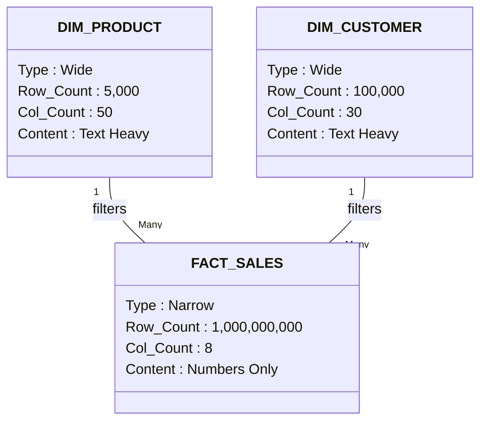

We have built our library of content. We have a robust list of Customers, Products, and Stores. But right now, those tables are just static lists. They don't do anything.

Now, we turn on the lights.

We are leaving the quiet library of dimensions and entering the noisy factory floor of **facts**.

## 5.1 The "Verb" Tables
If dimensions are **nouns** (Customers, Products, Store), then Fact tables are **verbs**.

- A Customer **Orders** a Product.
- A Student **Registers** for a Class.
- A Patient **Checks In** to a Hospital.
- A Warehouse **Receives** a Shipment.

The fact table records the event itself. It captures the interaction between your dimensions.

### The Anatomy of a Fact
A fact table is remarkably boring to look at. If you open one up, you won't see any human-readable text. No names, no cities, no product descriptions. You will only see two things:

1. **Foreign Keys (The Context)**: Integers pointing back to the dimension tables (e.g., `customer_key`, `product_key`).
2. **Measures (The Numbers)**: The numerical data generated by the event (e.g., `sales_amount`, `quantity`, `duration`).

In **The Omni-Coffee Shop**, the act of selling a latte creates a row in `fact_sales`

| date_key | store_key | product_key | customer_Key | quantity_sold | total_price |
|:---|:---|:---|:---|:---|:---|
| 20250116 | 10 | 505 | 9921 | 1 | 5.50 |

Notice how lean this is. It says, "On this date, at this place, this person bought this thing." It relies entirely on the dimensions to tell us *what* those IDs mean.

### The Three Species of Facts.
Not all verbs act the same way. In data engineering, we recognize three distinct "species" of fact tables. Understanding the difference is critical because they answer very different questions.

#### 1. The Transaction Fact (The "Event")
This is the most common and most important type. It represents a **discrete action** at a specific point in time.

- **Grain**: One row per event (or per line item on a receipt).
- **Example**: The barcode scanner beeps.
- **The Physics**: These facts are additive. You can sum up the sales for the day, the month, or the year, and the math works perfectly.

#### 2. The Periodic Snapshot (The "Status Report")
Occasionally, we aren't concerned with the *action*; we are concerned about the state.

Imagine the coffee shop manager asks, "How many pounds of coffee beans did we have in the back room on Tuesday night?"

A **periodic snapshot** takes a picture of the business at a regular interval (usually daily or monthly).

- **Grain**: One row per Product, per Store, per Day.
- **Example**: `fact_inventory_daily`.
- **The Physics**: These facts are **semi-additive**. You *can* sum up inventory across all stores (to get total inventory), but you *cannot* sum up inventory across time.
    - Inventory on Jan 1: 50 lbs.
    - Inventory on Jan 2: 48 lbs.
    - Sum: 98 lbs? No. That number is meaningless.

#### 3. The Accumulating Snapshot (The "Workflow")
This is the rarest type, used for processes that have a clear start and end.

Think about an **online order**. It isn't just one event; it is a lifecycle.

1. Order placed.
2. Order packed.
3. Order shipped.
4. Order delivered.

Instead of creating four separate rows, we create one row for the order and update it as it moves through the pipeline. This table has multiple Date foreign keys.

- **Column**: `order_id`, `placed_date_key`, `shipped_date_key`, `delivered_date_key`, `lag_days_to_ship`.
- **Use Case**: Answering "How long does it take on average to ship an order?"

!!! tip "Start with Transactions"

    When building your first data warehouse, 90% of your work will be transaction facts. They are the source of truth.

    Snapshots are usually derived *from* transactions (or from source system logs). If you are overwhelmed, just focus on capturing the atomic events first.

## 5.2 Narrow and Deep
In the previous module, we learned that dimensions are "wide and shallow." We encouraged you to be wasteful with space—to add as many descriptive columns as you wanted.

**Fact tables are the opposite**.

A fact table is **narrow** and **deep**.

- **Narrow**: It has very few columns (usually 5 to 15).
- **Deep**: It has a massive number of rows (millions, billions, or trillions).

### The "No Text" Rule
The first rule of designing a fact table is to **keep it quiet**.

Text is "heavy." A string like `"Caramel Macchiato"` requires significantly more bytes of storage than the integer `505`.

When you are storing 50 rows (like a menu), text is fine. When you are storing **500 million sales**, that text becomes a catastrophic burden.

If you repeat the string `"Caramel Macchiato"` 500 million times, you are wasting gigabytes of storage and clogging up the memory of your database.

**The Fact Table Diet**:

1. **Foreign Keys (Integers)**: `product_key`, `store_key`, `date_key`.
2. **Measures (Numbers)**: `quantity`, `amount`.
3. **Metadata (Timestamps)**: `created_at`.

That's it. If you find yourself wanting to put a column called `sales_notes` or `customer_comment` into a fact table, **stop**. That text belongs in a dimension linked by an ID.

### Exception: The "Degenerate" Dimension
There is one major exception to the "No Text" rule.

Occasionally, a transaction has a unique identifier, like an **invoice number** (`INV-2025-001`) or a **transaction ID**.

This ID is technically text. However, it is unique to the event. It doesn't belong in a dimension because it doesn't describe a "group" of things; it is the thing. We call this a **degenerate dimension**. It lives alone in the fact table because there is nowhere else for it to go.

### The "Deep" Perspective
Why do we starve the fact table of columns? Because we need to leave room for the **depth**.

Let's do the math for **The Omni-Coffee Shop**.

- We have 500 stores.
- Each store makes 1,000 transactions a day.
- That's 500,000 rows per day.
- That's 182 million rows per year.
- After 5 years, our fact table has nearly 1 billion rows.

In the world of "Big Data," fact tables often grow into the trillions.

### The Physics of Scanning
Imagine you are the database engine. The CEO asks, "What was the total revenue for 2024?"

To answer this, you have to read the `revenue` column.

- **Scenario A (Wide Fact Table)**: The table includes customer names, product names, and addresses. The table is huge and bloated. To read the revenue, you have to skip over massive chunks of text data. It's like trying to run a marathon while carrying a backpack full of bricks.
- **Scenario B (Narrow Fact Table)**: The table contains only integers and decimals. The data is packed tight. You can scan down the `revenue` column at lightning speed, ignoring everything else.

### Visualizing the Shapes
We can visualize the relationship between these tables as a T-shape or a Star. The thin, central fact table is the spine, supporting the heavy, wide dimension tables.

## 5.3 Foreign Keys
We established that a fact table is stripped of **all** personality. It contains no names, no dates, and no descriptions. It is a grid of numbers.

So, how do we know what we sold?

We use **Foreign Keys (FKs)**. These are the "pointers" or "hooks" that drag the context back into the room.

### The Connective Tissues
In our `fact_sales` table, you will see columns like:

- `product_key`
- `store_key`
- `customer_key`

These are not the data itself; they are the **addresses** of the data.

When the database engine reads a row with `product_key: 505`, it acts like a librarian. It pauses, walks over to the `dim_product` shelf, finds book #505, and reads the title, "Hazelnut Latte."

### Why Integers?
You might ask, "Why not just use the product SKU ('COF-HAZ-001') as the key? That's unique, right?"

You could. But in data engineering, we almost always use simple integers (1, 2, 3, …) instead of alphanumeric strings.

1. **Speed**: Computers compare integers blindingly fast. Checking if `505 == 505` takes a fraction of a CPU cycle. Checking if `"COF-HAZ-001" == "COF-HAZ-001"` takes significantly longer. When you are joining a billion rows, those nanoseconds add up to hours.
2. **Size**: An integer is 4 bytes. A string code might be 10 or 20 bytes. Across a billion rows, switching to integers can save Gigabytes of RAM.

### The "Referential Integrity" Promise
This is the most sacred rule of the data warehouse.

**Rule**: Every foreign key in the fact table **must** find a matching primary key in the dimension table.

If `fact_sales` has a row where `product_key` is `999`, but there is no Product #999 in `dim_product`, you have a data disaster. This is called an **orphan record**.

- The revenue exists (we have the money).
- But we don't know *what* generated it.

When this happens, reports break. The sum of "Sales by Category" will be less than the "Total Sales," because the orphan records disappear during the join.

### The "No NULL" Foreign Key
In a typical application database, if we make a cash sale to an anonymous walk-in, the `customer_id` is often left `NULL`.

In dimensional modeling, **we do not allow NULL foreign keys**.

Why? Because `NULL` doesn't join to anything. If you run a report grouped by "CustomerSegment," the `NULL` rows simply vanish. The money disappears from the report.

**The Solution: The "Unknown" Member**: We handle this by creating a specific row in our dimension table—usually with an ID `-1` or `0`—to represent "Unknown" or "N/A."

**Step 1: The Dimension (`dim_customer`)**

| customer_key | name | city | type |
|:---|:---|:---|:---|
| -1 | "Unknown / Walk-In" | "N/A" | "Anonymous" | 
| 101 | Bob Smith | New York | Registered |

**Step 2: The Fact (`fact_sales`)**:

| transaction_id | customer_key | amount |
|:---|:---|:---|
| 55001 | 101 | 5.50 |
| 55002 | -1 | 4.00 |

Now, when we join the tables, that $4.00 sale doesn't vanish. It is bucketed under "Anonymous." The math balances perfectly.

## Quiz

<quiz>
Which of the following best describes the primary function of a fact table?
- [ ] To serve as a lookup table for system codes.
- [ ] To define the hierarchy of a product category.
- [x] To record business events and measurements (verbs).
- [ ] To store descriptive attributes like names and addresses.

</quiz>

<quiz>
What are the two main components found inside a fact table?
- [x] Foreign keys and measures.
- [ ] Strings and dates.
- [ ] Boolean flags and blobs.
- [ ] Primary keys and descriptions.

</quiz>

<quiz>
Which type of fact table would be best for answering, "How much inventory did we have in the warehouse on Sunday night?"
- [ ] Accumulating snapshot.
- [ ] Transaction fact.
- [x] Periodic snapshot.
- [ ] Factless fact table.

</quiz>

<quiz>
Why is the string 'Caramel Macchiato' excluded from the `fact_sales` table?
- [ ] It is not unique enough.
- [ ] Business users don't need to see the product name.
- [ ] SQL cannot sum up strings.
- [x] It takes up too much storage space when repeated millions of times.

</quiz>

<quiz>
What is a "Degenerate Dimension"?
- [x] A unique identifier (like an invoice ID) that lives in the fact table because it has no other home.
- [ ] A dimension that has no attributes.
- [ ] A dimension that has been deleted from the warehouse.
- [ ] A dimension with low data quality.

</quiz>

<quiz>
In a Star Schema, how does the fact table relate to the dimension tables?
- [ ] The fact table is the parent, and dimensions are children.
- [x] The fact table is the center, linked to surrounding dimensions via foreign keys.
- [ ] They are unrelated and queried separately.
- [ ] The fact table and dimension tables are merged into one OBT.

</quiz>

<quiz>
Why do we use integer foreign keys instead of checking `product_sku` strings directly in the fact table?
- [x] Because integers join significantly faster and use less memory.
- [ ] To allow for fuzzy matching.
- [ ] Because integers are easier to read.
- [ ] Because source systems always provide integers.

</quiz>

<quiz>
What is the rule regarding NULL foreign keys in a fact table?
- [ ] They should be deleted immediately.
- [ ] They act as wildcards matching all dimensions.
- [ ] They are allowed and represent missing data.
- [x] They should be replaced with a specific "Unknown" key (e.g., `-1`).

</quiz>

<quiz>
Which of the following is an example of a "Semi-Additive" measure?
- [ ] Discount percentage.
- [ ] Quantity sold.
- [x] Warehouse inventory balance.
- [ ] Sales amount.

</quiz>

<quiz>
Why is 'Accumulating Snapshot' considered the rarest type of fact table?
- [ ] It takes up too much space.
- [ ] It replaces the Star Schema.
- [ ] Modern databases cannot handle updates.
- [x] It is only used for workflows with a defined start and end (like shipping).

</quiz>

<!-- mkdocs-quiz results -->