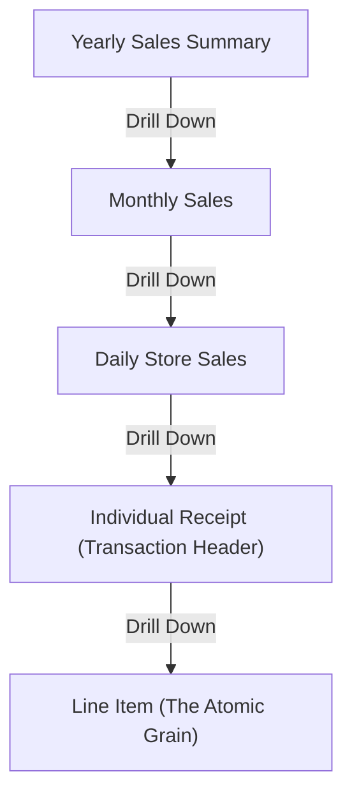
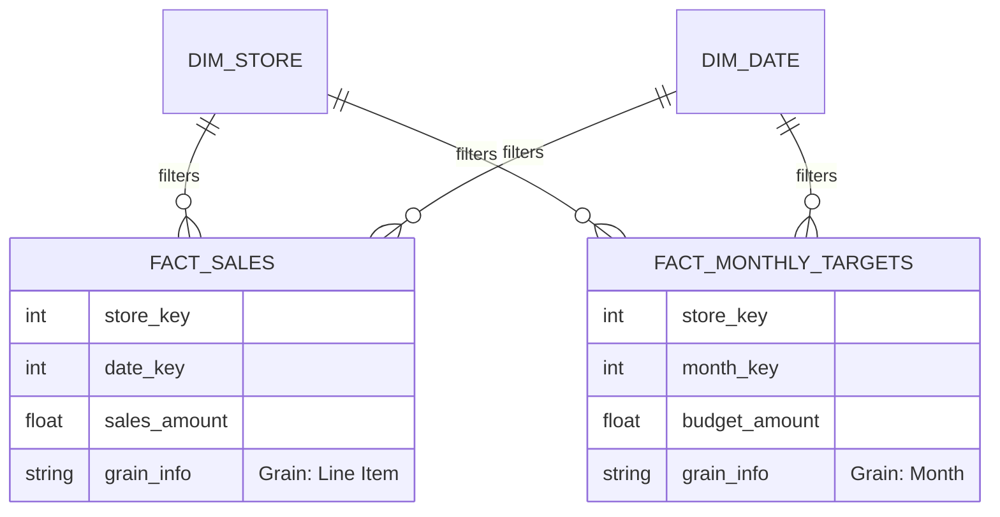

In the last module, we separated our world into **dimensions** (the context) and **facts** (the measurements). We have our nouns and our verbs. But before we start laying bricks for **The Omni-Coffee Company's** data warehouse, we have to make the single most important decision in the entire design process.

It is a decision so fundamental that if you get it wrong, no amount of SQL wizardry or cloud compute power can save you. It is the decision of **grain**.

## 6.1 Defining the Atomic Level
The grain is the "resolution" of your data. It answers the simple, deceptively dangerous question:

> "What precisely does a single row in this table represent?"

If your fact table were a digital photo, the grain would be the pixel density. A high-resolution photo (fine grain) lets you zoom in and see the individual coffee beans. The low-resolution photo (coarse grain) might just show a blurry brown shape.

In data engineering, we always want the highest resolution possible. We call this the **atomic level**.

### The Omni-Coffee Dilemma
Let's look at a typical Tuesday morning at the shop. A customer, Alice walks in and orders two things:

1. A large Vanilla Latte ($5.00).
2. A blueberry muffin ($3.50).

She taps her card, the register beeps, and a transaction is recorded. The total is $8.50.

As a data architect, you have two ways to record this event in your fact table. These two ways represent two different **grains**.

#### Option A: The Transaction Grain (Coarse)
You decide that one row represents **one customer payment**.

| Date | Store_ID | Order_ID | Total_Sales_Amount |
|:---|:---|:---|:---|
| 2024-01-16 | NY_001 | ORD_998 | 8.50 |

This table is "short." It doesn't take up much space. It answers the CEO's question ("How much money did we make today?") instantly.

But then the inventory manager asks, "Hey, are we selling more muffins than croissants?"

You look at your table. You see `8.50`. You have no idea if that was a latte and a muffin, or two cappuccinos, or eight very cheap cookies. You have lost the **context** of the sale because you chose a grain that was too "high up." You aggregated the data too early.

#### Option B: The Line Item Grain (Fine / Atomic)
You decide that one row represents **one scan of a barcode** (a line item).

| Date | Store_ID | Order_ID | Product_ID | Quantity | Sales_Amount |
|:---|:---|:---|:---|:---|:---|
| 2024-01-06 | NY_001 | ORD_998 | PROD_Latte | 1 | 5.00 |
| 2024-01-06 | NY_001 | ORD_998 | PROD_Muffin | 1 | 3.50 |

This table is "taller." It has twice as many rows as Option A. It takes up more storage. But look at the power we gained.

- **CEO**: "How much did we make?" $\to$ Sum the `Sales_Amount` (5.00 + 3.50 = 8.50).
- **Inventory Manager**: "Did we sell a muffin?" $\to$ Filter where `Product_ID = PROD_Muffin`.

!!! success "The Architectural Rule"

    Always store data at the lowest possible level of granularity provided by the source system.

    This is called the **atomic grain**. You can always roll atomic data *up* (aggregate it) to answer high-level questions. You can **never** drill aggregated data *down* to recover lost details.

### Visualizing the Hierarchy
We can visualize grain as a hierarchy of detail. As we move down, the data becomes more "Atomic" (indivisible).

In the diagram above, the **line item** is the atom. It is the physics of the business process. You cannot physically sell half a line item. This is where we want our fact table to live.

### The "One Row" Litmus Test
When you are designing a schema, you should be able to recite the grain of every fact table in a single, boring sentence. If you stumble, your design is flawed.

The sentence structure is:

> "One row in this table represents one **[Action]** per **[Dimension]**."

**Examples from Omni-Coffee**:

- **Bad (Vague)**: "This table shows sales info."
- **Good (Clear)**: "One row represents one **line item sold** to a **customer** at the **register**."
- **Bad (Vague)**: "This table tracks employee hours."
- **Good (Clear)**: "One row represents one **shift worked** by one **employee** on one **day**.

### Truth vs. Trade-offs
You might be thinking, "If atomic data is so great, why would anyone ever use a coarse grain?"

Back in the days when hard drives were expensive and CPUs were slow, storing every single coffee bean sale was technically impossible. Engineers *had* to summarize data (e.g., store only daily sales totals) just to get the query to finish before the sun burned out.

Today, storage is cheap. Cloud data warehouses like BigQuery and Snowflake eat billions of rows for breakfast. The modern trade-off has shifted:

| Strategy | Storage Cost | Query Speed | Flexibility |
|:---|:---|:---|:---|
| Atomic Grain | High (Heavy tables) | Moderate (Scanning lots of rows) | Maximum (Answer any question) |
| Aggregated Grain | Low (Light tables) | Fast (Pre-calculated math) | Low (Restricted to specific questions) |

In the "blueprint," we prioritize **flexibility**. We build our foundation on the atomic grain. If—and only if—the queries become too slow, we build smaller, aggregated tables on top of the atomic ones. But we never throw away the atoms.

## 6.2 The Cardinality Trap
In Set Theory, we defined **Cardinality** simply as "the number of elements in a set." If a set has three elements—`{Espresso, Latte, Cappuccino}`—it's cardinality is 3.

In data engineering, we slightly tweak this definition. When we talk about the cardinality of a **column**, we are talking about the **uniqueness** of the data inside it.

- **Low Cardinality**: The values repeat (e.g., `Gender`, `State`, `Payment_Method`).
- **High Cardinality**: The values are mostly unique (e.g., `Email_Address`, `Social_Security_Number`, `Transaction_ID`).

This distinction seems trivial, but ignoring it leads to **The Cardinality Trap**: a design mistake that can turn a snappy, sub-second query into a server-killing disaster.

### The Spectrum of Uniqueness
Let's look at the data flowing out of **Omni-Coffee's** point of sale (POS) system. We can classify every attribute based on how "distinct" it is.

| Attribute | Example Values | Cardinality | Set Theory Equivalent |
|:---|:---|:---|:---|
| Store_Region | North, South, East, West | Very Low (4) | A tiny set |
| Product_Name | Latte, Muffin, Tea | Low (50-100) | A manageable set |
| Store_ID | NY001, CA098 | Medium (500) | A concise list | 
| Customer_ID | bob_123, alice_99 | High (1,000,000+) | A massive population |
| Transaction_DI | TXN_99988877 | Unique (billions) | An infinite stream |

### The Trap: "The Monster Dimension"
Remember the architectural rule from module 3, "dimensions are 'wide and shallow'." They give us context. We want to `GROUP BY` dimensions.

The trap occurs when you mistake a high cardinality attribute for a standard grouping attribute.

Imagine your CEO asks for a report, "Show me the total sales by Store."

- **Query**: Group by `Store_Name`.
- **Result**: 50 rows.
- **Brain**: "I can read this. New York is doing great."

Now imagine the CEO asks, "Show me total sales by Transaction ID."

- **Query**: Group by `Transaction_ID`.
- **Result**: 100 million rows.
- **Brain**: "This is useless noise."

### The Engineering Compromise
The problem isn't just that the report is unreadable; it's that you have broken the physics of your database.

Dimensions are meant to be **small reference tables**. Database engines are smart; they often load small dimensions entirely into RAM (memory) so they can access them instantly.

- If your `Product_Dimensions` has 100 rows, the database keeps it in its back pocket.
- If you try to build a `Transaction_Dimension` containing every single transaction ID, you have created a table just as heavy as your fact table. You can't cache 100 million rows in RAM.

### Handling High Cardinality
So, where do we put these high cardinality beasts?

**1. The "Degenerate" Dimension (Fact Columns)**: Some data is so unique (like `Transaction_ID` or `Invoice_Number`) that it doesn't deserve its own dimension table. It is "dimension-ish" because it's not a number we sum up, but it has the cardinality of a fact.

- **Solution**: Leave it sitting right there in the fact table. Don't move it. It acts as a label for the row.

**2. The "Deep" Dimension (Customer Tables)**: Occasionally, we *must* have a high cardinality dimension. **Omni-Coffee** has 5 million loyalty members. We need a `Customer_Dimension` to track their addresses and emails.

- **Solution**: We accept that this table is "deep." We warn the business users, "Don't try to pull a report listing every single customer unless you really need it." We treat this table with extra care, ensuring it is properly indexed.

### The Rule of Thumb
When you are modeling, look at your columns and ask, "How fast does this set grow?"

- **Bounded Sets (Slow Growth)**: States, Stores, Products $\to$ **perfect dimension**.
- **Unbounded Sets (Fast Growth)**: Transactions, Web Sessions, IoT Sensor Readings $\to$ **keep in the fact table (or use caution)**.

If you try to force an unbounded set into a standard dimension structure, you fall into the cardinality trap. You create a dimension that grows faster than your maintenance scripts can handle.

## 6.3 Mixed Grains
We have defined our atomic level, and we have assessed the size of our sets. Now, we arrive at the most common way to completely wreck a data model.

In the industry, we call this the **mixed grain** problem. It is the "deadly sin" of dimensional modeling. It occurs when you try to force two numbers with different physical realities into the same table.

### The "Budget vs. Actual" Trap
Let's return to **Omni-Coffee**. The regional manager comes to you with a simple request:

> "I need a dashboard showing if our stores are hitting their sales targets."

You look at the source data:

1. **Sales (Actuals)**: These come from the cash register. They are atomic. They happen every few seconds. (Grain: line item).
2. **Targets (Budget)**: These come from a spreadsheet in finance. They are set once a month for the whole store. (Grain: month per store).

The temptation—the "Lazy Engineer" impulse—is to just smash these together. You think, "I'll just add a column to my Sales Fact table called `Monthly_Budget`."

**The "Frankenstein" Table (Don't do this):**

| Date | Store | Product | Sales_Amount | Monthly_Budget |
|:---|:---|:---|:---|:---|
| Jan 1 | NY001 | Latte | 5.00 | 50,000 |
| Jan 1 | NY001 | Muffin | 3.50 | 50,000 |
| Jan 1 | NY001 | Coffee | 2.00 | 50,000 |

Do you see the disaster?

If you run a query to sum up the performance: `SUM(Sales_Amount) = 10.50` (Correct). `SUM(Monthly_Budget) = 150,000` (Catastrophically wrong).

Because the grain of the budget (50,000) is **monthly**, but the grain of the table is **transactional**, you have repeated the budget value on every single receipt line. If the store sells 10,000 items that month, your report will say the budget was $500,000,000. The manager will have a heart attack, and you will have some explaining to do.

### The "Allocation" Fallacy
Some engineers try to be clever. They think, "I'll just divide the budget by the number of days in the month!" or "I'll divide it by the number of transactions!"

This is called **allocation**, and it's dangerous.

- If you divide a monthly budget into daily chunks, you assume every day is equal. 
- If you allocate based on expected traffic, you are guessing.

!!! tip "Dimensional Modeling Rule"

    Never store data at a grain lower than it actually exists.

    If the budget is monthly, it lives in a monthly table. You cannot magically  turn a monthly number into a daily number without making assumptions (guessing). We deal in facts, not guesses.

### The Solution: Separate Tables
The correct architecture is to acknowledge that these are two different shapes. We create two separate fact tables.

1. `Fact_Sales`: Grain = Line item. (Contains `Sales_Amount`).
2. `Fact_Monthly_Targets`: Grain = Month per Store. (Contains `Budget_Amount`).

They share common dimensions (Store, Date/Month), but they never touch in the same physical table.

### Drill-Across: The Magic Trick
So how do we answer the manager's question? We don't join these tables directly (that causes a row explosion).

We use a technique called **drill-across**:

1. **Query A**: Sum `Sales_Amount` from `Fact_Sales`, grouped by Month and Store.
2. **Query B**: Sum `Budget_Amount` from `Fact_Monthly_Targets`, grouped by Month and Store.
3. **Merge**: Combine the *two results* (which are now at the same grain!) in the final report layer.

By aggregating the fine-grained table (Sales) up to the level of the coarse-grained table (Targets), they can finally talk to each other safely.

!!! danger "The Deadly Sin"

    **Never** mix grains in a single fact table. 

    - If you have daily data and monthly data, you have **two tables**.
    - If you have shipment data (per truck) and line-item data (per box), you have **two tables**.

    Respect the grain. It is the physical boundary of your data.

## Quiz

<quiz>
In the context of dimensional modeling, what is the most accurate definition of 'grain'?
- [ ] The number of columns in a dimension table.
- [ ] The physical storage size of the table on the disk.
- [x] What a single row in the table represents.
- [ ] The speed at which a query returns results.

</quiz>

<quiz>
Why does the 'blueprint' recommend storing data at the atomic grain (lowest level) rather than at an aggregated level?
- [ ] It eliminates the need for dimension tables.
- [ ] It simplifies the SQL syntax for beginners.
- [x] It provides maximum query flexibility.
- [ ] It consumes the least amount of storage space.

</quiz>

<quiz>
In the Omni-Coffee example, which of the following represents the finest (atomic) grain?
- [ ] The total transaction (One row per payment).
- [ ] The daily store summary (One row per store per day).
- [x] The line item (One row per barcode scan).
- [ ] The shift summary (One row per barista shift).

</quiz>

<quiz>
What is the 'Cardinality Trap'?
- [ ] Storing too many columns in a fact table.
- [ ] Using a float data type for currency values.
- [x] Mistaking a high-cardinality attribute for a standard grouping dimension.
- [ ] Creating a Star Schema with fewer than 5 points.

</quiz>

<quiz>
Which of the following attributes has the highest cardinality?
- [ ] Product category (e.g., 'Bakery,' 'Beverage')
- [ ] Payment method (e.g., 'Cash,' 'Credit')
- [ ] Store ID (e.g., NY001)
- [x] Transaction ID (e.g., 'TXN_99988777')

</quiz>

<quiz>
How should you handle a 'degenerate dimension' like a transaction ID?
- [ ] Create a separate 'transaction dimension' table.
- [ ] Move it to the date dimension.
- [x] Leave it in the fact table.
- [ ] Delete it to save space.

</quiz>

<quiz>
What happens if you store Monthly Budget targets in the same table as Daily Sales transactions (The Mixed Grain Deadly Sin)?
- [ ] The query speed will increase significantly.
- [ ] The sales values will be averaged out to match the monthly gain.
- [x] The budget values will be repeated for every transaction, causing massive inflation when summed.
- [ ] The database will reject the data load.

</quiz>

<quiz>
Why is 'allocating' a monthly budget into daily rows (e.g., dividing by 30) considered a bad practice in the 'blueprint'?
- [ ] It makes the numbers too small to read.
- [ ] It prevents the use of Star Schemas.
- [ ] It requires too much CPU power to calculate.
- [x] It turns a fact into a guess.

</quiz>

<quiz>
What is the correct architectural solution for analyzing monthly budgets vs. daily sales?
- [ ] A single fact table using the lowest grain (sales).
- [ ] Storing the budget in a dimension table.
- [ ] One Big Table (OBT) with many NULL values.
- [x] Two separate fact tables linked by common dimensions.

</quiz>

<quiz>
What is the name of the technique used to combine results from two different fact tables (e.g., Sales and Budgets)?
- [x] Drill-Across
- [ ] Drill-Down
- [ ] Cross-Join
- [ ] Roll-Up

</quiz>

<!-- mkdocs-quiz results -->