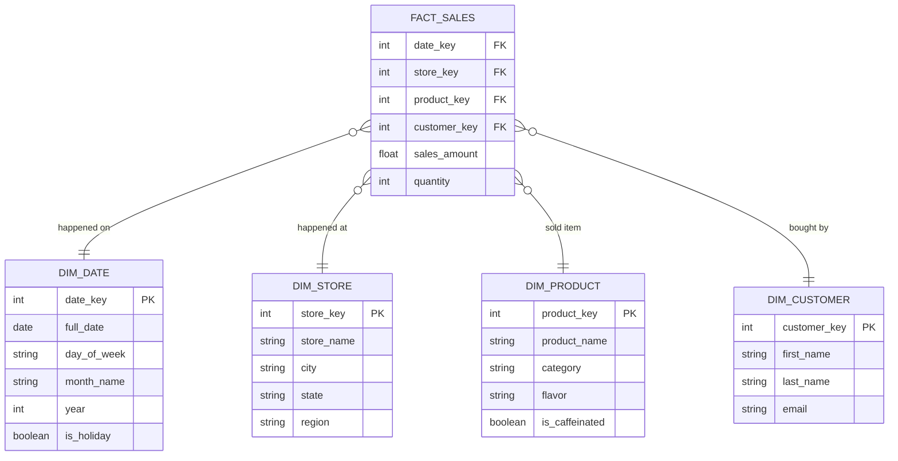
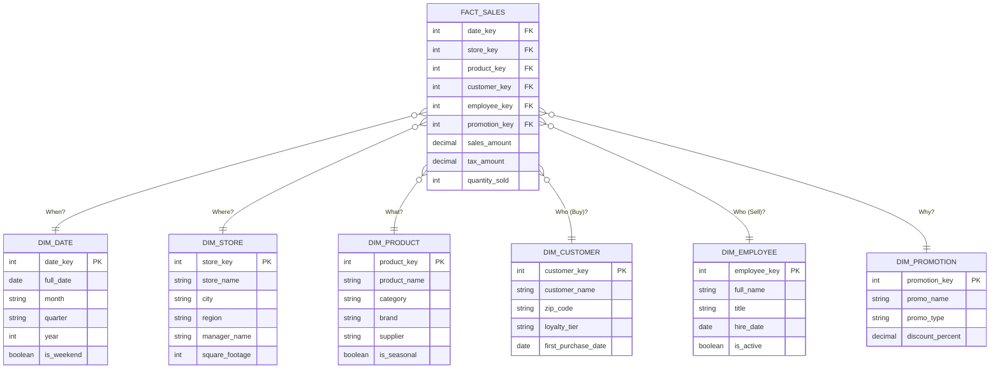

We have spent the last few modules making bricks. We have defined our dimensions and our facts. We have rigorously checked them for grain and cardinality.

Now, we stop manufacturing bricks and start laying them. We are going to build the most enduring, popular, and effective structure in the history of data analytics.

## 7.1 The Center of the Universe
If you walk into the office of a software engineer building the **Omni-Coffee** mobile app, and you look at their database diagram (the OLTP schema), it will look like a spiderweb. Tables are linked to tables, which are linked to other tables, which loop back to the first table. It is a complex mesh designed to keep data consistent.

But if you show the spiderweb to a business analyst and say, "Go ahead, find the sales trends," they will cry.

Data engineering is about **simplification**. We take the spiderweb and untangle it into a specific shape. A shape so simple that even a tired CEO can understand it on a Friday afternoon.

We call it **The Star Schema**.

### Gravity and Mass
In our new universe, not all tables are created equal.

Recall in module 4 that the fact table is "deep." It has millions or billions of rows. It is heavy. Recall in module 3 that the dimension table is "shallow." It has hundreds or thousands of rows. It is light.

Because the fact table has the most "mass" (the most data), we place it in the **center** of our diagram. It exerts the gravitational pull on everything else.

The **dimension tables** are the satellites. They orbit the fact table.

### The "Sun and Planets" Model
Let's apply this to **The Omni-Coffee Company**.

In the center, we place our massive ledger: `Fact_Sales`. This is our Sun. It burns with the heat of 500 million transaction rows. It contains the numbers we care about: `Quantity`, `Sales_Amount`, and `Tax_Amount`.

Orbiting the Sun are our planets (dimensions). They provide the context for the heat.

1. `Dim_Date`: (North) "When did it happen?"
2. `Dim_Store`: (East) "Where did it happen?"
3. `Dim_Product`: (West) "What did we sell?"
4. `Dim_Customer`: (South) "Who bought it?"

This arrangement is not accidental. It is designed to answer the only sentence structure business users ever user:

- "I want to see **[Fact]** grouped by **[Dimension]**."
- "I want to see **[Sales Amount]** grouped by **[Store]**."
- "I want to see **[Quantity Sold]** grouped by **[Product]**."

### The Death of the "Chain"
The most important rule of the Star Schema is: **dimensions do not talk to dimensions**.

In a messy "Snowflake" or normalized system (which we will critique later), you might see a chain like this: `Fact_Sales` $\to$ `Dim_Store` $\to$ `Dim_Region` $\to$ `Dim_Country`.

To get the Country, you have to hop through three tables. This is "cognitive hopscotch." It confuses users, "Wait, do I join Sales to Region? Or Sales to Store?"

In a Star Schema, we flatten that chain. We pull `Region` and `Country` directly into `Dim_Store`.

Now, the relationship is always exactly one hop:

- `Fact_Sales` $\iff$ `Dim_Store`
- `Fact_Sales` $\iff$ `Dim_Product`

The fact table is the hub. Everything else is a spoke.

### Visualizing the Omni-Star
Here is what the schema for our coffee shop actually looks like. Notice how clean the lines are. There are no "loops." There are no tangled webs. Every line radiates from the center.

*(We should note that there is an issue with how Mermaid JS shows these graphs. It won't show them as the true star shape. Instead, picture the top `fact_Sales` table, directly in the middle with the dimensions tables shooting out from different angles).*

### Why This Wins
1. **Predictability**: The database engine (the query optimizer) loves this shape. It knows exactly what to do: "Start in the middle, grab the rows, join to the small tables on the outside." It is the most efficient join path known to computer science.
2. **Usability**: A business user dragging and dropping columns in a BI tool (like Tableau or PowerBI) doesn't need to know SQL. They just see "Sales" and "Stores." The tool automatically knows how to join them because the path is obvious.

We have established our center. But how exactly do we connect the center to the edge? How do we build the "spokes"? That is the job of the **join**.

## 7.2 One Join Away
In the world of databases, distance is measured in "joins." Every time you have to connect Table A to Table B, you pay a tax. You pay in **compute** (CPU cycles) and **latency** (time).

The genius of the Star Schema is that it guarantees the lowest possible tax rate for any question. No matter what context you need—whether it's the flavor of the bagel or the zip code of the store—you are always exactly **one join away**.

### The Bundle of Keys
Let's look inside a single row of our `Fact_Sales` table.

If you strip away the numbers (the metrics like `$5.00`), what is left? It is just a collection of foreign keys (FK).

| Date_Key | Store_Key | Product_Key | Customer_Key | Sales_Amount |
|:---|:---|:---|:---|:---|
| 20240116 | 101 | 55 | 9988 | 5.00 |

This row is cryptic. It tells us that "Product 55" was sold at "store 101." This is optimized for the machine, not the human. The machine loves integers. They are tiny.

To make this readable for a human, we have to "look up" those IDs.

### The Lookup Mechanism (The Hash Join)
This is where the "architecture" part of your job shines. Because we designed our dimensions to be small ("shallow"), the database engine performs a magic trick called a **hash join**.

Here is what happens physically inside the server when you run a query:

1. **The RAM Load**: The database looks at the small table `Dim_Product` . It reads the whole thing into the server's fast memory (RAM). It creates a "Hash Map" (a lightning-fast dictionary).
    - *Key 55 $\to$ "Latte"*
    - *Key 56 $\to$ "Cappuccino"*
2. **The Stream**: Then, it opens the massive firehose of the `Fact_Sales` table. It streams those millions of rows past the RAM.
3. **The Tag**: As the fact row flies by, the database spots `Product_Key: 55`. It instantly glances at its cheat-sheet in RAM, sees "Latte," and virtually tags the row.

Because the dimensions were essentially "cached" in memory, this join is nearly instantaneous.

### The Alternative: The Scavenger Hunt
To appreciate the "One Join" rule, you have to see the alternative.

In a **Normalized (3NF)** database—the kind used for transaction processing—attributes are scattered to avoid duplication.

- The fact table links to `Store`.
- `Store` links to `City.`.
- `City` links to `Region`.

If the regional manager asks, "Show me sales for the East Coast," the database has to play a game of telephone:

> **Fact Table**: "I have a sale at Store 101. Hey `Store` table, where is 101?"
> **Store Table**: "101 is City_ID 5. Hey `City` table, where is 5?"
> **City_Table**: "5 is in the State_ID 9. Hey `State` table… "

This is a **snowflake** chain (we will dive into it in module 7). It forces the database to juggle multiple tables, keeping them all open and coordinated. It breaks the "Hash Join" efficiency because the database can't easily cache a chain of dependencies. 

### The "Star" Promise
In our Star Schema, we ruthlessly denormalize these chains.

- We take `Region`, `State`, and `City`.
- We squash them **all** into `Dim_Store`.

Now, the conversation is simple:

> **Fact Table**: "I have a sale at STore 101. Hey `Dim_Store`, tell me everything about 101."
> **Dim_Store**: "Store 101 is in Brooklyn, New York. East Coast, USA. The manager is Bob. The square footage is 2000."

Boom. One question. One answer. All the context.

!!! tip "The Architect's Motto"

    **"Trade Space for Time."**

    We repeat "New York" and "East Coast" thousands of times inside `Dim_Store`. We are wasting disk space (Space).

    Why? So that when the query runs, we don't have to join three extra tables (Time). Storage is cheap; patience is expensive. We always buy time.

## 7.3 Visualizing the Star
We have discussed gravity, orbits, and join efficiency. But the ultimate test of a data model isn't how fast it runs; it's how easily it can be understood by someone who has had only one cup of coffee.

The Star Schema is named "Star" for a reason. When you draw it on a whiteboard, it creates a distinct, radial shape. This shape is the "User Interface" for your data warehouse.

### The Blueprint of Omni-Coffee
Let's zoom out and look at the full architectural diagram for our sales module. This is the map you would print out and tape to the wall next to the CEO's desk.

### How to "Read" the Star
This visual structure tells the user exactly how to construct a query mentally. You start from the outside and work you way in.

**The User's Question**:

> "How many seasonal items did the Brooklyn store sell in 2024?"

**The Visual Path**:

1. **Filter (the rim)**: Go to `DIM_STORE` and pick "Brooklyn."
2. **Filter (the rim)**: Go to `DIM_PRODUCT` and pick "Seasonal = True."
3. **Filter (the rim)**: Go to `DIM_DATE` and pick "Year = 2024."
4. **Convert (the spoke)**: Follow the lines from those three dimensions into the center `FACT_SALES` table.
5. **Aggregate (the hub)**: Sum the `quantity_sold` column for the rows where those lines meet.

## Quiz

<quiz>
In a Star Schema visualization, which type of table is placed at the "Center of the Universe"?
- [x] The fact table.
- [ ] The lookup table.
- [ ] The bridge table.
- [ ] The dimension table.

</quiz>

<quiz>
What is the primary rule regarding relationships between dimension tables in a pure Star Schema?
- [ ] Dimensions should be joined via a bridge table.
- [ ] Dimensions should contain foreign keys to other dimensions.
- [x] Dimensions must only link to the fact table.
- [ ] Dimensions should link to other dimensions to save space.

</quiz>

<quiz>
What is the core engineering trade-off made by the Star Schema?
- [ ] Trading time for space (save disk space, pay in speed).
- [ ] Trading accuracy for speed.
- [ ] Trading simplicity for flexibility.
- [x] Trading space for time (waste disk space, gain speed).

</quiz>

<quiz>
Why is the "hash join" so efficient for Star Schemas?
- [ ] It compresses the data before joining.
- [ ] It eliminates the need for foreign keys.
- [x] It loads the small dimension table into RAM and streams the massive fact table past it.
- [ ] It indexes every column in the fact table.

</quiz>

<quiz>
Which of the following columns belongs to the `FACT_SALES` table?
- [ ] `Customer_Email`
- [ ] `Product_Category`
- [x] `Sales_Amount`
- [ ] `Store_Name`

</quiz>

<quiz>
In a Star Schema, how should hierarchical data like City $\to$ State $\to$ Country be modeled?
- [ ] Use a recursive parent-child pointer in `DIM_STORE`.
- [ ] Split into three tables: `DIM_CITY`, `DIM_STATE`, `DIM_COUNTRY`.
- [x] Flatten them all into a single `DIM_STORE` table.
- [ ] Store them in the fact table.

</quiz>

<quiz>
In the Omni-Coffee Star Schema, what connects `DIM_PRODUCT` to `DIM_STORE`?
- [ ] They are joined by the `DIM_DATE` table.
- [ ] A direct foreign key from `Product` to `Store`.
- [ ] A bridge table.
- [x] They are not connected directly; they connect only through the fact table.

</quiz>

<quiz>
If you need to calculate 'Total Sales by Region,' which tables must be joined?
- [x] `FACT_SALES` and `DIM_STORE`.
- [ ] `FACT_SALES`, `DIM_STORE`, and `DIM_REGION`
- [ ] `FACT_SALES` only.
- [ ] `DIM_STORE` and `DIM_PRODUCT`

</quiz>

<!-- mkdocs-quiz results -->