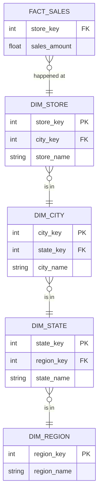
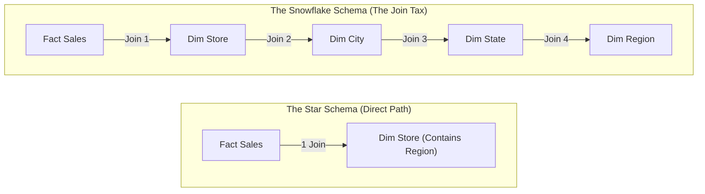
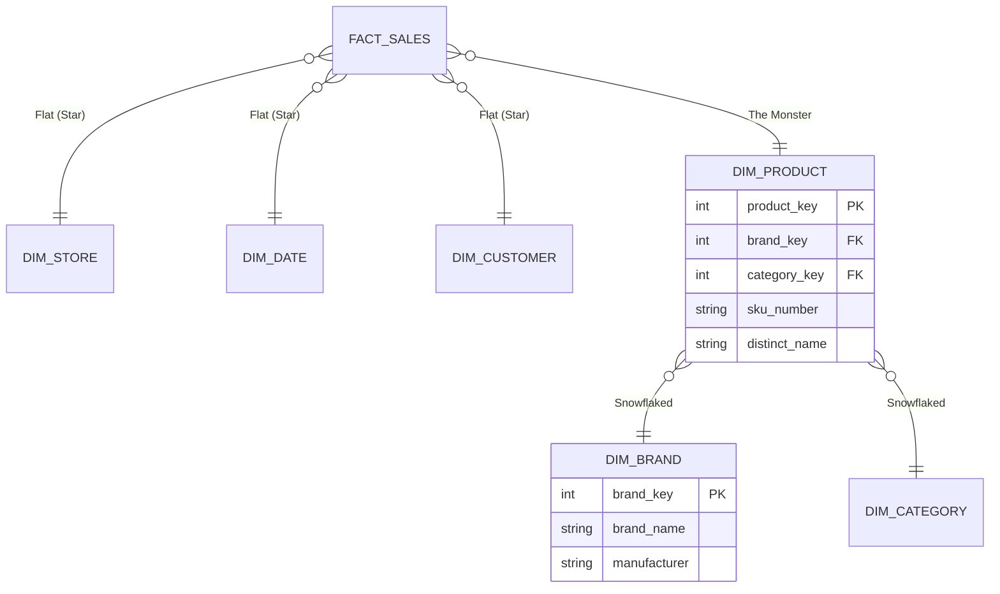

We spent the last module worshipping the **Star Schema**. We flattened our dimensions, duplicated data, and we did it all in the name of **read speed**.

But there is another school of thought. There are engineers who look at `DIM_STORE` and see something "dirty." They see **redundancy**.

When you listen to these engineers, you stop building stars and start building **Snowflakes**.

## 8.1 Normalizing Dimensions
A **Snowflake schema** is just a Star Schema where the dimensions have been **normalized**.

Instead of one big, flat table for `DIM_STORE`, you break it down into a hierarchy of smaller tables, linked together by foreign keys. The diagram stops looking like a simple starburst and starts looking like a fractured crystal (or a Snowflake).

### The Omni-Coffee Explosion
Let's look at our `DIM_STORE` again. in the Star Schema, it was self-contained:

**The Star Approach (Flat)**: One table. `DIM_STORE` contains `City`, `State`, and `Region`.

| Store_ID | Store_Name | City | State | Region |
|:---|:---|:---|:---|:---|
| 101 | Brooklyn Roasters | New York | NY | East |
| 102 | Manhattan Beans | New York | NY | East |

**The Snowflake Approach (Deep)**: We break this into three tables.

1. `DIM_STORE` links to `DIM_CITY`.
2. `DIM_CITY` links to `DIM_STATE`.
3. `DIM_STATE` links to `DIM_REGION`.

### The Motivation: "The Source of Truth"
Why would anyone do this? It makes the diagram harder to read and the queries harder to write.

The argument for Snowflaking usually comes from a desire for **data integrity**.

Imagine that the sate of "New York" changes it name to "New Amsterdam."

- **In a Star Schema**: You have to run an `UPDATE` statement on 500 rows in `DIM_STORE` where `state = 'New York'`. it's a "bulk update."
- **In a Snowflake Schema**: You update exactly one row in the `DIM_STATE` table. Every store linked to that state ID automatically reflects the new name.

This is the classic **OLTP (Online Transaction Processing)** mindset bleeding into our data warehouse. In a transactional system (like the app's backend), this normalization is mandatory. In a data warehouse, it is… optional. And often annoying.

### The "Cognitive Hopscotch" Returns
Remember the "One Join Away" rule? The Snowflake schema breaks it.

If you want to query "Sales by Region," look at the path the database must travel:

1. Start at `FACT_SALES`.
2. Join to `DIM_STORE` (to get the City ID).
3. Join to `DIM_CITY` (to get the State ID).
4. Join to `DIM_STATE` (to get the REgion ID).
5. Join to `DIM_REGION` (to finally get the name "East Coast").

You have just paid for **four joins** to answer a simple question.

!!! warning "The Usability Tax"

    The biggest cost of Snowflaking isn't CPU time (modern databases are fast enough to handle extra joins). The biggest cost is **User Confusion**.

    If you give a business analyst a list of 40 tables, they won't know which one to use. They will drag `City_Name` into their report and get incorrect numbers because they forgot to join it properly to the fact table.

    **Flat-dimensions are user-friendly. Snowflake dimensions are user-hostile.**

## 8.2 The Trade-Off
In engineering, there are no solutions, only trade-offs. When you choose between a Star Schema (flat) and a Snowflake schema (deep), you are negotiating a deal with the database gods.

You are trading storage space for complexity.

To decide if the deal is worth it, we have to look at the exchange rate. And in the past 20 years, the exchange rate has crashed.

### The "Old World" Argument (Why Snowflaking Exists)
In the 1990s, hard drives were expensive. Storing the string `'New York'` a million types was a legitimate financial problem.

If you had 1 million sales in New York:

- **Star Schema**: Stores `'New York'` 1,000,000 times $\approx$ 8 MB of disk usage.
- **Snowflake Schema**: Stores `'New York'` once in the `DIM_CITY` table. The fact table just points to ID `5`. $\approx$ Negligible disk usage.

In 1995, saving that 8 MB might have saved your job.

### The "New World" Reality (Why Snowflaking Failed)
Today, you can store 1 GB of data in the cloud for about $0.02 per month.

Let's do the math for **Omni-Coffee**. Suppose denormalize everything. We write `'New York'`, `'Cappuccino'`, and `'Bob the Barista'` onto every single relevant row in our dimensions. We waste gigabytes of space.

**The Cost of "wasted" space?** Maybe $0.50 a year.

**The cost of Complexity (The Join Tax)**: Now, look at the other side of the ledger. Because we Snowflaked, every simple query now requires a 5-table join.

1. **CPU Cost**: The database has to work 5x harder to stitch the data back together every time someone runs a report. Compute can be expensive.
2. **Human Cost**: An analyst spends 3 hours trying to figure out why the "Region" table isn't joining to the "Sales" table, only to realize they missed the intermediate "State" table.

### The Visualization of the "Tax"
Let's visualize the work required to get a single attribute.

**In a Star (flat)**: You walk into the warehouse, go to the `DIM_STORE` shelf, and pick up the "Region."
    - **Cost**: 1 step.

**In a Snowflake (deep)**: You walk into the warehouse. You find a note in `DIM_STORE` that says, "Go to `DIM_CITY`." You walk there. You find a note that says, "Go to `DIM_STATE`." You walk there. You find a note that says, "Go to `DIM_REGION`." Finally, you find the attribute.
    - **Cost**: 4 steps.

### When is the Trade-off Worth It?
If storage isn't the reason, is there *ever* a reason to Snowflake?

Yes. But it's rare.

You don't Snowflake to save space. You Snowflake to handle massive cardinality or independent management.

If `DIM_PRODUCT` has 500 rows, flatten it. If `DIM_CUSTOMERS` has 100 million rows, and you are trying to nest a hierarchy inside it, you might break your server.

This brings us to the only section of this module where I will actually encourage you to use it.

## 8.3 When to Snowflake: Justifiable Use Cases
I have spent the last two sections telling you that Snowflake is bad, old-fashioned, and annoying. You might be ready to vow never to create a normalized dimension again.

Not so fast.

There are edge cases in data engineering where a Star Schema simply collapses under it's weight. There are times when the 'flat' table becomes so massive and unwieldy that we *must* break it apart.

We don't Snowflake to save space. We Snowflake to save **The Dropdown Menu**.

### The Problem: The "Monster" Dimension
Let's imagine **Omni-Coffee** grows up. We are no longer just a coffee shop; we are a global marketplace like Amazon.

Our `DIM_PRODUCT` table doesn't have 50 rows (Latte, Muffin, etc.). It has 50 million rows. Every custom mug, every bag of beans, and every spare part for an espresso machine is a row.

Now, imagine a business analyst opens Power BI or Tableau. They want to filter the report by "Product Category." They click the dropdown menu.

**What happens in a Star Schema (flat)?**

1. The BI tool scans `DIM_PRODUCT`.
2. It reads 50 million rows.
3. It extracts the `Category` column.
4. It performs a massive `SELECT DISTINCT Category` to find the unique values.
5. **Result**: The analyst stares at a spinning "Loading… " wheel for 45 seconds. They get frustrated and close the tab.

**What happens in a Snowflake Schema (deep)?** We normalize `Category` out of the monster table. We create a tiny `DIM_CATEGORY` table (with maybe 100 rows) and link it to the massive product table.

1. The BI tool queries `DIM_CATEGORY` directly.
2. It reads 100 rows.
3. **Result**: The dropdown menu populates instantly.

### The Rule of High Cardinality
This is the primary exception to the "No Snowflake" rule.

> **If a dimension table grows to larger than 10 million rows, consider snowflaking its low-cardinality attributes.**

In this scenario, we accept the "Join Tax" (the extra complexity) because the alternative (scanning a monster table for simple attributes) is even more expensive.

### The Hybrid Architecture
The beauty of data modeling is that it doesn't have to be **all** or nothing. You don't have to choose "Team Star" or "Team Snowflake."

Most mature data warehouses are **hybrids**.

- **90% of Dimensions are Stars**: `DIM_STORE`, `DIM_DATE`, and `DIM_EMPLOYEE` are flat.
- **10% are Snowflakes**: `DIM_PRODUCT` (the monster) is normalized into `DIM_BRAND` and `DIM_CATEGORY`.

Your diagram will look like a star with one "long arm."

## Quiz

<quiz>
What is the defining structural characteristic of a Snowflake Schema?
- [ ] It eliminates the use of foreign keys.
- [ ] It uses a circular join pattern.
- [x] The dimension tables are normalized into hierarchies of related tables.
- [ ] The fact table is normalized into smaller sub-facts.

</quiz>

<quiz>
In the 'Old World' (1990s), what was the primary motivation for using a Snowflake Schema?
- [x] To save disk space.
- [ ] To improve query speed.
- [ ] To enable real-time streaming.
- [ ] To simplify the user interface for analysts

</quiz>

<quiz>
What is the 'Join Tax' mentioned in this module?
- [x] The performance and complexity cost incurred by having to link multiple tables to get a single attribute.
- [ ] The mandatory requirements to join every table in the warehouse.
- [ ] A specific type of error that occurs when joins fail.
- [ ] The monetary cost charged by cloud providers for every SQL join.

</quiz>

<quiz>
Why is the Snowflake Schema considered 'User-Hostile' for business analysts?
- [ ] It limits the number of rows they can export.
- [x] It forces them to navigate 'Cognitive Hopscotch' to find related data.
- [ ] It hides the fact table from view.
- [ ] It prevents them from using SQL.

</quiz>

<quiz>
What is the 'Monster Dimension' scenario where Snowflake is actually recommended?
- [ ] When the data is strictly numerical.
- [ ] When a dimension table has very few columns.
- [ ] When the fact table is too large.
- [x] When a dimension table has high cardinality (e.g., millions of rows) and slows down UI dropdowns.

</quiz>

<quiz>
How does the 'One Join Away' rule apply to a Snowflake Schema?
- [ ] It depends on the database vendor.
- [ ] It is improved, reducing the number of joins to zero.
- [ ] It is strictly enforced.
- [x] It is violated, as attributes may be 2, 3, or 4 joins away.

</quiz>

<quiz>
What is a 'Hybrid Architecture' in the context of this module?
- [ ] A schema that uses both CSV and JSON files.
- [x] A schema where most dimensions are flat (Star), but massive dimensions are normalized (Snowflake).
- [ ] A mix of relational and NoSQL databases.
- [ ] Combining OLTP and OLAP in a single table.

</quiz>

<quiz>
Which resource is considered 'priceless' in the Architect's verdict, justifying the use of Star Schemas over Snowflake?
- [x] Users/Time.
- [ ] Network bandwidth.
- [ ] Disk storage.
- [ ] Electricity.

</quiz>

<quiz>
If you update a state name from 'New York' to 'New Amsterdam,' which schema handles this update more efficiently (mechanically)?
- [ ] Neither can handle updates.
- [x] Snowflake Schema
- [ ] Star Schema
- [ ] Both are the same.

</quiz>

<quiz>
You should Snowflake a dimension purely to organize the diagram visually.
- [ ] True
- [x] False

</quiz>

<!-- mkdocs-quiz results -->