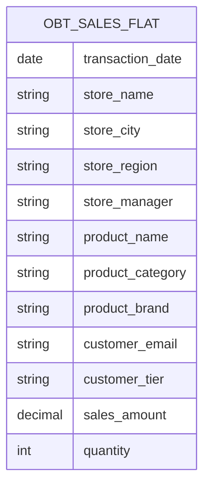
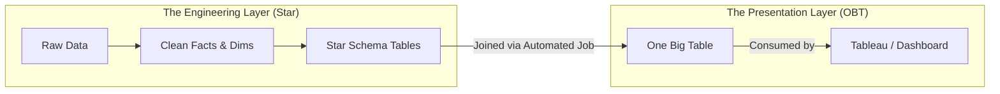

For the last several modules, I have been teaching you rules based on a specific assumption about physics.

I taught you to build Star Schemas because joining tables was expensive, but scanning massive tables was also expensive. We built a balanced solar system to keep the "width" of our tables manageable.

But in the last decade, companies like Google (BigQuery), Snowflake, and Amazon (Redshift) changed the physics of the database. They moved from **row-oriented** storage to **columnar** storage.

This shift is not just an implementation detail. It is an earthquake that shakes the very foundation of dimensional modeling.

## 9.1 Columnar Storage
Traditional databases store data the way you write it: **row by row**.

Imagine writing data on a hard drive is like writing in a notebook. When Alice buys a latte, the database writes: `[2024-01-16, Store_101, Latte, Alice, 5.00]`.

If Bob buys a muffin, it writes right next to it: `[2024-01-16, Store_102, Muffin, Bob, 3.50]`.

**The Use Case (OLTP)**: This is perfect for the App. When Alice logs in, the app says: `SELECT * FROM Sales WHERE User = 'Alice'`. The hard drive head jumps to Alice's row and grabs everything in one swoop. Fast. Efficient.

**The Problem (Analytics)**: Now, the CEO asks, "What is the average price of all items sold?" To answer this, the database has to read **every single row**. It reads the Date (useless), the Store (useless), the Product Name (useless), and finally finds the Price. It has to read 100% of the **disk** to answer a question about 10% of the data. This is why your old reports were slow.

### The New Physics: Columnar Storage
Modern data warehouses rotate the notebook 90 degrees. They don't store "Alice's transaction." They store "The List of Attributes."

On the hard drive, it looks like this: **Block 1 (Dates)**: `[2024-01-16, 2024-01-16, …]` **Block 2 (Products)**: `[Latte, Muffin, …]` **Block 3 (Prices)**: `[5.00, 3.50, …]`.

**The Use Case (OLAP)**: The CEO asks, "What is the average price?" The database engine ignores Block 1. It ignores Block 2. It goes straight to Block 3 (Prices) and reads *only* that block. It reads the prices, does the math, and finishes. It scanned 1/10th of the data. The query runs 10x faster.

### Why This Changes Everything
This architectural shift effectively kills the penalty for "wide tables."

In the old days, if you had a table with 200 columns, it was a "performance pig." Every time you touched a row, you dragged all 200 columns into memory. In the Columnar world, a table with 200 columns is just 200 separate blocks. If your query only asks for 3 columns, the database **physically ignores the other 197**.

You don't pay for the width of the table anymore. You only pay for the columns you use.

This realization led engineers to ask a heretical question:

> "If wide tables are free… why are we bothering with all these joins?"

Why are we maintaining a `Fact_Sales` and a `Dim_Store` and a `Dim_Product`? Why don't we just smash them all together into one massive, denormalized spreadsheet?

This is the birth of **OBT (One Big Table)**.

## 9.2 OBT (One BIg Table): Full Denormalizing the Star
If the Star Schema is a "Solar System," then **OBT (One Big Table)** is a "Supernova." It is what happens when you take the entire universe—the sun, the planets, the moons—and smash them together into a single, massive, flat series of data.

It is the ultimate act of denormalization.

### The Death of the Foreign Key
In a Star Schema, we maintained relationships. We said:

- `Fact_Sales` has a `store_key: 101`.
- `Dim_Store` says `101 = "Brooklyn"`.

In OBT, we delete the keys. We don't need pointers anymore because the data is right there.

**The Star Row (Slim)**: `[2024-01-16, 101, 55, 5.00]`

**The OBT Row (Fat)**: `[2024-01-16, "Brooklyn", "New York", "East", "Latte", "Beverage", "Hot", 5.00]`

We have taken every column from every dimension and pasted it directly onto the transaction row. If we have 1 billion sales, we write the word "Brooklyn" 1 billion times.

### Visualizing the Architecture
If you look at the ER Diagram (entity relationship) for an OBT architecture, it is comical. It's just one box.

### Why Would You Do This?
To a classical engineer raised on normalization, this looks like madness. It violates every rule of data integrity. But to a **data scientist** or a **business user**, this is heaven. 

1. **The "No-Code" Dream**: If you give a marketing manager access to the `OBT_SALES_FLAT` table, they cannot fail. They don't need to know SQL joins. They don't need to know if `Products` links to `Sales` or `Store`. They just select `Product_Name` and `Sales_Amount` and hit run. It is impossible to make a "Fan Trap" or a "Cartesian Explosion" error because the joins are already done.
2. **Performance (In Columnar Engines)**: Remember the Columnar physics? The database engine doesn't care that the table is 300 columns wide. If the user asks for `Region` and `Sales`, it grabs those two columns and ignores the rest. It is blindingly fast because there is **Zero Join Tax**. The join was paid for in advance when the table was built.

### The "Build" Process
You might be wondering, "Do we just type data into this OBT directly?"

No. That would be chaos. We usually **build** an OBT *from* a Star Schema (or a normalized layer).

1. **Raw Data**: Comes in from the App.
2. **Modeling Layer**: We clean it into Facts and Dimensions (Star) for our sanity and maintenance.
3. **Presentation Layer**: We write a scheduled job (using a tool like dbt) that joins everything together into `OBT_SALES_FLAT` for the end-users.

The OBT is rarely the "Source of Truth." It is the "**Product**" we ship to the customer.

### The One Big Downside
So why doesn't everyone use OBT for everything?

**Update Anomalies (The "New Amsterdam" Problem Again)**. If "New York" changes its name, and you have an OBT with 50 billion rows, you have to rewrite 50 billion strings. Even in a fast database, this is a heavy operation.

- **Star Schema**: Update 1 row in `Dim_Store`.
- **OBT**: Rebuild the entire massive table.

OBT is fantastic for **immutable history** (things that don't change). It is painful for data that shifts frequently.

## 9.3 Star vs. OBT: The Decision Framework
We have reached the end of the architectural section of this course. You now have two powerful blueprints in your hands:

1. **The Star Schema**: The disciplined, organized, "One Join Away" classic.
2. **OBT (One Big Table)**: The modern massive, "No Join Required" slab.

New engineers often ask, "Which one is better?" The senior engineer always answers, "It depends."

But "it depends" is a lazy answer. Let's build a real framework so you can make the decision based on engineering constraints, not feelings.

### The Scorecard
Let's compare the two approaches across the four dimensions that matter most to a data engineer.

| Feature | Star Schema | OBT (One Big Table) |
|:---|:---|:---|
| User Experience | **Medium**. Users must understand how to join tables (or rely on BI tool modeling). | **High**. Users just drag and drop columns. No Knowledge required. |
| Performance | **High**. Extremely fast joins, efficient memory usage. | **High**. Columnar engines scan OBTs incredibly fast (no join to calculate). |
| Maintenance | **Easy**. If a dimension changes (e.g., Product Category rename), you update 1 row. | **Hard**. If a dimension changes, you must rewrite millions of history rows. |
| Storage Cost | **Low**. Data is normalized; strings are stored once. | **Higher**. Data is repeated millions of times. (But remember, storage is cheap!). |

### The "Mullet" Architecture
In the last few years, the industry has converged on a solution that stops the fighting. We don't choose one. We use **both**.

We call this the "Mullet" architecture:

- **Business in the Front (OBT)**: For the dashboard consumers and Tableau/Power BI users, we present a clean, pre-joined OBT. They get the ease of use.
- **Party in the Back (Star)**: Behind the scenes, inside the warehouse, we maintain the data as a clean Star Schema. This keeps our code DRY (Don't Repeat Yourself) and makes updates easy.

This is the standard pattern for modern Analytics Engineering (using tools like dbt):

1. You (the engineer) manage the **Star Schema**. If "New York" changes to "New Amsterdam," you update the dimension table.
2. An automated script runs every night. It joins your Star Schema together and rebuilds the **OBT**.
3. The business user wakes up, opens their dashboard, and sees the updated data in their simple, flat table.

### When to Pick Only One
If you don't have the resources to build the full "Mullet" pipeline, here is the rule of thumb for picking a side:

**Choose Star Schema if**:

- You are building for other engineers or data scientists who know SQL.
- Your dimensions change frequently (customers change addresses, product change categories).
- You are on a tight budget for storage/compute.

**Choose OBT if**:

- You are building for marketing/sales users who *do not know SQL*.
- You are analyzing immutable history (e.g., IoT sensor logs, web clickstreams) where the past never changes.
- You need maximum read performance for a specific dashboard.

!!! success "The Architect's Final Word"

    **Don't let dogma drive your design**.

    Purists will tell you OBT is "dirty." Vendors will tell you Star Schema is "obsolete." Ignore them both.

    - Build Stars to keep your house organized.
    - Build OBTs to make your guests comfortable.
    - Use Columnar Storage to make both of them fast.

## Quiz

<quiz>
How does columnar storage differ from traditional row-oriented storage when executing an analytic query (e.g., "Average Price")?
- [ ] It reads every row sequentially but skips the indexes.
- [x] It reads only the specific file block containing the "Price" column, ignoring all other attributes.
- [ ] It compresses the data more tightly but still reads the full row.
- [ ] It loads the entire table into RAM to perform the calculation.

</quiz>

<quiz>
Why did the shift to columnar storage make 'One Big Table (OBT)' architecture viable?
- [ ] It allowed for faster row-based inserts.
- [x] It eliminated the performance penalty for querying 'wide' tables.
- [ ] It automatically enforced foreign key constraints.
- [ ] It made storage hard drives significantly cheaper.

</quiz>

<quiz>
What is the primary structural difference between a Star Schema and OBT?
- [ ] Star Schema uses integers for keys; OBT uses UUIDs.
- [x] Star Schema relies on joins; OBT has zero joins.
- [ ] Star Schema contains history; OBT only contains current data.
- [ ] OBT uses more tables than a Star Schema.

</quiz>

<quiz>
What is the massive downside of using OBT for dimensions that change frequently (e.g., renaming "New York" to "New Amsterdam")?
- [ ] The database cannot support text strings in OBT.
- [ ] It forces the user to relearn SQL.
- [ ] It breaks the columnar compression algorithm.
- [x] Update anomalies require rewriting millions or billions of rows.

</quiz>

<quiz>
Which user persona benefits the most from an OBT architecture?
- [ ] The backend engineer.
- [x] The business user / marketing manager.
- [ ] The application developer.
- [ ] The database administrator (DBA).

</quiz>

<quiz>
What is the 'Mullet' Architecture?
- [ ] Row oriented storage in the front, columnar in the back.
- [ ] Visualizing data with bar charts (front) and line charts (back).
- [x] OBT for the business users (front), Star Schema for the engineers (back).
- [ ] Real-time data int he front, batch data in the back.

</quiz>

<quiz>
In the 'Mullet' architecture, how is the OBT usually created?
- [ ] It is purchased from a third-party vendor.
- [x] It is rebuilt automatically via a scheduled job (e.g., dbt) from the Star Schema.
- [ ] It is manually typed in by data entry clerks.
- [ ] It is the raw data ingested directly from the source.

</quiz>

<quiz>
When should you strictly prefer a Star Schema over OBT?
- [ ] When you have unlimited storage.
- [ ] When you need the absolute fastest read speeds for a specific dashboard.
- [x] When dimensions change frequently (high mutability).
- [ ] When the users don't know SQL.

</quiz>

<quiz>
Which statement best describes the 'Join Tax' in an OBT architecture?
- [ ] It increases exponentially with table size.
- [ ] It is eliminated by using indexes.
- [ ] It is paid every time a user runs a query.
- [x] It is paid in advance, during the build (ETL) process.

</quiz>

<quiz>
Why is OBT considered 'Heaven' for data scientists?
- [x] It prevents 'Fan Traps' and logic errors caused by incorrect joins.
- [ ] It consumes less memory in Python/Pandas.
- [ ] It allows them to use 3NF normalization rules.
- [ ] It works better with Excel 2003.

</quiz>

<!-- mkdocs-quiz results -->