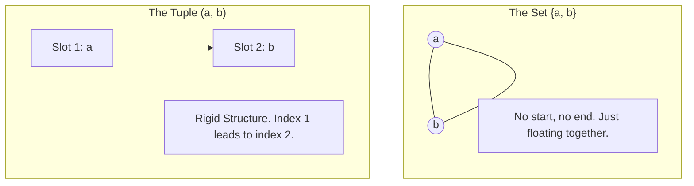
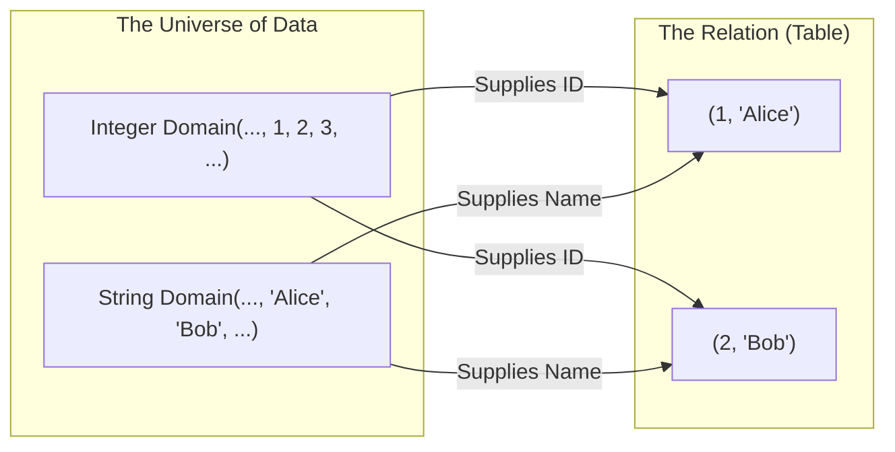

In our journey through Set Theory so far, we've treated data like a handful of loose change in your pocket. If you have a quarter and a dime, it doesn't matter which one is touching the lint or which one is on the left. The set $\{quarter, dime\}$ is identical to $\{dime, quarter\}$. The law of Extensionality told us that a set is defined by what it contains, not how those contents are arranged.

But if you look at a spreadsheet, a CSV file, or a database row, you know that structure isn't just a suggestion. It's rigid. A row isn't just a "bag of values." It has specific slots. If you have a table for users with columns `(FirstName, LastName)`, the value `("John", "Doe")` is a sensible record. The value `("Doe", "John")` is a clerical error that makes you sound like a formal bureaucrat from the 1940s.

To bridge the gap between the chaotic cloud of Sets and the structured grid of data engineering, we need a new mathematical primitive. We need to freeze things in place.

We require the **ordered tuple**.

## 10.1 The Ordered Tuple
In Set Theory, we use curly braces `{}` to denote sets. As we know, sets aren't concerned about order:

$$
\{1, 2\} = \{2, 1\}
$$

Tuples are the uptight cousins of sets. We typically write them using parentheses `()`. Unlike sets, tuples care deeply, passionately, and unyieldingly about the order of their elements.

$$
(1, 2) \ne (2, 1)
$$

This seems obvious, but it represents a massive shift in how we model the world. In a set, membership is binary: are you in, or are you out? In a tuple, membership is positional: *where* are you?

The formal definition of equality for ordered pairs makes this explicit. Two tuples are equal if and only if their first elements are equal and their second elements are equal.

$$
(a, b) = (c, d) \iff a = c \land b = d
$$

If you swap the socks and the shoes, you get a very different result than if you put on the socks, *then* the shoes.

!!! tip "The Arity Party"

    You will often hear the term **arity** (pronounced air-it-tee) thrown around in database literature. It just refers to the size of the tuple—the number of "slots" it has.

    - **2-tuple**: An "ordered pair." $(x, y)$.
    - **3-tuple**: A "triple." $(x, y, z)$.
    - **n-tuple**: A generic term for a tuple with $n$ elements. $(x_1, x_2, \cdots, x_n)$.

    If you have a table with 5 columns, every row in that table is a **5-tuple**.

### Why We Need This for Data
Imagine we are building a simple system to track GPS coordinates for a logistics company. We have two data points: Latitude and Longitude.

If we stored a location as a set $\{41.0, -74.0\}$, we have a problem. Since sets are unordered, we don't strictly know which number is the latitude and which is the longitude. We just know that the location involves those two numbers. If we hand that set to a drone, it might fly to New York, or it might fly to a random spot in Antarctica, depending on how it decides to interpret the values.

To fix this, we agree on a contract: **The first slot is latitude. The second is longitude**.

By imposing order, we encode meaning. The tuple $(41.0, -74.0)$ is distinct from $(-74.0, 41.0)$.

This is precisely what a **row** is in a database.

When you define a schema in SQL:

```sql
CREATE TABLE Locations (
    Lat DECIMAL,
    Lon DECIMAL
);
```

You are essentially defining the structure of the tuple. You are telling the database, "Every item in this container will be a 2-tuple, and the first element must be a decimal, and the second element must be a decimal."

### Column Order vs. Logic
Here is where things get a little spicy and where the "engineering" part of data engineering starts to drift away from the pure "math" part.

In strict Set Theory, a tuple is defined *only* by position. Element 1 is $x$, and Element 2 is $y$. There are no labels. There is no "Lat" or "Lon" written on the tuple itself. It's just a sequence of values.

$$
t = (41.0, -74.0)
$$

To retrieve the latitude, you would mathematically ask for $t_1$ (or `t[1]` if you're a *programmer*).

However, in SQL and the Relational Model, we add a layer of sugar on top of this: **Attributes** (Column Names). We prefer to say `t.Lat` rather than `t[1]`.

This leads to a confusing duality that often trips up beginners.

**1. The Physical/Strict View (Tuple)**: Under the hood, or when exporting to CSV, the data is just an ordered list of values. `41.0, -74.0` If you load this CSV into a table but map the columns in the wrong order, you corrupt your data. The tuple relies entirely on the order of values to maintain its integrity.

**2. The Logical View (Named Attributes)**: In your SQL query, you can swap columns around freely: `SELECT Lon, Lat FROM Locations`. The database engine grabs the underlying tuple, looks up the name mapping, and hands you a *new tuple* where the order is swapped to match your request.

!!! warning "The `SELECT *` Trap"

    This difference between physical order (tuples) and logical names is why using `SELECT *` in production code is dangerous.

    If you write code that expects the tuple to always be `(Name, Age)`, and someone adds a `MiddleName` column in between them in the database schema, the tuple structure changes to `(Name, MiddleName, Age)`.

    If your code blindly reads index 1 and index 2, your user's age is now "Stuart".

### Visualizing the Tuple
Let's visualize the difference between a Set and a Tuple.



In the Set (left), the elements are just hanging out in the same vicinity. In the tuple (right), there is a directed, rigid link. You cannot have Slot 2 without passing Slot 1.

### From Tuples to Tables
We have established two major concepts so far:

1. **Sets**: Unordered collections of distinct things.
2. **Tuples**: Ordered sequences of values.

So, what happens if we create a **Set of Tuples**?

Imagine a set where every element is a tuple, and every tuple has the same structure (arity).

$$
\{(1, "Alice"), (2, "Bob"), (3, "Charlie")\}
$$

Congratulate yourself. You just invented the database table.

## 10.2 Relations
If you walk into a job interview for a data engineering role and they ask, "Why is it called a Relational Database?", what do you say?

Most people guess, "Because the tables relate to each other? Like, using Foreign Keys?"

And most people are wrong.

I mean, yes, tables *do* relate to each other, but that is a side effect, not the definition. The "Relation" in Relational Database Management System (RDBMS) doesn't refer to the links *between* tables. It refers to the table itself.

**The Table is the Relation**.

Now that we have the **Set** and the **Tuple**, we can finally combine them to define the Holy Grail of data structures.

### The Math Behind the Table
Let's go back to first principles.

1. $I$: The set of **all** possible integers.
2. $S$: The set of **all** possible strings.

If we took the Cartesian Product we would get every possible combination of an integer and a string. It would contain `(1, 'a')`, `(1, 'b')`, `(100, 'hello')`, and `(-5, 'tacos')`. It would be infinite, massive, and mostly useless.

But what if we carved out a small, specific **subset** of that massive product? What if we only kept the pairs that actually meant something?

$$
R = \{(1, "Alice"), (2, "Bob"), (3, "Charlier")\}
$$

This subset $R$ is a **relation**.

Mathematically, a relation is defined as a subset of a Cartesian Product. It is a relationship between a value from one domain (the ID) and a value from another domain (the Name).

When you draw a box around the subset and give it a name (like `Users`), you have created a database table.

### The Rosetta Stone: Math To SQL
Data engineers often use different words than mathematicians to describe the same things. It's like how a chef says, "Sodium Chloride" and a line cook says, "Salt". Both are correct, but one sounds much more expensive.

Here is your translation guide:

| The Math Term (Set Theory) | The SQL Term (Database) | The Excel Term (Layman) |
|:---|:---|:---|
| Relation | Table | Sheet / Tab |
| Tuple | Row | Record |
| Attribute | Column | Header |
| Domain | Data Type | Format (e.g., Number/text) |
| Cardinality | COUNT(*) | Number of Rows |
| Degree/Arity | Column Count | Number of Columns |

### Schema vs. Instance
When we talk about a relation, we have to distinguish between the "rules" and the "data."

**1. The Schema (Intension)**: This is the header of the table. It defines the name of the relation and the name/type of each attribute. It's the blueprint.

- *Math: Users(ID: Integer, Name: String)*
- *SQL: `CREATE TABLE Users ... `

**2. The Instance (Extension)**: This is the actual data sitting in the table at a specific moment. It is the **Set of Tuples**.

- *Math: {(1, "Alice"), (2, "Bob")}*
- *SQL: The result of `SELECT * FROM Users`*

The distinction matters because the Schema is rigid (changing it requires a migration), while the instance is fluid (rows are inserted and deleted every millisecond).

### The "No Duplicates" Rule (Reprise)
This brings us back to the concept we touched on in module 3, but now we have the formal vocabulary to nail it down.

**A relation is a set of Tuples**.

Because it is a **Set**, by definition, it **cannot contain duplicate elements**. And because the elements are **Tuples** (rows), this means a **Relation cannot contain duplicate rows**.

If you have a table `Users`:

| ID | Name |
|:---|:---|
| 1 | Alice |
| 1 | Alice |

In strict Set Theory, this is impossible. It is not a Relation. It is a "Bag" of tuples.

This is why Primary Keys are so vital in data engineering. A primary key is our way of enforcing the "Set-ness" of the table. By ensuring that at least one part of the tuple (the ID) is unique, we guarantee that the whole tuple is unique, keeping our database mathematically pure.

### Visualizing the Relation
Let's look at how the domains flow into the relation.



The relation sits in the middle, picking and choosing specific combinations from the infinite domains to store as records.

### Why This Matters for Engineering
You might be thinking, "Okay, this is great trivia, but I just want to write SQL."

Understanding that a table is a **Relation** unlocks the logic behind operations you will do every day:

1. **Projections (SELECT columns)**: When you select columns, you are creating a *new* relation with a smaller Arity (fewer slots in the tuple).
2. **Selects (WHERE clause)**: WHen you filter rows, you are creating a *new* relation that is a subset of the original instance.
3. **Joins**: When you join two tables, you are taking the Cartesian Product of two relations and filtering it down to a new, combined relation.

SQL is just a language for transforming one Relation into another Relation.

## Quiz

<quiz>
In Set Theory, how does the tuple (1, 2) *differ* from the set {1, 2}?
- [ ] The tuple is infinite, while the set is finite.
- [ ] The set {1, 2} allows duplicates, while the tuple (1, 2) does not.
- [ ] There is no difference; they represent the same collection of numbers.
- [x] Order matters in the tuple, so (1, 2) $\ne$ (2, 1), whereas {1, 2} = {2, 1}.

</quiz>

<quiz>
What is the arity of the tuple ("Alice, 25, "Engineer", "Active")?
- [ ] 2
- [ ] Unlimited
- [x] 4
- [ ] 1

</quiz>

<quiz>
Mathematically, under what condition is the tuple (x, y) equal to the tuple (y, x)?
- [ ] They are never equal.
- [ ] They are always equal.
- [ ] Only when x and y are integers.
- [x] Only when x = y.

</quiz>

<quiz>
In the context of the Relational Model, what corresponds to a Tuple?
- [ ] A Primary Key.
- [x] A Row.
- [ ] A column. 
- [ ] A table.

</quiz>

<quiz>
Which of the following best defines a Relation in Set Theory?
- [ ] The link between two tables via a Foreign Key.
- [x] A subset of a Cartesian Product.
- [ ] Any collection of data that allows duplicates.
- [ ] An ordered list of columns.

</quiz>

<quiz>
Why is `SELECT *` considered risky when thinking about the difference between physical tuples and logical attributes?
- [ ] It automatically dedupes the data, hiding errors.
- [x] It relies on the column order remaining constant, which may change.
- [ ] It returns too much data and crashes the server.
- [ ] It converts the results into a Set instead of a Bag.

</quiz>

<quiz>
What is the Schema of a relation analogous to?
- [ ] The Cartesian Product.
- [ ] The Cardinality (the count).
- [x] The Intension (the rule or definition).
- [ ] The Extension (the data itself).

</quiz>

<quiz>
Why does a strict mathematical Relation not allow duplicate rows?
- [ ] Because the tuples are ordered.
- [ ] Because computers cannot process duplicates.
- [ ] Because of Foreign key constraints.
- [x] Because it is defined as a Set, and sets contain distinct elements.

</quiz>

<quiz>
If we have a Domain of Integers $I$ and a Domain of Strings $S$, what is the set $I \times S$?
- [ ] The intersection of integers and strings.
- [ ] A specific database table with real data.
- [x] The Cartesian Product containing all possible pairs $(i, s)$.
- [ ] THe sum of the two sets.

</quiz>

<quiz>
In the database analogy, what is the role of the Primary Key regarding the "Set-ness" of a table?
- [ ] It ensures that no null values exist in any column.
- [ ] It allows the table to link to other tables.
- [ ] It sorts the data physically on the disk.
- [x] It guarantees that every tuple is unique, maintaining the definition of a Set.

</quiz>

<!-- mkdocs-quiz results -->