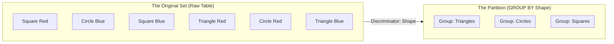
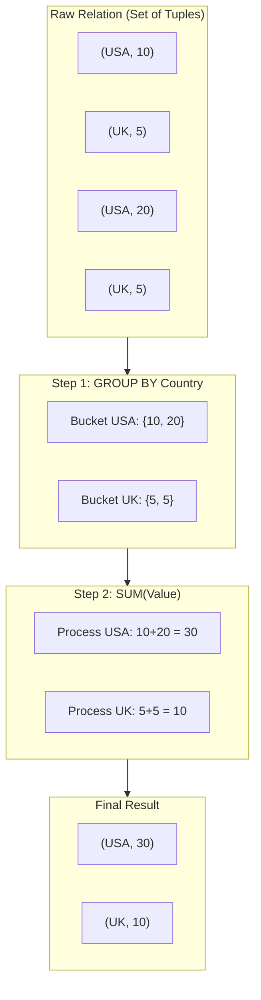

In data engineering, you rarely get paid to simply fetch the raw data. No CEO asks, "Can you give me a list of every single transaction that happened in the last 10 years?" (Well, they might, but their Excel will crash, and they will blame you).

They ask, "How much money did we make *by region*?" Or "What is the average login time *per user*?"

To answer these questions, we have to stop looking at individual rows and start looking at **clumps** of rows. We need to organize the chaos. We need to take our big Set and chop it up into smaller, manageable Sets.

We need to **partition**.

## 11.1 Partitioning A Set
Let's step away from the computer and go to the laundry room.

You have a basket of dirty clothes (The Set). To wash them effectively, you don't throw everything in at once—unless you enjoy wearing pink socks that used to be white. You separate them.

1. Whites.
2. Colors.
3. Delicates.

This process of sorting is intuitive, but mathematically, it follows three strict rules. If you violate them, you haven't actually sorted your laundry; you've just made a mess.

### The Three Rules of Partitioning
Mathematically, a **Partition** of a set $S$ is a collection of non-empty subsets $\{P_1, P_2, \cdots, P_k\}$ that satisfies these requirements:

**1. The Union is the Whole (Covering)**: Every single element in the original set must end up in a bucket. You can't leave a sock on the floor.

$$
P_1 \cup P_2 \cup \cdots \cup P_k = S
$$

**2. The Intersection is Empty (Disjoint)**: No element can be in two buckets at the same time. A shirt cannot be both "white" and "dark" simultaneously. It has to pick a side.

$$
P_i \cap P_j = \emptyset \space (\text{for all } i \ne j)
$$

**3. No Empty Buckets**: We don't create a "Space Suits" pile if we don't own any space suits. Every subset in our partition must contain at least one item.

$$
P_i \ne \emptyset
$$

In SQL, we call this operation `GROUP BY`.

### The Discriminator Function
How do we decide which bucket a row falls into?

In the laundry example, we looked at the color or *fabric* of the item. In Set Theory, we say we are defining an **Equivalence Relation**, but that sounds stuffy. Let's call it a **Discriminator Function** or a **Grouping Key**.

We choose a specific attribute of the tuple (say, the `Country` column). We look at two rows. If they have the *same value* for that attribute, we glue them together.

Let's visualize this. Imagine a set of Shapes. We decide to **Partition by Shape**.

Notice what happened here. We transformed a **Set of Tuples** (the raw table) into a **Set of Sets**.

- **Before**: We had 6 items.
- **After**: We have 3 groups.

### The Dimensionality Collapse
This is the moment where most junior data engineers get a syntax error.

When you partition a set (using `GROUP BY`), you have fundamentally changed the "grain" of your data. You are no longer operating at the "row level"; you are operating at the "group level."

Suppose we have a table of users:

| ID | Name | Country |
|:---|:---|:---|
| 1 | Alice | USA |
| 2 | Bob | USA |
| 3 | Charlie | UK |

If we query: `SELECT Country FROM Users GROUP BY Country`

The database engine performs the partition. It creates two buckets:

1. **USA Bucket**: `{(1, Alice, USA), (2, Bob, USA)}`
2. **UK Bucket**: `{(3, Charlie, UK)}`

Because we grouped by `Country`, the database knows that "USA" is the label for Bucket 1, and "UK" is the label for Bucket 2. It can safely return those labels.

**The Classic Error**: But what if you try this? `SELECT Name FROM Users GROUP BY Country`

Think about the set theory. The database looks at the **USA Bucket**. It asks, "Okay, I need to return the name for this bucket." It looks inside and sees… "Alice" and "Bob."

Which one should it pick? The database is a deterministic machine. It hates guessing. It cannot represent the set `{"Alice", "Bob"}` as a single scalar string.

So it yells at you:

> Error: Column 'Name' must appear in the GROUP BY clause or be used in an aggregate function

This error message is just the database engine telling you, "**You asked me to describe a Set using a single value, but the Set contains many values, and I don't know which one you want.**"

### Partitions are Pre-Requisites
This section was short because the concept is deceptively simple: We split a big set into smaller, non-overlapping sets based on a shared feature.

But understanding this is the prerequisite for the real power of data engineering: **aggregation**.

Once we have our buckets (partitions), we can stop worrying about the individual rows inside them and start asking questions about the bucket itself.

## 11.2 Aggregation
In the last section, we sorted our dirty laundry. We separated the socks from the shirts. We created **partitions**.

But usually, your boss doesn't want to see the piles of laundry. They want a report. They don't want to scroll through 10,000 rows of sales data for the "Northeast Region." They want one number: **the total**.

This brings us to the final, destructive, and beautiful act of data engineering: **aggregation**.

### The Squashing Function
In Set Theory terms, an aggregation is a function that takes a Set as input and returns a single **Scalar** (a single value) as output.

$$
f(\{x_1, x_2, \cdots, x_n\}) = y
$$

I call this "destructive" because it is a one-way street. Once you aggregate, you lose the individual identities of the elements. You are putting your data into a hydraulic press.

If I tell you, "The sum of the set is 10," you have no idea if the original set was $\{5, 5\}$ or $\{1, 9\}$. The history is gone. The detail is lost. Only the summary remains.

### The Standard Toolset
While you can technically invent any aggregate function you want (and in advanced data engineering, you will write "User defined aggregates"), 99% of your work relies on the big five.

Let's look at them through the lens of Set Theory.

#### 1. Cardinality (`COUNT`)
This is the most fundamental property of a set. It asks, "How many elements are in here?"

$$
COUNT(S) = \lvert S \rvert
$$

- **The Nuance**: In SQL, `COUNT(*)` measures the cardinality of the **Rows** (the tuples). `COUNT(column)` measure the cardinality of the **Values** in that column, excluding NULLs (more on that in a second).

#### 2. Summation (`SUM`)
This requires the elements of the set be numbers. You cannot `SUM` a set of names (unless you are a chaotic numerologist).

$$
SUM(S) = \sum_{x \in S} x
$$

(The symbol $\sum$ stands for "sum" or "summation").

#### 3. Extremes (`MIN`/`MAX`)
These require the set to be **Ordered** (Ordinality). You can find the `MIN` of numbers, dates, or even strings (alphabetical order), but you can't find the `MIN` of a set of colors unless you arbitrarily decide that Blue < Red.

#### 4. The Average (`AVG`)
This is a composite function. It is simply the Sum divided by the Cardinality.

$$
AVG(S) = \frac{SUM(S)}{COUNT(S)}
$$

### The Null Trap (One Last Time)
We have discussed Nulls throughout this course, but they come back to haunt us here. How aggregates handle Nulls is the source of millions of dollars in accounting errors.

**Rule: Aggregates (mostly) ignore NULLs**.

Imagine a set of salaries: $S = \{100, NULL, 200\}$.

1. **SUM(S)**: You might expect this to be `NULL` (because 100 + Unknown = Unknown). But SQL decides to be helpful. It treats the NULL as if it doesn't exist.

$$
SUM = 100 + 200 = 300
$$

2. **AVG(S)**: This is the dangerous one.

- The sum is 300.
- The count of values is 2 (the null is ignored).
- **Average = 300 / 2 = 150**

If you treated null as 0, the count would be 3, and the average would be 100. **150 vs. 100**. That is a massive difference in a financial report.

!!! danger "The Count Conundrum"

    `COUNT(*)` includes rows with NULLs. `COUNT(column)` excludes NULLs.

    If you have a table with 100 rows, and 50 of them have a `NULL` email address:

    - `SELECT COUNT(*) ...` returns **100**.
    - `SELECT COUNT(email) ...` returns **50**.

    Always know what you are counting.

### Visualizing the COllapse
Let's look at the full pipeline, from the raw Relation, to the Partition, to the final Aggregated Result.

### The Final Transformation
Notice the shape of the data in the "Final Result" above.

We started with a table (Relation). We tore it apart into Buckets (Partitions). We crushed the buckets into Scalars (Aggregation). And what did we stick those scalars into?

A new Table.

The result `(USA, 30)` is a Tuple. The collection of results is a Relation.

And this is the beauty of the Relational Model (and Set Theory). **The output of a query is a Table**.

Because the output is a table, you can query it again. You can join it. You can filter it. You can group it again. It is Lego blocks all the way down.

## Quiz

<quiz>
In Set Theory, which of the following is NOT one of the three strict requirements for a valid Partition of a set?
- [ ] The union of the subsets must equal the original set.
- [ ] The subsets must be disjoint (no overlap).
- [x] Every subset must have the same number of elements.
- [ ] No subset can be empty.

</quiz>

<quiz>
When you perform a `GROUP BY` operation in SQL, what happens to the 'grain' of the data?
- [x] The grain collapses from Row Level to Group Level.
- [ ] The grain extends to the Cartesian Product.
- [ ] The grain becomes a Tuple.
- [ ] The grain remains at the Row Level.

</quiz>

<quiz>
Why does the query `SELECT Name FROM Users GROUP BY Country` result in an error?
- [ ] Because 'Country' is a reserved keyword.
- [ ] Because 'Name' is not a number.
- [x] Because the database cannot deterministically pick one Name from a bucket containing multiple people.
- [ ] Because you cannot GROUP BY a string column.

</quiz>

<quiz>
Mathematically, what are the input and output of an Aggregation Function?
- [ ] Input: Scalar; Output: Set.
- [ ] Input: Set; Output: Set.
- [ ] Input: Tuple; Output: Relation.
- [x] Input: Set; Output: Scalar.

</quiz>

<quiz>
How does `COUNT(*)` differ from `COUNT(COLUMN)`?
- [ ] `COUNT(*)` is faster but less accurate.
- [ ] `COUNT(*)` counts unique values; `COUNT(column)` counts all values.
- [ ] There is no difference; they are aliases for the same function.
- [x] `COUNT(*)` counts rows including NULLs; `COUNT(column)` counts values excluding NULLs.

</quiz>

<quiz>
Given the set $S = \{100, NULL, 200\}$, what is the result of `AVG(S)` in standard SQL?
- [x] 150
- [ ] NULL
- [ ] Error
- [ ] 100

</quiz>

<quiz>
What property must a set possess to allow the use of `MIN` or `MAX` functions?
- [ ] It must contain only integers.
- [ ] It must be empty.
- [x] It must be Ordered (Ordinality).
- [ ] It must be finite.

</quiz>

<quiz>
Why is aggregation described as a 'destructive' operation?
- [ ] It crashes the database often.
- [x] You lose the identity and detail of the individual elements.
- [ ] It deletes the data from the hard drive.
- [ ] It violates the rules of Set Theory.

</quiz>

<quiz>
In the laundry analogy, what role does the 'color' or 'fabric' type play?
- [ ] The NULL value.
- [ ] The Primary Key.
- [ ] The Aggregate Function.
- [x] The Discriminator (Grouping Key).

</quiz>

<quiz>
What is the final structured output of a SQL query that includes Grouping and Aggregation?
- [ ] A single scalar.
- [x] A relation (table).
- [ ] A Cartesian Product.
- [ ] An unordered bag of scalars.

</quiz>

<!-- mkdocs-quiz results -->