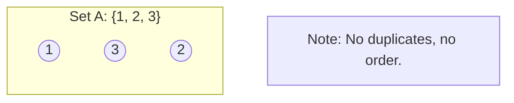
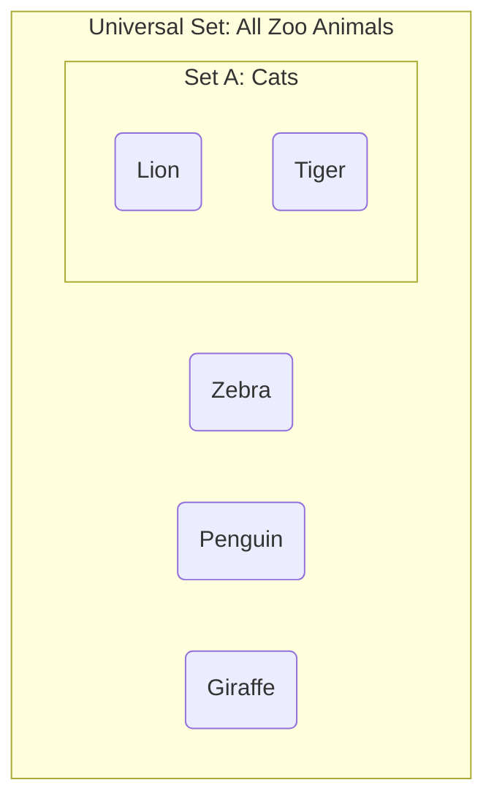

Welcome to the first step of the journey.

I know what you're thinking. You've got a terminal window open, `postgres` or `duckdb` is running, and your fingers are twitching to type `SELECT * FROM users`. You want to see data fly across the screen. You would like to build pipelines. You would like to engineer.

I'm going to ask you to do something difficult: **close the terminal**.

Just for a bit. Trust me. Jumping into SQL without understanding Set Theory is like trying to build a bridge without understanding physics. You might get something standing, but the moment a heavy load (or a complex `JOIN`) drives over it, the whole thing is going to collapse into the river.

We will start with the absolute bedrock of data engineering. Before we have tables, before we have rows, before we have `NULL` pointers ruining our Tuesday nights, we have **the set**.

## 1.1 What is a Set?
If you ask a mathematician, they'll give you a definition that sounds deceptively simple. Georg Cantor, the grandfather of this whole branch of math, put it roughly like this:

!!! quote

    A set is a gathering together into a whole of definite, distinct objects of our perception or of our thought—which are called elements of the set.

That's a bit dry, isn't it? Let's put on our engineer hats.

Imagine a plastic storage bin. You know, the clear ones you buy when you swear you're finally going to organize your garage. That bin is our **set**. The stuff you throw inside it? Those are the **elements**.

It seems trivial, but the plastic bin has three magical rules that distinguish it from just "a pile of stuff." These rules are the laws of physics for data.

### 1. The Rule of the Bouncer (Well-Defined)
A set must be **well-defined**. This means there is absolutely no ambiguity about whether an object belongs in the bin or not.

Imagine our bin is labeled "User IDs." If I hold up the number `402`, we know it goes in the bin. If I hold up a ham sandwich, we know it stays out. There is no "maybe." There is no "kinda."

In logic, we call this **binary predicate**. For any object $x$ in the universe, the statement "$x$ is in Set $A$" must be strictly **true** or **false**.

!!! warning "The SQL Trap"

    You might think, "Well, obviously a sandwich isn't a User ID." But in the messy world of data engineering, this gets tricky.

If your definition of a set is "Active Users," is a user who hasn't logged in for 364 days "Active"? If you haven't strictly defined the rules of the set, you don't have a set—you have a vague idea. And vague ideas cause bugs.

### 2. The Rule of the Blender (Unordered)
Let's go back to our plastic bin. Suppose we throw three items in there: a wrench, a hammer, and a screwdriver.

Now, put the lid on and shake the bin violently. Shake it until you're tired. Open the lid.

Has the collection changed?

To a normal person, the mess looks different. To a logician (and a database engineer), it is **the same set**.

Sets have **no intrinsic order**. The set $\{1, 2, 3\}$ is mathematically identical to the set $\{3, 1, 2\}$.

This is the hardest pill for new engineers to swallow. We humans love order. We love lists. We love spreadsheets where Row 1 is definitely before Row 2. But a Set—and by extension, an SQL table—does not care about your desire for order. Unless you explicitly force an order (which we'll get to much later), the database is free to hand you the rows in whatever order it finds most convenient.

### 3. The Rule of the Echo (Distinctness)
Here is where reality and math diverge.

In the physical world, if I have two identical red marbles and I put them both in the bin, I have two marbles. I can count them: one, two.

In Set Theory, if I try to put the number `5` into a set that already contains a `5`, nothing happens. The set absorbs it. The set says, "I already know about `5`. I don't need another one."

A Set contains only **distinct** elements.

$$
S = \{\text{Apple, Banana, Apple}\}
$$

If you write the above on a math test, the professor will correct it to:

$$
S = \{\text{Apple, Banana}\}
$$

!!! failure "Wait, doesn't SQL allow duplicates?"

    Yes, standard SQL tables *do* allow duplicates. Technically, SQL tables are **multisets** (also called **bags**), not true Sets. We will spend all of module 3 crying about this distinction.

    But to understand *why* `DISTINCT` exists and why duplicates wreck your aggregations, you must first understand the perfect, distinct world of the Set.

### Notation and The Roster Method
When we want to discuss sets on paper (or in documentation), we use curly braces. This is the **Roster Method**--literally listing out everyone on the team.

If we have a set $D$ of digits, we write 

$$
D = \{0, 1, 2, 3, 4, 5, 6, 7, 8, 9\}
$$

We use the symbol $\in$ to denote "is an element of."

$$
7 \in D
$$

$$
\text{Ham Sandwich } \notin D
$$

In the diagram below, notice how the order is irrelevant and there are no duplicates inside the boundary.

### Why This Matters
You might be thinking, "This is just semantics. Who cares if the math doesn't like duplicates?"

You will care. You will care deeply at 3:00 AM when your sales report shows revenue double what it should be because a `JOIN` accidentally created duplicate rows, turning your Set into a Bag. You will care when your pagination breaks because you assumed the database would return rows in the same order every time, but you violated the **unordered** rule.

## 1.2 Intension vs. Extension

If I asked you to define the set of "My Favorite Fruits," you could easily just list them: 

$$
F = \{\text{Apple, Mango, Durian}\}
$$

Simple right? This is called defining a set by **extension**. You are extending the set by explicitly enumerating every single member. It's the "Roster Method" we talked about in the last section. It's checking names off a clipboard.

But now, I have a harder task for you. I want you to define the set of **all even integers**.

Go ahead. I'll wait. 

$$
E = \{2, 4, 6, 8, 10, \cdots\}
$$

You can keep writing until the heat death of the universe, but you will never finish defining that set by extension. You literally run out of time and space.

This highlights a fundamental tension in data engineering: **The Finite vs. The Infinite**.

### The Problem with Lists
Defining sets by extension is great for small, static things.

- The days of the week.
- The items currently in your shopping cart.
- The rows in your `users` table right this second.

But extension fails when the set is massive, infinite, or—and this is the kicker—unknown at the time of definition.

If you are building a system to flag "High Value Customers," you can't just list them by name. You don't know who they are yet. You can't say, "Well, Bob is high value, and Alice is high value…" because tomorrow, Charlie might sign up and spend a million dollars.

We need a way to define a set not by *who is in it*, but by the *rules required to get in*.

### The Rule (Intension)
This brings us to **intension**.

An intensional definition describes the **properties** that an object must satisfy to belong to the set. It is a filter. It is a club with a dress code, not a guest list.

In mathematics, we use **Set-Builder Notation** for this. It looks scary, but it's actually just a sentence written in shorthand.

$$
B = \{x \mid x \text{ is an integer and } x \text{ is divisible by } 2\}
$$

Let's dissect this syntax. It is the great-grandfather of the SQL `WHERE` clause.

- **The Braces {}**: "The set of… "
- **The Variable $x$**: ""all things (let's call them $x$)… "
- **The Pipe |**: "such that… " (sometimes you see a colon here instead).
- **The Predicate**: "… $x$ meets this specific condition."

So, reading it aloud, "The set of all things $x$, such that $x$ is an integer divisible by 2."

### The Engineer's Perspective: Storage vs. Compute
Here is a mental leap that will make you a better engineer than 90% of the people writing SQL today.

**1. The Database Table is Extension**. When you look at a table on a hard drive, it is a finite list of rows. It is a set defined by **extension**. It is static. It is just a bucket of bytes.

**2. The Query is Intension**: When you write a query, you are writing an **intensional** definition. You are writing a rule. "Give me **all** users who signed up after 2023."

You aren't listing names. You are defining a logic boundary.

**3. The Execution is the Conversion**: When you hit "Run," the database engine's job is to apply your **intension** (the rule) against the stored **extension** (the table) to generate a new, temporary **extension** (the result set).

### Why Logic Breaks
This distinction explains why data pipelines break.

Often, business stakeholders think in **extension**, *"I want a list of these five specific customers."* Engineers must think in **intension**, *"What property do these five people share so I can write a rule that catches them (and anyone else like them in the future)?"*

If you try to solve an intensional problem ("Find high-risk transactions") with an extensional solution ("Here is a hard-coded list of bad transaction IDs"), you will fail the moment a new bad transaction appears.

## 1.3 The Universal Set
If you were to ask me, "List everything that is *not* a cat," I would have a nervous breakdown.

Why? Well, my coffee mug is not a cat. The number 42 is not a cat. The concept of ennui is not a cat. The Andromeda galaxy is not a cat. I could spend the rest of my life listing things that are not cats, and I wouldn't even make a dent in the list.

This is a problem. In the previous sections, we talked about defining a set by listing what *is* inside it. But logic works in two directions. Sometimes, as a data engineer, you need to define a dataset by what it *excludes*. You want the users who *didn't* churn, the orders that *weren't* refunded, or the servers that *aren't* responding.

But to talk about what isn't in a set, we first have to agree on the boundaries of reality. We have to agree on the context. In Set Theory, this context is called the **universal set**.

### The Box of Reality
Mathematically, the Universal Set (often denoted as $U$, $\Omega$, or sometimes $\xi$) is the set that contains all objects under consideration for a specific discussion.

Think of it as the frame of a picture. If we are analyzing the set of "Employees in Marketing," our Universal Set might be "All Employees in the Company." It probably isn't "All Human Beings on Earth." If we don't define that frame, our logic falls apart.

!!! quote "The Engineer's Motto"

    Context isn't just king; it's the entire kingdom. WIthout a Universal Set, operations like "NOT" have no meaning.

Let's look at why this matters for the data we shovel around every day.

### The Problem with Infinity
Computers, bless their silicon hearts, are finite creatures. They really dislike infinity.

In pure mathematics, you can have a set of "all integers." That's fine; mathematicians have infinite paper. In a database, however, you cannot store an infinite set. Every time you define a table or a column, you are implicitly defining a Universal Set for that data.

When you create a column for `user_age`, you are effectively saying, "The Universal Set for this specific attribute is the set of all integers between 0 and… let's say 150." You are restricting the domain.

If you don't restrict the domain, you get garbage. If the Universal Set for `user_age` is just "All Strings," someone is going to enter "Twenty-Five" or "Gandalf," and your downstream analytics pipelines will explode.

### The "Complement" Trap
The single biggest reason we need to obsess over the Universal Set is to handle negation.

In Set Theory, the **complement** of a set $A$ (written as $A^{c}$ or $A^1$) consists of everything that is in the Universal Set $U$, but **not** in $A$.

$$
A^{c} = \{x \in U \mid x \notin A\}
$$

If you don't define $U$, you can't calculate $A^c$

Let's go back to the "Not a Cat" example.

**1. Scenario A**:

- **Universal Set ($U$)**: All animals in the zoo.
- **Set $A$**: The cats (Lions, Tigers).
- **$A^c$**: Zebras, Giraffes, Penguins. (This is a manageable list).

**2. Scenario B**:

- **Universal Set ($U$)**: All physical objects in the universe.
- **Set $A$**: The cats.
- **$A^c$**: Zebras, Rocks, Stars, Sandwiches… (This is infinite and useless).

In data engineering, this mistake happens constantly.

!!! failure "The 'Left Join' Blunder"

    Imagine you want to find "Users who have never purchased a product."

    You have a set of `Purchasers`. To find the non-purchasers, you need to know the Universal Set of `Users`.

    If your `Users` table only contains people who have *logged in within the last 30 days*, but your `Purchasers` table contains historical data from 5 years ago, your Universal Sets are misaligned. You might mathematically calculate the difference, but the business logic will be wrong. You are subtracting apples from oranges.

### Domain Constraints are Universal Sets
When we eventually get to SQL, you'll see "Data Types." An `INTEGER` type is just a pre-packaged Universal Set containing numbers like …, -1, 0, 1, … up to a certain limit.

If you try to insert the letter 'Q' into an `INTEGER` column, the database yells at you. Why? Because $Q \notin U$. It is outside the Universal Set of that column.

This is actually a good thing. We *want* restricted Universal Sets.

- **Broad Universes** are flexible but dangerous (e.g., storing everything as JSON or strings).
- **Narrow Universes** are rigid but safe (e.g., Enums, Booleans).

If you define a field as a **Boolean**, your Universal Set is extremely cozy: $\{\text{True, False}\}$. Maybe $\{\text{True, False, NULL}\}$ if you're feeling adventurous.

## Quiz

<quiz>
According to the 'Rule of the Bouncer,' what is the primary requirement for a collection to be considered a Set?
- [x] The collection must be well-defined, meaning there is no ambiguity about whether an object belongs to it.
- [ ] The collection must contain objects that are physically similar to each other.
- [ ] The collection must be ordered sequentially, like a list or a spreadsheet.
- [ ] The collection must be finite and listable on a single sheet of paper.

</quiz>

<quiz>
Consider a set $S = \{1, 2, 3\}$. If you add the number 2 to this set again, what is the resulting set?
- [ ] The set becomes invalid/undefined.
- [ ] $S = \{1, 2, 2, 3\}$
- [x] $S = \{1, 2, 3\}$
- [ ] $S = \{1, 3, 2, 2\}$

</quiz>

<quiz>
Why are standard SQL tables technically described as 'multisets' or 'bags' rather than true Sets?
- [x] Because SQL tables allow duplicate rows.
- [ ] Because SQL tables must be defined by intension only.
- [ ] Because SQL tables cannot handle NULL values.
- [ ] Because SQL tables are always ordered.

</quiz>

<quiz>
Which of the following best represents defining a set by extension?
- [ ] Writing a SQL query: `SELECT * FROM users WHERE active = true`.
- [x] Providing a specific list of user IDs: $\{101, 102, 103\}$.
- [ ] Defining a boolean data type.
- [ ] Using Set-Builder Notation: $\{x \mid x \text{ is an even integer}\}$.

</quiz>

<quiz>
In the context of data engineering, the text describes a Database Table as _________ and a Query as _______.
- [ ] Unordered; Ordered
- [x] Extension; Intension
- [ ] Universal Set; Complement
- [ ] Intension; Extension

</quiz>

<quiz>
What is the Universal Set ($U$) in the context of a database column?
- [ ] The set of all physical objects in the universe.
- [ ] The set of all rows currently sorted in the table.
- [ ] The collection of all tables within the database schema.
- [x] The domain of valid values restricted by the data type (e.g., all integers).

</quiz>

<quiz>
Why is defining a Universal Set critical when calculating the Complement ($A^c$)?
- [x] Without a Universal Set, the list of things 'not in $A$' is infinite and undefined.
- [ ] It allows us to define the set by extension rather than intension.
- [ ] It guarantees that the resulting set will be ordered.
- [ ] The Universal Set ensures that duplicates are removed from the complement. 

</quiz>

<quiz>
Look at the following Set-Builder Notation: $B = \{x \mid x \text{ is an integer and } x \text{ is divisible by } 2\}$. What is the role of the pipe symbol ($\mid$)?
- [x] It means "such that."
- [ ] It signifies a logical OR condition.
- [ ] It means "divided by."
- [ ] It represents the Universal Set.

</quiz>

<quiz>
Which of the following scenarios describes a 'Left Join blunder' caused by misaligned Universal Sets?
- [x] Subtracting 'Purchases' (historical data) from 'Active Users' (last 30 days) to find non-purchasers.
- [ ] Joining a `Users` table with an `Orders` table when one user has multiple orders.
- [ ] Using an integer column to store user ages.
- [ ] Selecting distinct values from a column that contains NULLs.

</quiz>

<quiz>
Regarding the 'Rule of the Blender' (Unordered), which statement is true about Sets and SQL tables?
- [x] Unless explicitly ordered, the database is free to returns rows in any convenient order.
- [ ] You must always sort data before inserting it into a set to make it valid.
- [ ] Row 1 is always physically stored before Row 2 on the hard drive.
- [ ] Sets $\{1, 2\}$ and $\{2, 1\}$ are mathematically different.

</quiz>

<!-- mkdocs-quiz results -->