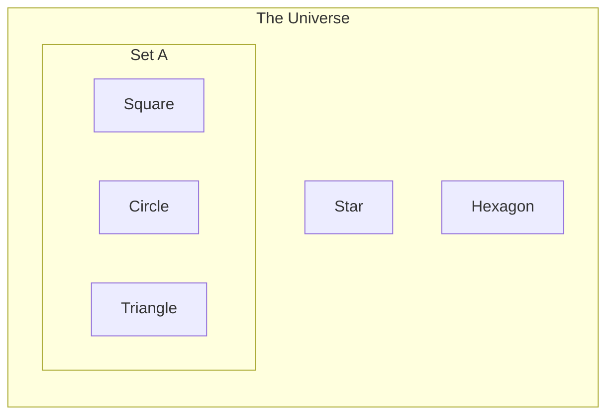
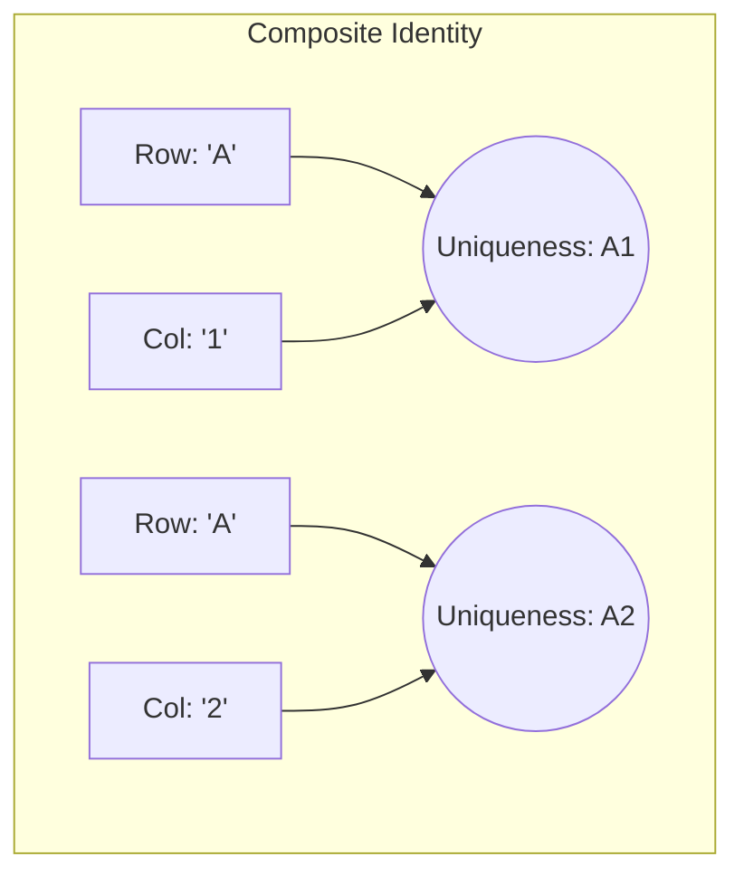

In the last chapter, we spent a lot of time admiring the container. We defined the **Set**—an abstract, distinct collection of things—and we compared it to a database table structure. We discussed *intension* (the rules of the game) and *extension* (the actual players).

But a container is pretty boring if it's empty. A bucket with a hole in it is just trash; a bucket with water in it is a tool. Now, we're going to look at the water. We will look at the individual things that live inside our sets.

In the strict world of logic, we call these **elements** or **members**. In your future life as a data engineer, you will call them **rows**, **records**, or **tuples**.

## 2.1 Members of the Club
Imagine a trendy nightclub called *Club S*. It's exclusive. It has a bouncer, a velvet rope, and very strict rules about who gets in.

If you walk up to the bouncer, only one question matters: "Are you on the list?"

There is no gray area here. You are either inside the club, dancing and sipping overpriced sparkling water, or you are outside on the sidewalk. You cannot be 'mostly' inside. You cannot have your left foot inside and your right foot outside.

This binary state—inside or outside—is the fundamental property of **membership**.

Mathematicians, who famously dislike writing out long words like "is a member of," decided to borrow a letter from the Greek alphabet to represent this relationship. They chose a stylized epsilon, which looks like a curvy little pitchfork: $\in$.

If we have an element $x$ and a set $A$, we write: 

$$
x \in A
$$

This translates to, "Element $x$ belongs to Set $A$."

Conversely, if you are stuck on the sidewalk because you wore sneakers, you are not in the set. We denote this by drawing a slash through the membership symbol:

$$
y \notin A
$$

This translates to, "Element $y$ is not an element of Set $A$."

!!! note "Historical Sidenote"

    The symbol $\in$ comes from the first letter of the Greek word ἐστί (estí), which means "is." It was popularized by the Italian mathematician Giuseppe Peano in 1889. We owe a lot of modern notation to folks who just wanted to save ink.

### The Elements as a Row
So, why do we care about little Greek letters? Because every single time you query a database, you are essentially asking the database engine to perform a massive series of $\in$ checks.

When you look at a spreadsheet or a database table, your eyes naturally scan the horizontal lines.

```txt
| ID | Name | Role |
|:---|:---|:---|
| 1 | Alice | Engineer | <-- This is an element (x)
| 2 | Bob | Designer | <-- This is an element (y)
| 3 | Charlie | Manager | <-- This is an element (z)
```

In the context of the set $Staff$, the entire row `(1, Alice, Engineer)` is a single element.

It is crucial to understand that the **element** is the whole package. It isn't just 'Alice'; it's the combination of the ID, the Name, and the Role bundled together. If we change 'Engineer' to 'CTO,' strictly speaking, we have created a *new* element. The old element `(1, Alice, Engineer)` is no longer in the set, and a new element `(1, Alice, CTO)` has entered.

### The Boolean Nature of Existence
Because membership is binary (True or False), it forms the bedrock of how we verify data existence. In the physical world, things can be vague. A banana can be "kind of" ripe. But in Data Engineering, existence is absolute.

Let's visualize this with a diagram. We have a set $A$ containing logical shapes.



In this diagram:

- $\text{Square } \in A$ is **True**.
- $\text{Star } \in A$ is **False** (or $\text{Star } \notin A$ is **True**).

This seems agonizingly simple, but it has a profound implication: **lookups**.

When you write a query later on that asks, "Give me **all** users who live in Indiana," the database engine has to look at the set of *All Users* and, for every single row, determine if `State = 'Indiana'`. It is effectively testing membership against a criteria.

### The Trap of Representation
Here is where beginners trip over the velvet rope. You must distinguish between the **object** and the **name** of the object.

If I write "The first person in the list" on a piece of paper, that piece of paper is a *reference* to the element, not the element itself.

In set theory, if $x = 10$ and $A = \{10, 20, 30\}$, then $x \in A$. If I change $x$ to 11, then $x \notin A$.

This set $A$ is rigid. It contains exactly what it contains. The variable $x$ is just like a pointer. When we do data engineering, we often get confused by **pointers** (foreign keys, references) versus the **data itself**.

For now, just remember. To be a member is to exist within the boundaries of the definition.

!!! warning "Case Sensitivity is a Bear"

    In pure math, the number 1 is always the number 1. In data, things get messy. Does 'Alice' equal 'alice'?

    From a pure Set Theory perspective, 'Alice' and 'alice' are distinct elements. They have different byte representations. $\text{Alice } \neq \text{ alice}$. Therefore, if your set contains $\{\text{Alice}\}$, then $\text{alice } \notin \text{ Set}$.

    Data systems typically implement "Case Insensitive" logic to be helpful, essentially pretending that $Alice$ and $alice$ are the same element. Never assume the computer is being helpful. Assume it is being literal.

## 2.2 Identity
We have established that a set is a collection of distinct things. In pure mathematics, this is easy. The number 5 is the number 5. You can't have "two" fives in a set. If you write $\{5, 5\}$, the universe (and your math teacher) corrects you, "That's just $\{5\}$."

But in the messy reality of data engineering, we have a problem. We deal with things that *look* identical but are actually distinct.

### The Doppelganger Problem
Let's go back to *Club S*. Imagine two gentlemen walk up to the bouncer.

- They are both wearing a tuxedo.
- They are both 6 feet tall.
- They are both named "John Smith."

If we define our elements purely by their visible properties (Name, Height, Outfit), our set looks like this:

```text
{
    ("John Smith", "6ft", "Tuxedo"),
    ("John Smith", "6ft", "Tuxedo")
}
```

Mathematically, this collapses into a single element. But physically, there are two distinct humans standing there. If one of them orders a $500 bottle of champagne and the other orders tap water, we better know which one to charge. If we treat them as the same element, the person drinking water will be furious when he gets the bill.

This is the case of **identity**.

In data, two rows can have identical values in almost every column, yet represent different real-world entities. To force the logic of Set Theory to play nice with reality, we have to cheat. We have to brand the cattle.

### The Artificial Uniqueness (The Primary Key)
To solve the John Smith problem, we introduce a property whose *sole purpose* is to be unique. We don't care what the value is, as long as no one else has it.

In the physical world, we do this **all** the time:

- **The Coat Check**: You hand over your coat. I give you ticket #42. Someone else hands over an identical coat. I give them ticket #43. The coats are the same; the *identity* is the ticket.
- **Social Security Numbers**: The government doesn't trust names, so it assigns you a nine-digit integer.

In database terms, this unique identifier is called a **Primary Key**.

Let's fix our dataset by adding a User ID:

| UserID | Name | Height | Outfit |
|:---|:---|:---|:---|
| 101 | John Smith | 6ft | Tuxedo |
| 102 | John Smith | 6ft | Tuxedo |

Now, we have distinct elements.

$$
\text{(101, John, 6 ft, Tuxedo) } \ne \text{ (102, John, 6 ft, Tuxedo)}
$$

The first element differs from the second element because $101 \ne 102$. The universe is at peace.

### Natural vs. Surrogate Identity
When you start designing data systems, you will face a philosophical fork in the road: **Natural Keys vs. Surrogate Keys**.

1. **Natural Keys**: Use something that already exists in the data to define uniqueness.
    - *Example*: An email address (`john.smith@gmail.com`).
    - *The Logic*: Two people can't have the same email address, so that's their identity."
2. **Surrogate Keys**: Creating a fake, meaningless number just to be the ID.
    - *Example*: A database auto-incrementing integer (1, 2, 3, —) or a UUID (Universally Unique Identifier).
    - *The Logic*: "I don't trust the email to stay the same. I'm giving you a badge number, 55."

!!! danger "The Falsehoods Programmers Believe About Names"

    Beginners love using Natural Keys. "I'll use the SSN as the key!"

    Don't do it.

    People change names. People share emails. SSNs get stolen or entered incorrectly. If you use a piece of mutable data (like an email) as the foundation of your element's identity, and that person changes their email, you have to rip out the foundation of your house to fix it.

    In data engineering, we almost always prefer **Surrogate Keys** (meaningless IDs). They are stable. ID `5492` is `5492` forever, even if John changes his name to "Batman."

### Composite Keys (The Combination Lock)
Occasionally, a single column isn't enough to define identity.

Imagine you are storing data for a Chess board. You have a piece (`Knight`). If I ask, "Where is the Knight?", you can't point to a single row because there are usually two knights per side. If I ask, "What is on Row 1?" you can't answer because there are 8 squares on Row 1.

The identity of a square on a chess board is defined by the **intersection** of two properties: the Rank (1-8) and the File (A-H).

The set of coordinates is:

$$
\text{Coordinates } = \{(x, y) \mid x \in \{A..H\}, y \in \{1..8\}\}
$$

In a database, if we use both columns together to enforce uniqueness, this is called a **composite key**.



When you define a Composite Key, you are stating, "You can repeat the Row, and you can repeat the Column, but you can never repeat the specific pair (Row, Column)."

### Why This Matters for Joins
We haven't discussed joins yet (thats later on), but I'll give you a sneak peek. When you join two tables, you are effectively taking a plug and trying to find the matching socket.

- The **Primary Key** is the socket. It is the distinct shape that defines a row.
- The **Foreign Key** is the plug. It is the reference to that shape.

If your primary key is not truly unique—if you have two sockets that look exactly the same—the database won't know where to plug in. It will often panic and plug into *both*, creating duplicate data (the dreaded Cartesian explosion).

Understanding identity is about understanding **integrity**. If you cannot point to a row and say, "That one, right there, is unique," you do not have a Set. You have a pile of garbage.

## 2.3 The Empty Set ($\emptyset$)
We have talked about the Club (Set), the Club Rules (Intension), and the people inside (Elements). Now, imagine it's 4:00 AM. The music has stopped. The lights are on. The last patron has stumbled out the door.

The bouncer is still standing there. The velvet rope is still up. The club still exists. But there is absolutely no one inside.

This is the **empty set**.

In set theory, a set with no elements is a perfectly valid set. It isn't "broken." It isn't "undefined." It's just empty.

### The Notation of Nothingness
Mathematicians use a specific symbol for this: a circle with a slash through it:

$$
\emptyset
$$

Alternatively, you might see it written as a pair of empty curly braces:

$$
\{\}
$$

It is critical to visualize this correctly.

- **The Set**: The container (the braces `{}`).
- **The Content**: The void between them.

If $A = \emptyset$, then for any element $x$ you can imagine, $x \in A$ is **False**.

### The "Zero" Trap
Here is the single most common mistake made by new developers and junior data engineers. You must burn this distinction in your brain:

**The Empty Set is not Zero**.

Let's use our physical analogies.

- **Zero (0)**: You have a box, and inside that box is a piece of paper with the number "0" written on it. The box is *not* empty. It contains one thing: a number.
- **The Empty Set ($\emptyset$)**: You have a box, and inside that box is… air. Nothing.

$$
\{0\} \ne \emptyset
$$

The set $\{0\}$ has a cardinality (size) of 1. The set $\emptyset$ has a cardinality of 0.

Why does this matter? Imagine you are a data engineer at a bank. You run a query: `SELECT Balance FROM Accounts WHERE UserID = 55`.

1. **Scenario A (Zero)**: The user exists, but they are broke. The query returns one row: `0.00`. The user is in the system, but they have no money.
2. **Scenario B (Empty Set)**: The query returns **no rows**. The result set is empty. This doesn't mean the user is broke; it means the *user does not exist*.

Confusing "Balance = 0" with "No Record Found" creates bugs that destroy financial reports. One is a value; the other is the absence of existence.

### The Russian Nesting Doll of Nothing
Things get even weirder if we put the empty set *inside* another set.

$$
A = \{\emptyset\}
$$

Is set A empty? **No**. $A$ contains one element. That element just happens to be an empty box.

Think of it like a gift. If I give you a gift box, and you open it to find a smaller empty box inside, I *did* give you something (a box). I'm just a terrible friend.

In data structures (like JSON), this is the difference between:

- `[]` (An empty array)
- `[ [] ]` (An array containing one empty array)

### The Ghost in the machine (Vacuous Truth)
There is a logical rule about the Empty Set that sounds like a riddle, but it allows all of SQL filtering to function properly.

**The Empty Set is a subset of every set**.

$$
\emptyset \subseteq A
$$

No matter what $A$ is—the set of all integers, the set of all Cats, the set of all Taylor Swift albums—the Empty Set is a subset of it.

Why? The logic is called **Vacuous Truth**. To prove that $\emptyset$ is a subset of $A$, we must prove that "Every element in $\emptyset$ is also in $A$."

Since there are *no* elements in $\emptyset$, we cannot find a single counter-example where an element is in $\emptyset$ but not in $A$. Because we cannot disprove it, it must be true.

This matters in Data Engineering because of **Filtering**. When you write a SQL query like:

```sql
SELECT * FROM Users WHERE Age > 200;
```

You are asking the database to return a **Subset** of the Users table. If nobody is over 200 years old, the database returns an Empty Set (0 rows). The database doesn't crash. It doesn't throw an error saying "Logic Failed!" It essentially says, "I have successfully constructed a subset containing nothing."

If the Empty Set wasn't a valid subset of the table, every query that found no matches would cause your pipeline to crash.

## 2.4 The Cardinality of Data
The Fire Marshal has arrived at *Club S*.

He doesn't care who is inside. He doesn't care if they are wearing *tuxedos* or *pajamas*. He doesn't care if they are distinct, unique snowflakes or if they are all named "John Smith." He only cares about one thing: **the number**.

If the capacity of the building is 200, and there are 201 distinct human bodies inside, we have a problem.

In Set Theory, this concept—the size of the set—is called **cardinality**.

### The Absolute Value of a Set
Mathematicians denote cardinality by putting the set inside vertical bars, just like absolute value notation in algebra.

$$
\lvert A \rvert
$$

If set $A = \{\text{Red, Green, Blue}\}$, then:

$$
\lvert A \rvert = 3
$$

This seems trivially easy. You point your finger at the elements, you say "One, two, three," and you stop. But in Data Engineering, cardinality is not just a number; it is a description of the **complexity** and **performance** of your system.

### Finite vs. Infinite (The Hard Truth of Hardware)
In pure mathematics, sets can be infinite. The set of all integers ($\mathbb{Z}$) goes on forever. Its cardinality is $\infty$.

In Data Engineering, there is no such thing as an infinite set.

Your database lives on a hard drive. That hard drive has a finite number of magnetic platters. Your server has a finite amount of RAM. Therefore, every table you ever create will be a **Finite Set**.

When people discuss "Big Data," they don't mean infinite data. They mean "A set with a cardinality so high ($\lvert A \rvert > 10^{12}$) that my computer starts crying."

### High vs. Low Cardinality
As an engineer, you will often hear colleagues ask, "Is that column high cardinality or low cardinality?" They aren't asking for the exact number; they are asking about the **diversity** of the data.

- **Low Cardinality**: A small set of repeated values.
    - *Examples*: `Boolean` (True/False), `Status` (Pending/Active/Closed), `T-Shirt Size` (S/M/L/XL).
    - *The Set Perspective*: The set of possible values is tiny. $\lvert \text{Sizes} \rvert = 4$.
- **High Cardinality**: Almost every value is unique.
    - *Examples*: `Phone Number`, `Social Security number`, `UUID`, `Timestamp`.
    - *The Set Perspective*: The set of possible values is massive. $\lvert \text{Users} \rvert = 1,000,000$.

Why do we care? **Indexing**.

Imagine a phone book (a physical database).

- If I ask you to find "Everyone named Smith" (Medium Cardinality), you can do it pretty fast.
- If I ask you to find "everyone who is male" (Low Cardinality), you would have to circle half the book. This index is useless.
- If I ask you to find "Phone Number 555-0199" (High Cardinality), you can go straight to the specific line.

Understanding the cardinality of your sets helps you predict how slow your queries will be.

### The Problem of the Turnstile
Here is where the math meets the metal, and where we set up our next major conflict.

In pure Set Theory, duplicates do not exist.

**However**.

In a database table (which, remember, is a list of rows), we physically store that duplicate row. We paid for the storage space. The Fire marshal counts two people named John. Therefore, the database says the count is 2.

This leads to the two most famous functions in SQL, which you are now equipped to understand on a theoretical level:

1. `COUNT(DISTINCT column)`: This calculates the **set cardinality**. It removes duplicates first, then counts.
2. `COUNT(*)`: This calculates the **Bag Cardinality**. It counts the physical rows, duplicates and all.

## Quiz

<quiz>
Which mathematical symbol represents the relationship 'Element $x$ belongs to Set $A$'?
- [x] $x \in A$
- [ ] $x \cup A$
- [ ] $x \subseteq A$
- [ ] $x = A$

</quiz>

<quiz>
In the context of a database table defined as a Set, what constitutes a single "element"?
- [ ] The primary key column only.
- [ ] The value in the first column.
- [x] The entire row (record) containing all column values.
- [ ] The table name.

</quiz>

<quiz>
Which of the following statements regarding the Empty Set ($\emptyset$) and the number zero (0) is true?
- [ ] They are functionally identical in SQL.
- [ ] The Empty Set represents a value of 0, while NULL represents emptiness.
- [ ] $\emptyset = \{0\}$
- [x] $\emptyset$ has a cardinality of 0, while $\{0\}$ has a cardinality of 1.

</quiz>

<quiz>
Why is the Empty Set ($\emptyset$) considered a subset of every set $A$ ($\emptyset \subseteq A$)?
- [ ] It isn't; the Empty Set is disjoint from all sets.
- [ ] This is only true for numerical sets.
- [x] Because you cannot find an element in $\emptyset$ that is NOT in $A$.
- [ ] Because most sets contain a NULL value.

</quiz>

<quiz>
If you have a set $A = \{\text{Apple, Apple, Orange}\}$ in strict Set Theory, what is its cardinality ($\lvert A \rvert$)?
- [ ] 0
- [x] 2
- [ ] 1
- [ ] 3

</quiz>

<quiz>
Which SQL function best calculates the "Bag Cardinality" (the total physical rows including duplicates)?
- [ ] `MAX(id)`
- [x] `COUNT(*)`
- [ ] `COUNT(DISTINCT column)`
- [ ] `SUM(column)`

</quiz>

<quiz>
What is the primary risk of using a "Natural Key" (like an email address) as a Primary key?
- [ ] They are too long to store.
- [ ] Databases cannot index strings.
- [ ] They are never unique.
- [x] They are mutable (subject to change).

</quiz>

<quiz>
If you need to identify a square on a Chess Board, you need both the Rank (Row) and File (Column). This is an example of what?
- [x] A Composite Key
- [ ] A Surrogate Key
- [ ] A Foreign Key
- [ ] Low Cardinality

</quiz>

<quiz>
A column containing 'Gender' or 'Boolean' values is typically considered:
- [ ] Infinite Cardinality
- [ ] High Cardinality
- [ ] Null Cardinality
- [x] Low Cardinality

</quiz>

<quiz>
What is the Cardinality of the set $A = \{\emptyset\}$?
- [x] 1
- [ ] 0
- [ ] Undefined
- [ ] Infinite

</quiz>

<!-- mkdocs-quiz results -->
