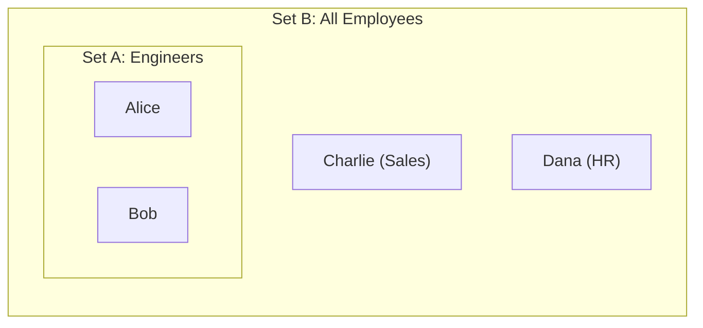

In the first few modules, we acted as hoarders. We obsessed over containers. We learned how to stuff elements into Sets, we learned how to label them with identities, and we learned how to stack them into Bags until the Fire Marshal yelled at us.

Now, we are going to do the opposite. We will stop collecting and start **rejecting**.

Data engineering is rarely about "Giving the user everything." If a CEO asks for "Sales numbers for Q3," and you dump the entire raw transaction database onto their desk, you will be fired. You need to carve the answer out of the raw material.

This is the art of **filtering**. In Set Theory, this is the study of **subsets**.

## 4.1 The Subset Relationship ($A \subseteq B$)
Imagine you are Michelangelo. You are staring at a massive, rectangular block of marble. Someone asks, "Where is the statue of David?" You point to the block and say, "He is in there. I just need to remove the marble that isn't him."

This is precisely how a database works.

The table you store on the disk is the block of marble. It is the **superset**. The report you deliver to your dashboard is the status. It is the **subset**.

### The Definition of Containment
Mathematically, we saw that Set A is a subset of Set B if every single element living in A also lives in B.

We denote this with a rounded "less than or equal to" symbol:

$$
A \subseteq B
$$

Formal Logic Definition:

$$
\forall x (x \in A \to x \in B)
$$

*"For all x, if x is in A, then it implies x is in B."*

If there is even one rogue element in A that cannot be found in B, then A is not a subset.



In this diagram, the set of *Engineers* is purely contained within the set of *All Employees*. You cannot be an engineer here without being an Employee.

### The Filtering Mindset
In SQL, you will perform this operation billions of times using the `WHERE` clause:

```sql
SELECT * FROM Employees WHERE Role = 'Engineer';
```

When you write this, you are not creating new data. You are defining a boundary within the existing data. You are drawing a circle around Alice and Bob and telling the database, "Ignore the rest."

This mental model—**Filtering is Subsetting**—is crucial because it dictates the limits of what you can do.

1. **You cannot filter for what isn't there.** A subset cannot contain elements that do not exist in the superset. If you filter `WHERE Roel = 'Astronaut'`, and your company employs zero astronauts, you get the Empty Set. You do not get a magical Astronaut record.
2. **The Lineage is permanent.** Every row in your result set $A$ is literally the same row from the source table $B$. It inherits **all** the properties, bugs, and data quality issues of the parent.

### The Reflexive Property (The "Copy" Command)
There is a weird edge case in the definition $A \subseteq B$. What if $A$ is the same as $B$?

$$
\{1, 2, 3\} \subseteq \{1, 2, 3\}
$$

Is this true? **Yes**. Check the rule: "Is every element on the left side also on the right side?" Yes.

This is why the symbol is $\subseteq$ (with the line underneath), reminiscent of $\le$. It means "Subset or Equal To."

In data engineering, this is the "Select All" query (`SELECT * FROM Table`). It is technically a subset operation where the filter is "True." You have carved a statue that is the same size as the block of marble. It's not very artistic, but it is mathematically valid.

### Why Data Engineers "Refine"
We call the process of moving data from raw to production "Refining." Crude oil is a superset of chemicals. Gasoline is a subset. Plastic is a subset. Kerosene is a subset.

As a data engineer, your pipelines are essentially a series of subset operations.

1. **Ingest**: Land the huge, messy Superset (The Lake).
2. **Filter**: Remove the garbage rows (Subset 1).
3. **Filter**: Select only the active users (Subset 2).
4. **Filter**: Select only today's transactions (Subset 3).

At every step, $\lvert Subset \rvert \le \lvert Superset \rvert$. If your subset ever gets bigger than your superset during a filtering stage, you have done something horrifying (probably a join explosion, which we will dread together later).

## 4.2 Proper Subsets
In the last section, we established that a set is technically a subset of itself. If you ask for "All employees" from the Employees table, you have performed a subset operation where the result is identical to the source.

Mathematically, this is sound. Engineering-wise, this is a waste of a good `WHERE` clause.

Usually, when we discuss filtering, we imply that we are getting rid of something. We are separating the signal from the noise. We are taking a large dataset and whittling it down to a smaller, more specific one.

This is the domain of the **proper subset**.

### The Strict Inequality
A set $A$ is a **proper subset** of $B$ if, and only if:

1. Every element of $A$ is in $B$ ($A \subseteq B$).
2. There is at least one element in $B$ that is **NOT** in $A$ ($A \ne B$).

We denote this by removing the horizontal line from the symbol:

$$
A \subset B
$$

Think of this like the difference between "Less Than or Equal To" ($\le$) and "Strictly Less Than" ($\lt$).

- $\subseteq$ allows for the sets to be identical.
- $\subset$ demands that the child is smaller than the parent.

### The Venn of it All

- **Set B (The White)**: The Superset (e.g., All Transactions).
- **Set A (The Yolk)**: The Proper Subset (e.g., Transactions > $100).

The white space surrounding the yolk is critical. That space represents the **excluded data**. In a proper subset, that space must contain at least one row. If there is no white space—if the yolk expands to fill the entire shell—you have lost the "proper" status.

### The "No-Op" Filter
Why do we care about this distinction? Because in data pipelines, a filter that results in a non-proper subset (where Output = Input) is often a sign of a bug or a misunderstanding of the data.

Imagine you are investigating fraud. You write a query:

```sql
SELECT * FROM Transactions WHERE Amount > 0;
```

You run this against the `Transactions` table. If the result count is the same as the source table count, what have you learned?

You have learned that your filter was **useless**. It didn't exclude anything. The set of "Positive Transactions" is not a Proper Subset; it is equal to the superset.

As a data engineer, you constantly check row counts.

- **Input**: 1,000,000 rows.
- **Filter Logic**: `WHERE status = 'active'`
- **Output**: 1,000,000 rows.

If you see this, you should pause.

- *Hypothesis 1*: The business is doing great! Everyone is active.
- *Hypothesis 2 (More Likely)*: The `status` column is broken and defaults to 'active' for everyone.

### The Empty Set Returns
Here is a fun logical edge case. Is the Empty Set ($\emptyset$) a proper subset of a table?

If the table has data in it (let's say, $A = \{1, 2\}$), then yes.

1. $\emptyset$ is contained in $A$ (Vacuously True).
2. $\emptyset \ne A$ (0 is not 2).

Therefore, $\emptyset \subset A$.

The only time the Empty Set is *not* a proper subset is when the table itself is empty. If $A = \emptyset$, then $\emptyset \subseteq \emptyset$ (True), but $\emptyset \ne \emptyset$ (False).

## 4.3 The Power Set
You have a set of data. You know how to filter it down to a specific subset (e.g., "Users from Indiana"). You know how to filter it down to a proper subset.

But what if I asked you to list every *single possible* way you could slice that data?

THis is not a hypothetical question. This is literally what happens when a Business Intelligence team asks for a "Data Cube" or when a manager says, "I want to see the sales broken down by every combination of Region, Product, and Date."

They are asking for the **Power Set**.

### The Set of Sets
The Power Set of a set $A$, denoted as $\mathcal{P}(A)$ or sometimes $2^A$, is the set containing all possible subsets of $A$.

This includes:

1. The Empty Set.
2. The set $A$ itself (the improper subset).
3. Every combination in between.

Let's look at a very small table of features. Imagine a user can have three flags: $A = \{\text{Admin, Editor, Viewer}\}$

The Power Set $\mathcal{P}(A)$ contains:

- $\emptyset$ (A user with no roles).
- $\{Admin\}$
- $\{Editor\}$
- $\{Viewer\}$
- $\{Admin, Editor\}$
- $\{Admin, Viewer\}$
- $\{Editor, Viewer\}$
- $\{Admin, Editor, Viewer\}$

Notice something? The original set had 3 elements. The Power Set has 8 elements. 

### The Exponential Explosion ($2^n$)
There is a simple formula for the size of the Power Set. if your set has $n$ elements, the Power Set has $2^n$ elements.

Why 2? Think of it like a row of light switches. For every element in the set, you have exactly two choices:

1. **Include it** (Switch On / 1).
2. **Exclude it** (Switch Off / 0).

If you have 3 elements, that's $2 \times 2 \times 2 = 8$ combinations. If you have 10 elements, that's $2^{10} = 1,024$ combinations. If you have 20 elements, that's over 1,000,000 combinations.

### The Data Engineer's Nightmare: Combinatorial Explosion
This concept is why data engineers get nervous when someone mentions "Facet Search" or "filtering by any combination of tags."

Imagine you are building an e-commerce site. You have a table of products. Each product has 50 different attributes (Color, Size, Material, Brand, Year, etc.). A user wants to filter by *any* combination of these.

The number of potential subsets (and thus the number of potential indexes or query plans the database might need to consider) is $2^{50} \cdot 2^{50}$ is roughly 1,125,899,842,624.

You cannot pre-calculate all the answers. The Power Set is simply too big.

### The "Cube" (OLAP)
In the world of Data Warehousing, you will encounter a concept called **OLAP Cubes** for SQL commands like `GROUP BY CUBE`.

These tools are explicitly designed to generate the Power Set of aggregations. If you `GROUP BY CUBE (Region, Product)`, the database calculates:

1. Total Sales (The Empty Set - All data).
2. Sales by Region.
3. Sales by Product.
4. Sales by Region and Product.

It calculates every possible subset of grouping keys. It is powerful, but dangerous. If you try to "Cube" too many dimensions, the $2^n$ rule kicks in, and your database server melts. 

## Quiz

<quiz>
Which symbol represents the standard Subset relationship, where Set $A$ is contained in $B$ but could also be equal to $B$?
- [x] $A \subseteq B$
- [ ] $A \subset B$
- [ ] $A \in B$
- [ ] $A = B$

</quiz>

<quiz>
Is the statement $A \subseteq A$ (A set is a subset of itself) true or false?
- [x] True
- [ ] False

</quiz>

<quiz>
What is the defining characteristic of a Proper Subset ($A \subset B$)?
- [ ] It implies that $A$ and $B$ are disjoint (share no elements).
- [ ] It must contain zero elements.
- [ ] It must be larger than the Superset.
- [x] It must be strictly smaller than the Superset (at least one element is excluded).

</quiz>

<quiz>
In a data engineering context, if you run a query like `SELECT * FROM T WHERE Amount > 0` and the result count equals the source table count, what have you discovered?
- [ ] The database is broken.
- [ ] The result is a Proper Subset.
- [x] The filter failed to exclude any rows (Result = Superset).
- [ ] The table is empty.

</quiz>

<quiz>
What is the Power Set of a set $A$, denoted $\mathcal{P}(A)$?
- [ ] The set of all databases in a cluster.
- [ ] The set of all elements raised to the power of 2.
- [ ] The largest possible subset of $A$.
- [x] The set containing all possible subsets of $A$.

</quiz>

<quiz>
If a set $A$ has 3 elements (e.g., $\{X, Y, Z\}$), what is the Cardinality (size) of its Power Set?
- [ ] 9
- [ ] 3
- [ ] 6
- [x] 8

</quiz>

<quiz>
Why do data engineers fear the term "Combinatorial Explosion" regarding the Power Set?
- [ ] Because it requires too much electricity.
- [x] Because the number of subsets grows exponentially ($2^n$), quickly becoming uncomputable.
- [ ] Because it deletes data.
- [ ] Because it creates duplicates in the database.

</quiz>

<quiz>
Is the Empty Set ($\emptyset$) a Proper Subset of the set $A = \{1, 2\}$?
- [ ] True
- [x] False

</quiz>

<quiz>
Which SQL operation is conceptually related to generating members of the Power Set?
- [ ] `UPDATE`
- [ ] `INNER JOIN`
- [x] `GROUP BY CUBE`
- [ ] `DELETE WHERE`

</quiz>

<quiz>
If you try to filter a set for an element that does not exist (e.g., `WHERE Role = 'Astronaut'` where no astronauts exist), what is the result?
- [x] The Empty Set $\emptyset$.
- [ ] An error.
- [ ] The Universal Set.
- [ ] NULL

</quiz>

<!-- mkdocs-quiz results -->