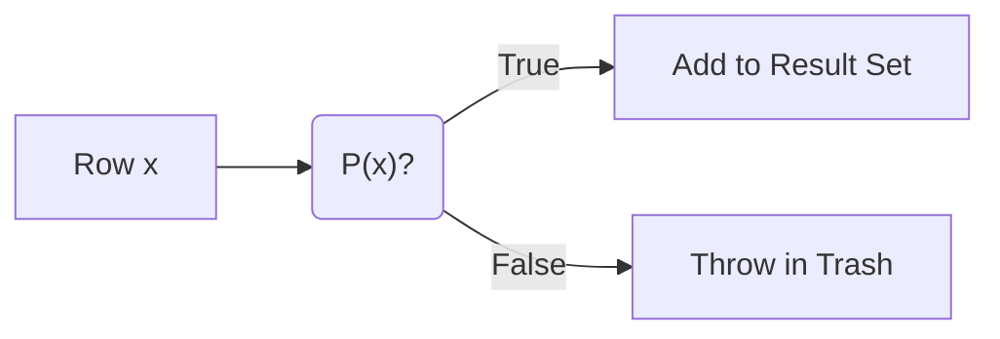
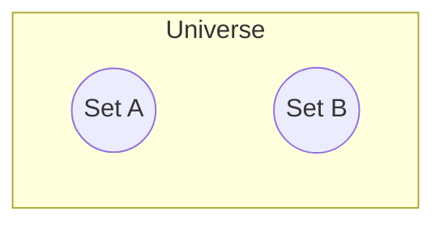

We have spent the last few modules building a mental model of data as a collection of boxes (Sets) and sub-boxes (Subsets). We know that we *can* filter data. We know that if we filter down to "Users in Indiana," we create a subset.

But how do we actually tell the computer to do that? We can't just gesture vaguely at the hard drive and say, "Give me the Hoosiers."

We need a formal language to distinguish the signal from the noise. We require a way to look at a single row of data and make a life-or-death decision: **keep** or **discard**.

This decision making  engine is called **predicate logic**.

## 5.1 Predicate Logic
In the world of discrete math, a **predicate** is simply a function that asks a question.

It is a specific type of function. It doesn't return a number. It doesn't return a string. It returns one of two possible values: **True or False**.

We denote a predicate as a capital letter (usually $P$ or $Q$) taking an argument $x$.

$$
P(x) \rightarrow \{True, False\}
$$

### The Gatekeeper
Imagine our nightclub from module 2 again. But this time, the bouncer isn't checking a guest list. The bouncer has a rule book.

- **Rule $P$**: "Must be wearing a hat."

A person ($x$) walks up. The bouncer looks at them and effectively runs the function $P(x)$.

- Alice (No Hat): $P(Alice) = False$. **Discard**.
- Bob (Has Hat): $P(Bob) = True$. **Keep**.

This is precisely what the SQL `WHERE` clause is. It is a predicate function applied to every single element in the bag.

```sql
SELECT * FROM Club WHERE WearingHat = 'Yes';
```

When the database engine runs this, it is technically evaluating the truthiness of $P(x)$ for every row $x$ in the table.

### Set-Builder Notation
This brings us to the most powerful notation in Set Theory, and the one that looks the most like SQL. It is called **Set-Builder Notation**.

Instead of listing every element (Extension), we define the set by its rule (Intension).

$$
A = \{x \in U \mid P(x)\}
$$

Let's translate this hieroglyphic script:

- $x \in U$: Take every element of $x$ from the Universe (the table).
- $\mid$: "Such that… " (the condition).
- $P(x)$: The predicate is True.

If you read it out loud, it sounds like English: "Set A is the collection of all x in the Universe such that P(x) is true."

If you translate it to SQL, it sounds like code: `SELECT * FROM Universe WHERE P(x)`.

### The Truthiness of Data
The critical takeaway here is that predicates are **atomic**. A row cannot be "kind of" in the result set. $P(x)$ cannot return "Maybe."

To a data engineer, writing a query is essentially **composing a predicate**.

- `age > 21` is a predicate.
- `status = 'active'` = is a predicate

When you chain them together, you are building a complex logic gate.



### Why This Matters
Understanding that a `WHERE` clause is a mathematical function helps you avoid the common trap of **procedural thinking**.

New engineers often think, "I want the computer to loop through the table, check this variable, then if that matches, check this other variable… "

No. In Set Theory (and SQL), you define the state of **Truth**. You define the shape of the filter. You do not tell the computer *how* to check it; you just define *what* must be true.

If $P(x)$ is True, the row exists; if $P(x)$ is False, the row effectively never existed.

But rarely is life so simple that a single rule covers it. "Must be wearing a hat" is a simple predicate. Usually, the bouncer has a complex list: "Must be wearing a Hat OR must know the DJ AND must NOT be wearing sneakers."

To handle these, we need to combine our predicates using **boolean algebra**.

## 5.2 Union of Conditions (OR)
Imagine you are negotiating with a toddler about eating dinner. You say, "You can eat your broccoli." The toddler screams. You negotiate, "Okay, you can eat your broccoli OR you can eat your carrots."

You have just expanded the size of the "Allowed Dinner Set."

By adding the word **OR**, you have made it easier to satisfy the condition. The child doesn't need to do both. They just need to hit one of the targets.

In logic, this is the *disjunction*, represented by the symbol $\lor$. In Set Theory, this is the **Union**, represented by the cup symbol $\cup$.

### The Inclusive Cup
When we combine two predicates with `OR`, we are effectively taking two separate sets of data and pouring them into the same bucket.

Let's define two sets based on predicates:

- $A = \{x \mid x \text{ is Red}\}$
- $B = \{x \mid x \text{ is Square}\}$

If we filter for `Red OR Square` ($A \cup B$), who gets in?

- A Red Circle? Yes. (Satisfies A).
- A Blue Square? Yes. (Satisfies B).
- A Red Square? Yes. (Satisfies both).

The last point is critical. In conversational English, when we say "Tea or Coffee?", we usually imply "Pick one, but not both." This is called an *Exclusive OR (XOR)*.

But in Boolean Logic and SQL, the **OR** is always **inclusive**. A Red Square is perfectly welcome in the union. In fact, it is the VIP guest.

### The Expansion Principle
Here is a rule of thumb for data engineering: **OR makes the result set bigger**.

(Technically, it makes it "bigger or equal to," but let's stick to the mental model).

Every time you add an `OR` condition to a `WHERE` clause, you are lowering the standards for entry. You are opening another door to the club.

- `WHERE age > 21` (Strict)
- `WHERE age > 21 OR has_fake_id = true` (Less Strict)
- `WHERE age > 21 OR has_fake_id = true OR knows_the_bouncer = true` (Even Less Strict)

If you keep adding `OR`s, eventually you will describe the entire Universe ($A \cup A^c$), and you will get every single row back.

### The "English" Trap
The hardest part about `OR` isn't the math; it's the translation from English. Business stakeholders are notoriously bad at speaking Boolean. 

**The Manager's Request**:

> "I need a list of **all** customers who live in New York **and** New Jersey."

**The Trap**: If you translate this literally into SQL:

```sql
SELECT * FROM customers WHERE State = 'NY' AND State = 'NJ';
```

**Result**: 0 Rows. **Why?** Because nobody lives in two states at once (usually). A single column cannot hold two mutually exclusive values simultaneously.

What the manager *meant* was:

> "I need the set of NY customers **combined with (Union)** the set of NJ customers."

Mathematically, they want:

$$
\{x \mid State(x) = NY\} \cup \{x \mid State(x) = NJ\}
$$

Which translates to the logical predicate:

$$
State = NY \lor State = NJ
$$

So, whenever a person says "and" while listing options for a single field ("I want red and blue and green"), your data engineering brain must auto-correct it to **OR**. They are asking for a Union of options, not an intersection of impossibilities. 

## 5.3 Intersection of Conditions (AND)
If **OR** is the "Cool Mom" who lets you eat broccoli OR carrots, **AND** is the strict grandparent who says, "You must finish your broccoli **AND** wash the dishes **AND** recite the alphabet backwards."

The **AND** operator is a filter that demands perfection. You don't just have to meet one criteria; you have to meet *all* of them simultaneously.

In logic, this is the **conjunction**, represented by the symbol $\land$ (it looks like an 'A' without the crossbar). In Set Theory, this is the **intersection**, represented by the cap symbol $\cap$.

### The Common Ground
When we use `AND`, we are looking for the overlap between two sets. We are looking for the specific area where *both* realities exist at once.

Let's use our shapes again:

- $A = \{x \mid x \text{ is Red}\}$
- $B = \{x \mid x \text{ is Square}\}$

If we filter for `Red AND Square` ($A \cap B$), who survives?

- A Red Circle? No. (Fails B).
- A Blue Square? No. (Fails A).
- A Red Square? Yes. (Satisfies both).

### The Reduction Principle
Just as `OR` expands the results, **AND reduces the result**.

Every time you add an `AND` clause to your query, you are adding another hurdle for the data to jump over. You are tightening the noose.

- `WHERE age > 21` (100 people)
- `WHERE age > 21 AND has_ticket = true` (50 people)
- `WHERE age > 21 AND has_ticket = true AND is_sober= true` (12 people)

If you keep adding `AND`s, eventually you will create a set of rules so strict that nothing in the universe can satisfy them. You will reach an Empty Set.

### The Mutually Exclusive Trap
This brings us back to the trap we mentioned in the last section, but now we can see *why* it fails.

A **mutually exclusive** condition occurs when the intersection of two sets is empty.

$$
A \cap B = \emptyset
$$

Common examples in data engineering:

- `WHERE status = 'Active' AND status = 'Deleted'`
- `WHERE created_at > '2024-01-01' AND created_at < '2023-01-01'` (Time travel logic)
- `WHERE id = 5 AND id = 6`

When you write these, the database engine doesn't argue with you. It doesn't say, "Hey, that's impossible!" It dutifully checks every row. "Are you Active and Deleted? No. Okay, next row." It returns zero rows, and you spend three hours debugging why your pipeline is "broken" when the logic was just impossible.

### The Order of Operations (Precedence)
Here is where things get spicy. What happens if we mix them? "I want Red Squares OR Circles."

This is ambiguous.

1. **(Red AND Square) OR Circle**
    - *Meaning*: Give me all Red Squares. Also, give me every Circle regardless of color.
2. **Red AND (Square OR Circle)**
    - *Meaning*: Give me things that are Red. Within the red group, I'll take the Squares and Circles.

In SQL (and standard logic), **AND binds tighter than OR**. It's like multiplication vs. addition in algebra. `AND` happens first.

If you write:

```sql
WHERE color = 'Red' AND shape = 'Square' OR shape = 'Circle'
```

The computer reads it as Option 1. It finds the Red Squares, then it adds *all* the Circles (even the blue ones).

If you meant Option 2, you **must** use parentheses:

```sql
WHERE color = 'Red' AND (shape = 'Square' OR shape = 'Circle')
```

As a data engineer, my advice is: **Always use parentheses**. Even if you know the rules of precedence, the person reading your code at 3 AM might not. Be explicit.

## 5.4 Complements (NOT)
We have talked about gathering things together (UNION/OR) and finding the overlap (INTERSECTION/AND). But occasionally, the easiest way to define what you want is to define exactly what you *don't* want.

This is the power of **negation**.

In logic, we represent this with the "not" symbol ($\lnot$) or occasionally a tilde (~). In Set Theory, this is called the **complement**, denoted as $A^c$ or $A^1$.

### The Anti-Set
The complement of a Set $A$ is literally everything in the Universe that is **not** in $A$.

$$
A^c = \{x \in U \mid x \notin A\}
$$

If your universe is "integers" and Set $A$ is "even numbers," then $A^c$ is "odd numbers."

In SQL, we use the `NOT` operator or the inequality symbols (`1=` or `<>`).

```sql
SELECT * FROM Users WHERE Status <> 'Banned';
```

This query defines the "good users" not by listing every good status (Active, Pending, VIP, New), but simply by excluding the bad ones. It is efficient… usually.

### The Danger of the Universe
There is a catch. When you say, "Give me everything that is NOT a Banana," you have to be cautious about what is in your universe.

If you're at a grocery store, "Not a Banana" means apples, oranges, and bread. If you are in the *Universe of All Matter*, "Not a Banana" includes clouds, rocks, black holes, and your grandmother.

In data engineering, this manifests when you invert a filter on a messy table. Imagine you have a table of `Events`. Query: `WHERE event_type != 'Login'`.

You assume this gives you 'Logout' and 'Purchase' events. But it also gives you:

- 'Error' events
- 'Debug' events
- 'Test' rows that Dave inserted last week and forgot to delete.

When you use `NOT`, you are implicitly trusting the contents of the *rest* of the Universe. You are casting a very wide net.

### De Morgan's Laws (The Engineer's Cheat Sheet)
The trickiest part of `NOT` isn't using it alone; it's mixing it with `AND` and `OR`. Our brains are terrible at processing double negatives.

> "I don't want (Red or Blue)."

Does that mean:

1. I don't want Red OR I don't want Blue?
2. I don't want Red AND I don't want blue?

To solve this, we turn to Augustus De Morgan, a 19th-century mathematician who gave us two rules that every programmer should tattoo on their arm. These rules explain how to "distribute" a negative sign across a parenthesis.

#### Rule 1: The Negation of OR is AND

$$
\lnot (A \lor B) \iff (\lnot A) \land (\lnot B)
$$

If I say, "I don't want (Soup or Salad)," it means, "I do not want Soup **AND** I do not want Salad." (I want nothing).

#### Rule 2: The Negation of AND is OR

$$
\lnot (A \land B) \iff (\lnot A) \lor (\lnot B)
$$

If I say, "I don't want (a car that is fast and expensive)," it means, "I want a car that is not fast **OR** a car that is not expensive." (A slow, expensive car is fine. A fast, cheap car is fine. I just reject the specific combination of both).

### Why This Matters for SQL
You will often encounter legacy code that looks like this:

```sql
WHERE NOT (status = 'Active' OR status = 'Pending')
```

This forces your brain to do mental gymnastics: "Okay, it's not active… or pending… so it's closed?" Using De Morgan's Law, you can rewrite this into something readable:

```sql
WHERE status != 'Active' AND status != 'Pending'
```

"Status is not active AND status is not Pending," much clearer.

### The Double Negative
Finally, remember that the complement of a complement is the original set.

$$
(A^C)^C = A
$$

"I am not not hungry" means "I am hungry." In code, if you see `NOT (NOT condition)`, just delete both `NOT`s. You are welcome.

## 5.5 Disjoint Sets
We just spent a bit of time talking about the conditions that bring data together—finding the overlap, the shared space, the "AND." But occasionally, the most important relationship between two groups of data is that they have **no relationship at all**.

In Set Theory, when two sets have absolutely zero elements in common, we call them **Disjoint Sets**.

Think of it like matter and antimatter. They can exist in the same universe, but they cannot occupy the same space. If they touch, things explode. In data engineering, if two sets that *should* be disjoint suddenly touch, your pipelines might not explode, but your dashboard certainly will.

### The Definition of "None"
Mathematically, we define disjoint sets by looking at their intersection. Two sets $A$ and $B$ are disjoint if and only if their intersection is the Empty Set.

$$
A \cap B = \emptyset
$$

There is no $x$ such that $x$ is in $A$ AND $x$ is in $B$.

Visually, this is the saddest diagram in the world. It's just two circles standing at opposite ends of the room, refusing to make eye contact.



### Why "Nothing" Matters
You might be thinking, "Great, two things that have nothing to do with each other. Why do I care?"

In logic and database design, proving that two sets are disjoint is often more critical than finding where they overlap. It is the foundation of **mutually exclusive** logic. Something we touched on earlier in this module.

Imagine you are building a database for a hospital. You have a set of `Active_Patients` and a set of `Discharged_Patients`.

- **Set A**: People currently in a bed.
- **Set B**: People who have gone home.

These sets **must** be disjoint. If you run a query and find a Patient ID that exists in both $A$ and $B$, you have a logical contradiction. A patient cannot be simultaneously in a bed and at home (unless quantum physics has entered the medical field).

### The Partitioning Principle
This concept leads us to one of the holy grails of data engineering: **partitioning**.

When we deal with massive datasets—terabytes of logs, years of transaction history—we can't keep it all in one giant bag. We have to chop it up. We might slice the data by date (e.g., `January_Data`, `February_Data`).

For this to work, those slices must be disjoint sets.

1. Every row belongs to exactly one slice.
2. No row appears in two slices.

If your "January" bucket contains a record dated "Feb 1st," you have violated the disjoint property. You have duplicated data. You have created a bag where you promised a set.

!!! danger "The Silent Duplication"

    One of the most common bugs in data engineering happens when we assume sets are disjoint, but they aren't.

    If you `UNION ALL` (stack) two tables together, assuming they contain unique records, but there is a tiny 1% overlap, you have just silently corrupted your data counts. Always verify disjointness before you stack!

### Disjoint vs. Distinct
Do not confuse **disjoint** and **distinct**.

- **Distinct** refers to elements *inside* a single set (uniqueness).
- **Disjoint** refers to the relationship *between* two different sets (separation).

A set can have distinct elements and be disjoint from another set.


## Quiz

<quiz>
In the context of Set Theory and SQL, what is a Predicate ($P(x)$)?
- [ ] A command that deletes data from the set.
- [ ] A function that returns a probability between 0 and 1.
- [x] A function that returns either True or False for a given element.
- [ ] A method for sorting the set.

</quiz>

<quiz>
A business manager asks, "I need a list of customers who live in New York and New Jersey." How should you translate this into SQL logic?
- [ ] `WHERE State = 'NY' + State = 'NJ'`
- [ ] `WHERE State IN ('NY', 'NJ') AND State IS NOT NULL`
- [x] `WHERE State = 'NY' OR State = 'NJ'`
- [ ] `WHERE State = 'NY' AND State = 'NJ'`

</quiz>

<quiz>
What is the general effect of adding an `OR` ($\lor$) clause to a query?
- [x] It expands (or maintains) the result set.
- [ ] It narrows the result set.
- [ ] It creates duplicates automatically.
- [ ] It negates the previous condition.

</quiz>

<quiz>
Consider the query: `WHERE Color = 'Red' AND Shape = 'Square' OR Shape = 'Circle'`. How does the database evaluate the precedence?
- [ ] It evaluates from right to left.
- [x] `(Color = 'Red' AND Shape = 'Square') OR Shape = 'Circle'`
- [ ] `Color = 'Red' AND (Shape = 'Square' OR Shape = 'Circle')`
- [ ] It throws a syntax error because it is ambiguous.

</quiz>

<quiz>
You write a query `WHERE ID = 5 AND ID = 6`. Why does this return 0 rows?
- [ ] Because IDs cannot be single digit numbers.
- [x] Because the conditions are mutually exclusive.
- [ ] Because you forgot to use parentheses.
- [ ] Because `AND` implies a UNION.

</quiz>

<quiz>
According to De Morgan's Laws, how do you simplify `NOT (A OR B)`?
- [ ] `A AND B`
- [ ] `A OR B`
- [x] `NOT A AND NOT B`
- [ ] `NOT A OR NOT B`

</quiz>

<quiz>
According to De Morgan's Laws, how do you simplify `NOT (Fast AND Expensive)`?
- [ ] `Fast OR Expensive`
- [ ] `NOT Fast AND Not Expensive`
- [ ] `True`
- [x] `NOT Fast OR NOT Expensive`

</quiz>

<quiz>
What is the primary risk of using a negative filter like `WHERE Type != 'Login'` without checking the Universe of data?
- [ ] It converts NULLs to Zeros.
- [ ] It is slower than positive filters.
- [ ] It turns the results into a Boolean.
- [x] It implicitly includes everything else in the Universe, including garbage/error rows.

</quiz>

<quiz>
What is the logical result of the expression `NOT (NOT Condition)`?
- [ ] `Condition OR NOT Condition`
- [ ] `NOT Condition`
- [ ] `NULL`
- [x] `Condition`

</quiz>

<quiz>
Which set notation corresponds to the logical AND operator?
- [ ] Subset ($\subseteq$)
- [ ] Complement ($A^c$)
- [x] Intersection ($\cap$)
- [ ] Union ($\cup$)

</quiz>

<!-- mkdocs-quiz results -->