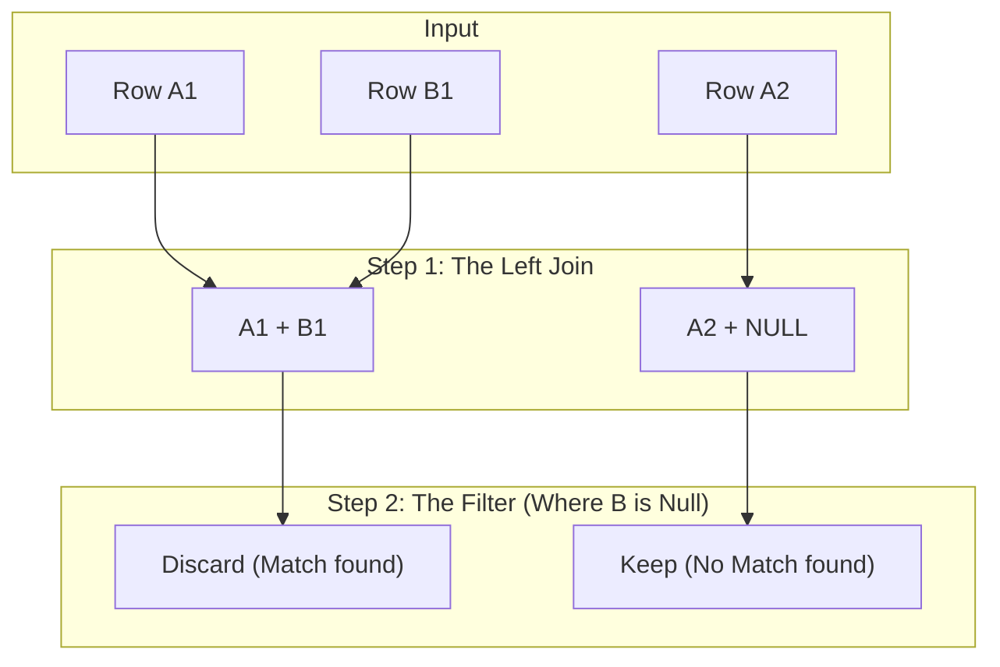

We have spent a lot of time talking about togetherness. We've united sets, we've found their intersections, and we've generally acted like a data matchmaker, trying to find common ground between two groups of things.

But occasionally, you are not concerned about what matches. Occasionally, you want to know what makes a group *special*. You want the loners, the leftovers, the odd ones out. You want to know who *didn't* turn in their homework, which products *didn't* sell, or which server logs *don't match* the security manifest.

In arithmetic, when you would like to find the difference between numbers, you subtract. In set theory, we do the same thing. But unlike subtracting numbers—where you just end up with a smaller number—subtracting sets leaves you with a specific, curated collection of survivors.

## 7.1 Relative Complement ($A - B$)
Let's say you are hosting a party. You have a list of people you **invited** (Set $A$). You also have a list of people who actually **attended** (Set $B$).

If you want to know who "ghosted" you—the people who said they'd come but left you eating the spinach dip alone—you are looking for a very specific subset. You need everyone who is in the **invited** set but *not* in the **attended** set.

In formal logic, this is called the **relative complement**, or simply the **difference**.

### The Definition
The relative complement of Set $B$ with respect to Set $A$ is the set of all elements that are members of $A$ but are **not** members of $B$.

Mathematicians, being fond of shorthand, usually write this as $A \setminus B$ (pronounced "A minus B" or "A without B"). You will also see $A - B$, which is friendlier to type, and what we'll stick with here because it maps intuitively to the "subtraction" mental model.

Here is the set-builder notation, which is essentially the source for the logic:

$$
A - B = \{x \mid x \in A \land x \notin B\}
$$

Read that aloud: "A minus B is the set of all x such that x is in A AND x is NOT in B."

It looks innocent enough, but there is a subtle power move happening here. We are starting with a universe of data (Set $A$) and using Set $B$ purely as a **filter**. We aren't actually concerned about the contents of $B$ for their own sake; we only care about them as a "kill list" to *remove* items from $A$.

!!! note "Visualizing the Cut"

    Imagine two overlapping circles. $A - B$ is like taking a cookie cutter shaped like Circle $B$ and stamping it over Circle $A$. Whatever dough is left of $A$ after you remove the $B$ piece is your result. If $B$ barely overlaps $A$, you have a lot of dough left. If $B$ completely covers $A$, you have crumbs.

### The Non-Commutative Trap
Here is where our muscle memory from previous chapters might betray us.

When we talked about Unions ($A \cup B$) and Intersections ($A \cap B$), we noted that they were **commutative**. Order didn't matter. A handshake between Alice and Bob is the same as a handshake between Bob and Alice.

**Difference is NOT commutative**.

$$
A - B \ne B - A
$$

If I take "My Monthly Income" minus "My Monthly Bills," I (hopefully) have some savings left over. If I take "My Monthly Bills" minus "My Monthly Income," I have… well, debt. Very different concepts.

Let's look at this with raw data to see the asymmetry in action.

**Set A (Engineers)**: `{Alice, Bob, Charlie, Dave}`

**Set B (On-Call Rotation)**: `{Bob, Dave, Eve}`

If we calculate **Engineers NOT on call** ($A - B$), we take the list of engineers, and we cross out anyone who appears in the on call list:

- Alice? Not in B. Keep her.
- Bob? In B. Remove him.
- Charlie? Not in B. Keep him.
- Dave? In B. Remove him.

**Result (A - B)**: `{Alice, Charlie}`

Now, let's flip it. **On call people who are NOT Engineers** ($B - A$). *Wait, is that possible? Maybe Eve is a manager or an automated bot?*

- Bob? In A. Remove.
- Dave? In A. Remove.
- Eve? Not in A. Keep.

**Result (B - A)**: `{Eve}`

!!! warning "The Danger of Order"

    In SQL, you might eventually use operators like `EXCEPT` or `MINUS` (depending on your database flavor). If you accidentally swap the order of your queries, you won't get an error.  You will just get the wrong answer. You are asking an entirely different question. Always ask yourself, "Which set is the **Bucket** i'm keeping, and which set is the **filter** I'm removing?"

### Why Data Engineers Care
You might be thinking, "Okay, subtraction. I learned this in first grade." But in the context of data pipelines, the difference operation is the bedrock of **change detection** and **integrity checks**.

It is rare that we just want to look at a static list. We usually want to know how things relate to *other* things.

**1. Finding "Orphans"**: In a perfect database, every Order points to a valid Customer. But the world is messy. Occasionally you have an Order record with `customer_id: 505`, but Customer 505 was deleted last Tuesday. How did you find those broken records?

$$
Orders - Customers
$$

*(Specifically, the set of Customer IDs in Orders minus the set of IDs in the Customers table).*

**2. Incremental Loading (The "Delta")**: You have a massive table of yesterday's data (Set $A$). You just received a fresh dump of today's data (Set $B$). You don't want to reprocess everything. You only want to process the *new* stuff.

$$
B - A
$$

This gives you everything present today that wasn't there yesterday.

**3. The Exclusion List**: Marketing would like to send an email blast to all users (Set $A$), but they legally cannot email users who have unsubscribed (Set $B$).

$$
A - B
$$

This is the "Safe to Email" list.

## 7.2 The Anti-Join: Finding the Missing Piece
In the last section, we defined the *what*. We want $A - B$. We want the "relative complement." It's a beautiful, clean mathematical concept.

But here is the dirty secret of data engineering: computing systems are generally much better at finding things that exist than finding things that don't.

Positive assertions are easy. "Show me the row where ID = 5." The database looks at the index, finds 5, and hands it to you. Negative assertions are hard. "Show me the row where ID is NOT in this other massive pile of 10 million IDs." Now the database has to sweat. It has to check the pile, double-check, and certify that the ID is definitely, absolutely missing.

To solve this efficiently, data engineers use a design pattern known as the **anti-join**.

It's not a keyword you can type (usually). You won't find an `ANTI JOIN` button on your keyboard. Instead, it is a recipe. It's a clever combination of a **left join** (which we will cover visually in Module 9 but effectively means "Keep everything from the left side") and a specific filter that hunts for **NULL**s.

### The Mechanism of Absence
To understand the Anti-Join, we have to think about how we prove something isn't there.

Imagine you are checking tickets at a concert. You have a pile of **Tickets Sold** (Set $A$) and a pile of **Tickets Scanned at the Door** (Set $B$). You want to know, *Who bought a ticket but didn't show up?* (We are calculating $A - B$).

You could pick up a sold ticket, walk over to the scanned pile, and dig through it for ten minutes to see if it's there. If you don't find it, you mark it as a "no show." Then you repeat this for the next 50,000 tickets. That is slow.

The Anti-Join takes a different approach. It attempts to pair *everyone up* first.

1. **The Attempted Match**: We line up every sold ticket ($A$) and try to stick the corresponding scanned ticket ($B$) next to it.
2. **The Ghost**: If we find a match, great. We staple them together.
3. **The Failure**: If we *don't* find a match for a sold ticket, we don't throw it away. Instead, we stick a "placeholder" next to it. We add the placeholder **NULL**.

So, before we filter anything, we get a temporary list that looks like this:

| Sold Ticket (A) | Scanned Ticket (B) | Result of Match |
|:---|:---|:---|
| Ticket #101 | Ticket #101 | Match |
| Ticket #102 | Ticket #102 | Match |
| TIcket #103 | NULL | Missing |
| Ticket #104 | Ticket #104 | Match |

### The "Is NULL" Filter
Now, the logic becomes incredibly simple. We don't have to search through the pile anymore. The search is already done. We just look at the result of the pairing.

If the B-side is **NULL**, that means the lookup failed. That means the record exists in $A$ but not in $B$.

**The Algorithm**:

1. **Keep All** rows from $A$.
2. **Attach** matching rows from $B$. If no match, attach `NULL`.
3. **Filter** to keep *only* rows where the $B$ side is `NULL`.

!!! abstract "The Detective's Logic"

    Sherlock Holmes might say, "If we look for the footprint ($B$) next to the shoe ($A$), and we find empty air (NULL), then the shoe never stepped there."

### Visualizing the Anti-Join
Let's look at this flow. We start with two sets, we combine them, and then we filter:

The Anti-Join is effective because it transforms a "search" problem into a "filtering" problem. Databases are incredibly fast at filtering.

### Why not just use "NOT IN"?
You might be asking, "Why go through this convoluted joining process? Why not just say `WHERE ticket_id NOT IN (list_of_scanned_tickets)`?"

In pure Set Theory, `NOT IN` is the exact definition of difference. And for small lists, it works fine. You will write it, and it will work.

But in the engineering world, `NOT IN` has a fatal flaw: **The Null Trap**.

If your list of scanned tickets (Set $B$) accidentally contains a single `nULL` value (maybe a scanner malfunctioned and recorded a blank entry), the logic of `NOT IN` collapses.

- Does ticket #103 equal ticket #101? No.
- Does ticket #103 equal ticket #102? No.
- Does ticket #103 equal `NULL`? **Unknown**. (Remember module 6?)

Because the database cannot be *sure* that #103 isn't that mysterious `NULL` value, it panics. It often returns… nothing. Or an error. or worse, the wrong answer.

The **Anti-Join** pattern is generally safer and, in many distributed systems (like Spark or Snowflake), much faster because it leverages the massive parallel power of the Join engine rather than checking a list row-by-row.

## 7.3 Symmetric Difference
We have looked at the world from the perspective of Set $A$ ($A - B$). We have looked at it from the perspective of Set $B$ ($B - A$).

But occasionally, you don't care who started it. You just want to know where the disagreement lies. You want to identify every record that fails to match, regardless of which side it came from.

This is the **symmetric difference**.

If the intersection ($A \cap B$) represents "Harmony"—the things we agree on—then the symmetric difference is "dissonance." It is the set of all elements that exist in one of the sets, but **not** in both.

### The Definition
In logic, this is equivalent to the **exclusive OR (XOR)** operation. It's either $A$ or it's $B$, but it strictly cannot be both.

Mathematicians denote this with a triangle, which is fitting because it looks like a "Delta" ($\triangle$), the symbol for change.

$$
A \triangle B
$$

There are two ways to calculate this, and both provide excellent mental models for a data engineer.

**Method 1: The Union of Differences**: Take the leftovers from $A$, take the leftovers from $B$, and glue them together.

$$
A \triangle B = (A - B) \cup (B - A)
$$

**Method 2: The Union minus the Intersection**: Take *everything* (the union) and scoop out the matches (the intersection).

$$
A \triangle B = (A \cup B) - (A \cap B)
$$

### The "Data Recon"
Why do we care about this? Because one of the most stressful tasks in data engineering is the **reconciliation** (or "recon").

Imagine you are migrating data from an old, dusty mainframe (System A) to a shiny new cloud database (System B). Your boss asks, "Are they in sync?"

You cannot just count the rows.

- System A: 1,000,000 rows.
- System B: 1,000,000 rows.
- *Boss: "Great, they match."*
- *You: "Not necessarily."*

It is possible that System A has `Order #1` and System B has `Order #2`. The counts are the same, but the data is entirely different.

To prove they are identical, you need to calculate the **symmetric difference**.

- If $A \triangle B = \emptyset$, then the tables are identical.
- If $A \triangle B$ contains rows, those are your errors. It contains rows that failed to migrate to B *and* the rows in B that shouldn't be there (duplicates or ghosts).

### The "Full Outer" Logic
We talked about the **Anti-Join** in the previous section. The symmetric difference is the big brother of that pattern.

In SQL thinking, this logic maps to a **Full Outer Join** with a filter.

1. **Full Outer Join**: We match up A and B.
    - If they match, we put them side-by-side in a row.
    - If A is missing, we have `(NULL, B-data)`.
    - If B is missing, we have `(A-data, NULL)`.
2. **The Filter**: We keep the row **IF** (A is `NULL`) **OR** (B is `NULL`).

This strips away the happy center (the intersection) and leaves us with the two jagged edges of the database.

!!! tip "The Mismatch Report"

    When you run a symmetric difference on two tables, the result is literally a "to-do list" for the engineer.

    - Rows where $B$ is `NULL`: "I need to copy these from $A$ to $B$."
    - Rows where $A$ is `NULL`: "I need to delete these from $B$ (or investigate where they came from).

## Quiz

<quiz>
If Set $A = \{1, 2, 3\}$ and Set $B = \{3, 4, 5\}$, what is the result of the relative complement ($A - B$)?
- [ ] $\{1, 2, 4, 5\}$
- [ ] $\{3\}$
- [x] $\{1, 2\}$
- [ ] $\{4, 5\}$

</quiz>

<quiz>
Which logical expression correctly defines the relative complement ($A - B$)?
- [x] $x \in A \land x \notin B$
- [ ] $x \in A \land x \in B$
- [ ] $x \in A \lor x \in B$
- [ ] $(x \in A \lor x \in B) \land \lnot(x \in A \land x \in B)$

</quiz>

<quiz>
In data engineering, why is the 'Anti-Join' pattern often preferred over using a simple `NOT IN` clause?
- [ ] Anti-Joins are naturally commutative, whereas `NOT IN` is not.
- [ ] The Anti-Join is the only way to perform subtraction in SQL; `NOT IN` does not exist.
- [x] `NOT IN` can fail or return unexpected results if the comparison list contains NULL data.
- [ ] `NOT IN` can only handle numbers, while Anti-Joins work on strings.

</quiz>

<quiz>
Which SQL pattern implements the 'Anti-Join' (finding records in Table A that are not in Table B)?
- [ ] Perform a CROSS JOIN, the filter `WHERE A.id <> B.id`.
- [x] Perform a LEFT JOIN of A to B, then filter `WHERE B.id iS NULL`.
- [ ] Perform an INNER JOIN of A to B, then filter `WHERE B.id IS NULL`.
- [ ] Perform a FULL OUTER JOIN, then filter `WHERE A.id IS NOT NULL`.

</quiz>

<quiz>
Calculate the symmetric difference ($A \triangle B$) for $A = \{red, blue\}$ and $B = \{blue, green\}$.
- [ ] $\{red\}$
- [ ] $\{blue\}$
- [ ] $\{red, blue, green\}$
- [x] $\{red, green\}$

</quiz>

<quiz>
What does it mean if the result of $A - B$ is the Empty Set?
- [ ] Set A contains NULL values.
- [ ] Sets A and B are completely disjoint (they share no elements).
- [x] Every element in A is also present in B (A is a subset of B).
- [ ] Set B is the Empty Set.

</quiz>

<quiz>
Which real-world data engineering task is best solved using the Symmetric Difference?
- [x] Reconciling data between two systems to find discrepancies.
- [ ] Calculating the total revenue from two different sales tables.
- [ ] Filtering a list of users to remove those who unsubscribed.
- [ ] Finding customers who made a purchase in both January and February.

</quiz>

<quiz>
Is the set difference operation commutative? i.e., does $A - B = B - A$?
- [ ] Yes, always.
- [ ] Only if one is empty.
- [x] No, order matters.
- [ ] Yes, but only for integers.

</quiz>

<quiz>
Which SQL join type is the foundation for calculating a Symmetric Difference?
- [ ] SELF JOIN
- [x] FULL OUTER JOIN
- [ ] INNER JOIN
- [ ] CROSS JOIN

</quiz>

<quiz>
If we want to visualize the Symmetric Difference ($A \triangle B$) using earlier set operations, which formula is correct?
- [x] $(A \cup B) - (A \cap B)$
- [ ] $(A \cap B) - (A \cup B)$
- [ ] $(A - B) \cap (B - A)$
- [ ] $A \cup (B - A)$

</quiz>

<!-- mkdocs-quiz results -->