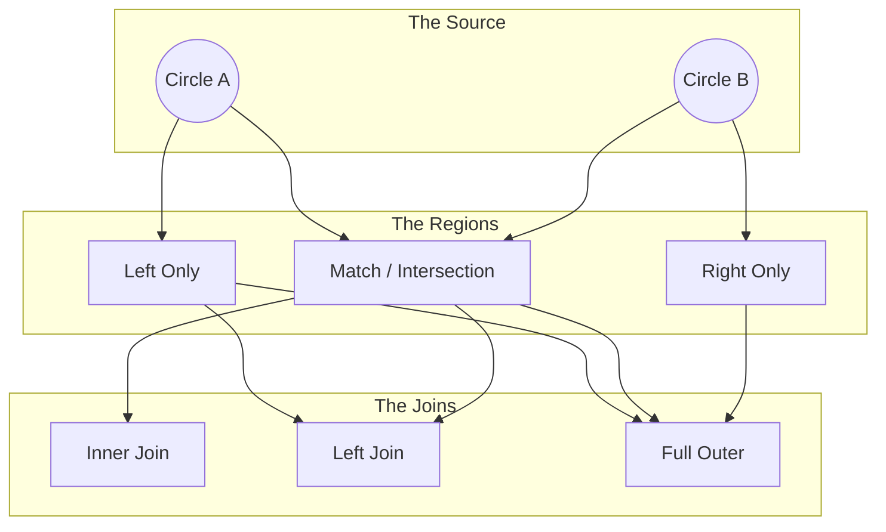
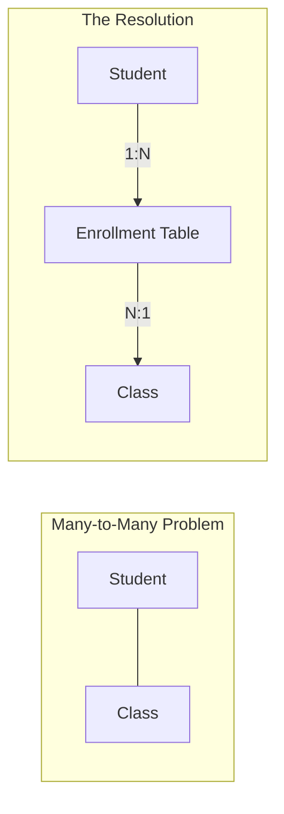

If you Google "SQL Joins," you will inevitably find an image of two overlapping circles. It is the coat of arms of the data engineer. We put it on mugs, t-shirts, and PowerPoint slides.

But here is the truth: those circles (Venn Diagrams) are a bit of a lie.

They are a useful lie, certainly. They are fantastic for understanding *which* rows we keep and which ones we throw away. But they are terrible at showing what happens to the data *inside* the rows (like the row explosion we saw in the previous module).

However, before we deconstruct the lie, we must master it. In this module, we are going to take the set theory operations we've learned—Union, Intersection, Difference—and map them directly to the visual language of the database join.

## 9.1 Advanced Venn Diagrams
Imagine two circles floating in the white void of a whiteboard.

- **Circle A (Left)**: The `Orders` table.
- **Circle B (Right)**: The `Customers` table.

They overlap in the middle. This overlap represents the data that "agrees"—Orders that have valid Customers, and Customers that have placed Orders.

This simple drawing creates three distinct regions.

1. **The Left Crescent ($A - B$)**: Orders without Customers (Orphans).
2. **The Middle Football ($A \cap B$)**: Valid matches.
3. **The Right Crescent ($B - A$)**: Customers without Orders (window shoppers).

Every join type is just a specific combination of these three regions.

### The Inner Join (The Intersection)
This is the most restrictive relationship. It is the rigorous bouncer.

- **Regions**: Region 2 only.
- **Math**: $A \cap B$
- **Logic**: "I only want records that are complete. If you are an Order without a Customer, get out. If you are a Customer who hasn't bought anything, get out."

In a data pipeline, the Inner Join is safe but dangerous. It is safe because you never have missing values (NULLs). It is dangerous because it silently drops data. If 10% of your orders have a typo in the customer ID, an Inner Join will just… make them vanish. You won't see an error; your revenue report will just be 10% lower than reality.

### The Left Join (The Preserver)
This is the bread and butter of data engineering.

- **Regions**: Region 1 + Region 2.
- **Math**: $(A - B) \cup (A \cap B)$… which simplifies to just $A$.
- **Logic**: "I care about Orders (Set A). I want to see *all* my orders. If an order matches a customer, show me the customer's details. If it doesn't match, keep the order anyway and just leave the customer fields blank."

This is where the Venn Diagram analogy gets a little weak. In a pure set diagram, the "left crescent" $(A - B)$ is just the stuff in A. But in a database, when we retrieve records from that crescent, we still need to fill in the columns for Table B.

Since there is no data there, the database fills that space with NULLs.

!!! note "The Null Shadow"

    A Left Join projects a "shadow" of Table B. Where the data exists, you see it. Where it doesn't, you see the NULL silhouette.

### The Right Join (The Contrarian)
- **Regions**: Region 2 + Region 3.
- **Math**: $(B - A) \cup (A \cap B)$… which simplifies to just $B$.
- **Logic**: "I care about Customers (Set B). Show me **all** customers, and attach their orders if they have any."

I will be honest with you. **You will seldom see a Right Join in product code**. Why? Because English reads from Left to Right. It is cognitively easier to think, "Take this table, and attach that table to it," rather than, "Take this table, and attach it to the one I mentioned previously."

A Right Join is functionally identical to a Left Join; the tables are just swapped. `A RIGHT JOIN B` is the same as `B LEFT JOIN A`. Do yourself a favor: just use Left Join.

### The Full Outer Join (The Union)
- **Regions**: Region 1 + Region 2 + Region 3.
- **Math**: $A \cup B$ (Conceptually, though implemented via matching).
- **Logic**: "I want everything. Don't throw anything away. If they match, connect them. If $A$ is alone, keep $A$ (with NULLs for $B$). If $B$ is alone, keep $B$ (with NULLs for $A$)."

This is the **Symmetric Difference** plus the **intersection**. It is the widest possible net you can cast without doing a Cartesian Product. It is rarely used for analysis but essential for *auditing*—when you need to see exactly how two systems differ.

### Visualizing the Flow
Let's look at how data actually moves through these shapes.

### The Limits of a Circle
I mentioned earlier that Venn Diagrams are a lie. Here is why.

A Venn Diagram shows relationships between **Sets** of unique items.

- Alice is in Set A.
- Alice is in Set B.
- Therefore, Alice is in the intersection. Simple.

But databases contain **Bags** (Multisets).
- Alice is in the `Customers` table (1 row).
- Alice is in the `Orders` table (50 rows).

When you join them, the Venn Diagram suggests you just get "The Intersection." It looks like a small, tidy overlap. In reality, Alice's single row in Customer explodes into 50 rows in the result.

The Venn Diagram captures the **logic** of inclusion (who gets to stay?) but fails to capture the **cardinality** of the result (how many rows do we get?).

To understand that, we need to leave the circles behind and talk about the most critical concept in data modeling: **Relationship Ratios**.

## 9.2 Cardinality Ratios
We ended the last section by accusing Venn Diagrams of lying. They lie because they are flat. They show a binary state: either you are in the set, or you are out.

But in data engineering, "being in the set" is only half the story. The other half is: **How many copies of you are there?**

This is the domain of **Cardinality Ratios**. It sounds like highbrow academic jargon, but it's actually just counting. It describes how the rows in Table A relate to the rows in Table B. Understanding this is the difference between a query that runs in 2 seconds and a query that crashes the dashboard.

There are three main species of relationships you will encounter in the wild.

### 1. One-to-One (1:1)
This is the unicorn. It is rare, beautiful, and incredibly safe.

In a 1:1 relationship, a row in Table A matches one row in Table B, and a row in Table B matches one row in Table A.

**The Analogy**: Social Security Numbers. A Person and their Social Security Number. One person has one number; one number belongs to one person.

**The Engineering Reality**: Why would you split data into two tables if they are 1:1? Why not just put it all in one big row? Usually for **security** or **performance**.

- **Table A (Users)**: `username`, `email`, `last_login`. (Public-ish stuff, accessed frequently).
- **Table B (UserSecrets)**: `password_hash`, `salt`, `2fa_key`. (Sensitive stuff, locked down).

When you join these two tables, the row count does not change.

$$
\lvert A \bowtie B \rvert = \lvert A \rvert
$$

The "Grain" of the data remains the same. This is the only join that doesn't change the shape of your dataset.

## 2. One-to-Many (1:N)
This is the workhorse. 90% of the joins you write will be of this variety.

Here, a single row in Table A (the "One" side) is linked to multiple rows in Table B (the "Many" side). However, the reverse is not true: a row in Table B links back to only one parent in Table A.

**The Analogy**: Parents and children.

- A mother can have many biological children.
- A child has only one biological mother.

**The Data Example**: `Customers` (one) and `Orders` (many).

- Customer #505 (Alice) places an order on Tuesday.
- Customer #505 (Alice) places an order on Friday.

**The Effect on Data (The Fan-Out)**: This is where the "Explosion" begins to creep in. When you join `Customers` to `Orders`, the result set takes on the size of the **many** side. Alice was in 1 row. Now she is 2 rows.

If you aren't careful, this can distort your math. If Alice has a column `Annual_Income` ($100,000) in the Customers table, and you join it to her 2 orders, that income appears on both rows. If you carelessly `SUM(Annual_income)`, you will think Alice makes $200,000. We call this Fan-Out Duplication, and it is the nemesis of accurate reporting.

### 3. Many-to-Many (M:N)
This is the chaos zone.

A row in Table A matches many rows in Table B, *AND* a row in Table B matches many rows in Table A.

**The Analogy**: Students and classes.

- Student "Bob" takes "Math" and "History."
- The "Math" class contains "Bob" and "Alice."

If you try to draw this with straight lines, it looks like a plate of spaghetti.

**The Effect on Data**: This is effectively a controlled Cartesian Product. If Bob takes 5 classes, and the Math class has 30 students, asking "Show me all connections" generates a massive web of relationships.

**The Engineering Fix - The Junction Table**: Relational databases actually hate Many-to-Many relationships. They are messy. So, we "resolve" them by cheating. We create a third table in the middle—a **Junction Table** (or Bridge Table).

Instead of joining Students directly to Classes, we create a table called `Enrollments`.

- Student (1) <--> (N) Enrollment (N) <---> (1) Classes

We turn one big, messy M:N relationship into two clean, manageable 1:N relationships.

### The "Fan Trap" (The Danger Zone)
Here is the final warning before we move on. The most dangerous query a data engineer can writ eis joining two different 1:N relationships to the same root table at the same time.

Imagine:

1. Customers (1) -> (N) Orders
2. Customers (1) -> (N) Support_Tickets

Alice has 3 Orders. Alice has 2 Support Tickets. You want a report showing her orders and her tickets. You join `Customers` -> `Orders` -> `Tickets`.

What happens?

$$
3 \text{ Orders } \times 2 \text{ Tickets } = 6 \text{ Rows}
$$

The database doesn't know how to line them up (Order A to Ticket A?). So it creates a mini Cartesian Product for Alice. Every order gets paired with every ticket. Your data is now garbage. You have multiplied her orders by her complaints.

!!! danger "The Rule of the Grain"

    Never join two "Many" tables to the same "One" table in a single query level unless you know exactly what you are doing. Aggregate one of them first.

## Quiz

<quiz>
Which set operation corresponds to an INNER JOIN between Table A and Table B?
- [ ] Union ($A \cup B$)
- [ ] Cartesian Product ($A \times B$)
- [ ] Difference ($A - B$)
- [x] Intersection ($A \cap B$)

</quiz>

<quiz>
Why is the Venn Diagram considered a 'useful lie' when representing SQL joins?
- [x] It represents relationships between Sets (unique items), but databases deal with Bags (Multisets) where row counts matter.
- [ ] It implies that NULL values are included in the intersection.
- [ ] It cannot depict an inner join.
- [ ] Venn Diagrams are only for mathematics and cannot apply to data.

</quiz>

<quiz>
In a LEFT JOIN where a row in Table A has no match in Table B, what happens to the columns from Table B?
- [ ] The row is discarded entirely.
- [ ] They are filled with default values like 0 or empty strings.
- [ ] The query returns an error.
- [x] They are filled with NULL values.

</quiz>

<quiz>
What is the primary reason Data Engineers avoid using RIGHT JOINS in product code?
- [x] Cognitive load: It breaks the natural left-to-right reading flow of the code.
- [ ] Compatibility: Many databases do not support Right Joins.
- [ ] Performance: Right Joins are significantly slower than Left Joins.
- [ ] Logic: Right Joins cannot handle NULL values.

</quiz>

<quiz>
Which join type is equivalent to the Set Theory operation ($A \cup B$) (Union of all participating keys)?
- [ ] LEFT JOIN
- [x] FULL OUTER JOIN
- [ ] INNER JOIN
- [ ] CROSS JOIN

</quiz>

<quiz>
In a One-to-Many (1:N) relationship between Customers (1) and Orders (N), what happens to the Customer data when joined to Orders?
- [x] Fan-out: The Customer data is duplicated for every matching Order.
- [ ] Explosion: The database creates a Cartesian Product.
- [ ] Aggregation: The Customer data is summarized into a single row.
- [ ] Loss: The Customer data is discarded to make room for Orders.

</quiz>

<quiz>
What is the standard engineering solution for resolving a Many-to-Many (M:N) relationship?
- [ ] Store the related IDs as a comma-separated string in one column.
- [ ] Use a CROSS JOIN to generate all combinations.
- [ ] Delete duplicates from one of the tables.
- [x] Create a Junction (bridge) Table to break it into two 1:N relationships.

</quiz>

<quiz>
What is the 'Fan Trap'?
- [ ] A circular dependency where Table A points to Table B and Table B points to Table A.
- [ ] Using a Left Join when an inner join was intended.
- [ ] Joining a table to itself without an alias.
- [x] Joining two different 'Many' tables to the same 'One' table in a single query, causing an explosion of rows.

</quiz>

<quiz>
Which relationship type does NOT change the row count of the primary table when joined?
- [x] One-to-One (1:1)
- [ ] One-to-Many (1:N)
- [ ] Cartesian Product
- [ ] Many-to-Many (M:N)

</quiz>

<quiz>
If you perform a FULL OUTER JOIN and filter the rows where `A.id IS NULL`, what are you looking for?
- [ ] The intersection ($A \cap B$)
- [ ] The Cartesian Product
- [x] Records unique to Table B ($B - A$).
- [ ] Records unique to Table A ($A - B$).

</quiz>

<!-- mkdocs-quiz results -->