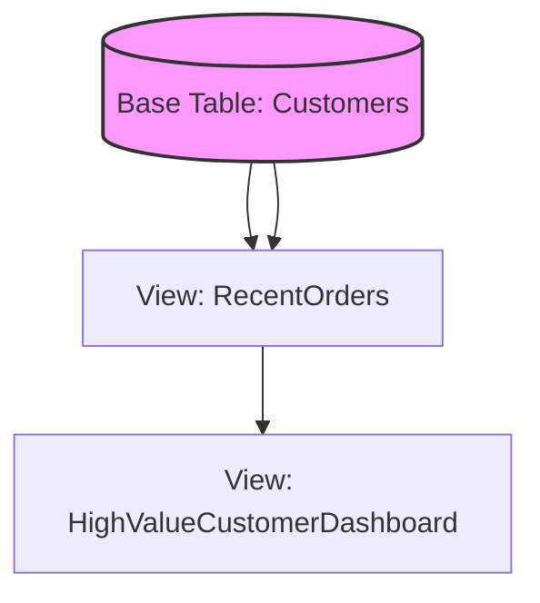

In the previous chapters, we've spent a lot of time perfecting complex queries. We've joined multiple tables, aggregated data, and filtered through noise to find exactly what we need. But typing a 50-line `SELECT` statement every time you want to see "Monthly Sales by Region" is a recipe for carpal tunnel and syntax errors.

In this chapter, we explore **views**. Think of a view as a stored query that you can treat **like** a table. It doesn't store the data itself; it stores the *logic* to retrieve it. When you query a view, the database engine essentially "pastes" your stored query into the new one and runs it on the fly.

## 10.1 Creating Views
The syntax for creating a view is refreshingly simple. You take a query that works and wrap it in a `CREATE VIEW` statement.

```sql
CREATE VIEW view_name AS
SELECT column1, column2
FROM table_name
WHERE conditions;
```

### The "Virtual Table" Mental Model
Imagine you have a massive `employees` table with sensitive columns like `social_security_number` and `salary`. You want the marketing team to be able to see names and departments, but nothing else.

Instead of giving them access to the base table, you create a view:

```sql
CREATE VIEW public_staff_directory AS
SELECT first_name, last_name, department
FROM employees
WHERe status = 'Active';
```

Now, the marketing team can simply run: `SELECT * FROM public_staff_directory;`.

!!! note "Performance Check"

    Because a view is just a stored query, it doesn't take up extra disk space for data. However, every time you call the view, the database has to run the underlying query. If your view involves a 10-way join on millions of rows, it will be just as slow as the raw SQL.

## 10.2 Modifying Views
Requirements change. Maybe the marketing team realized they also need the `email` column in their directory. You have two primary ways to change a view.

### The "Replace" Pattern
Most SQL dialects (PostgreSQL, MySQL, SQL Server) support the `OR REPLACE` syntax. This allows you to update the view definition without dropping it first, which preserves any permissions you've granted on that view.

```sql
CREATE OR REPLACE VIEW public_staff_directory AS
SELECT first_name, last_name, department, email
FROM employees
WHERE status = 'Active';
```

### The "Alter" Pattern
Some systems use `ALTER VIEW`, though it is often more limited in what it can change (sometimes just metadata or specific settings).

!!! warning "Schema Stability"

    If you change the underlying table, (you rename the column `first_name` to `given_name`) the view will break. The view "remembers" the column names as they were when it was created. Always test your views after a schema migration!

### Updatable Views
Can you `INSERT` or `UPDATE` data *through* a view? **The Short Answer**: Sometimes. **The Long Answer**: For a view to be updatable, it usually must map directly to a single table without any "disturbing" SQL features like `GROUP BY`, `DISTINCT`, or `JOIN`. If the database can't figure out exactly which row in the base table your change belongs to, it will throw an error.

## 10.3 Dropping Views
When a view has outlived its usefulness, or you're refactoring  your database architecture, you remove it with the `DROP` command.

```sql
DROP VIEW public_staff_directory;
```

### Dependency Hell
Before you drop a view, you need to know if other views depend on it. Yes, you can build a view based on *another* view! This creates a dependency chain.



If you try to drop `RecentOrders` while `HighValueCustomerDashboard` still exists, some databases will stop you (RESTRICT), while others might let you do it and leave the second view in a "broken" state.

!!! abstract 

    Use views to create a "Public API" for your database. If your underlying table structure needs to change (e.g., splitting one table into two for normalization), you can often update the view definition to point to the new tables. The users of the view won't even notice the underlying "plumbing" changed.

## Quiz

<quiz>
Which of the following best describes what happens when you query a view?
- [ ] The database retrieves pre-calculated data stored in the view's internal table.
- [x] The database executes the stored query logic against the base tables in real-time.
- [ ] The database redirects the user to the original table and ignores any filters in the view.
- [ ] THe database creates a temporary physical table that is deleted after the query finishes.

</quiz>

<quiz>
Creating a view significantly increases the disk space usage of your database because it duplicates the data from the base tables.
- [ ] True
- [x] False

</quiz>

<quiz>
If you need to update the definition of a view to include an extra column without losing existing permissions, which command is most appropriate?
- [ ] `UPDATE VIEW view_name SET logic = ...`
- [ ] `DROP VIEW view_name; CREATE VIEW view_name ...`
- [ ] `ALTER TABLE view_name ADD COLUMN ...`
- [x] `CREATE OR REPLACE VIEW view_name AS ...`

</quiz>

<quiz>
Which of the following scenarios would likely prevent a view from being 'Updatable' (allowing INSERT/UPDATE through the view)?
- [ ] The view renames a column using an alias.
- [ ] The view uses a `WHERE` clause to filter rows.
- [ ] The view selects all columns from a single table.
- [x] The view includes a `GROUP BY` clause to aggregate data.

</quiz>

<quiz>
What happens if you rename a column in a base table that is currently being used by a view?
- [ ] The column name in the view remains the same, but it pulls data from the new column name automatically.
- [ ] The database prevents you from renaming the column until the view is dropped.
- [ ] The view automatically updates its internal logic to use the new name.
- [x] The view will fail/break the next time it is queried.

</quiz>

<quiz>
What is a "Dependency Chain" in the context of views?
- [ ] The primary key relationship between two base tables.
- [x] A situation where one view is defined using the output of another view.
- [ ] The list of users who have permission to see the view.
- [ ] The order in which rows are sorted with the view.

</quiz>

<quiz>
Which command would you use to completely remove a view named 'sales_summary' from the database?
- [ ] `TRUNCATE VIEW sales_summary;`
- [x] `DROP VIEW sales_summary;`
- [ ] `DELETE VIEW sales_summary;`
- [ ] `REMOVE VIEW sales_summary;`

</quiz>

<quiz>
A view can combine data from multiple tables using JOINs.
- [x] True
- [ ] False

</quiz>

<quiz>
If you query a view that is based on a query with a 10-way join on millions of rows, the performance will be:
- [x] Roughly the same as running the underlying raw SQL query.
- [ ] Slower because the database has to translate the view into SQL first.
- [ ] Much faster than running the raw SQL because the view is pre-compiled.
- [ ] Instantly fast because views store the results in memory.

</quiz>

<!-- mkdocs-quiz results -->

## Summary
In this chapter, we explored **views**, the database's way of providing a "virtual" window into your data. Rather than duplicating rows and wasting disk space, a view saves a query definition and allows you to treat that logic as if it were a standard table.

## Lab
Please complete Chapter 10 labs from the companion [GitHub Repository](https://github.com/mckenzie-andrew/odea-labs){target="_blank"}. 