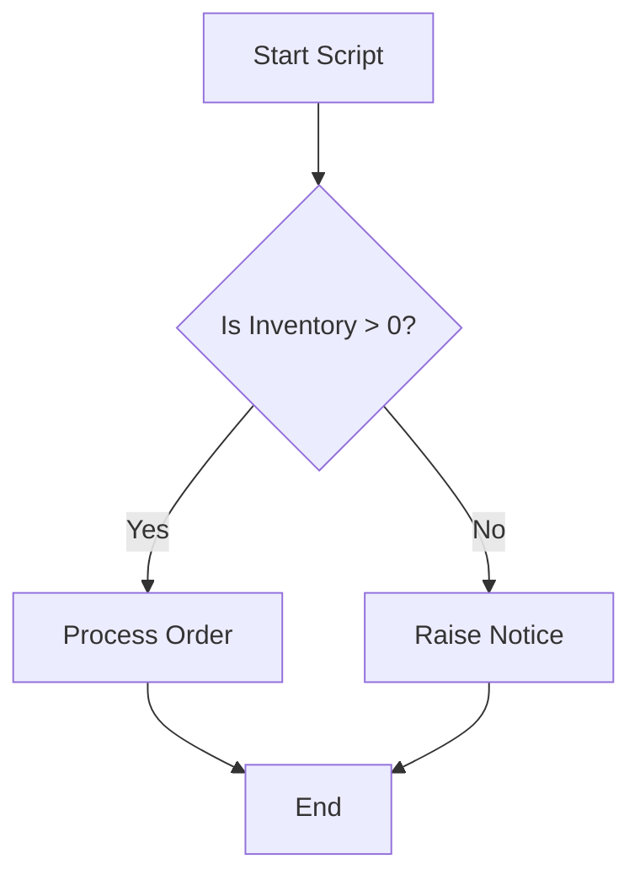

If you look back at everything we've done so far, we have been treating the database like a very fancy calculator. We type a command, and it gives us  an answer. One input, one output.

But real-world problems are rarely that linear. Real-world problems involve **decisions**.

- "If the user is a VIP, give them a discount. Otherwise, charge full price."
- "If the inventory is empty, stop the order. Otherwise, process it."

To handle this, we need to stop writing "statements" and start writing **scripts**. We are crossing the bridge from "querying" to "programming".

## 11.1 Variables and Logic (`IF`/`ELSE`)
In algebra, you learned that `x = 5`. In SQL, we have the same concept. A **variable** is a temporary placeholder (a labeled bucket) where we can store a value to use later.

!!! info "Context: The Dialect Divide"

    This is where SQL engines really start to differentiate from each other. For this entire  module we will be focused purely on Postgres syntax, as that is what we use in our labs. Postgres syntax is specifically called **PL/pgSQL (Procedural Language/PostgreSQL)**.

### The Wrapper: The `DO` Block
In some databases (like SQL Server), you can just type variables and logic anywhere. PostgreSQL is much more structured. It requires you to wrap your procedural code inside a specific container called an **anonymous code block**.

Think of this block as a sealed envelope. Inside the envelope, you can use variables, loops, and logic. Outside the envelope, you can only run standard queries.

Here is a skeleton of a Postgres script:

```sql
DO $$
DECLARE
    -- 1. Variables go here
BEGIN
    -- 2. Logic goes here
END $$
```

!!! example "Mnemonic: The Southern Dialect"

    You have almost certainly watched at least one film that took place in the early American South. In those movies they often started their statements with, "I do declare ...", before they actually declared anything. Since the syntax for the `DO` block is a little different from what we are used to, so far, this little aside may help you remember now (at least the first part).

Let's decode the strange symbols:

1. `DO`: This command tells Postgres, "I am about to give you a procedural script to execute once."
2. `$$`: These represent quotes. In Postgres, `$$` is a safe way to start and end a string that contains code. It tells the parser, "Everything between these double-dollar signs is my script."
3. `DECLARE`: This is where we announce our variables.
4. `BEGIN ... END`: This marks the start and finish of the actual logic.

### The Container: Variables
A **variable** is a temporary placeholder, a labeled bucket, where we can store a value to use later.

In PL/pgSQL, variables are strictly typed (just like your table columns) and  must be declared before you use them.

**Declaring and Assigning**

To put a value into a variable, we use the assignment operator `:=` (Note the colon! It's not just `=`).

```sql
DO $$
DECLARE
    current_price DECIMAL(10, 2) := 19.99; -- Declare and initialize
    tax_rate DECIMAL(10, 2) := 0.06;
    final_price DECIMAL(10, 2); -- Empty bucket. Declared but not initialized
BEGIN
    -- Calculate and assign using :=
    final_price := current_price * (1 + tax_rate);

    -- Print the result to the "Messages" tab
    RAISE NOTICE 'The final price is %', final_price;
END $$
```

**New Keywords**:

- `:=`: The assignment operator. It moves data from right to left.
- `RAISE NOTICE`: This is Postgres's version of `print()`. It sends text to the output window.
- `%`: This is a placeholder. Postgres swaps the `%` with the value of `final_price` (the value after the comma).

### Populating Variables from Data (`SELECT .. INTO`)
You don't always set variables to static numbers. Usually, you pluck a value from a table and hold onto it.

In standard SQL, you assume a `SELECT` statement returns a grid of results. But inside a code block, a variable can only hold **one value**. We use the `INTO` keyword to pour the result of a query directly into a variable.

```sql
DO $$
DECLARE
    boss_id INT;
BEGIN
    -- Find Alice's ID and put it INTO the variable
    SELECT employee_id INTO boss_id
    FROM employees
    WHERE name = 'Alice';

    RAISE NOTICE 'Alice has ID: %', boss_id;
END $$;
```

!!! warning "The Strictness Trap"

    The query used with `SELECT ... INTO` must return **exactly one row**.

    - If it returns **zero rows**, the variable becomes `NULL`.
    - If it returns **multiple rows**, Postgres throws an error: `query returned more than one row`.

### The Decision: `IF`/`ELSE`
Now that we have variables, we can make decisions based on them. This is the **control flow**.

The syntax in Postgres is `IF`, `THEN`, `ELSE`, `END IF;`.



Let's write a script that checks stock before trying to sell an item.

```sql
DO $$
DECLARE
    wanted_item_id INT := 1;
    stock_count INT;
BEGIN
    -- 1. Check the inventory
    SELECT quantity INTO stock_count
    FROM inventory
    WHERE item_id = wanted_item_id;

    -- 2. The decision logic
    IF stock_count > 0 THEN
        -- The Happy Path: We have stock!
        RAISE NOTICE 'Item is available (Qty: %). Processing sale...', stock_count;

        UPDATE inventory
        SET quantity = quantity - 1
        WHERE item_id = wanted_item_id;
    
    ELSE
        -- The Sad Path: Out of Stock
        RAISE NOTICE 'Error: Item % is out of stock.', wanted_item_id;
    END IF; -- Don't forget the semicolon!
END $$
```

**Key Syntax Elements**:

1. `IF (Condition) THEN`: You must include the word `THEN`.
2. `END IF;`: Postgres requires you to explicitly close the IF block. This is distinct from the `END` of the main block.
3. **Scope**: The `stock_count` variable only exists inside the `DO` block. Once the script finishes, the variable evaporates.


### The "Choose Your Own Adventure" (`ELSIF`)
Life is rarely binary. It's not just "stock" or "no stock". Occasionally it's "In Stock", "Low Stock", or "Discontinued".

If you need to check multiple specific conditions, avoid nesting giant stacks of `IF..ELSE IF...`. Instead, use the `ELSIF` keyword.

!!! warning "Syntax Trap: ELSIF"

    It is spelled `ELSIF`. There is no "E" in the middle. It is not `ELSEIF`. If you type `ELSEIF`, Postgres will look at you with confusion and throw a syntax error.

```sql
DO $$
DECLARE
    stock_cont INT := 5;
BEGIN
    IF stock_count > 20 THEN
        RAISE NOTICE 'Inventory is healthy.';
    
    ELSIF stock_count > 0 THEN
        RAIsE NOTICE 'Warning: Stock is low! Order more soon.';
    
    ELSE
        RAISE NOTICE 'Critical! Out of stock.';
    END IF;
END $$;
```

### Complexity: `FOUND` Variable
A very common pattern is checking if a row simply exists. Postgres provides a special, magical boolean variable called `FOUND` that is automatically set to true or false after any `SELECT INTO`, `UPDATE`, or `DELETE` statement.

```sql
DO $$
DECLARE
    employee_salary DECIMAL;
BEGIN
    -- Try to find a non-existent employee
    SELECT salary INTO employee_salary
    FROM employees
    WHERE employee_id = 9999;

    -- Check the magical "FOUND" variable
    IF NOT FOUND THEN
        RAISE NOTICE 'Employee 9999 does not exist!';
    ELSE
        RAISE NOTICE 'Employee found with salary %.', employee_salary;
    END IF
END $$;
```

This is clearer than writing separate `COUNT(*)` queries to check for existence.

### The Phantom Query: `PERFORM`
In PL/pgSQL, every `SELECT` statement must have a destination. You cannot just write `SELECT * FROM employees` inside a block; the database weill cream, "And put the data *where*, exactly?"

But what if you don't care about the data? What if you just want to check if a row exists, or run a function that has no side effects (like `calculate_tax()`) without storing the result?

We use the keyword `PERFORM`. It runs a query, sets the `FOUND` variable, and then immediately throws the data away.

```sql
DO $$
BEGIN
    -- We don't need the employee's name or salary.
    -- We just want to poke the table to see if ID 999 is there.
    PERFORM 1
    FROM employees
    WHERE employee_id = 999;

    -- Check the magical FOUND variable
    IF FOUND THEN
        RAISE NOTICE 'Employee 999 exists.';
    ELSE
        RAISE NOTICE 'Employee 999 is a ghost.';
    END IF;
END $$;
``` 

## 11.2 Stored Procedures & Functions
We have a problem with our `DO $$` blocks.

They are **ephemeral**. They are like writing a grocery list on the back of an envelope, useful for one trip, but then it goes in the trash. If you want to run the logic again tomorrow, you have to rewrite it.

We need to formalize this. We need to take that logic, laminate it, and file it permanently inside the database so anyone can use it.

In PostgreSQL, we have two ways to do this: **functions** and **procedures**.

### The Evolution: From `DO` to `CREATE`
Think of a stored object as a "named `DO` block" that accepts inputs.

To save our logic, we literally wrap the `DO` block in a `CREATE` header.

**1. The Function (The Calculator)**

For most of PostgreSQL's history, **functions** were the only game in town. If you wanted to run logic, you wrote a function.

Functions are designed to **compute and return a value**. They are polite; they do their math and hand you back an answer.

Let's create a function that calculates tax.

```sql
-- The heaer
CREATE OR REPLACE FUNCTION calculate_tax(price DECIMAL, tax_rate DECIMAL)
RETURNS DECIMAL AS $$

-- The Body (Look familiar?)
DECLARE
    final_amount DECIMAL;
BEGIN
    final_amount := price * (1 + tax_rate);
    RETURN final_amount; -- Send the result back.
END;

-- The Footer
$$ LANGUAGE plpgsql;
```

**Deconstructing the Header**:

1. `CREATE OR REPLACE`: "Create this new tool. If it already exists, just update the definition."
2. `FUNCTION calculate_tax(...)`: We give it a name and define the **parameters** (inputs). `price` and `tax_rate` act as variables that are pre-filled by the user.
3. `RETURNING DECIMAL`:  You *must* tell Postgres what shape the answer will take.
4. `$$ ... $$`: The same safety quotes we used in the `DO` block.
5. `LANGUAGE plpgsql`: We explicitly tell the database, "This is written in the procedural language, not standard SQL or Python."

**How to use it**: Because it returns a value, you use it inside a `SELECT` statement, just like built-in math functions.

```sql
SELECT calculate_tax(100.00, 0.05);
-- Result 105.00
```

**Level Up: Returning Entire Sets (`RETURN QUERY`)**
So far, our functions have been scalar, they return a single number or string. But functions can also be **table generators**.

Imagine you have a complex query that filters orders, joins three tables, and calculates tax. You want to reuse this logic, but with different date ranges. You essentially want a "view with parameters". That is why these are called **parameterized views**.

We do this by declaring `RETURNS TABLE` in the header and using `RETURN QUERY` in the body.

```sql
-- 1. Define the output shape (the columns our function will produce)
CREATE OR REPLACE FUNCTION get_vip_orders(min_spent DECIMAL)
RETURNS TABLE (
    order_id INT,
    customer_name VARCHAR,
    total_amount DECIMAL
) AS $$
BEGIN
    -- 2. Pour the results of a query directly into the output
    RETURN QUERY
    SELECT
        o.id,
        o.name,
        o.total
    FROM orders AS o
    JOiN customers AS c
    ON o.customer_id = c.id
    WHERE o.total > min_spent;
END;
$$ LANGUAGE plpgsql;
```

Because this function returns a table, you treat it *exactly* like a table in your `FROM` clause!

```sql
SELECT * FROM get_vip_orders(500.00)
WHERE customer_name LIKE 'A$';
```

This is incredibly powerful. It allows you to encapsulate complex reporting logic behind a simple function call.

**2. The Procedure (The Task Master)**

Functions are great, but they have a fatal flaw: **they cannot manage transactions**.

Because a function runs *inside* a `SELECT` statement, it isn't allowed to stop the world and say `COMMIT` or `ROLLBACK`. It is trapped inside the query's transactions.

Enter **stored procedures**.

Introduced in PostgreSQL 11, procedures are designed for **actions**, not calculations. They don't (usually) return data. They *do* things. And crucially, **they can handle transactions**.

Let's write a procedure to archive old orders. This is a heavy operation, so we might want to commit halfway through to save progress.

```sql
CREATE OR REPLACE PROCEDURE archive_old_orders(cutoff_date DATE)
LANGUAGE plpgsql
AS $$
BEGIN
    -- Step 1: Move data to the archive table
    INSERT INTO orders_archive
    SELECT * FROM orders
    WHERE order_date < cutoff_date;

    -- Step 2: Save our progress! (Functions cant do this)
    COMMIT;

    -- Step 3: Delete from the main table
    DELETE FROM orders
    WHERE order_date < cutoff_date;

    -- Step 4: Final save
    COMMIT;
END;
$$;
```

**Key Difference in Syntax**:

1. `PROCEDURE` instead of `FUNCTION`.
2. No `RETURNS` clause. Procedures are for doing, not answering.
3. **Transaction Control**: We can freely use `COMMIT` inside.

**How to use it**: You cannot `SELECT` a procedure. You must `CALL` it:

```sql
CALL archive_old_orders('2023-01-01');
```

### Which One Should You Use?

- **Use a Function** if you need to transform data, "Take this messy string and clean it up," or "Calculate the business days between these two dates."
- **Use a Procedure** if you are performing a process, "Run the end-of-month cleanup," or "Transfer funds between accounts."

## 11.3 Dynamic SQL
We have reached the edge of the map.

Everything we have written so far is **static SQL**. When we wrote `SELECT * FROM inventory`, the database knew exactly what table we were talking about before we even clicked "Run". The plan was fixed.

But what if you don't know the table name yet?

Imagine you are building a dashboard tool. The user selects a table from a dropdown menu ('Inventory', 'Employees', or 'Sales'), and you need to write a function that counts the rows in *whatever* table they picked.

You might try this using what we learned in 11.2:
```sql
-- > WARNING: THIS WILL NOT WORK
CREATE FUNCTION count_rows(table_name TEXT) RETURNS INT AS $$
DECLARE
    row_count INT;
BEGIN
    -- The Parser will panic here. It doesn't know what "table_name" is.
    SELECT COUNT(*) INTO row_count FROM table_name;
    RETURN row_count;
END;
$$ LANGUAGE plpgsql;
```

**The Error**: `relation "table_name" does not exist`.

**The Reason**: SQL is strict. It needs to know the table names and column names *at compile time* (when it reads the script), *not at runtime* (when it runs the script). It cannot look inside the variable `table_name` to find the destination.

To solve this, we must turn to the Dark Arts: **dynamic SQL**.

### The Concept: Code Writing Code
Dynamic SQL is the act of constructing a SQL command as a text string inside your program and then asking the database to execute that string.

It's a two step-process:

1. **Construct**: You use string concatenation to glue the command together. `'SELECT * FROM'` + `'inventory'`.
2. **Execute**: You hand that string to the engine and say, "Treat this text as code."

In PostgreSQL, we use the command `EXECUTE`.

### A Working Example
Let's fix our row counter function using Dynamic SQL.

```sql
CREATE OR REPLACE FUNCTION count_rows(target_table TEXT)
RETURNS INT AS $$
DECLARE
    sql_command TEXT;
    result_value INT;
BEGIN
    -- Step 1: Build the query string.
    -- If target_table is 'employees', this becomes: "SELECT COUNT(*) FROM employees'
    sql_command := 'SELECT COUNT(*) FROM ' || target_table;

    -- Step 2: Run the string
    -- We use INTO to capture the result, just like a static query.
    EXECUTE sql_command INTO result_value;

    RETURN result_value;
END;
$$ LANGUAGE plpgsql;
```

Now, if you run `SELECT count_rows('inventory');`, the function builds the string `'SELECT COUNT(*) FROM inventory'`, executes it, and returns the count.

### The Danger Zone: SQL Injection
I cannot teach you Dynamic SQL without terrifying you about **SQL Injection**. It is the most common and devastating security vulnerability on the internet.

Dynamic SQL involves gluing strings together. What if the user is malicious?

Imagine a hacker calls your function not with `'inventory'`, but with the string: `'inventory; DROP TABLE inventory; --'`

Let's see what happens when our function glues that all together:
```sql
sql_command := 'SELECT COUNT(*) FROM ' || 'inventory; DROP TABLE inventory; --';
```

The resulting string becomes:
1. `SELECT COUNT(*) FROM inventory;` (Runs fine).
2. `DROP TABLE inventory;` (Destroys your table).
3. `--` (Comments out anything else).

The database executes both commands blindly. You have just been hacked.

!!! example "Analogy: The Teleprompter"

    Imagine a news anchor (the Database) who reads whatever is on the teleprompter. **Static SQL** is a script written by the producer. It's safe. **Dynamic SQL** allows the public to text a message to the teleprompter. if someone texts, "I quit!", the anchor will read "I quit!" on live TV because they are just following instructions. 

### The Shield: `format()` and `%I`
To use Dynamic SQL safely in Postgres, **never use simple string concatenation**.

Instead, use the `format()` function. It works like a template engine and automatically sanitizes inputs.

`format()` uses placeholders:
- `%I` **(Identifier)**: Use this for **table** or **column** names. It wraps them in double quotes safely.
- `%L` **(Literal)**: Use this for **data** values (like 'John', 15.50). It wraps them in single quotes safely.
- `%s` **(String)**: Raw string. **Avoid this** unless you know exactly what you are doing.

### The Secure Version
Let's rewrite our function to be hacker-proof.

```sql
CREATE OR REPLACE FUNCTION count_rows_safe(target_table TEXT)
RETURNS INT AS $$
DECLARE
    sql_command TEXT;
    result_value INT;
BEGIN
    -- Use format() with %I for the table name
    sql_command := format('SELECT COUNT(*) FROM %I', target_table);

    -- Debugging tip: Always print your dynamic SQL to check it!
    RAISE NOTICE 'Executing: %s', sql_command;

    EXECUTE sql_command INTO result_value;
    RETURN result_value;
END;
$$ LANGUAGE plpgsql;
```

If the hacker tries the same trick (`inventory; DROP ...`), `format()` will treat the *entire input* as a single table name. It looks for a table literally named `"inventory; DROP TABLE inventory; --"`.

The database will say: `Relation does not exist.` You are safe.

### When to use Dynamic SQL?
Dynamic SQL is complex, difficult to debug, and risky. You should only use it when static SQL physically cannot do the job.

**Common Use Cases**::

1. **Administrative Tools**: Functions that perform maintenance on all tables in a schema.
2. **Flexible Search**: Building a search query where the user can filter by any combination of 50 different criteria. You would rather not write one giant query with 50 `OR` statements; you build the `WHERE` clause dynamically based on what they selected.
3. **ETL Processes**: Importing data where the file names or target tables change daily.

## Quiz

<quiz>
In a Postgres PL/pgSQL block, which operator is strictly used to assign a value to a variable?
- [ ] `<-`
- [ ] `SET`
- [ ] `=`
- [x] `:=`

</quiz>

<quiz>
You need to run a maintenance script that deletes old data and commits the changes every 1,000 rows to avoid locking the table. Which object must you use?
- [ ] A view.
- [x] A stored procedure.
- [ ] A trigger.
- [ ] A user-defined function.

</quiz>

<quiz>
When using `SELECT ... INTO` to populate a variable, what happens if the query returns multiple rows?
- [x] Postgres throws a runtime error.
- [ ] It stores the last row returned.
- [ ] It creates an array variable automatically.
- [ ] It stores the first row and discards the rest.

</quiz>

<quiz>
Which special variable in PL/pgSQL is automatically set to TRUE or FALSE to indicate if the previous command affected any rows?
- [ ] `EXISTS`
- [ ] `STATUS`
- [ ] `@@ROWCOUNT`
- [x] `FOUND`

</quiz>

<quiz>
Why is the following Dynamic SQL snippet dangerous? `EXECUTE 'SELECT * FROM ' || user_input_table;`
- [x] It is vulnerable to SQL injection.
- [ ] Dynamic SQL is always slower than static SQL.
- [ ] It will fail if the table name contains numbers.
- [ ] It is a syntax error because `EXECUTE` requires parentheses.

</quiz>

<quiz>
When using the `format()` function for Dynamic SQL, which placeholder should be used for Table or Column names?
- [ ] `%T`
- [ ] `%L`
- [ ] `%s`
- [x] `%I`

</quiz>

<quiz>
How do you execute a PostgreSQL stored procedure named `process_end_of_day`?
- [ ] `SELECT process_end_of_day();`
- [ ] `RUN process_end_of_day;`
- [x] `CALL process_end_of_day();`
- [ ] `EXECUTE process_end_of_day;`

</quiz>

<quiz>
What is the purpose of the `$$` symbols enclosing the body of a function or procedure?
- [x] They act as "Dollar Quoting" to safely delimit the string body.
- [ ] They declare the variables used in the function.
- [ ] They perform an automatic `COMMIT` at the end.
- [ ] They signify that the function involves monetary calculations.

</quiz>

<quiz>
Which of the following scenarios requires Dynamic SQL?
- [ ] Writing a function that takes an Employee ID and returns their name.
- [ ] Inserting a new row into the inventory table.
- [ ] Calculating a value based on IF/ELSE logic.
- [x] Writing a function where the target table name is passed as a parameter.

</quiz>

<quiz>
In a `DO $$` block, where must you define your variables?
- [ ] Inside the `BEGIN` block, right before you use them.
- [x] In the `DECLARE` section, before the `BEGIN` keyword.
- [ ] After the `END` keyword.
- [ ] Inside the parentheses of the `DO` statement.

</quiz>

<!-- mkdocs-quiz results -->

## Lab
Please complete module 11's labs in the companion GitHub repository.

## Lab Solutions

!!! warning "Don't Cheat Yourself"

    Before viewing any of the solutions below, please ensure you have given the challenge an honest try. The worst thing you can do to yourself while learning is to not "accept the struggle." The struggle is what cements the information. Discovering the answer through trial and error is the only way to truly learn.

??? note "Challenge 1 Solution"

    ```sql
    DO $$
    BEGIN
        RAISE NOTICE 'Starting System Audit';
    END $$;
    ```

??? note "Challenge 2 Solution"

    ```sql
    DO $$
    DECLARE
        v_length INTEGER := 10;
        v_width INTEGER := 5;
        v_height INTEGER := 2;
        v_volume INTEGER;
    BEGIN
        v_volume := v_length * v_width * v_height;
        RAISE NOTICE 'Volume is %.', v_volume;
    END $$;
    ```

??? note "Challenge 3 Solution"

    ```sql
    DO $$
    DECLARE
        v_freight DECIMAL := 55.00;
    BEGIN
        IF v_freight > 50 THEN
            RAISE NOTICE 'High Cost';
        ELSE
            RAISE NOTICE 'Low Cost';
        END IF;
    END $$;
    ```

??? note "Challenge 4 Solution"

    ```sql
    DO $$
    DECLARE
        v_city VARCHAR(100);
    BEGIN
        SELECT customer_city INTO v_city
        FROM customers
        WHERE customer_id = '00012a2ce6f8dcda20d059ce98491703';

        RAISE NOTICE 'V_city is %', v_city;
    END $$;
    ```

??? note "Challenge 5 Solution"

    ```sql
    DO $$
    DECLARE
        maximum_price DECIMAL;
    BEGIN
        SELECT MAX(price) INTO maximum_price
        FROM order_items;

        IF maximum_price > 5000 THEN
            RAISE NOTICE 'Flag: Ultra High Value';
        ELSE
            RAISE NOTICE 'Normal Range';
        END IF;
    END $$;
    ```

??? note "Challenge 6 Solution"

    ```sql
    CREATE OR REPLACE FUNCTION calc_product_volume(l INTEGER, w INTEGER, h INTEGER)
    RETURNS INTEGER AS $$
    DECLARE
        volume INTEGER;
    BEGIN
        volume := l * w * h;
        RETURN volume;
    END;
    $$ LANGUAGE plpgsql;
    ```

??? note "Challenge 7 Solution"

    ```sql
    SELECT
        product_id,
        calc_product_volume(product_length_cm, product_width_cm, product_height_cm) AS vol_cm3
    FROM products
    ORDER BY vol_cm3 DESC
    LIMIT 5;
    ```

??? note "Challenge 8 Solution"

    ```sql
    CREATE OR REPLACE FUNCTION format_location(city VARCHAR, state VARCHAR)
    RETURNS VARCHAR AS $$
    BEGIN
        RETURN city || ' (' || state || ')';
    END;
    $$ LANGUAGE plpgsql;
    ```

??? note "Challenge 9 Solution"

    ```sql
    CREATE OR REPLACE FUNCTION shipping_speed_rating(purchased_at TIMESTAMP, delivered_carrier_at TIMESTAMP)
    RETURNS VARCHAR AS $$
    BEGIN
        IF (delivered_carrier_at - purchased_at) < INTERVAL '2 days' THEN
            RETURN 'Fast';
        ELSE
            RETURN 'Standard';
        END IF;
    END;
    $$ LANGUAGE plpgsql;
    ```

??? note "Challenge 10 Solution"

    ```sql
    CREATE OR REPLACE FUNCTION get_orders_by_status(status_name VARCHAR)
    RETURNS TABLE(order_id VARCHAR, order_purchase_timestamp TIMESTAMP) AS $$
    BEGIN
        RETURN QUERY
        SELECT 
            o.order_id,
            o.order_purchase_timestamp
        FROM orders AS o
        WHERE o.order_status = status_name;
    END;
    $$ LANGUAGE plpgsql;
    ```

??? note "Challenge 11 Solution"

    ```sql
    SELECT
        s.seller_state,
        AVG(oi.freight_value) AS avg_freight
    FROM sellers AS s
    JOIN order_items AS oi
    ON s.seller_Id = oi.seller_id
    GROUP BY s.seller_state
    ORDER BY s.seller_state ASC;
    ```

??? note "Challenge 12 Solution"

    ```sql
    SELECT
        p.product_id,
        oi.price
    FROM products p
    JOIN order_items oi
        ON p.product_id = oi.product_id
    WHERE
        p.product_category_name = 'telephony'
        AND oi.price > 500;
    ```

??? note "Challenge 13 Solution"

    ```sql
    CREATE OR REPLACE PROCEDURE add_seller_checked(s_id VARCHAR, s_zip VARCHAR, s_city VARCHAR, s_state VARCHAR)
    AS $$
    BEGIN
        IF s_state IS NULL THEN
            s_state := 'SP';
        END IF;

        INSERT INTO sellers (seller_id, seller_zip_code_prefix, seller_city, seller_state)
        VALUES (s_id, s_zip, s_city, s_state);
    END;
    $$ LANGUAGE plpgsql;
    ```

??? note "Challenge 14 Solution"

    ```sql
    CREATE OR REPLACE PROCEDURE safe_delete_order(target_order_id VARCHAR)
    AS $$
    DECLARE
        curr_status VARCHAR;
    BEGIN
        SELECT order_status INTO curr_status
        FROM orders
        WHERE order_id = target_order_id;

        IF current_status IS NOT NULL AND current_status = 'canceled' THEN
            DELETE FROM orders WHERE order_id = target_order_id;
            RAISE NOTICE 'Order deleted.';
        ELSE
            RAISE NOTICE 'Deletion aborted: Order is not canceled.';
        END IF;
    END;
    $$ LANGUAGE plpgsql;
    ```

??? note "Challenge 15 Solution"

    ```sql
    CREATE OR REPLACE PROCEDURE upsert_product_category(p_id VARCHAR, p_cat VARCHAR)
    AS $$
    BEGIN
        PERFORM 1
        FROM products
        WHERE product_id = p_id;

        IF NOT FOUND THEN
            INSERT INTO products (product_id, product_category_name)
            VALUES (p_id, p_cat);
        ELSE
            UPDATE products
            SET product_category_name = p_cat
            WHERE product_id = p_id;
        END IF;
    END;
    $$ LANGUAGE plpgsql;
    ```
