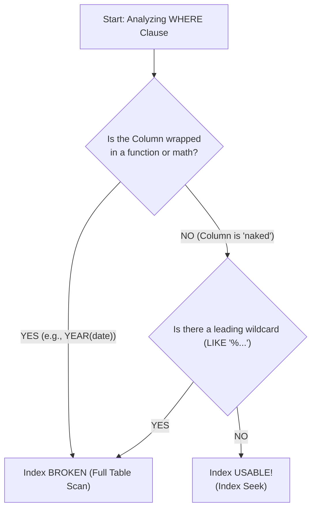
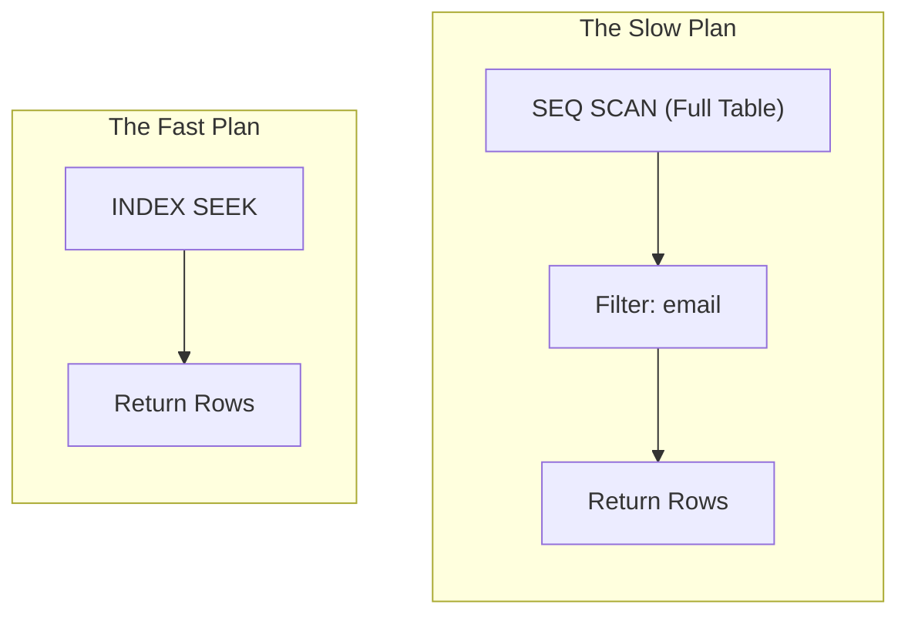

You have made it far. You can normalize data; you can retrieve it, join it, aggregate it, and even function it into submission. You are, for all intents and purposes, an SQL practitioner.

But there is one final frontier that separates the "I can get the data" crowd from the "I can get the data *before the user gets bored and leaves*" crowd.

That frontier is **performance**.

Up until now, we have treated the database like a magic black box. We type a request (`SELECT`), and the box hands us a result. We haven't cared *how* the box found that result, only that it was correct. But as your data grows from a few thousand rows to a few million, the "how" starts to matter a great deal.

## 12.1 Introduction to Indexes
Imagine I handed you a physical 1,000 page textbook on "The History of Juggling" and asked you to find every page that mentions "chainsaws".

If the book has no index in the back, what is your only strategy?

You have to open to page 1. You read it. Does it mention chainsaws? No. You turn to page 2. You read it. No. You keep doing this, page by page, until you hit page 1,000.

In database terminology, this is called a **full table scan**.

!!! info "Under the Hood: The Heap"

    By default, a database has no special organization for finding data inside a table. It just stores rows in the order you inserted them (mostly). When you run a query filtering on a column, the engine has no choice but to check every single row to see if it matches.

If you are looking for one specific row in a table of 10 million rows, a full table scan is a disaster. It's the computational equivalent of reading the entire Library of Congress just to find a copy of *Harry Potter*.

We need a shortcut. We require an **index**.

### The Anatomy of an Index
An index in a database is conceptually identical to the index at the back of a textbook. It is a separate data structure that stores just two things:

1. **The Key**: The value you are looking for (e.g., "Chainsaws").
2. **The Pointer**: Where to find the actual data (e.g., "Page 42, 87, and 105").

If I ask you to find "chainsaws" now, you flip to the back, find "C", find "chainsaws", and you know exactly which three pages to visit. You skipped 997 pages of reading.

### The B-Tree (Balanced Tree)
Database indexes are usually implemented using a structure called a **B-Tree** (or slight variations like **B+Trees**). You don't need a PhD in computer science to understand why this is fast, but you do need to understand the shape of it.

Imagine we are indexing a column of numbers (IDs). A B-Tree looks like an upside-down tree.

Visual Narrative: The B-Tree Structure

To the illustrator: Create a diagram showing a hierarchical tree structure.

Top Node (Root): Contains ranges, e.g., "Values < 50 go Left", "Values >= 50 go Right".

Middle Nodes (Branches): The "Left" node splits further: "Values < 25 go Left", "Values 25-49 go Right".

Bottom Nodes (Leaves): These contain the actual pointers to the table rows.

Action: Show an arrow tracing a path for "Find ID 30". It starts at Top (Goes Left), hits Middle (Goes Right), and lands on the Leaf containing 30.

Caption: "Traversing the tree eliminates half the data with every step."

Because the data in the index is **sorted**, the database can use a "divide and conquer" strategy (binary search).

1. Pick the middle item.
2. Is the value we want higher or lower?
3. If lower, ignore the entire top half.
4. Repeat.

This is why indexes are fast. In a table of 1,000,000 rows, a full table scan checks 1,000,000 rows. A B-Tree search might only need to check about 20 nodes to find the exact record.

### Creating an Index
Syntactically, creating an index is part of the **DDL (Data Definition Language)** family, just like `CREATE TABLE`.

Here is how we create an index on the `email` column of a `users` table.

```sql
CREATE INDEX idx_users_email
ON users (email);
```

Let's break down the syntax:

1. `CREATE INDEX`: The command to build a new index structure.
2. `idx_users_email`: The name of the index. You can name it whatever you want, but the convention `idx_tablename_columnname` helps you remember what it does later.
3. `ON`: Tells the database which table this index belongs to.
4. `users`: The table name.
5. `(email)`: The specific column (or columns) to be sorted and stored in the tree.

Once you run this, the database quietly builds the tree in the background. You don't need to change your `SELECT` queries. The database's "Query Optimizer" (the brain of the operation) will see that you are filtering by `email`, realize an index exists, and automatically decide to use it.

```mermaid
flowchart LR
    A[SQL Query In] --> B{Optimizer}
    B -- No Index Exists --> C[Full Table Scan (Slow)]
    B -- Index Found! --> D[Index Scan (Fast)]
    C --> E[Return Data]
    D --> E
```

### The Cost of Speed (There is no Free Lunch)
You might be thinking, *"Bob, this sounds wonderful. Why don't I just create an index for every single column in my table? Then everything will be fast!"*

I love the enthusiasm, but please, put down the keyboard.

Indexes are not magic fairy dust; they are physical data structures that take up space on the hard drive. More importantly, they have a maintenance cost.

**The Write Penalty**

Every time you `INSERT`, `UPDATE`, or `DELETE` a row in your table, the database has to do double the work:

1. It updates the **tables** (the actual data).
2. It has to rearrange the **index** (the B-Tree) to keep it sorted.

If you have 10 indexes on a table, a single `INSERT` statement has to update the table *and* 10 different trees. This can slow your write operations down to a crawl.

!!! example "Analogy: The Goldilocks Zone"

    - **Too Few Indexes**: Your `SELECT` queries are slow (full table scans).
    - **Too many indexes**: Your `INSERT/UPDATE` commands are slow (index maintenance).
    - **Just Right**: You only index columns that are frequently used in `WHERE`, `JOIN`, or `ORDER BY` clauses.

### Clustered vs. Non-Clustered Indexes
Depending on which database system you are using (SQL Server, MySQL, Postgres, or Oracle), you will hear these two terms constantly.

**1. The Clustered Index (The Dictionary)**

A dictionary *doesn't* have an index in the back. The dictionary is the index. The words are physically sorted on the pages in alphabetical order.

- The data is the tree.
- You can usually only have **one** clustered index per table (because you can only physically sort the rows in one order).
- In most databases, the **primary key** is automatically the clustered index.

**2. The Non-Clustered Index (The Textbook)**

This is the textbook analogy we used earlier. The data is in one place (the chapters), and the index is a separate list in the back that points to the data.

- You can have many non-clustered indexes on a table.

!!! example "Analogy: The Library"

    - **Clustered Index**: The Dewey Decimal System on the shelves. The books are physically arranged by this ID.
    - **Non-Clustered Index**: The computer catalog where you search by "Author" or "Title". It tells you which shelf to walk to.
  
## 12.2 SARGable Queries
In the last section, we built an index. We felt powerful. We assumed that because the index exists, the database is smart enough to use it.

Unfortunately, databases are not creative thinkers. They are literalists.

You can build the most perfect, beautiful B-Tree index on your `order_date` column, but if you write your `WHERE` clause in a slightly messy way, the database will look at your index, shrug, and go right back to doing a full table scan.

When a query is written in a way that allows the engine to utilize an index, we call it **SARGable**.

!!! info "Vocabulary: SARGable"

    **SARGable** stands for Search Argument-able. It is an ugly acronym for a beautiful concept. Can the database use the index to find the data, or must it scan every row?

To understand SARGability, we have to go back to the Phone Book.

### The Phone Book Test
Imagine you have a phone book indexed (sorted) by **last name**.

**Task 1**: "Find everyone named **Smith**."

- **Strategy**: You flip to 'S', find 'Sm', and you are done.
- **Verdict**: This is **SARGable**. The sort order helps you.

**Task 2**: "Find everyone whose name ends with 'son'."

- **Strategy**: Does the alphabetical order help you here? No. 'Anderson' is in A. 'Zimmerson' is in Z. You have to read *every single name* in the book to check the ending.
- **Verdict**: This is **NOT SARGable**. The index exists, but it is useless for this specific question.

**Task 3**: "Find everyone whose name is **5 letters long**."

- **Strategy**: Again, alphabetical order does not help count letters. You must read every name.
- **Verdict**: **Not SARGable**.

In SQL, the rule for keeping a query SARGable is simple: **Don't touch the column**.

If you apply a function, do math, or manipulate the column in your `WHERE` clause *before* comparing it to a value, the database usually cannot use the index. It has to run that function on every single row to see if it matches, which defeats the purpose of the index.

### The Three Common Crimes Against SARGability
Let's look at the three most common ways beginners accidentally break their indexes and how to fix them.

**Crime #1: Functions in the Column**

You want to find all orders placed in the year 2023. You have an index on `order_date`.

- **The Non-SARGable Way (The "Crime")**:

```sql
-- > Warning: This forces the DB to calculate YEAR()
-- for every single row in the table.
SELECT *
FROM orders
WHERE YEAR(order_date) = 2023;
```

*Why it fails*: The index is sorted by the full date (e.g., `2023-01-15 14:30:00`). It is not sorted by just the 'year'. To evaluate this, the database has to take every row, extract the year, and then compare it.

- **The SARGable Way (The Fix)**:

```sql
-- We leave the column `order_date` alone and change the logic
-- to a range that covers the year.
SELECT *
FROM orders
WHERE order_date >= '2023-01-01'
    AND order_date < '2024-01-01';
```

*Why it works*: Now the database can go to the B-Tree, find the first entry for Jan 1st, 2023, find the last entry for Dec 31st, and grab everything in between.

**Crime #2: Math on the Column**

You want to find products where the price, after a 10% tax, is less than $100. You have an index on `price`.

- **The Non-SARGable Way**:

```sql
-- We are doing math on the column side!
SELECT *
FROM products
WHERE price * 1.10 < 100;
```

*Why it fails*: The database stores the raw `price`. It doesn't know what `price * 1.10` is until it calculates it for every row.

- **The SARGable Way**:

```sql
-- Move the math to the order side of the operator.
-- 100 / 1.10 = 90.90
SELECT *
FROM products
WHERE price < 90.90;
```

*Why it works*: We are comparing the raw column to a constant. The index can be used immediately.

**Crime #3: The Leading Wildcard**

You are searching for text. You learned about the `LIKE` operator in module 2.

- **The Non-SARGable Way**:

```sql
-- Finding names ending in 'son'
SELECT *
FROM customers
WHERE last_name LIKE '%son';
```

*Why it fails*: The `%` at the *start* is the "Phone Book Task 2" problem. If the wildcard is at the beginning, we don't know the first letter, so we can't use an alphabetical sort order.

- **The SARGable Way**:

```sql
-- Finding names starting with 'And'
SELECT *
FROM customers
WHERE last_name LIKE 'And%';
```

*Why it works*: Because the prefix is known 'And', the database can jump straight to the 'A' section of the index.

### Visualizing the Logic
Here is how the query optimizer decides whether to use your fancy index or give up and scan the table.



## 12.3 Reading an Execution Plan (Basics)
We have reached the moment of truth.

You created an index. You made your query 'SARGable.' But when you run the query, it still feels sluggish. Or maybe it's fast, but you're paranoid. Is it fast because you're a genius or just because you only have ten rows of test data?

To know for sure, we have to interrogate the database. We need to ask it, "*How exactly did you execute this query?*"

The answer comes in the form of an **execution plan**.

### The GPS Analogy
Think of writing an SQL query like entering a destination in your GPS.

- **You (The User)**: "I want to go to 123 Main Street." (The `SELECT` statement).
- **The Engine (The Optimizer)**: "Okay, I am calculating the best route based on traffic, road closures, and speed limits."

The **execution plan** is that turn-by-turn route. It tells you exactly which roads (indexes) it took and where it got stuck in traffic (table scans).

### How to Ask for the Plan

In almost every SQL dialect (PostgreSQL, MySQL, SQLite, Oracle), the magic keyword is `EXPLAIN`.

You simply stick it in front of your query:

```sql
EXPLAIN SELECT * FROM users WHERE email = 'bob@example.com';
```

!!! warning "The Execution Trap"
    
    `EXPLAIN` usually just shows you the *estimated* plan without running the query. If you want to run the query *and* see the actual time it took, many systems use `EXPLAIN ANALYZE`.


### Deciphering the Output
When you run this, you won't get your data back. Instead, you get a cryptic-looking table or tree structure describing steps. It looks technical, but don't panic. You are only looking for **heroes** and **villains**.

Here is a simplified visualization of what a plan looks like (read from bottom to top, or inside out):



**The Villain: "Seq Scan" (or "Table Scan")**

If you see **Seq Scan** (Sequential Scan) or **Full Table Scan**, the database is confessing, *"I had to read the whole book."*

- **When is this okay?** If your table is tiny (100 rows), a scan is actually faster than using an index.
- **When is this bad?** If your table has 10 million rows, this is your performance bottleneck.

**The Hero: "Index Seek" (or "Index Scan")**

If you see **Index Seek**, the database is bragging, "*I used the shortcut you gave me.*"

- **Seek**: The database pinpointed the exact location (sniper shot). This is ideal.
- **Scan**: The database read a range of the index. This is usually much faster than a table scan.

### The Cost Metric
Most `EXPLAIN` output includes a "cost" number (e.g., `cost=0.00..450.20`).

- **This is not seconds**. It is not dollars.
- It is an arbitrary unit of "effort" calculated by the engine (CPU cycles + Disk I/O).
- **The Goal**: You want this number to be lower.

If your "slow plan" has a cost of 50,000 and your "fast plan" has a cost of 5, you have successfully optimized your query.

### A Real-World Workflow
Here is how you will actually use this in your career:

1. **Write the Query**: You write a complex join to get sales data.
2. **Feel the Pain**: You run it. It takes 15 seconds. The user is unhappy.
3. **Explain It**: You run `EXPLAIN SELECT ...`.
4. **Spot the Villain**: You look for the step with the highest cost or a "table scan" on a large table (e.g., `orders`).
5. **Fix It**: You realize you forgot to index the `customer_id` column used in the JOIN. You create the index.
6. **Verify**: You run `EXPLAIN` again. You see "index seek". The cost drops. The query now runs in 200 ms.

## Quiz

<quiz>
In the context of database performance, what is the primary trade-off when creating an index on a table?
- [ ] Indexes speed up both data retrieval and data modification equally.
- [ ] Indexes increase storage space but have no impact on query performance speed.
- [x] Indexes speed up data retrieval (`SELECT`) but slow down data modification (`INSERT/UPDATE`).
- [ ] Indexes speed up data modification (`INSERT/UPDATE`) but slow down data retrieval (`INSERT`).

</quiz>

<quiz>
Which of the following analogies best describes a **clustered index**?
- [ ] A library card catalog.
- [ ] A grocery list.
- [x] A dictionary.
- [ ] A textbook index.

</quiz>

<quiz>
You are reviewing a query to ensure it is **SARGable** (index-friendly). Which of the following `WHERE` clauses will prevent the database from using an index on the `price` column?
- [ ] `WHERE price BETWEEN 50 AND 100`
- [ ] `WHERE price = 90`
- [x] `WHERE price * 0.9 < 100`
- [ ] `WHERE price < 100 / 0.9`

</quiz>

<quiz>
Why is the query `SELECT * FROM users WHERE YEAR(created_at) = 2023` considered non-SARGable?
- [ ] The syntax requires single quotes around the year 2023.
- [ ] The database does not support data functions in the `WHERE` clause.
- [x] The function `YEAR()` must be applied to every row's `created_at` value before comparison, forcing a full table scan.
- [ ] It selects all columns instead of specific ones.

</quiz>

<quiz>
Which of the following `LIKE` patterns allows the database to perform an index seek?
- [x] `LIKE 'Smi%'`
- [ ] `LIKE '%smith'`
- [ ] `LIKE '_smith'`
- [ ] `LIKE '%smith%'`

</quiz>

<quiz>
When reading an execution plan (using `EXPLAIN`), which term generally indicates the *least* efficient operation for a large dataset?
- [x] Seq Scan / Full Table Scan
- [ ] Index Scan
- [ ] Key Lookup
- [ ] Index Seek

</quiz>

<quiz>
What is the underlying data structure most commonly used for database indexes?
- [ ] Hash Map
- [ ] Stack
- [ ] Linked List
- [x] B-Tree (Balanced Tree)

</quiz>

<quiz>
What does the cost metric in an `EXPLAIN` plan represent?
- [ ] The number of rows returned by the query.
- [ ] The amount of money the query will cost in a cloud environment.
- [x] An arbitrary unit representing the effort (CPU + I/O) required to execute the query.
- [ ] The exact time in milliseconds the query will take to run.

</quiz>

<quiz>
You have an index on `last_name`. You want to find everyone named 'Anderson.' How many clustered indexes can exist on the `customers` table?
- [x] Only one.
- [ ] None, unless a primary key is defined.
- [ ] Up to 16.
- [ ] As many as you want.

</quiz>

<quiz>
Which of the following is the SARGable equivalent of `WHERE FLOOR(discount) = 10`?
- [ ] `WHERE FLOOR(discount) BETWEEN 10 AND 10`
- [ ] `WHERE discount = 10`
- [ ] `WHERE discount LIKE '10%'`
- [x] `WHERE discount >= 10 AND discount <= 11`

</quiz>

<!-- mkdocs-quiz results -->

## Lab
Please complete module 12's labs in the companion GitHub repository.

## Lab Solutions

!!! warning "Don't Cheat Yourself"

    Before viewing any of the solutions below, please ensure you have given the challenge an honest try. The worst thing you can do to yourself while learning is to not "accept the struggle." The struggle is what cements the information. Discovering the answer through trial and error is the only way to truly learn.

??? note "Challenge 1 Solution"

    ```sql
    EXPLAIN
    SELECT *
    FROM orders
    WHERE order_status = 'delivered';
    ```

??? note "Challenge 2 Solution"

    ```sql
    EXPLAIN ANALYZE
    SELECT COUNT(*)
    FROM customers
    WHERE customer_zip_code_prefix = '01001';
    ```

??? note "Challenge 3 Solution"

    ```sql
    CREATE INDEX idx_customer_zip
    ON customers(customer_zip_code_prefix);
    ```

??? note "Challenge 4 Solution"

    ```sql
    SELECT order_id
    FROM orders
    WHERE order_purchase_timestamp >= '2017-01-01'
        AND order_purchase_timestamp < '2018-01-01';
    ```

??? note "Challenge 5 Solution"

    ```sql
    SELECT customer_id
    FROM customers
    WHERE customer_zip_code_prefix = '22020';
    ```

??? note "Challenge 6 Solution"

    ```sql
    SELECT customer_id, customer_city 
    FROM customers 
    WHERE customer_city LIKE 'Sao%';
    ```

??? note "Challenge 7 Solution"

    ```sql
    CREATE INDEX idx_order_items_product
    ON order_items(product_id);
    ```

??? note "Challenge 8 Solution"

    ```sql
    CREATE INDEX idx_prod_cat_weight
    ON products(product_category_name, product_weight_g);
    ```

??? note "Challenge 9 Solution"

    ```sql
    EXPLAIN ANALYZE
    SELECT COUNT(*)
    FROM customers
    WHERE customer_zip_code_prefix = '01001';
    ```
