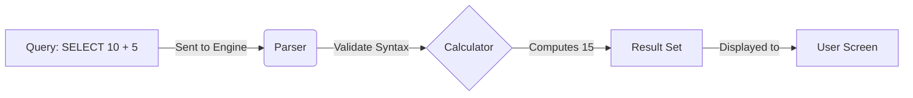
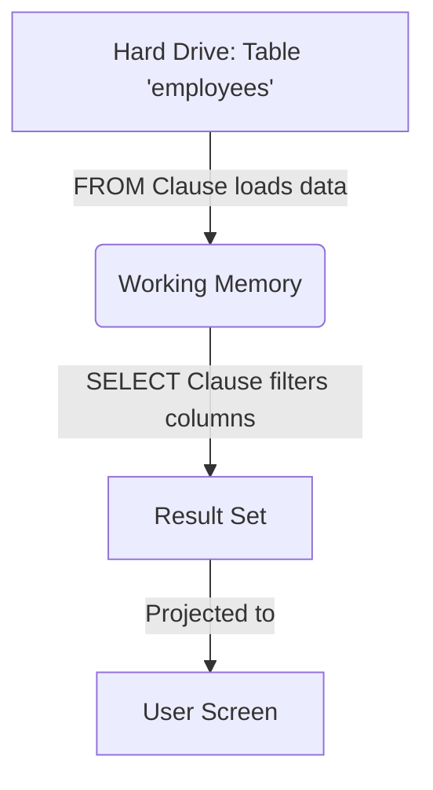
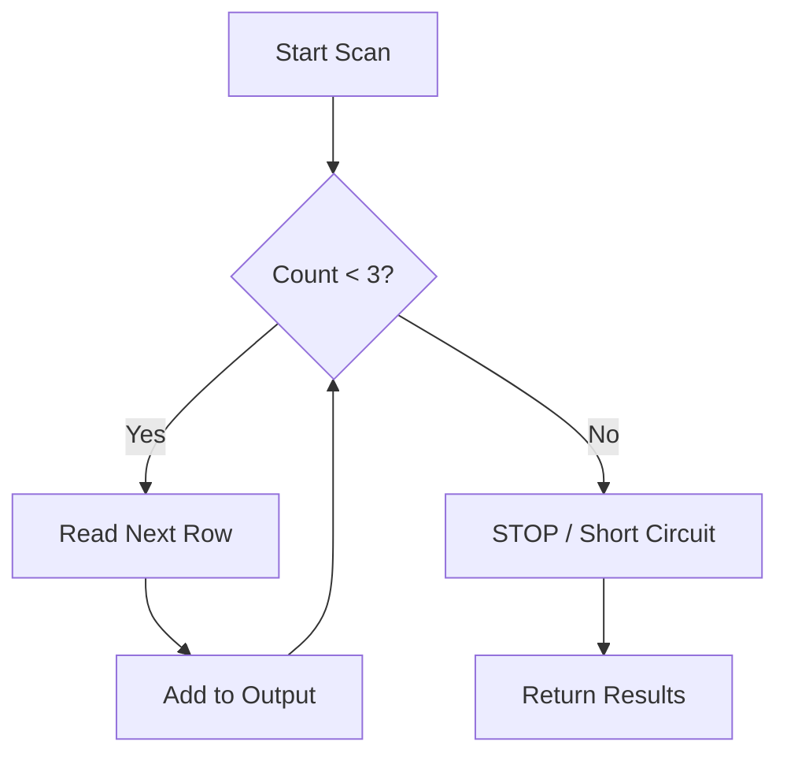
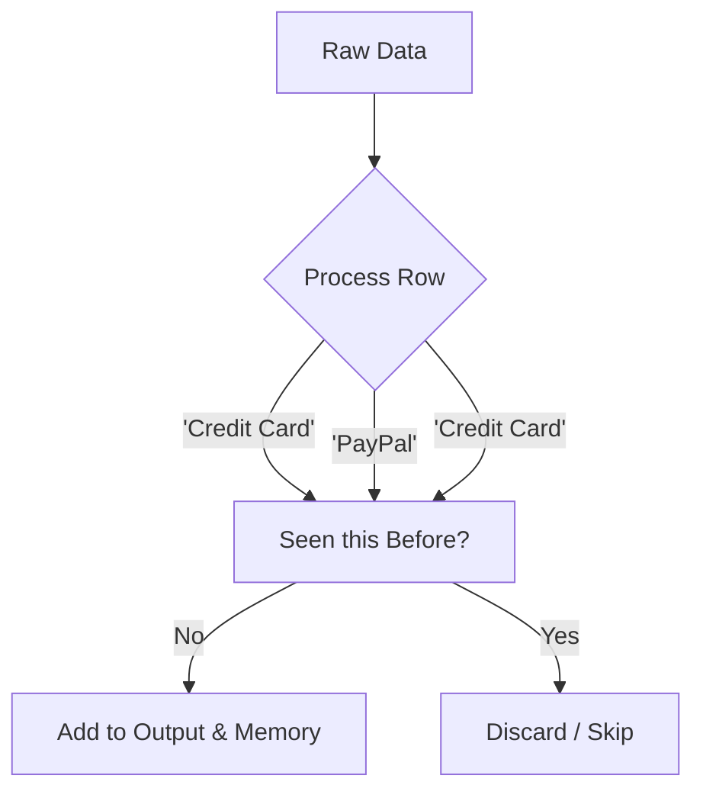
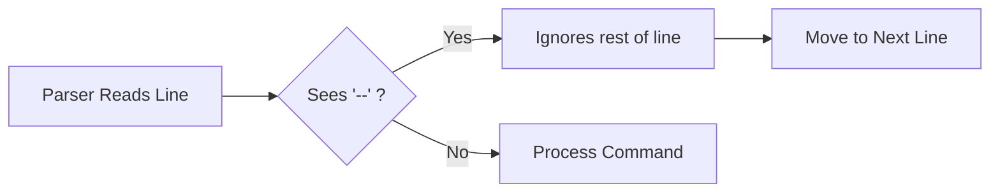

## 1.1 The `SELECT` Statement
Welcome to the command line.

If you are coming from a background in procedural programming (like Python, Java, or C), you are used to being the boss. You tell the computer exactly what to do: *create this variable, loop ten times, and if x is greater than y, then print z*. You are the micromanager.

SQL is different. SQL is **declarative**.

In SQL, you don't tell the database *how* to get the data. You don't tell it which hard drive platter to spin or which index to load into memory. You simply describe the data you want, and the database engine (the incredibly smart software running in the background) figures out the most efficient way to get it for you.

We start this journey with the most fundamental word in the language, `SELECT`.

### The "Hello, World" of Data
Before we start querying massive tables of customer data, let's see if we can just get the database to talk back to us. In its simplest form, the `SELECT` statement asks the database to compute a value and return it.

```sql
SELECT 'Hello, World';
```

**Output**

| ?column? |
|:---|
|Hello, World |

Let's break down exactly what happened here, because even this one line is doing some heavy lifting.

### Anatomy of a Statement

1. `SELECT`: This is a **keyword**. It is the command that tells the database, "I want you to retrieve or calculate the following value." In set theory terms, this is the operation of **projection**. We are projecting a specific value onto our screen.
2. `'Hello, World'`: This is a **string literal**. In SQL, text is almost always wrapped in single quotes (`'`).
3. `;` **(The Semicolon)**: This is the **statement terminator**. It tells the database, "I am done speaking; please execute what I just said."

!!! tip "The Semicolon"

    In many modern SQL tools, if you only write one line, the tool is smart enough to run it without the semicolon. However, developing the muscle memory to type it is crucial. Without it, the database won't know where one query ends and the next begins.

### SELECT as a Calculator
Because `SELECT` is essentially asking the database to "compute and return," we can use it for math without any tables involved.

```sql
SELECT 50 * 2;
```

**Output**:

| ?column? |
|:---|
| 100 |

Here, the database engine received your request, parsed the math `50 * 2`, calculated the result, and projected the answer back to you.

### Multiple Columns
A database result usually looks like a spreadsheet (it has rows and columns). We can ask for  multiple distinct pieces of information at once by separating them with a **comma**.

```sql
SELECT 'Apples', 50 * 2, 'Oranges';
```

**Output**:

| ?column? | ?column? | ?column? |
|:---|:---|:---|
| Apples | 100 | Oranges |

The comma is the separator. It tells SQL, "I want column A (comma), then I want column B (comma), then I want column C."

### Naming our Columns (Aliasing)
You might have noticed in the examples above that the header of our results looked a bit ugly (e.g., `?column?`). Since we didn't tell the database what to call these columns, it gave them a generic placeholder name.

We can clean this up using the `AS` keyword.

```sql
SELECT 'Apples' AS item_name, 50 * 2 AS quantity;
```

**Output**:

| item_name | quantity |
|:---|:---|
| Apples | 100 |

- `AS`: This keyword renames the result column. It does *not* change data in the database; it only changes the label on the report you just generated. This is known as **aliasing**.

### Visualizing the Flow
It helps to think of the `SELECT` engine as a factory line. Even without a data source (tables), the process looks like this:



## 1.2 The `FROM` Clause
In the previous section, we treated SQL like an expensive calculator. We made it do math (`50 * 2`) and shout text at us (`'Hello, World'`). While fun, your boss probably didn't hire you to use a database server to do multiplication that your phone could handle.

The real power of SQL comes from **persistence**, the ability to store massive amounts of data and retrieve it later. To achieve that, we need to tell the database *where* to look.

Enter the `FROM` clause.

### Connecting to a Source
If `SELECT` is the "What" (what columns do I want?), then `FROM` is the "Where" (where do I get them?).

In our dimensional modeling background, we know that data lives in entities (dimensions or facts). In the database world, these are **tables**.

Let's imagine a table called `employees`. It looks like this:

| employee_id | first_name | last_name | department |
|:---|:---|:---|:---|
| 101 | Ada | Lovelace | Engineering |
| 102 | Grace | Hopper | Engineering |
| 103 | Alan | Turing | Research |

To retrieve data from this table, we combine our new friend `SELECT` with `FROM`.

```sql
SELECT first_name
FROM employees;
```

**Output**:

| first_name |
|:---|
| Ada |
| Grace |
| Alan |

### Anatomy of the Query

1. `FROM employees`: This tells the database engine to locate the storage structure named "employees" on the hard drive, read its contents into memory, and prepare them for processing.
2. `SELECT first_name`: Now that the engine has the `employee` data, it looks for a column labeled "first_name," extracts just that slice of data, and discards the rest.

### The Logical Flow (Order of Operations)
This is the single most important concept in SQL, and it is the one that trips up developers coming from other languages.

**You read the query from top to bottom. The database executes it bottom-to-top**.

When you write:

```sql
SELECT first_name
FROM employees;
```

You read it as, *"Select the first name from the employees table."*

But the database engine reads it as:

1. **First**: Go to the `employees` table (`FROM`).
2. **Second**: Grab the `first_name` column (`SELECT`).

It creates the working set of data *first* and *then* decides what to keep.



### Selecting Multiple Columns
Just like in section 1.1, we can ask for multiple attributes from our sources. We just need to ensure that every column we ask for actually exists in the table defined in the `FROM` clause.

```sql
SELECT first_name, last_name
FROM employees;
```

**Output**:

| first_name | last_name |
|:---|:---|
| Ada | Lovelace |
| Grace | Hopper |
| Alan | Turing |

### The "Select All" Shorthand (`*`)
Occasionally, you don't know the column names, or you just want to see the whole spreadsheet. SQL provides a wildcard character for this: the **asterisk** (`*`).

When used after `SELECT`, the `*` means "give me every single column available in the table."

```sql
SELECT *
FROM employees;
```

**Output**:

| employee_id | first_name | last_name | department |
|:---|:---|:---|:---|
| 101 | Ada | Lovelace | Engineering |
| 102 | Grace | Hopper | Engineering |
| 103 | Alan | Turing | Research |


!!! warning "The Star Trap"

    While `SELECT *` is fantastic for learning and exploring a new database, be cautious using it in professional production code.

    1. **Performance**: If your table has 100 columns and millions of rows, asking for `*` forces the database to fetch gigabytes of data you might not need.
    2. **Traffic**: Sending **all** the data over the network can slow down your application.

    **Rule of Thumb**: Use `SELECT *` to explore. Use explicit names (`SELECT id, name`) when building actual reports.


**What happens if we mess up?**
In procedural code, if you ask for a variable that doesn't exist, the compiler yells at you. SQL is the same.

If you run:

```sql
SELECT favorite_color
FROM employees;
```

The database engine will look at the `employees` table, scan the header row, realize there is no `favorite_color` column, and return an error: `Error: Column 'favorite_color' does not exist`.

This error happens because of that **order of operations** we discussed. The database ran the `FROM` clause, loaded the schema for `employees`, and *then* tried to run the `SELECT`. Since the column wasn't in the loaded schema, it crashed.

## 1.3 Limit Results
In the previous section, we issued a strong warning about the dangers of `SELECT *`. In the professional world, tables are rarely small. An `orders` table for a large retailer might have billions of rows. If you run `SELECT * FROM orders`, your database client will try to download all of them. Your screen will freeze, the database server CPU will spike, and your network administrator will send you an angry email.

But you still need to see the data to understand it. You need to know column names and what the values look like. You need a "sample."

This is where we tell the database to stop early.

### The `LIMIT` Clause
The `LIMIT` clause does exactly what it says: it puts a hard cap on the number of rows returned. It tells the database engine, "Find me N rows, and then stop working immediately."

Let's look at a table called `products`.

```sql
SELECT *
FROM products
LIMIT 3;
```

**Output**:

| product_id | name | price |
|:---|:---|:---|
| 1 | Keyboard | 45.00 |
| 2 | Mouse | 25.00 |
| 3 | Monitor | 200.00 |

### Anatomy of the Query

1. `SELECT *`: We are asking for all columns.
2. `FROM products`: We are pulling from the products table.
3. `LIMIT 3`: This is the new instruction. It is a **constraint** on the result set size.

### The "Short Circuit"
The beauty of `LIMIT` is that it saves computational power. If the `products` table has 1,000,000 rows, the database engine doesn't scan all of them and then throw away 999,997.

It reads the first row. Then the second. Then the third. "Target reached," it says. And it cuts the connection. It never even looks at row #4.



### The "Which Rows?" Problem (Non-Determinism)
You might be asking a very logical question right now: *"Which 3 rows will I get?"*

The answer is: **You don't know.**

In set theory, a set is an *unordered* collection of distinct objects. A database table is (conceptually) a bag of unsorted data. Unless you explicitly tell the database to sort the data (which we will learn later), the database will return whichever rows it finds fastest.

Usually, this means the order they were inserted on the hard drive, but you cannot rely on that. If you run a query today, you might get 1, 2, and 3. If the database administrator reorganizes the hard drive tonight, you might run the same query tomorrow and get products 50, 99, and 200.

!!! warning "Non-Determinism"

    Without an `ORDER BY` clause, `LIMIT` is **non-deterministic**. It is perfect for "getting a feel" for the data but terrible for specific reporting. Never assume the "first 10 rows" are the "newest 10 rows" or the "top 10 rows" unless you explicitly asked for sorting.

### Pagination (OFFSET)
What if you want the *next* batch of rows? Imagine you are building a website and you want to show "Page 2" of the products. You need to skip the first 3 rows and show the next 3.

We use the `OFFSET` keyword.

```sql
SELECT *
FROM products
LIMIT 3 OFFSET 3;
```

- `LIMIT 3`: "Give me 3 rows."
- `OFFSET 3`: "… but skip the first 3 rows you find before you start counting."

!!! example "Analogy: The Buffet Line"

    - **LIMIT 3**: You take the first 3 plates of food you see.
    - **OFFSET 3**: You walk past the first 3 plates, ignore them, and *then* take the next 3.

## 1.4 `DISTINCT`: Eliminating Duplicates
If you recall from your background in set theory, a fundamental property of a "set" is that it contains **distinct** objects. The set `{1, 2, 2, 3}` is mathematically identical to `{1, 2, 3}`. The duplicates are redundant/ignored.

However, in the world of relational databases, a table is not a set. It is a **multiset** (or a "bag"). It allows duplicates; if you have 1,000 customers who live in "New York," and you select their city, SQL will dutifully return the string "New York" 1,000 times.

Occasionally that is precisely what you want. But often, you just want to know *which* cities exist, not *how many* times they appear. You want to turn the bag back into a set.

We do this with the `DISTINCT` keyword.

### The Problem with Duplicates
Let's look at a table called `orders`.

| order_id | customer_name | payment_method |
|:---|:---|:---|
| 1 | Alice | Credit Card |
| 2 | Bob | PayPal |
| 3 | Charlie | Credit Card |
| 4 | Alice | Credit Card |

If we want to know what payment options our customers are using, we might try:

```sql
SELECT payment_method
FROM orders;
```

**Output**:

| payment_method |
|:---|
| Credit Card |
| Paypal |
| Credit Card |
| Credit Card |

This is noisy. We see "Credit Card" three times. To clean this up, we use `DISTINCT`.

### The `DISTINCT` Keyword
The `DISTINCT` keyword acts as a filter on the **results**, removing any row that is identical to a row strictly before it.

```sql
SELECT DISTINCT payment_method
FROM orders;
```

**Output**:

| payment_method |
|:---|
| Credit Card |
| PayPal |

### Anatomy of the Syntax

1. `SELECT DISTINCT`: The keyword is placed immediately after `SELECT`. It applies to the *entire row* being generated.
2. `payment_method`: The column we are examining.

!!! example "Analogy: The Sieve"

    Imagine pouring a bucket of sand and rocks through a sieve. `SELECT` picks up the bucket. `FROM` tells you which bucket to grab. `DISTINCT` is the mesh screen that catches the duplicates and only lets unique items fall through to the display.

### Multi-Column Distinct (The Tuple)
A common point of confusion for beginners is how `DISTINCT` behaves when you ask for more than one column.

What if we run this?

```sql
SELECT DISTINCT customer_name, payment_method
FROM orders;
```

**Output**:

| customer_name | payment_method |
|:---|:---|
| Alice | Credit Card | 
| Bob | PayPal |
| Charlie | Credit Card |

Notice that "Alice" appears only once, even though she made two orders (orders #1 and #4) in the original table. Why? Because in both orders, her name was "Alice" **AND** the payment was "Credit Card." The **pair** was identical.

If Alice has used "PayPal" for her second order, both rows would have appeared, because `('Alice', 'Credit Card')` is different from `('Alice', 'PayPal')`.

**Rule**: `DISTINCT` evaluates the uniqueness of the **entire row** (the tuple), not just specific columns.

### Visualizing the Process
The database engine has to work harder to do this. It usually has to sort the data first so it can group identical items together and discard the extras.



### Distinct vs. The "Primary Key"
You might be wondering, *"If I select the ID column, do I need DISTINCT?"*

```sql
SELECT DISTINCT order_id
FROM orders;
```

In well-designed databases, tables have a **primary key** (a column that is guaranteed to be unique for every row, (like `order_id`)). If you select a primary key, `DISTINCT` does nothing except waste computer power. Every ID is already unique.

`DISTINCT` is most useful for **categorical data** (cities, departments, statuses, dates) where values are expected to repeat.

!!! warning "The Performance Cost"

    Using `DISTINCT` forces the database to compare every single row it finds against every other row to check for duplicates. On a table with 10 rows, this is instant. On a table with 100 million rows, this requires a massive sorting operation that can be very slow.

    **Best Practice**: Only use `DISTINCT` if you actually expect duplicates and need to remove them.

## 1.5 Comments in SQL
We have spent this entire chapter learning how to talk to the database engine. We have learned commands like `SELECT`, `FROM`, and `DISTINCT` to give the computer instructions.

But code is not just for computers. Code is for **humans**.

In six months, when you return to a complex query you wrote today, you might look at it and wonder, *"Why on earth did I filter out produce ID 99? What was I thinking?"*

This is where **comments** come in. Comments are lines of text that the database engine ignores completely. They exist solely for you and your teammates.

### The Single-Line Comment (`--`)
The most common way to leave a note is using two hyphens `--`.

Anything you type after `--` on that same line is invisible to the database execution engine.

```sql
SELECT product_name, price
FROm products
-- We are excluding the 'pro' tier because it's deprecated
LIMIT 10;
```

You can place them on their own line (like above) or at the end of a line of code:

```sql
SELECT product_name, price -- The price is in USD
FROM products;
```

### Visualizing the "Ignore"
When the database **parser** (the part of the engine that reads your text) sees the double dash, it simply stops reading until it hits the next line break.



### The Multi-Line Comment (`/* … */`)
Occasionally you have a lot to say. Maybe you need to explain a complex business rule, or you want to temporarily disable a large chunk of code without deleting it.

For this, we use the C-style block comment. It starts with `/*` and ends with `*/`. Everything in between (spanning as many lines as you like) is ignored.

```sql
/*
    Author: Data Team
    Date: 2023-10-27
    Purpose: Pulling a sample of products for the Q4 audit.
    Note: Do not run this on the production server during peak hours.
*/
SELECT * FROM products;
```

### "Commenting Out" Code for Debugging
The multi-line comment is incredibly useful for **debugging**.

Imagine you have a query that isn't working right. You suspect the `LIMIT` or the `OFFSET` is the problem. You would rather not delete the code because you might need it back in 5 seconds. You just want to turn it off temporarily.

```sql
SELECT *
FROM products
/* LIMIT 5 OFFSET 5 */;
```

Now, the query runs as if the `LIMIT` clause doesn't exist. When you want it back, just remove the `/*` and `*/`.

### Why Comment? (The "Bus" Factor)
In software engineering, there is a morbid but useful concept called the **bus factor**: *How many people on your team would have to get hit by a bus for the project to fail?*

If you write complex SQL queries without comments, and you are the only one who understands them, your bus factor is 1. That is dangerous.

Use comments to explain **why**, not **what**

- **Bad Comment**:

```sql
-- select the name column
SELECT name FROM users;
```

- **Good Comment**:

```sql
-- Using 'raw_name' instead of 'clean_name' because the cleaning pipeline is currently broken.
SELECT raw_name FROM users;
```

## Quiz

<quiz>
In the query `SELECT name FROM customers;`, which operation does the database engine execute first?
- [ ] They execute simultaneously
- [ ] `SELECT`
- [x] `FROM`
- [ ] It depends on the database engine

</quiz>

<quiz>
The `SELECT` statement determines which rows are included in your results.
- [ ] True
- [x] False

</quiz>

<quiz>
You run the query `SELECT * FROM products LIMIT 5;` on Monday and again on Tuesday. No data was added or deleted, but you get different results. Why?
- [ ] You forgot to use the `DISTINCT` clause
- [ ] `LIMIT` removes random rows by default
- [ ] The database is broken
- [x] SQL results are non-deterministic without an `ORDER BY` clause

</quiz>

<quiz>
Which SQL keyword is used to remove duplicate rows from the result set?
- [ ] `DIFFERENT`
- [x] `DISTINCT`
- [ ] `DEDUP`
- [ ] `UNIQUE`

</quiz>

<quiz>
What is the correct syntax for adding a single-line comment in SQL?
- [x] `-- Comment`
- [ ] `**Comment`
- [ ] `// comment`
- [ ] SQL does not have single-line comments

</quiz>

<quiz>
You are building a website and want to display 'Page 2' of the results. You want to skip the first 10 items and show the next 5. Which clause is correct?
- [ ] `LIMIT 10 OFFSET 5`
- [ ] `OFFSET 5 LIMIT 10`
- [ ] `NEXT 5 SKIP 10`
- [x] `LIMIT 5 OFFSET 10`

</quiz>

<quiz>
Using the `AS` keyword to alias a column renames that column permanently in the database schema.
- [ ] True
- [x] False

</quiz>

<quiz>
Why is `SELECT *` generally discouraged in production software?
- [ ] It performs a dangerous `DELETE` operation
- [ ] It returns duplicate data
- [ ] It is a syntax error
- [x] It wastes network and memory resources by fetching unused data

</quiz>

<quiz>
We want to use SQL as a calculator. Which query correctly computes `10 + 5`?
- [ ] `CALCULATE 10 + 5;`
- [x] `SELECT 10 + 5;`
- [ ] `SELECT 10 + 5 FROM dual;`
- [ ] `COMPUTE 10 + 5;`

</quiz>

<quiz>
How does `SELECT DISTINCT first_name, last_name FROM users;` determine uniqueness?
- [x] It removes rows where the combination of `first_name` AND `last_name` is identical
- [ ] It removes rows where *either* the name OR the last name is a duplicate
- [ ] It throws an error because `DISTINCT` only works on one column
- [ ] IT removes rows where the `first_name` is a duplicate

</quiz>

<!-- mkdocs-quiz results -->

## Lab
Please complete module 1 labs in the companion GitHub repository.

## Lab Solutions

!!! warning "Don't Cheat Yourself"

    Before viewing any of the solutions below, please ensure you have given the challenge an honest try. The worst thing you can do to yourself while learning is to not "accept the struggle." The struggle is what cements the information. Discovering the answer through trial and error is the only way to truly learn.

??? note "Challenge 1 Solution"

    ```sql
    SELECT *
    FROM customers;
    ```

??? note "Challenge 2 Solution"

    ```sql
    SELECT
        product_id,
        product_category_name
    FROM products;
    ```

??? note "Challenge 3 Solution"

    ```sql
    SELECT *
    FROM order_items
    LIMIT 100;
    ```

??? note "Challenge 4 Solution"

    ```sql
    SELECT DISTINCT order_status
    FROm orders;
    ```

??? note "Challenge 5 Solution"

    ```sql
    SELECT DISTINCT product_category_name
    FROM products;
    ```

??? note "Challenge 6 Solution"

    ```sql
    SELECT
        seller_city,
        seller_state
    FROM sellers;
    ```

??? note "Challenge 7 Solution"

    ```sql
    SELECT DISTINCT
        seller_city,
        seller_state
    FROM sellers;
    ```

??? note "Challenge 8 Solution"

    ```sql
    SELECT DISTINCT
        seller_id,
        seller_city,
        seller_state
    FROM sellers
    LIMIT 20;
    ```

??? note "Challenge 9 Solution"

    ```sql
    -- Audit sampling
    SELECT
        order_id,
        price
    FROM order_items
    LIMIT 10;
    ```

??? note "Challenge 10 Solution"

    ```sql
    SELECT
        customer_id,
        customer_unique_id,
        customer_state
    FROM customers
    LIMIT 50;
    ```

??? note "Challenge 11 Solution"

    ```sql
    SELECT *
    FROM products
    LIMIT 15;
    ```

??? note "Challenge 12 Solution"

    ```sql
    SELECT
        order_id,
        shipping_limit_date
    FROM order_items
    LIMIT 5;
    ```

??? note "Challenge 13 Solution"

    ```sql
    SELECT DISTINCT customer_city
    FROM customers;
    ```

??? note "Challenge 14 Solution"

    ```sql
    SELECT DISTINCT order_approved_at
    FROM orders;
    ```

??? note "Challenge 15 Solution"

    ```sql
    SELECT
        price,
        freight_value
    FROM order_items
    LIMIT 50;
    ```

??? note "Challenge 16 Solution"

    ```sql
    SELECT
        order_id,
        order_purchase_timestamp,
        order_delivered_customer_date
    FROM orders
    LIMIT 10;
    ```

??? note "Challenge 17 Solution"

    ```sql
    SELECT DISTINCT seller_zip_code_prefix
    FROM sellers;
    ```

??? note "Challenge 18 Solution"

    ```sql
    SELECT
        product_length_cm,
        product_height_cm,
        product_width_cm
    FROM products
    LIMIT 25;
    ```

??? note "Challenge 19 Solution"

    ```sql
    SELECT DISTINCT freight_value
    FROM order_items;
    ```

??? note "Challenge 20 Solution"

    ```sql
    SELECT
        order_id,
        product_id,
        seller_id,
        price
    FROM order_items
    LIMIT 100;
    ```