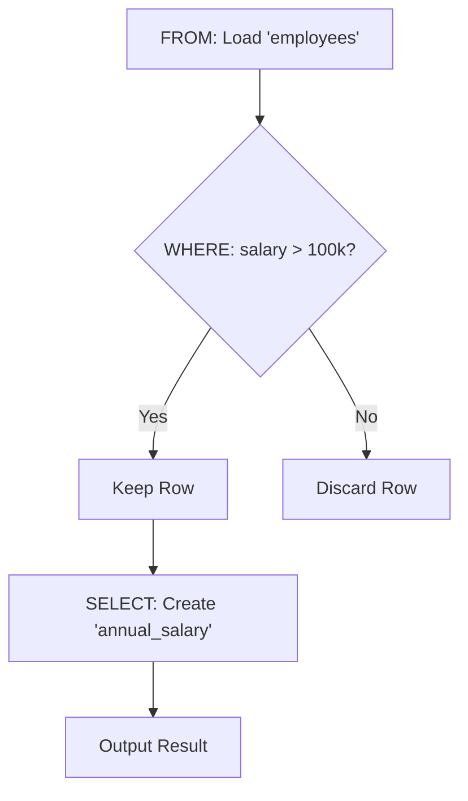
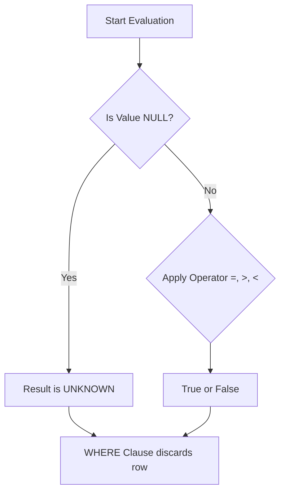
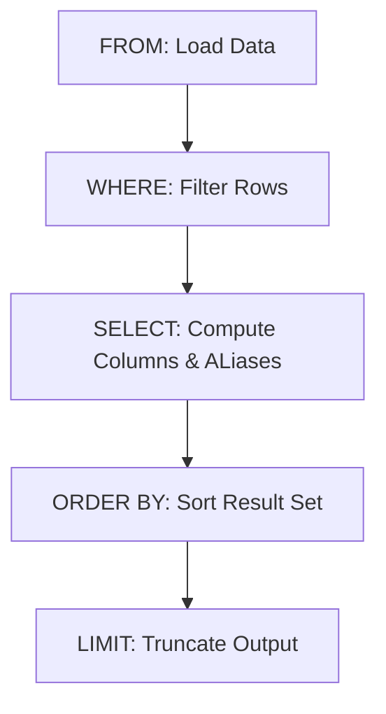

## 2.1 The `WHERE` Clause
In the first section, we learned how to get data out of the database. We pulled columns with `SELECT` and chose tables with `FROM`. But so far, our interaction has been indiscriminate. We have been asking for *everything* or just grabbing a random handful of rows with `LIMIT`.

In the real world, data analysis is rarely about "everything." It is about **specificity**.

- "Show me the sales *from yesterday*."
- "Show me the customers *in Canada*."
- "Show me the products *that cost more than $50.*"

In set theory terms, this is known as **selection** (not to be confused with the SQL keyword `SELECT`). We are selecting a subset of the tuples (rows) that satisfy a specific condition.

In SQL, we do this with the `WHERE` clause.

### The Gatekeeper
Think of the `WHERE` clause as a bouncer standing at the door of a club. The database engine brings rows from the hard drives one by one. The `WHERE` clause looks at each row, checks its ID, and decides, "*You can come in*" or "*You  stay out.*"

Let's look at our `employees` table again.

| id | name | department | salary |
|:---|:---|:---|:---|
| 1 | Ada | Engineering | 120000 |
| 2 | Grace | Engineering | 130000 |
| 3 | Alan | Research | 110000 |
| 4 | Mary | HR | 90000 |

If we want to find only the engineers, we write:

```sql
SELECT name, department
FROM employees
WHERE department = 'Engineering';
```

**Output**:

| name | department |
|:---|:---|
| Ada | Engineering |
| Grace | Engineering |

### Anatomy of the Clause
1. `WHERE`: The keyword that signals the start of the filtering logic.
2. `department`: The column we are evaluating.
3. `=`: The **operator**. In this case, we are checking for exact equality.
4. `'Engineering'`: The **literal value**. Since it is text, it must be in single quotes.

### The Logical Flow (Updated)
In the first section, we learned that `FROM` runs before `SELECT`. Now we must insert `WHERE` into that timeline.

**The Order of Execution Is:**
1. `FROM`: Load the table (the source).
2. `WHERE`: Filter the rows (the gatekeeper).
3. `SELECT`: Return the columns (the projection).

This order is critical. It explains why you **cannot** use an alias created in the `SELECT` clause inside the `WHERE` clause.

- **Bad Query (Will Fail)**:

```sql
SELECT salary * 12 AS annual_salary
FROm employees
WHERE annual_salary > 10000; -- Error!
```

- **Why it fails**: The database runs `WHERE` before it runs `SELECT`. At step 2 (`WHERE`), the alias `annual_salary` has not been invented yet. It doesn't exist.

- **Correct Query**:

```sql
SELECT salary * 12 AS annual_salary
FROM employees
WHERE salary * 12 > 100000;
```

!!! question "Do I really have to type the math twice?"

    Yes, you have to type the math twice. It feels redundant, but it ensures the logic is sound.



### Basic Comparison
The `WHERE` clause relies on **predicate** (expressions that evaluate to `TRUE`, `FALSE`, or `UNKNOWN`). If a row evaluates to `TRUE`, it is kept. If it is `FALSE` or `UNKNOWN`, it is discarded.

We start with the standard comparison operators.

**1. Equality (`=`)**

Used for exact matches.

```sql
-- find the employees with ID 3
SELECT * FROM employees WHERE id = 3;
```

!!! warning "Case Sensitivity"

    Is 'Engineering' the same as 'engineering'?

    - **PostgreSQL / Oracle / Linux**: No, they are different.
    - **SQL Server / MySQL / Windows**: Usually yes. They are case-insensitive by default.
  
    Always assume data is **case sensitive** to be safe. We will learn functions like `LOWER()` later, to handle this gracefully.

**2. Inequality (`<>` or `!=`)**

Used when you want everything except a specific value. Standard SQL uses `<>`, though most databases also accept the C-style `!=`.

```sql
-- Everyone who is NOT in HR
SELECT * FROM employees WHERE department <> 'HR';
```

**3. Greater Than / Less Than (`>`, `<`, `>=`, `<=`)**
Used primarily for numbers and dates.

```sql
-- Who earns more than 100k?
SELECT * FROM employees WHERE salary > 100000;

-- Who was hired on or before Jan 1st, 2023?
SELECT * FROM employees WHERE hire_date <= '2023-01-01';`
```

### Filtering by Text Strings
When working with text, we have to be careful with our quotes.

- **Single Quotes (`'`)**: Used for data (string literals). 'Engineering,' 'John Doe.'
- **Double Quotes (`"`)**: Used for database objects (table names, column names) if they have spaces or special characters.

**Rule of Thumb**: If you are filtering data, use **single quotes**.

```sql
SELECT * FROM products
WHERE category = 'Electronics';
```

If you forget the quotes:
```sql
SELECT * FROM products WHERE category = Electronics;
```

The database will think "Electronics" is a column name, look for it, fail to find it, and throw an error: `Column 'Electronics' does not exist`.

## 2.2 Logic and Operators (`AND`, `OR`, `NOT`)
Life is rarely simple enough for a single condition.

If you are ordering a pizza, you don't just say "I want cheese." You say, "I want cheese AND pepperoni AND a thin crust, but not anchovies."

Databases work the same way. In section 2.1, we learned how to filter by one criterion. Now, we will learn how to combine them using **logical operators**. If you remember your set theory, these map directly to intersections and unions.

### The `AND` Operator (Intersection)
The `AND` operator is strict. It demands that **both** conditions be true for a row to survive the filter. If even one condition fails, the row is discarded.

Imagine we are looking for **senior engineers**. We need employees who are in the Engineering department *and* have a high salary.

```sql
SELECT *
FROM employees
WHERE department = 'Engineering'
    AND salary > 100000;
```

**Logic Flow**:

1. Is the department Engineering? (If no, discard immediately).
2. Is the salary > 100k? (If no, discard).
3. If both are yes, keep the row.

In set theory, this is the **intersection** of the "Engineering Set" and the "High Salary Set."

### The `OR` Operator (Union)
The `OR` operator is generous. It is satisfied if **at least one** of the conditions is true.

Imagine we are planning a company party for the sales and marketing teams. We want the invite list to include anyone from either department.

```sql
SELECT *
FROM employees
WHERE department = 'Sales'
    OR department = 'Marketing';
```

**Logic Flow**:

1. Is the department Sales? (If yes, keep the row. Stop checking).
2. No? Okay, is it Marketing? (If yes, keep the row).
3. If both are no, discard.

In set theory this is the **union**.

### The Order of Precedence (The Danger Zone)
Here is where 90% of beginner bugs happen.

What happens when you mix `AND` and `OR` in the same query? Imagine you want to find **Senior** employees (salary > 100k) in either **Sales** or **Marketing**.

You might try this:

```sql
-- Dangerous Code
SELECT *
FROM employees
WHERE department = 'Sales'
    OR department = 'Marketing'
    AND salary > 100000;
```

This query is wrong.

You might read it as, *"Return people in (Sales or Marketing) who earn > 100k."* But SQL follows strict rules of precedence. `AND` is "stickier" (has a higher precedence) than `OR`.

SQL reads it as, *"Return people who are in Sales OR (people in Marketing who earn > 100k)."*

If you have a Sales intern making 30k, they will appear in your result because the first part of the `OR` (`department = 'Sales'`) was true, and the `AND` constraint didn't apply to them.

**The Solution: Parentheses**
Just like in algebra, **parentheses** force the order of operations. You must wrap your logic to group the departments together.

```sql
-- Correct code
SELECT *
FROM employees
WHERE (department = 'Sales' OR department = 'Marketing')
    AND salary > 100000;
```

!!! tip "Best Practice: Parentheses"

    Whenever you mix `AND` and `OR` in the same `WHERE` clause, **always** use parentheses. Even if you know the precedence rules perfectly, the parentheses make your intent clear to other humans reading your code.

### The `NOT` Operator (Negation)
`NOT` simply flips a condition from `TRUE` to `FALSE`, or vice versa. It is the logical complement.

```sql
-- Everyone EXCEPT Engineering
SELECT * FROM employees
WHERE NOT department = 'Engineering';
```

!!! info "Syntax Note: Inequality Operators"

    This is functionally identical to using `<>` or `!=`.

`NOT` becomes very powerful when checking complicated conditions, like NULLs (which we will discuss in the next sub-section) or lists.

### Syntactic Sugar
SQL provides a few shortcuts to make complex logic easier to write and read. We call this "syntactic sugar." It doesn't add new functionality; it just makes the code "sweeter."

#### 1. The `IN` Operator

If you want to filter for a list of values, chaining `OR`s gets tedious.

- **The Hard Way**:

```sql
WHERE state = 'NY' OR state = 'NJ' OR state = 'CT' OR state = 'PA'
```

- **The `IN` Way**:

```sql
WHERE state IN ('NY', 'NJ', 'CT', 'PA');
```

This is much cleaner. It checks if the value exists anywhere in the provided list (a set membership test). You can also combine it with `NOT` to exclude a list:

```sql
WHERE state NOT IN ('FL', 'TX', 'CA')
```

#### 2. The `BETWEEN` Operator

Similarly, checking for a range of numbers or dates can be verbose.

- **The Hard Way**:

```sql
WHERE salary >= 50000 AND salary <= 90000
```

- **The `BETWEEN` Way**:

```sql
WHERE salary BETWEEN 50000 AND 90000
```

!!! warning "Inclusive Ranges"

    `BETWEEN` is **inclusive**. `BETWEEN 1 AND 10` includes 1, 10, and everything in the middle.

    Be cautious with Dates. `BETWEEN '2023-01-01' AND '2023-01-02'` will include records from January 2nd at midnight. If your data has timestamps (e.g., `2023-01-02 14:30:00`), they might get cut off depending on the database engine. We will cover safe date math in the next chapter.

### Pattern Matching (`LIKE`)
So far, all our operators have been rigid.

- `=` requires an exact match.
- `>` requires a strict mathematical hierarchy.
- `IN` requires the value to exist perfectly in a list.

But humans are messy. Occasionally you don't know exactly what you are looking for. You don't know if the customer is named "Steven" or "Stephen." You don't know if the product is "iPhone 12" or "Apple iPhone 12 Pro."

You need a "fuzzy" search. In SQL, we use the `LIKE` operator with **wildcards**.

#### The Percent Wildcard (`%`)

The percent sign `%` represents **zero**, **one**, **or multiple characters**. It is a placeholder for "anything goes here."

- `'Data%'`: Starts with "Data." (Matches: "Data," "Databases," "Data Science").
- `'%Data'`: Ends with "Data." (Matches: "Big Data," "Metadata").
- `'%Data%'`: Contains "Data" anywhere. (Matches: "The Data Team").

**Scenario**: We want to find **all** customers whose last name starts with "Mc" (McDonald, McAvoy, etc.).

```sql
SELECT
    first_name,
    last_name
FROM customers
WHERE last_name LIKE 'Mc%';
```

If we would like to find every product that mentions "Pro" in the name:

```sql
SELECT product_name
FROM products
WHERE product_name LIKE '%Pro%';
```

!!! tip "The File Search"

    Think of `%` like the asterisk `*` you use when searching for files on your computer (e.g., `*.jpg`). It tells the database, "I don't care what this part of the string looks like, as long as the rest matches."

#### The Underscore Wildcard (`_`)

The percent sign is greedy; it matches infinite text. The underscore `_` is precise. It represents **exactly one single character**.

This is useful for fixed-length codes, SKUs, or serial numbers.

Imagine our products' SKUs follow a format like `A-123` or `B-456`. We want to find **all** products that are in the "Type 1" category (middle digit is 1), but we don't care about the letter prefix.

- `'_-1%'`:
    - `_` matches exactly one letter (A, B, C, …).
    - `-1` matches the literal character "-1."
    - `%` matches whatever comes after.

```sql
SELECT
    sku,
    product_name
FROM inventory
WHERE sku LIKE '_-1%';
```

**Matches**: `A-100`, `B-150`, `C-199`. **Ignores**: `AA-100` (two characters at start), `A-200` (middle digit is 2).

### The Dialect Trap: Case Sensitivity (`LIKE` vs `ILIKE`)
Here is a sharp edge that cuts many beginners.

In the SQL standard, `LIKE` is **case sensitive**.

- `LIKE 'A%'`: matches "Apple."
- `LIKE 'a%'`: matches "apple."
- `LIKE 'A%'`: does **NOT** match "apple."

However, database engines disagree on this.

- **MySQL / SQL Server**: Usually case-insensitive by default. `LIKE 'a%'` finds "Apple."
- **PostgreSQL / Oracle**: Strictly case-sensitive. `LIKE 'a%'` will not find "Apple."

If you are using **PostgreSQL** (which we are using for our labs) and you want a case-insensitive search, you must use the special operator `ILIKE` (insensitive LIKE).

```sql
-- PostgreSQL specific
SELECT * FROM customers
WHERE first_name ILIKE 'steve';
-- Finds: Steven, steven, STEVEN, sTeVeN
```

!!! warning "The Performance Cost"

    Pattern matching is expensive.
    
    - `LIKE 'Mc%'`: **Fast**. The database can look at the index (like a phone book) and jump straight to the "M" section.
    - `LIKE '%Data%'`: **Slow**. Because the wildcard is at the *start*, the database cannot use the index. It has to scan every single row in the table to see if the word is hiding in the middle.
  
    Use leading wildcards (`%text`) sparingly on large tables.

## 2.3 The VOID (`NULL`)
In the previous sections, we treated data as concrete. A salary is a number. A name is a string. A date is a specific point in time.

But what if we simply… don't know?

What if a new employee hasn't been assigned a department yet? What if a customer hasn't provided their phone number? In a spreadsheet, you might leave a cell blank. In programming, you might use `0` or `""` (empty string).

In SQL, we have a special marker for "missing" or "unknown" information. It is called **NULL**.

### The Concept of NULL
`NULL` is not a value. It is a **state**. It represents the *absence* of a value.

To understand this, let's look at the difference between `0`, `""` (empty string), and `NULL`.

!!! example "Analogy: The Cardboard Box"

    - **0**: The box is there, and it contains the number 0.
    - **""**: (Empty string). The box is there, but it's empty.
    - **NULL**: There is no box. We don't even know if a box exists.
  
### The "Equals" Trap
This is the mistake that every single SQL developer makes at least once.

Imagine we have a `employee` table, and some employees don't have a manager yet (the `manager_id` column is empty (`NULL`)). We want to find them.

Your instinct, based on everything you've learned thus far, is to write this:

```sql
-- THIS WILL NOT WORK
SELECT * FROM employees
WHERE manager_id = NULL;
```

**Output**:
(Zero rows returned)

Why? Even if there are 50 employees with no manager, this query returns nothing.

### Three-Valued Logic
The reason lies in how SQL handles logic. In most programming, a boolean is either `TRUE` or `FALSE`. In SQL, there is a third state: `UNKNOWN`.

When you ask the database, "Is NULL equal to NULL?", the database cannot say "yes." It has to say, "I don't know." One unknown value might be 5; the other might be 'blue.' We don't know what they are, so we can't say they are equal.

- `5 = 5` --> **TRUE**
- `5 = 4` --> **FALSE**
- `NULL = 5` --> **UNKNOWN**
- `NULL = NULL` --> **UNKNOWN**

The `WHERE` clause only lets rows in if the condition is **TRUE**. If the result is **UNKNOWN**, the row is rejected just like a **FALSE**.

### The Solution: `IS NULL`
Because we cannot use standard math operators on the void, SQL provides two special operators specifically for checking existence.

1. `IS NULL`: Checks if the value is missing.
2. `IS NOT NULL`: Checks if the value is present.

To fix our previous query:

```sql
-- CORRECT SYNTAX
SELECT * FROM employees
WHERE manager_id IS NULL;
```

To find employees who do have a manager:
```sql
SELECT * FROM employees
WHERE manager_id IS NOT NULL;
```

### The Infection (Propagation of NULL)
`NULL` is like a virus; if you touch it, you become it.

If you try to do math with a `NULL` value, the result is always `NULL`.

- `10 + 5 = 15`
- `10 + NULL = NULL`

Think about it: *What is 10 plus "I don't know'? The answer is "I don't know."*

This applies to strings too.
- `'Hello' + NULL = NULL`

!!! warning "The Silent Failure"

    This behavior often causes reports to appear "blank" rather than throwing an error. If you run `SELECT price * tax_rate` and `tax_rate` is `NULL` for one item, the total cost becomes `NULL`. It doesn't crash; it just disappears.

### Visualizing the Logic Flow
Here is how the database engine evaluates a condition when `NULL` is involved.



### Sorting NULLs
We haven't covered sorting yet, but it is worth noting that `NULL` has to go *somewhere* when you sort a list.

If you sort a list of numbers: `1, 5, 10, NULL`. Where does `NULL` go?

- **PostgreSQL / Oracle**: Treat NULLs as "infinity" (largest value). They appear at the bottom of the list.
- **SQL Server / MySQL**: Treat NULLs as "negative infinity (smallest value). They appear at the top of the list.

You can often control this with `NULLS FIRST` or `NULLS LAST` syntax, but just be aware that different databases handle the "weight" of the void differently.

## 2.4 The `ORDER BY` Clause
We have spent this entire chapter treating our data like a chaotic pile of documents. We have filtered it, projected it, and handled the void of `NULL`. But if you run the same query twice, there is no guarantee the rows will appear in the same order.

Relational databases are based on set theory, and a set is (by definition) **unordered**. `{A, B, C}` is the same set as `{C, A, B}`. The database stores data wherever it fits on the hard drive, often based on when it was inserted or how the disk is optimized.

To present data to a human (or a report), we need to impose structure. We need to sort.

We do this with the `ORDER BY` clause.

### The Default Direction (`ASC`)
Let's look at our `products` table.

```sql
SELECT product_name, price
FROM products
ORDER BY price;
```

**Output**:

| product_name | price |
|:---|:---|
| Pencil | 0.50 |
| Notebook | 5.00 |
| Laptop | 1200.00 |

By default, SQL sorts in **ascending order** (smallest --> largest, A --> Z, Oldest --> Newest).

You can be explicit by adding the `ASC` keyword, though it is optional:

```sql
ORDER BY price ASC;  -- Identical to above
```

### Reversing the Flow (`DESC`)
Usually, we want to see the "Top" results first. Who has the highest score? What is the most expensive item? What was the most recent order?

For this, we use the `DESC` (descending) keyword.

```sql
SELECT product_name, price
FROM products
ORDER BY price DESC;
```

**Output**:

| product_name | price |
|:---|:---|
| Laptop | 1200.00 |
| Notebook | 5.00 |
| Pencil | 0.50 |

### Sorting by Multiple Columns (The Tiebreaker)
What happens if we sort by `department`, and we have ten people in "Engineering"? In what order do *they* appear?

Without further instructions, the order of those ten engineers is undefined (random). To fix this, we can sort by multiple columns. This is often called a tiebreaker.

Think of a telephone book. It is sorted by last name. If two people have the last name "Smith," it then sorts them by first name.

```sql
SELECT last_name, first_name, salary
FROM employees
ORDER BY last_name ASC, first_name ASC;
```

We can even mix directions. Let's say we want to list departments alphabetically, but within each department, we want the highest-paid employees at the top.

```sql
SELECT department, last_name, salary
FROM employees
ORDER BY department ASC, salary DESC;
```

**Output**:

| department | last_name | salary |
|:---|:---|:---|
| Engineering | Hopper | 130000 |
| Engineering | Lovelace | 120000 |
| HR | Smith | 90000 |

### The Order of Execution (Updated)
This is a critical moment for your understanding of how the database "thinks."

In section 2.1, we warned you that you **cannot** use aliases in the `WHERE` clause because filtering happens *before* the columns are created.

`ORDER BY` is different. It happens **last**.

Because sorting is the final cosmetic touch before the data is shipped to your screen, the database has already finished the `SELECT` phase. This means **you CAN use aliases** in `ORDER BY`.

```sql
SELECT product_name, price * 1.2 AS price_with_tax
FROM products
ORDER BY price_with_tax DESC;  -- This works!
```

**The Full Logical Flow**:

1. `FROM`: Gather the raw materials (Tables).
2. `WHERE`: Filter out the garbage (Rows).
3. `SELECT`: Build the final product (Columns/Aliases).
4. `ORDER BY`: Arrange the product for display.
5. `LIMIT`: Chop off the excess.



### Ordinal Sorting (The Lazy Trap)
You may see old tutorials or grumpy senior developers using numbers instead of names in the `ORDER BY` clause.

```sql
-- "Sort by the 2nd column in the SELECT list"
SELECT product_name, price
FROM products
ORDER BY 2 DESC;
```

This is called **ordinal sorting**. It works. It saves you from typing "price."

**Don't do it**.

Imagine you update your query later to add an ID column at the start: `SELECT product_id, product_name, price…`. Now, column #2 is `product_name`. Your sort logic just silently broke. You are now sorting by name instead of price, and the database won't give you an error; it will just give you the wrong report.

!!! note "Best Practice: Be Explicit"

    Always type the name of the column you are sorting by. It makes your code readable and resilient to change.

## Quiz

<quiz>
What is the primary function of the `WHERE` clause in an SQL query?
- [x] To filter which rows are returned based on a specific condition
- [ ] To sort the results in ascending or descending order
- [ ] To select which columns are displayed in the output
- [ ] To group rows together for aggregation

</quiz>

<quiz>
Consider the query: `SELECT price * 0.9 AS discounted_price FROM products WHERE discounted_price < 20;`. Why will this query fail?
- [ ] The syntax is correct; it will not fail
- [ ] You cannot perform math inside a `SELECT` clause
- [x] The `WHERE` clause executes before the `SELECT` clause, so it does not know the alias exists yet
- [ ] The `AS` keyword is only allowed in the `FROM` clause

</quiz>

<quiz>
You want to find all employees who are in the "Sales" department OR the "Marketing" department AND who also earn more than 100k. Which query correctly handles the order of operations?
- [ ] `WHERE dept = 'Sales' OR dept = 'Marketing' AND salary > 100000`
- [x] `WHERE (dept = 'Sales' OR dept = 'Marketing') AND salary > 100000`
- [ ] `WHERE dept = 'Sales' AND salary > 100000 OR dept = 'Marketing'`
- [ ] `WHERE dept IN ('Sales', 'Marketing') OR salary > 100000`

</quiz>

<quiz>
Which of the following conditions is the correct way to find rows where the `phone_number` column is empty (`NULL`)?
- [ ] `WHERE phone_number == NULL`
- [ ] `WHERE phone_number = NULL`
- [x] `WHERE phone_number IS NULL`
- [ ] `WHERE phone_number EQUALS NULL`

</quiz>

<quiz>
What is the result of the expression `100 + NULL` in SQL?
- [ ] An error message
- [x] `NULL`
- [ ] 0
- [ ] 100

</quiz>

<quiz>
If you write `ORDER BY last_name` without specifying ASC or DESC, how will the results be sorted?
- [ ] By insertion date
- [ ] Random order
- [x] Ascending (A-Z)
- [ ] Descending (Z-A)

</quiz>

<quiz>
How does the query `ORDER BY department ASC, salary DESC` sort the data?
- [ ] It sorts strictly by salary, ignoring the department
- [ ] It sorts departments Z-A, and within each department, sorts salaries lowest to highest
- [ ] It sorts by department first but ignores salary unless departments are `NULL`
- [x] It sorts departments A-Z, and within each department, sorts salaries from highest to lowest

</quiz>

<quiz>
Which of the following queries using `IN` is equivalent to `WHERE state = 'NY' OR state = 'CA' OR state = 'TX'`?
- [ ] `WHERE state HAS ('NY', 'CA', 'TX')`
- [ ] `WHERE state = 'NY', 'CA', 'TX'`
- [ ] `WHERE state IN 'NY' OR 'CA' OR 'TX'`
- [x] `WHERE state IN ('NY', 'CA', 'TX')`

</quiz>

<quiz>
The `BETWEEN` operator is inclusive (e.g., `BETWEEN 1 AND 10` includes 1 and 10).
- [ ] True
- [x] False

</quiz>

<quiz>
You successfully aliased a column in your `SELECT` clause (e.g., `SELECT price AS cost`). Can you use `ORDER BY cost`?
- [x] Yes, because `ORDER BY` executes after the `SELECT` clause
- [ ] No, you must use the original column name `price`
- [ ] No, you must use the column position number (e.g., `ORDER BY 1`)
- [ ] Yes, but only if you use the `AS` keyword again in the sort

</quiz>

<!-- mkdocs-quiz results -->

## Lab
Please complete module 2 labs in the companion GitHub repository.

## Lab Solutions

!!! warning "Don't Cheat Yourself"

    Before viewing any of the solutions below, please ensure you have given the challenge an honest try. The worst thing you can do to yourself while learning is to not "accept the struggle." The struggle is what cements the information. Discovering the answer through trial and error is the only way to truly learn.

??? note "Challenge 1 Solution"

    ```sql
    SELECT *
    FROM customers
    WHERE customer_state = 'RJ';
    ```

??? note "Challenge 2 Solution"

    ```sql
    SELECT 
        product_id, 
        product_weight_g
    FROM products
    WHERE product_weight_g > 3000;
    ```

??? note "Challenge 3 Solution"

    ```sql
    SELECT *
    FROM orders
    WHERE order_status <> 'delivered';
    ```

??? note "Challenge 4 Solution"

    ```sql
    SELECT 
        order_id, 
        product_id, price
    FROM order_items
    WHERE price < 10.00;
    ```

??? note "Challenge 5 Solution"

    ```sql
    SELECT *
    FROM sellers
    WHERE seller_state = 'SP' 
        AND seller_city = 'campinas';
    ```

??? note "Challenge 6 Solution"

    ```sql
    SELECT 
        order_id, 
        order_status
    FROM orders
    WHERE order_status = 'shipped' 
        OR order_status = 'processing';
    ```

??? note "Challenge 7 Solution"

    ```sql
    SELECT 
        product_id, 
        product_weight_g
    FROm products
    WHERE product_weight_g BETWEEN 1000 AND 2000;
    ```

??? note "Challenge 8 Solution"

    ```sql
    SELECT 
        order_id, 
        order_purchase_timestamp
    FROM orders
    WHERE order_purchase_timestamp BETWEEN '2018-01-01' AND '2018-01-07';
    ```

??? note "Challenge 9 Solution"

    ```sql
    SELECT 
        product_id, 
        product_category_name
    FROM products
    WHERE product_category_name IN ('cama_mesa_banho', 'moveis_decoracao', 'utilidades_domesticas');
    ```

??? note "Challenge 10 Solution"

    ```sql
    SELECT *
    FROM sellers
    WHERE seller_state NOT IN ('SP', 'RJ', 'MG');
    ```

??? note "Challenge 11 Solution"

    ```sql
    SELECT DISTINCT product_category_name
    FROM products
    WHERE product_category_name LIKE 'brinquedos%';
    ```

??? note "Challenge 12 Solution"

    ```sql
    SELECT DISTINCT product_category_name
    FROM products
    WHERE product_category_name LIKE '%moveis%';
    ```

??? note "Challenge 13 Solution"

    ```sql
    SELECT 
        order_id, 
        order_status
    FROM orders
    WHERE order_delivered_carrier_date IS NULL;
    ```

??? note "Challenge 14 Solution"

    ```sql
    SELECT 
        order_id, 
        order_delivered_customer_date
    FROM orders
    WHERE order_delivered_customer_Date IS NOT NULL;
    ```

??? note "Challenge 15 Solution"

    ```sql
    SELECT DISTINCT seller_city
    FROM sellers
    ORDER BY seller_city;
    ```

??? note "Challenge 16 Solution"

    ```sql
    SELECT 
        product_id, 
        price
    FROM order_items
    ORDER BY price DESC;
    ```

??? note "Challenge 17 Solution"

    ```sql
    SELECT 
        order_id, 
        price, 
        freight_value
    FROM order_items
    WHERE price > 100 
        AND freight_value > 50;
    ```

??? note "Challenge 18 Solution"

    ```sql
    SELECT product_id
    FROM products
    WHERE product_weight_g > 1000 
        AND product_height_cm > 50;
    ```

??? note "Challenge 19 Solution"

    ```sql
    SELECT 
        order_id, 
        order_estimated_delivery_date, 
        order_delivered_customer_date
    FROM orders
    WHERE order_delivered_customer_date > order_estimated_delivery_date;
    ```

??? note "Challenge 20 Solution"

    ```sql
    SELECT 
        order_id, 
        order_status, 
        order_purchase_timestamp
    FROM orders
    WHERE order_status = 'invoiced'
    ORDER BY order_purchase_timestamp ASC, order_id ASC;
    ```