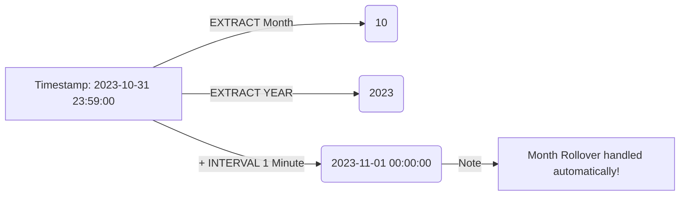
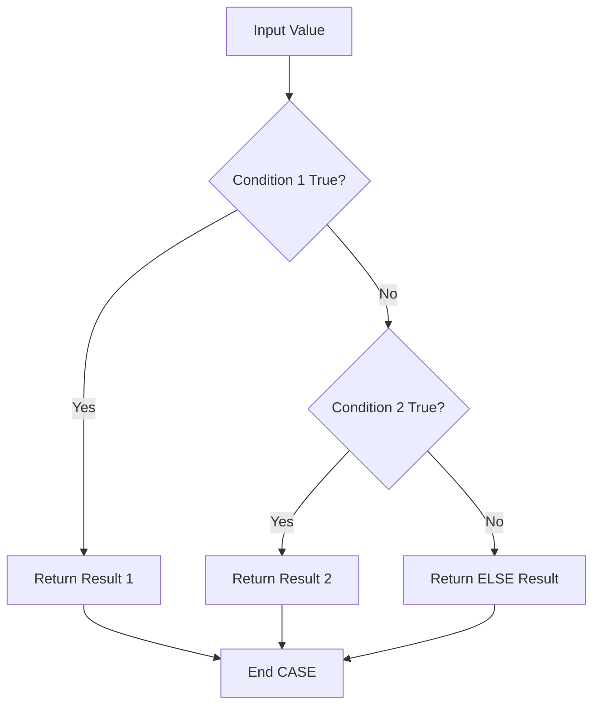

In the first two modules, we treated our data like fragile artifacts. We retrieved it (`SELECT`), we filtered it (`WHERE`), and we sorted it (`ORDER BY`), but we never really *changed* it. We simply moved it from the hard drive to the screen.

But raw data is rarely perfect.

- Names are messy ("john smith" vs. "John Smith").
- Prices need tax added.
- Dates are in computer format (`2023-10-27`), but your boss wants "October 27th."

In this module, we introduce **scalar functions**.

"Scalar" comes from linear algebra. It means "single value." A scalar function takes one **single input** (a single row's value) and produces **one single output**.

It does not summarize data. It transforms it.

## 3.1 Data Type Refresher
Before we start transforming data, we must respect what *kind* of data we are holding.

In a spreadsheet (like Excel), a cell is just a bucket. You can type "Hello" in cell A1 and then type the number 500 in cell A2. The spreadsheet doesn't care.

SQL cares. SQL cares a lot.

Every column in a database table has a strict **data type**. If a column is defined as an `INTEGER`, you cannot put "Hello" inside it. The database will reject it to protect the data integrity.

While there are dozens of types, as a beginner, you only need to worry about the "big three" categories.

### 1. Strings (Text)

- **What they are**: Characters, words, sentences, or even phone numbers (if you don't do math on them).
- **Common Names**:
    - `VARCHAR(n)`: Variable characters. The standard text box. The `n` is the maximum limit (e.g., `VARCHAR(50)` has a 50 character maximum size).
    - `CHAR(n)`: Fixed character. Rare. Used for fixed codes like abbreviations.
    - `TEXT`: Infinite length. For paragraphs or blog posts.
- **The Rule**: Always wrap strings in **single quotes** (`'text'`).

### 2. Numerics (Numbers)

- **What they are**: Values you can do math on (`+`, `-`, `/`, `*`).
- **Common Names**:
    - `INT` / `INTEGER`: Whole numbers. (1, 500, -99). No decimals allowed.
    - `DECIMAL` / `NUMERIC`: Exact decimals. Used for money. (`10.50`, `99.99`).
    - `FLOAT` / `REAL`: Approximate decimals. Used for science (`3.14159...`). *Never use these for money, or you will lose pennies to rounding errors.*
- **The Rule**: Never use quotes. Just type the number (`100`, not `'100'`).

### 3. Dates and Times

- **What they are**: Points in time.
- **Common Names**:
    - `DATE`: Just the calendar day (`YYYY-MM-DD`).
    - `TIME`: Just the clock (`HH:MM:SS`).
    - `TIMESTAMP` / `DATETIME`: Both combined (`YYYY-MM-DD HH:MM:SS`).
- **The Rule**: They are entered as strings (`'2023-01-01'`), but the database converts them into a special internal format for sorting and calculation.

### Why This Matters Now?
We are about to learn functions that transform data.

- You cannot use a math function like `ROUND()` on a text string like `'Apple'`.
- You cannot use a string function like `UPPER()` on a math calculation without understanding the result.

If you try to jam the wrong puzzle piece into the function, SQL will throw a **type error**.

!!! example "Analogy: The Blender"

    Scalar functions are like blenders.

    - If you put fruit in, you get a smoothie.
    - If you put a rock in, you break the blender.
    
    You must know if your column holds fruit (strings) or rocks (numbers) before you press the button.

## 3.2 String Functions
Text data is rarely clean. Users type their name in all caps ("JOHN"), no caps ("john"), or with weird spacing. Product codes get mashed together. Phone numbers come in with dashes, dots, or parentheses.

If `SELECT` is our way of reading the book, **string functions** are our red pen. They allow us to rewrite, reformat, and clean the text on the fly before it hits the report.

### 1. Gluing Text (`CONCAT`)
The most common string operation is sticking two pieces together. In the database world, this is called **concatenation**.

Imagine you have `first_name` ('Ada') and `last_name` ('Lovelace'), but your report needs a 'Full Name' column.

There are two ways to do this:

**The Function Way (`CONCAT`)**

```sql
SELECT CONCAT(first_name, ' ', last_name) AS full_name
FROM employees;
```

- **Input**: A list of strings separated by commas.
- **Output**: One single combined string.

**The Operator Way (`||`)**

Standard SQL uses the double-pipe operator `||` to glue strings. (*Note: If you are using SQL Server, you use `+`. Everyone else uses `//`).

```sql
SELECT first_name || ' ' || last_name AS full_name
FROM employees;
```

!!! warning "The NULL Contamination"

    Remember how `NULL` is a virus?

    - `'Ada' || NULL` results in `NULL`
    - If an employee has no last name, their entire full name disappears.
    - Many modern `CONCAT()` implementations (like in PostgreSQL) are "NULL-safe"; they treat NULL as an empty string. The `||` operator *is usually not*.
  
### 2. Changing Cases (`UPPER` / `LOWER`)
Users are inconsistent. Some sign up as `User@example.com`, others as `user@example.com`. To the computer, these are entirely *different* strings.

To compare them safely, we typically "normalize" the data by forcing it all to one casing.

- `UPPER(string)`: TURNS EVERYTHING TO CAPS.
- `LOWER(string)`: turns everything to lowercase.

```sql
-- Search for a user regardless of how they typed their email.
SELECT * FROM users
WHERE LOWER(email) = 'ada@example.com';
```

By lowercasing the column *before* comparing it, we ensure a match even if the user saved their email as `Ada@Example.COM`.

### 3. Slicing Text (`SUBSTRING`)
Occasionally you only want a piece of the text. Maybe you want just the year from a string like `2023-XYZ`, or just the first initial of a name.

We use `SUBSTRING` (sometimes abbreviated `SUBSTR`).

**Syntax**: `SUBSTRING(value, start_position, length)`

```sql
SELECT 
    first_name
    SUBSTRING(first_name, 1, 1) AS initial
FROM employees;
```

**Output**:

| first_name | initial |
|:---|:---|
| Ada | A |
| Grace | G |

- `1`: Start at the 1st character. (Note SQL is 1-indexed, not 0-indexed like Python. We start counting at 1 instead of 0).
- `1`: Take 1 character.

### 4. Measuring Text (`LENGTH`)
How long is a string? This is useful for validation (e.g., ensuring a ZIP code is 5 digits) or data cleaning.

```sql
SELECT
    product_name,
    LENGTH(product_name) AS character_count
FROM products;
```

!!! warning "Whitespace Counts"

    `LENGTH('A ')` is 2. That invisible space at the end counts as a character.

### 5. Cleaning Text (`REPLACE`)
This function acts like the "Find and Replace" tool in a word processor. It scans a string for a specific pattern and swaps it for something else.

**Syntax**: `REPLACE(text, target, replacement)`

**Scenario**: We have phone numbers stored as `555-0199`, but our autodialer software requires just numbers `5550199`. We need to remove the dashes.

```sql
SELECT
    phone_number,
    REPLACE(phone_number, '-', '') AS clean_number
FROM customers;
```

- **Target**: `'-'` (the dash).
- **Replacement**: `''` (an empty string).
- **Result**: The dash is removed effectively.

### Putting it All Together (Nesting)
The true power of scalar functions is that they can be **nested**. You can put the result of one function directly into another.

**Scenario**: Generate a username by taking the first letter of the first name, the full last name, and forcing it all to lowercase.

```sql
SELECT 
    LOWER(
        CONCAT(
            SUBSTRING(first_name, 1, 1),
                last_name
            )
        ) AS generated_username
FROM employees;
```

**How SQL Solves This**:

1. **Innermost**: `SUBSTRING` extracts 'A' from 'Ada'.
2. **Middle**: `CONCAT` glues 'A' + 'Lovelace' --> 'ALovelace'.
3. **Outermost**: `LOWER` turns 'ALovelace' --> 'alovelace'.

## 3.3 Numeric Functions
Data science is, at its heart, math. But raw mathematical output is often ugly.

If you calculate the average sales price of a widget, the computer might happily hand you back `19.49999999245`. If you print that on a customer's invoice, they will think your system is broken.

Numeric functions allow us to "groom" our numbers. We use them to round currency, force values to integers, or simply clean up the result of a division.

### 1. Basic Arithmetic (`+`, `-`, `*` , `/`, `%`)
Before we get to functions, a brief reminder that you can do standard math directly in your `SELECT` clause.

```sql
SELECT
    product_name,
    price,
    price * 0.9 AS discounted_price,
    price + 5 AS price_with_shipping
FROM products;
```

!!! warning "Integer Division"

    In some older SQL databases (and some programming languages), dividing two integers yields an integer.

    - `SELECT 3 / 2` might result in `1`, not `1.5`.
    - To be safe, always add a decimal point to one number: `SELECT 3.0 / 2`.
  
### 2. Rounding (`ROUND`)
This is the most essential function for financial data. It uses standard rounding rules (0-4 down, 5-9 up).

**Syntax**: `ROUND(number, decimal_places)`

```sql
SELECT ROUND(15.729, 2); -- 15.73
SELECT ROUND(15.729, 0); -- 16.0
```

- If you omit the second argument, it usually rounds to the nearest whole number.

### 3. Floor and Ceiling (`FLOOR`, `CEILING`)
Occasionally you don't want "nearest." Occasionally you want to force a number in a specific direction.

- `FLOOR(number)`: Returns the largest integer *less than or equal to* the input. (Always rounds **down**).
- `CEILING(number)` (or `CEIL`): Returns the smallest integer *greater than or equal to* the input. (Always rounds **up**).

**Scenario**: You are calculating how many shipping boxes you need. You have 101 items, and each box holds 10. `10 / 10 = 10.01` boxes. You cannot buy `0.1` boxes. You require 11 boxes. Standard `ROUND` would give you 10 (leaving one item on the floor). You must use `CEILING`.

```sql
SELECT CEILING(10.1); -- Returns 11
```

**Scenario**: You are calculating age based on years. If someone has lived 29.9 years, they are still "29" until their birthday. You must use `FLOOR`.

```sql
SELECT FLOOR(29.9); -- Returns 29
```

### 4. Absolute Value (`ABS`)
The `ABS` function removes the negative sign from a number. It gives you the "magnitude" or distance from zero.

This is useful for calculating **deviation** or difference. If you want to know how far off a prediction was, you don't care if it was over (+5) or under (-5); you just care that the error was 5.

```sql
SELECT ABS(-100); -- Returns 100
SELECT ABS(50 - 100); -- Returns 50
```

### 5. The Modulo Operator (`MOD` or `%`)
This function returns the **remainder** of a division.

- `10 / 3` is "3 with a remainder of 1".
- Therefore, `MOD(10, 3)` is `1`.

In Postgres and standard SQL, this is usually a function `MOD(a, b)` or an operator `%`.

**Why is this useful?** It is perfect for finding "Every Nth item." If you want to sample every 3rd row, you can check if the ID is divisible by 3.

```sql
-- Select rows where the ID is perfectly divisible by 3
SELECT *
FROM orders
WHERE MOD(order_id, 3) = 0;
```

## 3.4 Date and Time Functions
Welcome to the most difficult part of data engineering.

Strings are easy; "A" is always "A". Numbers are also easy; 1 is always 1. Time is hard.

- Months have 28, 29, 30, or 31 days.
- Years have 365 or 366 days.
- Timezones change. Daylight Saving Time deletes or adds an hour arbitrarily.

If you try to do date math yourself (e.g., subtracting `2023-01-01` from `2023-02-01`), you have to write code to handle leap years, month lengths, and gravity.

Luckily, SQL handles this for you.

### 1. How SQL Sees Time
To you, a date looks like `'2023-12-25'`. To the computer, a date is just a **number**.

Specifically, most databases store dates as the number of milliseconds (or days) that have passed since a specific reference point, usually **January 1, 1970** (The Unix Epoch).

This is why we can sort dates. We aren't sorting strings; we are sorting integers.

- `1970-01-02 > 1970-01-01` because `86400` (seconds) is greater than `0`.

### 2. Getting the Current Time (`NOW`, `CURRENT_DATE`)
First, we often need to know, "When is *now*?" This is used for timestamps on orders or calculating "Time since X."

- `CURRENT_DATE`: Returns just today (`2023-10-27`)
- `CURRENT_TIME`: Returns just the clock (`14:30:00`).
- `NOW()` (or `GETDATE()` in SQL Server): Returns both (`2023-10-27 14:30:00`).

```sql
SELECT NOW();
```

### 3. Extracting Parts (`DATE_PART` / `EXTRACT`)
Often, your manager isn't concerned about the exact millisecond an order was placed. They just want to know, "How many orders did we get in **October**?"

To do this, we need to rip the "Month" part out of the date.

**Syntax**: `EXTRACT(part FROM date_column)`

```sql
SELECT
    order_id,
    order_date,
    EXTRACT(YEAR FROM order_date) AS order_year,
    EXTRACT(MONTH FROM order_date) AS order_month
FROM orders;
```

**Common Parts**: `YEAR`, `MONTH`, `DAY`, `HOUR`, `MINUTE`, `SECOND`, `DOW` (Day of week).

!!! info "Dialect Cheat Sheet: Year Extraction"

    - **Postgres**: `EXTRACT(YEAR FROM column)` or `DATE_PART('year', column)`
    - **SQL Server**: `DATEPART(year, column)` or `YEAR(column)`
    - **MySQL**: `YEAR(column)`

### 4. Date Math (`DATE_ADD` / Interval Arithmetic)
"Return **all** users who signed up in the last 7 days." "When will this subscription expire (30 days from now)?"

You cannot simply say `date + 7`. Does 7 mean days? Hours? Years? You must be explicit.

In standard SQL (Postgres), we use **intervals**.

```sql
-- What is the date 7 days from now?
SELECT NOW() + INTERVAL '7 days';

-- Who signed up in the last week?
SELECT * FROM users
WHERE signup_date > NOW() - INTERVAL '1 week';
```

In other dialects (SQL Server/MySQL), you use a function like `DATEADD`: `DATEADD(day, 7, GETDATE())`.

### 5. Calculating Differences (`AGE` / `DATEDIFF`)
"How long did it take to ship this order?" This requires subtracting the `ship_date` from the `order_date`.

In Postgres:
```sql
SELECT
    order_id,
    AGE(ship_date, order_date) AS time_taken
FROM orders;
```

*Result: `2 days 04:00:00`*

### Visualizing the Flow
It helps to think of date functions as a disassembly/reassembly line.



## 3.5 Data Type Conversion (Casting)
In a perfect world, numbers are always stored as integers, and dates are always stored as timestamps.

In the real world, you are often given a CSV file from the marketing department where the "Price" column contains text like "$100" or the "Date" column looks like "10/27/2023".

If you try to sum that "Price" column, the database engine will yell at you. It sees a text string. It doesn't know how to add the word "Hello" to the word "World," so it certainly won't add "$100" to "$50".

To fix this, we need to force the data to change its identity. We need **casting**.

### The Standard Way (`CAST`)
The ANSI SQL standard (the syntax that works on almost every database) uses the `CAST` function. It is verbose, but it is clear.

**Syntax**: `CAST(column_name AS target_type)`

```sql
SELECT
    product_name,
    CAST(stock_quantity AS INTEGER) * 2 AS projected_stock
FROM inventory;
```

In this example, `stock_quantity` might have been stored as text (e.g., `'50'`). The `CAST` function rips off the quotes, inspects the number inside, and turns it into a raw integer `50` before multiplying it.

### The Postgres Way (`::`)
Since we are using PostgreSQL for our labs, you get access to one of the most beloved shortcuts in the database world: the **double colon operator**.

It does the same thing as `CAST`, but it is much faster to type and easier to read, especially when doing math.

**Syntax**: `value::type`

```sql
-- Standard SQL
SELECT CAST('100' AS INTEGER) + CAST('50' AS INTEGER);

-- Postgres Style
SELECT
    order_id,
    total_amount::NUMERIC * 0.10 AS tax_value
FROM orders;
```

!!! tip "Cheat Sheet: Common Target Types"

    When casting in Postgres, these are the types you will use most often:

    - `::INTEGER`: For whole numbers.
    - `::NUMERIC` (or `::DECIMAL`): For precise money math.
    - `::FLOAT`: For scientific/approximate math.
    - `::TEXT` (or `::VARCHAR`): To turn numbers back into strings.
    - `::DATE`: To turn a timestamp (`2023-01-01 14:00:00`) into just a day (`2023-01-01`).

### Explicit vs. Implicit Casting
Occasionally, the database tries to be helpful. This is called **implicit casting**.

If you write:

```sql
SELECT '100' + 5;
```

In some databases, this returns `105`. The engine looks at the `+`, realizes you want to do math, and quietly converts the string `'100'` into a number for you.

**Postgres is stricter than most**. Postgres will often throw an error: `operator does not exist: text + integer`. It refuses to guess your intention. It demands that you explicitly tell it what to do using `::` or `CAST`.

This strictness is a feature, not a bug. It prevents you from accidentally doing math on phone numbers or zip codes.

### Formatting Functions (`TO_CHAR`, `TO_DATE`)
Casting (`::`) works great when the data is clean.

- `'2023-01-01'::DATE` --> Works perfectly.

But what if your date is messy? What if your input is `'27/10/2023'` (European format) or `'October 27, 2023'`? If you try `'27/10/2023'::DATE`, Postgres might throw an error because it doesn't know if `27` is the month or the day (and there is no 27th month).

For these cases, we need **formatting functions**. We tell the database engine exactly what pattern to look for.

### 1. Parsing Text to Date (`TO_DATE`)
**Syntax**: `TO_DATE(text, pattern)`

```sql
SELECT TO_DATE('27/10/2023', 'DD/MM/YYYY');
```

- **Result**: `2023-10-27` (A proper date object).
- The pattern string tells the engine, "The first two digits are the day, then a slash, then the month...".

### 2. Formatting Numbers to Text (`TO_CHAR`)
This is essential for reporting. You have a raw number `1234.5`, but you want to display it as `$1,234.50`.

**Syntax**: `TO_CHAR(value, pattern)`

```sql
SELECT TO_CHAR(1234.5, 'FM$9,999.00');
```

- **Result**: `'$1,234.50'` (a string).
- `$`: adds the dollar sign.
- `,`: adds the comma separator.
- `00`: forces two decimal places (padding with zero if needed).

!!! warning "The Trap of `TO_CHAR`"

    Once you run `TO_CHAR`, your number becomes a **string**. You cannot do math on it anymore!

    - `TO_CHAR(price, '...') * 2` --> Error.
    - `TO_CHAR(price * 2, '...')` --> Correct.

    Always do your math *first* and format it *last*.

## 3.6 Conditional Logic (`CASE`)
In procedural programming (like Python, Java, or C), the most powerful tool you have is the `if` statement.

```python
# Python
if score > 90:
    grade = 'A'
elif score > 80:
    grade = 'B'
else:
    grade = 'C'
```

In SQL, we don't have an `IF` statement that controls the flow of the code (at least, not inside a `SELECT` query). Instead, we have an expression called `CASE`.

The `CASE` expression allows you to create new categories on the fly based on your data. It lets you turn continuous numbers (like test scores) into meaningful buckets (like letter grades).

### The Syntax
The `CASE` statement has a very specific rhythm. It opens with `CASE` and must always close with `END`.

```sql
CASE
    WHEN condition_1 THEN result_1
    WHEN condition_2 THEN result_2
    ELSE result_3
END
```

Let's apply this to our `orders` table. Imagine we want to categorize orders based on their total value.

```sql
SELECT
    order_id,
    total_amount,
    CASE
        WHEN total_amount > 1000 THEN 'High Value'
        WHEN total_amount > 500 THEN 'Medium Value'
        ELSE 'Low Value'
    END AS order_category
FROM orders;
```

**Output**:

| order_id | total_amount | order_category |
|:---|:---|:---|
| 101 | 1200.00 | High Value |
| 102 | 550.00 | Medium Value |
| 103 | 25.00 | Low Value |

### How it Works (The "Exit Ramp")
The `CASE` statement evaluates strictly from **top to bottom**. As soon as it finds a `TRUE` condition, it grabs that result and **stops looking**. It exits the `CASE` immediately.

This is critical for logic.

**Bad Logic**:

```sql
CASE
    WHEN total_amount > 500 THEN 'Medium Value' -- Logic error!
    WHEN total_amount > 1000 THEN 'High Value' -- This will never happen
    ELSE 'Low Value'
END
```

*Why is this bad?* If an order is $2000, it is technically greater than 500. The first condition triggers, the label becomes 'Medium Value,' and the database stops checking. The $2000 order never gets a chance to be checked against the greater than 1000 rule.

!!! tip "Best Practice: The Funnel"

    When working with numeric ranges, always write your logic from **most specific** to **least specific**.

    - Start with the outlier (the biggest number).
    - Work your way down.

### Handling NULLs with `CASE`
You can use `CASE` to fix data quality issues. If a column has `NULL` values, you can swap them out for a default label.

```sql
SELECT
    product_name,
    CASE
        WHEN category IS NULL THEN 'Uncategorized'
        ELSE category
    END AS clean_category
FROM products;
```

This is so common that SQL provides a dedicated shortcut function for it called `COALESCE` (which we will see in a moment).

### Binary Flags (1 and 0)
One of the most powerful uses of `CASE` is creating "Flags" for data analysis. Instead of returning text like "High" or "Low", you return `1` or `0`.

This becomes a superpower when we reach the next chapter. It allows you to count specific things without filtering the whole table.

```sql
SELECT
    order_id,
    CASE WHEN status = 'Shipped' THEN 1 ELSE 0 END AS is_shipped,
    CASE WHEN status = 'Returned' THEN 1 ELSE 0 END AS is_returned
FROM orders;
```

### The Shortcuts (`COALESCE` and `NULLIF`)
Writing a full `CASE` statement just to handle a `NULL` is tedious. SQL gives us two specific functions to handle conditional logic involving NULLs.

**1. `COALESCE` (The Backup Plan)**

This function takes a list of arguments and returns the **first non-null value** it finds. It is perfect for filling in blanks.

**Syntax**: `COALESCE(val1, val2, val3, ...)`

```sql
-- If phone_home is NULL, try phone_work. if that is NULL, use 'No Phone'
SELECT
    name,
    COALESCE(phone_home, phone_work, 'No Phone') AS contact_number
FROM employees;
```

**2. `NULLIF` (The Safety net)**

This function compares two values. if they are equal, it returns `NULL`. If they are *different*, it returns the first value.

**Why would you want to create NULLs?** To prevent **division by zero** errors.

If you try `SELECT 100 / 0`, SQL will crash with an error. If you try `SELECT 100 / NULL`, SQL returns `NULL` (no crash).

```sql
SELECT total_sales / NULLIF(total_orders, 0) AS average_order_value
FROm monthly_stats;
```

- If `total_orders` is 0, `NULLIF(0, 0)` returns `NULL`.
- The division becomes `total_sales / NULL`.
- The result is `NULL` (safe), instead of a crash.

### Visualizing the Logic



## Quiz

<quiz>
What is the defining characteristic of a 'scalar' function in SQL?
- [x] It takes a single input value from a single row and produces a single output value.
- [ ] It effectively deletes duplicate rows from the result set.
- [ ] It takes a list of values and returns a single summary (like an average).
- [ ] It permanently alters the data stored in the database table.

</quiz>

<quiz>
What is the result of the query `SELECT SUBSTRING('Database', 1, 4)`?
- [ ] `Datab`
- [ ] An error message.
- [ ] `data`
- [x] `Data`

</quiz>

<quiz>
You are calculating how many shipping boxes are needed. You have 10.1 items worth of product. Which function ensures you get the required 11 boxes?
- [ ] `FLOOR(10.1)`
- [ ] `ABS(10.1)`
- [ ] `ROUND(10.1)`
- [x] `CEILING(10.1)`

</quiz>

<quiz>
The output of `TO_CHAR(price, '$99.00')` is a number that can be immediately used for further multiplication.
- [ ] True
- [x] False

</quiz>

<quiz>
Review the following logic. What value is returned if `total_score` is 600?

```sql
CASE
    WHEN total_score > 100 THEN 'Level 1'
    WHEN total_score > 500 THEN 'Level 2'
    ELSE 'Level 3'
END
```

- [ ] 'Level 3'
- [ ] It throws a syntax error.
- [x] 'Level 1'
- [ ] 'Level 2'

</quiz>

<quiz>
Which function is best suited for replacing `NULL` values with a default backup value?
- [ ] `REPLACE()`
- [ ] `IS NULL`
- [ ] `NULLIF()`
- [x] `COALESCE()`

</quiz>

<quiz>
Which PostgreSQL-specific operator is used to cast data types (e.g., turning a string into an integer)?
- [ ] `->`
- [x] `::`
- [ ] `||`
- [ ] `=>`

</quiz>

<quiz>
What is the result of the expression `'10' + 5` in a strict SQL environment like PostgreSQL?
- [ ] `'105'`
- [x] An error
- [ ] `NULL`
- [ ] `15`

</quiz>

<quiz>
Which function allows you to calculate the difference between two timestamps, such as finding out how long it took to ship an order?
- [ ] `TO_DATE()`
- [ ] `NOW()`
- [ ] `EXTRACT()`
- [x] `AGE()` or `DATEDIFF()`

</quiz>

<quiz>
Why is `CAST('abc' AS INTEGER)` likely to fail?
- [x] Because the content 'abc' cannot be converted into a numerical value.
- [ ] Because you must use `TO_CHAR` for casting integers.
- [ ] It will actually succeed and return 0.
- [ ] Because 'abc' is not a valid text string.

</quiz>

<!-- mkdocs-quiz results -->

## Lab
Please complete module 3's labs in the companion GitHub repository.

## Lab Solutions

!!! warning "Don't Cheat Yourself"

    Before viewing any of the solutions below, please ensure you have given the challenge an honest try. The worst thing you can do to yourself while learning is to not "accept the struggle." The struggle is what cements the information. Discovering the answer through trial and error is the only way to truly learn.

??? note "Challenge 1 Solution"

    ```sql
    SELECT 
        customer_id,
        UPPER(customer_city) AS standardized_city
    FROM customers;
    ```

??? note "Challenge 2 Solution"

    ```sql
    SELECT
        product_id,
        product_weight_g,
        ROUND(product_weight_g / 1000, 1) AS weight_kg
    FROM products;
    ```

??? note "Challenge 3 Solution"

    ```sql
    SELECT
        order_id,
        order_purchase_timestamp,
        EXTRACT(YEAR FROM order_purchase_timestamp) AS order_year
    FROM orders;  
    ```

??? note "Challenge 4 Solution"

    ```sql
    SELECT
        seller_id,
        CONCAT(LOWER(seller_city), '-', seller_state) AS seller_slug
    FROM sellers;
    ```

??? note "Challenge 5 Solution"

    ```sql
    SELECT
        customer_id,
        SUBSTRING(customer_unique_id, 1, 5) AS masked_unique_id
    FROM customers;
    ```

??? note "Challenge 6 Solution"

    ```sql
    SELECT
        order_id,
        AGE(order_approved_at, order_purchase_timestamp) AS approval_time
    FROM orders;
    ```

??? note "Challenge 7 Solution"

    ```sql
    SELECT
        product_id,
        product_height_cm,
        CEILING(product_height_cm / 10) * 10 AS required_box_height
    FROm products;
    ```

??? note "Challenge 8 Solution"

    ```sql
    SELECT
        order_id,
        order_delivered_customer_date,
        CASE
            WHEN order_delivered_customer_date IS NULL THEN 'In Transit'
            ELSE 'Delivered'
        END AS delivery_status_label
    FROM orders;
    ```

??? note "Challenge 9 Solution"

    ```sql
    SELECT
        order_id,
        price,
        TO_CHAR(price, 'R$9,9999.00') AS price_formatted
    FROM order_items;
    ```

??? note "Challenge 10 Solution"

    ```sql
    SELECT
        product_id,
        product_weight_g,
        CASE
            WHEN product_weight_g < 1000 THEN 'Light'
            ELSE 'Heavy'
        END AS weight_cateogry
    FROM products;
    ```

??? note "Challenge 11 Solution"

    ```sql
    SELECT
        order_id,
        EXTRACT(DAY FROM (order_delivered_customer_date - order_delivered_carrier_date)) AS transit_days
    FROM orders;
    ```

??? note "Challenge 12 Solution"

    ```sql
    SELECT
        product_category_name,
        REPLACE(product_category_name, '_', ' ') AS readable_category
    FROM products;
    ```

??? note "Challenge 13 Solution"

    ```sql
    SELECT
        product_id,
        (product_length_cm * product_height_cm * product_width_cm) AS product_volume_cm3
    FROM products;
    ```

??? note "Challenge 14 Solution"

    ```sql
    SELECT
        order_id,
        order_delivered_customer_date,
        order_estimated_delivery_date,
        CASE
            WHEN order_delivered_customer_date IS NULL OR order_estimated_delivery_date IS NULL THEN 'Pending'
            WHEN order_delivered_customer_date > order_estimated_delivery_date THEN 'Late'
            ELSE 'On Time'
        END AS delivery_performance
    FROM orders;
    ```

??? note "Challenge 15 Solution"

    ```sql
    SELECT
        customer_id,
        customer_zip_code_prefix,
        CASE
            WHEN LENGTH(customer_zip_code_prefix) = 5 THEN 'Valid'
            ELSE 'Check'
        END AS is_valid_length
    FROM customers;
    ```

??? note "Challenge 16 Solution"

    ```sql
    SELECT
        order_id,
        order_item_id,
        freight_value / NULLIF(price, 0) AS freight_ratio
    FROM order_items;
    ```

??? note "Challenge 17 Solution"

    ```sql
    SELECT
        order_id,
        order_purchase_timestamp,
        EXTRACT(MONTH FROM order_purchase_timestamp) AS purchase_month
    FROM orders;
    ```

??? note "Challenge 18 Solution"

    ```sql
    SELECT
        product_id,
        product_weight_g,
        CASE
            WHEN product_weight_g < 500 THEN 'Small Packet'
            WHEN product_weight_g BETWEEN 500 AND 2000 THEN 'Parcel'
            ELSE 'Cargo'
        END AS shipping_mode
    FROM products;
    ```

??? note "Challenge 19 Solution"

    ```sql
    SELECT
        seller_id,
        seller_city
    FROM sellers
    WHERE LENGTH(seller_city) > 20;
    ```

??? note "Challenge 20 Solution"

    ```sql
    SELECT
        LOWER(customer_id) AS customer_id,
        customer_zip_code_prefix::INTEGER AS zip_int,
        UPPER(customer_state) AS customer_state
    FROM customers
    WHERE customer_state = 'SP';
    ```