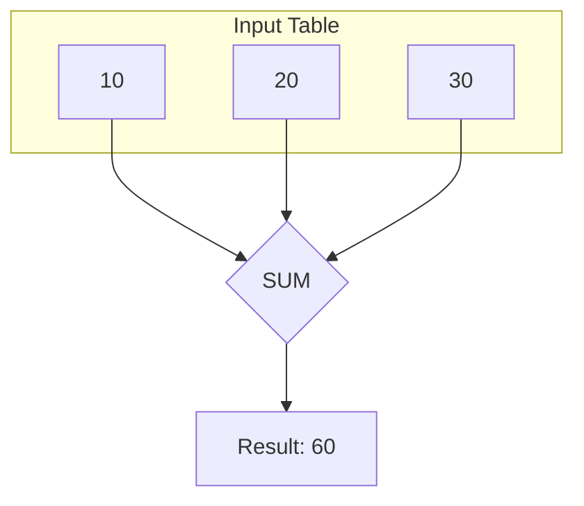
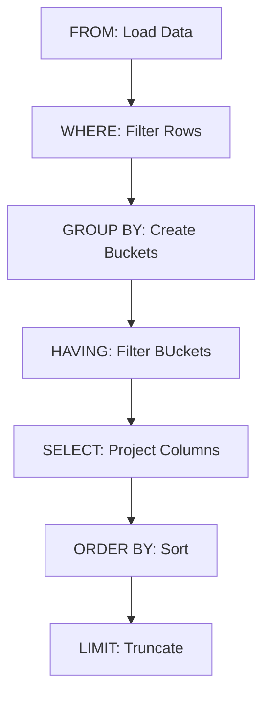

Until now, every query we have written has been **row-oriented**. If you had 1,000 orders in the database and you ran `SELECT *`, you got 1,000 lines of output. If you used `CASE` to calculate a tax, you got 1,000 tax calculations.

You have been looking at individual trees. Now, we are going to look at the forest.

**Aggregation** is the process of taking many rows and squashing them down into a single number. It is how we answer the "big picture" questions:

- "How much money did we make?"
- "How many users signed up today?"
- "What is the maximum price in our catalog?"

## 4.1 Aggregate Functions
Aggregate functions are special. Unlike the scalar functions from module 3 (which take one input and give one output), aggregate functions take **an entire column** of data as input and spit out a **single scalar value**.

### 1. Counting Rows (`COUNT`)
The most fundamental question in data analysis is *"How many?"*

`COUNT(*)` vs. `COUNT(column)`

There are two ways to count, and the difference is subtle but critical.

- `COUNT(*)`: Counts the **rows**. It doesn't care what is inside them. It doesn't care if there are NULLs. It just counts how many records exist.
- `COUNT(column_name)`: Counts the **non-null values** in that specific column.

**Scenario**: We have an `employees` table with 10 people. 2 of them have no phone number (`NULL`).

```sql
-- How many employees do we have?
SELECT COUNT(*) FROM employees;
-- Result: 10

-- How many employees have a phone number?
SELECT COUNT(phone_number) FROM employees;
-- Result: 8
```

!!! warning "The Performance Myth"

    You might hear rumors that `COUNT(id)` is faster than `COUNT(*)`. In modern databases (like PostgreSQL), `COUNT(*)` is highly optimized. Use `COUNT(*)` unless you specifically need to exclude NULLs.


### 2. Summation (`SUM`)
This is used for adding up numbers. It works exactly like the SUM function in Excel (if you are familiar).

```sql
SELECT SUM(total_amount) AS total_revenue
FROM orders;
```

If you try to `SUM` a text column (like `first_name`), the database will throw an error: `You can't add 'Ada' + 'Grace'.`

### 3. Averages (`AVG`)
This calculates the arithmetic mean.

```sql
SELECT AVG(price) AS average_price
FROM products;
```

**The `AVG` + `NULL` Trap**

Here is a dangerous interview question:

- You have a table with 3 rows: `10`, `NULL`, `20`.
- What is the average?

**Math A**: (10 + 0 + 20) / 3 = 10. **Math B**: (10 + 20) / 2 = 15.

**SQL chooses Math B**. Aggregate functions **ignore NULLs completely**. They don't treat them as zero; they pretend they don't exist. The `NULL` row is removed from both the numerator (sum) and the denominator (count).

If you want to treat NULLs as zero, you must fix the data first using `COALESCE`.

```sql
-- Treat NULL as 0
SELECT AVG(COALESCE(score, 0)) FROM tests;
```

### 4. Extremes (`MIN` and `MAX`)
These find the outliers

```sql
SELECT 
    MIN(price) AS cheapest_item,
    MAX(price) AS most_expensive_item
FROM products;
```

Interestingly, `MIN` and `MAX` work on **text** and **dates** too!

- **Text**: `MIN` finds the value closest to 'A'. `MAX` finds the value closest to 'Z'.
- **Dates**: `MIN` finds the oldest date. `MAX` finds the most recent date.

```sql
-- When was the first order placed?
SELECT MIN(order_date) FROM orders;
```

### Visualizing the Collapse
It is helpful to visualize aggregation as a hydraulic press. It takes a tall stack of rows and crushes them into a single block.



### Mixing Aggregates and Non-Aggregates
This is the number one error beginners encounter.

**The Rule**: You cannot select an aggregate and a non-aggregate in the same query..unless you use `GROUP BY`.

- **Bad Query**:

```sql
SELECT product_name, MAX(price)
FROM products;
```

- **Why it fails**: `MAX(price)` wants to return **one** row (the highest price). `product_name` wants to return **all** rows (every name). The database cannot fit a list of 100 names into a single cell next to the max price.
- **Error Message**: `column "products.product_name" must appear in the GROUP BY clause or be used in an aggregate function".

We will solve this problem in the very next section.

## 4.2 The `GROUP BY` Clause
In the previous section, we learned how to smash an entire table into a single number. We could ask, "What is the total revenue of the company?" and get back `$1,000,000`.

But a business is rarely a monolith. The CEO doesn't just want to know the total; they want to know the total **per department**. They want the average salary **per job title**. They want the order count **per month**.

We need to tell the database, *"Don't just squash the whole table. First, sort the rows into piles. Then, squash each pile individually."*

This is the job of the `GROUP BY` clause.

### The Concept of "Bucketing"
Imagine you have a bag of M&Ms.

- **Aggregation (Without GROUP BY)**: You weigh the entire bag. Result: "100 grams."
- **Grouping**: You separate them by color. You put all the red ones in a pile, all the blue ones in a pile, etc.
- **Aggregation (With GROUP BY)**: You weigh each pile. Result: "Red: 20g, Blue: 30g, Green: 50g".

In SQL, the column you grouped by is the "color".

### Syntax in Action
Let's look at our `employees` table.

| id | name | department | salary |
|:---|:---|:---|:---|
| 1 | Ada | Engineering | 120k |
| 2 | Grace | Engineering | 130k |
| 3 | Alan | Research | 110k |
| 4 | Mary | HR | 90k |

If we want the average salary for each department:

```sql
SELECT
    department,
    AVG(salary) AS avg_salary
FROM employees
GROUP BY department;
```

**Output**:

| department | avg_salary |
|:---|:---|
| Engineering | 125,000 |
| Research | 110,000 |
| HR | 90,000 |

**What just happened?**

1. `FROM`: The database loaded the `employees` table.
2. `GROUP BY`: It looked at the `department` column. It saw three unique values: 'Engineering', 'Research', and 'HR'. It effectively split the table into three mini-tables.
3. `SELECT`: It ran the `AVG(salary)` function on each mini-table separately.

### The Golden Rule of Grouping
This is the most common error message in SQL. Memorize this rule.

!!! note "The Golden Rule"

    If you have a `GROUP BY` clause, **every column** in your `SELECT` list must be either.

    1. Part of the `GROUP BY` clause.
    2. Inside an aggregate function (`SUM`, `COUNT`, `MAX`, etc.).

**Why?** Let's try to break the rule:

```sql
-- BROKEN QUERY
SELECT
    department,
    name, 
    AVG(salary)
FROM employees
GROUP BY department;
```

Look at the Engineering group:

- **Department**: Engineering (easy, they are all the same).
- **Avg Salary**: 125k (Easy, it's a math calculation).
- **Name**: ... Who? Ada or Grace?

The database creates **one row** per group. It cannot fit two names (Ada and Grace) into that single cell. Because `name` is not grouped and not aggregated, the database refuses to run the query.

**Error Message**: `column "employees.name" must appear in the GROUP BY clause or be used in an aggregate function.`

### Grouping by Multiple Columns
You can create more specific buckets by grouping multiple columns. This creates a hierarchy.

**Scenario**: We want to count how many employees we have in each office location, broken down by gender.

```sql
SELECT
    office_location,
    gender,
    COUNT(*) AS staff_count
FROM employees
GROUP BY office_location, gender;
```

**Output**:

| office_location | gender | staff_count |
|:---|:---|:---|
| New York | F | 10 |
| New York | M | 8 |
| London | F | 5 |
| London | M | 6 |

The database finds every unique **combination** of location and gender and creates a bucket for it.

### Using Expressions in Group By
You aren't limited to raw columns. You can group by calculated values. This is incredibly powerful for time series analysis.

**Scenario**: We want to see total sales **per year**. Our table only has a full date (`2023-10-27`).

```sql
SELECT
    EXTRACT(YEAR FROM order_date) AS sales_year,
    SUM(total_amount) AS revenue
FROM orders
GROUP BY EXTRACT(YEAR FROM order_date)
ORDER BY sales_year;
```

!!! note 

    In Postgres and some other modern SQL dialects, you can simply `GROUP BY 1` or `GROUP BY sales_year` (the alias), but strict standard SQL, requires repeating the expressions.

### The Order of Execution (Updated)
We now have to slot `GROUP BY` into our mental model of the database engine.

1. `FROM`: Gather raw data.
2. `WHERE`: Filter rows (throw out individual trash).
3. `GROUP BY`: Sort remaining rows into piles.
4. `SELECT`: Calculate aggregates (`SUM`, `AVG`) for each pile.
5. `ORDER BY`: Sort the final summary.

This timeline reveals a critical limitation. Since `WHERE` runs before `GROUP BY`, you cannot filter groups using `WHERE`.

- *Question: "Show me departments with an average salary > 100k."*
- *Attempt: `WHERE AVG(salary) > 100000`* --> **FAIL**

Why? Because at step 2 (`WHERE`), the average hasn't been calculated yet! The database is still looking at individual employees.

To filter **after** grouping, we need a new clause. We need `HAVING`.

## 4.3 The `HAVING` Clause
In the previous section, we hit a wall. We successfully calculated the average salary per department, but when we tried to filter for only the high-paying departments, `WHERE` failed us.

The database threw an error because `WHERE` runs **too early**. It scans the raw rows before any grouping or math has happened. It cannot check the "Average Salary" because the average salary doesn't exist yet.

To filter **aggregated data**, we need a new keyword. We require `HAVING`.

### The Post-Aggregation Filter
Think of `HAVING` as the `WHERE` clause for groups.

- `WHERE`: Filters **rows** (before grouping).
- `HAVING`: Filters **groups** (*after* grouping).

Let's solve the problem from the last section, *"Show me departments with an average salary greater than $100,000."*

```sql
SELECT
    department,
    AVG(salary) AS avg_salary
FROm employees
GROUP BY department
HAVING AVG(salary) > 100000;
```

**Output**:

| department | avg_salary |
|:---|:---|
| Engineering | 125,000 |
| Research | 110,000 |

*(HR is missing because its average was 90,000.)*

**How it Works**

1. `GROUP BY`: The database buckets the employees into departments.
2. **Aggregation**: It calculates the average salary for each bucket.
3. `HAVING`: It looks at the final result. It sees **HR** has 90,000. It checks the rule (`> 100000`). It discards the HR bucket.

### Using `WHERE` and `HAVING` Together
This is where you become a true SQL pro. You can, and often should, use both filters in the same query.

**Scenario**: We want to find departments with an average salary greater than 100000, **but** we would like to exclude interns from the calculation entirely.

1. **Row Filter (`WHERE`)**: Remove "interns" first.
2. **Group**: Bucket the remaining employees.
3. **Group Filter (`HAVING`)**: Check the average of the non-interns.

```sql
SELECT
    department,
    AVG(salary) AS avg_salary
FROm employees
WHERE title <> 'Intern'      -- Step 1: Filter rows
GROUP BY department          -- Step 2: Bucket
HAVING AVG(salary) > 100000; -- Step 3: Filter Groups
```

!!! abstract "The Party Invitation"

    - `WHERE`: The bouncer at the door. "You must be 21 to enter." (Filtering individuals).
    - `GROUP BY`: The guests mingle and form groups (the dancers, the drinkers, the talkers).
    - `HAVING`: The party host looks at the groups. "The dancers are too loud; please leave." (Filtering the group).

### The "Ambiguous Column" Trap
Just like with `GROUP BY`, you can only use `HAVING` on columns that are part of the group or the aggregate.

- **Bad Code**:

```sql
SELECT department, COUNT(*)
FROm employees
GROUP BY department
HAVING last_name = 'Smith'; -- Error
```

**Why**? The database has collapsed the 'Engineering' department into one row. Inside that group, there might be a Smith, a Jones, and a Doe. The group *as a whole* does not have a `last_name`. It only has a `department` name and a count.

### The Order of Execution (Finalized)
We now have the complete picture of how a standard SQL query runs. This is the **most important list** in this entire course. Memorize it.

1. `FROM`: Load the table.
2. `WHERE`: Filter the raw rows.
3. `GROUP BY`: Bucket the remaining rows.
4. `HAVING`: Filter the buckets
5. `SELECT`: Calculate/project the final columns.
6. `ORDER BY`: Sort the output.
7. `LIMIT`: Cut the list short.



## Quiz

<quiz>
You have a table with 5 rows. THe `phone_number` column is `NULL` for 2 of those rows. What is the result of `SELECT COUNT(phone_number) FROM table;`?
- [x] 3
- [ ] NULL
- [ ] 5
- [ ] 2

</quiz>

<quiz>
Calculate the result of `AVG(score)` for a column containing these three values: `10, NULL, 20`.
- [x] 15
- [ ] 10
- [ ] NULL
- [ ] 30

</quiz>

<quiz>
Why does the following query throw an error? `SELECT department, last_name, AVG(salary) FROM employees GROUP BY department;`
- [ ] You must use `SUM` before `AVG`.
- [ ] The `GROUP BY` clause must come after `ORDER BY`.
- [ ] You cannot aggregate salaries.
- [x] The `last_name` column is neither grouped nor aggregated.

</quiz>

<quiz>
The `MIN()` and `MAX()` functions only work on numeric data types.
- [ ] True
- [x] False

</quiz>

<quiz>
Which clause is designed specifically to filter data after it has been aggregated?
- [ ] `ORDER BY`
- [x] `HAVING`
- [ ] `LIMIT`
- [ ] `WHERE`

</quiz>

<quiz>
In the SQL order of execution, which step happens immediately before `GROUP BY`?
- [ ] `SELECT`
- [ ] `HAVING`
- [x] `WHERE`
- [ ] `ORDER BY`

</quiz>

<quiz>
You want to calculate the total sales per year. Your table has a `order_date` column. Which query is correct?
- [ ] `SELECT order_date, SUM(sales) FROM orders GROUP BY EXTRACT(YEAR FROM order_date)`
- [ ] `SELECT EXTRACT(YEAR FROM order_date), SUM(sales) FROM orders GROUP BY order_date`
- [ ] `SELECT SUM(sales) FROM orders WHERE order_date = 'Year'`
- [x] `SELECT EXTRACT(YEAR FROM order_date), SUM(sales) FROM orders GROUP BY EXTRACT(YEAR FROM order_date)`

</quiz>

<quiz>
What happens if you use `GROUP BY city, gender`?
- [ ] It throws an error because you can only group by one column at a time.
- [ ] It groups by city first, then sorts the results by gender.
- [x] It creates a unique bucket for every combination of city and gender.
- [ ] It creates one group for cities and a separate group for genders.

</quiz>

<quiz>
The query `SELECT * FROM table GROUP BY category` is valid standard SQL.
- [ ] True
- [x] False

</quiz>

<quiz>
Which of the following scenarios requires the `HAVING` clause?
- [x] Finding departments where the total salary payout exceeds $1 million.
- [ ] Finding employees with a specific job title.
- [ ] Finding orders placed yesterday.
- [ ] Finding customers who live in 'France'.

</quiz>

<!-- mkdocs-quiz results -->

## Lab
Please complete module 43's labs in the companion GitHub repository.

## Lab Solutions

!!! warning "Don't Cheat Yourself"

    Before viewing any of the solutions below, please ensure you have given the challenge an honest try. The worst thing you can do to yourself while learning is to not "accept the struggle." The struggle is what cements the information. Discovering the answer through trial and error is the only way to truly learn.

??? note "Challenge 1 Solution"

    ```sql
    SELECT
        COUNT(*) AS total_orders
    FROM orders;
    ```

??? note "Challenge 2 Solution"

    ```sql
    SELECT
        SUM(price) AS total_revenue
    FROM order_items;
    ```

??? note "Challenge 3 Solution"

    ```sql
    SELECT
        AVG(freight_value) AS avg_freight
    FROM order_items;
    ```

??? note "Challenge 4 Solution"

    ```sql
    SELECT
        MIN(product_weight_g) AS min_weight,
        MAX(product_weight_g) AS max_weight
    FROM products;
    ```

??? note "Challenge 5 Solution"

    ```sql
    SELECT
        COUNT(DISTINCT seller_city) AS unique_seller_cities
    FROM sellers;
    ```

??? note "Challenge 6 Solution"

    ```sql
    SELECT
        COUNT(customer_id) AS total_customers,
        customer_state
    FROM customers
    GROUP BY customer_state
    ORDER BY total_customers DESC;
    ```

??? note "Challenge 7 Solution"

    ```sql
    SELECT
        COUNT(order_id) AS total_orders,
        order_status
    FROM orders
    GROUP BY order_status
    ORDER BY order_status;
    ```

??? note "Challenge 8 Solution"

    ```sql
    SELECT
        SUM(price) AS total_revenue,
        seller_id
    FROM order_items
    GROUP BY seller_id
    ORDER BY total_revenue DESC
    LIMIT 10;
    ```

??? note "Challenge 9 Solution"

    ```sql
    SELECT
        AVG(product_length_cm) AS length,
        AVG(product_height_cm) AS height,
        AVG(product_width_cm) AS width,
        product_category_name
    FROM products
    GROUP BY product_category_name;
    ```

??? note "Challenge 10 Solution"

    ```sql
    SELECT
        COUNT(order_id) AS total_orders,
        CAST(order_purchase_timestamp AS DATE) AS purchase_date
    FROM orders
    GROUP BY purchase_date
    ORDER BY purchase_date DESC;
    ```

??? note "Challenge 11 Solution"

    ```sql
    SELECT
        seller_id,
        COUNT(*) AS items_sold
    FROM order_items
    GROUP BY seller_id
    HAVING COUNT(*) > 50;
    ```

??? note "Challenge 12 Solution"

    ```sql
    SELECT
        SUM(price) AS total_price,
        order_id
    FROM order_items
    GROUP BY order_id
    HAVING SUM(price) > 500.00;
    ```

??? note "Challenge 13 Solution"

    ```sql
    SELECT
        seller_city,
        COUNT(seller_id) AS total_sellers
    FROM sellers
    GROUP BY seller_city
    HAVING COUNT(seller_id) >= 10
    ORDER BY total_sellers;
    ```

??? note "Challenge 14 Solution"

    ```sql
    SELECT
        product_category_name,
        AVG(product_weight_g) AS avg_weight
    FROM products
    GROUP BY product_category_name
    HAVING AVG(product_weight_g) > 2000;
    ```

??? note "Challenge 15 Solution"

    ```sql
    SELECT
        order_id,
        COUNT(*) AS item_count
    FROM order_items
    GROUP BY order_id
    HAVING COUNT(*) > 5;
    ```

??? note "Challenge 16 Solution"

    ```sql
    SELECT
        COUNT(*) AS total_sellers,
        seller_city
    FROM sellers
    WHERE seller_state = 'SP'
    GROUP BY seller_city
    HAVING COUNT(seller_id) > 5;
    ```

??? note "Challenge 17 Solution"

    ```sql
    SELECT
        COUNT(*) AS total_products,
        product_category_name
    FROM products
    WHERE product_category_name IS NOT NULL
    GROUP BY product_category_name;
    ```

??? note "Challenge 18 Solution"

    ```sql
    SELECT
        SUM(price) AS total_price,
        order_id
    FROM order_items
    WHERE EXTRACT(YEAR FROM shipping_limit_date) = 2018
    GROUP BY order_id;
    ```

??? note "Challenge 19 Solution"

    ```sql
    SELECT
        AVG(price) AS avg_price,
        order_id
    FROM order_items
    GROUP BY order_id
    HAVING AVG(price) > 100;
    ```

??? note "Challenge 20 Solution"

    ```sql
    SELECT
        product_category_name,
        AVG(product_weight_g) AS avg_weight
    FROM products
    WHERE product_category_name NOT LIKE 'a%'
    GROUP BY product_category_name
    HAVING AVG(product_weight_g) > 500
    ORDER BY avg_weight DESC;
    ```