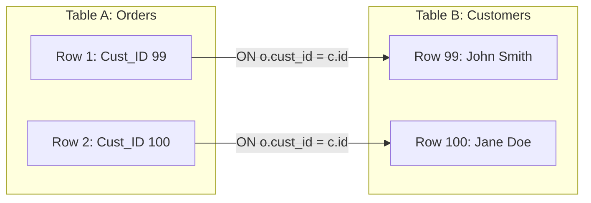
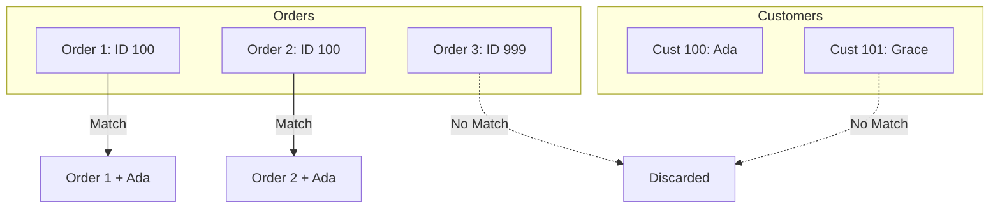
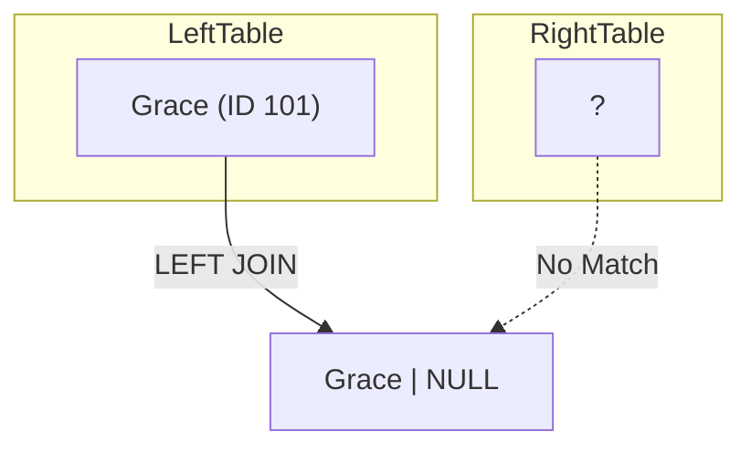

Up until now, our world has been small. We have been trapped inside a single table. We could analyze `employees` or `departments`, but we couldn't analyze them *together*.

This is a problem because in the real world (and specifically in **dimensional modeling**), we split data apart on purpose. We separate "Facts" (Orders) from "Dimensions" (Customers, Products) to avoid duplication. This is called **normalization**.

If you have 1,000 orders from "John Smith", you don't write "John Smith" 1,000 times in the Orders table. You write it once in the Customers table (ID 99, for example) and just put "99" in the Orders table.

**Joins** are the superglue that puts the puzzle back together.

## 5.1 Join Terminology & Aliasing
Before we write our first join, we need to understand the mechanics of the connection.

### The Hooks: Primary and Foreign Keys
To connect two tables, they must share a common language. One table must have a column that "points" to a column in another table.

- **Primary Key (PK)**: The unique identifier of a row in the parent table (e.g., `customers.customer_id`).
- **Foreign Key (FK)**: The reference to that ID in the child table (e.g., `orders.customer_id`).

We don't join tables based on "vibes." We join them where `Table_A.key = Table_B.key`.

### The Syntax: `JOIN` and `ON`
The grammar of a join is straightforward. You declare your first table, say you want to `JOIN` another table, and then explicitly state the connection logic using `ON`.

```sql
SELECT *
FROM orders
JOIN customers
ON orders.customer_id = customers.customer_id;
```

1. `FROM orders`: The left table.
2. `JOIN customers`: The right table.
3. `ON ...`: The bridge. We are telling the database, *"Match rows where the customer ID in the orders table equals the customer ID in the customers table."*

### Table Aliasing (The "Nickname")
In the query above, writing `orders.customer_id` and `customers.customer_id` is tedious. It gets even worse when you join 5 or 6 tables.

To save our fingers (and make the code more readable), we give tables temporary **aliases**.

```sql
SELECT
    o.order_id,
    c.first_name,
    c.last_name
FROM orders AS o
JOIN customers AS c
ON o.customer_id = c.customer_id;
```

- `orders AS o`: From now on, inside this query, `orders` is just `o`.
- `customers AS c`: `customers` is just `c`.

!!! note "Pro Tip: The `AS` is Optional"

    You will often see developers skip the `AS` keyword for table aliases: `FROM orders o JOIN customers c`. This is valid and very common.


### The Ambiguity Trap
Why did we type `o.order_id` instead of just `order_id`?

If a column name is unique (like `order_date` only exists in `orders`), you don't *technically* need the prefix. But if a column name exists in **both** tables, the database will panic.

Imagine both tables have a column simply named `id`.

```sql
SELECT id, name
FROM orders o
JOIN customers c
ON c.customer_id = o.customer_id;
```

**Error:** `Column reference "id" is ambiguous.`

The database is shouting, *"Which ID? The order's ID or the customer's ID? Be specific!"*

**Corrected**:
```sql
SELECT
    o.id,
    c.name
FROM ...
```

### Visualizing the Connection
Think of a join as a physical wiring process. You are taking a plug from table A and inserting it into the socket of table B.



## 5.2 The `INNER JOIN`
In the previous section, we established the "wiring" of a join; we use `ON` to connect a foreign key to a primary key.

Now we must decide: **What happens to the rows that don't match?**

- What happens to an Order `101` if the Customer ID `99` doesn't exist in the customer table?
- What happens to a Customer `Jane` if she has never placed an order?

This behavior depends on the *type* of join. The default, and most strict type, is the **inner join**.

### The Philosophy of "Intersection"
The `INNER JOIN` is the "intersection" of two sets. It follows a strict rule: **No Match, No Entry**.

If a row in table A cannot find a corresponding friend in table B, it is immediately discarded from the results. It effectively vanishes.

!!! abstract "The Handshake"

    Imagine two lines of people walking toward each other.

    - Line A: Orders looking for their owners.
    - Line B: Customers looking for their purchases.
  
    An `INNER JOIN` is a handshake. A result is only created when an Order successfully grabs the hand of a Customer.

    - If an Order reaches out and nobody is there (Invalid ID), that Order walks off the stage.
    - If a Customer stands there and nobody grabs their hand (No Purchases), that Customer walks off the stage.

    Only the **pairs** remain.

### Syntax in Action
If you simply type `JOIN` in SQL, the database assumes you mean `INNER JOIN`. They are synonymous.

Let's look at a concrete example using **Orders** and **Customers**.

**Table A: `Orders`**

| order_id | customer_id | amount |
|:---|:---|:---|
| 1 | 100 | $50 |
| 2 | 100 | $25 |
| 3 | 999 | $10 |

**Table B: `Customers`**

| customer_id | name |
|:---|:---|
| 100 | Ada |
| 101 | Grace |

Notice two issues:

1. **Order #3** has `customer_id 999`. There is no customer 999. (This is "dirty data" or an orphan record).
2. **Grace (101)** exists in customers, but she has no orders in the `Orders` table.

Let's run the join:

```sql
SELECT
    orders.customer_id,
    orders.amount,
    customers.name
FROM orders
INNER JOIN customers
ON orders.customer_id = customers.customer_id;
```

**Output**:

| order_id | amount | name |
|:---|:---|:---|
| 1 | $50 | Ada |
| 2 | $25 | Ada |

**What Happened?**

- **Ada (100)** matched order 1 and order 2. She appears twice (once for each match).
- **Order 3 (999)** was dropped. It failed to find a match.
- **Grace (101)** was dropped. She failed to find a match.

### Visualizing the Loss
It is vital to understand that an `INNER JOIN` is a **filter**. It naturally reduces your dataset by removing non-matching rows.



### When to Use `INNER JOIN`?
Because `INNER JOIN` discards data, you should use it when you only care about **complete** records.

- **Transactional Reporting**: *"Show me a list of all shipped orders and the address they went to."* (If an order has no address, we can't ship it, so we would rather not see it).
- **Authentication**: *"Show me the user profile for this login ID."* (If the login ID doesn't exist, we don't want a result).

!!! warning "The 'Missing Data' Panic"

    A common panic moment for beginners is running a query and seeing fewer rows than expected.

    - "I have 1,000 orders. Why does my query only show 980?"

    If you used an `INNER JOIN` to connect to the `customers` table, those missing 20 orders likely have invalid customer IDs (or NULLs). The `INNER JOIN` silently hid them from you.

### Filtering an Inner Join
You can still use `WHERE` clauses with joins. The `JOIN` happens first (connecting the tables), and the `WHERE` happens second (filtering the combined result).

```sql
SELECT
    o.order_id,
    c.name
FROM orders o
INNER JOIN customers c
ON o.customer_id = c.customer_id
WHERE c.name = 'Ada';
```

**Order of Operations Update**:

1. **FROM / JOIN**: Load `orders` and `customers`, bridge them, anddiscard non-matches.
2. **WHERE**: Filter the remaining pairs for 'Ada'.
3. **SELECT**: Project the columns.

## 5.3 The Outer Joins (`LEFT`, `RIGHT`, `FULL`)
In the previous section, we learned that the `INNER JOIN` is a strict gatekeeper. It throws away any row that doesn't have a perfect match.

But in the real world, "missing" data is actually very fascinating.

- "Show me customers **who have never bought anything**." (Marketing wants to send them a coupon).
- "Show me products **that have never sold**." (Inventory would like to clear them out).

If we use an `INNER JOIN`, these customers and products disappear. We need a join that is more forgiving. We require **outer joins**.

### 1. The `LEFT JOIN` (The Workhorse)
The `LEFT JOIN` (or `LEFT OUTER JOIN`) is arguably the most common join in professional data engineering.

It follows a simple rule: **"The left table is king."** The database keeps *every single* row from the table on the left side of the `JOIN` command.

- If it finds a match in the right table, it attaches it (just like an `INNER JOIN`).
- If it does **NOT** find a match, it attaches the row anyway and fills the "right" side with **NULLs**.

### Syntax and Direction
"Left" and "right" refer to the order you type the tables.

```sql
FROM table_A -- This is the LEFT table
LEFT JOIN table_B -- This is the RIGHT table
```

Let's look at our **Customers** and **Orders** again.

**Table A `Customers` (Left)**

| customer_id | name |
|:---|:---|
| 100 | Ada |
| 101 | Grace |

**Table B `Orders` (Right)**

| order_id | customer_id | amount |
|:---|:---|:---|
| 1 | 100 | $50 |

Notice: **Grace (101)** has no order.

```sql
SELECT
    c.name,
    o.amount
FROM customers c
LEFT JOIN orders o
ON c.customer_id = o.customer_id;
```

**Output**:

| name | amount |
|:---|:---|
| Ada | $50 |
| Grace | NULL |

Grace remains on the list! Because the database couldn't find an order for her, it just shrugged and put `NULL` in the `amount` column.

### Finding the "Non-Matches"
This behavior gives us a superpower. We can now filter for the "missing" items. If we want to find customers who have **never** placed an order, we simply look for the NULLs.

```sql
SELECT 
    c.name
FROM customers c
LEFT JOIN orders o
ON c.customer_id = o.customer_id
WHERE o.order_id IS NULL;
```

### 2. The `RIGHT JOIN`
The `RIGHT JOIN` is simply the mirror image. It says, **"The Right Table is King."** It keeps everything from the second table and fills the first table with NULLs if no match is found.

!!! note "The Left-Handed Scissors"

    You will rarely see `RIGHT JOIN` in production code. Why? Because English is read Left-to-Right. It is cognitively much easier to think "Start with Customers, then attach Orders" (`Customers LEFT JOIN Orders`) than "Attach Orders to Customers, but ensure we keep **all** Orders" (`Customers RIGHT JOIN Orders`).

    **Best Practice**: If you feel the urge to use a `RIGHT JOIN`, just flip the order of your tables and use a left join instead.

### 3. The `FULL OUTER JOIN`
This is the "all inclusive" join. It combines the logic of left and right joins.

**Rule**: Keep **everything** from table A and **everything** from table B.

- Matches are joined
- Left-only rows get NULLs on the right.
- Right-only rows get NULLs on the left.

**Scenario**: Locating data integrity issues. Imagine you have an old `legacy_users` table and a new `current_users` table. You want to see:

1. Users who moved to the new system (match).
2. Users stuck in the old system (left only).
3. New users who never existed in the old system (right only).

```sql
SELECT
    l.username AS old_user,
    c.username AS new_user
FROM legacy_users l
FULL OUTER JOIN current_users c
ON l.user_id = c.user_id;
```

### Visualizing the NULLs
It is helpful to visualize the database engine "filling in the blanks."



## 5.4 The `CROSS JOIN` (Cartesian Product)
Welcome to the most dangerous join in SQL.

Every join we have studied so far (`INNER`, `LEFT`, `FULL`) relies on an `ON` clause. We rely on logic like `customers.id = orders.customer_id` to limit the results. We only want rows that belong together.

The **cross join** has no logic. It has no `ON` clause. It is pure multiplication.

### The Concept
A cross join takes **every single row** from the first table and pairs it with **every single row** from the second table. In Set Theory, this is called the **Cartesian Product**.

- Table A has 3 rows (shirts).
- Table B has 2 rows (pants).
- Result: 3 * 2 = 6 rows.

### Syntax

```sql
SELECT *
FROM shirts
CROSS JOIN pants;
```

!!! note 

    In some older SQL dialects, you might see this written as a comma-separated list like `FROM shirts, pants;`. This is "implicit join" syntax. Avoid it. It is confusing and outdated.

### Why is it Dangerous?
Imagine you are working with real data.

- You have a **Customer's** data with 100,000 rows.
- You have an **Orders** table with 1,000,000 rows.

If you accidentally run a cross join (or forget the `ON` clause in an `INNER JOIN`). You just asked the database to generate 100 billion rows (100,000 * 1,000,000 = 100,000,000,000). Your database administrator will send you an angry email.

!!! warning "The Accidental Cross Join"

    The most common way to create a cross join is accidentally. If you write:

    ```sql
    SELECT * FROM customers JOIN orders; -- Forgot the ON clause!
    ```

    Many databases will default to a cross join behavior (or throw an error). **Always check your `ON` clauses.**

### When is it Actually Useful?
Despite the danger, cross joins are incredibly powerful for **generating** data, specifically for reporting templates.

**Scenario**: We want a sales report that shows every product's sales for every month of the year. Even if a product has *zero sales* in March, we still want a row that says "March: 0".

If we just query the sales table, March won't appear. We need to force it.

1. **Table A**: List of all products (Product A, Product B).
2. **Table B**: List of all months (Jan, Feb, ..., Dec)

```sql
SELECT
    p.product_name,
    m.month_name
FROM products p
CROSS JOIN months m;
```

This generates a perfect template grid:

- Product A - Jan
- Product A - Feb
- ...
- Product B - Jan

Now you can `LEFT JOIN` your actual sales data onto this template. Any missing sales will show up as `NULL` (which you can turn into 0), ensuring your report has no gaps.

## 5.5 The Self Join
This is the concept that often breaks a beginner's brain.

So far, we have joined "Table A" to "Table B". They were distinct entities. Orders are not Customers. But what if the relationship is recursive? What if the data relates to itself?

**The Classic Scenario: Employees and Managers** Imagine an `employees` table.

- **Ada** is an employee. Her ID is 1.
- **Grace** is an employee. Her ID is 2.
- **Grace** is also Ada's manager.

In the database, Ada's row looks like this: `[id: 1, name: 'Ada', manager_id: 2]`. The `manager_id` points to another *row in the same table*.

To report "Employee Name" next to "Manager Name," we need to join the `employees` table to the `employees` table.

### The "Clone" Trick
SQL doesn't have a special `SELF JOIN` keyword. Instead, we use a standard join, but we **trick** the database into thinking we have two separate tables.

We do this using **aliases**.

Imagine we physically printed the `employees` table on two sheets of paper.

1. Sheet #1: We write "Workers" at the top.
2. Sheet #2: We write "Bosses" at the top.

Now we can join Sheet #1 and Sheet #2.

### Syntax in Action

```sql
SELECT
    worker.first_name AS employee_name,
    boss.first_name AS manager_name
FROM employees AS worker           -- The "left" table (Sheet #1)
JOIN employees AS boss             -- The "right" table (Sheet #2)
ON worker.manager_id = boss.employee_id;
```

**What is Happening Here?**

1. `FROM employees AS worker`: We load the table and give it the nickname `worker`.
2. `JOIN employees AS boss`: We load the same table again and give it the nickname `boss`.
3. `ON worker.manager_id = boss.employee_id`: We connect the `manager_id` column from the worker list to the `employee_id` column in the boss list.

### Dealing with the Top Dog (`LEFT JOIN`)
What happens to the CEO? The CEO has no manager. Their `manager_id` is likely `NULL`.

If we use a standard `INNER JOIN` (as written above), the CEO will disappear from the report because `NULL` cannot match an ID. To keep the CEO in the list, we must use a `LEFT JOIN`.

```sql
SELECT
    worker.first_name AS employee,
    COALESCE(boss.first_name, 'The CEO') AS manager
FROM employees worker
LEFT JOIN employees boss
ON worker.manager_id = boss.employee_id;
```

- **Result for CEO**: The `worker` data is retrieved. The `boss` data is `NULL`.
- `COALESCE`: We spot the `NULL` manager and replace it with the text "The CEO."

## Quiz

<quiz>
Which type of JOIN is the most strict, returning rows ONLY when a matching value exists in both tables?
- [ ] `LEFT JOIN`
- [x] `INNER JOIN`
- [ ] `CROSS JOIN`
- [ ] `FULL OUTER JOIN`

</quiz>

<quiz>
You perform a `LEFT JOIN` between `Customers` (Left) and `Orders` (Right). If a customer has **NO** orders, what will appear in the `order_id` column for that customer?
- [ ] An empty string ""
- [x] NULL
- [ ] 0
- [ ] The row will be excluded completely.

</quiz>

<quiz>
A `CROSS JOIN` requires an `ON` clause to specify how the tables are linked.
- [ ] True
- [x] False

</quiz>

<quiz>
If Table A has 10 rows and Table B has 5 rows, how many row swill be produced by a `CROSS JOIN`?
- [ ] 15
- [x] 50
- [ ] 100
- [ ] 5

</quiz>

<quiz>
What is the primary purpose of a "self join"?
- [ ] To optimize the query performance.
- [x] To join a table to itself to create hierarchical relationships (like Managers and Employees).
- [ ] To remove duplicate rows from a table.
- [ ] To join two tables that do not have any keys in common.

</quiz>

<quiz>
Why would you receive an 'Ambiguous column reference' error when running a JOIN query?
- [x] Both tables have a column with the exact same name (e.g., `ID`), and you didn't specify which one you wanted.
- [ ] You used a `LEFT JOIN` instead of an `INNER JOIN`.
- [ ] You forgot to add a `WHERE` clause.
- [ ] You tried to join a table with 0 rows.

</quiz>

<quiz>
Which query pattern correctly identifies 'Orphans' (e.g., Customers who have NEVER placed an order)?
- [ ] `CROSS JOIN orders WHERE orders.id IS NULL`
- [x] `LEFT JOIN orders ON .. WHERE orders.id IS NULL`
- [ ] `FULL OUTER JOIN orders`
- [ ] `INNER JOIN orders ON ... WHERE orders.id = NULL`

</quiz>

<quiz>
`A RIGHT JOIN B` produces the exact same logical result as `B LEFT JOIN A`.
- [ ] True
- [x] False

</quiz>

<quiz>
What is the function of a table alias (e.g., `FROM customers AS c`)?
- [x] It creates a temporary nickname to make the query shorter and to fix ambiguity.
- [ ] It is required for every single SQL query.
- [ ] It renames the actual table in the database permanently.
- [ ] It creates a backup copy of the table.

</quiz>

<quiz>
Which join type would you use to find a list of ALL users and ALL orders, ensuring no record is left behind from either table, even if they don't match?
- [x] `FULL OUTER JOIN`
- [ ] `INNER JOIN`
- [ ] `LEFT JOIN`
- [ ] `CROSS JOIN`

</quiz>

<!-- mkdocs-quiz results -->

## Lab
Please complete module 5's labs in the companion GitHub repository.

## Lab Solutions

!!! warning "Don't Cheat Yourself"

    Before viewing any of the solutions below, please ensure you have given the challenge an honest try. The worst thing you can do to yourself while learning is to not "accept the struggle." The struggle is what cements the information. Discovering the answer through trial and error is the only way to truly learn.

??? note "Challenge 1 Solution"

    ```sql
    SELECT
        COUNT(*) AS total_orders
    FROM orders;
    ```

??? note "Challenge 2 Solution"

    ```sql
    SELECT
        SUM(price) AS total_revenue
    FROM order_items;
    ```

??? note "Challenge 3 Solution"

    ```sql
    SELECT
        AVG(freight_value) AS avg_freight
    FROM order_items;
    ```

??? note "Challenge 4 Solution"

    ```sql
    SELECT
        MIN(product_weight_g) AS min_weight,
        MAX(product_weight_g) AS max_weight
    FROM products;
    ```

??? note "Challenge 5 Solution"

    ```sql
    SELECT
        COUNT(DISTINCT seller_city) AS unique_seller_cities
    FROM sellers;
    ```

??? note "Challenge 6 Solution"

    ```sql
    SELECT
        COUNT(customer_id) AS total_customers,
        customer_state
    FROM customers
    GROUP BY customer_state
    ORDER BY total_customers DESC;
    ```

??? note "Challenge 7 Solution"

    ```sql
    SELECT
        COUNT(order_id) AS total_orders,
        order_status
    FROM orders
    GROUP BY order_status
    ORDER BY order_status;
    ```

??? note "Challenge 8 Solution"

    ```sql
    SELECT
        SUM(price) AS total_revenue,
        seller_id
    FROM order_items
    GROUP BY seller_id
    ORDER BY total_revenue DESC
    LIMIT 10;
    ```

??? note "Challenge 9 Solution"

    ```sql
    SELECT
        AVG(product_length_cm) AS length,
        AVG(product_height_cm) AS height,
        AVG(product_width_cm) AS width,
        product_category_name
    FROM products
    GROUP BY product_category_name;
    ```

??? note "Challenge 10 Solution"

    ```sql
    SELECT
        COUNT(order_id) AS total_orders,
        CAST(order_purchase_timestamp AS DATE) AS purchase_date
    FROM orders
    GROUP BY purchase_date
    ORDER BY purchase_date DESC;
    ```

??? note "Challenge 11 Solution"

    ```sql
    SELECT
        seller_id,
        COUNT(*) AS items_sold
    FROM order_items
    GROUP BY seller_id
    HAVING COUNT(*) > 50;
    ```

??? note "Challenge 12 Solution"

    ```sql
    SELECT
        SUM(price) AS total_price,
        order_id
    FROM order_items
    GROUP BY order_id
    HAVING SUM(price) > 500.00;
    ```

??? note "Challenge 13 Solution"

    ```sql
    SELECT
        seller_city,
        COUNT(seller_id) AS total_sellers
    FROM sellers
    GROUP BY seller_city
    HAVING COUNT(seller_id) >= 10
    ORDER BY total_sellers;
    ```

??? note "Challenge 14 Solution"

    ```sql
    SELECT
        product_category_name,
        AVG(product_weight_g) AS avg_weight
    FROM products
    GROUP BY product_category_name
    HAVING AVG(product_weight_g) > 2000;
    ```

??? note "Challenge 15 Solution"

    ```sql
    SELECT
        order_id,
        COUNT(*) AS item_count
    FROM order_items
    GROUP BY order_id
    HAVING COUNT(*) > 5;
    ```

??? note "Challenge 16 Solution"

    ```sql
    SELECT
        COUNT(*) AS total_sellers,
        seller_city
    FROM sellers
    WHERE seller_state = 'SP'
    GROUP BY seller_city
    HAVING COUNT(seller_id) > 5;
    ```

??? note "Challenge 17 Solution"

    ```sql
    SELECT
        COUNT(*) AS total_products,
        product_category_name
    FROM products
    WHERE product_category_name IS NOT NULL
    GROUP BY product_category_name;
    ```

??? note "Challenge 18 Solution"

    ```sql
    SELECT
        SUM(price) AS total_price,
        order_id
    FROM order_items
    WHERE EXTRACT(YEAR FROM shipping_limit_date) = 2018
    GROUP BY order_id;
    ```

??? note "Challenge 19 Solution"

    ```sql
    SELECT
        AVG(price) AS avg_price,
        order_id
    FROM order_items
    GROUP BY order_id
    HAVING AVG(price) > 100;
    ```

??? note "Challenge 20 Solution"

    ```sql
    SELECT
        product_category_name,
        AVG(product_weight_g) AS avg_weight
    FROM products
    WHERE product_category_name NOT LIKE 'a%'
    GROUP BY product_category_name
    HAVING AVG(product_weight_g) > 500
    ORDER BY avg_weight DESC;
    ```