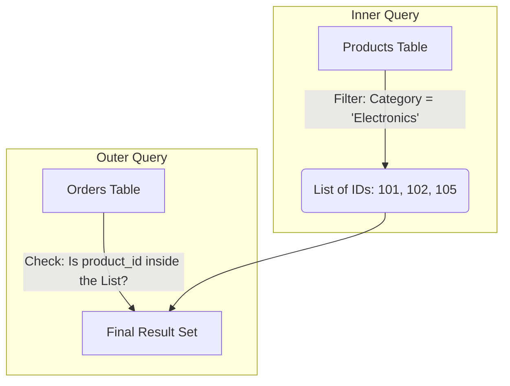
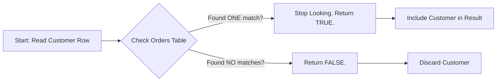

Take a look at the queries we've written so far in the other modules. They all share a certain… linearity. We pick a table (or join a few), we filter out the noise, maybe we group things into buckets, and finally, we order the results. It's a straight line from raw data to answer.

But life (and data), isn't always linear. Sometimes, to answer a question, you first need the answer to a *different* question.

Imagine I asked you, "Who in our company earns more than the average salary?"

To solve this, we need to break the problem into two steps:

1. **Calculate the average salary.**
2. **Filter the employees based on that number**.

In the old days, you might run the first query, scribble the number `$65,000` on a sticky note, and then hard-code it into the second query. But we are engineers. We don't do sticky notes. We want the database to do the scratch work for us.

We do this by nesting one query inside another. We call this a **subquery**.

## 7.1 Scalar and Multi-row Subqueries
A subquery is simply a `SELECT` statement wrapped in parentheses `()` and placed inside another SQL statement. It's the "Inception" of database querying (a dream within a dream).

The query inside the parentheses is called the **inner query**. The query surrounding it is the **outer query**.

!!! example "Analogy: The Prep Chef"

    Think of the **outer query** as the head chef. They are plating the final dish to serve the customer.

    The **inner query** is the prep chef. The head chef shouts, "I need the average salary sauce now!" The prep chef runs off, calculates that single number, and hands it back. The head chef doesn't care *how* the sauce was made; they just take the result and finish the dish.

### Scalar Subqueries
The simplest, most common type of subquery is the **scalar subquery**.

A scalar subquery returns exactly **one row** and **one column**. It's a tiny query that resolves to a single number, string, or date.

Let's solve our salary problem:

```sql
SELECT
    first_name,
    last_name,
    salary
FROm employees
WHERE salary > (
    SELECT AVG(salary)
    FROM employees
);
```

Let's break this down.

1. **The Parentheses `(…)`**: These are the walls of our subquery. They tell the database, "Pause the outer query. Run everything inside here first."
2. **The Inner Query**: `SELECT AVG(salary) FROM employees` runs first. Let's say the result is `65000`.
3. **The Substitution**: The database effectively replaces the entire subquery with the result. According to the outer query, the code now looks like `WHERE salary > 65000`.
4. **The Outer Query**: Now, the main query proceeds, filtering rows normally.

This is powerful because it is **dynamic**. If you hire a new CEO and the average salary shoots up, this query automatically adjusts the bar without you changing a single line of code.

### Placement: Where Can They Go?
Because a scalar subquery resolves to a single value, you can put it **anywhere** you would normally put a number or a string.

You can even put it in the `SELECT` clause to compare values side-by-side!

```sql
SELECT
    product_name,
    price,
    (SELECT AVG(price) FROM products) AS average_price
FROM products;
```

Here, the inner query runs once, gets the average (say, `20`), and plasters that same number `20` next to every single row in the result set. It looks a bit repetitive, but it's incredibly useful for calculating differences (e.g., `price - (SELECT …)`).

!!! warning "The Cardinality Trap"

    A scalar subquery **must** return one row and one column.

    If your inner query returns two rows (maybe you forgot to aggregate?), the database will panic and throw a runtime error. It's like trying to fit two distinct keys into a single keyhole simultaneously. It just doesn't fit.

### Multi-Row Subqueries
Occasionally, the prep chef doesn't hand back a single ingredient. Occasionally, they hand back a **grocery list**.

A **Multi-row subquery** returns a single column but **multiple rows**. It's a list of values.

Since the result is a list, we can't use simple comparison operators like "equals" or "greater than." Instead, we use the **set membership** operators you learned in module 2, specifically `IN` and `nOT IN`.

**The Scenario**: We want to find **all** customers who have placed an order in the 'Electronics' category.

We could do this with a `JOIN` (and often we would), but let's look at the subquery approach to understand the logic.

1. **Question 1**: Which `product_ids` belong to the 'Electronics' category? (This is our list).
2. **Question 2**: Find me the orders that contain one of those IDs.

```sql
SELECT
    order_id,
    order_date,
    total_amount
FROM orders
WHERE product_id IN (
    SELECT product_id
    FROM products
    WHERE category = 'Electronics'
);
```

**How the Engine Thinks**:

1. **Inner Query**: The database scans the `products` table. It finds three 'Electronics' products with IDs `101`, `102`, and `105`.
2. **The List**: The subquery resolves to a list: `(101, 102, 105)`.
3. **Outer Query**: The outer query now effectively reads `WHERE product_id IN (101, 102, 105)`.
4. **Matching**: It scans the `orders` table and keeps any row where the `product_id` matches one of those numbers.


### Flow of Execution
Here is how the data flows through this logic. Note how the output of the inner block becomes the *filter criteria* for the outer block.



## 7.2 Correlated Subqueries (`EXISTS`, `NOT EXISTS`)
If the subqueries in the previous section were the "prep chef," running off to do a task once and returning with a finished ingredient, then **correlated subqueries** are a "personal assistant" who follows you around all day.

In section 7.1, the inner query was independent. You could copy-paste it into a new window, run it, and it would work perfectly. It didn't need the outer query to exist.

A **correlated subquery** is different. It relies on the outer query. It references columns from the outer table. Consequently, it cannot run on its own; if you try to run just the inner part, it will fail because it's missing a variable.

### The Problem: Context Matters
Let's look at our salary problem again, but with a twist. "Who earns more than the average salary **of their own specific department**?"

Hopefully you can see the nuance. A salary of $80,000 might be high for the "interns" department but low for the "Executives" department. To answer this new question, we can't just calculate one global average. We need to calculate a *specific* average for every single employee based on which department they belong to.

### The Syntax: Tying the Knot
To make this work, we have to "tie" the inner query to the current row of the outer query. We do this using table aliases.

```sql
SELECT
    first_name,
    last_name,
    salary,
    department_id
FROM employees AS e1
WHERE salary > (
    SELECT AVG(salary)
    FROM employees AS e2
    WHERE e2.department_id = e1.department_id
);
```

**Let's Trace the Execution**:

There is no longer a simple "calculate once, replace with value" operation. The database engine enters a loop.

1. **Row 1**: The database looks at the first person in the outer table (`e1`). Let's say it's `Alice`, who is in department 5.
2. **Pause**: The engine pauses Alice's row. It looks at the inner query.
3. **Variable Injection**: It sees `e1.department_id`. It injects Alice's ID `5` into that spot.
4. **Inner Run**: The inner query effectively runs `SELECT AVG(salary) FROM employees WHERE department_id = 5`.
5. **Comparison**: It gets the average for department 5 (say, `50000`). It checks if Alice earns more than that. If yes, she stays.
6. **Row 2**: The database moves to Bob, who is in department 9.
7. **Repeat**: IT runs the entire *inner query* again, but this time it injects department `9`.

!!! warning "Performance Trap: The N +1 Problem"

    Because this inner query runs once for every row in the outer table, correlated subqueries can be **slow** on massive datasets. If you have 1,000,000 employees, you are running that aggregation query 1,000,000 times.

### The Power of `EXISTS`
There is a specific type of correlated subquery that is incredibly common and often much faster than other methods: checking if a relationship exists.

Suppose we want to find "Customers who have placed at least one order."

We aren't asking how many orders. We aren't asking for the total amount. Furthermore, we just want a simple yes or no. Does an order exist for this customer?

Enter the `EXISTS` operator.

```sql
SELECT
    customer_id,
    first_name,
    last_name
FROM customers AS c
WHERE EXISTS (
    SELECT 1
    FROM orders AS o
    WHERE o.customer_id = c.customer_id
);
```

**Why is this strange looking?** You'll notice we wrote `SELECT 1` inside the subquery. Why?

`EXISTS` does not care what data you return. It ignores the columns entirely. It only cares about **rows**. As soon as the database finds a single row that matches the condition (`o.customer_id = c.customer_id`), it stops looking, shouts "TRUE" and moves on.

It doesn't waste time counting **all** the orders. It finds one and quits. This is called **short-circuiting**, and it makes `EXISTS` very efficient for large datasets.

### The Logic flow



### `NOT EXISTS`: The "Find the Missing" Pattern
The opposite, `NOT EXISTS`, is one of the best ways to answer "exclusion" questions.

**Question**: "Which product has **never** been ordered?"

```sql
SELECT
    product_name
FROM products AS p
WHERE NOT EXISTS (
    SELECT 1
    FROM order_details AS od
    WHERE od.product_id = p.product_id
);
```

This reads almost like English: "Select products where there does not exist a matching record in order details."

This is often safer than using `NOT IN`, because `NOT EXISTS` handles `NULL` values gracefully. It simply checks for the presence of a row, so a stray NULL in the data won't break your entire query. 

## 7.3 Common Table Expressions (CTEs)
If you've ever looked at a complex SQL query with three layers of nested subqueries and felt a headache coming on, you are not alone.

Nested subqueries are powerful, but they suffer from a major design flaw: **they force you to read code inside-out**. To understand the outer query, you have to dig into the middle, understand the inner query, and then mentally work your way back out. It's like reading a book where the climax is printed on page 1, the intro on page 50, and the conclusion on page 10.

Enter the **common table expression**, or **CTE**.

A CTE is a way to give a name to a subquery and define it *before* you use it. It transforms your code from a nested mess into a linear, step-by-step story.

### The Syntax `WITH`
To create a CTE, we use the keyword `WITH`. You are essentially saying, *"With this temporary table that I'm about to define, I want to run a query."*

Here is the basic structure:

```sql
WITH my_special_table AS (
    -- This is the definition. It runs first.
    SELECT col1, col2
    FROM original_table
    WHERE col1 > 100
)

-- This is the main query. It runs second.
SELECT * FROM my_special_table;
```

**Breakdown**:

1. `WITH name AS (…)`: This defines the CTE. You can name it whatever you want (just like a variable).
2. **The Parentheses**: Inside here is just a standard `SELECT` query.
3. **The Main Query**: Immediately following the closing parenthesis, you write your final `SELECT`. You treat `my_special_table` exactly like a real table.

!!! example "The 'Analogy: The 'Mise en place'"

    In professional cooking, chefs practice *mise en place*. Before they start cooking the actual dish, they chop the onions, peel the garlic, and measure the spices into little bowls.

    - **Subqueries** are like chopping the onions *while* you are sauteing the steak. It's chaotic.
    - **CTEs** are *mise en place*. You prepare your data (chop the onions) and put it in a named bowl (`onion_bowl`). Then, when you cook the main dish (the final `SELECT`), you just reach for `onion_bowl`.

### A Real Example: The "Refactoring"
Let's revisit a complex scenario. Imagine we want to find **departments where the total salary payout is greater than $1,000,000**.

**The Subquery Way (The "Old" Way)**: You have to group the data inside the `HAVING` clause or a `FROM` subquery. It gets crowded.

**The CTE Way (The Clean Way)**:

```sql
WITH department_costs AS (
    -- Step 1: Calculate the cost for every department.
    SELECT
        department_id,
        SUM(salary) AS total_payout
    FROM employees
    GROUP BY department_id
)
-- Step 2: Filter the result of Step 1
SELECT
    department_id,
    total_payout
FROM department_costs
WHERE total_payout > 1000000;
```

Read the code from top to bottom.

1. First, we define what `department_costs` means.
2. Then, we select from it.

It reads exactly like logical human thought.

### Multiple CTEs: Chaining Logic
The true power of CTEs appears when you have a multi-step problem. You can define multiple CTEs in a single `WITH` clause, separated by commas. Each subsequent CTE can read from the previous ones!

**Scenario**: We want to find the "**Profit Margin**" of our products.

1. Calculate the total revenue per product.
2. Calculate the total cost per product.
3. Join them and do the math.

```sql
WITH product_revenue AS (
    -- Bowl 1: Revenue
    SELECT product_id, SUM(amount) AS total_rev
    FROM sales
    GROUP BY product_id
),
product_costs AS (
    -- Bowl 2: Costs (Note the comma above!)
    SELECT product_id, SUM(cost) AS total_cost
    FROM expenses
    GROUP BY product_id
)
-- Main Dish: Combine them
SELECT
    r.product_id,
    (r.total_rev - c.total_cost) AS profit
FROM product_revenue AS r
JOIN product_costs AS c
    ON r.product_id = c.product_id;
```

If you tried to write this using only subqueries, you would have to shove two massive `SELECT` statements inside the `FROM` clause of the main query. It would look like a block of unreadable text. The CTE version, however, is self-documenting.

### Why CTEs are Preferred

1. **Readability**: We've hammered this point home, but it is the #1 reason. Code is read more often than it is written.
2. **Reusability (within the query)**: If you define a CTE named `high_value_customers`, you can reference it twice in your main query (e.g., in a self-join) without having to copy-paste the definition code twice.
3. **Debugging**: It is straightforward to debug CTEs. If the final output is wrong, you can just highlight the code inside the CTE, run it separately, and verify that "Step 1" is correct before moving to "Step 2."

!!! warning "The Scope Trap"

    It is important to remember that a CTE is **ephemeral**. It only exists for the duration of that single query.

    You cannot run the code above; wait 5 minutes and then type `SELECT * FROM product_costs`. The database will look at you blankly and say, "Table not found." If you need the data to stick around permanently, you need to create an actual table or a view (covered in later modules).

## 7.4 Recursive CTEs
We have arrived at the final boss of this module.

So far, every query we have written has been about **sets**. We grab a group of rows, filter them, and maybe join them to another group. But some data isn't just a group; it's a **hierarchy**.

Think about:

- **Organizational Charts**: You report to a manager, who reports to a director, who reports to a VP, who reports to the CEO.
- **Menu Categories**: "Food" contains "Fruit," which contains "Citrus," which contains "Lemon."
- **Graph Directions**: How do I get from station A to station Z, passing through stations B, C, and D?

Standard SQL struggles here. You can easily find "Who is my manager?" (one join). But "Who is my manager's manager?" requires two joins. "Who is the CEO?" requires… well, you don't know how many joins until you start climbing.

To solve this, we need a query that can **repeat itself** until it finishes the job. We require **recursion**.

### The Concept
In programming, recursion occurs when a function calls itself. In SQL, a **recursive CTE** is a CTE that references *itself* inside it's definition.

It sounds like a paradox (using a word to define the word you are defining), but it works by splitting the problem into two specific parts:

1. **The Anchor Member**: The starting point (e.g., the CEO).
2. **The Recursive Member**: The loop. It says, "Find everyone who reports to the people we just found."

These two parts are glued together with a `UNION ALL`.

### The Syntax: Building the Tree
Let's pretend we have a `employees` table with an `id`, a `name`, and a `manager_id`. The CEO has a `manager_id` of `NULL` (because they report to no one).

We want to print out the entire hierarchy level by level.

```sql
WITH RECURSIVE org_chart AS (
    -- 1. The Anchor
    -- THis runs exactly once. It finds the top of the tree.
    SELECT
        id,
        name,
        manager_id,
        1 AS level -- We manually label this "level 1"
    FROm employees
    WHERE manager_id IS NULL

    UNION ALL

    -- 2. The Recursive Member
    -- This runs repeatedly. It looks at the results from the previous step.
    SELECT
        e.id,
        e.name,
        e.manager_id,
        o.level + 1 -- We take the previous level and add 1
    FROm employees AS e
    JOIN org_chart AS o
        ON e.manager_id = o.id
)
-- 3: The Main Query
SELECT * FROM org_chart;
```

!!! info "Syntax Check: WITH RECURSIVE"

    In PostgreSQL and MySQL, you must use the keyword `WITH RECURSIVE`. In SQL Server (T-SQL), you just write `WITH`, but the logic is identical.

### How It Executes (The "Loop")
It is crucial to visualize this not as one big crash, but as a step-by-step iteration.

**Iteration 1 (The Anchor)**:

- The engine runs the top `SELECT`.
- It finds the CEO (let's say 'Alice').
- **Result so far**: `[Alice]`

**Iteration 2 (The Recursion Begins)**:

- The engine now runs the bottom `SELECT`.
- It looks at `org_chart`, which currently only contains `Alice`.
- It asks, "Who has `manager_id = Alice's ID`?
- It finds "Bob" and "Charlie."
- It calculates their level: `1 + 1 = 2`.
- **Result so far**: `[Alice, Bob, Charlie]`

**Iteration 3**:

- The engine runs the bottom `SELECT` again.
- Now, it looks at `org_chart`'s newest additions: **Bob and Charlie** (it doesn't check Alice again).
- It asks, "Who reports to Bob or Charlie?"
- It finds "David" (Bob's intern).
- It calculates the level: `2 + 1 = 3`.
- **Result so far**: `[Alice, Bob, Charlie, David]`

**Iteration 4**

- It asks, "Who reports to David?"
- **No one**. The query returns 0 rows.
- **STOP**. The recursion terminates automatically because no new rows were found.

### A Practical Use Case: Breadcrumbs
Recursive CTEs aren't just for listing names; they are great for building paths (breadcrumbs).

If you want to generate a string that looks like `"CEO > VP Sales > Manager > You"`, you can build that string during the recursion using concatenation.

```sql
WITH RECURSIVE breadcrumbs AS (
    -- Anchor
    SELECT
        id,
        name,
        CAST(name AS CHAR(200)) AS path -- Start the path with just the CEO's name.
    FROM employees
    WHERE manager_id IS NULL

    UNION ALL

    -- Recursive
    SELECT
        e.id,
        e.name,
        CONCAT(b.path, ' > ', e.name) -- Take previous path, add current name
    FROM employees AS e
    JOIN breadcrumbs AS b
        ON e.manager_id = b.id
)
SELECT path FROM breadcrumbs;
```

**Output**:
```txt
Alice
Alice > Bob
Alice > Charlie
Alice > Bob > David
```

This is incredibly useful for website navigation paths or visualizing supply chains.

!!! warning "The Infinite Loop"

    There is a danger here. What if **Alice** reports to **Bob**, but **Bob** reports to **Alice**?

    1. Find Alice.
    2. Find Bob (Alice's subordinate).
    3. Find Alice (Bob's subordinate).
    4. Find Bob…
    5. Find Alice…

    The database will run this loop until it crashes your server or hits a hard limit.

    Most databases have a safety valve.

    - **SQL Server**: Defaults to 100 recursions. You can change this using `OPTION (MAXRECURSION 500)`.
    - **Others**: You may need to manually add a "depth check" (e.g., `WHERE level < 50`) to prevent runaway queries during development.

## Quiz

<quiz>
What is the defining characteristic of a scalar subquery?
- [ ] It returns a single column with multiple rows.
- [ ] It references columns from the outer query.
- [x] It returns exactly one row and one column.
- [ ] It must always be placed in the FROM clause.

</quiz>

<quiz>
You are writing a query to filter employees based on a list of department IDs returned by a subquery. Which operator should you use if the subquery returns multiple rows?
- [ ] `=`
- [x] `IN`
- [ ] `BETWEEN`
- [ ] `LIKE`

</quiz>

<quiz>
A correlated subquery executes exactly once, regardless of how many rows are in the outer query.
- [ ] True
- [x] False

</quiz>

<quiz>
Why is `NOT EXISTS` often preferred over `NOT IN` when dealing with exclusion logic?
- [ ] It converts the subquery into a common table expression.
- [x] It is safer because it handles NULL values correctly without returning an empty result set.
- [ ] It allows you to select specific columns from the subquery.
- [ ] It automatically sorts the results.

</quiz>

<quiz>
In the context of the `EXISTS` operator, what is the significance of writing `SELECT 1` in the subquery?
- [ ] It forces the query to return the first row only.
- [ ] It ensures the subquery returns true.
- [ ] It is a syntax error; you must select a real column.
- [x] It indicates that the specific data returned doesn't matter; only the presence of a row counts.

</quiz>

<quiz>
Which keyword initiates a common table expression (CTE)?
- [ ] `CREATE VIEW`
- [ ] `GROUP BY`
- [x] `WITH`
- [ ] `HAVING`

</quiz>

<quiz>
What is the primary benefit of using a CTE over a nested subquery?
- [ ] CTEs allow you to delete data from multiple tables at once.
- [ ] CTEs persist the data permanently in the database.
- [x] CTEs improve readability by allowing code to be read linearly (top-to-bottom).
- [ ] CTEs are always faster than subqueries.

</quiz>

<quiz>
In a recursive CTE, what is the purpose of the 'Anchor Member'?
- [x] It defines the starting point of the recursion (e.g., the CEO).
- [ ] It loops repeatedly until no rows are found.
- [ ] It joins the CTE to itself.
- [ ] It prevents infinite loops.

</quiz>

<quiz>
When does a recursive CTE stop executing?
- [x] When the recursive member returns no new rows.
- [ ] When the database runs out of memory.
- [ ] When the user manually presses "stop."
- [ ] When the anchor member returns NULL.

</quiz>

<quiz>
A CTE defined in one query can be referenced in a completely separate query run 10 minutes later.
- [ ] True
- [x] False

</quiz>

<!-- mkdocs-quiz results -->

## Lab
Please complete module 7 labs in the companion GitHub repository.

## Lab Solutions

!!! warning "Don't Cheat Yourself"

    Before viewing any of the solutions below, please ensure you have given the challenge an honest try. The worst thing you can do to yourself while learning is to not "accept the struggle." The struggle is what cements the information. Discovering the answer through trial and error is the only way to truly learn.

??? note "Challenge 1 Solution"

    ```sql
    SELECT
        product_id,
        product_weight_g
    FROM products
    WHERE product_weight_g > (
        SELECT AVG(product_weight_g) FROM products
    );
    ```

??? note "Challenge 2 Solution"

    ```sql
    SELECT
        order_id,
        product_id,
        price,
        (SELECT AVG(price) FROM order_items) AS global_avg_price
    FRom order_items;
    ```

??? note "Challenge 3 Solution"

    ```sql
    SELECT
        AVG(order_total) AS avg_order_total
    FROM (
        SELECT order_id, SUM(price) as order_total
        FROM order_items
        GROUP BY order_id
    ) AS order_sums;
    ```

??? note "Challenge 4 Solution"

    ```sql
    SELECT
        customer_id,
        customer_state
    FROM customers
    WHERE customer_state IN (
        SELECT customer_state
        FROM customers
        GROUP BY customer_state
        ORDER BY COUNT(*) DESC
        LIMIT 3
    )
    ```

??? note "Challenge 5 Solution"

    ```sql
    SELECT
        seller_id,
        seller_state
    FROM sellers
    WHERE seller_state NOT IN (
        SELECT DISTINCT
            customer_state
        FROM customers
    )
    ```

??? note "Challenge 6 Solution"

    ```sql
    SELECT
        order_id
    FROM order_items
    WHERE product_id IN (
        SELECT product_id
        FROM products
        WHERE product_category_name IN ('telefonia', 'informatica_acessorios', 'eletronicos')
    )
    ```

??? note "Challenge 7 Solution"

    ```sql
    SELECT
        product_id,
        product_category_name
    FROM products AS p
    WHERE EXISTS (
        SELECT 1
        FROM order_items AS oi
        WHERE p.product_id = oi.product_id
    )
    ```

??? note "Challenge 8 Solution"

    ```sql
    SELECT
        product_id,
        product_category_name
    FROM products AS p
    WHERE NOT EXISTS (
        SELECT 1
        FROM order_items AS oi
        WHERE oi.product_id = p.product_id 
    )
    ```

??? note "Challenge 9 Solution"

    ```sql
    SELECT
        customer_id
    FROm customers AS c
    WHERE EXISTS (
        SELECT 1
        FROM orders AS o
        WHERE c.customer_id = o.customer_id
            AND o.order_status <> 'delivered'
    )
    ```

??? note "Challenge 10 Solution"

    ```sql
    SELECT
        p.product_id,
        p.product_category_name,
        oi.price
    FROm order_items AS oi
    JOIN products AS p
        ON p.product_id = oi.product_id
    WHERE oi.price > (
        SELECT AVG(o2.price)
        FROM order_items AS o2
        JOIN products AS p2
            ON p2.product_id = o2.product_id
        WHERE p.product_category_name = p2.product_category_name
    ```

??? note "Challenge 11 Solution"

    ```sql
    WITH OrderTotals AS (
        SELECT
            SUM(price) AS total_price,
            order_id
        FROM order_items
        GROUP BY order_id
    )
    SELECT
        AVG(total_price) AS avg_total
    FROM OrderTotals;
    ```

??? note "Challenge 12 Solution"

    ```sql
    WITH OrderFreight AS (
        SELECT
            SUM(oi.freight_value) AS total_freight,
            o.order_id,
            c.customer_state
        FROM orders AS o
        JOIN order_items AS oi
            ON o.order_id = oi.order_id
        JOIN customers AS c
            ON o.customer_id = c.customer_id
        GROUP BY o.order_id, c.customer_state
    )
    SELECT
        AVG(total_freight) AS avg_freight,
        customer_state
    FROM OrderFreight
    GROUP BY customer_state;
    ```

??? note "Challenge 13 Solution"

    ```sql
    WITH SellerRevenue AS (
        SELECT
            SUM(price) AS total_sales,
            seller_id
        FROM order_items
        GROUP BY seller_id
    ),
    VIPSellers AS (
        SELECT seller_id
        FROM SellerRevenue
        WHERE total_sales > 50000
    )
    SELECT
        s.seller_state,
        COUNT(v.seller_id) AS seller_count
    FROM sellers AS s
    JOIN VIPSellers AS v
        ON v.seller_id = s.seller_id
    GROUP BY s.seller_state;
    ```

??? note "Challenge 14 Solution"

    ```sql
    WITH ItemCounts AS (
        SELECT
            order_id,
            COUNT(*) AS item_count
        FROM order_items
        GROUP BY order_id
    )
    SELECT *
    FROM ItemCounts
    WHERE item_count > 5;
    ```

??? note "Challenge 15 Solution"

    ```sql
    WITH Orders2017 AS (
        SELECT
            order_id
        FROM orders
        WHERE EXTRACT(YEAR FROM order_purchase_timestamp) = 2017
    )
    SELECT
        SUM(oi.price) AS total_revenue
    FROM order_items AS oi
    JOIN Orders2017 AS o
        ON oi.order_id = o.order_id;
    ```

??? note "Challenge 16 Solution"

    ```sql
    WITH RECURSIVE NumberSeries AS (
        SELECT 1 AS num
        
        UNION ALL
        
        SELECT num + 1
        FROM NumberSeries
        WHERE num < 10
    )
    SELECT num FROM NumberSeries;
    ```

??? note "Challenge 17 Solution"

    ```sql
    WITH RECURSIVE DateSeries AS (
        SELECT '2017-01-01'::TIMESTAMP AS calendar_date

        UNION ALL

        SELECT calendar_date + INTERVAL '1 day'
        FROM DateSeries
        WHERE calendar_date < '2017-01-31'
    )
    SELECT calendar_date FROM DateSeries;
    ```

??? note "Challenge 18 Solution"

    ```sql
    WITH RECURSIVE DateSeries AS (
        SELECT '2017-01-01'::TIMESTAMP AS calendar_date

        UNION ALL

        SELECT calendar_date + INTERVAL '1 day'
        FROM DateSeries
        WHERE calendar_date < '2017-01-07'
    )

    SELECT
        d.calendar_date,
        COUNT(o.order_id) AS total_orders
    FROM orders AS o
    LEFT JOIN DateSeries AS d
        on d.calendar_date = CAST(o.order_purchase_timestamp AS DATE)
    GROUP BY d.calendar_date
    ORDER BY d.calendar_date;
    ```

??? note "Challenge 19 Solution"

    ```sql
    WITH OrderSums AS (
        SELECT
            SUM(price) As total_price,
            order_id
        FROM order_items
        GROUP BY order_id
    ),
    GlobalAverage AS (
        SELECT
            AVG(total_price) AS global_average
        FROM OrderSums
    )
    SELECT
        o.customer_id
    FROM orders AS o
    JOIN OrderSums AS os
        ON os.order_id = o.order_id
    WHERE os.total_price > (SELECT global_average FROM GlobalAverage);
    ```

??? note "Challenge 20 Solution"

    ```sql
    WITH SellerSales AS (
        SELECT s.seller_id, s.seller_state, SUM(oi.price) as s_sales
        FROM sellers s
        JOIN order_items oi ON s.seller_id = oi.seller_id
        GROUP BY s.seller_id, s.seller_state
    ),
    StateSales AS (
        SELECT seller_state, SUM(s_sales) as st_sales
        FROM SellerSales
        GROUP BY seller_state
    )
    SELECT 
        ss.seller_id,
        ss.seller_state,
        (ss.s_sales / st.st_sales) * 100 as pct_contribution
    FROM SellerSales ss
    JOIN StateSales st ON ss.seller_state = st.seller_state
    ORDER BY pct_contribution DESC;
    ```