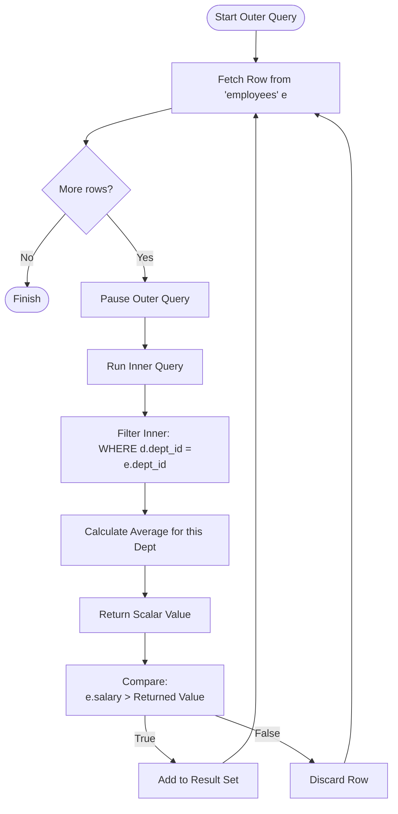

Up until now, our SQL queries have been somewhat two-dimensional. We pick a table, maybe join it to another, filter some rows, and show the results. It's effective, but it's flat.

Sometimes, to ask a complex question, you first need to answer a smaller question. If I asked you, *"Who is the tallest person in the room?"*, you actually have to perform two mental operations:

1. Scan the room to find the maximum height.
2. Identify the person who matches that height.

In SQL, we call this a **subquery**. It is a query nested inside another query. Think of it as passing the baton of data from an inner scope to an outer scope.

It's time to add some depth to our code.

## 8.1 Different Types (The Shapes of Data)
Before we start nesting code like Russian dolls, we need to understand the "shape" of the data a subquery returns. When you run a `SELECT` statement, you usually expect a grid of results. But a subquery can behave like a variable, a list, or a temporary table, depending on what it returns.

Your database engine is strictly typed regarding shapes. You cannot compare a specific `price` (a single number) to a whole table of products.

### The Four Shapes

**1. Scalar Subqueries (One Row, One Column)**
This is the simplest form. The subquery returns exactly one value (one row, one column). You can treat this result exactly like a number or a string.
- **Usage:** Anywhere you use a constant value (e.g., `WHERE`, `SELECT` list).

**2. Column Subqueries (Many Rows, One Column)**
This subquery returns a list of values from a single column.
- **Usage:** Great for the `IN` operator. "Give me users who live in *this list of cities*."

**3. Row Subqueries (One Row, Many Columns)**
Returns a single record with multiple columns.
- **Usage:** Comparing a tuple. `WHERE (first_name, last_name)  (SELECT ...)`.

**4. Table Subqueries (Many Rows, Many Columns)**
Returns a full result set.
- **Usage:** Almost exclusively used in the `FROM` clause. The outer query treats this result as if it were a temporary table. 

## 8.2 Nested Subqueries
Let's look at the most common implementation: the standard, uncorrelated nested subquery.

In this scenario, the inner query is completely independent. You could copy-paste the inner query into a separate tab, run it, and it would perfectly fine. THe database engine runs the inner query **once**, grabs the results, and then uses that result to execute the outer query.

### The "Scalar" Pattern
Imagine we want to find every product in our `products` table that costs more than the average price of **all** products.

We can't do `WHERE price > AVG(price)` because aggregate functions generally aren't allowed in the `WHERE` clause.

Instead, we calculate the average first:
```sql
SELECT product_name, price
FROM products
WHERE price > (
    -- THe Inner Query
    SELECT AVG(price)
    FROM products
);
```

!!! abstract "The Order of Operations"

    Mentally, the database rewrites this query.

    1. It runs `SELECT AVG(price) FROM products` and gets `$50.00`.
    2. It replaces the code with the result: `WHERE price > 50.00`.
    3. It runs the outer query.
   
### The "List" Pattern (IN)
What if we want to find all customers who have placed an order in the last 7 days?

```sql
SELECT customer_name, email
FROM customers
WHERE customer_id IN (
    -- The Inner Query returns a column (list) of IDs
    SELECT customer_id
    FROM orders
    WHERE order_date > NOW() - INTERVAL '7 days'
);
```

Here, the inner query returns a shape like `(101, 104, 206)`. The outer query then simply checks if the `customer_id` exists inside that list.

!!! warning

    Be careful with `NOT IN` combined with subqueries that might return `NULL`. If your inner list contains even a single `NULL`, the result of `NOT IN` will likely be empty for everything due to how SQL handles three-valued logic. Use `NOT EXISTS` instead for safety.

## 8.3 Correlated Subqueries
Now we arrive at the heavy lifters. Correlated subqueries are where things get interesting, and computationally expensive.

In the previous section, the inner query ran once. In a **correlated subquery**, the inner query runs **once for every row** processed by the outer query.

The inner query references a column from the outer query (the correlation). They are inextricably linked. You cannot run the inner query by itself because it's missing a variable.

### The Concept
Imagine you are a teacher grading exams.

- **Uncorrelated**: You calculate the class average (one time). THen you go through every student and say, "Did you beat the class average?"
- **Correlated**: You pick up Student A's paper. You calculate the average *for Student A's specific major*. You check if they beat it. Then you pick up Student B's paper. You calculate the average *for Student B's specific major*.

### The Syntax
Let's find employees who earn more than the average salary of **their own department**.

```sql
SELECT
    e.first_name,
    e.salary,
    e.department_id
FROM employees AS e
WHERE e.salary > (
    SELECT AVG(d.salary)
    FROM employees AS d
    WHERE d.department_id = e.department_id
);
```

Notice `WHERE d.department_id = e.department_id`. This line bridges the two scopes. The inner query looks "up" to the outer query's current row (`e`) to filter the data.

### Visualizing the Execution Loop
This flow can be tricky to visualize, so let's look at the lifecycle of a single row.



### The `EXISTS` Operator
THe most common friend of the correlated subquery is `EXISTS`. It doesn't care *what* data is returned, only *that* data is returned.

Find customers who have placed at least one order:

```sql
SELECT *
FROM customers AS c
WHERE EXISTS (
    SELECT 1
    FROM orders AS o
    WHERE o.customer_id = c.customer_id
);
```

This is often more performant than `IN` because the database engine can stop scanning the `orders` table the moment it finds a single match for that customer. It doesn't need to build the whole list.

!!! note "Performance"

    Because correlated subqueries execute once per row, they have a complexity of roughly $O(n \times M)$. If your outer table has 10,000 rows, that inner query runs 10,000 times.

    On modern database optimizers (Postgres, SQL Server), the engine is smart enough to rewrite this into a `JOIN` under the hood. However, on older systems or with very complex logic, a correlated subquery can bring your database to a crawl. Use them wisely.

## Quiz

<quiz>
Which of the following best describes the return shape of a **scalar subquery**?
- [ ] A single column with multiple rows.
- [x] A single value (one row, one column).
- [ ] A full table structure.
- [ ] A single row with multiple columns.

</quiz>

<quiz>
In the context of the SQL execution order, what distinguishes a **correlated subquery** from a standard **nested subquery**?
- [ ] The outer query executes first, and then the inner query runs on the final result set.
- [ ] The inner query executes first, and the result is passed to the outer query once.
- [x] The inner query executes once for every row processed by the outer query.
- [ ] The inner query and outer query execute simultaneously in parallel threads.

</quiz>

<quiz>
You want to find all customers whose ID appears in a list of active orders. Which operator is most appropriate to use with a subquery returning a list of IDs?
- [ ] `=`
- [ ] `LIKE`
- [x] `IN`
- [ ] `EXISTS`

</quiz>

<quiz>
A table subquery (returning multiple rows and columns) is almost exclusively used in the `WHERE` clause.
- [ ] True
- [x] False

</quiz>

<quiz>
Identify the element that makes the following query a **correlated subquery**:
```sql
SELECT * FROM employees AS e
WHERE salary > (
    SELECT AVG(salary)
    FROM employees AS d
    WHERE d.dept_id = e.dept_id
);
```
- [ ] `SELECT AVG(salary)`
- [ ] `FROM employees AS d`
- [x] `WHERE d.dept_id = e.dept_id`
- [ ] `salary > (...)`

</quiz>

<quiz>
Why is the `EXISTS` operator often preferred over `IN` when dealing with correlated subqueries?
- [ ] It forces the database to return a scalar value.
- [ ] It automatically sorts the results of the inner query.
- [x] It stops scanning as soon as it finds a single match, ignoring the actual values returned.
- [ ] It can handle `NULL` values inside the subquery better than any other operator.

</quiz>

<quiz>
What is the primary risk of using `NOT IN` with a subquery that might return `NULL` values?
- [x] The entire result set may become empty due to SQL's three-valued logic.
- [ ] It will cause a syntax error.
- [ ] It behaves exactly like `NOT EXISTS`.
- [ ] It automatically converts `NULL`s to zeros.

</quiz>

<quiz>
What is the algorithmic complexity (Big O notation) roughly associated with a naive correlated subquery execution?
- [ ] O(log n)
- [ ] O(N + M)
- [x] O(N * M)
- [ ] O(1)

</quiz>

<quiz>
Can you use an aggregate function (like `AVG` or `MAX`) in a `WHERE` clause without a subquery?
- [ ] Yes, standard SQL allows this directly.
- [x] No, because the `WHERE` clause filters rows before aggregates are calculated.
- [ ] Yes, but only for the `COUNT` function.
- [ ] No, unless you use the `GROUP BY` clause first.

</quiz>

<!-- mkdocs-quiz results -->

## Summary
In this chapter we moved beyond flat data retrieval by introducing **subqueries**, a powerful technique for nesting queries to answer questions that rely on intermediate results. We defined the four valid "shapes" of data a subquery can return (scalar, column, row, or table), and established how these shapes dictate where a subquery can be placed (such as in a `WHERE` clause versus a `FROM` clause). We then distinguished between **nested subqueries**, which execute independently and efficiently, and **correlated subqueries**, which execute iteratively for every row of the outer query.

## Lab
Please complete Chapter 8 labs from the companion [GitHub Repository](https://github.com/mckenzie-andrew/odea-labs){target="_blank"}. 