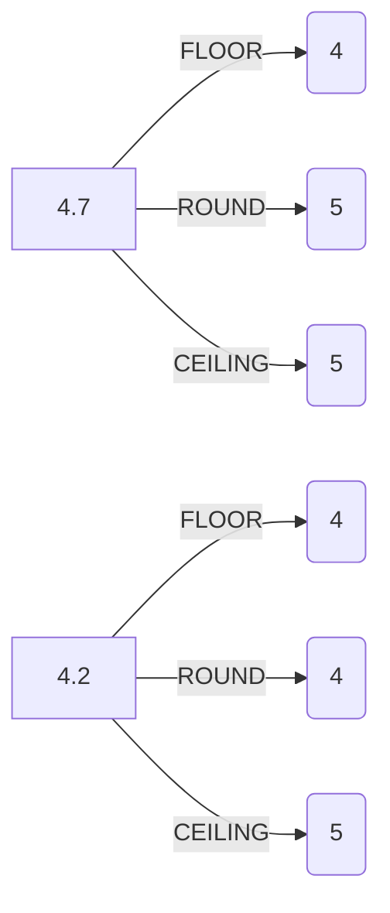
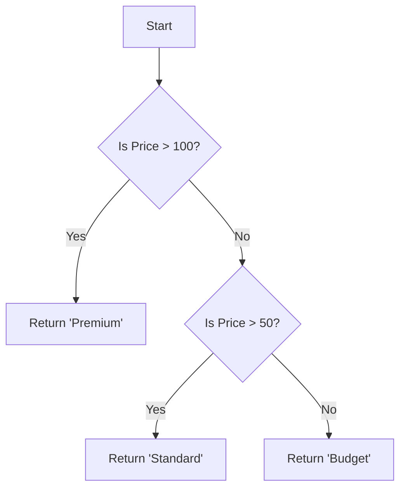

Up until now, we've been acting a bit like librarians. We walk to the shelves (`FROM`), filter out the books we don't need (`WHERE`), and bring the stack back to the front desk (`SELECT`).

But sometimes, simply retrieving data isn't enough. The data might be "raw" (messy, unformatted, or mathematically incomplete). You don't just want the book, you want to rewrite the title in uppercase, calculate the number of days since it was published, or categorize it based on its page count.

In this chapter, we stop being librarians and start being sculptors. We are going to look at **scalar functions**. Unlike aggregate functions (which crunch many rows into one result, like `COUNT`), scalar functions operate on a single value and return a single value. They transform data, row by row.

## 9.1 String Functions
Text data is notoriously messy. Users type things in all caps, they leave trailing spaces, or they split logical concepts (like names) across multiple columns. String functions are your cleanup crew.

### The Glue: `CONCAT`
The most fundamental operation is sticking two things together. In computer science, we call this concatenation.

!!! note

    While some SQL dialects allow you to use operators like `+` or `||` to join strings, `CONCAT()` is generally safer because it handles `NULL` values more gracefully in many environments. 

```sql
SELECT
    first_name,
    last_name,
    CONCAT(first_name, ' ', last_name) AS full_name
FROM users;
```

**What's happening?** We are taking the `first_name`, adding a literal space `' '` (don't forget this, or your users will look like `JohnDoe`), and appending the `last_name`.

### The Ruler: `LENGTH`
Sometimes you need to know how much data you're dealing with. `LENGTH` (or `LEN` in some dialects) returns the number of characters in a string.

```sql
SELECT
    username,
    LENGTH(username) AS char_count
FROM users
WHERE LENGTH(username) < 5;
```

This is particularly useful for validation logic or finding bad data imports. 

### The Scalpel: `SUBSTRING`
If `concat` is the glue, `SUBSTRING` is the knife. It allows you to extract a portion of a string based on a starting position and a length.

```sql
SELECT
    product_code,
    SUBSTRING(product_code, 1, 3) AS category_prefix
FROM products;
```

If `product_code` is `XYZ-2023`, the result is `'XYZ'`

!!! warning

    In most programming languages (C, Java, Python), arrays and strings are **0-indexed** (counting starts at 0). SQL is the odd cousin at the reunion; it is usually **1-indexed**. If you ask for position 0, you might get nothing or an error.

### The Editor: `REPLACE`
This is your "Find and Replace" tool. It scans the string for a pattern and swaps it out.

```sql
SELECT
    description,
    REPLACE(description, 'cat', 'dog') AS dog_lovers_version
FROM posts;
```

*Be careful*: This is a dumb replacement. It doesn't know context. "Certificate" becomes "Certifidoge".

### The Equalizer: `UPPER` and `LOWER`
Case sensitivity is the bane of data comparison. `'Alice'` is often not equal to `'alice'`. To fix this, we normalize everything to one case before comparing.

```sql
SELECT email
FROM users
WHERE LOWER(email) = 'bob@example.com';
```

## 9.2 Numeric Functions
We aren't building a physics engine here, but you will often need to massage numbers for reports or UI display.

### The Rounding Trio: `FLOOR`, `CEILING`, and `ROUND`
When you divide integers, things get messy. These functions determine how we handle the decimal leftovers.

- `FLOOR`: Always forces the number **down** to the nearest integer.
- `CEILING`: Always forces the number **up** to the nearest integer.
- `ROUND`: Follows standard rules (0.5 goes up, 0.4 goes down).



### The Mirror: `ABS`
`ABS` calculates the absolute value (the distance from zero). It converts negative numbers to positive ones.

```sql
-- Calculate the deviation from a target score
SELECT
    player_name,
    score,
    ABS(score - 100) AS deviation
FROM game_status;
```

### The Remainder: `MOD`
`MOD` (Modulo) gives you the remainder of a division operation. It is surprisingly useful. It's great for patterns (every 3rd row) or determining if a number is even or odd.

```sql
-- We haven't covered case yet, come back after finishing the remainder of
-- this chapter, and it will all be clear
SELECT
    order_id,
    CASE
        WHEN MOD(order_id, 2) = 0 THEN 'Even Team'
        ELSE 'Odd Team'
    END AS team_assignment
FROM orders;
```

## 9.3 Date and Time
Time is likely the most complex data type you will encounter. It involves time zones, leap  years, and varying definitions of "month." SQL provides robust tools to handle this so you don't have to write the math yourself.

### The Types: `DATE`, `TIME`, `TIMESTAMP`
First, know your containers:

- `DATE`: Just the calendar day (`2023-10-31`)
- `TIME`: Just the clock time (`23:59:59`)
- `TIMESTAMP` (or `DATETIME`): Both (`2023-10-31 23:59:59`)

### The Scalpel (Again): `DATEPART`
Just like `SUBSTRING` cuts up strings, `DATEPART` extracts specific components of a date. You might want to group sales by "Month" or login activity by "Hour".

```sql
SELECT
    login_time,
    DATEPART(hour, login_time) AS hour_of_day
FROM user_logs;
```

### The Time Machine: `DATEADD`
Never, ever try to add time by doing `date_column + 7`. Does that mean 7 days? 7 hours? 7 seconds? Does it account for February having 28 days?

use `DATEADD`. It handles the calendar math for you.

```sql
-- Add 30 days to the subscription start date
SELECT
    subscription_start
    DATEADD(day, 30, subscription_start) AS renewal_date
FROM subscriptions;
```

!!! abstract

    Think of dates as coordinates on a very long, infinite timeline. `DATEADD` moves you forward or backward along that line by a safe, defined unit.

## 9.4 Conditional Expressions
This is where SQL starts to feel like "real" programming. Conditional expressions allow your query to make decisions on the fly, returning different values based on the data in the row.

### The Switch: `CASE`
The `cASE` statement is your `if/else` logic: it iterates through conditions and returns the result of the first one that evaluates to true.



```sql
SELECT
    product_name,
    price,
    CASE
        WHEN price > 100 THEN 'Premium'
        WHEN price > 50 THEN 'Standard'
        ELSE 'Budget'
    END AS price_category
    -- Don't get confused from the line above, the "AS price_category" is the normal column aliasing.
    -- The CASE statement must end with an END keyword.
FROM products;
```

### The Safety Net: `COALESCE`
`NULL` values are dangerous. They tend to ruin math (5 + NULL = NULL) and look ugly in reports. `COALESCE` accepts a list of arguments and returns the **first non-null value**.

It's effectively saying: *"Try this, if it's missing, try that. If that's missing, use this default."*

```sql
SELECT
    product_name
    -- If the sale price is NULL, fall back to the regular price
    COALESCE(sale_price, regular_price) AS effective_price
FROM products;
```

### The Trapdoor: `NULLIF`
`NULLIF` is the inverse of `COALESCE`. It takes two arguments; if they are equal, it returns `NULL`. If they are different, it returns the first argument.

Why would you want to create `NULL`s on purpose? Usually to prevent "Divide by Zero" errors.

```sql
-- If total_games is 0, NULLIF makes it NULL.
-- Division by NULL results in NULL, not a database crash.
SELECT
    wins / NULLIF(total_games, 0) AS win_rate
FROM player_stats;
```

## Quiz

<quiz>
You need to extract the first 3 characters from a product code 'ABC-123'. Which function and parameters should you use, keeping in mind SQL's indexing standard?
- [ ] `SUBSTRING('ABC-123', 0, 2)`
- [ ] `SUBSTRING('ABC-123', 0, 3)`
- [x] `SUBSTRING('ABC-123', 1, 3)`
- [ ] `SUBSTRING('ABC-123', 1, 2)`

</quiz>

<quiz>
What is the primary difference between `FLOORT(4.7)` and `ROUND(4.7)`?
- [ ] Both return 4.
- [ ] There is no difference; both return 5.
- [x] `FLOOR` returns 4, while `ROUND` returns 5.
- [ ] `FLOOR` returns 5, while `ROUND` returns 4.

</quiz>

<quiz>
Which function would you use to safely handle potential "Divide by Zero" errors by converting a specific divisor value to NULL?
- [ ] `ABS`
- [ ] `COALESCE`
- [ ] `CASE`
- [x] `NULLIF`

</quiz>

<quiz>
`CONCAT(first_name, last_name)` is generally preferred over using operators like `+` because it handles `NULL` values more gracefully in many SQL environments.
- [x] True
- [ ] False

</quiz>

<quiz>
You want to find the remainder of a division operation to determine if an `order_id` is even or odd. Which function should you use?
- [ ] `ROUND`
- [x] `MOD`
- [ ] `DIV`
- [ ] `ABS`

</quiz>

<quiz>
Review the following query: `SELECT COALESCE(phone_home, phone_work, 'No Phone') FROM users;`. If a user has `NULL` for `phone_home` and `555-0199` for `phone_work`, what is the result?
- [ ] `'No Phone'`
- [x] `'555-0199'`
- [ ] `NULL`
- [ ] An error message

</quiz>

<quiz>
Why should you use `DATEADD(day, 7, order_date)` instead of simply writing `order_date + 7`?
- [ ] `DATEADD` is faster to execute.
- [ ] `DATEADD` automatically converts the result to a string.
- [ ] SQL does not support the `+` operator for any data types.
- [x] Simple addition is ambiguous (does it mean days, hours, or seconds?) and might not handle calendar logic like leap years correctly.

</quiz>

<quiz>
Which string function would be most useful for 'cleaning' user input before comparing it, specifically to handle cases like 'Alice' vs 'alice'?
- [x] `LOWER` or `UPPER`
- [ ] `TRIM`
- [ ] `SUBSTRING`
- [ ] `REPLACE`

</quiz>

<quiz>
What happens if you use `REPLACE('The cat sat', 'cat', 'dog')`?
- [x] It returns 'The dog sat'.
- [ ] It returns 'The cat sat' because 'dog' is longer than 'cat'.
- [ ] It returns 'The dog sdog'
- [ ] It returns an error because strings are immutable.

</quiz>

<quiz>
Scalar functions (like `UPPER`, `ROUND`) operate on a single value to return a single value, whereas aggregate functions (like `COUNT`) operate on a set of values to return a single value.
- [x] True
- [ ] False

</quiz>

<!-- mkdocs-quiz results -->

## Summary
In this chapter, we transitioned from simply retrieving data to actively shaping it. We explored the power of **scalar functions**, moving beyond the role of a librarian fetching rows to that of a sculptor refining individual values. By mastering string manipulation, arithmetic rounding, temporal calculations with `DATEADD`, and conditional logic `CASE` and `COALESCE`, you now posses the toolkit to transform raw, messy database entries into polished, presentation-ready information before it ever leaves the database engine.

## Lab
Please complete Chapter 9 labs from the companion [GitHub Repository](https://github.com/mckenzie-andrew/odea-labs){target="_blank"}. 