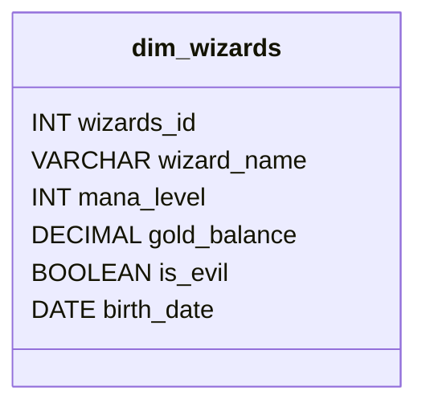
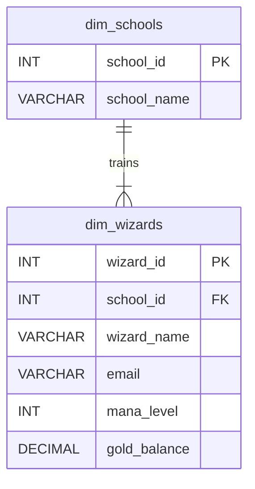
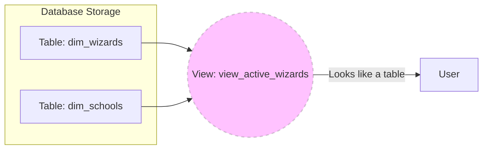

For the last eight modules, we have been acting as consumers. We've been the polite guests in someone else's data mansion, asking nicely (via `SELECT`) to see the data they organized for us. We filtered, we joined, and we aggregated. But we never actually *made* anything.

That changes now.

It is time to stop being a tenant and start being an architect. In your Dimensional Modeling studies, you learned about the abstract concepts of **dimensions** (*the who, what, and where*) and **facts** (the measurements). Those concepts are just ideas until we write the SQL to make them physical reality.

Today, we build our first bucket.

## 9.1 `CREATE TABLE` and Data Types
In Set Theory, a set is a collection of distinct objects. In a database, a **table** is a physical container for those objects (rows). But unlike a mathematical set, which can hold anything you imagine, a database table is rigid. It needs a blueprint.

To build this blueprint, we use a statement called `CREATE TABLE`.

!!! info "Vocabulary: DDL vs. DML"

    Up until now, you have been writing **DML (Data Manipulation Language)** commands like `SELECT` that manipulate the data *inside* the containers.

    `CREATE TABLE` is your first step into **DDL (Data Definition Language)**. These are the commands that define the containers themselves. If DML is rearranging the furniture, DDL is building the walls.

The syntax is deceptively simple:

```sql
CREATE TABLE table_name (
    column_name data_type,
    another_column_name another_data_type
);
```

Let's break down the keywords before we look at the data types:

- `CREATE`: The command verb. It tells the database engine, "I want to bring a new object into existence."
- `TABLE`: The specific type of object we are building. (Later, we'll create views and indexes, so we have to be specific).
- `table_name`: The name you are giving your creation.
- `(` and `)`: These parentheses enclose the list of columns. Everything inside here defines the structure of the table.
- `,`: The comma separates the column definitions. You need one after every column definition except the very last one.

### Data Types: The Laws of Physics
This is the most critical part of the definition. When you define a column in a dimension, say `Customer Name`, you know intuitively that it holds text. When you define `Order Total`, you know it holds numbers.

The database doesn't have intuition. It requires strict rules. It requires **data types**.

Think of a data type as the shape of the hole in a shape-sorting toy. If you declare a column as an integer, you are creating a square hole. If you try to shove a string (a round peg) into it later, the database will throw an error and reject your data.

Here are the essential types you need to know to build your first schema.

**1. Integers (Whole Numbers)**

Used for counts, IDs, and everything that can't be split.

- `INT` (or `INTEGER`): The standard whole number. It usually handles numbers up to roughly 2 billion.
- `BIGINT`: For when 2 billion isn't enough (like Facebook user IDs or national debts).

**2. Decimal (Fractional Numbers)**

Used for money, measurements, and scientific data.

- `DECIMAL(p, s)`: This is for **exact** precision. You define the total number of digits (`p` or precision) and how many of them are after the decimal point (`s` or scale).
    - *Example: `DECIMAL(10, 2)` can hold `12345678.90`.
- `FLOAT`: This is for **approximate** scientific calculations. It saves space but can have slight rounding errors.

!!! warning "The Money Trap"

    Never, ever store money as a `FLOAT`. `FLOAT` uses binary approximation (like how 1/3 is 0.33333...). If you do math on `FLOAT` money, pennies will vanish into the ether. Always use `DECIMAL` for currency.

**3. Strings (Text)**

Used for names, descriptions, and codes.

- `VARCHAR(n)`: "Variable Character". The `n` represents the *maximum* number of characters allowed. If you store "Bob" in a `VARCHAR(50)`, it only uses the storage space for "Bob" (plus a tiny bit of overhead). It's efficient.
- `CHAR(n)`: "Fixed Character". If you store "Bob" in a `CHAR(50)`, the database pads the remaining 47 spots with invisible spaces. It always takes up the full space.
- `TEXT`: A giant blob of text. Good for storing user comments or essays.

**4. Dates and Times**

- `DATE`: Just the calendar day (YYYY-MM-DD). No time.
- `TIMESTAMP` (or `DATETIME`): The calendar day plus the specific time (YYYY-MM-DD HH:MM:SS).

**5. Logic**

- `BOOLEAN`: Stores `TRUE` or `FALSE`. (In some old-school systems like SQL Server, this is called `BIT`, representing 0 or 1).


### The Blueprint in Action
Let's bring this together. We are going to create a dimension table for a fantasy RPG game. We need to store information about our "wizards".

Here is our conceptual model:

- **Entity**: Wizard
- **Attributes**: ID, Name, Level, Gold Balance, Is Evil?, Birthday.

Here is the SQL to create it:

```sql
CREATE TABLE dim_wizards (
    wizard_id INT,
    wizard_name VARCHAR(50),
    mana_level INT,
    gold_balance DECIMAL(10, 2),
    is_evil BOOLEAN,
    birth_date DATE
);
```

**Breaking It Down Line-by-Line**:

1. `CREATE TABLE dim_wizards (`: We announce we are building a table named `dim_wizards`. We open the parentheses to start the list.
2. `wizard_id INT,`: We create a column named `wizard_id`. The shape of this hole is `iNT`. It must be a whole number. We end with a comma.
3. `wizard_name VARCHAR(50),`: A column for the name. It can hold text up to 50 characters long.
4. `mana_level INT,`: Another whole number.
5. `gold_balance DECIMAL(10, 2),`: This creates a number slot that can hold 10 digits total, with 2 of them reserved for cents.
6. `is_evil BOOLEAN,`: A simple True/False flag.
7. `birth_date DATE`: Our final column. It holds a date. **Crucial**: Notice there is no comma here. It is the last item in the list.
8. `);`: We close the parentheses to finish the column list and add the semicolon to mark the end of the statement.

If you run this statement, nothing will come back to you. No data will appear on the screen. The database will simply reply with something like `Command(s) completed successfully`.

You have successfully poured the concrete foundation.

### A Note on Naming Conventions
You noticed I used `snake_case` (e.g., `wizard_id`, not `WizardId`). SQL is generally case-insensitive regarding keywords (`SELECT` is the same as `select`), but table and column names can be tricky depending on your specific database engine and operating system.

**Best Practice**: Stick to **lowercase** and use **underscores** to separate words. It is the most universally safe format across Postgres, MySQL, and SQL Server. It prevents headaches later when you switch environments. 

### Mental Check
We have the structure, but currently, `dim_wizards` is an empty shell. It is a filing cabinet with labeled folders but no papers inside.



In the next section, we need to add some rules. Currently, a wizard could theoretically have a `NULL` ID, or two wizards could have the same ID. That breaks the laws of set theory and dimensional modeling. We need to fix it with constraints.

## 9.2 Data Constraints (PK, FK, `UNIQUE`, `CHECK`)
We have a table. It has columns. It has data types. But right now, it is a lawless wasteland.

If we left `dim_wizards` as we defined it in the last section, chaos would ensue. You could insert a wizard with no name. You could insert two wizards with the same ID. You could give a wizard a negative amount of gold (breaking the game economy). You could even delete a school of magic while wizards are still attending it, leaving them in the logical void.

To prevent this, we require **constraints**.

If data types are the shapes of the holes, constraints are the **bouncers standing at the door**. They check every single piece of data trying to enter the table. If the data breaks a rule, the bouncer stops it, throws an error, and protects the integrity of your database.

Here are the rules of the road.

### 1. The Foundation: `NOT NULL`
By default, SQL allows columns to be empty (`NULL`). But some information is non-negotiable. A wizard *might* not have a `death_date` (yet), so that can be null. But a wizard *must* have a name.

**The Syntax**: Simply add `NOT NULL` after the data type.

```sql
wizard_name VARCHAR(50) NOT NULL
```

### 2. Identity: Primary Key (PK)
In dimensional modeling, you learned that every dimension needs a surrogate key, a unique identifier for that specific row. In SQL, we enforce this with the **primary key**.

The primary key is a "mega-constraint". It enforces two things at once:

1. **Uniqueness**: No two rows can have the same value.
2. **Existence**: The value cannot be `NULL`.

**The Syntax**:

```sql
wizard_id INT PRIMARY KEY
```

!!! example "Analogy: The Social Security Number"

    Your name might be "John Smith." There are thousands of John Smiths. That is not a good identifier. Your social security number (or passport number) is your primary key. It is unique to you, and the government requires you to have one.

### 3. Singularity: `UNIQUE`
Occasionally, a column needs to be unique, but it isn't the primary key. For example, in our game, we might want to ensure that no two wizards have the same email address for their account.

**The Syntax**:

```sql
email VARCHAR(100) UNIQUE
```

**The Difference**: A table can only have **one** primary key, but it can have **many** unique constraints. Moreover, depending on the database engine, a `UNIQUE` column might allow `NULL` values (because technically, one `NULL` is distinct from a real value, or `NULL` doesn't equal `NULL`).

### 4. Logic: `CHECK`
This is where you get to write your own custom laws of physics. The `CHECK` constraint ensures that data adheres to a specific boolean condition. If the condition evaluates to `FALSE`, the data is rejected.

**The Syntax**:

```sql
gold_balance DECIMAL(10, 2) CHECK (gold_balance >= 0)
```

*If a transaction tries to set gold to -50, the database blocks it.*

### 5. Relationships: Foreign Key (FK)
This is the "relational" in relational database management systems (RDBMS).

Foreign keys link two tables together: they enforce **referential integrity**. This means you cannot refer to something that doesn't exist.

To see this in action, we first need to create the parent table:

```sql
CREATE TABLE dim_schools (
    school_id INT PRIMARY KEY,
    school_name VARCHAR(100) NOT NULL
);
```

Now, when we create the wizards table, we add a reference to it. (Which we will see in the next example below).

### Putting it all Together: The Robust Blueprint
Let's rewrite our `dim_wizards` table. This time, we aren't just building a bucket; we are building a fortress.

```sql
CREATE TABLE dim_wizards (
    wizard_id INT PRIMARY KEY,
    wizard_name VARCHAR(50) NOT NULL,
    email VARCHAR(100) UNIQUE,
    mana_Level INT CHECK (mana_level >= 0),
    gold_balance DECIMAL(10, 2) CHECK (gold_balance >= 0),
    school_id INT,
    FOREIGN KEY (school_id) REFERENCES dim_schools(school_id)
);
```

**New Keywords Explained**:

- `REFERENCES`: This keyword tells the database *where* the foreign key points. It points to `dim_schools` specifically the `(school_id)` column inside it.

!!! tip "Workflow: The Chicken and the Egg"

    You cannot create the `dim_wizards` table *before* the `dim_schools` table exists. If you try, the database will complain, "I don't know what `dim_schools` is." You must build the parent table before the child table.


### Visualizing the Schema
Now that we have constraints linking our tables, we have a schema. We can visualize this using an entity relationship diagram (ERD).



!!! tip "Best Practice: Naming Constraints"

    In the example above, we let the database automatically name our constraints. Behind the scenes, the database calls them something ugly like `PK__dim_wiza__3213E83F`.

    You can (and often should) name them yourself for clarity, especially for foreign keys. The syntax looks like:

    ```sql
    CONSTRAINT fk_wizards_school FOREIGN KEY (school_id) REFERENCES dim_schools(schooL_id)
    ```

    We won't worry too much about that right now, but when you see `CONSTRAINT` in the wild, just know it's a way of giving a human-readable name tag to these rules so you can find them later if you need to fix them.

## 9.3 `ALTER` and `DROP` Statements
There is an old saying in software development: "Requirements change."

You might design the perfect `dim_wizards` table on Monday. It has every constraint, every data type, and every column perfectly aligned with your dimensional model. You feel like a genius.

Then, on Tuesday, the game designer walks in and says, "Hey, we added pet dragons. We need a column for that." Or, "Actually, we don't need to track `gold_balance` anymore; it's making the players greedy."

You have two choices:

1. **The Nuclear Option**: Destroy the table and build it again from scratch.
2. **The Renovation**: Modify the existing structure while keeping the data inside safe.

Let's start with the destructive one first, because it's simpler and much more dangerous.

### The Nuclear Option: `DROP TABLE`
To remove a table completely, we use the `DROP` command.

```sql
DROP TABLE dim_wizards;
```

That's it. No confirmation dialog. No "Are you sure?" popup. If you run that line, the table structure and **every single row of data inside it**, vanish instantly.

!!! warning "There is no Undo button"

    In a text editor, `CTRL+Z` is your best friend. In a database, `DROP` is final. If you drop a production table accidentally, you better hope your backups are up to date. 

### The Safety Catch: Foreign Key Dependencies
Remember the bridge we built in the last section? We linked `dim_wizards` (the child) to `dim_schools` (the parent).

If you try to destroy the parent table while the child still relies on it:

```sql
DROP TABLE dim_schools;
```

The database will scream at you, `Error: Could not drop object 'dim_schools' because it is referenced by a FOREIGN KEY constraint.`.

This is the database protecting its integrity. It won't let you leave the `dim_wizards` foreign key pointing to a void. You must either:

1. Drop the child first (`dim_wizards`).
2. Remove the foreign key constraint connecting them.

### The Renovation: `ALTER TABLE`
Usually, we don't want to lose our data. We just want to change the walls. For this, we use `ALTER`.

The syntax always starts with:

```sql
ALTER TABLE table_name ...
```

And is followed by the specific action you want to take.

**1. Adding a Column**

The designers want to track if a wizard has a beard. We need a new boolean column.
```sql
ALTER TABLE dim_wizards
ADD has_beard BOOLEAN;
```

**What happens to the existing rows?** If you already had 1,000 wizards in the table, they suddenly get this new column. Since we didn't specify a default value, they will all have `NULL` in this slot. They are now "beard-agnostic" until we update them.

**2. Removing a Column**

The designers realized `gold_balance` is buggy. They want it gone.

```sql
ALTER TABLE dim_wizards
DROP COLUMN gold_balance;
```

**What happens to the data?** The data in that specific column is sliced off and discarded. The rows (the wizards) remain, but their gold is gone forever.

**3. Changing a Data Type**
This is the trickiest operation.

Suppose we made `wizard_name` an `VARCHAR(50)`, but now we need to expand the column to `VARCHAR(100)`.

```sql
ALTER TABLE dim_wizards
ALTER COLUMN wizard_name TYPE VARCHAR(100);
```

**The "Widening" Rule**: Expanding a column (e.g., `VARCHAR(50)` to `VARCHAR(100)` or `INT` to `BIGINT`) is usually safe and easy. The database just gives the column more breathing room.

**The "Narrowing" Risk**: If you try to shrink a column (e.g., `VARCHAR(100)` to `VARCHAR(50)`), the database will check your existing data. If *any* wizard has a name longer than 50 letters, the database will refuse to make the change. It won't truncate your data without permission.

**The "Type Swap" Risk**: Changing `wizard_name` (text) to `wizard_id` (integer)? The database will likely say, "I don't know how to turn 'Gandalf' into a number." You can only change types if the data inside is compatible with the new type.

## 9.4 Temporary Tables (Local vs. Global)
Occasionally, you would rather not pour concrete. You just want to sketch on a whiteboard.

Imagine you are doing a complex analysis. You need to filter the `dim_wizards` table to find only "Evil Wizards," do some heavy math on their gold balances, and then join that result to a list of "Forbidden Spells."

You *could* write one giant, monstrous query with five layers of subqueries. Or, you could break it down into steps.

1. Step 1: Save the Evil Wizards to a temporary spot.
2. Step 2: Do the math on that spot.
3. Step 3: Join the result.

You would rather not create a permanent table for step 1. You would rather not clutter the database schema with `wizards_evil_subset_v2_final_final`. Furthermore, you want a table that exists just for you, right now, and politely cleans itself up when you log out.

These are **temporary tables**.

### The Scratchpad of SQL
A temporary table works exactly like a regular table. You can `SELECT` from it, `INSERT` into it, `UPDATE` it, and `JOIN` on it.

The difference is its **lifespan** and its **visibility**.

**1. Local Temporary Tables**

This is your private notebook.

- **Visibility**: Only you (your specific session/connection) can see this table. If your colleague logs in at the same time and tries to select from it, the database will tell them it doesn't exist.
- **Lifespan**: It lasts until you close your connection (log out) or explicitly drop it. As soon as you disconnect, the database shreds the notebook.

**The Syntax**
```sql
CREATE TEMPORARY TABLE temp_evil_wizards (
    wizard_id INT,
    wizard_name VARCHAR(50)
);
```

!!! example "Analogy: The Dedicated Phone Line"

    When you open your SQL tool and click "Connect,"  you start a **session**. It is a dedicated phone line between you and the database. Local temp tables live inside that phone line. If your internet blips and you reconnect, you get a *new* phone line (new session), and your old temp tables are gone.

    In our labs, each lab starts with a cell to connect to the database. Until the container is closed/terminated, that session remains active.

**2. Global Temporary Tables**

This is a whiteboard in the hallway or meeting room.

- **Visibility**: Everyone can see it. If you create it, your colleague can query it.
- **Lifespan**: It lasts until the connection that created it closes *AND* until everyone else stops looking at it. It is rarely used in modern analytics, but it's good to know it exists.

## 9.5 Views
We have built permanent tables. We have built temporary tables. Now, let's talk about **virtual tables**.

Imagine you have a complex query that you run every single morning. It joins `dim_wizards`, `dim_schools`, and `fact_spells`. It filters out the banned wizards. It formats the dates. It is 50 lines of code.

You would rather not type those 50 lines every day. You *could* create a new table with the results, but then the data is static. If a new wizard joins the school five minutes later, your table is outdated.

This is where **views** come in.

### The "Saved Search"
A view is a stored query that *pretends* to be a table. It has no data of its own. It is just a window looking at other tables.

**The Syntax**:

```sql
CREATE VIEW view_active_wizards AS
SELECT
    w.wizard_name,
    s.school_name,
    w.level
FROM dim_wizards AS w
JOIN dim_schools AS s
    ON w.school_id = s.school_id
WHERE w.is_evil = FALSE;
```

**Breaking it Down**:

1. `CREATE VIEW view_active_wizards`: We are creating an object named `view_active_wizards`.
2. `AS`: This keyword says, "Here is the definition."
3. The rest is simply a standard `SELECT` statement.

Once you run this, you can treat `view_active_wizards` exactly like a table:

```sql
SELECT * FROM view_active_wizards;
```

When you run that simple `SELECT *`, the database secretly unpacks the saved query, runs the complex join/filter logic against the live data, and serves you the fresh results.

### Why Use Views?

**1. Simplicity (The "Facade")**

You can hide complex ugly joins behind a nice clean view. You can give your business users access to the view so they don't have to learn how to join tables. To them, it looks like one simple table.

**2. Security**

Suppose `dim_wizards` has a column called `ssn` (social security number) or `salary`. You don't want the interns to see that. You can create a view that selects `name` and `email` but *excludes* `ssn`. Then, you give the interns permission to read the view but deny them permission to read the underlying table. The view acts as a security filter.

**3. Consistency**

If you have a strict rule for what defines an "active wizard" (e.g., `level > 5 AND gold_dues = TRUE`), you don't want every analyst writing that `WHERE` clause differently. You define it once in a view, and everyone uses the "single source of truth".

### The Visual Narrative: The Lens



!!! example "Analogy: The Picture Frame"

    - **A Table** is a painting. The paint is dry. If the subject of the painting gets a haircut, the painting does not change.
    - **A View** is a picture frame held up to a window. When you look through it, you see the world exactly as it is *right* now. If the subject walks by with a haircut, you see the haircut. The view doesn't store the image; it just frames it for you.

## Quiz

<quiz>
You need to store the price of an item (e.g., 19.99) in a table. What data type should you use to avoid rounding errors?
- [ ] `INTEGER`
- [x] `DECIMAL(10, 2)`
- [ ] `VARCHAR(10)`
- [ ] `FLOAT`

</quiz>

<quiz>
You are creating a table for users. You want to ensure every user has a unique email address, but the email address is NOT the primary identifier for the row. Which constraint should you use?
- [x] `UNIQUE`
- [ ] `PRIMARY KEY`
- [ ] `CHECK`
- [ ] `FOREIGN KEY`

</quiz>

<quiz>
What is the primary function of a Foreign Key constraint?
- [ ] To automatically generate unique IDs.
- [ ] To speed up search queries.
- [x] To enforce referential integrity.
- [ ] To prevent NULL values.

</quiz>

<quiz>
In the statement `CREATE TABLE`, what character must separate every column definition except the last one?
- [ ] A semicolon.
- [ ] A pipe.
- [ ] A period.
- [x] A comma.

</quiz>

<quiz>
What happens if you try to `DROP TABLE dim_schools` (the parent) while `dim_wizards` (the child) still has a foreign key pointing to it?
- [ ] The database deletes both tables automatically.
- [ ] The database archives the parent table.
- [ ] The database deletes the parent and leaves the child pointing to nothing.
- [x] THe database raises an error and blocks the deletion.

</quiz>

<quiz>
You want to change a column `wizard_name` from `VARCHAR(100)` to `VARCHAR(50)`. What is the primary risk?
- [ ] All data in that column will be converted to NULL.
- [x] The operation might fail if existing names are longer than 50 characters.
- [ ] The table will automatically be dropped.
- [ ] It will slow down the database permanently.

</quiz>

<quiz>
Which of the following best describes local temporary tables?
- [ ] It is visible to everyone and lasts forever.
- [ ] It is a permanent table that stores temporary data.
- [ ] It is visible to everyone but disappears at midnight.
- [x] It is visible only to your session and disappears when you disconnect.

</quiz>

<quiz>
You create a view called `view_active_wizards`. What data is stored physically inside this view?
- [x] No data; only the query definition is stored.
- [ ] Only the data that matches the filter criteria.
- [ ] A backup of the data at the time of creation.
- [ ] A copy of all the data from the underlying tables.

</quiz>

<quiz>
Which constraint would you use to ensure that a `gold_balance` column never contains a negative number?
- [x] `CHECK`
- [ ] `DEFAULT`
- [ ] `UNIQUE`
- [ ] `NOT NULL`

</quiz>

<quiz>
Why is `VARCHAR(50)` generally preferred over `CHAR(50)` for storing names?
- [x] `VARCHAR` saves storage space by not padding short names with spaces.
- [ ] `VARCHAR` allows for an infinite number of characters.
- [ ] `CHAR` cannot store special characters.
- [ ] `VARCHAR` is the only type that supports foreign keys.

</quiz>

<!-- mkdocs-quiz results -->

## Lab
Please complete module 9's labs in the companion GitHub repository.

## Lab Solutions

!!! warning "Don't Cheat Yourself"

    Before viewing any of the solutions below, please ensure you have given the challenge an honest try. The worst thing you can do to yourself while learning is to not "accept the struggle." The struggle is what cements the information. Discovering the answer through trial and error is the only way to truly learn.

??? note "Challenge 1 Solution"

    ```sql
    CREATE TABLE category_audit (
        audit_id INT,
        audit_notes VARCHAR(200)
    );
    ```

??? note "Challenge 2 Solution"

    ```sql
    CREATE TABLE vip_users (
        vip_id INT PRIMARY KEY,
        vip_level VARCHAR(20)
    );
    ```

??? note "Challenge 3 Solution"

    ```sql
    CREATE VIEW view_sp_sellers AS (
        SELECT *
        FROM sellers
        WHERE seller_state = 'SP'
    );
    ```

??? note "Challenge 4 Solution"

    ```sql
    CREATE TABLE newsletter_subscribers (
        subscriber_id INT PRIMARY KEY,
        email VARCHAR(100) UNIQUE NOT NULL
    );
    ```

??? note "Challenge 5 Solution"

    ```sql
    CREATE LOCAL TEMPORARY TABLE temp_heavy_products AS (
        SELECT
            product_id,
            product_weight_g
        FROM products
        WHERE product_weight_g > 5000
    );
    ```

??? note "Challenge 6 Solution"

    ```sql
    ALTER TABLE vip_users
    ADD join_date DATE;
    ```

??? note "Challenge 7 Solution"

    ```sql
    CREATE VIEW view_shipping_manifest AS (
        SELECT
            o.order_id,
            c.customer_city
        FROM orders AS o
        JOIN customers AS c
            ON o.customer_id = c.customer_id
    );
    ```

??? note "Challenge 8 Solution"

    ```sql
    CREATE TABLE customer_feedback (
        feedback_id INT PRIMARY KEY,
        customer_id VARCHAR(32),
        comment TEXT,
        FOREIGN KEY (customer_id) REFERENCES customers(customer_id)
    );
    ```

??? note "Challenge 9 Solution"

    ```sql
    CREATE VIEW view_freight_by_state AS (
        SELECT
            c.customer_state,
            SUM(oi.freight_value) AS total_freight
        FROM customers AS c
        JOIN orders AS o
            ON c.customer_id = o.customer_id
        JOIN order_items AS oi
            ON o.order_id = oi.order_id
        GROUP BY c.customer_state
    );
    ```

??? note "Challenge 10 Solution"

    ```sql
    CREATE TABLE product_listings_draft (
        listing_id INT PRIMARY KEY,
        price DECIMAL(10, 2) CHECK (price > 0),
        width_cm INT CHECK (width_cm >= 1)
    );
    ```
