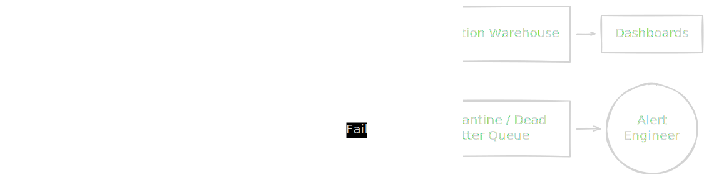
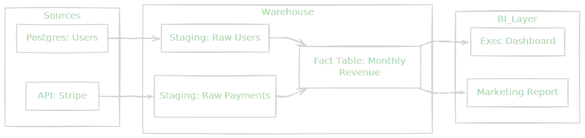

If you take nothing else from this field guide, remember this: **a green dashboard is a lie.**

In standard software engineering, if your code throws an exception, the application crashes. It is loud, immediate, and impossible to ignore. A server returns a 500 error; a mobile app force-closes. The failure screams at you.

In data engineering, failure is often silent. A pipeline can run successfully from start to finish. It can ingest a million rows, transform them without throwing a single error, and load them into the CEO's dashboard. The status light is green. The logs say `SUCCESS`.

But if 40% of those rows have a `NULL` customer ID, or if the revenue column was accidentally multiplied by zero, you haven't built a pipeline. You have built a highly efficient mechanism for poisoning the company's decision-making process.

This is the **silent failure**. It is the data engineer's sewage leak—invisible until people start getting sick.

## 10.1 Data Quality Tests
To prevent silent failures, we need testing. But you cannot test data the way you test application code.

In application development, you write **unit tests**. You test the *logic*. You mock the inputs because you assume the inputs are controllable.

In data engineering, the logic is usually simple (`SELECT * FROM sales`). The *input* is the problem. The input is the real world—messy, unpredictable, and entropic. Users enter emojis in zip code fields. IoT sensors malfunction and send dates from the year 1970. Third-party APIs change their JSON schema without warning.

We don't just test the transformation code; we must test the data itself as it flows through the pipes.

### The Defense Layer: Assertions
We treat data quality as a series of **assertions**—gateways that data must pass through to prove it is fit for consumption. If the data fails an assertion, we have two choices: **halt the pipeline** (stop the flow to prevent contamination) or **quarantine the bad rows** (divert the sewage to a holding tank).

Here are the fundamental checks every architect must implement.

### 1. NULL Checks (The Existence Proof)
The most basic assertion. If a field is mandatory (like a `Transaction_ID` or `Timestamp`), it must exist.

- **The Risk**: Aggregations (SUM/COUNT) often silently ignore NULLs. If half your sales data is NULL, your "Total Revenue" report will be mathematically "correct" (the sum is accurate based on inputs) but factually wrong.

### 2. Uniqueness Constraints (The Idempotency Check)
We discussed idempotency over the last few modules. This is how we verify it. We assert that a specific key (or combination of keys) appears exactly once.

- **The Risk**: Duplicate data inflates metrics. If you accidentally process the sales log twice, you haven't doubled your revenue, but you *have* doubled your tax liability report.

### 3. Referential Integrity (The Relationship Check)
Does the data make sense in the context of the rest of the universe? If a transaction references `User_ID: 55`, does user 55 actually exist in the `Users` table?

- **The Risk**: "Orphaned records." These are transactions belonging to ghosts. They break downstream joins, leading to rows simply vanishing during analysis.

### 4. Domain Validity (The Logic Check)
Does the data adhere to the rules of physics or business?

- *Physics*: A person's age cannot be negative. A timestamp cannot be in the future.
- *Business*: Discount percentage cannot exceed 100%. Order status cannot go from `SHIPPED` back to `PENDING`.

!!! warning "The 'Soft Failure' Trap"

    Be careful when defining strict tests. If you halt the pipeline because **0.01%** of rows are bad, you stop 99.99% of good data from arriving. This is often worse than the bad data itself.

    **The Civil Engineering Solution:** Do not shut down the water main because of one leak. Use a **quarantine table** (often called a "Dead Letter Queue"). Divert the failing rows there for inspection, and let the clean water flow.

### Visualizing the Defense
We insert these tests *after* ingestion or transformation steps but *before* promotion to production tables.

### Beyond Testing: Data Observability
Testing catches "Known Unknowns"—issues we can predict (e.g., "I predict this column might be null"). But what about "Unknown Unknowns"?

What if the data is unique, not null, and referentially valid… but the total volume of sales dropped by 90% compared to last Tuesday? No unit test failed. The data is "valid," but it is clearly wrong.

### The Three Pillars of Observability

1. **Freshness (Timeliness)**:
    - *The Question*: "Is the data arriving when it should?"
    - *The Symptom*: The CEO complains the dashboard hasn't updated since yesterday.
    - *The Check*: Measure the `MAX(timestamp)` against `NOW()`. If the gap exceeds a threshold (the SLA), trigger an alert.
2. **Volume (Throughput)**:
    - *The Question*: "Did we get roughly the amount of data we expected?"
    - *The Symptom*: You usually process 1 M rows/hour. Today, you process 500 rows.
    - *The Check*: Anomaly detection. Compare the current volume against a moving average (e.g., "Volume is -3 standard deviations from the mean.").
3. **Schema Drift (Structure)**:
    - *The Question*: "Did the shape of the data change?"
    - *The Symptom*: A column named `user_id` was renamed to `UserId` by a backend developer. Your pipeline, expecting `user_id`, fills the column with NULLs because it can't find the source.
    - *The Check*: Compare the incoming schema against the expected registry before processing.

### The Governance Contract
By implementing these checks, you are essentially writing a contract.

If you are the "Civil Engineer," the dashboard users are the citizens. They turn on the tap and expect clean water. They do not care about the pipes. They trust the water because they trust you.

When you deploy a pipeline without tests, you are violating that trust. You are telling your stakeholders, "I hope this is right." Hope is not an engineering strategy. **Verification is**.

## 10.2 Privacy and Compliance
For the first decade of the "Big Data" era, the industry mantra was: *Data is the new oil.*

This implication was that data is an asset. The more you have, the richer you are. Companies hoarded petabytes of user logs, believing that someday they would figure out how to monetize it.

That era is over.

In the modern regulatory landscape (GDPR in Europe, CCPA in California), data is not oil. **Data is uranium**.

It is powerful, yes. But it is also toxic. If you store it improperly, it leaks. If you handle it without protection, it poisons the environment. If you hoard it without purpose, you are sitting on liability that can bankrupt your company through massive regulatory fines.

As a data engineer, you are the nuclear safety inspector.

### The Engineering Challenge: The "Right to be Forgotten"
The most difficult engineering constraint introduced by modern privacy laws is the **Right to be Forgotten (RTBF)**. A user can legally demand, "Delete all records you have about me."

In a traditional relational database (like Postgres), this is trivial: `DELETE FROM users WHERE user_id = 55;`.

But remember module 6? We moved to data lakes because they are cheap and efficient. To achieve that efficiency, data lakes use **immutable storage**. We write files (like Parquet or Avro) once. We never modify them.

If you have a 1 GB Parquet file containing 10 million rows, and *one* user wants to be deleted, you cannot just reach in and erase that line. You must:

1. Read the entire 1 GB file into memory.
2. Filter out that single row.
3. Write a *new* 0.99 GB file to the disk.
4. Delete the old file.

This is fundamentally expensive. If 1,000 users ask to be deleted every day, and they are scattered across 5 years of historical partition files, your pipeline will spend more time rewriting history than processing new data.

### Architectural Solution 1: The PII Vault (Tokenization)
The best way to solve the deletion problem is to never put sensitive data in the lake in the first place.

We separate PII (Personally Identifiable Information—names, emails, IP addresses) from **Behavioral Data** (clicks, views, transactions).

1. **Ingestion**: When data arrives, we strip the PII and store it in a secured, transactional database (the vault).
2. **Tokenization**: We replace the PII with a non-reversible, meaningless ID (a token or surrogate key).
3. **Storage**: Only the token and the behavioral data enter the data lake.

**The Result**: When User 55 asks to be deleted, you execute a single `DELETE` in the PII vault. The data lake still contains millions of records for User 55's token, but since the link between the token and the person is destroyed, those records are now truly anonymous. The data remains useful for aggregate analysis (e.g., "How many users clicked X?"), but it is legally compliant.

### Architectural Solution 2: Crypto-Shredding
Sometimes, you must store PII in the lake. Perhaps the analytics team needs to segment users by email domain.

In this scenario, we use **Crypto-Shredding**.

Instead of encrypting the entire dataset with one master key, we encrypt specific columns of user data with a **unique key for that specific user**.

- **To Read**: The system fetches the user's key from a key management service (KMS) to decrypt their email address.
- **To Delete**: We do not touch the petabytes of data in the lake. We simply **delete the user's encryption key** from KMS.

The data in the lake still exists, but it is now mathematically indistinguishable from random noise. Without the key, it is unreadable. In the eye of the law (and physics), it is destroyed.

### Access Control: The Principle of Least Privilege
Governance is not just about deleting data; it's about hiding it from your own colleagues.

In a startup, everyone has `admin` access. In a mature organization, this is a security violation. We use **RBAC (Role-Based Access Control)**.

- **Role A (Data Engineer)**: Needs read/write access to infrastructure but does not need to see the actual content of the `salary` column.
- **Role B (Data Scientist)**: Needs to see the `salary` column for training a model but should not be able to write or delete tables.
- **Role C (Marketing Intern)**: Should see aggregate sales numbers but absolutely zero PII.

Modern data warehouses support **Dynamic Data Masking**. We can define a policy on a table such that:

- If `User = HR_Manager`: Show `salary` as `$105,000`.
- If `User = Developer`: Show `salary` as `NULL` or `*****`.

This logic lives in the database engine, ensuring that no matter how the data is queried (BI tool, SQL client, Python script), the protection holds.

!!! note "The Liability Audit"

    Look at your storage buckets. Are you storing raw JSON dumps that contain credit card numbers or passwords "just in case" you need them later?

    **Stop it.** You are building a radioactive waste dump in your basement. If you don't have a specific, documented use case for a piece of sensitive data, filter it out at the ingestion layer.

## 10.3 Cataloging and Lineage
In the early days of a startup, the "Data Catalog" is usually a guy named Dave.

If you need to know where the revenue numbers are stored, you ask Dave. If you need to know why the `customer_status` column has a value of `7`, you message Dave. Dave is the living, breathing map of the infrastructure.

But eventually, Dave quits. Or worse, the team hires five more engineers, and Dave cannot answer questions fast enough.

Without a map, your data ecosystem becomes a **black box**. New engineers join and spend weeks just trying to find the right table. Analysts define "churn" in three slightly different ways because they are pulling from three slightly different tables.

This is **Data Swamp** territory. To drain the swamp, we need two things: **A Catalog** (to find things) and **Lineage** (to understand how things connect).

### The Catalog: The Library Index
A raw data warehouse is a pile of unlabeled boxes. You can see `Table_A` and `Table_B`, but you don't know what's inside, who put it there, or if it's safe to eat.

A **Data Catalog** wraps technical metadata with business context. It transforms a physical object (a Parquet file) into a discoverable asset.

It answers the "W-Questions":

- **What** does this column mean? (e.g., "Is `revenue` in USD or EUR?").
- **Who** owns this data? (e.g., "If this breaks, do I call the checkout team or the finance team?").
- **When** was it last updated? (e.g., "This table hasn't been touched since 2019. Do not use it.")

!!! tip "The Metadata Gap"
 
    Good catalogs don't just happen. They are the result of **culture**. If your engineering definition of "done" doesn't include "add a description to the table schema," your catalog will be empty.

    Automated tools can scan schema names, but no tool can tell you that `is_active` actually means "User has logged in within the last 30 days." Only a human can document semantic meaning.

### Lineage: The Nervous System
If the catalog is a map of *locations*, **Data Lineage** is a map of the wiring.

Data engineering is rarely about isolated tables. It is about flow. Data moves from Source A $\to$ Job B $\to$ Table C $\to$ Dashboard D.

This flow forms a **DAG**. Lineage is the visualization of that graph. It allows us to trace the path of a single data point from its birth in a mobile app to its death in a PowerPoint slide.

### The "Impact Analysis" Superpower
Why do we care about drawing these lines? It's not for pretty pictures. It is to prevent the most common disaster in our profession: **The Unintended Consequence**.

Imagine you are cleaning up technical debt. You see a column named `mth_rev` in a staging table. It looks ugly. You decide to rename it to `monthly_revenue` for clarity. You update the SQL script and deploy.

**Without Lineage**: You have no idea who uses `mth_rev`.

- Ten minutes later, the CEO's dashboard crashes.
- The Marketing team's automated email campaign fails.
- A machine learning model starts retraining on NULLs.
- You spend the next 6 hours apologizing.

**With Lineage (Impact Analysis)**: Before you touch the code, you query the lineage graph: "Show me all downstream nodes that depend on `mth_rev`."

The graph lights up. You see that 12 dashboards and 3 reverse-ETL jobs read from this column. You now have the foresight to realize, "If I cut this wire, the lights go out in the kitchen."

You don't rename the column. Or, you coordinate a migration plan. You have transitioned from a chaotic hacker to a responsible architect.

### How Lineage is Captured
Lineage is difficult because it is dynamic. You cannot maintain it manually in a spreadsheet; it will be out of date by lunch.

Modern systems capture lineage in two ways:

1. **Parse-Based (Static Analysis)**: Tools read your SQL code. They see `INSERT INTO Table_B SELECT * FROM Table_A` and programmatically draw an arrow from A to B.
    - *Pros*: Can catch issues before code runs.
    - *Cons*: Struggles with complex logic (e.g., Python scripts or dynamic SQL).
2. **Log-Based (Runtime Analysis)**: Tools listen to the database query logs. They see that a job actually read 500 rows from Table A and wrote them to Table B at 10:00 AM.
    - *Pros*: 100% accurate truth of what actually happened.
    - *Cons*: Reactive (you only know after the job runs).

### The Golden Rule of Governance
Governance, cataloging, and lineage often sound like bureaucracy. Engineers hate bureaucracy.

But in data engineering, **governance is speed**.

- If you know where the data is, you build faster.
- If you know who owns it, you debug faster.
- If you know what will break, you deploy with confidence.

A chaotic city has traffic jams. A planned city has highways. We are building the highways.

## Quiz

<quiz>
In the context of data engineering, what is a 'silent failure'?
- [ ] A failure caused by a third-party API being offline.
- [x] A pipeline that completes successfully but produces incorrect or corrupted data.
- [ ] A transformation job that runs slower than the defined Service Level Agreement (SLA).
- [ ] A pipeline crash that does not send an alert to the on-call engineer.

</quiz>

<quiz>
You represent a 'Civil Engineer' managing the water supply. If 0.01% of the incoming water (data) is contaminated, what is the recommended architectural pattern to handle it without disrupting the city?
- [ ] Allow the bad data to pass through but tag it with a warning flag.
- [ ] Automatically delete the bad rows and proceed without logging them.
- [ ] Immediately halt the entire pipeline to prevent any contamination.
- [x] Divert the failing rows to a Quarantine Table (Dead Letter Queue) and process the rest.

</quiz>

<quiz>
A downstream dashboard is reporting fewer customers than expected. You verify that the user IDs in the 'Sales' table do not correspond to any valid records in the 'Users' table. Which specific data quality assertion failed?
- [ ] Null check.
- [x] Referential integrity.
- [ ] Domain validity.
- [ ] Uniqueness constraint.

</quiz>

<quiz>
Why is the 'Right to be Forgotten' (GDPR/CCPA) technically difficult to implement in a standard data lake architecture?
- [x] Data lakes often use immutable storage formats, requiring entire files to be rewritten to remove one row.
- [ ] Data lakes do not support SQL, making it hard to find the user.
- [ ] It is impossible to identify PII within unstructured data.
- [ ] Data lakes are inherently insecure and cannot restrict access to files.

</quiz>

<quiz>
What is the primary mechanism of 'Crypto-Shredding'?
- [x] Encrypting specific user data with a unique key, then deleting the key to render the data unreadable.
- [ ] Overwriting the hard drive sectors with random zeros and ones seven times.
- [ ] Moving sensitive data to a 'shredder' database that runs a daily `DELETE` script.
- [ ] Usage a hash function to anonymize PII before it enters the warehouse.

</quiz>

<quiz>
Which architectural pattern involves replacing sensitive PII with a non-reversible ID before it enters the data lake?
- [ ] Dynamic data masking.
- [x] The PII Vault (Tokenization).
- [ ] Role-Based Access Control (RBAC).
- [ ] Change Data Capture (CDC).

</quiz>

<quiz>
Your pipeline runs successfully, passes all null and uniqueness checks, but the total volume of sales reported is 50% lower than the historical average for a Tuesday. Which pillar of data observability detects this?
- [ ] Schema drift.
- [ ] Freshness.
- [ ] Referential integrity.
- [x] Volume (throughput).

</quiz>

<quiz>
What is the primary purpose of 'Data Lineage'?
- [x] To visualize the flow of data from source to consumption and understand dependencies.
- [ ] To automatically generate unit tests for SQL queries.
- [ ] To enforce strong typing and schema validation on JSON files.
- [ ] To compress data for cheaper long-term storage.

</quiz>

<quiz>
You need to rename a column in a core table. Before doing so, you use a tool to check which downstream dashboards and jobs will break. This process is called:
- [x] Impact analysis.
- [ ] Schema evolution.
- [ ] Backfilling.
- [ ] Unit testing.

</quiz>

<quiz>
Which method of capturing lineage provides the 100% accurate 'truth' of what actually happened, even if it is reactive?
- [ ] Parse-based (static analysis).
- [ ] Manual documentation.
- [x] Log-based (runtime analysis).
- [ ] Tagging.

</quiz>

<!-- mkdocs-quiz results -->