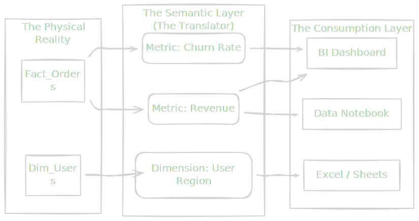
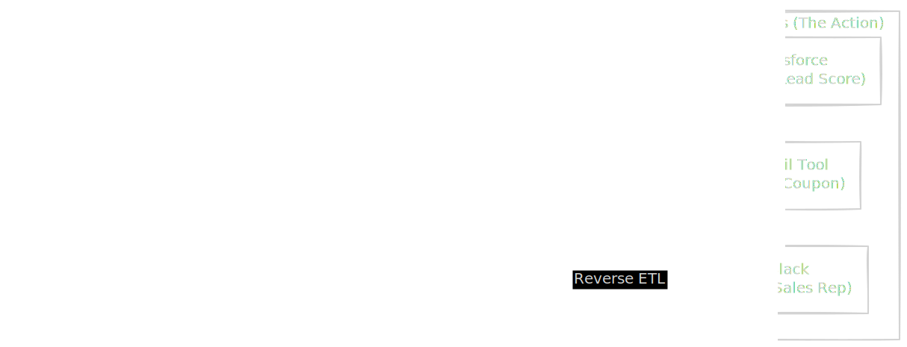
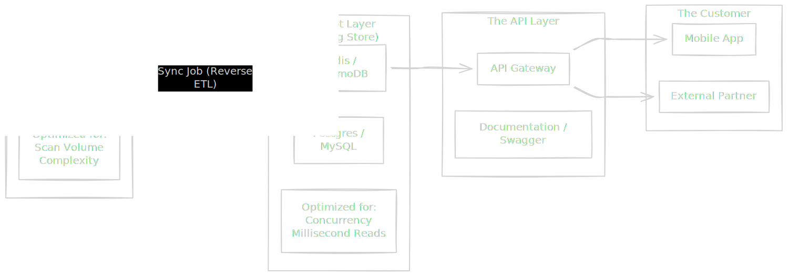

We have spent this entire course in the dark. We have wrestled with ingestion protocols, survived the chaos of distributed logs, and carefully architected a storage layer that balances cost with consistency. We have treated data as a physical substance—pumping it, refining it, and storing it.

But a reservoir full of pristine water is useless if the taps in the city are dry.

Welcome to **The Serving Layer**. This is the "last mile" of data engineering. It is the interface where your architectural purity meets the messy reality of the real world. Until this point, your consumers have mostly been other systems or other engineers. Now, your consumer is a human being.

And humans are the most demanding endpoint of all.

## 11.1 Business Intelligence (BI)
When we talk about business intelligence, we aren't talking about "making charts." We are talking about the **human interface device (HID)** for your data infrastructure.

In the civil engineering analogy, the BI tool is the faucet in the kitchen. The user doesn't care about the miles of pipe, the pressure valves, or the filtration plants you built. They turn the handle, and they expect clear water instantly. If the water is brown or if it takes ten seconds to start flowing, they don't blame the filtration plant. They blame the faucet.

As a data engineer, you might be tempted to dismiss dashboards as "not real engineering." You might think your job ends when the table is created in the warehouse. You are wrong. If the query powering that dashboard takes 45 seconds to load, your pipeline is broken. If the number on the screen is wrong, your pipeline is broken.

### The Problem with Translation
The raw tables in your data warehouse are designed for *storage efficiency* or *compute efficiency* (Star Schemas, compression, partitioning). They are rarely designed for *human comprehension*.

A database table looks like this:

| order_id | user_id | amount_cents | status | created_at_utc |
|:---|:---|:---|:---|:---|
| 10249 | 8821 | 4500 | 4 | 2023-10-27 10:00:00 |

But a business stakeholder asks this, "What was the average revenue per user for completed orders in California last Q3?"

Notice the gap? The database speaks in `amount_cents` and `status_codes`. The human speaks in "Revenue" and "Completed." Who bridges that gap?

If you force the stakeholder to write raw SQL to figure out that `status = 4` means "Completed" and `amount_cents / 100` is 'Revenue," you have failed. You have leaked internal implementation details to the public interface.

### The Semantic Layer
To solve this, we introduce an architectural component known as the **Semantic Layer**.

Think of the semantic layer as the API for your data warehouse. It decouples the **Physical Data Model** (tables, columns, partitions) from the **Logical Data Model** (Revenue, Churn, Active Users).



The semantic layer is where you define **metrics** and **dimensions** once, in code.

- **Physical**: `SUM(amount_cents) WHRE status != 5`
- **Semantic**: `Gross Revenue`

When the business logic changes (e.g., "We no longer count refunded orders as revenue"), you update the definition in the semantic layer. Every dashboard, every report, and every Excel sheet consuming that metric updates automatically.

!!! warning "The Logic Trap"

    The most dangerous anti-pattern in the serving layer is **defining logic in the BI tool**.

    If you create a calculated field inside Tableau or PowerBI called "Profit," that logic now lives in *that specific dashboard*. When another analyst creates a report in a different tool (or even a different dashboard in the same tool) and defines "Profit" slightly differently, you enter the nightmare of **Metric Drift**.

    Finance reports $10 M. Marketing reports $11 M. Both pull from the same warehouse. The data isn't wrong; the *interpretation* is inconsistent. Logic must live in the infrastructure (Warehouse or Semantic Layer), not the presentation layer.

### Physics of the Dashboard: Latency and Aggregation
Humans are impatient. Studies show that if a dashboard takes longer than 3-5 seconds to load, user trust plummets. They assume the system is "broken" or the data is unreliable. 

This brings us back to physics. You cannot scan 10 billion rows, join five tables, and aggregate the result in 800 milliseconds every time a user changes a filter. The compute cost is too high, and the laws of I/O latency won't allow it.

To serve humans, you must often cheat the physics by pre-calculating the answers.

#### 1. Materialized Views / Aggregation Tables
Instead of letting the BI tool query the raw transaction logs, you build a "Serving Table" that rolls the data up.

- **Raw**: 10 billion rows of every click on the website.
- **Serving**: A table grouped by `Day`, `Page`, and `UserType`. (1 million rows).

The dashboard queries the Serving Table. It loses the ability to drill down to the atomic event, but it gains the ability to render instantly.

#### 2. Caching
BI tools use caching aggressively. If User A asks for "Q3 Revenue," the tool calculates it and stores the result. If User B asks for the same thing one minute later, the tool serves the stored result without touching the warehouse.

As a data engineer, you must understand the **Cache Invalidation** policy.

- If your pipeline updates the warehouse at 9:00 AM…
- But the BI tool's cache expires at 10:00 AM…
- Between 9:00 and 10:00, the dashboard is showing "stale" data even though the warehouse is fresh.

This is a classic "Silent Failure." The pipeline worked. The dashboard works. But the user is seeing a lie. You must coordinate the **Freshness signals** between your pipeline and the serving layer.

### Trust as a Service
The ultimate output of the serving layer is not a chart; it is **trust**.

When a user sees a number on a dashboard, they are betting their reputation on it. They are taking that number to a board meeting. If that number changes randomly, or if two dashboards disagree, the user will stop using your infrastructure entirely. They will go back to their manual Excel spreadsheets.

And if they go back to Excel, your fancy distributed pipeline, your Kafka clusters, and your Delta Lakes are just expensive digital monuments to failed adoption.

**The Golden Rule of Serving**:

1. **Consistency over Completeness**: It is better to show *no* data than *wrong* data.
2. **Performance is a feature**: A slow dashboard is a broken dashboard.
3. **One Source of Truth**: Never allow logic to be defined in the visualization tool.

## 11.2 Reverse ETL
For decades, the flow of data was a one-way street. We extracted data from pipelines, dragged it across the treacherous terrain of the network, and deposited it into the data warehouse.

Once it arrived, it stayed here. The warehouse became a vault—a place where data went to retire. It was viewed on dashboards, analyzed in reports, and occasionally exported to a CSV, but it never left the value to do actual work.

**Reverse ETL** is the architectural inversion of this flow. It is the realization that the data warehouse is not just a destination for analytics; it is the **engine of operations**.

### The Problem: The "Dumb" Application
Your company uses Salesforce for sales, Zendesk for support, and Marketo for emails. Each of these tools is a **silo**.

- Salesforce knows the customer bought a contract.
- Zendesk knows the customer filed 10 angry tickets yesterday.
- Marketo knows the customer unsubscribed from the newsletter.

Individually, these tools are dumb. The sales rep looking at Salesforce has no idea that the customer is angry (Zendesk data). They might call to upsell a client who is actively trying to cancel. This is an embarrassing, expensive failure of information architecture.

The data warehouse is the *only* place where all this data exists together. In the warehouse, you have joined these tables. You have calculated a `Churn_Risk_Score`. You know the truth.

Reverse ETL is the process of pumping that "refined truth" back into the operational tools where it can actually drive behavior.

### The Architecture: Closing the Loop
If standard ETL is bringing ore from the mine to the factory, Reverse ETL is shipping finished cars to the dealerships.



### The Mechanics: The Diff Engine
You might think, "I can just write a script to query the database and POST to the Salesforce API."

If you have 100 customers, yes. If you have 10 million, this approach explodes.

Operational APIs (like Salesforce or HubSpot) are not like databases. They are slow, fragile, and rate-limited. You cannot simply `INSERT OVERWRITE` the entire customer list into Salesforce every hour.

1. **Latency**: It would take days.
2. **Cost**: You will hit API rate limits and get blocked.
3. **Noise**: You will trigger thousands of unnecessary "Record Updated" webhooks in the downstream system, creating chaos.

Successful Reverse ETL relies on a **Diffing Engine**.

Instead of syncing the whole table, the system compares the **Current State** of the warehouse against the **Last Synced State**. It calculates a "delta"—the minimal set of changes required to make the destination match the source.

- **Row A**: No change (skip).
- **Row B**: `Score` changed from 50 to 80 (update).
- **Row C**: New user (create).

This minimizes network traffic and API calls. It turns a "Big Data" problem back into a manageable set of transactions.

### The Physics of the "Last Mile"
When you build Reverse ETL pipelines, you leave the comfortable world of high-throughput SQL and enter the hostile world of **REST APIs**.

#### 1. The Rate Limit Wall
Databases are designed to ingest millions of rows per second. SaaS APIs are often designed to handle 50 requests per second.

If your warehouse calculates 100,000 updated user scores, you cannot shove them into the API instantly. You must implement **backpressure** and **throttling**. You need a queue system that trickles data out at exactly the rate the destination API permits. If you go too fast, you get a `429 Too Many Requests` error, and your pipeline fails.

#### 2. Data Mapping & Type Safety
In your warehouse, a `User_ID` might be an integer. In Salesforce, it might be a case-sensitive string. In your warehouse, a date is `YYYY-MM-DD`. The API might expect a Unix timestamp.

The "Transformation" layer here is not just business logic; it is **format translation**. You are translating between the dialect of the database (SQL) and the dialect of the web (JSON).

```json
// The Warehouse has:
// { "user_id": 101, "joined": "2023-01-01" }

// The API demands:
{
  "properties": {
    "external_id": "101",
    "createdate": 1672531200000
  }
}
```

If this translation fails, the sync fails silently for that record.

### The Danger: Writing on Production
This is the most critical shift in mindset.

- **Forward ETL (Analytics)**: If you break the pipeline, the dashboard is stale. The CEO is annoyed.
- **Reverse ETL (Operations)**: If you break the pipeline, **you break the business**.

Imagine you have a logic error in your SQL that sets every customer's `Discount_Rate` to 99%.

- In a dashboard, this is a funny graph.
- In Reverse ETL, this syncs to your billing system. You just charged all your customers $0.01. You have lost the company millions of dollars in seconds.

Because Reverse ETL writes data *back* into the live operational systems, the standard for **testing** and **validation** must be significantly higher. You are no longer an observer; you are an actor.

!!! warning "The Idempotency Requirement"

    Network failures happen. Your sync script might crash halfway through sending data to the API. When you restart it, what happens?
    
    If you send the same "Create Order" event twice, do you charge the customer twice?

    A robust Reverse ETL system must be **Idempotent**. It must use unique "deduplication keys" so that if the destination receives the same message twice, it knows to ignore the second one.

## 11.3 APIs and Data Products
We have arrived at the final frontier of the serving layer.

In 11.1, we served humans (who are forgiving). In 11.2, we served internal SaaS tools (which are slow). Now, we are serving **software**.

When you expose your data via an API (Application Programming Interface), you are no longer just a data engineer maintaining a pipeline; you are a backend engineer maintaining a production service. The stakes change immediately. A human can wait 10 seconds for a dashboard to load. A microservice hitting your API expects a response in 50 milliseconds. If you miss that window, the transaction fails.

This is the realm of **data products**.

### The "Data as a Product" Mindset
Historically, data was a byproduct. It was "exhaust" left behind by applications. The data team swept it up, cleaned it, and put it in a pile.

Treating data as a product means inverting that relationship. The data is the asset. It has consumers, it has a roadmap, and most importantly, it has an **interface contract**.

A table in a warehouse is not a product. It is a bucket. A **Data Product** is:

1. **The Data**: The raw information.
2. **The Metadata**: Descriptions of what the columns mean.
3. **The Access Mechanism**: High-performance APIs (REST, GraphQL, gRPC).
4. **The Guarantee (SLA)**: A promise regarding uptime, freshness, and accuracy.

### The Architecture: The "Speed Layer"
Here is the fundamental physics problem: **Data Warehouses (OLAP) are terrible backends for APIs**.

Snowflake, BigQuery, and Redshift are not designed to scan billions of rows to answer complex questions ("What was the average sales price last year?"). They take seconds or minutes to respond. They cannot handle the concurrency of 10,000 users hitting an app simultaneously.

If you hook a user-facing mobile app directly to your data warehouse, your app will crash, and your cloud bill will bankrupt you.

To build a data product, you need a **speed layer** (often called a "serving store").



**The Pattern**:

1. **Crunch in the Warehouse**: Do the heavy lifting (joins, aggregations, window functions) in the warehouse where it is cheap and easy.
2. **Publish to the Edge**: Push that final, calculated result into a high-performance store like Redis, Cassandra, or a standard Postgres instance.
3. **Serve from the Edge**: The API queries the high-performance store, not the warehouse.

This decouples the *production of data* (which can take minutes) from the *consumption of data* (which must take milliseconds).

When you publish an API, you cannot rename *anything*. Ever.

External developers write code that depends on your field names, your data types, and your structure. If you change a field from a string to an integer, their code crashes. This is a **breaking change**.

In the data product world, the **Schema is a Contract**.

!!! note "Semantic Versioning for Data"

    Just like software libraries, data products must be versioned.

    - **v1.0**: Returns `{ "user": "123" }`
    - **v1.1**: Returns `{ "user": "123", "email": "a@b.com" }` (non-breaking additions
    - **v2.0**: Returns `{ "userId": 123}` (breaking change)

    You must often keep v1 running for months while begging your consumers to migrate to v2. This is the burden of becoming a platform.

### The Data Mesh (A Brief Note)
As your organization grows, the central data team becomes a bottleneck. You cannot possibly understand the nuances of marketing data, finance data, and engineering data simultaneously.

This leads to the **Data Mesh** architecture.

In a mesh, the central team doesn't own the data. They own the *infrastructure* (the pipes, the warehouse, and the API gateway). The specific teams (domains) own their **Data Products**.

- **The Marketing Team**: Owns the "Campaign Performance" API.
- **The Finance Team**: Owns the "Revenue Recognition" API.

They build it, they document it, and they are woken up by pager duty when it breaks. The central data engineer provides the platform that makes this possible, ensuring that the "Campaign" product and the "Revenue" product can still talk to each other when needed.

## Quiz

<quiz>
What is the primary function of the 'Semantic Layer' in a data architecture?
- [x] To translate physical data models into logical business metrics.
- [ ] To perform heavy data cleaning and deduplication.
- [ ] To store raw data logs for auditing purposes.
- [ ] To visualize data in charts and graphs.

</quiz>

<quiz>
Which of the following describes the 'Logic Tarp' anti-pattern in business intelligence?
- [ ] Connecting the BI tool to a read-replica database.
- [ ] Using SQL instead of a drag-and-drop interface.
- [x] Defining business logic, such as profit calculations, directly inside the BI visualization tool.
- [ ] Allowing users to download data as CSV files.

</quiz>

<quiz>
Why are 'Aggregation Tables' or 'Materialized Views' often necessary for serving dashboards?
- [ ] To save storage space in the data warehouse.
- [x] To bypass the laws of physics regarding latency and compute cost.
- [ ] To allow users to edit the data manually.
- [ ] To ensure data is encrypted at rest.

</quiz>

<quiz>
What is the primary purpose of 'Reverse ETL'?
- [ ] To move data from operational apps into the data warehouse.
- [x] To pump refined insights from the warehouse back into tools like Salesforce.
- [ ] To visualize data for external stakeholders.
- [ ] To back up the data warehouse to a secondary location.

</quiz>

<quiz>
Why is a 'Diffing Engine' critical for efficient Reverse ETL?
- [x] It minimizes API calls by only sending records that have changed.
- [ ] It allows the warehouse to accept write operations.
- [ ] It calculates the difference between revenue and profit.
- [ ] It encrypts the data during transit.

</quiz>

<quiz>
In the context of Reverse ETL, what does 'idempotency' guarantee?
- [ ] The data is automatically validated against a schema.
- [ ] The pipeline runs at the exact same time every day.
- [x] Running the same sync job twice results in the same state, without duplication.
- [ ] The pipeline runs faster on the second attempt.

</quiz>

<quiz>
What distinguishes a 'Data Product' from a standard database table?
- [ ] It contains more rows of data.
- [x] It includes an interface, metadata, and an explicit Service Level Agreement (SLA).
- [ ] It is generated by a Machine Learning model.
- [ ] It is always stored in JSON format.

</quiz>

<quiz>
Why is a data warehouse (OLAP) typically a poor backend for a user-facing API?
- [ ] It does not support SQL queries.
- [ ] It is not secure enough for public access.
- [x] It cannot handle high concurrency and low-latency requests.
- [ ] It cannot store historical data

</quiz>

<quiz>
Which architecture pattern solves the latency problem for Data Products?
- [ ] Vertical scaling.
- [x] The speed layer (serving store).
- [ ] The data lake.
- [ ] Batch processing.

</quiz>

<quiz>
In the context of Data Products, why is 'Schema as a Contract' critical?
- [x] To prevent breaking changes for downstream consumers.
- [ ] To allow for faster data ingestion.
- [ ] To reduce storage costs.
- [ ] To ensure the database looks pretty.

</quiz>

<!-- mkdocs-quiz results -->