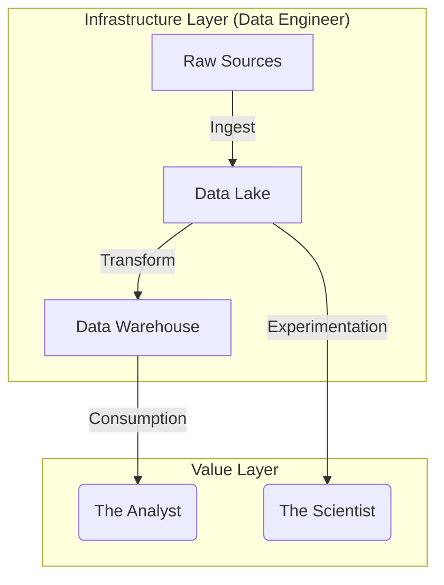
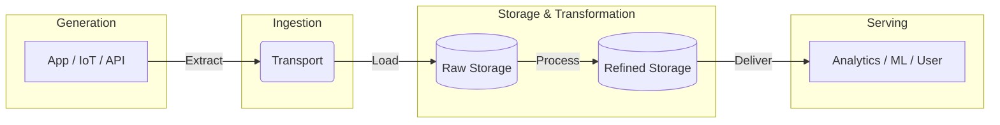
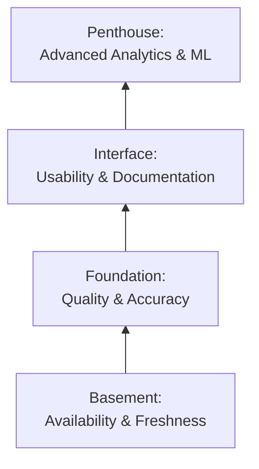

## 1.1 What is Data Engineering?
If you're reading this, you probably enjoy the feeling of systems humming quietly in the background. You are the type of person who walks into a skyscraper and doesn't look at the chandelier; you wonder how the water pressure is maintained on the 40th floor. 

There is a prevalent myth that data engineering is simply a sub-genre of software engineering—that we are just developers who happen to really like SQL. This is incorrect. While we share tools (version control, CI/CD, IDEs), our domain is fundamentally different.

**Software engineering** is primarily about managing the complexity of **logic**. **Data engineering** is primarily about managing the complexity of **movement** and **state**.

We are the civil engineers of the digital world. We do not build the race cars (Machine Learning models) or the billboards (Business Intelligence dashboards). We build the highway system. We ensure the asphalt is flat, the bridges don't collapse under load, and the traffic lights are synchronized.

If a software engineer does their job poorly, the application crashes. It is a loud, visible failure. If a data engineer does their job poorly, the pipeline keeps running, but the CEO makes a strategic decision based on a number that is off by 15%. This is a **silent failure**. It is the most dangerous thing in our profession.

### The Physics of Information
To understand this role, you must stop treating data as "magic numbers" and start treating it as a physical substance with mass and inertia.

In a typical software application, data is often ephemeral. A user logs in, the session exists in memory, they log out, and the memory is freed. But in data engineering, we deal with **gravity**.

- **Volume (Mass)**: Moving 10 rows is trivial. Moving 10 billion rows requires understanding network bandwidth, serialization costs (CPU), and disk I/O.
- **Velocity (Momentum)**: Data never stops arriving. You cannot simply "pause" a live stream of credit card transactions to fix a bug without building a reservoir (buffer) to hold the backlog.
- **Variety (Entropy)**: Systems naturally drift towards chaos. Upstream APIs change schemas without warning. Date formats switch from `MM-DD-YYYY` to `ISO 8601`. If your infrastructure is brittle, it snaps.

### The Triad: Builder, Explorer, and Storyteller
In the modern data organization, there are usually three distinct archetypes. Confusion arises because they often sit in the same room and use the same vocabulary, but their mandates are entirely different.

#### 1. The Explorer: The Data Scientist
The data scientist is a mathematician and an experimenter. Their goal is to find patterns in the noise. They need to traverse vast amounts of data to train models that predict the future.

- **The Mindset**: Probabilistic. "The model is 85% accurate."
- **The Need**: "Give me everything. I'll clean it myself if I have to."

#### 2. The Storyteller: The Data Analyst
The analyst is a business translator. They take data and turn it into actionable insights for humans. They build the charts that tell management how the company performed last quarter.

- **The Mindset**: Deterministic. The revenue number must be exact to the penny.
- **The Need**: "Give me clean, trusted, pre-aggregated data."

#### 3. The Builder: The Data Engineer
That's you. You are the architect who builds the environment where the other two can work. You do not analyze the data; you analyze the **systems** that hold the data.

!!! note "The Service Level Agreement (SLA)"

    You are not responsible for the *meaning* of the revenue data (whether revenue is up or down is a business problem). You are responsible for the *availability* and *freshness* of that data. Your contract with the business is: "The data will be in the warehouse by 8:00 AM, and it will be consistent with the source."

### Visualizing the Relationship
We can view the relationship as a dependency graph. The engineer is the foundational asset.

Notice that the analyst and scientist consume from different stages. The scientist often needs the raw complexity of the **Data Lake** to find new features. The analyst needs the refined structure of the **Data Warehouse** for reporting. You must maintain both environments simultaneously.

### Infrastructure as Code (IaC)
Finally, we must distinguish data engineering from "Database administration" (DBA). In the old world, a DBA manually created tables and managed permissions via a command line.

In the modern era, **we code the infrastructure**.

We do not manually log into a server to run a script. We write code (in Python, Terraform, or SQL) that defines the pipeline, and we deploy that code. That brings the rigor of software engineering—testing, version control, and peer review—to the world of data.

## 1,2 The Value Chain: From Source to Serving
If you take a gigabyte of user data and let it sit on a hard drive, it is not an asset. It is a **liability**. It costs more to store, it is a security risk to guard, and it provides zero value to the business.

Data is only valuable when it moves.

The job of the data engineer is to construct a **Value Chain**. We take raw, hazardous material from the source and refine it through a series of stages until it is safe and useful for consumption. We call this the **Data Engineering Lifecycle**.

You will see this pattern in every company, whether they are a three-person startup using a single Postgres database or a tech giant processing petabytes. The tools change, but the physics remain the same.

### The Lifecycle Map
Let's visualize the journey of a single data point—say, a user clicking "Buy" on an e-commerce site.

#### 1. Generation
This is "The Source." It is where data is born.

- **Examples**: A row inserted into a MySQL database by a backend server, a JSON event emitted by a mobile phone, a temperature reading from an IoT sensor.
- **The Reality**: As a data engineer, you rarely control this. You are at the mercy of the software engineers who build the applications. They will change column names without telling you. They will allow users to enter emojis into integer fields.
- **The Mandate**: You must communicate. If the source is the headwaters of the river, you need to know if someone upstream starts dumping toxic waste (bad data) into it.

#### 2. Ingestion
This is "The Transport." It is the mechanism of moving data from the Source into our domain.

- **The Physics**: This is where we battle latency and bandwidth. Are we moving the data once a day (Batch)? Or are we moving it milliseconds after it happens (Streaming)?
- **The Risk**: Networks are unreliable. Connections time out. APIS hit rate limits. Ingestion is where the physical world (servers, cables, routers) interferes with your logical design.

!!! warning "The Bottleneck"

    Ingestion is often the most fragile part of the pipeline because it crosses boundaries. You are reaching out to systems you do not own to pull data into systems you do. This "border crossing" is where authentication fails and firewalls block connections.

#### 3. Storage
This is "The Reservoir." Once we ingest data, we must park it somewhere durable.

- **The Evolution**: Historically, we tried to clean data before storing it. Today, storage is cheap. We prefer to land the data in its raw, ugly format first (the **Data Lake**) and clean it later.
- **Why**? Because if your cleaning code has a bug, you want to be able to go back to the raw data and reprocess it. If you cleaned it on the way in and threw away the original, the data is gone forever.

#### 4. Transformation
This is "The Refinery." This is where the actual value is created.
- **The Action**: We take the raw, cryptic data and turn it into business concepts.
    - *Raw*: `user_id: 843, action: 05, ts: 167888842`
    - *Refined*: `User: Bob, Event: Checkout, Time: 10:00 AM EST`
- **The Complexity**: This is where business logic lives. Combining data from Sales, Marketing, and inventory to calculate "Net Profit." This is where CPU cycles are burned and where 80% of your debugging time will go.

#### 5. Serving
This is "The Tap." The final mile.
- **The Consumer**: It might be a CEO looking at a dashboard (Business Intelligence). It might be a machine learning model asking for the last 5 transactions to detect fraud. It might be the Finance Department's Excel sheet.

### The Undercurrents
While the data flows left-to-right, there are cross-cutting concerns that apply to every stage. You cannot "bolt these on" at the end; they must be baked into the architecture.

1. **Security**: Who is allowed to see the data? (You don't want the intern querying the CEO's salary).
2. **Data Management (Governance)**: Do we know what this data is? Is there a dictionary defining what "Churn Rate" actually means?
3. **DataOps (Orchestration)**: The conductor of the orchestra. What triggers the ingestion? What happens if the transformation fails? Who gets paged at 3:00 AM?

## 1.3 The Core Mandate: Trust and Reliability
We have defined **who** we are (Builders) and what we build (The Value Chain). Now we must define **why** we exist.

You might think our job is to "move data." That is incorrect. A script can move data. You might think our job is to "make data available." That is insufficient. A dump of raw JSON files is available but useless.

Our job is to manufacture **trust**.

In software engineering, a bug is usually loud. An application crashes, a button doesn't click, a 404 error happens. The user knows immediately that something is broken.

In data engineering, our bugs are **silent**.

### The Silent Failure
Imagine a pipeline that aggregates daily revenue.

- **Scenario A (Loud Failure)**: The database connection fails. The pipeline crashes. The dashboard shows "No Data."
    - *Result*: The CEO calls you. You fix the connection. Everyone moves on.
- **Scenario B (Silent Failure)**: The Marketing team changes the capitalization of a campaign tag from "Winter_Sale" to "winter_sale." Your fastidious `WHERE campaign = 'Winter_Sale'` clause now filters out 40% of the revenue. The pipeline runs successfully. The dashboard updates.
    - *Result*: The dashboard shows revenue is down 40%. The CEO panics. They fire the VP of Sales. Two weeks later, they find out it was a data error.
    - *Impact*: You have not just broken a pipeline; you have broken the **decision-making capability of the company**.

When a software engineer breaks the app, users can't buy things. When a data engineer breaks the data, the company flies blind.

### Trust is Finite Capital
Trust is a battery. Every time you deliver accurate, timely data, you charge the battery slightly. Every time a stakeholder finds a discrepancy before you do ("Why does the dashboard say 0 sales for yesterday?"), the battery drains massive amounts of power.

If the battery hits 0%, the business stops using your infrastructure. They go back to Excel. They hire their own "Shadow IT" analysts. You become irrelevant. 

### Defining Reliability: The SLA
To protect trust, we must treat data as a **product**, not a byproduct. Like any product, it comes with a warranty. We call this the **Service Level Agreement (SLA)**.

You must negotiate these three metrics with your stakeholders (the Analysts and Scientists) *before you write a single line of code*.

#### 1. Freshness (Latency)
- *The Question*: "How old is the data allowed to be?"
- *The Trap*: Everyone says they want "Real-Time." They rarely need it. Real-time is expensive and complex (see module 5).
- *The Negotiation*: "If I give you the data at 8:00 AM every morning, is that enough?" (Batch). "Do you need to see the transaction within 5 seconds of it happening?" (Streaming).

#### 2. Accuracy (Correctness)
- *The Question*: "Is the data right?"
- *The Metrics*:
    - **Completeness**: Did we lose any rows? (Count Source vs. Count Destination).
    - **Uniqueness**: Do we have duplicates? (Did we count the same sale twice?).
    - **Consistency**: Does the total revenue equal the sum of the individual line items?

#### 3. Availability (Uptime)
- *The Question*: "Can I query the data right now?"
- *The Reality*: Even if the data is fresh and accurate, if the data warehouse is down for maintenance during the board meeting, you have failed.

### The Hierarchy of Data Needs
We can visualize this using Maslow's Hierarchy. You cannot focus on "AI/ML" (Self-Actualization) if you haven't solved "Availability" (Physiological Needs).

1. **Bottom Layer (The Basement)**: The data must be there, and it must be on time. If it's not, nothing else matters.
2. **Second Layer (The Foundation)**: The data must be accurate. No duplicates, no silent filtering.
3. **Third Layer (The Interface)**: The data must be easy to understand. Column names should make sense (`customer_id`, not `c_001`).
4. **Top Layer (The Penthouse)**: Only *after* the bottom three are solid can you do Machine Learning.

!!! tip "The 80/20 Rule of Reliability"

    80% of data errors are caused by upstream changes (schema drift, API changes). Only 20% are actual bugs in your code. Therefore, **defensive coding**—checking the data as it enters your system—is more important than optimizing your algorithms.

## Quiz

<quiz>
According to the 'Civil Engineer' analogy, what is the primary  responsibility of a data engineer?
- [ ] Creating machine learning models to predict future needs.
- [ ] Analyzing the data to find business insights.
- [ ] Manually entering data into the database to ensure accuracy.
- [x] Building and maintaining the infrastructure (pipes and pumps) that move the data.

</quiz>

<quiz>
What is a 'Silent Failure'?
- [ ] The pipeline crashes loudly and sends an error alert immediately.
- [ ] The dashboard fails to load for the end user.
- [x] The pipeline runs successfully but produces incorrect or corrupted data.
- [ ] The database connection times out, and no data is loaded.

</quiz>

<quiz>
In the Data Engineering Lifecycle, which stage is described as 'The Border Crossing,' where you interact with systems you do not own?
- [x] Ingestion.
- [ ] Generation.
- [ ] Transformation.
- [ ] Serving.

</quiz>

<quiz>
Why is it often recommended to store data in a 'Data Lake' (Raw Storage) before transforming it?
- [x] It allows you to replay history if your transformation logic has a bug.
- [ ] It ensures the data is strictly validated against a schema immediately.
- [ ] It is faster for the CEO to query raw JSON files directly.
- [ ] It reduces the storage cost to zero.

</quiz>

<quiz>
Which SLA metric answers the question, 'How old is the data allowed to be?'
- [ ] Accuracy.
- [x] Freshness.
- [ ] Availability.
- [ ] Completeness.

</quiz>

<quiz>
Which role is primarily responsible for 'The Meaning' of the data and translating it for business stakeholders?
- [ ] Data Scientist
- [x] Data Analyst
- [ ] Database Administrator
- [ ] Data Engineer

</quiz>

<quiz>
In the 'Physics of Information,' what constraint is associated with the 'Volume' of data?
- [ ] Visibility.
- [ ] Entropy and chaos.
- [ ] Momentum.
- [x] Mass and Inertia.

</quiz>

<quiz>
What is the 'Great Trap' regarding Real-time data?
- [x] It is often requested but rarely needed.
- [ ] It is too slow for modern businesses.
- [ ] It cannot be done with current technology.
- [ ] It requires manual intervention.

</quiz>

<quiz>
According to the 'Hierarchy of Data Needs,' what must be solved before you can attempt Machine Learning?
- [ ] User interface design.
- [x] Availability and freshness.
- [ ] Predictive analytics.
- [ ] Reverse ETL.

</quiz>

<quiz>
What distinguishes modern data engineering from traditional database administrators (DBA)?
- [ ] Data engineers do not use SQL.
- [ ] Data engineers only work with small datasets.
- [x] Data engineers focus on 'Infrastructure as Code.'
- [ ] Data engineers do not care about uptime.

</quiz>

<!-- mkdocs-quiz results -->