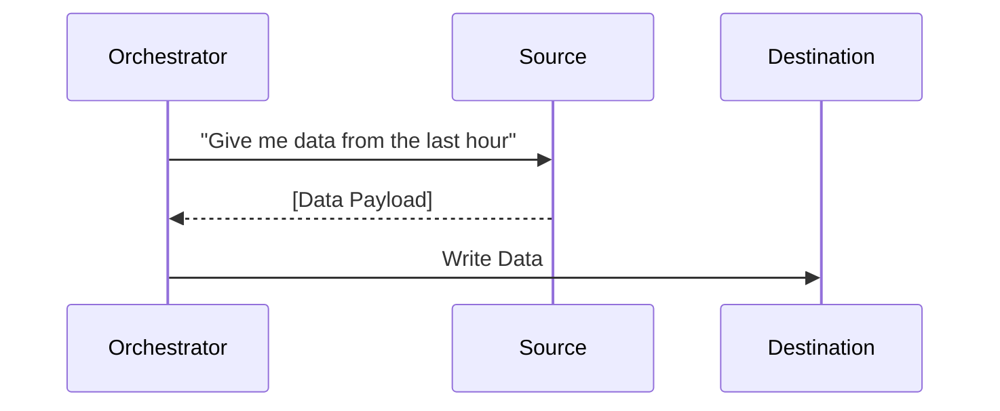
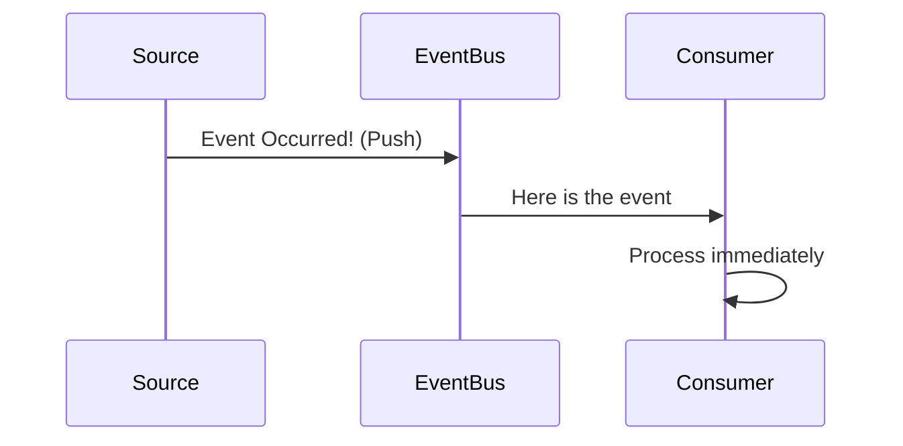
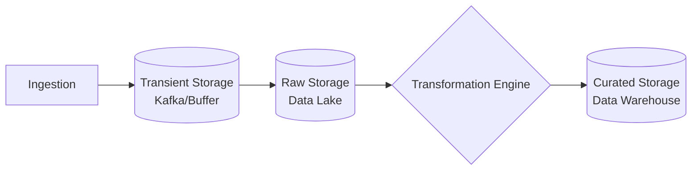
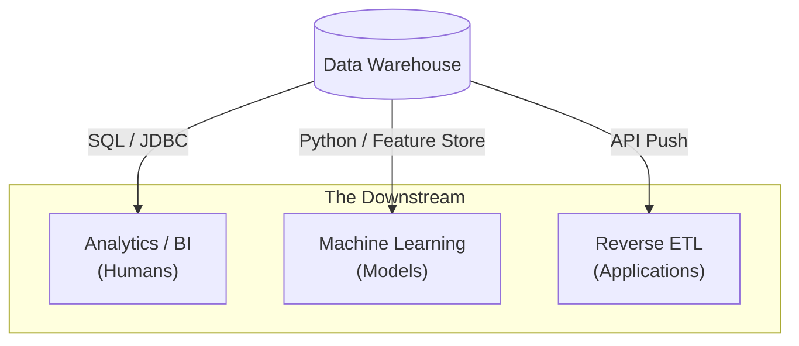

If you walk into a factory and ask where the product comes from, they won't point at the conveyor belt; they will point at the raw materials loading dock.

In data engineering, we often get so obsessed with our shiny conveyor belts—our Spark clusters and Airflow DAGs—that we forget to ask where the raw material originates. We treat data like water that simply appears at the turn of a tap.

But data has a **lifecycle**. It is born, it travels, it transforms, it serves a purpose, and eventually, it dies (or gets archived to cold storage). To build a reliable system, you must understand the physics of this journey.

We start at the headwaters: **The Upstream**.

## 2.1 The Upstream: Generation & Ingestion
Before we can architect a warehouse or train a model, we must first capture the signal. This is the wildest part of the map. Downstream, in your warehouse, you have control. Upstream, you are at the mercy of others.

The Upstream consists of two distinct phases: **Generation** (creation) and **Ingestion** (transport).

#### The Source: Data Generation
Data is rarely created for the data engineer. It is almost always a byproduct of some other process.

When a user buys a pair of socks, the application database records the transaction so the warehouse knows what to ship. That is **operational utility**. The fact that you, the data engineer, want to analyze those sales later is a secondary concern to the application.

We generically categorize generation into three buckets:

1. **Application State (OLTP)**: The "Truth." This is the production database (Postgres, MySQL, MongoDB) that powers the app. It records the *current state* of the world.
    - *Example*: `User A has a balance of $50`.
2. **Telemetry (Events)**: The "Behavior." These are immutable logs of actions. They don't represent the state of the system, but the story of what happened.
    - *Example*: `User A clicked the 'Buy' button at 12:01:05`.
3. **External/Physical (Sensors & Third Parties)**: The "Environment." IoT devices sending temperature readings, or third-party APIs (like Stripe or Salesforce) holding data about your business on their servers.

!!! warning "The Silent Failure: Schema Drift"

    Because data is a byproduct, the software engineers building the app often change it without telling you. They might rename `user_id` to `account_id` in the next deployment. To them, it's a refactor. To you, it is a broken pipeline. **We call this schema drift**. It is the most common cause of pipeline failure.

### The Handshake: The Interface
How do we actually touch the source? We cannot simply telepathically extract bytes. We need an interface. The physics of the interface dictate the reliability of your extraction.

#### 1. Application Programming Interfaces (APIs)
The polite way to ask for data. You send a request (usually HTTP), and the server sends back a JSON payload.

- **Pro**: It's a contract. The structure is usually versioned and stable.
- **Cons**: It is slow. You are fetching data over the public internet, often with "rate limits" (e.g., you can only ask for 1000 records per minute).

##### 2. Database Connections (JDBC / ODBC)
The direct line. You open a socket connection directly to the production database and run a `SELECT *` query.

- **Pros**: Fast. You get the raw data exactly as it exists.
- **Cons**: **Dangerous**. If you run a heavy query on the production database while users are trying to buy socks, you might slow down the app or crash the server.

#### 3. Log Files
The humble text file. The application writes events to a file on a disk (e.g., `access_log`).

- **Pros**: Decoupled. You reading the file doesn't slow down the app.
- **Cons**: Parsing text is messy. If a developer inserts an extra comma, your CSV parser explodes.

### The Transport: Data Ingestion
**Ingestion** is the mechanism of moving data from the interface to your storage. It is the plumbing.

In a perfect world, data would teleport. In the real world, we have **network latency, bandwidth limits**, and **serialization costs** (the CPU time it takes to turn an object into bytes and back again).

We have two primary architectural patterns for moving this mass: **Push** vs. **Pull**.

### The Pull Model (Batch)
Your system initiates the transfer. You wake up on a schedule (say, every hour), reach out to the source, and drag the data over.

- **The Physics**: This creates "spikey" loads. The network is quiet for 59 minutes, then flooded for 1 minute.
- **The Trade-off**: High latency. The data is always at least an hour old.

### The Push Model (Streaming)
The source initiates the transfer. As soon as an event occurs, the source throws it onto the wire, targeting a "Listener" or an "Event Bus" (like Kafka) that you manage.

- **The Physics**: This requires a system that is *always* on and ready to catch. If your catcher goes down, the source might drop the data on the floor.
- **The Trade-off**: Low latency, but high complexity. You must handle "Backpressure"—what happens if the source throws data faster than you can catch it?

## 2.2 The Midstream: Storage & Transformation
In the Upstream, we acted as hunters, capturing wild data. Now, we must act as civil engineers.

The data you just ingested is likely "toxic." It contains duplicates, test accounts (e.g., "User: Micky Mouse"), null values, and timestamps in three different time zones. If you serve this directly to the CEO, they will make bad decisions.

The Midstream is where we stabilize the chaos. We perform two fundamental actions: we **Store** (Park) and we **Transform** (Refine).

### The Parking Lots: Storage Layers
In software engineering, you usually have one database. In data engineering, we move data through a hierarchy of storage systems, each optimized for a different "temperature" of data.

#### 1. Transient Storage (The Buffer)
Think of this as the loading dock of a warehouse. This is where streaming data lands first (e.g., Apache Kafka, Amazon Kinesis).

- **The Physics**: It is optimized for high-throughput **writes**.
- **The Constraint**: It is ephemeral. Data here has a "Retention Policy." It might exist for 7 days, and then it falls off the edge of the world.
- **Why we need it**: If your transformation engine crashes, the buffer holds the incoming data so it isn't lost while you fix the code. It provides **decoupling**.

#### 2. Raw Persistent Storage (The Data Lake)
This is the "Junkyard." We dump the data here exactly as we found it.

- **The Physics**: Extremely cheap object storage (e.g., AWS S3, Azure Blob). It saves files, not database rows.
- **The Rule: Immutable.** You never edit files here. You only add new ones. This is your safety net. If you mess up your transformation logic later, you can always replay everything from the Lake.

#### 3. Curated Persistent Storage (The Data Warehouse)
This is the "Showroom." The data here is clean, structured, and ready for queries.

- **The Physics**: Optimized for high-performance **reads** (SQL queries). It is often columnar-oriented (more on this in module 4).
- **The Cost**: Expensive. You do not store garbage here.

### The Refinery: Transformation
Data in the Lake is "Raw." Data in the warehouse is "Derived." **Transformation** is the process that bridges the gap. It is the application of business logic to information.

We generally apply three types of pressure during transformation:

1. **Sanitization (The Janitor)**:
    - Removing technical debt from the source.
    - *Example*: converting strings `'2023-01-01'` into Date objects, stripping whitespace, or dropping test records.
2. **Integration (The Weaver)**:
    - Combining disparate sources.
    - *Example*: Your billing system knows `User_ID: 101` paid $50. Your marketing system knows `User_ID: 101` came from Instagram. Transformation joins these so you can ask, "How much revenue does Instagram generate?"
3. **Aggregation (The Compressor)**:
    - Reducing volume to increase value.
    - *Example*: Instead of storing every single click (1 billion rows), you sum them up to "Daily Clicks per Page" (1 thousand rows). This makes the dashboard load in milliseconds instead of minutes.

!!! note "The Idempotency Requirement"

    Transformation code must be **Idempotent**. This means if you run the same transformation job on the same data twice, the result should be identical to running it once. You must not double-count the sales just because you accidentally clicked "Run" twice.

### The Undercurrents: Security & Management
Beginners treat security and governance as a final step—a sticker they slap on the finished product. This is fatal. These are not "stages"; they are **undercurrents** that must exist beneath every single pipe and reservoir in your diagram.

- **Access Control (IAM)**: Who is allowed to touch the Raw data? (Probably only engineers). Who is allowed to touch the Curated data? (Analysts and PMs).
- **Encryption**: Data must be scrambled while it moves (In-Transit) and while it sits on the disk (At-Rest).
- **PII Masking**: Personally Identifiable Information (SSNs, Emails) must be hashed or removed *before* it reaches the layer where Analysts work.

If you build the pipeline first and try to add security later, you will likely have to tear the whole thing down.

## 2.3 The Downstream: Serving & Consumption
We have captured the water (Upstream), and we have purified it (Midstream). Now, we must pipe it into the homes.

A common pathology in data engineering is "Hoarder Syndrome." Engineers build massive lakes and pristine warehouses, fill them with petabytes of data, and then… stop. They assume that if the data exists, value has been created.

This is false. Data sitting in a warehouse is a liability, not an asset. It costs money to store and secure. It only becomes an asset the moment it is **consumed** to make a decision or take an action.

The **Downstream** is the "Last Mile" of our infrastructure. It is where the rubber meets the road. We serve three distinct types of customers.

#### 1. The Human Interface: Analytics and BI
This is the classic use case. You serve data to a business intelligence (BI) tool like Power BI or Looker.

- **The Physics**: Humans are impatient. They expected dashboards to load in under 5 seconds. If your warehouse query takes 4 minutes, the dashboard is "broken" in the user's eyes.
- **The Architecture**: We often use a **Semantic Layer** here. This is the translation layer that prevents the user from seeing raw table names like `FACT_SALES_V3_FINAL`. Instead, they see a clean metric called "Revenue."
- **The Risk**: "Dashboard Rot." If you don't prune unused dashboards, your team will spend 50% of its time maintaining charts nobody looks at.

#### 2. The Machine Interface: Machine Learning (ML)
Data scientists need data to train models. They are not looking for pretty charts; they are looking for **features** (input variables for models).

- **The Physics**: ML requires massive throughput (reading billions of rows to train) but also **Point-in-Time Correctness**.
- **The Challenge**: If you are training a model to predict "Will this user churn?", you cannot show the model data from *after* the user churned. That is cheating (Data Leakage). Your serving layer must be able to reconstruct the world exactly as it looked at a specific moment in the past.

#### 3. The Operational Interface: Reverse ETL
For decades, data only flowed one way: App $\to$ Warehouse. **Reverse ETL** reverses the flow: Warehouse $\to$ App.

- **The Concept**: Your warehouse knows which users are "High Value" (based on aggregation logic). Your sales tool (Salesforce) does not. Reverse ETL pushes that "High Value" flag *back* into Salesforce so the salesperson sees it.
- **The Physics**: This turns your warehouse into a production system. If the pipeline breaks, the salesperson is flying blind. The reliability requirements here are much stricter than for a weekly report.

## Quiz

<quiz>
In the context of Data Generation, which source represents the current 'Truth' or state of the application (e.g., 'User A has $50')?
- [x] Application Database (OLTP)
- [ ] Telemetry (Events)
- [ ] Data Warehouse
- [ ] External APIs

</quiz>

<quiz>
Why is connecting directly to a production database via JDBC often considered 'dangerous' for data extraction?
- [x] It can cause resource contention and slow down the live application.
- [ ] It is too slow to transfer large files.
- [ ] It cannot handle 'Push' based ingestion.
- [ ] It requires parsing complex JSON logs.

</quiz>

<quiz>
Which ingestion architecture is characterized by the source initiating the transfer immediately after an event occurs?
- [ ] The Pull Model (Batch).
- [x] The Push Model (Streaming).
- [ ] Reverse ETL.
- [ ] The Lambda Architecture.

</quiz>

<quiz>
What is the primary rule regarding data stored in the 'Raw Persistent Storage' (Data Lake)?
- [x] It is immutable.
- [ ] It must be cleaned before writing.
- [ ] It is transient and deleted after 7 days.
- [ ] It must be structured in a Star Schema.

</quiz>

<quiz>
In the Midstream, what does 'idempotency' guarantee?
- [ ] The pipeline runs faster the second time.
- [ ] The system automatically scales up to handle backpressure.
- [x] Running the same job twice results in the same outcome as running it once.
- [ ] Data is encrypted both in-transit and at-rest.

</quiz>

<quiz>
Which transformation type involves combining disparate sources (e.g., joining Billing data with Marketing data)?
- [ ] Aggregation.
- [x] Integration.
- [ ] Sanitization.
- [ ] Serialization.

</quiz>

<quiz>
What is the primary risk of 'Schema Drift' in the Upstream?
- [x] The pipeline breaks because the source structure changes unexpectedly.
- [ ] The data becomes too old to be useful.
- [ ] The database runs out of storage space.
- [ ] The API rate limit is exceeded.

</quiz>

<quiz>
In the Downstream Serving Layer, what is the specific challenge for Machine Learning compared to BI?
- [ ] Data must be aggregated to high-level metrics.
- [x] Point-in-Time Correctness (avoiding Data Leakage).
- [ ] The semantic layer must hide table names.
- [ ] Dashboards must load in under 5 seconds.

</quiz>

<quiz>
What is 'Reverse ETL'?
- [ ] Backing up the Data Warehouse to the Data Lake.
- [ ] Deleting data from the warehouse to save money.
- [ ] Moving data from Operational Apps to the Data Warehouse.
- [x] Push derived data from the Warehouse back into Operational Apps.

</quiz>

<quiz>
Why is a Data Warehouse often described as a 'Showroom'?
- [ ] It stores raw, unrefined parts cheaply.
- [ ] It is the source where data is manufactured.
- [x] The data is clean, structured, and ready for consumption.
- [ ] It is where data is transient and waits for processing.

</quiz>

<!-- mkdocs-quiz results -->