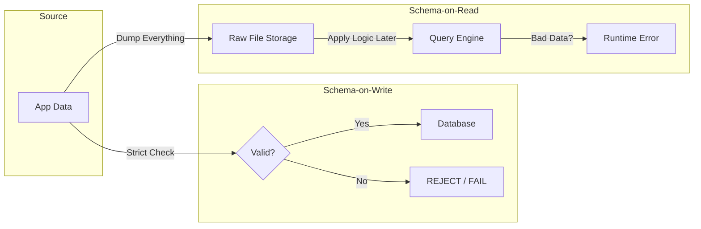

In civil engineering, you build different transport systems for water, electricity, and traffic. You cannot pump cars through a water main, and you cannot route electricity through a sewer. Data engineering is no different. The **form** of the data dictates the **architecture** of the pipeline.

If you treat a JPEG image like a financial transaction, your pipeline will choke. If you treat a financial transaction like a log stream, you will lose money.

We categorize data into three states of matter: **Structured, Semi-Structured, Unstructured**.

## 3.1 Form and Structure
### The Solid State: Structured Data
Structured data is the bedrock of the enterprise. It is rigid, predictable, and highly optimized. Think of it like  regimented parking lot: every spot is numbered, and every spot is the exact same size.

This is the domain of the **Relational Database (RDBMS)**.

In a structured system, the shape of the data is defined *before* the data ever enters the system. This is enforced by a **Schema**. If you try to shove a `String` into an `Integer` column, the database rejects it.

**Why do we love it?** Because constraint breeds efficiency. Since the database knows exactly how many bytes an integer takes up (e.g., 4 bytes), it can calculate the memory address of the 1,000,000th row instantly without scanning the previous 999,999 rows. It creates "dense" storage.

**The Trade-off**: It is brittle. If the business changes and suddenly a "User" needs two email addresses instead of one, you have to run an `ALTER TABLE` command, which locks the table and requires downtime.

### The Liquid State: Semi-Structured Data
Semi-structured data is fluid. It has some organization, but it is self-describing and flexible. It flows into whatever container you provide, but it takes up more space and is harder to filter.

This is the domain of **JSON**, **XML**, **YAML**, and **NoSQL** stores (like MongoDB or Elasticsearch).

In a semi-structured record, the schema travels *with* the data. Every record repeats the field names.

```json
// Record A
{
  "id": 101,
  "event": "login",
  "meta": { "browser": "Chrome" }
}

// Record B - The structure changed!
{
  "id": 102,
  "event": "purchase",
  "amount": 49.99,
  "currency": "USD" 
}
```

**Why do we use it?** Evolution. Web applications change rapidly. If a developer adds a new feature to the frontend, they can start sending that new data immediately without asking the data engineer to run a database migration. It allows for **Schema Drift**.

**The Trade-off**: It is computationally expensive. To find the `amount` in Record B, the computer has to read the text `"id"`, skip it, read `"event"`, skip it, until it finds `"amount"`. This is significantly slower than the offset-math used in structured databases. You are trading CPU cycles for developer agility.

!!! warning "The Hidden Cost of JSON"

    Storing data as raw JSON strings is the fastest way to bloat your storage bill. Because you repeat the keys (e.g., `"timestamp"`) for every single row, you often store more "structure" than actual data. This is why we use binary formats like **Parquet** or **Avro** in production—they compress the structure while keeping the flexibility.

### The Gas State: Unstructured Data
Unstructured data has no internal data model that a standard database can understand. It is a "Binary Large Object" (**BLOB**).

This includes:
- Images (JPEG, PNG)
- Audio files (MP3, WAV)
- PDF Documents
- Free-text emails

**The Engineering Challenge**: You cannot query this data directly. You cannot say `SELECT * FROM images WHERE person = 'sad'`.

To manage unstructured data, a data engineer must build a **Metadata Wrapper**. We store the blob in cheap object storage (like AWS S3), and we store the metadata (file path, creation date, size, and tags) in a structured database.

The pipeline's job here is often **Extraction**: running an OCR process on a PDF or an ML model on an image to extract structured attributes (text, sentiment, objects) that can be analyzed.

### The Great Gatekeeper: Schema Enforcement
The single most critical decision you will make as an architect is **when** to enforce structure. This decision determines whether your pipeline is "fragile but clean" or "robust but messy."

#### 1. Schema-on-Write (The Bouncer)
This is the traditional RDBMS approach. The database acts as a bouncer at the club door. If your shoes aren't shiny (data doesn't match the schema), you don't get in.

- **Pros**: The data inside is pristine. Downstream consumers (analysts) trust it implicitly.
- **Cons**: The pipeline breaks constantly. Every time the upstream source changes a format, the ingestion job fails.

#### 2. Schema-on-Read (The Librarian)
This is the Data Lake approach. We accept everything into the system (usually saving it as raw files). We only apply structure when we try to *read* it later.

- **Pros**: High ingest velocity. The pipeline never breaks on ingestion.
- **Cons: Silent Failures**. You might be successfully saving garbage data for months. You won't know the data is corrupt until you try to run a report, and the query explodes because a field is missing.

!!! tip "The Hybrid Approach"

    Modern engineering prefers a compromise: **ELT (Extract, Load, Transform)**.
    
    1.  **Ingest** raw data with **Schema-on-Read** (land it in a Data Lake so you don't lose it).
    2.  **Process** it into a strict **Schema-on-Write** layer (a Data Warehouse) for consumption.

    This ensures you never lose data due to a format change, but you still provide clean tables for your analysts.



### The Physics of Reliability
Understanding form is about understanding **latency** and **trust**.

- **Structured Data** is fast to read, slow to write (due to checks), and highly trusted.
- **Semi-Structured Data** is fast to write, slow to read (due to parsing), and requires defensive coding.
- **Unstructured Data** requires extraction to be useful.

If you try to force semi-structured logs into a strict relational table, you will spend your life fixing broken pipelines. If you dump relational transactions into a schema-less JSON store, you will spend your life fixing accounting errors.

## 3.2 Velocity, Volume, and Variety
If "Structure" is the state of matter, **Volume** and **Velocity** are the mass and acceleration.

For years, "Big Data" was a marketing buzzword plastered on airport billboards. As an engineer, you must strip away the hype and look at the physics.

### What is "Big Data," really?
It is not a specific number of terabytes. It is a **threshold of failure**. "Big Data" occurs the moment your dataset exceeds the processing capacity of a single machine.

If your script crashes with `OutOfMemory` because the dataset won't fit in RAM, or if a query takes 48 hours to run because the CPU is pegged at 100%, you have entered the domain of Big Data. This is the moment you must stop acting like a software engineer and start acting like a distributed systems architect.

To manage this, we use the standard "Three Vs" model, but we look at them through the lens of infrastructure stress.

### The First V: Volume (Gravity)
Volume is the sheer mass of the data. It dictates **Storage** and **Compute Strategy**.

When data is small, gravity is negligible. You can load a 10 MB CSV file into Excel, pivot it, and save it. It's instantaneous. When data is massive (Petabytes), gravity is crushing. Moving that data across a network is expensive and slow.

**The Engineering Reality: Data Locality** in traditional computing, we bring the data to the code. We download the file, open it, and process it. In Big Data, the volume is too heavy to move. We must **bring the code to the data**.

This is why systems like Spark and Hadoop exist. They don't move the 100 TB file to your laptop; they send your tiny Python script to the 100 servers where the data lives, run it locally on each chunk, and send back only the answer.

!!! note "The Partitioning Rule"

    The only way to eat an elephant is one bite at a time. To handle volume, we **Partition** (shard) data.

    We never store "All Sales" in one big file. We store "Sales_2023_01", "Sales_2023_02", etc. If you query for January data, the system ignores the other 11 partitions. If you fail to partition correctly (e.g., scanning the whole year to find one day), your cloud bill will bankrupt the company.

### The Second V: Velocity (Momentum)
Velocity is the speed at which data enters the system. It dictates your **Ingestion Strategy** and **Latency** requirements.

Imagine a water pipe.

- **Throughput** is the width of the pipe (how much water *can* flow).
- **Latency** is how fast a single drop travels from start to end.

**Low Velocity**: The Payroll System. Data arrives once every two weeks. You can take your time. If processing takes 4 hours, nobody cares. **High Velocity**: The Stock Market. Millions of events per second. If processing takes 100 milliseconds, you are out of business.

**The Trade-off**: High velocity requires complex handling.

- If you process every event as it arrives (**Streaming**), you get low latency but high CPU costs and complex error handling (what if the network blips for 1 second?).
- If you group events and process them hourly (**Batching**), you get high latency but simple, robust code.

### The Third V: Variety (Entropy)
We covered this in section 3.1, but in the context of Big Data, Variety adds **Computational Complexity**.

If you are ingesting 1 TB of structured CSVs, the CPU cost is predictable. If you are ingesting 1 TB of mixed JSON logs, images, and audio files, the CPU cost is erratic. "Variety" is the enemy of optimization. A uniform system is a fast system.

## 3.3 Data Generation Patterns
We have discussed the **form** (structure) and the **physics** (volume/variety/velocity) of data. Now we must ask: **Where does it come from?**

Data is not a natural resource that you mine from the ground. It is an artifact created by software. Understanding the specific software pattern that generates the data is the only way to ingest it reliably.

Broadly speaking, there are four "Generators" you will encounter in the wild. Each requires a distinct architectural approach.

### 1. The Application Database (OLTP)
**The Source of Truth**.

This is the database powering your company's actual product—the one that processes the credit cards and lets users log in. It is almost always an **OLTP (Online Transaction Processing)** system, like PostgreSQL, MySQL, or Oracle.

**The Pattern**: State Mutation. When a user changes their address, the application runs an `UPDATE` command. The old address is overwritten. It is gone forever. The OLTP database represents the **Current State of the World**.

**The Engineering Challenge**:

1. **Load**: You cannot just run massive analytical queries on this database. If you do, you will lock the rows, the website will freeze, and customers will stop being able to buy things. You will be fired.
2. **History**: Because OLTP overwrites data, it is terrible for analytics. You can't ask, "How many times did this user change their address?" because you only have the current address.

!!! tip "The CDC Solution"

    To extract data from an OLTP source without crashing it, we often use **Change Data Capture (CDC)**. Instead of querying the tables, we read the database's *transaction log* (the binary file where the database writes down every action it takes). This allows us to see the history (Insert, Update, Delete) without touching the actual tables.

### 2. User Telemetry (Event Logs)
**The Footprints**.

If the OLTP database is the "Current State," Telemetry is the "History of Actions." This data is generated by the frontend (Web/Mobile) or backend services to track what happened.

- "User clicked 'Add to Cart'."
- "Page loaded in 200 ms."
- "Video paused at 04:32."

**The Pattern**: Append-Only Logs. **Telemetry is immutable**. You cannot "un-click" a button. Events are never updated; they are only created.

**The Engineering Challenge**: Volume and Duplication. Telemetry is often sent via unreliable networks (mobile phones going through tunnels). Mobile apps will retry sending events if the network fails, which means you will receive the same "Purchase Event" twice. Your pipeline must be **Idempotent**—it must be able to identify and discard duplicates.

### 3. The Machine (IoT & Sensors)
**The Heartbeat**.

This is data generated by physical hardware: manufacturing robots, wind turbines, delivery trucks, or server CPU monitors.

**The Pattern**: Continuous streams. Unlike user telemetry, which is triggered by a human action, machines talk constantly. A temperature sensor might report the heat every 100 milliseconds, regardless of whether the temperature changed.

**The Engineering Challenge**: Signal-to-Noise Ratio. 99% of IoT data is useless. If a machine reports "All Systems OK" five thousand times a second, storing every single one of those records is a waste of money. We often use **Sampling** (keeping 1 out of every 10 records) or **Windowing** (averaging the temperature over 1 minute and storing only the average) at the ingestion edge.

### 4. Third-Party APIs (SaaS)
**The Black Box**.

This is data that lives in someone else's house: Salesforce, Stripe, Google Ads, and Zendesk. You do not own the database; you are a guest asking for permission to see it.

**The Pattern**: Request-Response. You must actively ask for this data via HTTP requests.

**The Engineering Challenge**: You are not in control.

1. **Rate Limits**: If you ask for data too fast, they will ban your IP address.
2. **Pagination**: You cannot "Get All Customers." You have to "Get Page 1," wait, "Get Page 2," wait.
3. **Silent Changes**: The provider might change their API schema (rename `user_id` to `account_id`) without telling you, breaking your pipeline instantly.

## Quiz

<quiz>
Which state of data is described as 'rigid, predictable, and highly optimized,' similar to a regimented parking lot?
- [ ] Streaming data.
- [x] Structured Data.
- [ ] Unstructured Data.
- [ ] Semi-Structured Data.

</quiz>

<quiz>
What is the primary trade-off when using Semi-Structured data like JSON compared to Structured data?
- [ ] It cannot handle nested information.
- [x] It is computationally more expensive to read and parse.
- [ ] It takes longer to write the data to disk.
- [ ] It requires downtime to change the schema.

</quiz>

<quiz>
How should a data engineer typically manage Unstructured Data, such as images or audio files?
- [ ] Convert the binary file into a text-based JSON string.
- [ ] Store the raw file directly in a relational database column.
- [x] Store the file in object storage and manage a metadata wrapper in a database.
- [ ] Discard the file and only keep the filename.

</quiz>

<quiz>
In the context of Big Data velocity, what distinguishes 'Latency' from 'Throughput'?
- [x] Latency is the travel time for a single item; Throughput is the total flow capacity.
- [ ] Latency only applies to batch processing; Throughput only applies to streaming.
- [ ] Latency is the width of the pipe; Throughput is the travel time.
- [ ] Latency is the total volume; Throughput is the speed.

</quiz>

<quiz>
Why is Change Data Capture (CDC) preferred over direct queries for extracting data from an OLTP database?
- [ ] It is the only way to get data out of a SQL database.
- [ ] It increases the write speed of the source database.
- [x] It reads the transaction log, avoiding locks on production tables.
- [ ] It automatically converts the data into JSON format.

</quiz>

<quiz>
User Telemetry (Event Logs) is described as 'immutable.' What implies a major engineering challenge regarding duplicates?
- [ ] Immutable data cannot be deleted, so storage fills up instantly.
- [ ] You must use a relational database to store telemetry.
- [x] Since events can't be updated, duplicates must be filtered out by the pipeline (Idempotency).
- [ ] Duplicates are automatically handled by the source system.

</quiz>

<quiz>
What is the recommended strategy for handling the high volume of repetitive 'noise' from IoT sensors?
- [x] Use Sampling or Windowing to aggregate data at the edge.
- [ ] Increase the storage budget to save every record.
- [ ] Treat the data as User Telemetry and keep all events.
- [ ] Disable the sensors during non-business hours.

</quiz>

<quiz>
Which Ingestion Strategy creates 'Silent Failures' where corrupt data is stored successfully but breaks when queried later?
- [x] Schema-on-Read
- [ ] Change Data Capture
- [ ] Batch Processing
- [ ] Schema-on-Write

</quiz>

<quiz>
When ingesting data from Third-Party APIs, what is a constraint completely out of the data engineer's control?
- [ ] The frequency of the cron job schedule.
- [x] Rate limits and pagination are enforced by the provider.
- [ ] The programming language of the ingestion script.
- [ ] The destination storage format.

</quiz>

<!-- mkdocs-quiz results -->