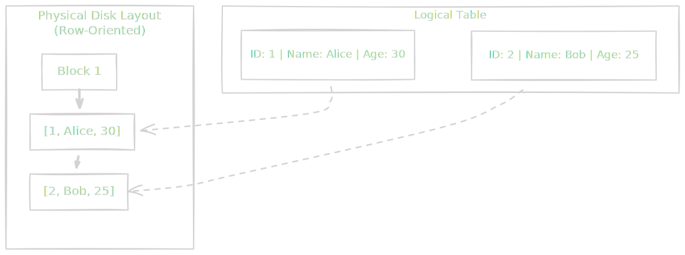
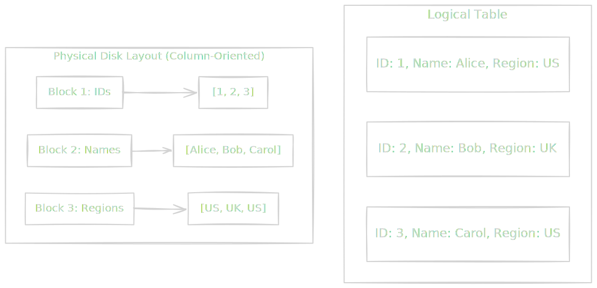

Before we build pipelines, we must understand the source. In 90% of cases, your data originates in the chaos of a live application.

When a user taps "Purchase" on their phone, the application backend doesn't care about quarterly trends or average revenue per user. It cares about one thing: capturing that specific transaction right now, without losing it, and without making the user wait more than 200 milliseconds.

This environment is the domain of **Online Transactional Processing (OLTP)**.

## 4.1 OLTP: The Application Layer
To the data engineer, the OLTP database is usually the "Source System." To the software engineer, it is the "Production Database." Understanding the physics of this system is critical because the way it is optimized determines how we must extract data from it.

### The Physics of "Now"
OLTP systems (Postgres, MySQL, Oracle) are engines designed for **state management**. They answer the question, "What is the state of the world at this exact millisecond?"

These systems are besieged by thousands of tiny, concurrent requests.

- *User A updates their password.*
- *User B adds an item to a cart.*
- *User C checks their balance.*

This traffic profile dictates the architecture. Because these requests are discrete and specific (usually identified by a specific `user_id` or `order_id`), the database is optimized for **Point Lookups** and **row-level manipulation**.

### Row-Oriented Storage: The Anatomy of a Write
Why are standard application databases "row-oriented"? It comes down to how hard drives and SSDs work.

Storage media is not a magic bag; it is a physical medium (spinning platters or NAND flash) where data is arranged linearly. When the operating system reads from a disk, it doesn't read a single byte; it reads a **Page** (usually 4 KB or 8 KB).

In an application, when you access a user, you usually need *all* the context about that user. You rarely ask, "What is the email address of User 123?" You usually ask, "Give me the User Object for 123," which includes their name, email, password hash, and preferences.

**Row-Oriented Storage** capitalizes on this access pattern by storing all the attributes of a single record contiguously on the disk block.



Because `[1, Alice, 30]` is stored together, the disk head seeks once, reads one block, and gets the entire entity. This is incredibly efficient for **Writing** (appending a new block) and **Reading a specific entity** (retrieving one block).

### The Index: How We Find Needles in Haystacks
If you have a billion rows, you cannot scan the entire disk to find `User: 123`. That is an expensive operation, which in database terms means "the server becomes sluggish."

OLTP systems solve this with the **B-Tree Index**. Think of an index not as magic but as a sorted address book separate from the actual data. It is a tree structure that allows the engine to jump from the root to the specific leaf node containing the address of the data on the disk.

This makes finding a single row instantaneous. However, every index you add slows down your writes because now the database has to update the actual table and rebalance the B-Tree.

!!! note "The Engineering Trade-off"

    This is why you cannot simply "index everything." Every index is a tax on write performance. As a data engineer, you will often beg backend engineers to add an index on a `updated_at` column so you can extract data efficiently. They might resist because it slows down their `INSERT` speed. This is the fundamental friction between the application team and the data team.

### The "Silent Failure" Scenario
Here is when the inexperienced data engineer causes a catastrophe.

Because you are used to thinking about data, you might try to run an analytical query on the OLTP database. You might run:

```sql
-- The Query of Death
SELECT SUM(order_total)
FROM orders
WHERE created_at > '2023-01-01';
```

In a **Row-Oriented** database, this is physically disastrous.

To answer this question, the database cannot just read the `order_total` column. Because the data is stored in rows, the database must load **every single row** into memory, extract the `order_total` value, add it to the accumulator and discard the rest of each row.

This is called **Read Amplification**. You are forcing the engine to read gigabytes of `Usernames`, `Shipping Addresses`, and `Tracking IDs` just to sum up a few integers.

!!! warning "Lock Contention"

    Worse than reading unnecessary data, your massive analytical query might require **locks**. While your query is slowly scanning the `orders` table to sum up revenue, the database might lock those rows to ensure consistency.

    Meanwhile, a real customer tries to buy something. The application tries to `INSERT` into the `orders` table but hits your lock. The app hangs. The customer leaves.

    **You have just taken down production.**

## 4.2 OLAP: The Analytical Layer
If OLTP is the **Cash Register**—recording individual sales with speed and precision—then OLAP (Online Analytical Processing) is **Headquarters**. Here, we don't care about a single sale. We care about *all* of them.

We left the last section with a warning: running analytical queries on an OLTP database is dangerous. It is inefficient because of **Row-Oriented** storage. To solve this, we don't just need bigger servers; we need a fundamental shift in the physics of how we store data on the disk.

We need to rotate the world 90 degrees. We need **Column-Oriented Storage**.

### The Physics of "How Much"
OLAP systems (Snowflake, BigQuery, Redshift) are designed to answer questions like:

- *"What was the total revenue for the Northeast region last quarter?"*
- *"What is the average session duration for mobile users?"*

Notice the pattern? These questions ignore 99% of the table's width (user addresses, password hashes, tracking IDs) but scan 100% of the table's height (every single row).

In a Row-Oriented system, to sum the `revenue` column, the disk head must skip over the `name`, `address`, and `email` fields for *every single row*. This is wasted I/O (input/output).

**Column-Oriented Storage** solves this by storing the values of a single column contiguously on the disk.



When you ask for `SELECT SUM(revenue) FROM sales`, the OLAP engine ignores the blocks containing Names, Dates, and IDs. It goes straight to **Block 3**, reads *only* the revenue integers, and sums them up.

If your table has 100 columns and you only query 3 of them, a columnar database effectively reduces your I/O overhead by 97%. This is not an optimization; this is a geometric advantage.

### The Secret Weapon: Compression
Speed isn't the only benefit. Columnar storage is overwhelmingly cheaper because of **compression**.

Information theory tells us that data is easier to compress when it looks the same.

- In a **Row-Oriented block**, you have an integer next to a string next to a date next to a Boolean. This high entropy makes compression difficult.
- In a **Column-Oriented block**, you have 10,000 dates in a row. Or 10,000 integers in a row.

Because the data type is uniform, we can use aggressive encoding algorithms like **Run-Length Encoding (RLE)**.

!!! example "The Physics of Compression"

    Imagine a column for `country_code` in a table with 1 million rows.

    **Raw Data**: `US, US, US, US, UK, UK, UK, UK, ...`

    If stored as raw text, you are writing distinct bytes for every entry. But an OLAP engine sees the pattern and stores it as:

    **Compressed**: `(Value: US, Count: 4), (Value: UK, Count: 3)`

    The engine just turned 7 rows of data into 2 small tuples. This allows OLAP warehouses to store massive datasets at a fraction of the cost of an OLTP database.

### The "Silent Failure" Scenario
If columnar storage is so fast and cheap, why don't we use it for everything? Why do we still use Postgres?

Because columnar storage has a fatal weakness: **updates are expensive**.

In a Row-Oriented database, updating a user's email is easy; find the block, rewrite the row, save. In a Column-Oriented database, that single user's data is scattered across ten different files (one file for ID, one for Name, one for Email, etc.). To update one user, the database has to open, rewrite, and recompress multiple independent files.

**The "Anti-Pattern" of the Junior Engineer**: A common mistake is treating a data warehouse (OLAP) like a transactional database (OLTP).

If you send 100 single-row `INSERT` statements per second to Snowflake or Redshift, you are forcing the engine to create hundreds of tiny, fragmented micro-files. The compression breaks. The metadata overhead explodes. The system grinds to a halt.

OLAP systems crave **batches**. They want you to hold the data in a buffer, wait until you have 10,000 rows, and then write them all at once. This allows the engine to sort, compress, and store the data efficiently.

## 4.3 The Great Divide: ETL
We have established two physical realities:

1. **OLTP (The Source)**: Your application's row-oriented nervous system. Fast, fragile, and busy handling customers.
2. **OLAP (The Destination)**: Your business's column-oriented brain. Massive, aggregated, and hungry for historical data.

The most common question from a junior engineer (or an impatient CEO) is, "Why can't we just connect the visualization tool directly to the production database?"

The answer is **resource contention**.

### The "Noisy Neighbor" Problem
Imagine your application database is a busy restaurant kitchen. Chefs (Transactions) are frantically chopping, frying, and plating to serve customers in real-time. Speed is everything.

Now, imagine an analyst walks into that kitchen and decides to inventory every single ingredient in the pantry to calculate the cost of goods sold for the last five years. They start counting every grain of rice.

In a computer system, this "counting" consumes **CPU* cycles**, **RAM**, and **I/O bandwidth**.

- If the analyst's query consumes 80% of the database's CPU to join three massive tables, the "Chef" (the application) only has 20% left to serve the customer.
- Result: The checkout page hangs. The user sees a spinning wheel. The company loses money.

**Rule #1 of Systems Architecture**: Analytical workloads must be physically isolated from transactional workloads.

### The Bridge: ETL
To solve this, we must replicate the data from the kitchen (OLTP) to a separate warehouse (OLAP) where the analyst can run heavy queries without breaking the application.

This process is the heartbeat of data engineering: **ETL**.

1. **Extract**: We pull the data out of the source.
2. **Transform**: We change the shape of the data to fit the destination.
3. **Load**: We write the data into the warehouse.

#### 1. Extract (The Heist)
This is the most dangerous phase. We must copy data out of the production database without slowing it down. We are stealing the jewels while the museum is open.

- *Method*: We might read the **Write-Ahead Log (WAL)** (the database's internal ledger of changes) to capture updates silently.
- *Method*: We might run a query like `SELECT * FROM orders WHERE updated_at > [last_time_we_checked]`.

#### 2. Transform (The Refinery)
Raw data is rarely ready for analytics. It is "application-shaped," not "business-shaped."

- **Normalization**: The app stores `status: 1`. The warehouse needs `status: 'Pending'`.
- **Sanitization**: The app stores the user's full credit card number (hopefully not, but assume the worst). We must hash or drop that column before it hits the warehouse.
- **Formatting**: The app uses Unix timestamps (`1672531200`). The warehouse needs a readable date (`2023-01-01`).

#### 3. Load (The Delivery)
We take this cleaned, formatted data and bulk-insert it into the columnar warehouse. As discussed in section 4.2, we do this in **batches** to respect the physics of the destination.

## Quiz

<quiz>
What is the primary optimization goal of an OLTP (Online Transaction Processing) system?
- [ ] Fast execution of complex analytical queries across millions of rows.
- [x] High concurrency and low latency for small, atomic transactions.
- [ ] Maximum compression ratios for historical data storage.
- [ ] Efficient batch processing of large datasets.

</quiz>

<quiz>
In a row-oriented storage system, how is data physically arranged on the disk?
- [x] All attributes of a single record (e.g., User ID, Name, Email) are stored contiguously.
- [ ] Data is strictly sorted by the primary key in separate files for each field.
- [ ] Data is stored in random blocks to optimize write speeds.
- [ ] All values for a specific column are stored sequentially.

</quiz>

<quiz>
Why is columnar-oriented storage significantly more efficient for calculating the average value of a single field (e.g., `Revenue`) across a billion rows?
- [x] It reads only the specific blocks containing the `Revenue` data, ignoring all other columns.
- [ ] It uses B-Tree indices to find the specific rows faster.
- [ ] It caches the entire table in RAM to avoid disk I/O entirely.
- [ ] It pre-calculates the average during the write process.

</quiz>

<quiz>
According to the 'Physics of OLAP,' why is streaming single-row `INSERT` statements into a data warehouse considered an anti-pattern?
- [x] It creates too many small files, breaking compression and increasing metadata overhead.
- [ ] It causes the database to lock the entire table for every write.
- [ ] It confuses the query optimizer by changing statistics too frequently.
- [ ] Data warehouses do not support `INSERT` statements, only `COPY` commands.

</quiz>

<quiz>
What is 'Read Amplification' in the context of running an analytical query on a row-oriented database?
- [ ] The database reads the same row multiple times to ensure accuracy.
- [ ] The query result is larger than the original dataset due to temporary tables.
- [ ] The database amplifies the signal strength of the disk reading head.
- [x] The database must load unnecessary data (like User Names) into memory just to access the one integer needed for a sum.

</quiz>

<quiz>
What is the primary risk of running heavy analytical queries directly on the production (OLTP) database?
- [ ] The analytical data will be out of date.
- [ ] The query will return incorrect results due to lack of normalization.
- [ ] The database will run out of storage space.
- [x] Resource contention will starve the application, potentially causing timeouts for active users.

</quiz>

<quiz>
In an OLTP system, what is the trade-off of adding a B-Tree index to a column?
- [x] It speeds up reads (lookups) but slows down writes (inserts/updates).
- [ ] It reduces storage space but increases CPU usage.
- [ ] It speeds up writes but slows down reads.
- [ ] It has no performance cost, only storage cost.

</quiz>

<quiz>
In the ETL paradigm, what is the purpose of the 'Transform' stage?
- [ ] To move data from the source to the destination as quickly as possible.
- [ ] To compress the data before it leaves the source system.
- [ ] To back up the raw data in case of failure.
- [x] To convert 'application-shaped' data into 'business-shaped' data.

</quiz>

<quiz>
What is 'Schema Drift,' and why is it dangerous for pipelines?
- [ ] When the database moves to a different physical server, breaking connection strings.
- [x] When the source system changes its structure (e.g., renaming a column) without warning.
- [ ] When the volume of data increases unexpectedly, causing latency.
- [ ] When the data warehouse automatically deletes old tables to save space.

</quiz>

<quiz>
Which of the following best describes the 'Great Divide' in database workloads?
- [ ] The differences between relational (SQL) and non-relational (NoSQL) databases.
- [x] The separation between 'recording transactions' (OLTP) and 'answering questions' (OLAP).
- [ ] The difference between structured data and unstructured data.
- [ ] The split between cloud-based storage and on-premise storage.

</quiz>


<!-- mkdocs-quiz results -->