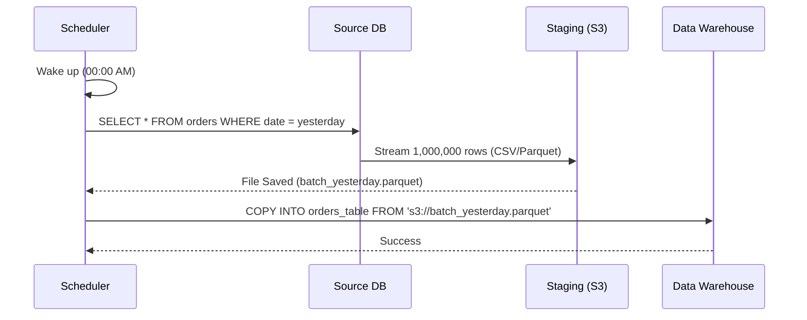
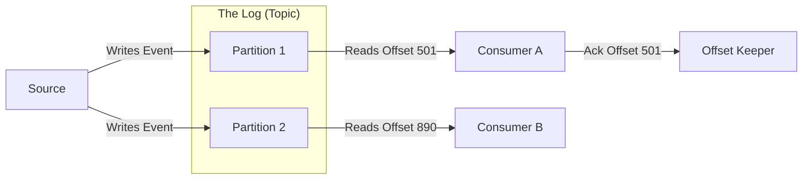
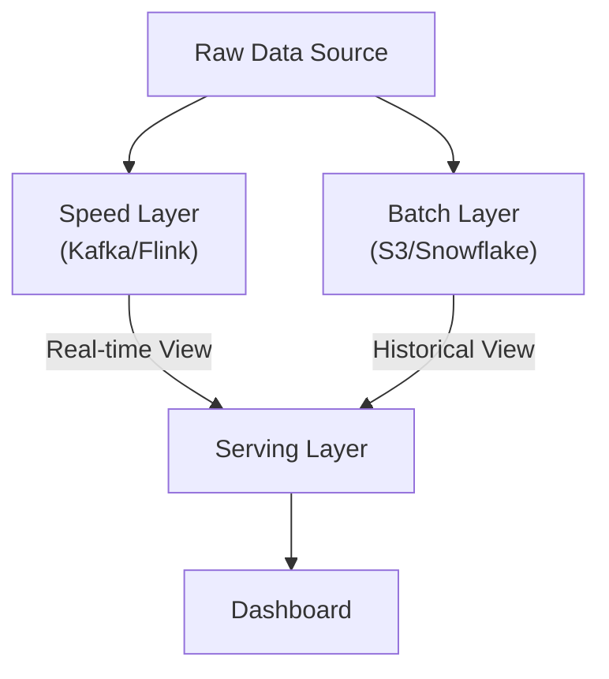

If data engineering is city planning, then **ingestion** is the design of the intake valves. It is the moment we reach out into the messy, chaotic world of external systems and pull a subset of reality into our own.

But there is a catch: you cannot move everything at once, and you cannot move it for free. You are bound by the laws of physics—specifically **bandwidth** (the width of the pipe) and **latency** (the speed of the water).

In software engineering, we obsess over speed. We want the API to respond in 20 ms. But in data engineering, we often sacrifice speed for **throughput**. We don't care if the drop of water arrives *now*; we care that the entire reservoir gets filled before morning.

In this module, we explore how we decide *when* and *how* to move that mass.

## 5.1 Batch Processing: The Freight Train
For decades, **Batch Processing** has been the bedrock of data movement. It is the "freight train" of the data world. You don't send a single grain of wheat across the country the moment it's harvested; that would be inefficient. Instead, you wait until the silo is full, load up the train cars, and send the whole shipment at midnight.

In technical terms, batch processing deals with **bounded data**. We define a clear start and end point—usually based on time (e.g., "all orders from `00:00` to `23:59`")—and move that entire chunk as a single, immutable unit.

### The Mechanism: Bounded Chunks
When you run a batch job, you are essentially asking a source system, "Give me everything that happened between Point A and Point B."

The workflow typically follows a distinct rhythm, often referred to as a "Job":

1. **The Window**: The scheduler (like Airflow) wakes up. It calculates the `execution_date`. It decides, "I am processing yesterday's data."
2. **Extraction**: The job connects to the source (a production database replica or an API) and executes a query with a `WHERE updated_at BETWEEN X AND Y` clause.
3. **Staging**: The data is pulled across the network and typically landed in a file storage system (like AWS S3) in a format like CSV, Avro, or Parquet.
4. **Loading**: The data warehouse (e.g., Snowflake) consumes that file in one large gulp.

### The Physics of Efficiency
Why do we do this? Why wait 24 hours to see data?

Because **network overhead is expensive**.

Every time you open a connection to a database, there is a handshake. Every time you send a packet, there are headers. If you send 1,000,000 individual rows as 1,000,000 separate HTTP requests, you are paying the "connection tax" a million times.

In batch processing, you pay the tax once. You open one connection, and you stream bytes continuously until you are done. This allows for **compression**. Compressing 1 GB file is significantly more efficient than compressing one million 1 KB JSON objects individually.

### The Trade-offs
Since we are architects, we must weigh the costs.

**The Pros**:

- **Simplicity**: It is much easier to reason about a system that runs once a day than one that runs continuously. If a batch job fails, you don't panic. You fix the bug, and you **replay** the job.
- **Replayability**: Because the input data is "bounded" (it's just a file from yesterday), you can run the transformation logic on it ten times, and the result will be the same. This is the foundation of **idempotency**.
- **High Throughput**: As mentioned, this is the most efficient way to move massive volumes of data.

**The Cons**:

- **Latency**: The data is always old. If your batch runs at midnight, an event that happened at 12:01 AM yesterday won't be seen by the analytics team for 24 hours.
- **The "Spike" Problem**: Batch jobs are "bursty." At midnight, your CPU usage spikes to 100% as you process the whole day's data, then drops to 0% for the rest of the day. This makes capacity planning difficult—you have to pay for a server big enough to handle the spike, even if it sits idle for 20 hours.

!!! warning "The Silent Failure: The Overlap"

    One of the most common "silent failures" in batch processing occurs when the **batch takes longer than the window**.

    Imagine you run an hourly job. It processes data from 1:00 to 2:00. Usually, it takes 10 minutes. But on Black Friday, data volume triples. The job now takes 65 minutes.

    The 2:00 job tries to start while the 1:00 job is still running. They fight for resources. The database locks up. The pipes burst. This is why **monitoring duration** is just as important as monitoring success/failure.

Now that we understand moving data in heavy, slow trains, let's look at the alternative. What if the business refuses to wait 24 hours? What if they need to know about a credit card fraud transaction *while* it is happening?

## 5.2 Streaming and Real-Time
If batch processing is a freight train, **streaming** is a conveyor belt. The factory doesn't wait for a pile of 1,000 car doors to accumulate before painting them; it paints each door the moment it arrives.

In the previous section, we dealt with **bounded data** (data with a start and end). Streaming deals with **unbounded data**. The data never stops. It is an infinite sequence of events, stretching from the past into the future. There is no "done."

This sounds appealing—who doesn't want data instantly?—but it introduces a level of complexity that can break unprepared teams. In a batch, if a job fails, you just re-run yesterday. In streaming, you can't "stop" the river to fix a leak. The water keeps coming.

### The Mechanism: The Log
To understand streaming, you must delete the concept of a "table" from your mind and replace it with **the log**.

A stream is not a random-access container. It is an append-only file.

1. **Producers** (the source) write events to the end of the log.
2. **Consumers** (you) read events from the log, starting from wherever you left off.

This architecture relies on three critical components that remove the "magic" from tools like Apache Kafka or AWS Kinesis:

1. **The Offset**: This is your bookmark. As your code reads events, it periodically stamps a number (e.g., "I have processed message #405"). If your server crashes and restarts, it looks up the last offset and resumes reading at message #406.
2. **Partitioning**: A single file is too slow for "Big Data." So, we split the log into multiple lanes (Partitions). This allows us to scale out.
3. **Consumer Groups**: If the firehose is too strong for one worker, we add more. The system automatically assigns different partitions to different workers. Worker A handles User IDs 1-100; Worker B handles 101-200.

### The Physics of "Real-Time"
Why do we endure the complexity? **Latency**.

In batch, the "Time to Value" is 24 hours. In streaming, it is milliseconds.

- **Fraud Detection**: You cannot wait 24 hours to flag a stolen credit card. You need to block the transaction *before* the swipe completes.
- **Inventory**: If you sell the last ticket to a concert, you must immediately stop others from buying it.

### The Trade-offs: The Time Warp
The biggest lie in computing is that "Time" is a single, shared reality. In a distributed system, time is messy. This is the hardest part of streaming.

You must distinguish between two clocks:

1. **Event Time**: When the user actually clicked the button (according to their phone).
2. **Processing Time**: When your server finally received the data.

**The Scenario**: A user on a spotty subway connection clicks "Buy" at **09:00:00**. Their phone loses signal. The signal returns at **09:05:00**, and the event is uploaded to your server.

- In **Processing Time**, the event happened at 09:05.
- In **Event Time**, it happened at 09:00.

If you are calculating "Sales per Minute," do you count this sale for the 09:00 bucket or the 09:05 bucket? If you put it in at 09:00, you have to rewrite history (which you might have already reported to the CEO). This is the problem with **late arriving data**.

!!! note "The Watermark"

    To handle late data, engineers use a concept called a **Watermark**. This is a heuristic that says, "I will wait 10 minutes for late data. After that, I am closing the books on 09:00." Any data that arrives after the Watermark is discarded or sent to a separate "error" pile. It is a calculated acceptance of imperfection.

### The Hidden Cost: At-Least-Once Delivery
In batch, we often get "Exactly-Once" processing for free (delete the file, reload the file). In streaming, networks fail.

1. Your code processes a payment event.
2. Your code *tries* to save the offset ("I finished message #5").
3. **The network blips**. The offset save fails.
4. Your code crashes.
5. Your code restarts. It sees the last saved offset was #4.
6. It reads messages #5 **again**.

You have now processed the payment twice. This is **At-Least-Once** delivery. Your downstream systems *must* be **idempotent** (able to handle duplicates without error), or your numbers will be wrong.

## 5.3 The Hybrid Spectrum
We have established two extremes: the **batch** freight train (high latency, high accuracy) and the **streaming** conveyor belt (low latency, high complexity).

In the real world, you will rarely be allowed to choose just one. The business will demand the speed of streaming but the historical accuracy of the batch. They want to see the sales numbers *now*, but they also want those numbers to be perfectly audit-proof *later*.

To satisfy these contradictory demands, we enter the gray area of hybrid architectures.

### Micro-Batches: The Short Train
If batch processing is a train that leaves once a day, **Micro-batching** is a subway train that leaves every minute.

Technically, micro-batching is not "true" streaming. It does not process events one by one. Instead, it accumulates events in a buffer for a very short duration (e.g., 60 seconds), seals that buffer, and processes it as a tiny batch file.

**The Physics**: This is a compromise between **throughput** and **latency**.

- **Pure Streaming**: High network overhead per event. (1 million requests for 1 million events).
- **Micro-Batching**: Lower overhead. (1 request for 1 million events).

You sacrifice "instant' (sub-millisecond) responses for "near real-time" (seconds to minutes). For 99% of business use cases—dashboards, reporting, and alert monitoring—a 60-second delay is indistinguishable from "instant."

### The Lambda Architecture: The Two-Lane Highway
Before modern tools became robust, engineers solved the reliability problem with brute force. They built **The Lambda Architecture**.

The core philosophy is, "Streaming is fast but unreliable. Batch is slow but perfect. Let's run both."

1. **The Speed Layer (Stream)**: Ingests data immediately. It calculates *approximate* numbers. It handles the "right now." If data arrives late or out of order, we accept the inaccuracy because speed is the priority.
2. **The Batch Layer (Master)**: Ingests the same data but waits until the day is over. It processes everything carefully, correcting any mistakes the speed layer made. It is the "Source of Truth."
3. **The Serving Layer**: The dashboard queries both. It says, "Show me the perfect data from yesterday + the approximate data from today."

**The Cost**: This architecture is robust, but it violates the DRY principle (Don't Repeat Yourself). You often end up writing the same transformation logic twice—once in your streaming framework (e.g., Kafka Streams) and once in your batch framework (e.g., SQL/dbt). Maintaining a parity between these two codebases is a massive engineering burden.

### The Litmus Test: Vanity vs. Value
As an architect, your most powerful tool is not code; it is the word "**why**"?

Business stakeholders love the phrase "real-time." It sounds modern. It sounds powerful. But real-time infrastructure costs 10x more than batch infrastructure—in compute, in storage, and in engineering sanity.

Before you build a streaming pipeline, ask the question, **"If this data arrives 15 minutes late, does the business lose money?"**

- **Yes**: Fraud detection, stock trading, factory machine safety shut-offs. (Build streaming).
- **No**: Executive dashboards, daily sales reports, marketing attribution. (Build Batch/Micro-batch).

If a manager wants a dashboard to update every second, but they only check it once a day at 9:00 AM, "real-time" is a vanity metric. Do not build a Ferrari to drive to the grocery store.

!!! tip "The Modern Convergence"

    In recent years, the industry has moved towards the **Kappa Architecture** (stream only) or **The Lakehouse**, which attempts to treat all data as a stream that can be replayed. We will discuss this in the next module.

## Quiz

<quiz>
In the context of batch processing, what defines 'Bounded Data'?
- [ ] Data that is encrypted for security.
- [ ] Data that exceeds the storage capacity of one server.
- [x] Data defined by a clear start and end point.
- [ ] Data that flows infinitely without a stop.

</quiz>

<quiz>
Which component in a streaming architecture acts as a 'bookmark' to ensure a customer resumes reading from the correct position after a crash?
- [x] The offset.
- [ ] The schema.
- [ ] The partition.
- [ ] The watermark.

</quiz>

<quiz>
A 'Silent Failure' in batch processing often occurs when a job takes longer to execute than its scheduled window (e.g., an hourly job taking 65 minutes). What is the primary risk here?
- [ ] The data becomes encrypted.
- [ ] The network connection is severed.
- [x] Resource contention and overlapping runs.
- [ ] The data is automatically deleted.

</quiz>

<quiz>
What is the critical difference between 'Event Time' and 'Processing Time'?
- [x] Event time is when the user performed the action; Processing time is when the server received it.
- [ ] They are synonyms for the same timestamp.
- [ ] Event time is used for batch; Processing time is used for streaming.
- [ ] Processing time is always earlier than event time.

</quiz>

<quiz>
The 'Lambda Architecture' combines batch and streaming layers. What is the primary purpose of the batch layer in this setup?
- [x] To serve as the accurate 'Source of Truth' and correct errors.
- [ ] To provide low-latency updates.
- [ ] To delete old data to save space.
- [ ] To handle real-time fraud detection.

</quiz>

<quiz>
Why is 'Idempotency' a required property for downstream systems in a streaming pipeline?
- [x] To handle 'At-Least-Once' delivery duplicates without error.
- [ ] To ensure the stream never stops.
- [ ] To increase the speed of the network.
- [ ] To encrypt data in transit.

</quiz>

<quiz>
Why is batch processing often more efficient than streaming for moving massive volumes of data?
- [ ] Data is smaller in batch format.
- [ ] It eliminates the need for storage.
- [x] It minimizes network overhead by paying the 'connection tax' only once.
- [ ] Batch processing does not require CPUs.

</quiz>

<quiz>
In streaming, what is a 'watermark'?
- [ ] A security stamp on the file.
- [ ] The maximum size of a batch file.
- [x] A heuristic that determines how long to wait for late data.
- [ ] The point where the stream crashes.

</quiz>

<quiz>
Which of the following use cases explicitly requires a real-time streaming architecture?
- [x] Credit card fraud detection.
- [ ] Executive dashboards checked once a day.
- [ ] Historical sales trend analysis.
- [ ] Monthly payroll processing.

</quiz>

<quiz>
What is the primary trade-off of micro-batching (like Spark Streaming) compared to pure streaming?
- [x] Higher latency (seconds) for better throughput.
- [ ] It requires manual intervention.
- [ ] Zero latency but high cost.
- [ ] It cannot handle high volumes of data.

</quiz>

<!-- mkdocs-quiz results -->