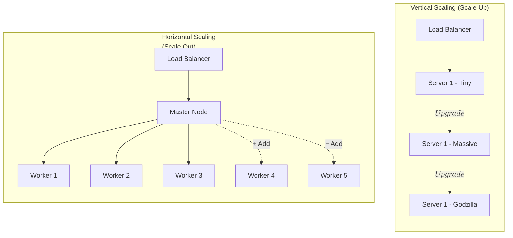
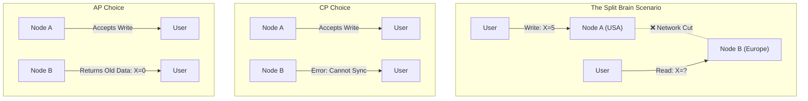

If you have been running your pipelines on a single laptop or a single dedicated server until now, you have been living in a paradise of simplicity. On a single machine, memory is fast, function calls never get lost in the ether, and the clock on the CPU is the only time that matters.

But in data engineering, that paradise is temporary. Eventually, the data grows too big for the hard drive, or the compute takes too long for the CPU.

Welcome to the world of **Distributed Systems**. This is where we stop thinking about computers as singular "brains" and start thinking about them as a **cluster**—a coordinated swarm of machines working together to solve a problem that would crush any one of them individually.

This chapter isn't about code. It's about the **physics of computing**. It is about what happens when you have to split a task across wires that can break, between clocks that drift, and across hard drives that fail.

## 7.1 Scaling: Up vs. Out
When your database starts choking on queries or your transformation script runs out of RAM, you have two choices. You can build a bigger truck, or you can buy a fleet of vans. In engineering terms, this is the difference between **Vertical Scaling** (Scaling Up) and **Horizontal Scaling** (Scaling Out).

### The Monolith: Vertical Scaling (Scale Up)
Vertical scaling is the intuitive approach. If your server has 16GB of RAM and crashes, you migrate to a server with 64GB. If that crashes, you get 256GB.

In the cloud era, this is deceptively easy. You click a dropdown menu in AWS or Azure, select `x1e.32xlarge`, and suddenly you have a supercomputer.

**The Civil Engineering Analogy**: Imagine you need to transport a massive pile of dirt. Vertical scaling is like upgrading your pickup truck to a dump truck. Then to a mining haul truck. Then to a truck the size of a skyscraper.

**The Advantages**
- **Simplicity**: This is the biggest selling point. You don't have to change your code. A Python script that runs on a laptop runs exactly the same on a super-server; it just has more breathing room.
- **Data Integrity**: Because everything is in one box, you don't worry about network lag between the hard drive and the CPU. You don't have to worry about one half of your data being in Tokyo and the other half in Virginia.

**The Hard Limits**
Vertical scaling hits a wall, and it hits it hard.

1. **The Physics Limit**: There is a physical limit to how many CPU cores and sticks of RAM you can jam into a single motherboard before heat and interference become unmanageable.
2. **The Economic Wall**: The price of hardware does not scale linearly. A server with 4x the capacity often costs 10x the price because high-density components are specialized luxury items.
3. **The Single Point of Failure**: If you put all your eggs in one massive, expensive basket, and that basket's power supply fails, your entire city goes dark.

!!! warning "The 'Lazy' Trap" 
    
    Vertical scaling is often called the "lazy" solution. This isn't an insult; sometimes lazy is smart! If you can solve a bottleneck by paying an extra $50/month for a bigger instance rather than rewriting your entire architecture to be distributed, pay the money. Your time is more expensive than silicon. But know that this road ends.

### The Fleet: Horizontal Scaling (Scale Out)
**Horizontal scaling** is the fundamental pattern of modern "Big Data." Instead of buying one super-computer, you rent 100 cheap, commodity servers (often called "nodes") and tie them together with software.

**The Civil Engineering Analogy**: Instead of building a skyscraper-sized truck, you hire 1,000 standard pickup trucks. If the pile of dirt is massive, you just hire more trucks.

**The Mechanism**

To make this work, we can't just run our standard code. We need a way to slice the work into pieces.

- **Partitioning (Sharding)**: We split the data into chunks. Node A processes users A-M; Node B processes users N-Z.
- **Coordination**: We need a "Manager" node (often called the Driver or Master) to assign tasks to "Worker" nodes and collect the results.

**The Trade-off: Complexity**

Horizontal scaling offers theoretically **infinite capacity**. If you need more power, you just add more nodes. Google, Facebook, and Netflix - exist solely because of this pattern.

But the cost is **complexity**.

- **Network Overhead**: Data must move between machines over cables. Cables are slow compared to RAM.
- **Serialization**: To send data from Node A to Node B, you have to package it into bytes (serialize) and unpack it (deserialize). This eats CPU cycles.
- **Synchronization**: What happens if Node A thinks the value is 10 but Node B thinks it's 20?

### Visualizing the Architectures
Let's look at the structural difference between these two approaches.

### Why Data Engineering Chooses "Out"
In traditional software engineering (building web apps), you can often survive on vertical scaling for a long time. A single massive Postgres database can handle a lot of traffic.

In Data Engineering, we hit the vertical limit almost immediately. We are the ones processing the logs of the web app. If the web app generates 1 TB of logs a day, we need to process that 1 TB every day.

We choose Horizontal Scaling not because we like the complexity, but because **datasets are heavier than gravity**. We scale out because we have no choice. We use tools like Apache Spark, Cassandra, and Hadoop because they are designed to run on the "Fleet," not the "Monolith."

!!! tip "The Coordinator's Tax" When you scale out, you pay a "tax" for coordination. If you try to process a tiny file (e.g., 100 MB) using a distributed cluster (like Spark), it will be slower than processing it on a single laptop using Pandas. Why? Because the time spent coordinating the worker nodes is longer than the time it takes to actually do the math. **Don't use a fleet of trucks to move a single pizza**.

## 7.2 The CAP Theorem
In the previous section, we established that to handle massive scale, we must split our application across multiple machines (nodes). But the moment you introduce a second machine, you introduce a profound problem: **Agreement**.

If you update a user's balance on Node A, how long does it take for Node B to know about it? Milliseconds? Seconds? What if the cable between them is cut?

This brings us to the **CAP Theorem**, formulated by Eric Brewer. It is the laws of physics applied to data. It states that a distributed data store can only provide two of the following three guarantees simultaneously:

1. **Consistency (C)**
2. **Availability (A)**
3. **Partition Tolerance (P)**

To understand this, let's stop thinking about computers and think about a bank with two branches: one in New York and one in London.

### The Three Pillars

#### 1. Consistency (C): "Everyone sees the same thing."
In a Consistent system, every read receives the most recent write or an error.

- **The Analogy**: If you deposit $100 in New York, and your partner immediately checks the balance in London, they see that $100. If London cannot confirm the new balance yet, it refuses to answer. It does not lie.
- **The Engineering Reality**: This is expensive. To guarantee this, the moment a write hits Node A, Node A must lock the data, replicate it to Node B, and wait for confirmation before telling the user "Success."

#### 2. Availability (A): "Always answer the phone."
In an Available system, every request receives a (non-error) response without the guarantee that it contains the most recent write.

- **The Analogy**: You ask the London teller for your balance. The phone line to New York is down. The teller says, "Well, the last time I checked 10 minutes ago, you had $50." They give you an answer, but it might be stale.
- **The Engineering Reality**: The system prioritizes uptime over correctness. If a node can't reach its peers, it just serves whatever data it has locally.

#### 3. Partition Tolerance (P): "Surviving the cut wire."
The system continues to operate despite an arbitrary number of messages being dropped or delayed by the network between nodes.

- **The Analogy**: The trans-Atlantic cable between New York and London is cut. Can the branches still function?
- **The Engineering Reality**: Networks fail. Routers crash. Sharks bite undersea cables. Partition Tolerance is the ability of the system to accept that communication has broken down.

### The "Pick Two" Illusion
You will often see CAP explained as a triangle where you get to pick any side you want.

**This is a lie.**

In a distributed system (like the ones Data Engineers build), Partition Tolerance (P) is not optional. You cannot choose to have a system that doesn't account for network failure, because network failures will happen. If you choose not to have P, your system isn't distributed; it's just a broken single-node system.

So, the choice is not "Pick Two." The choice is: **When the network breaks (P), do you choose Consistency (C) or Availability (A)?**

#### The Trade-Off: CP vs. AP
When the connection between your database nodes fails, you have to make a hard decision.

**The CP System (Consistency over Availability)**

- **The Logic**: "If I cannot talk to the other nodes to confirm the truth, I will shut down and refuse to accept new data rather than accept bad data."
- **The Vibe**: The Strict Accountant.
- **Examples**: Relational Databases (PostgreSQL configured for replication), HBase, and MongoDB (by default).
- **Use Case**: Banking. You absolutely cannot have two users withdrawing the same $100 from two different ATMs during a network outage. It is better for the ATM to display "Out of Service" (Unavailable) than to allow a double-spend (Inconsistent).

**The AP System (Availability over Consistency)**

- **The Logic**: "I cannot talk to the other nodes, but I will keep accepting writes and answering reads. I'll sort out the mess later when the network comes back."
- **The Vibe**: The Optimistic Salesman.
- **Examples**: Cassandra, DynamoDB, CouchDB.
- **Use Case**: Social Media Likes or Shopping Carts. If you "Like" a tweet and the server is disconnected, it's fine if your friend doesn't see that "Like" for five minutes. It is not acceptable for the "Like" button to crash the app. The business value is in the uptime, not the microsecond precision.

#### Why This Matters to You
As a Data Engineer, you are constantly choosing tools based on this trade-off, even if the marketing brochures don't use the words "CAP Theorem."

- When you choose **Kafka**, you are tuning these knobs via `acks=all` (CP-leaning) vs `acks=1` (AP-leaning).
- When you design a **Real-Time Dashboard**, you must ask the stakeholder: "If the network lags, do you want the dashboard to freeze (Accuracy) or show slightly old numbers (Uptime)?"

!!! note "The PACELC Theorem" 
    
    For the advanced student: CAP is a bit simplistic because it only discusses what happens during a partition. There is an extension 
    called **PACELC**: If there is a Partition (**P**), how does the system trade off Availability and Consistency (**A** vs. **C**)? Else (**E**), when the system is running normally (Latency vs Consistency (**L** vs. **C**))?

    In plain English: Even when the network is working fine, do you want to wait for the data to copy to all nodes (Latency) or return fast and risk it not being everywhere yet (Consistency)?

## 7.3 Eventual Consistency
In the previous section, we talked about the "AP" choice in the CAP theorem: choosing **Availability** over Consistency. We decided that it is better to accept a user's data now and worry about syncing it later, rather than showing them an error screen.

But "later" comes with a price.

If Node A accepts a value of 10 and Node B accepts a value of 20 during a network partition, what happens when the network comes back online? The system has entered a state of **Eventual Consistency**. This is the most common, and arguably the most confusing, state for a Data Engineer to manage.

### The Promise: "We'll Get There… Someday"
**Eventual Consistency** is a guarantee that if no new updates are made to a given data item, eventually all accesses to that item will return the last updated value.

**The Civil Engineering Analogy**: Imagine a sprawling empire in the 1800s. The Emperor in Rome passes a new tax law. He writes it down. It is "law" in Rome immediately.

- It takes 2 days for the messenger to reach Milan.
- It takes 2 weeks to reach London.
- It takes a month to reach Jerusalem.

For that entire month, the "Law" is different depending on where you are standing. A merchant in Jerusalem is following the old law, and a merchant in Rome is following the new law. Both are acting correctly based on their local knowledge. Eventually, the empire becomes consistent. But for a specific window of time, truth is relative.

### ACID vs. BASE
In traditional database theory (OLTP), we worship **ACID** (Atomicity, Consistency, Isolation, Durability). ACID is strict. It demands that the transaction is perfect the moment it commits.

In distributed systems, we often swap ACID for **BASE**:

- **B**asically **A**vailable: The system guarantees availability (it answers the phone).
- **S**oft State: The state of the system may change over time, even without input (as updates ripple through).
- **E**ventual Consistency: The system will become consistent once it stops receiving inputs.

### The Mechanism: How do we fix the mess?
When the network partition heals, or the replication lag catches up, the nodes start gossiping. "I have version 5 of this row; what do you have?" This process is called **Read Repair** or **Anti-Entropy**.

But what if both nodes changed the same record?

#### Conflict Resolution: The Thunderdome
If Node A says the user's email is `bob@gmail.com` and Node B says it's `bob@yahoo.com`, who wins?

1. **Last Write Wins (LWW)**: The system looks at the timestamp of the update. "Node B's update happened at 12:01:05, Node A's happened at 12:01:04. Node B wins."
    - *The Danger*: If your clocks aren't perfectly synced (and they never are), you might overwrite valid data with older data just because a server's clock was fast.
2. **Vector Clocks**: A complex method of tracking "causality" (who knew what when). It detects that a conflict exists and often forces the application (or the human) to merge the two versions.

### The Data Engineer's Nightmare
Why does this matter to you? Because you are often the consumer of this data.

Imagine you are building a pipeline that calculates "Daily Active Users."

1. A user logs in at 11:59 PM.
2. The event hits an "Eventually Consistent" database node.
3. Your ETL job runs at 12:05 AM.
4. Because of replication lag, that 11:59 PM login hasn't reached the node you are reading from yet.
5. You report the wrong number.
6. At 12:10 AM, the data arrives.

Your report is now permanently wrong, even though the database is now correct. This is the silent killer of data pipelines.

!!! tip "Designing for Lag"

    When working with eventually consistent sources (like S3, Cassandra, or DynamoDB), you must design your pipelines to tolerate "late arriving data." You cannot assume that because you queried the data at time $T$, you have ALL the data from before time $T$. You often need a look back window—re-processing the last 3 days of data every night just to catch the stragglers.

## Quiz

<quiz>
In the context of the 'Pipeline Manifesto,' what is the primary economic or physical limitation of vertical scaling (scaling up)?
- [ ] It forces the system to adopt an eventual consistency model immediately.
- [x] The price of hardware does not scale linearly; high-density components are specialized luxury items.
- [ ] It requires rewriting the entire codebase to handle distributed logic.
- [ ] It introduces significant network latency between the CPU and memory.

</quiz>

<quiz>
Which concept is described as the "Coordinator's Tax" when using a distributed cluster?
- [x] The time spent managing worker nodes, which can make processing small datasets slower than on a single laptop.
- [ ] The requirement to license software for every node in the cluster.
- [ ] The strict schema enforcement required before data can be ingested.
- [ ] The extra cost paid to cloud providers for using managed services.

</quiz>

<quiz>
According to the CAP Theorem as applied to distributed systems, which of the three guarantees is considered non-negotiable?
- [x] Partition Tolerance (P)
- [ ] Latency (L)
- [ ] Consistency (C)
- [ ] Availability (A)

</quiz>

<quiz>
In a 'Split Brain' scenario where the network connection between two nodes fails, a system that chooses availability (AP) will:
- [x] Continue to accept reads and writes, even if it risks returning stale or conflicting data.
- [ ] Route all traffic to a third 'Master' node that resolves the conflict immediately.
- [ ] Shuts down and refuses both reads and writes to prevent errors.
- [ ] Lock the database until the network connection is restored.

</quiz>

<quiz>
Which acronym represents the philosophy of distributed systems that prioritize availability and soft state over strict transaction rules?
- [ ] SOLID
- [ ] ACID
- [ ] CRUD
- [x] BASE

</quiz>

<quiz>
What is the primary risk of using 'Last Write Wins (LWW)' to resolve data conflicts in an eventually consistent system?
- [x] Valid data may be overwritten and lost simply because one server's clock was slightly faster than another's.
- [ ] It requires manual intervention from a human administrator for every conflict.
- [ ] It causes the database to run out of storage space by keeping all versions.
- [ ] It significantly slows down read operations by checking every node before answering.

</quiz>

<quiz>
Why is 'Eventual Consistency' described as a 'silent killer' for data pipelines?
- [x] A pipeline might process data before all updates have arrived, producing a report that is permanently wrong but looks correct.
- [ ] It encrypts the data so that downstream users cannot read it.
- [ ] It increases the cost of storage by duplicating data across too many nodes.
- [ ] It causes the pipeline to crash loudly whenever data is late.

</quiz>

<quiz>
What is the recommended strategy for handling 'late arriving data' in an eventually consistent pipeline?
- [ ] Switching to a vertical scaling architecture to eliminate network lag.
- [ ] Pausing the entire pipeline until the database confirms 100% consistency.
- [x] Implementing a 'look back window' to re-process recent historical data to catch stragglers.
- [ ] Deleting any data that arrives after the daily cutoff time.

</quiz>

<quiz>
In the 'civil engineering' analogy for eventual consistency, what represents the period of inconsistency?
- [ ] The collapse of a bridge due to heavy traffic.
- [x] The time it takes for a massager to travel from Rome to the outer provinces.
- [ ] The difference in currency value between two nations.
- [ ] The time it takes to build a new road between cities.

</quiz>

<quiz>
What process occurs when nodes in a distributed system 'gossip' to identify and fix missing or conflicting data?
- [x] Read Repair (or Anti-Entropy)
- [ ] Normalization
- [ ] Serialization
- [ ] Sharding

</quiz>

<!-- mkdocs-quiz results -->