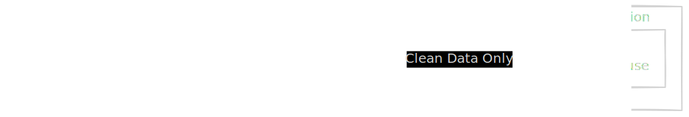
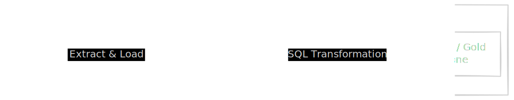
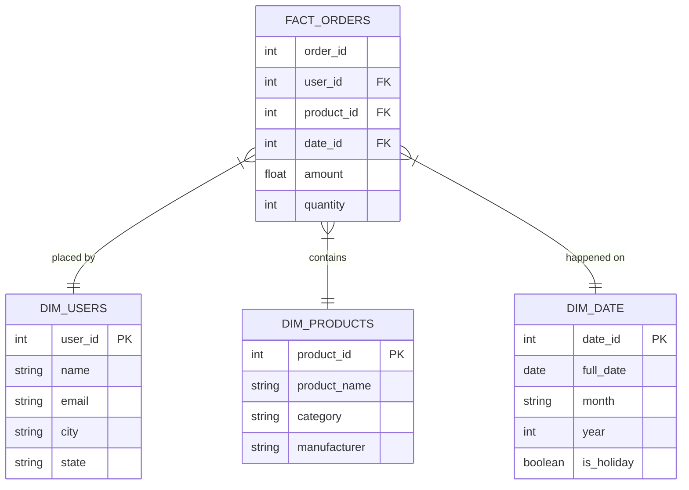
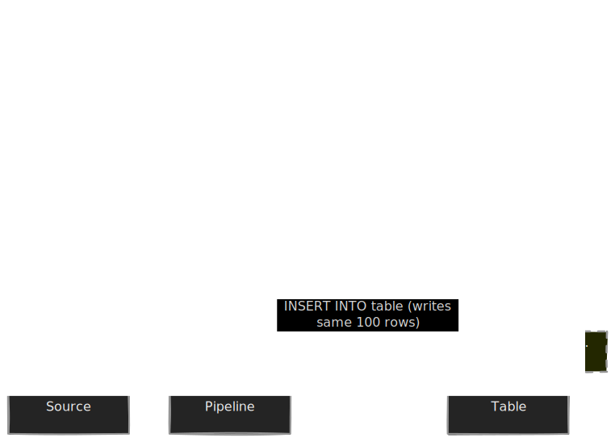

We have spent the last few modules obsessing over plumbing—how to get liquid from point A to point B without leaking. But if you open the tap at the end of that pipeline right now, you shouldn't drink what comes out. If it is full of mud, duplicate records, mismatched timestamps, and cryptic error codes.

This is where **transformations** come in.

Transformation is the process of applying **business logic** to raw data. It is the alchemical step where "User clicked button ID 459" becomes "Revenue." In the history of our field, the *location* of this step has shifted dramatically. This shift wasn't driven by fashion; it was driven by the physics of hardware and the economics of the cloud.

We are looking at the battle between **ETL** (Extract, Transform, Load) and **ELT** (Extract, Load, Transform).

## 8.1 ETL vs. ELT
### The Architecture of Scarcity: ETL
For decades, the standard was ETL. To understand why, you have to look at the constraints of the 1990s and 2000s.

In this era, your data warehouse (the destination) was an expensive, physical pipeline appliance sitting in a server rack—think Oracle Exadata or Teradata. It had finite disk space and infinite CPU power. Every byte you stored cost real money. Every cycle you burned slowed down the CEO's dashboard.

Because the destination was expensive, you had to treat it like a VIP club. You didn't let the "riff-raff" (raw, messy data) inside. You had to clean it up *before* it arrived.

1. **Extract**: Pull data from the source (Operational DB).
2. **Transform**: Process it on a separate, dedicated server (using tools like Informatica or custom Java/Python scripts). This is where you filtered out bad rows, joined tables, and aggregated numbers.
3. **Load**: Insert only the pristine, aggregated result into the warehouse.



### The Silent Failure of ETL
The physics of ETL seem sound: save resources at the destination. But it introduced a catastrophic fragility regarding **information loss**.

Imagine you wrote a transformation script that filtered out all website traffic from mobile devices because, at the time, your company didn't have a mobile app. Two years later, you launch an app. You want to analyze historical mobile traffic.

You can't. You threw it away during the **transform** stage before it ever hit the disk.

!!! warning "The Destructive Nature of ETL"
 
    ETL is inherently **lossy**. By transforming data *in-flight*, you are making decisions about what is valuable *now*. If those assumptions change, you often cannot recover the historical context because the raw data was never stored.

### The Architecture of Abundance: ELT
Then, the cloud happened. Storage costs cratered (S3). Compute became elastic.

Suddenly, the constraint wasn't "disk space"—it was **engineer time**. We realized that maintaining complex transformation scripts outside the warehouse was a nightmare. Since the modern data warehouse is now a massive parallel processing engine, why are we moving data *out* of it to process it?

The paradigm flipped to **ELT**.

1. **Extract**: Pull data from the source.
2. **Load**: Dump the data, in its rawest, ugliest form, directly into the warehouse (or data lake).
3. **Transform**: Use the warehouse's own SQL engine to refine the raw data into clean tables.



### Why ELT Won (Mostly)
The shift to ELT is the primary reason why "Analytics Engineer" is now a job title. It democratized transformation. You no longer need to know Scala or Python to clean data; you just need to know SQL.

#### 1. Replayability
This is the killer feature. Because you loaded the **raw data** first, you have a perfect record of history.

If you discover a bug in your revenue calculation logic today, you don't need to go back to the source system (which might have purged the logs). You simply fix the SQL query and re-run the transformation against the *raw* data already sitting in your warehouse. You can travel back in time.

#### 2. The Power of the Pushdown
In the old ETL days, if you wanted to join two massive tables, you had to pull them into a processing script, clogging the network. In ELT, the data is already on the same cluster. The database optimizes the join for you. We call this **Computation Pushdown**—moving the code to the data, rather than the data to the code.

### The No-Magic Check: When ELT Breaks
Bob, the senior engineer, will tell you that ELT is not a silver bullet. It introduces new risks that you, the architect, must mitigate.

#### The "Garbage Dump" Risk
If you just "load" without "transforming," you don't have a data warehouse; you have a **data swamp**. ELT requires strict discipline. You must clearly separate your raw schemas (never queried by end-users) from your analytics schemas (clean, documented).

#### Privacy and Compliance (The PII Trap)
In classic ETL, you could scrub Social Security Numbers *before* they ever entered your analytical system. In ELT, you are loading raw data first. That means you are loading the SSNs, credit card numbers, and patient records into your warehouse.

!!! danger "Security Zone"

    If you use ELT, your "Raw/Landing" zone is now a toxic asset. It contains Sensitive Personal Information (SPI/PII). You must implement strict **Role-Based Access Control (RBAC)** so that analysts can only see the transformed, masked tables, not the raw landing tables.

## 8.2 Normalization vs. Denormalization
Now that you've used the ELT pattern to dump your raw data into the warehouse, you have a problem. That raw data is likely shaped like the application that created it. It is designed for **transactional integrity**, not for **analytical speed**.

If you simply expose these raw tables to your data analysts, they will write queries that bring your expensive cloud cluster to its knees. To prevent this, you must understand the fundamental trade-off of database design: **Redundancy vs. Performance**.

### The Application Ideal: Normalization (3NF)
Software engineers design databases to support applications (OLTP). Their priority is to process writes (inserts/updates) quickly and safely. Their greatest fear is **data inconsistency**.

Imagine an e-commerce app. A user, "Alice," places 50 orders. If you stored Alice's address in every single order row and Alice moved to a new house, you would have to find and update all 50 rows. If the system crashed halfway through, half her orders would go to the old house and half to the new one. That is a disaster.

To fix this, application databases use **normalization** (specifically, third normal form or 3NF). They break data into tiny, discrete entities linked by IDs.

- `Users` table stores the address once.
- `Orders` table just stores `user_id`.

**The Rule of Normalization**: "A place for everything, and everything in its place." Data exists in exactly one spot.

### The Analytical Nightmare: The Join Explosion
Normalization is great for writing data, but it is terrible for reading it.

When a data analyst asks, "How much revenue came from users in Chicago?," they don't care about update integrity. They just want the answer. In a normalized database, they have to reconstruct the world before they can understand it.

```sql
-- The Query from Hell
SELECT sum(amount)
FROM orders o
JOIN users u ON o.user_id = u.id
JOIN cities c ON u.city_id = c.id
JOIN regions r ON c.region_id = r.id
JOIN countries co ON r.country_id = co.id
WHERE co.name = 'USA'
```

Every `JOIN` is a physics problem. The database engine has to take two different sets of data, often stored on different parts of the disk (or different nodes in a cluster), shuffle them across the network, and stitch them together.

If you force your warehouse to join five tables with 100 million rows each, you aren't just writing bad SQL; you are fighting the laws of latency.

### The Solution: Denormalization
In data engineering (OLAP) or priority is **read speed**. We don't care as much about fast updates because we usually load data in batches. Therefore, we cheat. We **denormalize**.

We intentionally duplicate data to avoid joins. We take that `Country` $\to$ `Region` $\to$ `City` chain and squash it flat.

### The Star Schema (Dimensional Modeling)
The industry standard for balancing this trade-off is the **Star Schema**, popularized by Ralph Kimball. It divides the world into two types of tables: **Facts** and **Dimensions**.

1. **Fact Tables (The Verbs)**: These record **events**. They are long, narrow, and numeric. They grow rapidly.
    - *Examples*: `page_views`, `orders`, `sensor_readings`.
    - *Contains*: Foreign Keys (`user_id`, `product_id`) and Measurements (`price`, `duration`).
2. **Dimension Tables (The Nouns)**: These record **context**. They are short, wide, and descriptive. They grow slowly.
    - *Examples*: `users`, `products`, `locations`.
    - *Contains*: Attributes (`name`, `color`, `address`, `category`).

The "star" shape comes from the fact table sitting in the center, with dimension tables radiating out from it.



In this model, the analyst only has to join the fact table to the relevant dimensions. We have denormalized the `city` and `state` directly into `dim_users`. If Alice moves, we might have to update a row in `dim_users`, but we don't have to join five tables to find out where she lives.

### The Modern Extremist: One Big Table (OBT)
In recent years, cloud warehouses (like BigQuery, Redshift) have become so powerful that some engineers skip the Star Schema entirely and go to **OBT (One Big Table)**.

This is extreme denormalization. You join *everything* in advance. You create a single table `orders_flat` that contains the user's address, the product category, and the date, repeated for every single order.

- **Pros**: Zero joins at query time. Blazing fast reads.
- **Cons**: Massive data duplication. If a product name changes, you have to update 10 million rows in the history.

!!! tip "The Architect's Choice"

    - **Use 3NF (Normalization)** in your source application database (Postgres/MySQL).
    - **Use Star Schema** in your data warehouse for general analytics (the standard balance).
    - **Use OBT** only for specific, high-performance needs (e.g., feeding a dashboard that needs sub-second loading for a billion rows.)

## 8.3 Idempotency and Determinism
In software engineering, a bug is usually an error message. The program crashes, the stack trace prints, and you fix it.

In data engineering, a bug is often silent. The pipeline finishes successfully. The green checkmark appears. But because you ran the job twice, you have now double-counted the company's revenue. You have just reported to the CFO that the company made two million dollars today instead of one million dollars.

This is why we obsess over two concepts that sound like academic philosophy but are actually survival mechanisms: **Determinism** and **Idempotency**.

### The Law of Determinism
Determinism is simple: **Same Input + Same Logic = Same Output**. Always.

If you run a transformation job for "January 1st" on Monday, and you run it again on Tuesday (assuming the source data hasn't changed), the binary result must be identical.

The enemy of determinism is **hidden state**.

### The Trap: `CURRENT_TIMESTAMP()`
The most dangerous function in SQL is `CURRENT_TIMESTAMP()` (or `NOW()`).

Imagine a pipeline that runs every night to calculate "Daily Active Users."

```sql
-- BAD: Non-deterministic
INSERT INTO daily_stats
SELECT 
    COUNT(DISTINCT user_id) as users, 
    CURRENT_DATE() as report_date -- Danger!
FROM logins
WHERE login_time > CURRENT_DATE() - 1;
```

If this job fails at 11:59 PM and automatically retries at 12:05 AM, `CURRENT_DATE()` changes. The logic shifts. You are now querying a different window of time.

### The Fix: Logical Execution Time
To make a pipeline deterministic, **time** must be an argument you pass into the function, not something the function asks the system clock for.

In orchestration tools (like Airflow), this is called the **logical date** or `execution_date`. It effectively says, "I don't care that the real wall-clock time is Tuesday; I am running this job for Monday."

```sql
-- GOOD: Deterministic
-- The variable :execution_date is passed by the orchestrator
INSERT INTO daily_stats
SELECT 
    COUNT(DISTINCT user_id) as users, 
    ':execution_date' as report_date
FROM logins
WHERE login_time >= ':execution_date' 
  AND login_time < ':execution_date' + INTERVAL 1 DAY;
```

Now, you can run this job ten years from now, and it will still produce the same result for that specific day.

### The Law of Idempotency
Idempotency is the property where an operation can be applied multiple times without changing the result beyond the initial application.

In math: $f(f(x)) = f(x)$. In plumbing, pressing the "flush" button twice doesn't flood the house; the second press just does nothing because the tank is already empty.

In data engineering, idempotency means **if the pipeline crashes halfway through and I restart it, I won't create duplicate records**.

### The Anti-Pattern: The Blind Append
The default behavior of most databases is just to add new rows.



#### Strategy 1: The Atomic Overwrite (The Sledgehammer)
The easiest way to achieve idempotency is to destroy before you create. If you are processing data for '2023-01-01,' you first delete any existing data for that day.

```sql
BEGIN TRANSACTION;

-- 1. Clear the path
DELETE FROM revenue_table 
WHERE date = '2023-01-01'; 

-- 2. Write the data
INSERT INTO revenue_table 
SELECT ... 
FROM source 
WHERE date = '2023-01-01';

COMMIT;
```

This is **insert overwrite**. It is heavy-handed but incredibly safe. If you run this script 50 times, you will only ever have one set of data for that data.

#### Strategy 2: The MERGE (The Scalpel)
Modern warehouses support the `MERGE` (or `UPSERT`) statement. This requires a **primary key**.

Logic: "Check if this row ID exists. If yes, update it. If no, insert it."

```sql
MERGE INTO target_table t
USING source_data s
ON t.order_id = s.order_id
WHEN MATCHED THEN
  UPDATE SET amount = s.amount
WHEN NOT MATCHED THEN
  INSERT (order_id, amount) VALUES (s.order_id, s.amount);
```

This is efficient for small updates but can be expensive if you are merging billions of rows.

### The "No Magic" Reality Check
Tools do not make pipelines idempotent. **You do.**

Beginners think, "I'm using X tool, so I'm safe." That tool may happily retry a non-idempotent task five times and create five copies of your data.

You must design your table partitions and your SQL queries such that the scope of the data (the "blast radius") is clearly defined.

!!! tip "The Write-Audit-Publish Pattern"

    For mission-critical data, advanced engineers use **Write-Audit-Publish**.

    1. **Write**: Process data into a temporary "staging" table.
    2. **Audit**: Run automated tests on the staging table (e.g., "Is revenue negative?")
    3. **Publish**: Only if tests pass, swap the staging table into the production schema.

## Quiz

<quiz>
In the shift from ETL to ELT, what fundamental architectural change occurred regarding the 'Transformation' step?
- [ ] Transformation moved from the data warehouse back to the source application.
- [ ] Transformation was eliminated entirely to save costs.
- [ ] Transformation moved from the source database to the visualization tool.
- [x] Transformation moved from a dedicated processing server to the data warehouse itself.

</quiz>

<quiz>
Which of the following is a primary security risk specifically associated with the ELT pattern?
- [ ] It requires more expensive hardware than ETL.
- [x] Raw data containing PII (Personally Identifiable Information) is loaded directly into the warehouse.
- [ ] The transformation logic is harder to audit.
- [ ] It causes more network latency during the ingestion phase.

</quiz>

<quiz>
Why do application developers use 3rd normal form (3NF) for transactional databases (OLTP)?
- [ ] To make the database easier for analysts to understand.
- [ ] To maximize data redundancy for safety.
- [ ] To optimize the speed of reading complex reports.
- [x] To ensure data consistency and optimize for fast writes.

</quiz>

<quiz>
In a Star Schema, which type of table contains the numeric measurements (metrics) of an event?
- [ ] Pivot table.
- [x] Fact table.
- [ ] Lookup table.
- [ ] Dimension table.

</quiz>

<quiz>
What is the primary trade-off accepted when using a 'One Big Table' (OBT) strategy?
- [ ] Slower reads in exchange for storage savings.
- [ ] Increased compute costs for joins in exchange for cleaner data.
- [ ] Better data consistency in exchange for complex queries.
- [x] High data duplication in exchange for zero-join query speed.

</quiz>

<quiz>
Which of the following SQL functions destroys determinism in a data pipeline?
- [ ] `SUM()`
- [x] `CURRENT_TIMESTAMP()`
- [ ] `UPPER()`
- [ ] `COALESCE()`

</quiz>

<quiz>
How do you fix a pipeline that relies on `CURRENT_DATE()` to make it deterministic?
- [ ] Run the pipeline more frequently.
- [ ] Replace it with a hard-coded static date like '2023-01-01'.
- [ ] Use `UTC_TIMESTAMP()` instead.
- [x] Pass the 'logical execution date' as a parameter from the orchestration.

</quiz>

<quiz>
What is the definition of idempotency in the context of a data pipeline?
- [ ] The ability to scale horizontally across multiple servers.
- [x] Running the same pipeline multiple times produces the same side-effect (result) as running it once.
- [ ] The ability to process data in real-time.
- [ ] Ensuring that the source data is never deleted.

</quiz>

<quiz>
Which strategy is the 'sledgehammer' approach to achieving idempotency?
- [ ] Schema evolution.
- [x] Atomic overwrite (delete-write).
- [ ] Append only.
- [ ] Change data capture (CDC).

</quiz>

<quiz>
Why is 'replayability' considered a major advantage of the ELT pattern?
- [ ] It allows you to delete the source data immediately.
- [x] It allows you to correct logic bugs and re-process historical raw data without going back to the source.
- [ ] It prevents analysts from writing bad SQL queries.
- [ ] It automatically backs up your data to a different cloud provider.

</quiz>

<!-- mkdocs-quiz results -->