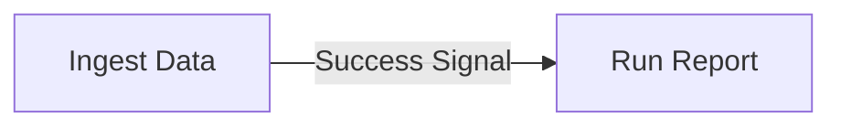
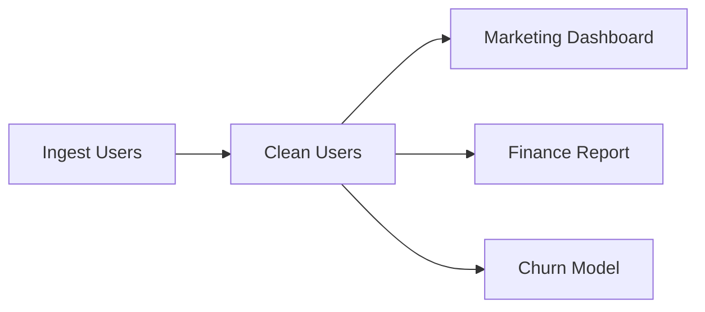
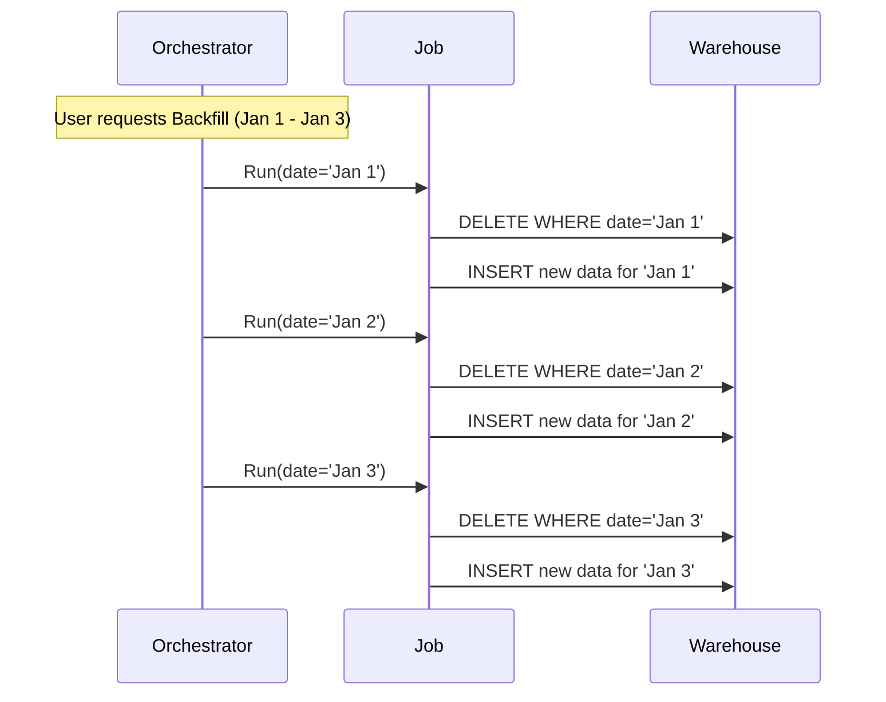

We have built our pipes (ingestion). We have defined our logic (transformation). But a pile of pipes and a book of logic do not make a system. They make a mess.

We need a conductor. We need **orchestration**.

## 9.1 Beyond Cron
For the first forty years of computing, if you wanted something to happen automatically, you used **Cron**.

Cron is a simple, time-based scheduler found in Unix-like operating systems. You give it a time (`0 8 * * *`) and  command (`run_report.sh`), and every day at 8:00 AM, it blindly executes that command.

For simple administrative tasks—like rotating log files or clearing a cache—Cron is perfect. But for data engineering. **Cron is a trap**.

### The Fallacy of Time
Cron assumes that **time** is a perfect proxy for **state**.

Imagine you have two tasks:

1. **Ingest**: Pulls sales data from the production DB (taking roughly 60 minutes).
2. **Report**: Calculates daily revenue (takes roughly 5 minutes).

If you use Cron, you schedule **ingest** for 1:00 AM. You know it takes about an hour, so you give it a "buffer" and schedule a **report** for 3:00 AM.

```mermaid
gantt
    dateFormat  HH:mm
    axisFormat  %H:%M
    title The Cron Gamble (A Good Day)
    
    section Pipeline
    Ingest Data      :active, a1, 01:00, 60m
    The "Safety" Gap :crit, done, 02:00, 60m
    Run Report       :active, a2, 03:00, 5m
```

On a good day, this works. The data lands at 2:00 AM, the system waits for an hour, and the report runs at 3:00 AM.

### The "Silent Empty" Failure
Now, imagine it's Black Friday. The database is under heavy load. The **ingest** job doesn't take 60 minutes; it takes 150 minutes.

It is now 3:00 AM. The **ingest** job is still running; it has only downloaded half the data. Cron looks at the clock. It is 3:00 AM. It fires the **report** job.

The **report** job runs successfully. It calculates revenue based on the **incomplete** data currently in the warehouse. It reports that revenue is down 50%. The CEO panics.

This is the failure of Cron: **Task B started because it was 3:00 AM, not because Task A was finished**.

### Dependency-Based Scheduling
In data engineering, we do not care what time it is. We care about **completion**.

We must move from a **time-based** mental model to a **state-based** mental model. We need a system that says, "Do not start the report until the ingest has successfully completed, regardless of whether that happens at 2:00 AM or 2:00 PM."

This relationship is **dependency**:

- **Upstream**: The task that must happen first (ingest).
- **Downstream**: The task that waits (report).

### The Death of the "Safety Buffer"
When you move to dependency-based scheduling (using tools like Airflow, Dagster, or Prefect), you eliminate the "safety gap."

- If ingestion finishes in 10 minutes? The report runs immediately at 1:10 AM. You get your data faster.
- If ingestion takes 5 hours? The report patiently waits until 6:00 AM. It never runs on partial data.

!!! danger "The Zombie Pipeline"

    The worst nightmare in data engineering isn't a pipeline that crashes 9red). It's a pipeline that succeeds (green) but processes zero rows because the upstream job failed silently. Cron loves creating these "zombie" pipelines. Dependency managers prevent them by refusing to run downstream tasks if the upstream fails.

## 9.2 The DAG (Directed Acyclic Graph)
If you ask a data engineer to draw their system, they won't draw a list. They will draw a map. Boxes connected by arrows, branching out, merging back together, and flowing in a single direction.

Mathematically, this shape is called a **DAG** (Directed Acyclic Graph). It is the universal language of modern orchestration.

### The Anatomy of a DAG
A DAG is composed of two primitive elements:

1. **Nodes (The Vertices)**: These are the units of work. A node is a task. It might be "Run SQL," "Send Email," or "Train Model."
2. **Edges (The Arrows)**: These are the dependencies. An edge represents a constraint: "The tail node must finish successfully before the head node can start."

### Decoding the Acronym
Let's break down the three words, because the last one is the most important constraint in our profession.

#### 1. Directed
The arrows have a direction. Data flows from upstream to downstream.

- **Good**: `Extract --> Transform`
- **Bad**: `Extract -- Transform` (Ambiguous relationship).

#### 2. Graph
It is a network of connections, not just a linear list. A single upstream task (like "ingest user table") might spawn five different downstream tasks (dashboard A, dashboard B, machine learning model C).

This allows for **parallelism**. If "dashboard A" and "dashboard B" both depend on "ingest," but not on each other, the orchestrator can run them effectively at the same time.

#### 3. Acyclic (The Golden Rule)
This is the law: **No Cycles**.

A cycle is a loop. Task A triggers task B, which triggers task A.

- `A -> B -> A`

If your pipeline has a cycle, it is an **infinite loop**. The system will run forever (or until your cloud bill bankrupts you). In a DAG, if you trace the arrows from any point, you must never be able to return to where you started.

Time flows forward. Your data pipeline must respect the arrow of time.

### Why the DAG Wins
When you visualize your system as a DAG, you gain superpowers that a script runner doesn't have.

#### Visual Debugging
When a Cron job fails, you get a text log. When a DAG fails, you get a visual map. You can look at the graph and see exactly where the red box is. You can see "table A" and "table B" updated fine, but the "join" task failed. You instantly know the **blast radius** of the error.

#### Smart Retries
If the "Marketing dashboard" task fails in the graph above, the orchestrator knows it doesn't need to re-run "ingest users" or "clean users." Those nodes are already green. It only retries the specific leaf node that broke.

### The Complex Reality
In the real world, DAGs are rarely simple lines. They are sprawling, complex networks. You might have a "Fan-Out" pattern where one table feeds fifty reports or a "Fan-In" pattern where fifty regional sales tables merge into one global summary.

By enforcing the DAG structure, you force yourself to be honest about dependencies. You cannot just "hope" data is ready. You must draw the line.

## 9.3 Backfilling and Replayability
In software engineering, you deploy code to change the **future**. When you push a new feature to a website, it affects users who visit *from that moment on*.

In data engineering, we often deploy code to fix the **past**.

Imagine you have a pipeline that calculates daily revenue. It has been running for three years. Today, the CFO walks in and says, "We realized we've been calculating tax wrong for the Canadian market since 2021."

If you were a software engineer, you'd fix the bug and say, "it works now." As a data engineer, that is not enough. You have three years of corrupted historical data stored in your warehouse. You must rewrite history.

This process is called **backfilling**.

### The Time Machine Mechanism
Backfilling is the act of running your current code against historical timeframes. It is the ultimate test of your pipeline's architecture.

If your pipeline relies on `CURRENT_DATE()`, backfilling is impossible. You cannot make the computer think it is 2021.

But if your pipeline relies on a **logical execution date** parameter passed by the orchestrator, backfilling is trivial. You simply tell the orchestrator, "Run the DAG for every day between 2021-01-01 and today."

The orchestrator spins up hundreds of runs. For each run, it injects a different date into the `:execution_date` variable.

- Run #1 receives: `2021-01-01`
- Run #2 receives: `2021-01-02`
- …
- Run #1000 receives: `2023-10-25`

To the code, it feels like it is actually that day. It reads the raw logs from that specific date partition, applies the *new* tax logic, and overwrites the old data in the warehouse.

### The Catch Up Problem
There is a physical limit to backfilling: **speed**.

If your daily pipeline takes 23 hours to process one day of data, you can never backfill. If you need to reprocess a year of history, it will take… a year. You will never catch up to the present.

To be replayable, your pipeline must run significantly faster than the data accumulates.

- If processing one day of data takes 1 hour, you can backfill 24 days of history in one real-world day.
- This is why performance optimization matters. It's not just about saving money; it's about **agility**. A slow pipeline is a rigid pipeline.

### Immutable Logs: The Safety Net
You can only backfill if you still have the source ingredients.

This is why we treat our **raw ingestion layer** (the bronze layer in a data lake) as an **immutable log**. We never update raw JSON files. We never delete them. We just pile them up forever.

If you delete your raw logs after 30 days to save space, you have burned the bridge to the past. If you find a bug in your logic for data older than 30 days, you are dead in the water. The data is gone.

!!! tip "The Golden Rule of Storage"

    Storage is cheap. Data is expensive. Never delete the raw source data unless you are legally compelled to (GDPR). It is your insurance policy against your own bad code.

## Quiz

<quiz>
What is the fundamental flaw of using Cron for complex data pipelines compared to a modern orchestrator?
- [ ] Cron is too expensive to license for enterprise use.
- [x] Cron relies on time as a proxy for state, rather than actual task completion.
- [ ] Cron cannot run scripts written in Python.
- [ ] Cron forces all tasks to run sequentially without parallelism.

</quiz>

<quiz>
In the context of orchestration, what is a 'Zombie Pipeline'?
- [ ] A pipeline that fails loudly and wakes up the on-call engineer.
- [ ] A pipeline that runs infinitely due to a cycle in the graph.
- [x] A pipeline that completes successfully (green status) but processes incomplete or zero data because an upstream task failed silently.
- [ ] A pipeline that has been deleted but keeps running.

</quiz>

<quiz>
In a DAG (Directed Acyclic Graph), what does an 'Edge' (the arrow) represent?
- [ ] A retry mechanism for failed tasks.
- [ ] A conditional logic branch (if/else statement).
- [ ] A transfer of data over the network.
- [x] A dependency constraint indicating one task must finish before the next begins.

</quiz>

<quiz>
Why is the 'Acyclic' property (the 'A' in DAG) critical for data pipelines?
- [ ] It allows the pipeline to run backward in time.
- [ ] It ensures that tasks can be run in any random order.
- [ ] It reduces the storage cost of the graph metadata.
- [x] It prevents infinite loops where a downstream task triggers its own upstream parent.

</quiz>

<quiz>
To enable backfilling, what must you replace system calls like `CURRENT_DATE()` with?
- [ ] A hardcoded string like '2022-01-01'.
- [ ] A random number generator.
- [ ] The `UTC_TIMESTAMP()` function.
- [x] A 'Logical Execution Date' parameter passed by the orchestrator.

</quiz>

<quiz>
What is the primary purpose of 'backfilling' in data engineering?
- [ ] To back up data to a secondary server.
- [x] To apply new logic or fix bugs across historical data.
- [ ] To increase the speed of the current daily pipeline.
- [ ] To fill in missing null values with default zeros.

</quiz>

<quiz>
Why is the 'Raw Ingestion Layer' considered an 'Immutable Log'?
- [x] Because it is strictly read-only and never deleted or modified, serving as the source of truth for replayability.
- [ ] Because the data quality is perfect and needs no changes.
- [ ] Because it is stored on tape drives, which are write-once.
- [ ] Because raw data is encrypted and cannot be read.

</quiz>

<quiz>
What is the 'Catch Up' problem regarding pipeline performance?
- [ ] When the orchestrator cannot talk to the database.
- [ ] When the data visualization tool updates slower than the database.
- [ ] When new engineers join the team and don't understand the legacy code.
- [x] When the pipeline takes longer to process a day's worth of data than a day actually takes.

</quiz>

<quiz>
Which of these is a major advantage of visualizing a pipeline as a DAG during a failure?
- [ ] It allows you to use Cron syntax more effectively.
- [ ] It prevents the failure from happening.
- [ ] It automatically fixes the code.
- [x] It allows you to see the 'blast radius' and dependencies of the failure instantly.

</quiz>

<quiz>
If a DAG has a 'Fan-Out' pattern, what does this imply for execution?
- [ ] Multiple upstream tasks merge into a single downstream task.
- [ ] The pipeline must be paused for manual approval.
- [ ] Data is being deleted from the system.
- [x] Multiple downstream tasks depend on a single upstream task and can likely run in parallel.

</quiz>

<!-- mkdocs-quiz results -->