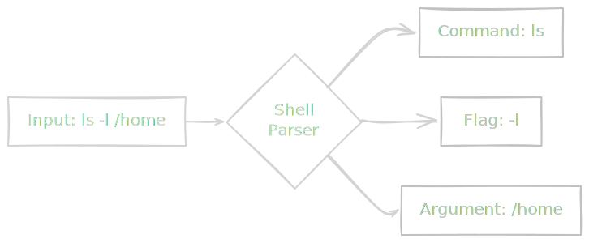

If you are reading this, you've probably opened a terminal window at some point, seen a blinking cursor against a black background, felt a vague sense of existential dread, and quickly closed it. That isn't just you; that is the universal "Hello, world" of the Unix experience.

But there is a secret: that black screen isn't a void. It's a cockpit.

As data engineers, we spend our lives moving massive amounts of information from point A to point B. We build pipelines, we spin up servers, and we debug crashes at 2:00 AM. And the operating system that powers 90% of the world's data infrastructure? It isn't Windows, and it isn't macOS.

It's Linux.

## 1.1 Introduction to Linux
In this module, we aren't going to type any commands yet. We are going to get our mental model aligned. We need to understand what Linux actually *is* before we start telling it what to do.

### Why Are We Here?
You can go a long way in data science just running Jupyter Notebooks on your laptop. But data engineering is different. Data engineering is about **scale** and **automation**.

- **The Cloud is Linux**: AWS, Google Cloud, and even Azure—their backbone is Linux. When you spin up an EC2 instance, you are renting a Linux server.
- **Big Data is Linux**: Docker containers, Kubernetes clusters, Apache Spark, and Airflow—they are all native to Linux.
- **Automation is Linux**: You can't click a "Run" button with a mouse when you need a job to run automatically every night while you sleep. You need scripts.

!!! success "The Goal"

    By the end of this course, you won't just "know Linux." You will feel more comfortable in the terminal than you do in a graphical interface. You will see the GUI for what it often is: a limitation.

### The Kernel and The Shell
"Linux" is actually a bit of a misnomer. When people say "I run Linux," they usually mean they are running a whole suite of tools. But strictly speaking, Linux is just one thing: **The Kernel**.

Imagine a car.

1. **The Hardware**: This is the metal, the tires, and the engine block.
2. **The Kernel**: This is the transmission and the ECU (Engine Control Unit). It talks directly to the hardware. It decides how much fuel goes to the Engine and which wheel spins. It is complex, dangerous to touch, and buried deep inside.
3. **The Shell**: This is the steering wheel and the dashboard. This is the interface you touch.

As a user, you never talk to the kernel directly. You would crash the car. Instead, you talk to the **Shell**.


The **Shell** is a program that takes your text commands (like "list my files") and translates them into instructions the **Kernel** understands ("Hey hard drive, read sector 452").

!!! note "Terminology Check"

    You will hear the terms **Terminal**, **Shell**, and **Console** used interchangeably.

    - **Terminal:** The window wrapper (the app you open).
    - **Shell:** The program running *inside* that window (usually Bash or Zsh) that interprets your commands.

### Choosing a Flavor (Distribution)
If Linux is just the kernel, what is the rest of the OS? The window manager, the file explorer, the wifi drivers?

This is where **Distribution** (or "Distros") comes in. Since Linux is open source, anyone can take the kernel, bundle it with some software, and call it an Operating System.

Think of the Kernel like vanilla ice cream. It's the base. A **Distribution** is the sundae.

- **Ubuntu**: Vanilla ice cream with chocolate sauce and sprinkles. It's popular, easy to use, and comes with everything you need pre-installed. **We will use this.**
- **Debian**: Just the ice cream. Very stable, very plain.
- **Alpine**: A single spoonful of ice cream. Extremely small and lightweight. You will see this constantly when we work with Docker containers.
- **Red Hat / CentOS**: The expensive catering service ice cream. Built for big corporations with slow update cycles.

!!! tip "Which one should I pick?"

    Don't overthink this. For this course (and for 95% of your career), **Ubuntu** is the gold standard. It has the biggest community, which means when you inevitably break something, someone else has already posted the fix on StackOverflow.

### The "No-UI" Reality
One final mental shift before we move on.

If you install Ubuntu on your laptop, it looks like Windows or macOS. It has a desktop, a mouse cursor, and icons. But as a data engineer, you will rarely see that.

You will be logging into remote servers that are **Headless**. They have no monitor, no mouse, and no graphical desktop. When you log in, you get text. That's it.

It feels restrictive at first, like trying to paint a picture over the phone. But soon you will realize that text is faster, lighter, and infinitely more automatable than clicking icons.

## 1.2 The Shell Environment
If the **kernel** is the engine, the **Shell** is the dashboard and steering wheel. It's the program that takes the commands you type and whispers them into the kernel's ear. Today, we're going to learn how to read that blinking cursor and how to speak its language.

### Bash vs. Zsh: Which "Accent" Are We Using?
When you open a terminal, you're likely using one of two popular shells: **Bash** or **Zsh**.

- **Bash (Bourne Again Shell)**: The "Old Reliable." It has been the default on Linux systems for decades. If you log into a remote server in the cloud, 99% of the time, you will be greeted by Bash. It is utilitarian, ubiquitous, and, frankly, a little plain.
- **Zsh (Z Shell)**: The "Cool New Kid." If you are on a modern Mac, this is your default. It's compatible with Bash (mostly), but it comes with bells and whistles like smarter auto-completion and prettier themes.

!!! note "Does it matter which one I use?"

    For this course? **Not really**.

    The syntax we cover here is POSIX-compliant, meaning it works on Bash, Zsh, and pretty much any other shell you stumble upon. I recommend sticking with whatever your system gave you by default. We are here to learn the *language*, not debate the *font*.

!!! abstract "Deep Dive: Why is it called 'Bash'?"

    In the 70s, the original Unix shell was written by Stephen Bourne (called sh). Later, when the free software movement needed a replacement, they wrote an improved version and punnily named it the "Bourne-Again Shell." Programmers love a dad joke.

### The Prompt: Decoding the Hieroglyphics
Open your terminal. You probably see a line of text followed by a blinking cursor. It might look something like this:

```bash
data_wizard@pipeline-server:~$
```

This isn't random gibberish. This is the **Prompt**. It's the shell's way of saying, "I'm listening. Who are you, where are you, and what do you want to do?"

Let's dissect it:

`data_wizard` @ `pipeline-server`: `~` `$`

1. `data_wizard` **(The User)**: This is *who* you are currently logged in as.
2. `pipeline-server` **(The Hostname)**: This is the name of the machine you are on. This is incredibly important when you are managing five different servers and need to make sure you aren't deleting files on the *production* database when you thought you were on *testing*.
3. `~` **(The Location)**: This symbol (the tilde) is shorthand for your **Home Directory**. It means "I am currently in my personal folder." If you move to another folder, this part of the prompt will change to show your new path.
4. `$` **(The Role)**: This little symbol is more powerful than it looks.
    - `$` means you are a standard user. You have limits. You can't break the system easily.
    - `#` means you are **root** (the administrator). You have godlike powers. You can delete the entire operating system with a sneeze.

!!! warning "The Dangerous Hash (`#`)"

    If your prompt ends in `#`, **be careful**. You are running as root. Every command you type is executed without safety rails. Generally, you want to stay in `$` mode and only escalate privileges when absolutely necessary.

### Basic Syntax: The Grammar of Linux
Learning the shell is just like learning English. Sentences follow a structure. In English, you might say, "Run quickly to the store."

In Linux, we structure our "sentences" (commands) like this: `Command + Flags (Adverbs) + Arguments (Objects)`.

Let's visualize how the shell parses what you type:



**1. The Command (The Verb)**

This is *what* you want to do.

- `ls` (list files)
- `cd` (change directory)
- `python` (run Python)

**2. The Flags (The Adverbs)**

These modify *how* the command runs. They  usually start with a hyphen (`-`) or a double hyphen (`--`).

- `ls -l` means "list files *in long format* (showing details)."
- `ls -a` means "list files, *including hidden ones.*"
- You often combine them: `ls -la`.

**3. The Arguments (The Object)**

This is *what* the command acts upon.

- `cd /home` (change directory *to /home*)
- `touch data.csv` (create a file *named data.csv*)

!!! tip "The Magic Tab Key"

    You are a data engineer, which means you are busy. Never type a full filename if you don't have to.

    Type the first few letters of a command or filename and hit **Tab**. The shell will autocomplete it for you. It’s the single greatest productivity hack in the terminal.

    - Type `cd Do` -> Hit **Tab** -> Shell fills in `cd Documents/`

### Putting it Together
Let's try a real command. We want to list all files in the `/var` folder, and we want to see the details.

**The Sentence**: "List (verb) detailed (adverb) files in the /var folder (object)."

**The Command**:

```bash
ls -l /var
```

If you run this, you'll see a list of files. Don't worry about what they are yet; just recognize that you successfully spoke to the kernel, and it answered back.

Now that you know who you are (`user`), where you are (`hostname`), and how to speak (`command -flags args`), it's time to start exploring. In the next module, **Filesystem Navigation**, we're going to learn how to move around this world without a mouse.

## Quiz

<quiz>
In our car analogy, if the kernel is the engine, what is the shell?
- [x] The dashboard and steering wheel.
- [ ] The gasoline powering the car.
- [ ] The GPS Navigation system.
- [ ] The tires that touch the road.

</quiz>

<quiz>
You are building a Docker container and need it to be as small as possible. Which Linux flavor is the best choice?
- [ ] Ubuntu
- [ ] Debian
- [ ] CentOS
- [x] Alpine

</quiz>

<quiz>
You log in and see `data_wizard@pipeline-server:~$`. What does the `~` symbol indicate?
- [ ] You are in the root directory.
- [x] You are in your Home directory.
- [ ] You are in the `/var/log` directory
- [ ] The system is processing a command.

</quiz>

<quiz>
Your prompt changes from `$` to `#`. Why should your heart rate increase slightly?
- [x] You are now running as the Root user.
- [ ] Your disk space is full.
- [ ] You have been disconnected from the server.
- [ ] You have switched from Bash to Zsh.

</quiz>

<quiz>
In the command `ls -lah /var`, what role does `-lah` play?
- [x] It is the flag (the adverb).
- [ ] It is the output.
- [ ] It is the argument (the object).
- [ ] It is the command (the verb).

</quiz>

<quiz>
Why is it important to pay attention to the `hostname` in your prompt (e.g., `user@production-db`)?
- [x] To prevent running dangerous commands on the wrong server.
- [ ] To check if your internet connection is active.
- [ ] To know which shell version you are using.
- [ ] To see how much memory is available.

</quiz>

<quiz>
You start typing `cd Doc` and want the shell to finish typing `Documents/` for you. Which key do you press?
- [ ] Escape
- [ ] Enter
- [ ] Space
- [x] Tab

</quiz>

<quiz>
Which of these is the most common default shell you will encounter on remote Linux servers?
- [ ] Python
- [x] Bash
- [ ] Powershell
- [ ] Zsh

</quiz>

<quiz>
In the command `touch new_data.csv`, what is `new_data.csv`?
- [ ] The command.
- [ ] The flag.
- [ ] The prompt.
- [x] The argument.

</quiz>

<quiz>
Why do data engineers generally prefer the CLI (Command Line Interface) over a GUI (Graphical User Interface)?
- [ ] Because it has better colors.
- [ ] Because it doesn't require a keyboard.
- [ ] Because it is easier to learn.
- [x] Because servers often don't have screens or mice.

</quiz>

<!-- mkdocs-quiz results -->

## Lab
Please complete module 1 labs in the companion GitHub repository.
