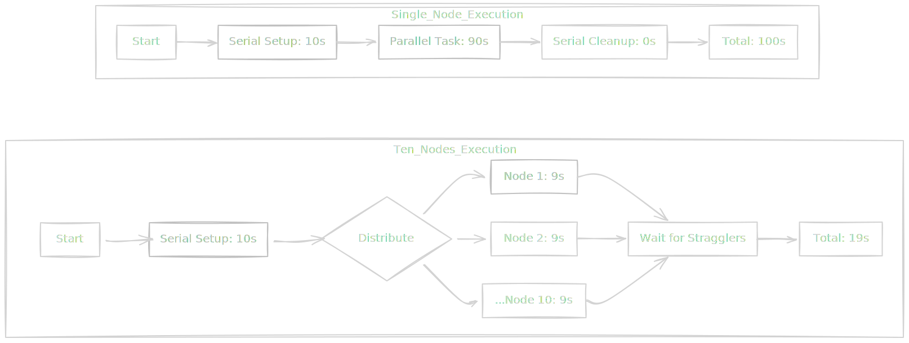
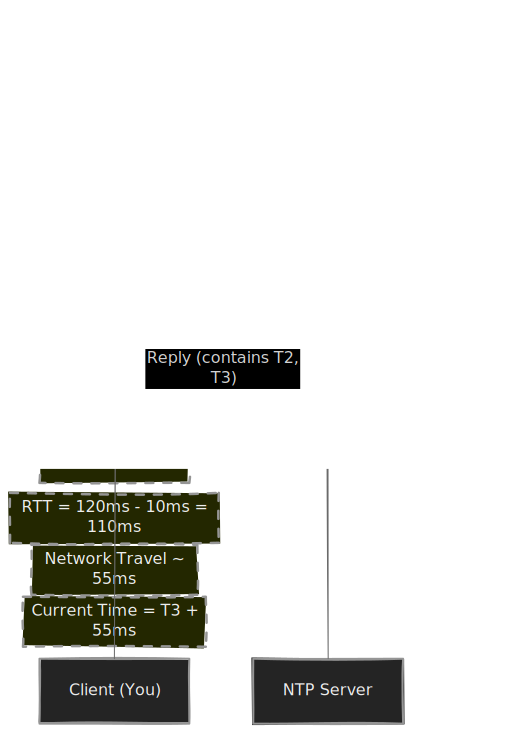
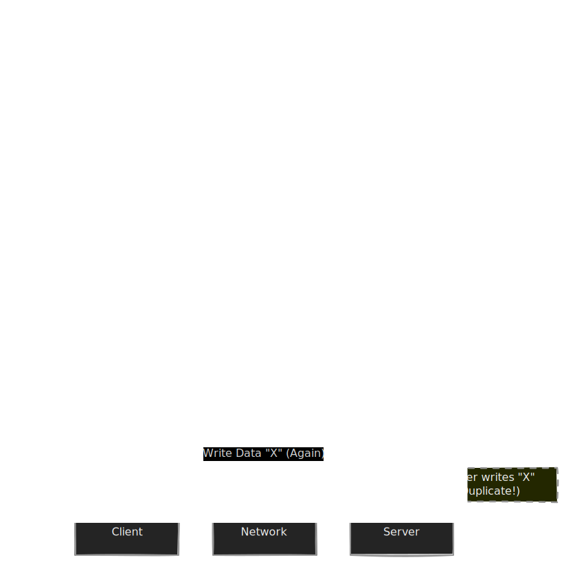

We have spent the last nine modules getting intimate with a single machine. We've watched electrons race through the CPU, debated the cost of cache miss, and cried over the latency of a spinning hard disk. We've treated the computer like a solitary artisan—a master craftsman working alone in a quiet room.

But in data engineering, we rarely have the luxury of small data. We deal with petabytes. A single artisan, no matter how fast, cannot empty the ocean with a teaspoon. So, we stop building faster computers and start building *more* of them. We enter the world of **Distributed Systems**.

The premise is seductive: if one computer can process a job in 10 hours, ten computers should do it in 1 hour, and a thousand should finish it before you can sip your coffee.

Unfortunately, this is where the math starts to hurt.

## 10.1 Amdahl's Law
There is a pervasive myth in our industry that I call the "Credit Card Scaling Fallacy." It goes like this: "My data pipeline is too slow. I will double the size of my Spark cluster. Therefore, my pipeline will be twice as fast."

If you have ever tried this, you know the crushing disappointment that follows. You double the nodes, but the speed only increases 30%. You double them again, and it barely moves. You have just discovered **Amdahl's Law**.

Gene Amdahl, a computer architect at IBM, formulated this in the 1960s, but it remains the harsh reality check for every modern cloud architect. It states that the theoretical speedup of a task is limited by the part of the task that cannot be parallelized.

### The Serial vs. The Parallel
To understand why, we have to look at the anatomy of a "job." We like to imagine a job is a giant pile of rocks that we can just divide among workers. But software isn't just a pile of rocks; it's a recipe.

Some steps in a recipe are **Parallelizable**:

- Chopping 100 carrots. (One chef takes 100 minutes; 100 chefs take 1 minute).

Some steps are **Serial**:

- Preheating the oven. (You cannot use 100 ovens to heat one oven faster).
- Mixing the final stew. (You can't mix it until the carrots are chopped).

The total time to run your program is the sum of the serial time and the parallel time.

$$
\text{Total Time } = T_{\text{serial}} + T_{\text{parallel}}
$$

When you add more processors (or nodes in a cluster), you are only attacking the $T_{\text{parallel}}$ portion. The $T_{\text{serial}}$ portion is stubborn. It refuses to budge.

### The Formula
The formula for the maximum speedup looks intimidating, but it's actually just simple division.

$$
\text{Speedup } = \frac{1}{(1 - P) + \frac{P}{N}}
$$

Where:

- $P$ is the proportion of the code that can be parallelized (e.g., 0.90 or 90%).
- $(1 - P)$ is the serial portion (the bottleneck).
- $N$ is the number of processors (or nodes).

Let's look at the behavior of this curve. Even if you have infinite computing power $(N \to \infty)$, the term $\frac{P}{N}$ goes to zero. You are left with:

$$
\text{Max Speedup } = \frac{1}{1 - P}
$$

If 5% of your program is serial ($P = 0.95$), the maximum speedup you can ever achieve, even with a million computers, is 20x. That's it. That is the ceiling. 

In the diagram above, note that the "Serial Setup" block did not shrink. We crushed the "Task" block, but the "Serial Setup" sets a hard floor on our performance.

!!! tip "Data Engineering Context: The Spark Driver & The Gzip Trap"

    In data engineering, we hit Amdahl's Law constantly, usually in two specific places:

    1.  **The Driver Node:** In distributed frameworks like Apache Spark, the "Driver" is the brain. It plans the work and collects the results. If you write code that pulls too much data back to the driver (e.g., a massive `.collect()` or a single-threaded final aggregation), you are increasing the **Serial** portion of your job. No matter how many Executors you add, the Driver is one single machine running one single CPU thread.
    2.  **Unsplittable Files:** If you store your raw data as a massive, single GZIP file, Spark cannot split that file across multiple cores. GZIP is not splittable. One single CPU core has to read and decompress that entire file before any parallelism can happen. That decompression time is your $(1 - P)$.

### Diminishing Returns
This leads to the concept of **Diminishing Returns**. The first few nodes you add provide massive value. Going from 1 node to 2 nodes nearly doubles your speed. But going from 100 nodes to 200 nodes might only get you a 1% boost, yet it costs you exactly double the money.

!!! warning "The Coordination Tax"

    Amdahl's Law is actually an *optimistic* view. It assumes that adding more nodes doesn't slow things down. In reality, adding nodes adds **overhead**.

    More nodes mean more network traffic, more data shuffling, and more time spent waiting for the slowest node (the "straggler") to finish. In some distributed systems, adding too many nodes can actually make the job *slower* than if you ran it on fewer machines. This is sometimes called the "Universal Scalability Law," which adds a coherency penalty to Amdahl's equation.

## 10.2 Clock Synchronization
If you ask a human, "what time is it?," they glance at their phone and say, "10:15." If you ask another human across the room, they will also say "10:15." We live with a comfortable illusion that time is a universal constant, a single timeline that we all move through together.

In distributed systems, this illusion shatters.

Computers don't have a divine connection to the universe's timeline. They have a cheap piece of quartz crystal on their motherboard. When you apply electricity, the crystal vibrates at a specific frequency. The OS counts these vibrations (ticks) to calculate the passage of time.

Here is the problem: **crystals are imperfect**.

They vary slightly in manufacturing. They react to temperature (a hot server rack makes the crystal vibrate differently than a cold one). This leads to **Clock Drift**. A standard server clock might drift by 17 seconds per day if left unchecked.

In a cluster of 100 nodes, "Time" is not a single value. It is a cloud of disagreeing opinions.

### Network Time Protocol (NTP)
To stop our servers from drifting into different centuries, we use **NTP (Network Time Protocol)**. The concept is simple: your server periodically asks a highly accurate "Time Server" (stratum source) what time it is and then adjusts its own clock.

But there is a catch.

Imagine you are in New York and you mail a letter to a friend in London asking for the time.

1. You send the letter at 12:00.
2. Your friend receives it, checks their watch, sees 12:05, and writes "it is 12:05" on a return letter.
3. You receive the reply at 12:10.

If you just set your watch to 12:05, you are wrong. The message is old. It took time to travel.

NTP tries to solve this by measuring the **Round Trip Time (RTT)**.

$$
\text{Delay } = (T_4 - T_1) - (T_3 - T_2)
$$

Where:

- $T_1$: You sent the packet.
- $T_2$: Server received it.
- $T_3$: Server sent the reply.
- $T_4$: You received the reply.

NTP assumes the network delay is symmetrical (it took the same time to go up as to come down). It divides the delay by 2 and adds that to the server's timestamp.

### The Unreliable Truth
Even with NTP, time is never perfect.

- **Asymmetric Routes**: Maybe the request went over a fast fiber line, but the response came back over a congested copper line. The "Divide by 2" assumption fails.
- **Leap Seconds**: Occasionally, astronomers add a second to the year to account for the Earth's rotation slowing down. Computers *hate* this. It often causes software to crash because a minute suddenly has 61 seconds, or time appears to go backward.

In a well-maintained data center, clicks might be synchronized to within a few milliseconds. In a chaotic cloud environment, they can be off by hundreds of milliseconds.

!!! tip "Data Engineering Context: The 'Last Write Wins' Disaster"

    Why does a data engineer care about milliseconds? Because of **Ordering**.

    Imagine a distributed database (like Cassandra or DynamoDB).

    1.  **User A** updates a record: `status = "Active"` at 10:00:00.100 (on Server 1).
    2.  **User B** updates the same record: `status = "Inactive"` at 10:00:00.105 (on Server 2).

    Logically, User B was last. The final state should be "Inactive."

    But what if Server 1's clock is **fast** by 10ms?
    
    - Server 1 timestamps the write as **10:00:00.110**.
    - Server 2 timestamps the write as **10:00:00.105**.

    The database looks at the timestamps. It sees Server 1 has the "later" time. It keeps "Active" and discards "Inactive."

    **You just lost data.** The user explicitly turned the feature off, but your database ignored them because a quartz crystal on a rack in Virginia was slightly warmer than a crystal in Ohio.

    **Takeaway:** Never rely on system timestamps (`Now()`) for strict ordering of events across different machines. If ordering matters, you need a logical clock (like a transaction ID or a strictly ordered log like Kafka offsets).

!!! note "The Google Spanner Exception"

    This problem is so hard that Google solved it by throwing money at physics. For their Spanner database, they installed **GPS receivers and Atomic Clocks** in every datacenter. This system, called "TrueTime," bounds the uncertainty of time to a tiny window (e.g., [10:00:00.001, 10:00:00.005]). If two transactions fall within that uncertainty window, the database forces one to wait until the window passes. They literally pause the software to let the uncertainty of the universe catch up. Most of us cannot afford atomic clocks, so we just accept that time is fuzzy.

## 10.3 Fallacies of Distributed Computing
We end our journey with a list of lies.

In the 1990s, L.Peter Deutsch and his colleagues at Sun Microsystems drafted the "8 Fallacies of Distributed Computing." These are false assumptions that every junior engineer makes when they first move from writing code on a laptop to writing code for a cluster.

When you write a function call in Python, like `calculate_total()`, you trust it. You know the CPU will jump to that memory address, execute the instructions, and return. It won't get lost. It won't vanish. It won't take 10 seconds one time and 3 milliseconds the next.

But when the function call involves a network request—an API call, a database query, a Spark shuffle—you enter a world of chaos.

Here are the three big ones that plague data engineering.

### Fallacy #1: The Network is Reliable
**The Lie**: We assume that if we send a packet from Server A to Server B, it will arrive.

**The Reality**: The network is a hostile war zone. Switches reboot randomly. Someone trips over a fiber cable. A router gets misconfigured and starts dropping 5% of packets. A shark bites an undersea cable (this actually happens).

In a single machine, if a write fails, your program crashes. In a distributed system, if a write fails, your program hangs… forever. Or worse, the request goes out, the server writes the data, but the acknowledgement packet gets dropped on the way back. Your client thinks the write failed, so it tries again. Now you have written the data twice.

!!! tip "Data Engineering Context: Idempotency is King"

    Because the network is unreliable, we must design for **retries**. But as shown above, blind retries lead to duplication.

    This is why **Idempotency** is the most important word in a Data Engineer's vocabulary. An idempotent operation is one that can be applied multiple times without changing the result beyond the initial application.

    - **Bad (Not Idempotent):** `UPDATE account SET balance = balance + 10`
    - **Good (Idempotent):** `UPDATE account SET balance = 110`
    - **Good (Idempotent DE):** Using `INSERT OVERWRITE` in SQL instead of `INSERT INTO`. If the job runs twice, the second run just overwrites the first one with the exact same data. No duplicates.

### Fallacy #2: Latency is Zero
**The Lie**: We assume that moving data between nodes is instant.

**The Reality**: The speed of light is fast, but it is not infinite. Inside a CPU, signals travel millimeters. Across a data center, they travel hundreds of meters. Across a region, hundreds of kilometers.

Data engineers often write code that treats a remote database table like a local Python dictionary. They write a loop that iterates 1,000 times, and inside that loop, they make a database query.

- Local RAM Lookup: ~100 nanoseconds.
- Network Round Trip (AWS Availability Zone): ~1,000,000 nanoseconds (1 ms).

You just made your code 10,000x slower.

!!! warning "The N+1 Problem"

    This is the classic performance killer.

    - **Scenario:** You have a list of 1,000 `UserIDs`. You want their names.
    - **Naive Approach:** Loop through the list. For each ID, execute `SELECT name FROM users WHERE id = ?`.
    - **Result:** You pay the network latency tax 1,000 times. If latency is 5 ms, this takes 5 seconds.
    - **Solution:** **Batching.** Execute `SELECT name FROM users WHERE id IN (List...)`. You pay the latency tax once. The query takes 10 ms total.

### Fallacy #3: Bandwidth is Infinite
**The Lie**: We assume we can send as much data as we want, whenever we want.

**The Reality**: Every pipe has a width. Your server has a network interface card (NIC), likely 1 Gbps or 10 Gbps. If you try to push 20 Gbps through a 10 Gbps pipe, packets start dropping. This is called **Saturation**.

In data engineering, we love big data. We casually run `SELECT *` on a 10 TB table. We don't think about the physics. That 10 TB has to be serialized, chopped into packets, pushed onto the wire, routed through switches (which are shared by other people), and reassembled on your laptop.

!!! tip "Data Engineering Context: The Broadcast Join"

    Bandwidth limitations govern how we join tables in Spark.

    - **Shuffle Join:** Both tables are massive. We have to send data across the network so that matching keys end up on the same node. This explodes the network bandwidth.
    - **Broadcast Join:** One table is small. We send a copy of the small table to *every* node. This saves bandwidth because we don't have to move the massive table.

    Understanding that bandwidth is finite helps you realize why "Columnar Formats" (like Parquet) are so critical. They allow us to only fetch the columns we need, saving the network from clogging up with data we inevitably ignore.

## Quiz

<quiz>
According to Amdahl's Law, if 95% of a program can be parallelized ($P = 0.95$) and you have an infinite number of processors, what is the theoretical maximum speedup limit?
- [ ] Infinite speedup.
- [x] 20x
- [ ] 95x
- [ ] 5x

</quiz>

<quiz>
In the context of Apache Spark, which of the following actions increase the 'Serial' portion of a job, thereby triggering the bottleneck described by Amdahl's Law?
- [ ] Partitioning data by a high-cardinality key.
- [ ] Adding more executor nodes to the cluster.
- [ ] Using a broadcast join for small tables.
- [x] Calling `.collect()` to bring data back to the driver.

</quiz>

<quiz>
Why do standard server clocks 'drift' over time, causing them to disagree with each other?
- [ ] Network congestion delaying the NTP packets.
- [x] Imperfections and temperature sensitivity of the quartz crystal.
- [ ] Interference from cosmic rays flipping bits in RAM.
- [ ] Software bugs in the operating system's kernel.

</quiz>

<quiz>
When using Network Time Protocol (NTP) to synchronize a clock, what critical assumption does the algorithm make about the network?
- [ ] Network latency is zero.
- [ ] Bandwidth is infinite.
- [ ] Packets are never dropped.
- [x] Network delay is symmetrical (upload time equals download time).

</quiz>

<quiz>
In a distributed database, why is the 'Last Write Wins' strategy potentially dangerous when relying on system timestamps?
- [x] Clock skew can cause a newer event to have an older timestamp.
- [ ] It requires expensive atomic clocks to function at all.
- [ ] It consumes too much storage space.
- [ ] It causes deadlock in the database locking mechanism.

</quiz>

<quiz>
Which data engineering concept is the primary defense against the 'Fallacy of the Reliable Network' (i.e., handling dropped acknowledgment packets).
- [ ] Compression.
- [x] Idempotency.
- [ ] Sharding.
- [ ] Encryption.

</quiz>

<quiz>
The 'N+1 Problem' (fetching a list of IDs and then querying the database for each one individually) is a performance killer primarily because it violates which fallacy?
- [x] Latency is zero.
- [ ] Bandwidth is infinite.
- [ ] The network is secure.
- [ ] Topology doesn't change.

</quiz>

<quiz>
Why is a 'Broadcast Join' often preferred over a 'Shuffle Join' when one of the tables is small?
- [ ] It guarantees that the data is sorted.
- [ ] It increases the serial portion of the job.
- [ ] It fixes clock synchronization issues between nodes.
- [x] It avoids network bandwidth saturation by moving less data.

</quiz>

<quiz>
What is the 'Coordination Tax' (or Universal Scalability Law) in the context of distributed clusters?
- [ ] The financial cost of buying more servers.
- [ ] The tax levied by cloud providers on data egress.
- [x] The additional overhead of communication and waiting that slows down speedup as nodes are added.
- [ ] The time spent compiling code before execution.

</quiz>

<!-- mkdocs-quiz results -->