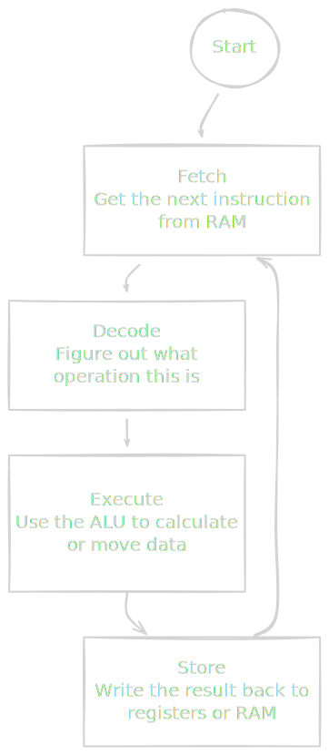
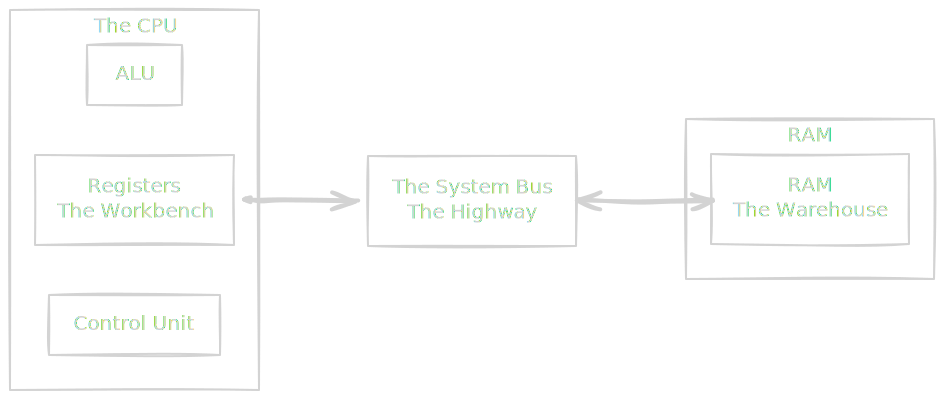
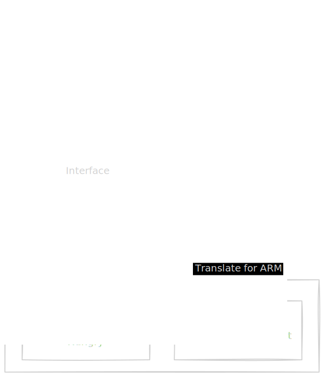

If you peel away the sleek aluminum casing of your laptop, dig past the operating system, and ignore the Python interpreter, you will eventually hit the bedrock of computing: the Central Processing Unit (CPU).

There is a popular notion that computers are "smart." This is a lie. Computers are essentially rocks that we tricked into thinking by flattening them into silicon wafers and infusing them with lightning. A CPU doesn't know what "data engineering" is. It doesn't know what a "database" is. It doesn't even know what "multiplication" is, conceptually.

It only knows how to do one thing, and it does this one thing billions of times a second, religiously, until you cut the power. It follows the **Von Neumann Cycle**.

## 1.1 The Fetch-Decode-Execute Cycle
This one thing the CPU knows very well, this Von Neumann Cycle, is:

1. Fetch an instruction.
2. Decode what it means.
3. Execute it.

Let's walk through this mechanical heartbeat.

### The Anatomy of a Cycle
Imagine the CPU as a very fast, very obedient, but unimaginative clerk sitting at a desk.

- **The Control Unit (CU)**: This is the clerk. Their job is to manage the flow of data. They don't do the math; they just tell everyone else what to do.
- **The Arithmetic Logic Unit (ALU)**: This is a calculator sitting on the disk. It handles the raw number-crunching (addition, subtraction, logic comparisons).
- **The Registers**: These are the sticky notes on the desk. They hold the tiny bits of data the clerk is working on *right now*.
- **RAM (Memory)**: This is a massive filing cabinet across the room. It holds all the instructions and data, but it takes time to walk over there.

Here is how the clerk spends their entire existence:

#### 1. Fetch
The control unit looks at a special sticky note called the **Program Counter**. This note contains a number (an address) pointing to a specific drawer in the filing cabinet (RAM). The clerk walks to that drawer, pulls out a slip of paper (the instruction), and brings it back to the desk.

#### 2. Decode
The instruction is just a binary blob, like `10110000 01100001`. The Control Unit looks at this pattern and consults its manual (the instruction set). It realizes, "Ah, `10110` means 'Move', and `01100001` corresponds to the number 97."

#### 3. Execute
The clerk performs the action. If the instruction was "ADD," the control unit routes two numbers into the ALU,  pushes the "plus" button, and grabs the result.

!!! note "The Illusion of Complexity"

    Every piece of software you have ever written—from a "Hello World" script to a distributed Kafka cluster—is just a massive pile of these simple Fetch-Decode-Execute loops. The complexity doesn't come from the machine; it comes from the sheer volume of instructions being processed.

### The Clock: The Metronome
If the CPU is the clerk, the **Clock** is the relentless drummer standing behind them, beating a rhythm. 

The physical circuitry of a CPU is a state machine. It needs a signal to transition from "Step 1" to "Step 2." A crystal oscillator on the motherboard vibrates to generate an electrical pulse—a "tick."

When we say a CPU runs at 3.0 GHz, we are talking about the speed of this drummer.

- 1 Hz = 1 cycle per second
- 1 GHz = 1,000,000,000 (one billion) cycles per second.

A 3 GHz processor ticks 3 billion times per second. That means the clerk has roughly 0.33 nanoseconds to complete a stage of the pipeline before the drum beats again. If the clerk misses a beat, the system stalls.

!!! tip "Data Engineering Context: The CPU-Bound Nightmare"

    As data engineers, we often categorize our bottlenecks as "I/O Bound" (waiting for the network/disk or "CPU Bound" (waiting for the math).

    The Fetch-Decode-Execute cycle is why **Regular Expressions (Regex)** can be dangerous in a data pipeline.

    Imagine you are ingesting a messy log file, and you write a complex Regex to extract a timestamp. If that Regex has to backtrack (a "catastrophic backtracking" scenario), the CPU enters a tight loop. It is Fetching, Decoding, and Executing millions of comparisons to match that string.

    - It can't send a heartbeat to the Spark driver.
    - It can't acknowledge a Kafka offset.
    - It can't respond to a health check.

    To the outside world, your node looks "dead," and the cluster might kill it. But it wasn't dead—it was just thinking *really* hard about a string match, trapped in the Von Neumann cycle.

### Why This Matters
Understanding this cycle is the first step in demystifying latency. When you write code that feels "slow," it is usually because you are forcing the clerk to fetch too much from the filing cabinet (RAM latency) or you have given the clerk a math problem so hard (complex transformations) that they can't keep up with the drumbeat.

## 1.2 Registers and The Bus
We established that our "Clerk" (the CPU) is incredibly fast. But speed is useless if you don't have the materials you need to work.

To understand how data moves, we have to distinguish between the **Workbench** and the **Warehouse**.

### The Workbench: Registers
In the literal physical silicon of the CPU, right next to the ALU, reside tiny slots of memory called **Registers**.

If RAM is the filing cabinet across the room, Registers are the sticky notes right in front of the clerk's face. They are the only place where work actually happens. The CPU cannot add two numbers stored in RAM. It must:

1. Copy Number A from RAM to Register 1.
2. Copy Number B from RAM to Register 2.
3. Add Register 1 and Register 2.

Registers are the fastest storage medium on the planet. Access is effectively instantaneous (usually 1 clock cycle). But they are agonizingly expensive and scarce. A typical CPU has only a few dozen of them.

### The Bus: The Highway
Connecting the Workbench (CPU) to the Warehouse (RAM) is a set of copper wires called the **Bus**.

Think of the Bus as a highway. The width of this highway determines how much traffic (data) can move at once. If you have a massive warehouse full of data but a single-lane dirt road leading to the factory, your factory will sit idle.

### Word Size: 32-bit vs. 64-bit
You have likely installed software and been asked to choose between "x86 (32-bit)" and "x64 (64-bit)." You probably picked 64-bit because "bigger number better," but what does that actually mean physically?

The **Word Size** is essentially the width of the clerk's hands. It dictates two things:

1. **Instruction Width**: How big of a chunk of data the CPU can process in a single "gulp."
2. **Addressable Memory**: How many unique drawers in the filing cabinet the clerk can count to.

### The Math of Addressing
Computers address memory using binary numbers.

- **32-bit**: The CPU can generate addresses from 0 to $2^{32} - 1$.
    - $2^{32} = 4,294,967,296 \text{ bytes} \approx 4 \text{ Gigabytes}$.
- **64-bit**: The CPU can generate addresses from 0 to $2^{64} - 1$.
    - $2^{64} \approx 18,446,744,073,709,551,616 \text{ bytes } \approx 18 \text{ Exabytes}$.

!!! warning "The 4 GB Ceiling"

    Back in the early 200s, this was a hard physical limit. If you installed 8 GB of RAM into a 32-bit Windows machine, the CPU simply ignored the upper 4 GB. It physically did not have the vocabulary to say the names of those memory locations. It ran out of numbers.

!!! tip "Data Engineering Context: Why we can finally use Pandas"

    This architecture shift is the primary reason modern data engineering exists in its current form.

    In a 32-bit world, in-memory processing tools like **Pandas** or **Spark** (in local mode) would crash the moment your dataset exceeded roughly 3 GB (after OS overhead). You were forced to process data in tiny batches or rely entirely on disk-based SQL databases.

    With 64-bit architecture, the limit on your dataframe size is no longer the CPU architecture—it's just the size of your credit card bill for the RAM. 

### Bandwidth vs. Latency
The Bus introduces a critical concept we will revisit constantly: **Bandwidth is not latency**.

- **Bus Width (Bandwidth)**: How many cars can fit on the highway side-by-side (e.g., 64 bits wide).
- **Bus Speed (Latency)**: How fast the cars drive.

You can widen the highway (increase bus width), but it still takes time for the signal to travel across the motherboard. To the CPU, waiting for data from RAM over the Bus is like waiting for a pizza delivery. It takes "forever" in CPU-time.

To solve this, hardware engineers stopped trying to make the Bus faster and instead decided to move parts of the warehouse closer to the workbench. This leads us to the **Cache**, which we will cover in module 2. But first, we need to talk about the language the Clerk speaks.

## 1.3 Instruction Set Architecture (ISA)
We know the CPU is a clerk, and the instruction is a slip of paper telling them what to do. But what language is written on that paper?

This is the **Instruction Set Architecture (ISA)**. It is the interface between the hardware (silicon) and the software (compilers). It defines the vocabulary of the CPU.

If you write Python code, you don't care about this. Python talks to C, C talks to Assembly, and Assembly talks to the ISA. But when you are selecting instance types in AWS or debugging a Docker container that crashes with `exec format error`, you are colliding head-first with the ISA.

There are two dominant philosophies here: **CISC** and **RISC**.

### CISC: The "Kitchen Sink" Approach
**Dominant Player**: x86/x86-64 (Intel, AMD)

**CISC** stands for **Complex Instruction Set Computing**. The philosophy here is, "Let's build the smartest hardware possible so the programmer can be lazy."

Intel engineers packed the CPU with thousands of specialized, complex instructions. A single instruction in x86 might do something massive like "Load a value from memory, multiply it by another, and store it back."

- **Analogy**: You tell the clerk, "Make a sandwich."
- **The Clerk**: Knows exactly what that means. They go get the bread, the mayo, and the ham, assemble it, and plate it. One command, a huge amount of work.

**The Trade-off**: To support these complex commands, the physical chip must be incredibly complex. It requires more transistors, generates more heat, and consumes more electricity. 

### RISC: The "Lego Brick" Approach
**Dominant Player**: ARMN (Apple Silicon, AWS Graviton, Raspberry Pi)

**RISC** stands for **Reduced Instruction Set Computing**. The philosophy here is, "Let's keep the hardware simple and fast. Make the software (compiler) do the hard work."

ARM chips only understand very simple, atomic commands. They don't have a "Make Sandwich" button.

- **Analogy**: You tell the clerk, "Make a sandwich."
- **The Clerk**: Stares at you blankly, "I don't know that command."
- **You (The Compiler)**: Sigh. "Okay. 1 Open Bread bag. 2 Remove slice. 3 Open Mayo. 4 Spread Mayo…"

You have to send 50 instructions to get the same result as 1 CISC instruction.

**The Trade-off**: Because the commands are simple, the chip is much simpler. It consumes significantly less power and generates less heat.

### Why ARM Won the Modern Era
For decades, Intel (CISC) ruled the server room because raw power was king. But then two things happened:

1. **Mobile Phones**: You can't put a hot, battery-draining Intel chip in an iPhone. ARM became the standard for mobile.
2. **The Cloud**: Data centers operate at a massive scale. Electricity and coding are major costs.

If you have 10,000 servers, and you can switch to a chip that uses 20% less power for the same performance, you save millions of dollars.

!!! tip "Data Engineering Context: The Graviton Revolution"

    In AWS, you will see instance types like `m5.large` (Intel) and `m6g.large` (Graviton/ARM). The 'g' stands for Graviton.

    For Data Engineering workloads—especially stateless ones like Spark workers, Airflow schedulers, or containerized microservices—**ARM is almost always the better choice.**

    - **Cost:** AWS typically prices Graviton instances ~20% cheaper than their Intel counterparts.
    - **Performance:** For pure data shuffling and integer math (common in ETL), they often outperform legacy x86 chips.

    **The "Gotcha" (Docker)**:

    The biggest pain point for Data Engineers is local development. If you are on an Apple M1/M2/M3 Mac (which is ARM-based) and you build a Docker image, you are building an **ARM image**.

    If you push that image to a Kubernetes cluster running on standard Intel nodes, the container will crash immediately with `exec format error`. The Intel CPU looks at the ARM binary instructions and says, "I don't speak this language."

    **Solution:** You must use Docker "buildx" to cross-compile: `docker buildx build --platform linux/amd64 ...`

## Quiz

<quiz>
In the Von Neumann architecture, which component is responsible for decoding instructions and orchestrating the flow of data, effectively acting as the 'clerk'?
- [x] The Control Unit (CU).
- [ ] The L1 Cache.
- [ ] The Arithmetic Logic Unit (ALU).
- [ ] The System Bus.

</quiz>

<quiz>
A data engineer notices that a pipeline is stalling while processing complex regular expressions. Which stage of the Fetch-Decode-Execute cycle is likely the bottleneck?
- [ ] Store.
- [ ] Decode.
- [x] Execute.
- [ ] Fetch.

</quiz>

<quiz>
Why are Registers significantly faster than RAM?
- [x] They are located physically on the CPU die.
- [ ] They store data in a compressed format.
- [ ] They operate at a lower clock speed to reduce errors.
- [ ] They use a wider system bus.

</quiz>

<quiz>
What was the primary physical limitation that prevented 32-bit CPUs from addressing more than 4 GB of RAM?
- [x] They ran out of unique binary numbers to label memory addresses.
- [ ] The operating systems were not programmed to recognize more RAM.
- [ ] The heat generated by 4 GB of RAM would melt the motherboard.
- [ ] The cost of RAM was too high to justify larger amounts.

</quiz>

<quiz>
Which of the following best describes the difference between Bandwidth and Latency in the context of the System Bus?
- [x] Bandwidth is the width of the highway; Latency is the travel time across it.
- [ ] Bandwidth applies to hard drives; Latency applies to RAM.
- [ ] There is no difference; they are synonyms.
- [ ] Bandwidth is the speed of the car; Latency is the number of lanes.

</quiz>

<quiz>
What is the core philosophy of CISC (Complex Instruction Set Computing) architecture, used by x86 processors?
- [x] Use complex hardware instructions to make the programmer's job easier.
- [ ] Shift complexity to the software compiler to make hardware simple.
- [ ] Prioritize power efficiency over raw performance.
- [ ] Remove all instructions except for load and store.

</quiz>

<quiz>
Why are ARM-based processors (like AWS Graviton) becoming popular for data engineering workloads?
- [ ] They support older 32-bit applications better than Intel.
- [x] They offer a better cost-to-performance ratio due to simpler, power-efficient designs.
- [ ] They are compatible with Windows binaries out of the box.
- [ ] They include built-in specialized circuits for SQL queries. 

</quiz>

<quiz>
You are developing on a MacBook M1 (ARM) and push a Docker image to a standard Kubernetes cluster (Intel x86). The pod crashes with `exec format error`. What happened?
- [ ] The Python version in the container was too old.
- [ ] The Docker container ran out of memory.
- [ ] You forgot to open the firewall ports.
- [x] The CPU tried to read instructions written in a foreign 'language' (ISA).

</quiz>

<quiz>
What does '3.0 GHz' actually measure?
- [ ] The speed at which electricity travels through the wire.
- [ ] The number of instructions the CPU can execute per second.
- [x] The number of clock cycles (ticks) per second.
- [ ] The amount of heat the CPU dissipates.

</quiz>

<quiz>
Which of the following is NOT a part of the standard Von Neumann architecture?
- [x] Separate memory banks for data and instructions (Harvard Architecture).
- [ ] Control Unit.
- [ ] Arithmetic Logic Unit (ALU).
- [ ] Input/Output mechanisms.

</quiz>

<!-- mkdocs-quiz results -->