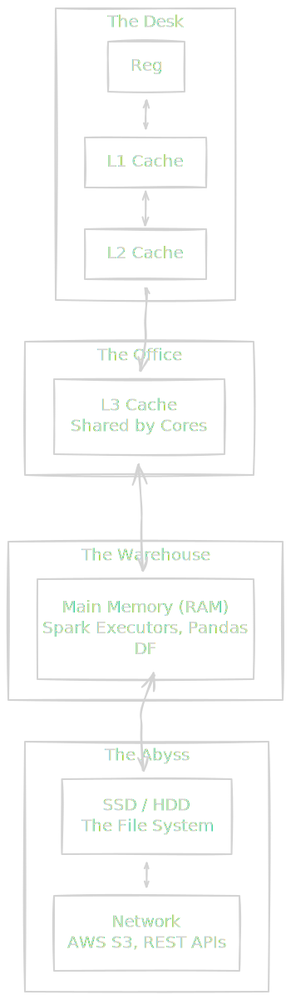
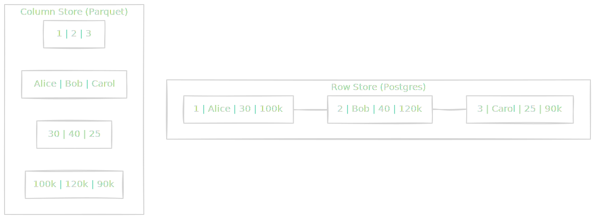

We have established that the CPU is a hyperactive clerk capable of doing billions of things per second. But there is a tragedy at the heart of computing: **The Clerk is lonely**.

Because the clerk is so fast, almost everything else in the universe is frustratingly slow. If the CPU requests a piece of data from RAM, it has to wait. And for a CPU, "waiting" is an eternity.

To mask this slowness, hardware engineers have built a complex system of lies and caches. We call this **The Memory Hierarchy**.

## 2.1 The Pyramid of Latency
The rule of storage is simple: **Fast, Big, Cheap — pick two**.

- You can have ultra fast memory (Registers), but it's tiny and expensive.
- You can have massive memory (Hard Drives), but it's slow.

This creates a pyramid structure. Your goal is to keep the "hot" data as close to the top of the pyramid as possible.



### The Humans Scale Analogy
Nanoseconds are hard for humans to visualize. 1 ns vs. 100 ns sounds like "fast vs. still fast."

To truly understand the pain of latency, let's scale the CPU's world up to **Human Time**.

Imagine **1 CPU Cycle (0.3 ns)** is **1 second** of your life.

| System Event | Actual Time | Human Scale (Analogy) |
|:---|:---|:---|
| 1 CPU Cycle | 0.3 ns | 1 Heartbeat (1 sec) |
| L1 Cache Reference | 0.5 ns | Glancing at a paper on your desk (2 sec) |
| L2 Cache Reference | 7 ns | Checking a filing cabinet in the room (14 sec) |
| Main Memory (RAM) | 100 ns | Walking to the coffee machine (4 min) |
| SSD Random Read | 150 μs | Waiting for a package delivery (4 days) |
| Network (Roundtrip within Region) | 500 μs | A standard vacation (2 weeks) |
| Network (Cross-Region / Internet) | 100 ms | A manned mission to Mars (10 years) |

### The Data Engineering Implication
Look at that table again.

When you write a Python script that iterates over a list in memory (RAM), the CPU is "walking to the coffee machine" for every single item. This is why Python loops are slow compared to C (which optimizes memory access).

But the real killer is the **Network**.

!!! tip "Data Engineering Context: The 'Shuffle' Tax"

    In distributed systems like **Apache Spark** or **Dask**, the most expensive operation is the **Shuffle**.

    A Shuffle happens when you do a `groupBy` or `join` that requires moving data from one server to another.

    In our analogy, processing data on the local CPU is like glancing at papers on a desk. But triggering a Shuffle is like saying, *"Okay, to finish this calculation, I need to send a team of astronauts to Mars to get the number 5."*

    This is why:

    1.  **Broadcast Joins** are fast: You send the small table to the astronaut *once*, so they don't have to leave the planet for every row.
    2.  **Data Locality** is king: Hadoop and Spark try to move the *computation* to the *data* (send the code to the disk), rather than moving the data to the code. It is cheaper to email the instructions to Mars than to ship the rocks back to Earth.

### L1, L2, and L3: The Invisible Hand
You cannot manually write code to put variables in L1 Cache. The hardware manages this for you automatically.

- **L1 (level 1)**: Tiny (KB). Private to each CPU core. Store variables used *right now*.
- **L2 (level 2)**: Small (MB). Also usually private.
- **L3 (level 3)**: Medium (MB). Shared across all cores. This is where data sits when different threads need to talk to each other.

If your data fits in L1/L2, your code flies. If it spills into RAM, you hit a "performance cliff."

!!! warning "The Cache Miss"

    A "Cache Miss" occurs when the CPU asks for data, checks L1, checks L2, checks L3, and finds nothing.

    The CPU effectively has to "stop the world," pause all execution, and wait hundreds of cycles for the data to arrive from RAM. In high-performance systems (like High-Frequency Trading or real-time stream processing), your entire goal is to minimize Cache Misses.

## 2.2 Spatial Locality
We know that fetching data from RAM is slow—it's the equivalent of walking 4 minutes to the coffee machine for every sip.

To fix this, hardware engineers made a brilliant observation about human behavior: **we are creatures of habit**.

If you ask for the first word on a page, you are almost certainly going to ask for the second word immediately after. You rarely read a book by picking random words from random pages.

This principle is called **Spatial Locality**.

### The Cache Line
When the CPU asks for a single byte of memory (say, `Age = 25`), the memory controller doesn't just send that one byte. It grabs the whole chunk of memory around it—usually 64 bytes—and sends the entire block at once.

This chunk is called a **Cache Line**:

- **You asked for**: `Address 100`.
- **The Hardware fetches**: `Address 100` to `Address 163`.

If your data is stored sequentially in memory (like an array or a list), the next 63 items you need are *already* in the fast L1 cache before you even ask for them. This is "free" speed.

### The Prefetcher
Modern CPUs have a specialized component called the **Hardware Prefetcher**. It watches your access patterns like a hawk.

If it sees you access `Address 100`, then `104`, then `108`, it predicts, "Aha! They are iterating through an array. I will secretly fetch `112`, `116`, and `120` from RAM right now, while they are busy processing `108`.

This turns the slow "stop-and-walk" access pattern into a smooth, continuous stream.

### The Data Engineering "Killer App": Columnar Storage
This hardware reality is the exact reason why data engineers obsess over **Parquet**, **ORC**, and **Snowflake** (Column-Oriented) instead of **CSV** or **Postgres** (Row-Oriented) for analytics.

Let's look at how a table is physically laid out in memory.

**The Data**:

| ID | Name | Age | Salary |
|:---|:---|:---|:---|
| 1 | Alice | 30 | 100k |
| 2 | Bob | 40 | 120k |
| 3 | Carol | 25 | 90k |

**Scenario A: Row-Oriented (CSV, Postgres, MySQL)**

In a standard database, data is stored row-by-row. `[1, Alice, 30, 100k] -> [2, Bob, 40, 120k] -> [3, Carol, 25, 90k]`.

**The Query**: `SELECT AVG(salary) FROM employees;`

1. CPU fetches `100k`. It also accidentally fetches `1, Alice, 30` (useless waste) because of the Cache Line.
2. CPU wants the next salary (`120k`). It  has to skip over `2, Bob, 40` to get there.
3. **Result**: The Prefetcher is confused. You are jumping around in memory.  You load tons of data (Names, IDs) into the cache just to throw it away.


**Scenario B: Column-Oriented (Parquet, Redshift, BigQuery)**

In an analytical store, data is stored column-by-column. `[1, 2, 3] -> [Alice, Bob, Carol] -> [30, 40 , 25] -> [100k, 120k, 90k]`.

**The Query**: `SELECT AVG(salary) FROM employees;`

1. CPU asks for `100k`.
2. The Cache line brings `120k` and `90k` along for the ride automatically.
3. **Result**: 100% of the data in the Cache Line was useful. The Prefetcher sees a perfectly sequential read pattern and maximizes throughput.



## 2.3 Temporal Locality
We just learned about **Spatial Locality** (if I need item X, I probably need item x + 1). This explains why reading a book page-by-page is faster than reading random words.

Now we meet its twin: **Temporal Locality**.

The principe is simple: **"If I used item X just now. I will probably use it again very soon."**

Think about a `for` loop in Python:

```python
total = 0
for i in range(1, 100000):
    total = total + i
```

The variable `total` is being accessed a million times in a fraction of a second. It would be insane to write `total` back to the slow RAM (the warehouse) every single time, only to fetch it back a nanosecond later.

Instead, the CPU keeps `total` in a **Register** or **L1 Cache** (the sticky note right on the desk). It modifies the sticky note a million times, and only when the loop is done does it walk over to the filing cabinet to save the final number.

### The Problem of Finite Space
The "Clerk's Desk" (Cache) is small. It can only hold a few megabytes of data. The "Warehouse" (RAM) is huge (Gigabytes). The "Universe" (Disk/Internet) is infinite (Terabytes/Petabytes).

Eventually, the desk gets full. When the CPU brings in a new piece of data, something else has to be thrown off the desk to make room. But what do we throw away.

We need an **Eviction Policy**.

### Least Recently Used (LRU)
The most common algorithm for this—used in everything from CPU hardware to Redis to your web browser—is **LRU (Least Recently Used)**.

The logic is ruthless:

- **New Data** gets a prime spot at the "front" of the desk.
- **Used Data** gets moved to the "front" (it is now "recently used").
- **Old Data** slowly drifts to the back.
- **Eviction**: When we need space, we grab whatever is at the very back (the item untouched for the longest time) and toss it into the trash (or write it back to slow RAM).


!!! tip "Data Engineering Context: The Spark Cache"

    As a data engineer, you control this manually when you use **Apache Spark**.

    When you run `df.cache()` or `df.persist()`, you are explicitly telling Spark, *"I am going to use this DataFrame multiple times (Temporal Locality). Please keep it in RAM and don't throw it away."*

    If you `cache()` too much data, Spark runs out of RAM. It then uses an **LRU Policy** to decide which partitions of your DataFrame to drop from memory and spill to disk.

    - **The Danger:** If your dataset is slightly larger than your RAM, you might trigger **Cache Thrashing**.
    - **Thrashing:** The system spends 100% of its time loading a partition, evicting it to make room for the next one, and then immediately needing to reload the one it just evicted. Your job freezes, and the CPU does nothing but move boxes back and forth.

## Quiz

<quiz>
In the 'Pyramid of Latency,' which of the following represents the correct ordering from Fastest/Smallest to Slowest/Largest?
- [ ] L1 Cache $\to$ RAM $\to$ L2 Cache $\to$ SSD
- [ ] RAM $\to$ Registers $\to$ SSD $\to$ Network
- [ ] L1 Cache $\to$ Registers $\to$ RAM $\to$ SSD
- [x] Registers $\to$ L1 Cache $\to$ RAM $\to$ Network

</quiz>

<quiz>
Using the 'Human Scale' analogy where 1 CPU cycle is 1 second, approximately how long does a Network Request (Cross-Region) take?
- [ ] 2 seconds (glancing at a paper).
- [ ] 4 days (waiting for a package).
- [x] 10 years (a mission to Mars).
- [ ] 4 minutes (walking to the coffee machine).

</quiz>

<quiz>
What is a Cache Line?
- [ ] A queue of instructions waiting to be executed by the ALU.
- [x] A 64-byte chunk of data fetched from memory whenever a single byte is requested.
- [ ] A specialized wire connecting the L1 and L2 caches.
- [ ] The boundary where data spills from RAM to disk.

</quiz>

<quiz>
Why is Columnar Storage (e.g., Parquet) generally faster than Row Storage (e.g., CSV) for analytical queries like `SELECT AVG(salary)`?
- [ ] It compresses integers into floating point numbers to save space.
- [ ] It uses a special 'salary' instruction set in the CPU.
- [ ] It bypasses the RAM and loads data directly into Registers.
- [x] It maximizes Spatial Locality by storing all 'Salary' values contiguously in memory.

</quiz>

<quiz>
Which concept explains why a Python `for` loop accessing the same variable repeatedly (e.g., a counter) is efficient?
- [ ] Write Amplification.
- [x] Temporal Locality.
- [ ] Branch Prediction.
- [ ] Spatial Locality.

</quiz>

<quiz>
In an LRU (Least Recently Used) Cache policy, which item is evicted when the cache is full?
- [x] The item that has gone untouched for the longest time.
- [ ] The item that was added most recently.
- [ ] The item with the largest file size.
- [ ] A random item is selected to prevent bias.

</quiz>

<quiz>
What is 'Thrashing' in the context of memory management?
- [ ] When a Cache Line fetches data that is never used.
- [ ] When a Hard Drive head crashes onto the platter.
- [x] When the system spends more time moving data between RAM and Disk than actually executing code.
- [ ] When the CPU overclocks itself and overheats.

</quiz>

<quiz>
What is the role of the Hardware Prefetcher?
- [ ] It compresses data before writing it to RAM to save space.
- [x] It observes memory access patterns and loads likely-to-be-needed data into the Cache before it is requested.
- [ ] It prevents the CPU from executing illegal instructions.
- [ ] It predicts which application you will open next.

</quiz>

<quiz>
The 'Rule of Storage' states you can pick two of which three characteristics?
- [x] Fast, Big, Cheap.
- [ ] Fast, Secure, Reliable.
- [ ] Read-Only, Write-Once, Rewriteable.
- [ ] Digital, Analog, Quantum.

</quiz>

<!-- mkdocs-quiz results -->