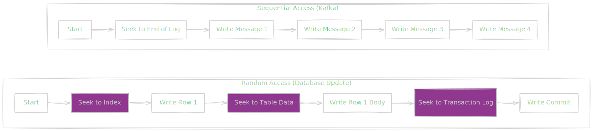
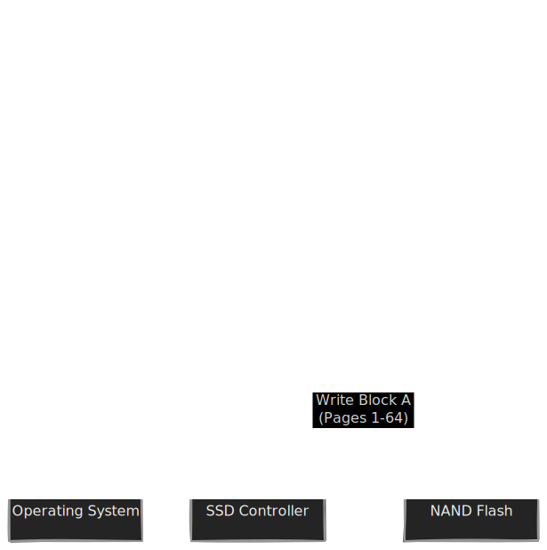
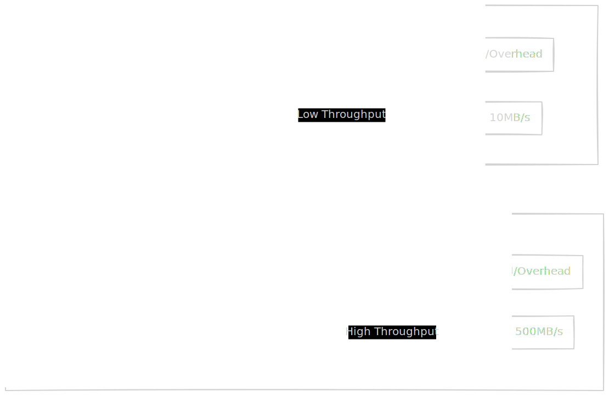

We have spent the first two modules living in the luxurious penthouse of the computer: the CPU and RAM. Life there is fast, expensive, and volatile. When the power goes out, the lights go off, and everything in RAM evaporates into the ether.

But data engineering is effectively the business of *not losing things*. We need persistence. We need to leave the penthouse and go down to the basement. It's cold down here, it's dusty, and compared to the nanosecond speeds of the CPU, it is excruciatingly slow.

Welcome to the world of I/O.

## 3.1  Hard Disk Drives (HDD) and Seek Time
To understand why your database queries are slow, you have to understand that for decades, the backbone of persistent storage was literally **spinning rust**.

A Hard Drive (HDD) is a mechanical miracle. It is not a solid block of digital magic; it is a physical machine with moving parts, motors, and aerodynamics. If you opened one up (which destroys it, so don't do that), it looks suspiciously like a high-tech record player.

Here is the mechanical breakdown:

1. **The Platter**: A circular disk made of glass or aluminum, coated in a thin layer of magnetic material. This is where your data lives.
2. **The Spindle**: The motor that spins the platters. Common speeds are 5,400, 7,200 RPM (rotations per minute).
3. **The Actuator Arm**: A mechanical arm that moves back and forth across the platter.
4. **The Head**: A tiny sensor on the tip of the arm that floats nanometers above the spinning platter, reading and writing magnetic charges (0s and 1s).

### The Agony of Physics
When your Python script executes `f.read()`, the computer can't just "think" the data into existence. It has to perform a physical ballet.

First, the **Actuator Arm** must physically move (seek) to the specific ring (track) on the platter where your data sits. Then, it must wait for the **Spindle** to rotate the platter until the correct sector is directly under the head.

This introduces two massive latency penalties:

1. **Seek Time**: The time it takes to move the arm. (Avg: ~4-10 ms)
2. **Rotational Latency**: The time it takes for the disk to spin. (Avg: ~4 ms at 7200 RPM).

To a CPU running at 3 GHz (where a cycle is 0.3 nanoseconds), waiting 10 milliseconds for a disk is an eternity. It is the equivalent of a human waiting **months** for a package to arrive.

!!! note "The Cost of Randomness"

    The physical nature of the arm is why **Random I/O** is the enemy of performance.

    If you ask for 10 files scattered all over the disk, the arm has to:

    - Move $\to$ Stop $\to$ Read $\to$ Move $\to$ Stop $\to$ Read.

    This is thrashing. The disk spends more time moving the arm than actually reading data.

### Sequential I/O: The Loophole
However, there is a loophole in the laws of physics. If you arrange your data so that it is physically contiguous—meaning File A is right next to File B on the platter—the arm doesn't have to move. It just parts itself in one spot, and the spinning platter feeds the data under the head like a firehose.

This is **Sequential I/O**:

- **Random I/O Throughput**: ~1-2 MB/sec (limited by arm movement).
- **Sequential I/O Throughput**: ~100-200 MB/sec (limited by spin speed).

The difference is two orders of magnitude. This single physical constraint dictates the architecture of almost every high-performance data system.

!!! tip "Data Engineering Context: Why Kafka is Fast"

    You will often hear that Apache Kafka is "fast." This is confusing to new engineers because Kafka persists everything to disk, and we just established that disks are slow.

    Kafka is fast because it is aggressively designed to perform **Sequential I/O**.

    Kafka logs are "append-only." It never modifies old data; it just writes new messages to the end of the file. This means the HDD actuator arm rarely has to seek. It stays at the end of the file, writing data as fast as the platter can spin.

    By understanding the physics of the actuator arm, Kafka turns a slow medium (disk) into a fast stream.

In the diagram above, the pink boxes represent "wasted time" moving the arm. The Kafka model (right) eliminates the waste, allowing the disk to operate at maximum theoretical throughput.

## 3.2 Solid State Drives (SSD) and Flash
If HDDs are mechanical record players, Solid State Drives (SSDs) are electronic prisons.

There are no moving parts. No spinning platters, no seeking arms, no humming motors. An SSD is completely silent because it is purely chemistry and electricity.

Under the hood, an SSD is an array of **NAND Flash** memory cells. To store a bit of data, we literally trap electrons inside a "floating gate" transistor. We shove electrons into a microscopic cage and lock the door. If electrons are in the cage, it's a 0. If the cage is empty, it's a 1.

Because we don't have to physically move a robot arm to find data, the "Seek Time" drops from milliseconds (HDD) to microseconds (SSD). That is a **1000x speedup**.

However, Flash memory has a very dirty secret.

### The Block/Page Dilemma
You might assume that because SSDs are faster, they are better in every way. But Flash memory has a bizarre physical limitation that dictates how we write software for it.

Flash memory is organized into **Pages** (usually 4 KB) and **Blocks** (usually 256 KB, consisting of 64 Pages).

Here are the rules of the prison:

1. **Reads** happen at the **page** level. (Fast and granular).
2. **Writes** happen at the **page** level. (You can write to an empty page easily).
3. **Erases** happen at the **block** level.

**Read that again**. You cannot erase a single page. If you want to overwrite data in Page 1, you cannot simply "update" it. You have to erase the *entire* block (pages 1 through 64) and rewrite it.

### Write Amplification
Imagine you live in an apartment complex (a block). You want to renovate your kitchen (page 1). In the HDD world, you just walk in and renovate the kitchen.

In the SSD world, the landlord says, "Sorry, to change your kitchen, we have to evict everyone in the building, bulldoze the entire complex, rebuild it from scratch with your new kitchen, and then move everyone else back in."

This phenomenon is called **Write Amplification**.

When you update a single row in a database on an SSD, the drive controller often performs a "Read-Modify-Write" cycle:

1. Read the entire block into a cache.
2. Update the specific page in the cache.
3. Erase the actual block on the chip.
4. Write the entire block back.

This is why SSDs wear out. The insulation that traps the electrons degrades slightly every time you blast it with the high voltage required to erase a block. Eventually, the cage breaks, the electronics leak out, and the drive dies.

!!! warning "The Hidden Cost of Updates"

    This physics lesson is why **Log-Structured Merge Trees (LSM Trees)**—the data structure behind RocksDB, Cassandra, and BigTable—are so popular.

    LSM Trees avoid updating data in place. Instead, they just write new versions of the data to a new location (Append Only). This plays nicely with SSD physics because it avoids the "Bulldoze the Building" problem of Write Amplification.

### NVMe vs. SATA
For a long time, we plugged these super-fast SSDs into our computers using **SATA** cables. This was like buying a Ferrari and driving it in a school zone.

SATA was designed for spinning HDDs. It has a command queue depth of 32 (it can only handle 32 requests at once) and tops out around 600 MB/sec. It simply cannot handle the speed of Flash.

Enter **NVMe** (Non-Volatile Memory Express). NVMe is not a cable; it connects the storage directly to the CPU via the PCI Express bus (the same superhighway your graphics card uses).

!!! tip "Data Engineering Context: Throughput Bottlenecks"
 
    When sizing cloud instances (like AWS EC2), pay attention to the storage interface.
 
    - **SATA SSD (gp2/gp3)**: Good for general boot drives. Capped throughput.
    - **NVMe SSD (Instance Store / io2)**: Massive throughput.

    If you are building a high-performance database or a heavy Spark shuffle node, a SATA interface will choke long before the SSD actually hits its limit. NVMe supports 64,000 queues with 64,000 commands each. It removes the interface as the bottleneck.

## 3.3 The I/O Subsystem
We have looked at the hardware. Now let's look at the speedometer.

When you are debugging a slow data pipeline and you suspect the disk is the culprit, you will usually look at a dashboard (like CloudWatch or `iostat` in Linux). You will see two numbers that seem related but often tell completely different stories: **IOPS** and **Throughput**.

Confusing these two is the single most common mistake in cloud infrastructure sizing.

### The Grocery Store Analogy
Imagine a grocery store checkout lane.

1. **IOPS (Input/Output Operations Per Second)**: This is the number of **customers** passing through the checkout counter per second. It doesn't matter if the customer buys a single pack of gum or a full cart; checking them out is one "operation."
    - *Metric*: Transactions per second.
    - *Constraint*: The cashier's speed (latency).
2. **Throughput (Bandwidth)**: This is the total **weight of groceries** leaving the store per second.
    - *Metric*: Megabytes per second (MB/s).
    - *Constraint*: The width of the conveyor belt.

#### The Math of Movement
These two metrics are tied together by a simple physical equation:

$$
\text{Throughput } = \text{IOPS } \times \text{ Block Size}
$$

This equation reveals the fundamental trade-off in systems architecture.

- **Small Block Size (4 KB)**: If you are reading tiny 4 KB chunks (like looking up a user ID in a database index), you need massive IOPs to move any significant amount of data.
- **Large Block Size (1 MB+)**: If you are reading huge chunks (like scanning a Parquet file), you can achieve massive throughput with very low IOPs.

#### Sizing Your "Pipes"
Why does this matter? Because cloud providers like AWS sell you these metrics **separately**.

If you buy a storage drive that offers "3,000 IOPS," you might think that's fast. But if your application writes tiny 4 KB logs, your throughput is:

$$
3,000 \times 4 \text{ KB } = 12 \text{ MB/sec}
$$

12 MB/sec is pathetic. Your laptop from 2010 was faster. You have bottlenecked your system not because the disk is slow, but because you are using it inefficiently.

!!! tip "Data Engineering Context: Configuring AWS EBS"

    As a data engineer, you are constantly provisioning storage (EBS volumes). You must match the volume type to the workload type.

    **1. The Transactional Database (Postgres/MySQL)**

    - **Behavior:** Thousands of tiny, random updates (User clicks, orders).
    - **Need:** High IOPS.
    - **Choice:** Use **`io2` or `gp3`** volumes. You are paying for the "cashier's speed."

    **2. The Data Warehouse / Data Lake (Spark/Kafka)**
    - **Behavior:** Reading massive, contiguous blocks of history logs or Parquet files.
    - **Need:** High Throughput.
    - **Choice:** Use **`st1` (Throughput Optimized HDD)**.

    *Wait, HDD?* Yes. For streaming data, spinning rust is still incredibly cost-effective. Because you are reading sequentially, you don't pay the Seek Time penalty. You get massive bandwidth (500 MB/s) for pennies, provided you don't ask it to do random seeks.

!!! warning "The 'Burst Balance' Trap"
    
    Many cloud disks (like AWS `gp2`) operate on a "token bucket" credit system. You earn IOPS credits when idle and spend them when active.

    If you run a heavy ETL job that runs for 4 hours, you might burn through your entire bucket in the first hour. Suddenly, your disk speed throttles down to the base level (which can be as slow as an old floppy disk), and your pipeline grinds to a halt. Always monitor your **Burst Balance** metric.

## Quiz

<quiz>
In a traditional Hard Disk Drive (HDD), which action contributes most significantly to latency (slowness)?
- [x] The Seek Time required for the actuator arm to physically move to the correct track.
- [ ] The time it takes for the data to travel down the SATA cable.
- [ ] The Rotational Latency of the spindle spinning.
- [ ] The time it takes for the CPU to request the data.

</quiz>

<quiz>
Why is 'Random I/O' considered the enemy of performance on HDDs?
- [x] The actuator arm spends more time moving (seeking) than actually reading data.
- [ ] The operating system cannot index random files.
- [ ] Random I/O causes the disk to overheat.
- [ ] The disk must stop spinning to switch files.

</quiz>

<quiz>
Apache Kafka is designed to be fast on spinning disks because it prioritizes which type of I/O?
- [x] Sequential I/O.
- [ ] Cached I/O.
- [ ] Asynchronous I/O.
- [ ] Random I/O.

</quiz>

<quiz>
In an SSD, why can't you simply overwrite a single 4 KB Page of data?
- [ ] SSDs are Read-Only devices.
- [x] Flash memory can only be erased at the Block level, not the Page level.
- [ ] The NVMe interface prevents small updates.
- [ ] Flash memory treats 0s and 1s as permanent states.

</quiz>

<quiz>
What is 'Write Amplification' on an SSD?
- [ ] When the SSDD automatically compresses data to save space.
- [x] When a small software write triggers a much larger physical write sequence (Read-Modify-Erase-Write).
- [ ] The noise generated by the SSD when writing data.
- [ ] The boost in speed achieved by using NVMe over SATA.

</quiz>

<quiz>
If you are sizing a database (OLTP) that handles thousands of small user transactions per second, which metric is your primary bottleneck?
- [ ] Disk capacity (GB).
- [ ] Sequential Read Speed.
- [ ] Throughput (MB/s).
- [x] IOPS (Input/Output Operations Per Second).

</quiz>

<quiz>
Which formula correctly defines the relationship between Throughput and IOPS?
- [ ] Throughput = IOPS + Latency.
- [ ] Throughput = IOPS / Block Size.
- [x] Throughput = IOPS $\times$ Block Size.
- [ ] Throughput = IOPS $\times$ Seek Time.

</quiz>

<quiz>
Why might a data warehouse (OLAP) workload prefer "Throughput Optimized HDD" (`st1`) storage over expensive SSDs?
- [ ] Because data warehouses don't care about speed.
- [x] Because they primarily perform Sequential I/O on large files.
- [ ] Because HDDs do not suffer from bit rot.
- [ ] Because HDDs have better random access performance.

</quiz>

<quiz>
What is the primary advantage of the NVMe interface over the older SATA interface?
- [ ] NVMe disks have moving parts for better cooling.
- [ ] NVMe is cheaper to manufacture.
- [ ] NVMe disks are physically smaller.
- [x] NVMe connects via the PCIe bus, supporting massive parallelism and queues.

</quiz>

<quiz>
What happens if you exhaust the 'Burst Balance' on a credit-based cloud disk (like AWS `gp2`)?
- [ ] The data becomes read-only.
- [ ] The disk automatically upgrades to the next tier.
- [x] Performance throttles down to the baseline speed.
- [ ] The disk crashes and data is lost.

</quiz>

<!-- mkdocs-quiz results -->